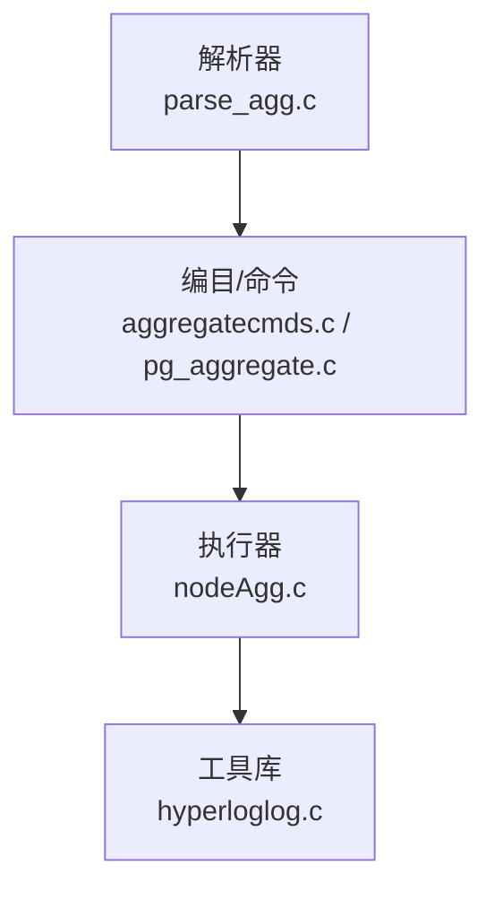
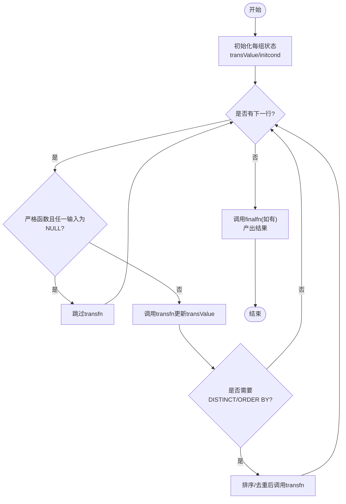
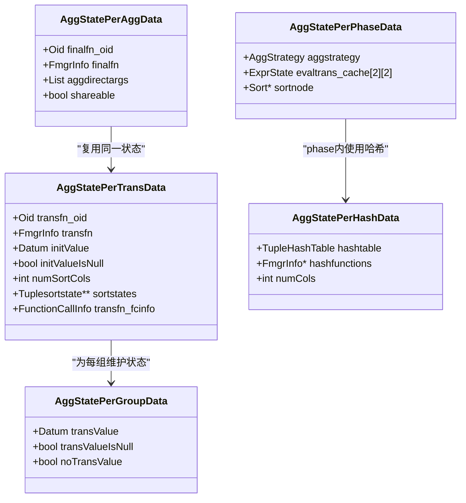
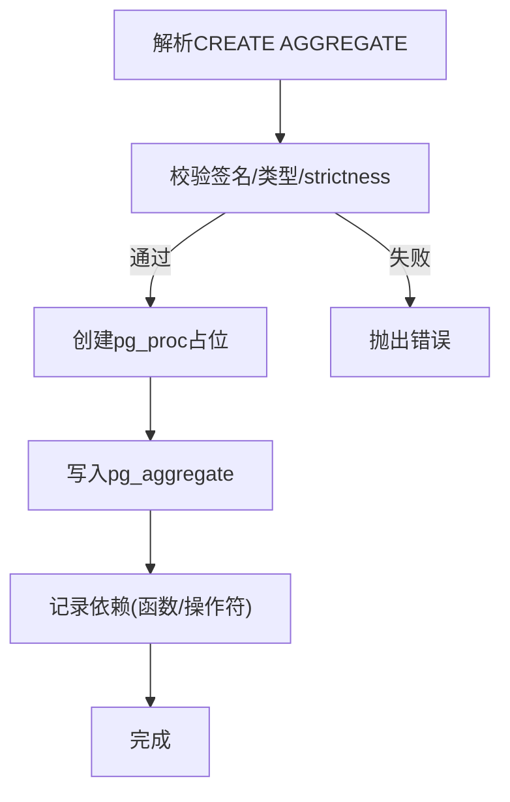
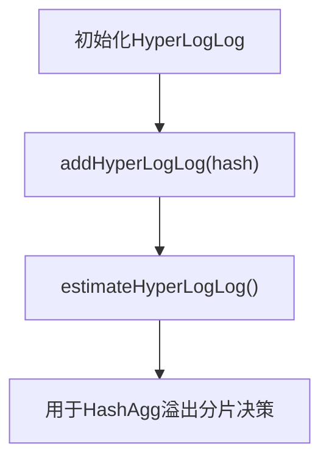
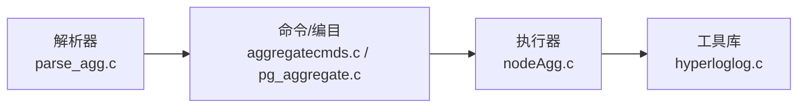

# 聚合处理机制

<cite>
**本文引用的文件**
- [nodeAgg.c](file://src/backend/executor/nodeAgg.c)
- [nodeAgg.h](file://src/include/executor/nodeAgg.h)
- [pg_aggregate.c](file://src/backend/catalog/pg_aggregate.c)
- [aggregatecmds.c](file://src/backend/commands/aggregatecmds.c)
- [parse_agg.c](file://src/backend/parser/parse_agg.c)
- [hyperloglog.c](file://src/backend/lib/hyperloglog.c)
</cite>

## 目录
1. [简介](#简介)
2. [项目结构](#项目结构)
3. [核心组件](#核心组件)
4. [架构总览](#架构总览)
5. [详细组件分析](#详细组件分析)
6. [依赖关系分析](#依赖关系分析)
7. [性能考量](#性能考量)
8. [故障排查指南](#故障排查指南)
9. [结论](#结论)
10. [附录](#附录)

## 简介
本文件系统性阐述 Mini PostgreSQL 的聚合执行机制，覆盖分组聚合、窗口函数与近似聚合的实现要点；详细说明聚合状态维护、增量计算优化、中间结果存储与最终结果生成过程；文档化聚合函数的注册机制、参数传递、类型转换与错误处理；并提供执行流程图、内存管理策略、性能调优技巧与常见问题解决方案，帮助读者高效实现和调优复杂聚合查询。

## 项目结构
围绕聚合的关键代码分布在以下模块：
- 解析阶段：负责识别并规范化聚合调用、区分直接参数与聚合参数、处理 ORDER BY/DISTINCT 等语义。
- 命令与编目：定义 CREATE AGGREGATE 语法、校验签名、写入系统表 pg_aggregate。
- 执行器：实现 Agg 节点，包括哈希聚合、排序聚合、滚动分组集（ROLLUP）、部分聚合与合并、溢出到磁盘等。
- 工具库：提供 HyperLogLog 近似基数估计，用于分片溢出时的基数估算。



图表来源
- [parse_agg.c:104-251](file://src/backend/parser/parse_agg.c#L104-L251)
- [aggregatecmds.c:54-467](file://src/backend/commands/aggregatecmds.c#L54-L467)
- [pg_aggregate.c:44-783](file://src/backend/catalog/pg_aggregate.c#L44-L783)
- [nodeAgg.c:1-230](file://src/backend/executor/nodeAgg.c#L1-L230)
- [hyperloglog.c:65-222](file://src/backend/lib/hyperloglog.c#L65-L222)

章节来源
- [parse_agg.c:104-251](file://src/backend/parser/parse_agg.c#L104-L251)
- [aggregatecmds.c:54-467](file://src/backend/commands/aggregatecmds.c#L54-L467)
- [pg_aggregate.c:44-783](file://src/backend/catalog/pg_aggregate.c#L44-L783)
- [nodeAgg.c:1-230](file://src/backend/executor/nodeAgg.c#L1-L230)
- [hyperloglog.c:65-222](file://src/backend/lib/hyperloglog.c#L65-L222)

## 核心组件
- 解析器（parse_agg.c）
  - 将 SQL 中的聚合调用转换为内部 Aggref 节点，分离直接参数与聚合参数，构建目标列与排序/去重信息。
  - 检查聚合嵌套、作用域限制、窗口框架约束等。
- 命令与编目（aggregatecmds.c, pg_aggregate.c）
  - 解析 CREATE AGGREGATE 子句，校验 sfunc/finalfunc/combinefunc/serialfunc/deserialfunc/moving-aggregate 等签名与类型一致性。
  - 在 pg_proc 与 pg_aggregate 中创建/更新条目，建立依赖关系。
- 执行器（nodeAgg.c, nodeAgg.h）
  - 维护每个分组/每组的聚合状态（transValue），按策略（哈希/排序/混合）推进 transfn，必要时调用 finalfn。
  - 支持 DISTINCT/ORDER BY 的排序与去重，支持分组集（GROUPING SETS/ROLLUP）多阶段处理。
  - 支持部分聚合（serialize/deserialize + combine），支持溢出到磁盘（LogicalTapeSet）与分批重放。
  - 使用 HyperLogLog 估计溢出分区基数以控制分片数量。
- 工具库（hyperloglog.c）
  - 提供固定空间开销的 HyperLogLog 基数估计，用于 HashAgg 溢出阶段的分区选择与递归策略。

章节来源
- [parse_agg.c:104-251](file://src/backend/parser/parse_agg.c#L104-L251)
- [aggregatecmds.c:54-467](file://src/backend/commands/aggregatecmds.c#L54-L467)
- [pg_aggregate.c:44-783](file://src/backend/catalog/pg_aggregate.c#L44-L783)
- [nodeAgg.c:1-230](file://src/backend/executor/nodeAgg.c#L1-L230)
- [nodeAgg.h:21-334](file://src/include/executor/nodeAgg.h#L21-L334)
- [hyperloglog.c:65-222](file://src/backend/lib/hyperloglog.c#L65-L222)

## 架构总览
聚合从 SQL 解析开始，经命令层注册到编目，再由执行器根据计划策略执行。执行期通过“过渡函数 + 可选最终函数”的模式增量维护状态，必要时进行序列化/反序列化与合并，支持大规模数据的哈希聚合与磁盘溢出。

```mermaid
sequenceDiagram
Client as "客户端"
Parser as "解析器<br/>parse_agg.c"
Cmd as "命令层<br/>aggregatecmds.c"
Catalog as "编目<br/>pg_aggregate.c"
Exec as "执行器<br/>nodeAgg.c"
HLL as "HyperLogLog<br/>hyperloglog.c"
Client->>Parser : "发送SQL(含聚合)"
Parser-->>Cmd : "构造Aggref/分组/排序信息"
Cmd->>Catalog : "CREATE AGGREGATE(校验/写入)"
Catalog-->>Cmd : "返回对象地址"
Cmd-->>Exec : "计划与执行上下文"
Exec->>Exec : "初始化AggState/PerTrans/PerGroup"
loop 输入行
Exec->>Exec : "推进transfn(可能DISTINCT/ORDER BY)"
alt 哈希表超限
Exec->>HLL : "估计基数(溢出分区)"
Exec->>Exec : "溢出到LogicalTapeSet并分批重放"
end
end
Exec-->>Client : "finalfn输出结果"
```

图表来源
- [parse_agg.c:104-251](file://src/backend/parser/parse_agg.c#L104-L251)
- [aggregatecmds.c:54-467](file://src/backend/commands/aggregatecmds.c#L54-L467)
- [pg_aggregate.c:44-783](file://src/backend/catalog/pg_aggregate.c#L44-L783)
- [nodeAgg.c:1-230](file://src/backend/executor/nodeAgg.c#L1-L230)
- [hyperloglog.c:65-222](file://src/backend/lib/hyperloglog.c#L65-L222)

## 详细组件分析

### 聚合节点执行流程（分组聚合/有序聚合/哈希聚合）
- 基本流程
  - 初始化每组/每个分组集的 transValue（可为 NULL 或显式 initcond）。
  - 对每条输入元组，若为严格函数且存在 NULL 输入则跳过；否则调用 transfn 更新状态。
  - 结束时调用 finalfn（若无 finalfn，则直接返回 transValue）。
- 有序与 DISTINCT
  - 需要排序时，使用 Tuplesort 缓存输入并按 ORDER BY/DISTINCT 规则处理后调用 transfn。
- 哈希聚合
  - 使用 TupleHashTable 维护分组键与 per-group 状态；当内存超限时进入溢出模式，按 LogicalTapeSet 分片写入并重放。
- 分组集（GROUPING SETS/ROLLUP）
  - 将不同分组集组织为多个 phase，phase 0 通常为哈希，后续 phase 为排序；在每个 phase 内按顺序重置更细粒度的分组状态。



图表来源
- [nodeAgg.c:1-230](file://src/backend/executor/nodeAgg.c#L1-L230)
- [nodeAgg.h:21-334](file://src/include/executor/nodeAgg.h#L21-L334)

章节来源
- [nodeAgg.c:1-230](file://src/backend/executor/nodeAgg.c#L1-L230)
- [nodeAgg.h:21-334](file://src/include/executor/nodeAgg.h#L21-L334)

### 聚合状态与内存管理
- 状态结构
  - AggStatePerTransData：保存 transfn/serial/deserial 信息、排序信息、初始值、输入/过渡类型长度与 byval 标志等。
  - AggStatePerAggData：保存 finalfn 信息与共享性标记。
  - AggStatePerGroupData：每组/每个分组集的 transValue、是否为空、是否尚未设置等。
  - AggStatePerPhaseData：每个 phase 的策略、分组集、排序节点、表达式求值缓存等。
  - AggStatePerHashData：哈希表、迭代器、槽位、哈希函数与相等函数等。
- 内存上下文
  - 临时上下文 tmpcontext：每行重置，用于表达式求值与过渡函数调用。
  - 聚合上下文 aggcontexts：按分组集分配，存放跨行的过渡值与哈希表结构。
  - hashcontext：统一用于所有哈希表的上下文。
- 溢出与分片
  - 当哈希表超过阈值，进入 spill 模式，仅推进已有分组的状态，新分组数据写入 LogicalTapeSet，并使用 HyperLogLog 估计基数决定分片数，分批重放。



图表来源
- [nodeAgg.h:21-334](file://src/include/executor/nodeAgg.h#L21-L334)
- [nodeAgg.c:1-230](file://src/backend/executor/nodeAgg.c#L1-L230)

章节来源
- [nodeAgg.h:21-334](file://src/include/executor/nodeAgg.h#L21-L334)
- [nodeAgg.c:1-230](file://src/backend/executor/nodeAgg.c#L1-L230)

### 聚合函数注册机制（CREATE AGGREGATE）
- 参数解析与校验
  - 解析 sfunc/stype/initcond、finalfunc、combinefunc、serialfunc/deserialfunc、moving-aggregate（msfunc/minvfunc/mfinalfunc/mstype/msspace/minitcond）等。
  - 校验 transition 类型与函数签名一致性，确保 strictness 兼容，禁止非法伪类型等。
- 编目写入
  - 在 pg_proc 创建占位条目，再在 pg_aggregate 写入聚合元数据，建立依赖关系。
- 错误处理
  - 对参数缺失、类型不匹配、strict 冲突、INTERNAL 使用限制等进行报错。



图表来源
- [aggregatecmds.c:54-467](file://src/backend/commands/aggregatecmds.c#L54-L467)
- [pg_aggregate.c:44-783](file://src/backend/catalog/pg_aggregate.c#L44-L783)

章节来源
- [aggregatecmds.c:54-467](file://src/backend/commands/aggregatecmds.c#L54-L467)
- [pg_aggregate.c:44-783](file://src/backend/catalog/pg_aggregate.c#L44-L783)

### 参数传递、类型转换与错误处理
- 参数传递
  - 解析阶段将直接参数与聚合参数分离，构建目标列与排序/去重列表。
  - 执行期通过预构建的 FunctionCallInfo 与表达式求值管线，避免重复开销。
- 类型转换
  - 校验 transition 类型与输入类型的二进制可转换性（当 strict 且无 initcond 时要求一致）。
  - 对 moving-aggregate 的 forward/inverse 函数 strictness 必须一致。
- 错误处理
  - 解析阶段：禁止在 JOIN/WHERE/FROM 等位置使用聚合；检测嵌套聚合与 CTE 层级问题。
  - 命令阶段：拒绝非法组合（如仅指定 serialfunc 未指定 deserialfunc）。
  - 执行阶段：严格函数对 NULL 输入的处理、finalfn 的 strict 行为等。

章节来源
- [parse_agg.c:104-251](file://src/backend/parser/parse_agg.c#L104-L251)
- [aggregatecmds.c:54-467](file://src/backend/commands/aggregatecmds.c#L54-L467)
- [pg_aggregate.c:44-783](file://src/backend/catalog/pg_aggregate.c#L44-L783)
- [nodeAgg.c:1-230](file://src/backend/executor/nodeAgg.c#L1-L230)

### 窗口函数与聚合的关系
- 窗口函数在解析阶段受限于窗口框架（RANGE/ROWS/GROUPS）不允许包含聚合。
- 聚合与窗口函数在语义上相互独立；窗口函数通常基于窗口帧进行计算，而聚合节点专注于分组与汇总。

章节来源
- [parse_agg.c:300-602](file://src/backend/parser/parse_agg.c#L300-L602)

### 近似聚合（HyperLogLog）
- 用途：在 HashAgg 溢出阶段估计分区基数，决定分片数量，减少递归溢出风险。
- 算法要点：固定位宽寄存器数组，利用哈希最高位选择桶，次高位计算 rank，结合 alphaMM 校正与大小范围修正。
- 集成点：nodeAgg.c 在溢出路径中使用 HyperLogLog 估计，辅助决策。



图表来源
- [hyperloglog.c:65-222](file://src/backend/lib/hyperloglog.c#L65-L222)
- [nodeAgg.c:270-306](file://src/backend/executor/nodeAgg.c#L270-L306)

章节来源
- [hyperloglog.c:65-222](file://src/backend/lib/hyperloglog.c#L65-L222)
- [nodeAgg.c:270-306](file://src/backend/executor/nodeAgg.c#L270-L306)

## 依赖关系分析
- 解析器依赖编目与优化器接口，生成 Aggref 与分组/排序信息。
- 命令层依赖类型系统与函数解析，确保聚合定义合法。
- 执行器依赖编目元数据（pg_aggregate）与工具库（HyperLogLog、Tuplesort、LogicalTapeSet）。
- 执行期通过 fmgr 调用 transfn/finalfn/combinefunc/serialfunc/deserialfunc，依赖函数注册与查找。



图表来源
- [parse_agg.c:104-251](file://src/backend/parser/parse_agg.c#L104-L251)
- [aggregatecmds.c:54-467](file://src/backend/commands/aggregatecmds.c#L54-L467)
- [pg_aggregate.c:44-783](file://src/backend/catalog/pg_aggregate.c#L44-L783)
- [nodeAgg.c:1-230](file://src/backend/executor/nodeAgg.c#L1-L230)
- [hyperloglog.c:65-222](file://src/backend/lib/hyperloglog.c#L65-L222)

章节来源
- [parse_agg.c:104-251](file://src/backend/parser/parse_agg.c#L104-L251)
- [aggregatecmds.c:54-467](file://src/backend/commands/aggregatecmds.c#L54-L467)
- [pg_aggregate.c:44-783](file://src/backend/catalog/pg_aggregate.c#L44-L783)
- [nodeAgg.c:1-230](file://src/backend/executor/nodeAgg.c#L1-L230)
- [hyperloglog.c:65-222](file://src/backend/lib/hyperloglog.c#L65-L222)

## 性能考量
- 表达式与函数调用优化
  - 预构建表达式树与 FunctionCallInfo，减少每行开销；支持 JIT 编译整段表达式。
- 内存与上下文
  - 使用 per-tuple 临时上下文与 per-group 聚合上下文，避免频繁 palloc/pfree；谨慎处理 pass-by-ref 的过渡值复制。
- 哈希聚合与溢出
  - 合理设置哈希表桶数与内存限制；启用溢出模式时使用 HyperLogLog 估计基数，控制分片数量，降低递归溢出成本。
- 排序与去重
  - 单列 DISTINCT 可使用 Datum 排序器，多列使用堆排序；仅在必要时排序，避免额外 I/O。
- 部分聚合与合并
  - 使用 serialize/deserialize + combine 提升并行与分布式场景效率。

[本节为通用性能指导，无需特定文件引用]

## 故障排查指南
- 解析阶段错误
  - 在 JOIN/WHERE/FROM 等位置使用聚合：检查 SQL 结构与作用域。
  - 嵌套聚合或 CTE 层级不当：调整查询层次或使用子查询。
- 命令阶段错误
  - 缺少必要定义（如 stype/sfunc）：补全定义。
  - 类型不匹配或 strict 冲突：修正函数签名与 strict 标记。
  - 仅指定 serialfunc 未指定 deserialfunc：成对提供。
- 执行阶段错误
  - 严格函数对 NULL 输入的处理不符合预期：检查 transfn 逻辑与 initcond。
  - 哈希表溢出导致性能下降：增大 work_mem 或调整哈希策略；关注溢出日志。
  - 窗口框架限制：避免在 RANGE/ROWS/GROUPS 中使用聚合。

章节来源
- [parse_agg.c:300-602](file://src/backend/parser/parse_agg.c#L300-L602)
- [aggregatecmds.c:54-467](file://src/backend/commands/aggregatecmds.c#L54-L467)
- [pg_aggregate.c:44-783](file://src/backend/catalog/pg_aggregate.c#L44-L783)
- [nodeAgg.c:1-230](file://src/backend/executor/nodeAgg.c#L1-L230)

## 结论
Mini PostgreSQL 的聚合机制以“过渡函数 + 最终函数”为核心，结合哈希/排序策略、分组集多阶段处理、部分聚合与磁盘溢出，提供了高扩展性与高性能的聚合能力。通过严格的解析与编目校验、精细的内存管理与表达式优化，以及 HyperLogLog 近似估计，能够支撑复杂聚合查询的高效执行。建议在实际使用中关注 work_mem、哈希策略与溢出行为，并结合 EXPLAIN 输出进行调优。

[本节为总结性内容，无需特定文件引用]

## 附录
- 关键数据结构参考
  - AggStatePerTransData：过渡函数与排序信息、初始值、类型长度与 byval 标志。
  - AggStatePerAggData：最终函数与直接参数、结果类型信息、共享性。
  - AggStatePerGroupData：每组/分组集的 transValue 与状态标志。
  - AggStatePerPhaseData：phase 策略、分组集、排序节点、表达式缓存。
  - AggStatePerHashData：哈希表、哈希函数、相等函数、列索引映射。

章节来源
- [nodeAgg.h:21-334](file://src/include/executor/nodeAgg.h#L21-L334)