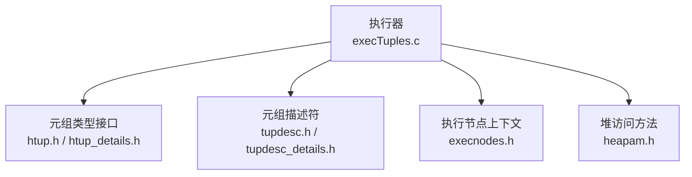
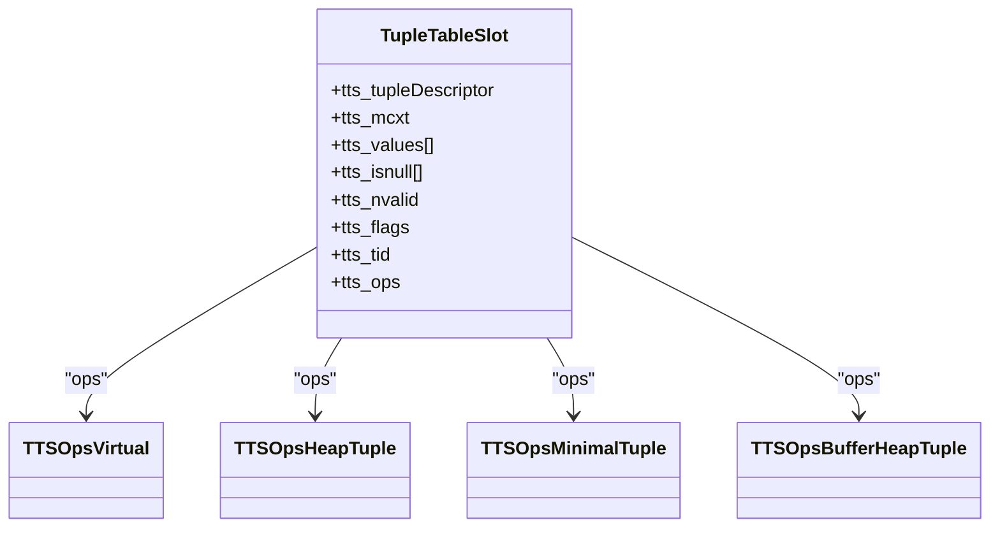
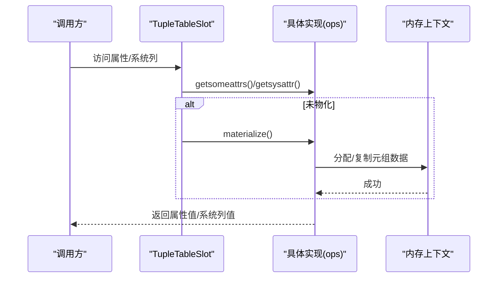
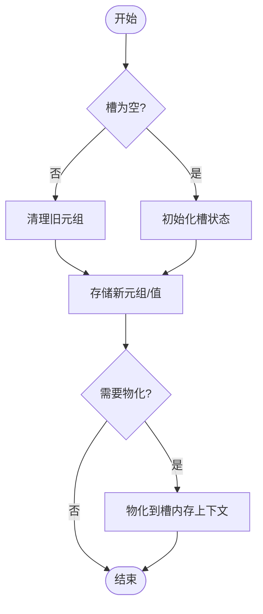
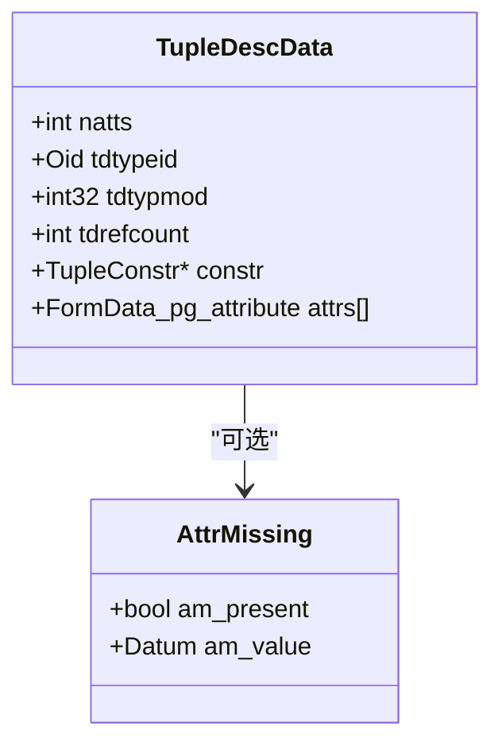
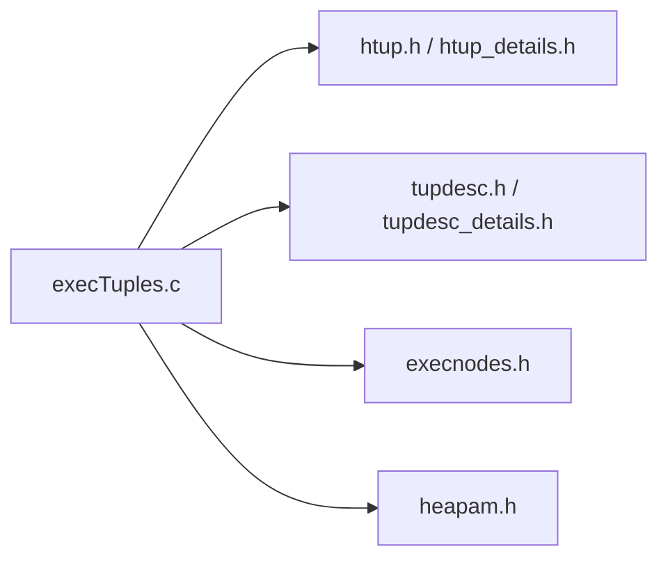

# 元组管理

<cite>
**本文引用的文件**
- [execTuples.c](file://src/backend/executor/execTuples.c)
- [htup.h](file://src/include/access/htup.h)
- [htup_details.h](file://src/include/access/htup_details.h)
- [tupdesc.h](file://src/include/access/tupdesc.h)
- [tupdesc_details.h](file://src/include/access/tupdesc_details.h)
- [execnodes.h](file://src/include/nodes/execnodes.h)
- [heapam.h](file://src/include/access/heapam.h)
</cite>

## 目录
1. [简介](#简介)
2. [项目结构](#项目结构)
3. [核心组件](#核心组件)
4. [架构总览](#架构总览)
5. [详细组件分析](#详细组件分析)
6. [依赖关系分析](#依赖关系分析)
7. [性能考量](#性能考量)
8. [故障排查指南](#故障排查指南)
9. [结论](#结论)
10. [附录](#附录)

## 简介
本文件面向Mini PostgreSQL的元组管理系统，聚焦TupleTableSlot的设计与实现、元组存储格式、内存分配与生命周期管理、以及元组的创建/复制/转换/释放机制。文档同时覆盖元组描述符（TupleDesc）的使用、属性访问模式与系统列处理，并提供最佳实践与性能优化建议，帮助开发者高效、安全地管理元组数据。

## 项目结构
围绕元组管理的核心代码主要分布在执行器与访问层：
- 执行器侧：TupleTableSlot及其多种实现（Virtual、HeapTuple、MinimalTuple、BufferHeapTuple）在execTuples.c中集中实现。
- 元组头与存储格式：HeapTupleData、HeapTupleHeaderData、MinimalTuple等定义于htup.h与htup_details.h。
- 元组描述符：TupleDescData及构造/拷贝/引用计数接口在tupdesc.h；缺失属性默认值结构在tupdesc_details.h。
- 执行节点上下文：execnodes.h定义了执行期状态节点，包含对TupleTableSlot的广泛使用。
- 堆访问接口：heapam.h提供扫描、获取、插入、更新、删除等与元组交互的API。

图表来源
- [execTuples.c:83-86](file://src/backend/executor/execTuples.c#L83-L86)
- [htup.h:31-71](file://src/include/access/htup.h#L31-L71)
- [htup_details.h:152-180](file://src/include/access/htup_details.h#L152-L180)
- [tupdesc.h:79-89](file://src/include/access/tupdesc.h#L79-L89)
- [execnodes.h:17-32](file://src/include/nodes/execnodes.h#L17-L32)
- [heapam.h:117-167](file://src/include/access/heapam.h#L117-L167)

章节来源
- [execTuples.c:1-120](file://src/backend/executor/execTuples.c#L1-L120)
- [htup.h:1-90](file://src/include/access/htup.h#L1-L90)
- [htup_details.h:1-120](file://src/include/access/htup_details.h#L1-L120)
- [tupdesc.h:1-155](file://src/include/access/tupdesc.h#L1-L155)
- [execnodes.h:1-200](file://src/include/nodes/execnodes.h#L1-L200)
- [heapam.h:1-200](file://src/include/access/heapam.h#L1-L200)

## 核心组件
- TupleTableSlot：执行期元组容器，封装元组数据、描述符、内存上下文、标志位与操作函数表（ops）。支持“虚拟”元组以减少拷贝，也支持将磁盘缓冲中的元组以零拷贝方式暴露给上层。
- 四种Slot实现：
  - Virtual：仅保存tts_values/tts_isnull与描述符，按需物化到独立内存块，避免多次拷贝。
  - HeapTuple：持有HeapTuple指针，可懒解包为values数组，支持系统列访问。
  - MinimalTuple：持有MinimalTuple，通过内部包装头以HeapTuple语义访问，适合紧凑传输。
  - BufferHeapTuple：持有Buffer与HeapTuple，用于直接引用页内元组，物化时释放缓冲并拷贝至槽内存上下文。
- 元组描述符（TupleDesc）：描述元组结构（列数、类型、对齐、约束、缺失值默认），支持引用计数与拷贝。
- 元组头与存储格式：HeapTupleHeaderData包含可见性信息、偏移、空值位图、用户数据；MinimalTuple是紧凑形式，便于跨边界传递。

章节来源
- [execTuples.c:83-86](file://src/backend/executor/execTuples.c#L83-L86)
- [execTuples.c:96-293](file://src/backend/executor/execTuples.c#L96-L293)
- [execTuples.c:300-462](file://src/backend/executor/execTuples.c#L300-L462)
- [execTuples.c:469-641](file://src/backend/executor/execTuples.c#L469-L641)
- [execTuples.c:648-800](file://src/backend/executor/execTuples.c#L648-L800)
- [tupdesc.h:79-155](file://src/include/access/tupdesc.h#L79-L155)
- [htup_details.h:152-180](file://src/include/access/htup_details.h#L152-L180)
- [htup.h:31-71](file://src/include/access/htup.h#L31-L71)

## 架构总览
TupleTableSlot作为统一抽象，屏蔽底层元组形态差异，向上提供一致的属性访问、系统列访问、物化、复制与释放能力。不同实现针对典型场景优化：
- Virtual：最大化减少拷贝，适合表达式投影链与中间结果。
- HeapTuple：适合需要系统列或后续持久化的场景。
- MinimalTuple：适合紧凑序列化/传输。
- BufferHeapTuple：适合从缓冲页读取后延迟物化，降低I/O与内存压力。

图表来源
- [execTuples.c:83-86](file://src/backend/executor/execTuples.c#L83-L86)

章节来源
- [execTuples.c:83-86](file://src/backend/executor/execTuples.c#L83-L86)

## 详细组件分析

### TupleTableSlot 与四种实现
- 共同职责：
  - 维护元组描述符与内存上下文，确保元组生命周期与查询上下文一致。
  - 提供初始化、清理、释放、物化、复制、属性/系统列访问等操作。
  - 通过tts_flags标记是否应释放（SHOULDFREE）、是否为空（EMPTY）等。
- Virtual实现要点：
  - 不持有实际元组，仅保存values/isnull；物化时计算所需大小并一次性拷贝所有非按值传递的属性，必要时展开外部对象。
  - 不支持系统列访问（抛出错误），适用于纯用户列投影。
- HeapTuple实现要点：
  - 可持有真实HeapTuple；首次访问属性时懒解包；支持系统列访问。
  - 物化时将元组复制到槽内存上下文，保证后续访问安全。
- MinimalTuple实现要点：
  - 持有MinimalTuple并通过内部包装头以HeapTuple语义访问；物化时构建或复制MinimalTuple。
  - 不提供系统列访问。
- BufferHeapTuple实现要点：
  - 持有Buffer与HeapTuple；物化时释放缓冲并拷贝元组到槽内存上下文，避免悬垂指针。
  - 复制时根据源槽类型与状态决定浅引用或深拷贝。

图表来源
- [execTuples.c:96-293](file://src/backend/executor/execTuples.c#L96-L293)
- [execTuples.c:300-462](file://src/backend/executor/execTuples.c#L300-L462)
- [execTuples.c:469-641](file://src/backend/executor/execTuples.c#L469-L641)
- [execTuples.c:648-800](file://src/backend/executor/execTuples.c#L648-L800)

章节来源
- [execTuples.c:96-293](file://src/backend/executor/execTuples.c#L96-L293)
- [execTuples.c:300-462](file://src/backend/executor/execTuples.c#L300-L462)
- [execTuples.c:469-641](file://src/backend/executor/execTuples.c#L469-L641)
- [execTuples.c:648-800](file://src/backend/executor/execTuples.c#L648-L800)

### 元组存储格式与生命周期
- 存储格式：
  - HeapTupleHeaderData：包含事务可见性字段、CTID、标志位、偏移、空值位图与用户数据。
  - MinimalTuple：紧凑表示，适合跨边界传递与序列化。
  - HeapTupleData：指向HeapTupleHeaderData的轻量包装，支持多种存在形式（缓冲页内、palloc连续、分离分配、MinimalTuple包装）。
- 生命周期管理：
  - 由TupleTableSlot统一管理：clear释放当前内容，release进行资源回收，materialize按需物化，copyslot进行深拷贝。
  - 通过TTS_FLAG_SHOULDFREE控制是否由槽负责释放元组内存。
  - BufferHeapTuple在物化时释放缓冲，避免悬垂引用。

图表来源
- [execTuples.c:96-293](file://src/backend/executor/execTuples.c#L96-L293)
- [execTuples.c:300-462](file://src/backend/executor/execTuples.c#L300-L462)
- [execTuples.c:469-641](file://src/backend/executor/execTuples.c#L469-L641)
- [execTuples.c:648-800](file://src/backend/executor/execTuples.c#L648-L800)
- [htup.h:31-71](file://src/include/access/htup.h#L31-L71)
- [htup_details.h:152-180](file://src/include/access/htup_details.h#L152-L180)

章节来源
- [htup.h:31-71](file://src/include/access/htup.h#L31-L71)
- [htup_details.h:152-180](file://src/include/access/htup_details.h#L152-L180)
- [execTuples.c:96-293](file://src/backend/executor/execTuples.c#L96-L293)
- [execTuples.c:300-462](file://src/backend/executor/execTuples.c#L300-L462)
- [execTuples.c:469-641](file://src/backend/executor/execTuples.c#L469-L641)
- [execTuples.c:648-800](file://src/backend/executor/execTuples.c#L648-L800)

### 元组描述符（TupleDesc）与属性访问
- TupleDescData：记录列数、类型OID、类型修饰、引用计数、约束与缺失值默认；支持Pin/Release引用计数。
- 构造与拷贝：提供模板创建、从数组创建、拷贝与拷贝约束等接口。
- 属性访问：通过TupleDescAttr访问第i个属性的Form_pg_attribute，结合槽的tts_values/tts_isnull完成取值。
- 缺失值处理：AttrMissing结构用于列新增后缺失值的默认填充。

图表来源
- [tupdesc.h:79-89](file://src/include/access/tupdesc.h#L79-L89)
- [tupdesc_details.h:22-26](file://src/include/access/tupdesc_details.h#L22-L26)

章节来源
- [tupdesc.h:79-155](file://src/include/access/tupdesc.h#L79-L155)
- [tupdesc_details.h:22-26](file://src/include/access/tupdesc_details.h#L22-L26)

### 系统列处理
- Virtual槽：明确不支持系统列访问，遇到请求即报错，避免隐式依赖外部缓冲。
- HeapTuple与BufferHeapTuple：支持系统列访问，但要求已物化或持有有效元组；否则报错。
- MinimalTuple：不提供系统列访问。

章节来源
- [execTuples.c:139-149](file://src/backend/executor/execTuples.c#L139-L149)
- [execTuples.c:339-357](file://src/backend/executor/execTuples.c#L339-L357)
- [execTuples.c:514-524](file://src/backend/executor/execTuples.c#L514-L524)
- [execTuples.c:698-716](file://src/backend/executor/execTuples.c#L698-L716)

### 元组创建、复制、转换与释放
- 创建：
  - 基于TupleDesc与values/isnull构建HeapTuple或MinimalTuple。
  - Virtual槽可直接持有values/isnull，无需立即物化。
- 复制：
  - copyslot实现深拷贝，确保目标槽拥有独立内存。
  - CopySlotHeapTuple/CopySlotMinimalTuple用于跨槽复制。
- 转换：
  - 物化过程将虚拟值转换为紧凑或完整元组，必要时展开外部对象。
- 释放：
  - clear释放槽内元组与状态；release进行最终资源回收；BufferHeapTuple在释放时释放缓冲。

章节来源
- [execTuples.c:96-293](file://src/backend/executor/execTuples.c#L96-L293)
- [execTuples.c:300-462](file://src/backend/executor/execTuples.c#L300-L462)
- [execTuples.c:469-641](file://src/backend/executor/execTuples.c#L469-L641)
- [execTuples.c:648-800](file://src/backend/executor/execTuples.c#L648-L800)

### 与堆访问方法的集成
- 扫描与获取：
  - heap_getnext/heap_getnextslot将缓冲页中的元组放入TupleTableSlot，优先使用BufferHeapTuple以避免拷贝。
- 插入/更新/删除：
  - heap_insert/multi_insert/update/delete通过TupleTableSlot批量或单条操作，配合BulkInsertState提升吞吐。

章节来源
- [heapam.h:117-167](file://src/include/access/heapam.h#L117-L167)
- [execTuples.c:648-800](file://src/backend/executor/execTuples.c#L648-L800)

## 依赖关系分析
- execTuples.c依赖：
  - 元组头与格式：htup.h、htup_details.h。
  - 描述符：tupdesc.h、tupdesc_details.h。
  - 执行节点上下文：execnodes.h（TupleTableSlot定义与使用）。
  - 堆访问：heapam.h（扫描、获取、插入等）。
- 耦合与内聚：
  - 高内聚：Slot实现集中在execTuples.c，通过ops表隔离差异。
  - 低耦合：对外仅暴露Slot通用接口，隐藏具体实现细节。

图表来源
- [execTuples.c:58-70](file://src/backend/executor/execTuples.c#L58-L70)
- [execnodes.h:17-32](file://src/include/nodes/execnodes.h#L17-L32)
- [heapam.h:117-167](file://src/include/access/heapam.h#L117-L167)

章节来源
- [execTuples.c:58-70](file://src/backend/executor/execTuples.c#L58-L70)
- [execnodes.h:17-32](file://src/include/nodes/execnodes.h#L17-L32)
- [heapam.h:117-167](file://src/include/access/heapam.h#L117-L167)

## 性能考量
- 优先使用Virtual槽进行中间结果传递，减少不必要的元组拷贝与物化。
- 仅在需要系统列或持久化时使用HeapTuple/BufferHeapTuple；后者可延迟物化以降低I/O与内存占用。
- 物化时一次性计算并分配所需空间，避免多次realloc；注意对齐与外部对象展开。
- 合理使用TTS_FLAG_SHOULDFREE，确保内存上下文正确释放，避免泄漏。
- 批量操作（如multi_insert）利用Slot数组减少重复开销。

[本节为通用指导，不直接分析具体文件]

## 故障排查指南
- 无法访问系统列：
  - 现象：Virtual槽或MinimalTuple槽访问系统列时报错。
  - 原因：这些槽不支持系统列；需切换到HeapTuple或BufferHeapTuple并物化。
- 物化失败或崩溃：
  - 检查内存上下文是否正确切换；确认TTS_FLAG_SHOULDFREE设置时机。
  - BufferHeapTuple物化时需先释放缓冲再标记SHOULDFREE，避免非法状态。
- 元组悬垂指针：
  - 确保BufferHeapTuple物化后不再依赖原缓冲；复制时进行深拷贝。
- 描述符不一致：
  - 确保TupleDesc与槽的tts_values长度匹配；使用TupleDescCopy/BuildDescForRelation等工具保持一致。

章节来源
- [execTuples.c:139-149](file://src/backend/executor/execTuples.c#L139-L149)
- [execTuples.c:339-357](file://src/backend/executor/execTuples.c#L339-L357)
- [execTuples.c:514-524](file://src/backend/executor/execTuples.c#L514-L524)
- [execTuples.c:698-716](file://src/backend/executor/execTuples.c#L698-L716)
- [execTuples.c:718-775](file://src/backend/executor/execTuples.c#L718-L775)

## 结论
TupleTableSlot通过统一的抽象与多种实现，兼顾了性能与易用性：Virtual最小化拷贝，HeapTuple/BufferHeapTuple支持系统列与持久化，MinimalTuple提供紧凑传输。配合TupleDesc的灵活描述与严格的内存生命周期管理，可在复杂执行计划中高效流转元组数据。遵循本文的最佳实践与优化建议，可显著提升查询性能并降低内存风险。

[本节为总结，不直接分析具体文件]

## 附录
- 关键流程参考：
  - 属性访问序列：见“架构总览”中的序列图。
  - 物化流程：见“元组存储格式与生命周期”中的流程图。
- 相关接口路径：
  - TupleDesc构造与拷贝：[tupdesc.h:94-155](file://src/include/access/tupdesc.h#L94-L155)
  - 元组头定义：[htup.h:31-71](file://src/include/access/htup.h#L31-L71)、[htup_details.h:152-180](file://src/include/access/htup_details.h#L152-L180)
  - 堆访问API：[heapam.h:117-167](file://src/include/access/heapam.h#L117-L167)

[本节为附录，不直接分析具体文件]