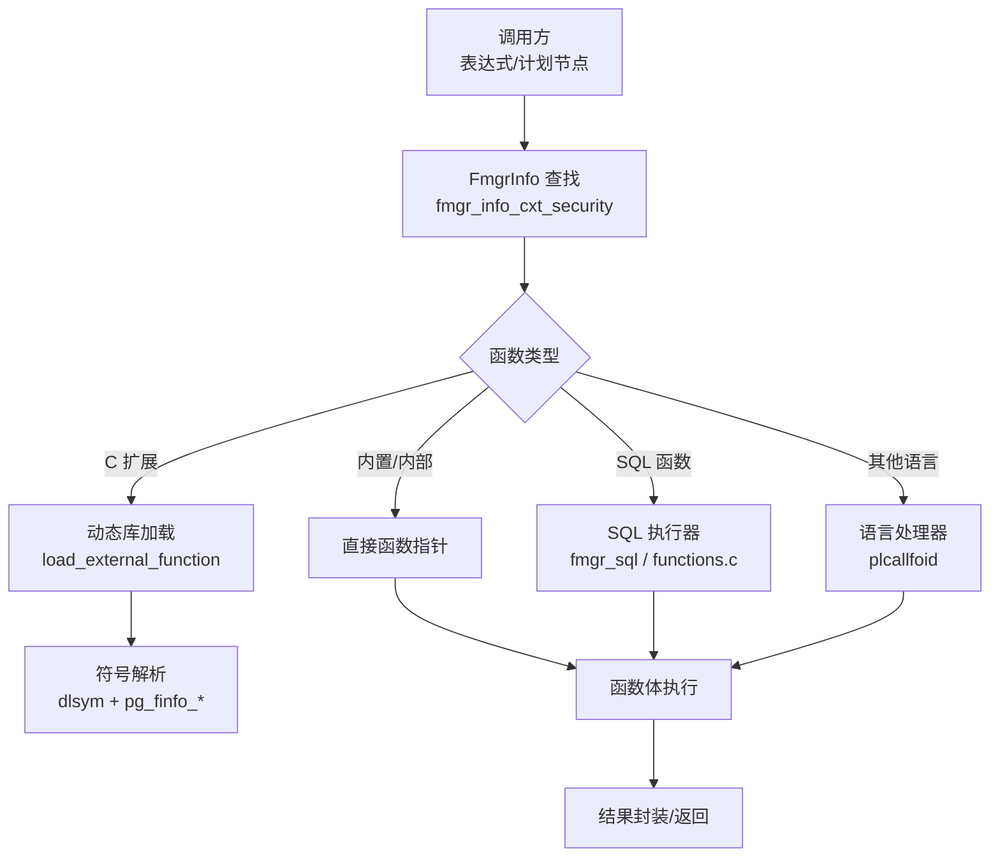
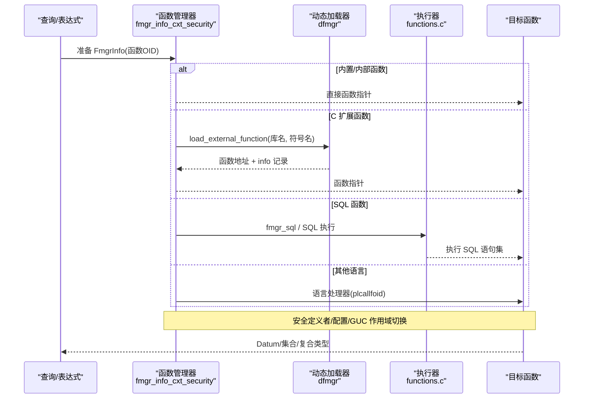
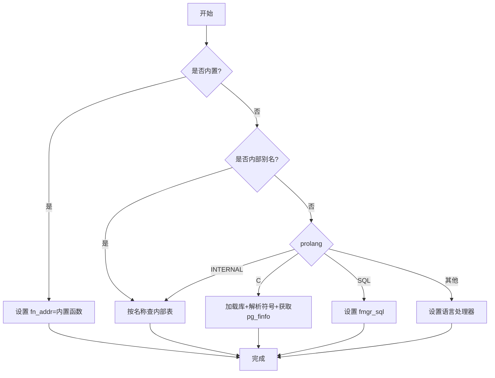
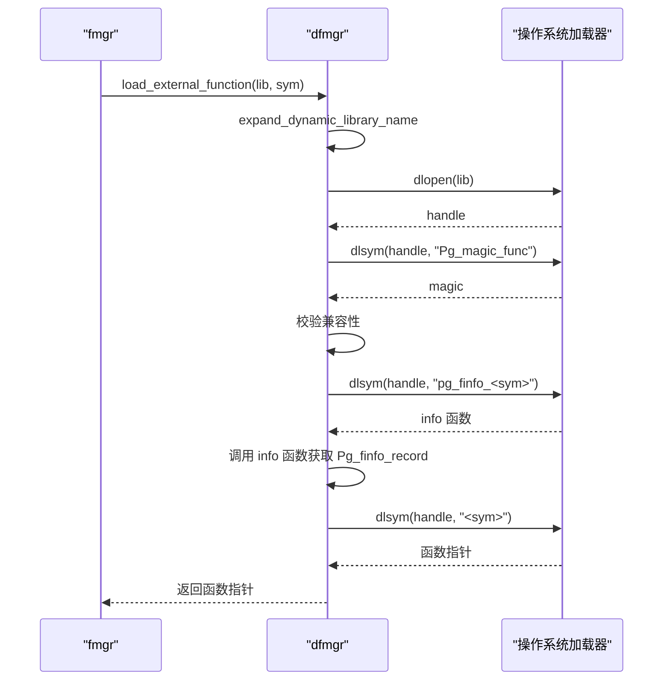
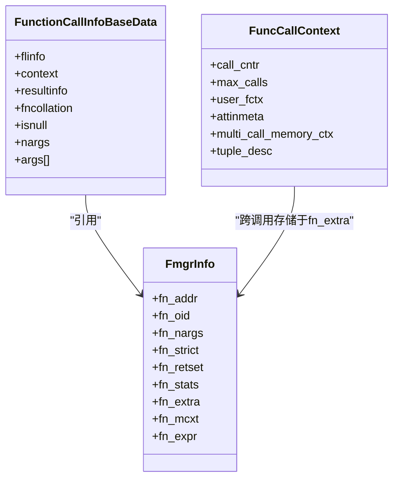
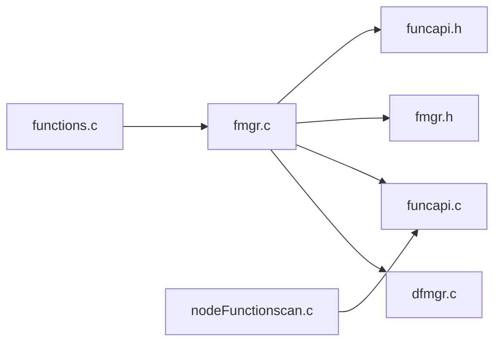
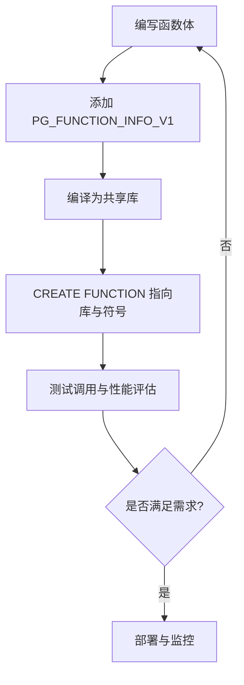

# 函数调用处理

<cite>
**本文引用的文件**
- [fmgr.c](file://src/backend/utils/fmgr/fmgr.c)
- [dfmgr.c](file://src/backend/utils/fmgr/dfmgr.c)
- [funcapi.c](file://src/backend/utils/fmgr/funcapi.c)
- [fmgr.h](file://src/include/fmgr.h)
- [funcapi.h](file://src/include/funcapi.h)
- [functions.c](file://src/backend/executor/functions.c)
- [nodeFunctionscan.c](file://src/backend/executor/nodeFunctionscan.c)
</cite>

## 目录
1. [简介](#简介)
2. [项目结构](#项目结构)
3. [核心组件](#核心组件)
4. [架构总览](#架构总览)
5. [详细组件分析](#详细组件分析)
6. [依赖关系分析](#依赖关系分析)
7. [性能考量](#性能考量)
8. [故障排查指南](#故障排查指南)
9. [结论](#结论)
10. [附录：函数开发指南](#附录函数开发指南)

## 简介
本文件系统性阐述 Mini PostgreSQL 的函数调用处理机制，覆盖函数注册、动态加载与符号解析、参数传递与类型转换、返回值处理、内置与用户定义函数的差异、缓存与内联优化、错误传播、聚合函数/表函数/过程式语言接口，以及函数开发的 API、内存管理与异常处理最佳实践。

## 项目结构
围绕函数调用处理的关键代码主要分布在以下模块：
- 函数管理器与调用约定：src/backend/utils/fmgr（fmgr.c, dfmgr.c, funcapi.c）
- 公共接口与宏：src/include（fmgr.h, funcapi.h）
- SQL 函数执行与缓存：src/backend/executor/functions.c
- 表函数扫描节点：src/backend/executor/nodeFunctionscan.c

图表来源
- [fmgr.c:143-263](file://src/backend/utils/fmgr/fmgr.c#L143-L263)
- [dfmgr.c:98-127](file://src/backend/utils/fmgr/dfmgr.c#L98-L127)
- [functions.c:76-128](file://src/backend/executor/functions.c#L76-L128)

章节来源
- [fmgr.c:143-263](file://src/backend/utils/fmgr/fmgr.c#L143-L263)
- [dfmgr.c:98-127](file://src/backend/utils/fmgr/dfmgr.c#L98-L127)
- [functions.c:76-128](file://src/backend/executor/functions.c#L76-L128)

## 核心组件
- FmgrInfo：保存函数 OID、参数个数、严格性、是否返回集合、统计信息、额外上下文、内存上下文、表达式树等，是跨调用重用的关键结构。
- FunctionCallInfoBaseData：运行时调用上下文，包含 flinfo、collation、isnull、nargs、可变长参数数组等。
- 动态加载器：负责加载共享库、校验兼容性、解析符号、维护已加载库列表。
- 函数信息记录：外部函数需提供 pg_finfo_XXX 以声明 API 版本等信息。
- SQL 函数执行：将 SQL 函数体解析/计划并执行，支持多语句与结果收集。
- 表函数执行：通过 nodeFunctionscan 将表值函数作为可扫描源执行。

章节来源
- [fmgr.h:56-96](file://src/include/fmgr.h#L56-L96)
- [fmgr.h:150-172](file://src/include/fmgr.h#L150-L172)
- [dfmgr.c:55-65](file://src/backend/utils/fmgr/dfmgr.c#L55-L65)
- [fmgr.c:466-509](file://src/backend/utils/fmgr/fmgr.c#L466-L509)
- [functions.c:76-128](file://src/backend/executor/functions.c#L76-L128)
- [nodeFunctionscan.c:33-44](file://src/backend/executor/nodeFunctionscan.c#L33-L44)

## 架构总览
下图展示从查询到函数执行的端到端流程，包括内置/外部/SQL/其他语言的分支路径与安全/钩子处理。

图表来源
- [fmgr.c:143-263](file://src/backend/utils/fmgr/fmgr.c#L143-L263)
- [dfmgr.c:98-127](file://src/backend/utils/fmgr/dfmgr.c#L98-L127)
- [functions.c:76-128](file://src/backend/executor/functions.c#L76-L128)

## 详细组件分析

### 函数注册与查找（内置/内部/C/SQL/其他语言）
- 内置函数：通过快速路径直接命中内置表，避免系统缓存访问。
- 内部函数：按名称在内部查找表中定位。
- C 扩展函数：读取 prosrc/probin，加载共享库，解析符号，获取 pg_finfo_XXX 记录，缓存函数地址与元信息。
- SQL 函数：设置 fmgr_sql 入口，由执行器解析/计划/执行。
- 其他语言：根据语言 OID 找到语言处理器并委派。

图表来源
- [fmgr.c:143-263](file://src/backend/utils/fmgr/fmgr.c#L143-L263)
- [fmgr.c:355-423](file://src/backend/utils/fmgr/fmgr.c#L355-L423)
- [fmgr.c:466-509](file://src/backend/utils/fmgr/fmgr.c#L466-L509)

章节来源
- [fmgr.c:143-263](file://src/backend/utils/fmgr/fmgr.c#L143-L263)
- [fmgr.c:355-423](file://src/backend/utils/fmgr/fmgr.c#L355-L423)
- [fmgr.c:466-509](file://src/backend/utils/fmgr/fmgr.c#L466-L509)

### 动态加载与符号解析
- 库加载：expand_dynamic_library_name 搜索路径，internal_load_library 使用 dlopen，校验 PG_MODULE_MAGIC，调用 _PG_init。
- 符号解析：load_external_function 使用 dlsym 解析函数；fetch_finfo_record 解析 pg_finfo_XXX 并验证 API 版本。
- 库管理：维护已加载库链表，支持序列化/恢复状态；清理外部函数哈希表。

图表来源
- [dfmgr.c:98-127](file://src/backend/utils/fmgr/dfmgr.c#L98-L127)
- [dfmgr.c:175-290](file://src/backend/utils/fmgr/dfmgr.c#L175-L290)
- [fmgr.c:466-509](file://src/backend/utils/fmgr/fmgr.c#L466-L509)

章节来源
- [dfmgr.c:98-127](file://src/backend/utils/fmgr/dfmgr.c#L98-L127)
- [dfmgr.c:175-290](file://src/backend/utils/fmgr/dfmgr.c#L175-L290)
- [fmgr.c:466-509](file://src/backend/utils/fmgr/fmgr.c#L466-L509)

### 参数传递、类型转换与返回值处理
- 参数传递：通过 FunctionCallInfoBaseData.args[] 以 Datum 形式传递；提供 PG_GETARG_xxx 系列宏进行解包；TOAST 类型可使用 PG_DETOAST_DATUM* 系列宏。
- 类型转换：解析期/执行期会进行必要的隐式/显式转换；对于集合/复合类型，使用 funcapi 提供的工具确定结果类型与 TupleDesc。
- 返回值：使用 PG_RETURN_xxx 系列宏包装 Datum；NULL 通过 isnull 标记；集合返回通过 ReturnSetInfo 与 FuncCallContext 管理多次迭代。

图表来源
- [fmgr.h:56-96](file://src/include/fmgr.h#L56-L96)
- [funcapi.h:57-114](file://src/include/funcapi.h#L57-L114)

章节来源
- [fmgr.h:192-376](file://src/include/fmgr.h#L192-L376)
- [funcapi.c:63-131](file://src/backend/utils/fmgr/funcapi.c#L63-L131)
- [funcapi.c:206-468](file://src/backend/utils/fmgr/funcapi.c#L206-L468)

### 内置函数与用户定义函数的调用差异、性能特征与场景
- 内置函数：走快速路径，无系统缓存访问，开销最低，适合高频基础运算。
- 内部函数：通过名称映射到内部表，略慢于内置但仍很快。
- C 扩展函数：首次调用需加载库与解析符号，后续通过哈希缓存加速；适合复杂计算或复用外部库。
- SQL 函数：每次调用可能涉及解析/计划/执行，但可重用 SQLFunctionCache；适合逻辑组合与复杂业务。
- 其他语言：通过语言处理器调用，适合脚本化扩展。

章节来源
- [fmgr.c:143-263](file://src/backend/utils/fmgr/fmgr.c#L143-L263)
- [fmgr.c:521-595](file://src/backend/utils/fmgr/fmgr.c#L521-L595)
- [functions.c:76-128](file://src/backend/executor/functions.c#L76-L128)

### 函数缓存、内联优化与错误传播
- 缓存：
  - 外部 C 函数地址与 info 记录保存在哈希表中，键为函数 OID，避免重复加载与解析。
  - SQL 函数使用 SQLFunctionCache 缓存解析/计划结果，并在事务边界失效时重建。
- 内联：
  - 内置函数通常被优化器内联或采用快速路径；对频繁调用的简单函数建议实现为内置或内部函数以获得更好性能。
- 错误传播：
  - 统一通过 ereport/elog 抛出错误；安全定义者/配置切换期间使用 PG_TRY/PATCH 保证资源释放与状态回滚。
  - 插件钩子在 FHET_START/FHET_END/FHET_ABORT 三阶段通知，便于审计与监控。

章节来源
- [fmgr.c:521-595](file://src/backend/utils/fmgr/fmgr.c#L521-L595)
- [fmgr.c:655-774](file://src/backend/utils/fmgr/fmgr.c#L655-L774)
- [functions.c:76-128](file://src/backend/executor/functions.c#L76-L128)

### 聚合函数、表函数与过程式语言接口
- 聚合函数：
  - 通过 AggCheckCallContext 等接口识别聚合上下文，提供临时内存上下文与回调注册。
- 表函数：
  - 通过 nodeFunctionscan 将表值函数作为扫描节点执行，支持简单路径与通用路径，自动缓存结果至 tuplestore。
- 过程式语言：
  - 通过语言 OID 对应的 plcallfoid 调用处理器，统一接入函数管理器。

章节来源
- [fmgr.h:731-748](file://src/include/fmgr.h#L731-L748)
- [nodeFunctionscan.c:33-44](file://src/backend/executor/nodeFunctionscan.c#L33-L44)
- [fmgr.c:429-453](file://src/backend/utils/fmgr/fmgr.c#L429-L453)

## 依赖关系分析
- 低耦合：函数管理器仅依赖必要的数据类型与缓存接口；动态加载器独立于具体函数实现。
- 高内聚：各语言/函数类型的处理集中在各自分支，便于维护与扩展。
- 外部依赖：操作系统动态链接器（dlopen/dlsym），系统缓存（syscache），内存上下文（memutils）。

图表来源
- [fmgr.c:16-32](file://src/backend/utils/fmgr/fmgr.c#L16-L32)
- [dfmgr.c:15-37](file://src/backend/utils/fmgr/dfmgr.c#L15-L37)
- [funcapi.c:14-30](file://src/backend/utils/fmgr/funcapi.c#L14-L30)
- [functions.c:15-37](file://src/backend/executor/functions.c#L15-L37)
- [nodeFunctionscan.c:23-30](file://src/backend/executor/nodeFunctionscan.c#L23-L30)

章节来源
- [fmgr.c:16-32](file://src/backend/utils/fmgr/fmgr.c#L16-L32)
- [dfmgr.c:15-37](file://src/backend/utils/fmgr/dfmgr.c#L15-L37)
- [funcapi.c:14-30](file://src/backend/utils/fmgr/funcapi.c#L14-L30)
- [functions.c:15-37](file://src/backend/executor/functions.c#L15-L37)
- [nodeFunctionscan.c:23-30](file://src/backend/executor/nodeFunctionscan.c#L23-L30)

## 性能考量
- 优先使用内置/内部函数以减少系统缓存与动态加载开销。
- 对频繁调用的 C 扩展函数，利用外部函数哈希缓存减少重复解析。
- SQL 函数尽量复用 SQLFunctionCache，避免重复解析/计划。
- 集合/复合类型返回时，合理选择 BuildTupleFromCStrings 或直接 heap_form_tuple，减少中间拷贝。
- 谨慎使用 TOAST 大对象，必要时使用 packed 变体降低拷贝成本。

[本节为通用指导，不直接分析具体文件]

## 故障排查指南
- 动态库加载失败：检查库路径、权限、依赖缺失；查看错误消息中的 dlerror 信息。
- 符号未找到：确认导出符号名正确，且存在 pg_finfo_XXX 信息函数。
- 兼容性问题：确保模块使用 PG_MODULE_MAGIC 且版本匹配；否则会在加载阶段报错。
- 安全定义者/配置问题：确认函数具备相应权限，GUC 作用域切换正常。
- 聚合/表函数上下文错误：确保在正确的执行上下文中调用，如集合函数需在能接受集合的上下文中。

章节来源
- [dfmgr.c:198-239](file://src/backend/utils/fmgr/dfmgr.c#L198-L239)
- [dfmgr.c:295-376](file://src/backend/utils/fmgr/dfmgr.c#L295-L376)
- [fmgr.c:466-509](file://src/backend/utils/fmgr/fmgr.c#L466-L509)
- [fmgr.c:655-774](file://src/backend/utils/fmgr/fmgr.c#L655-L774)

## 结论
Mini PostgreSQL 的函数调用机制通过统一的 FmgrInfo/FunctionCallInfo 抽象，结合内置快速路径、外部库动态加载、SQL 执行器与语言处理器，实现了高效、可扩展的函数调用体系。配合缓存、安全上下文与插件钩子，既保证了性能，又提供了强大的扩展能力。遵循本文的开发指南与最佳实践，可以编写高性能、健壮的用户自定义函数。

[本节为总结，不直接分析具体文件]

## 附录：函数开发指南

### API 使用
- 声明函数签名：使用 PG_FUNCTION_ARGS 标准参数列表。
- 参数获取：使用 PG_GETARG_xxx 系列宏；注意非严格函数需先检查 PG_ARGISNULL。
- 返回值：使用 PG_RETURN_xxx 系列宏；NULL 通过 PG_RETURN_NULL。
- 集合/复合类型：使用 funcapi 提供的 init_MultiFuncCall/per_MultiFuncCall/end_MultiFuncCall 与 get_call_result_type 等工具。

章节来源
- [fmgr.h:192-376](file://src/include/fmgr.h#L192-L376)
- [funcapi.h:116-165](file://src/include/funcapi.h#L116-L165)
- [funcapi.c:63-131](file://src/backend/utils/fmgr/funcapi.c#L63-L131)
- [funcapi.c:206-468](file://src/backend/utils/fmgr/funcapi.c#L206-L468)

### 内存管理
- 使用 fcinfo->flinfo->fn_mcxt 分配跨调用数据；集合函数使用 multi_call_memory_ctx。
- 对 TOAST 类型使用 PG_DETOAST_DATUM* 系列宏，并用 PG_FREE_IF_COPY 释放复制出的数据。
- SQL 函数缓存使用 SQLFunctionCache 及其子上下文，避免跨事务泄漏。

章节来源
- [fmgr.h:212-264](file://src/include/fmgr.h#L212-L264)
- [funcapi.c:63-131](file://src/backend/utils/fmgr/funcapi.c#L63-L131)
- [functions.c:76-128](file://src/backend/executor/functions.c#L76-L128)

### 异常处理
- 使用 ereport/elog 抛出错误；在安全定义者/配置切换中使用 PG_TRY/PATCH 保证资源释放。
- 插件钩子 FHET_ABORT 用于捕获异常路径，便于审计与清理。

章节来源
- [fmgr.c:655-774](file://src/backend/utils/fmgr/fmgr.c#L655-L774)
- [fmgr.h:750-775](file://src/include/fmgr.h#L750-L775)

### 开发流程示例（概念图）

[此图为概念流程，不直接对应具体源码]