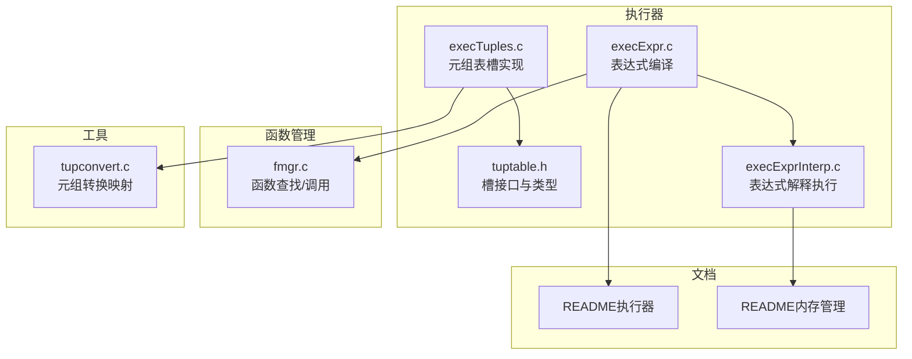
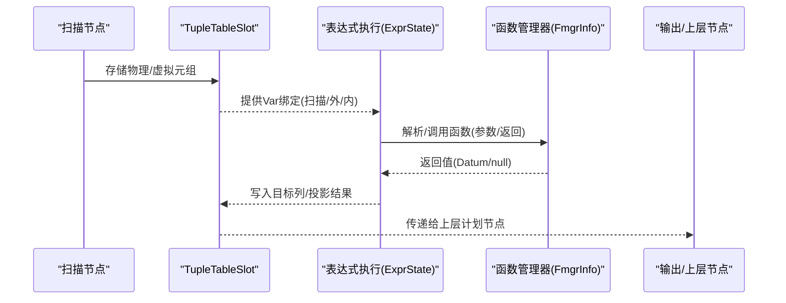
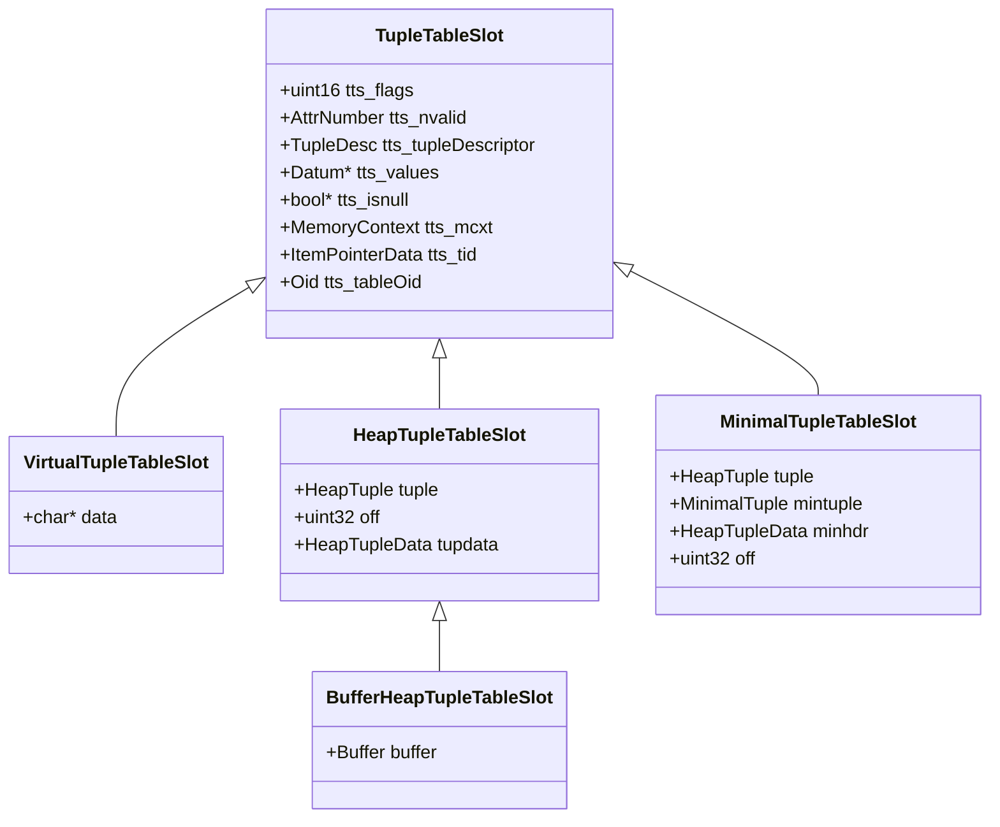
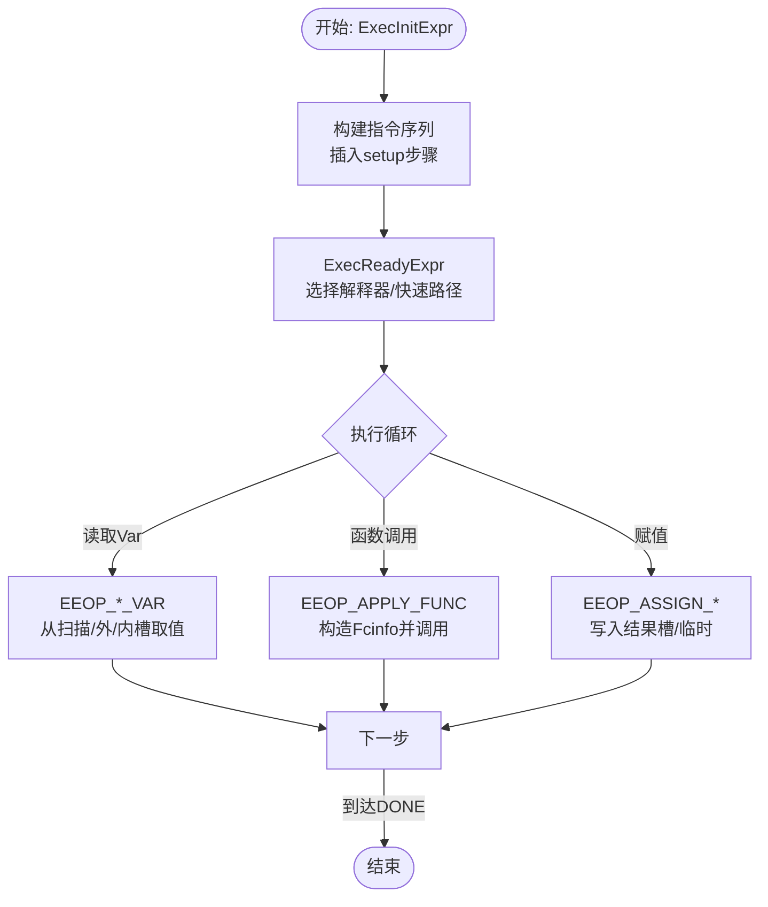
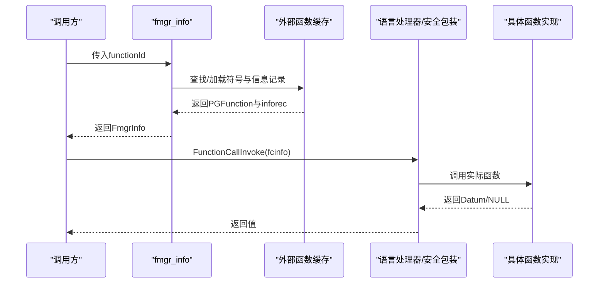
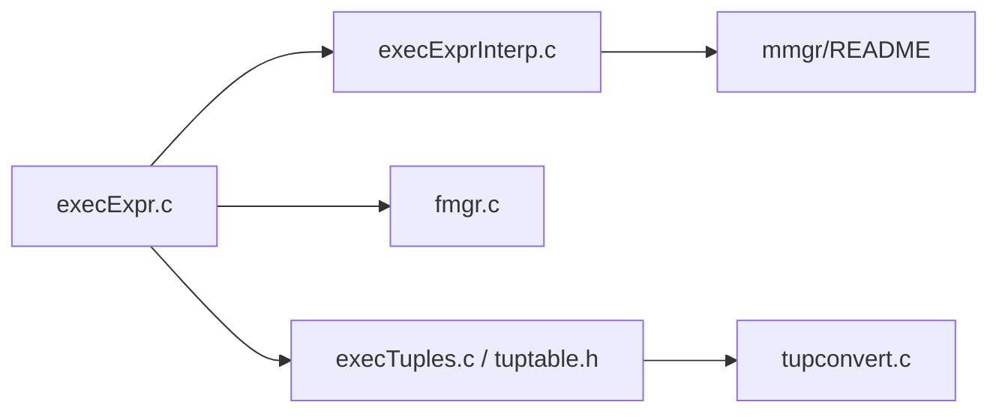

# 数据流处理

<cite>
**本文引用的文件**
- [execTuples.c](file://src/backend/executor/execTuples.c)
- [tuptable.h](file://src/include/executor/tuptable.h)
- [execExpr.c](file://src/backend/executor/execExpr.c)
- [execExprInterp.c](file://src/backend/executor/execExprInterp.c)
- [fmgr.c](file://src/backend/utils/fmgr/fmgr.c)
- [README（执行器）](file://src/backend/executor/README)
- [README（内存管理）](file://src/backend/utils/mmgr/README)
- [tupconvert.c](file://src/backend/access/common/tupconvert.c)
</cite>

## 目录
1. [简介](#简介)
2. [项目结构](#项目结构)
3. [核心组件](#核心组件)
4. [架构总览](#架构总览)
5. [详细组件分析](#详细组件分析)
6. [依赖关系分析](#依赖关系分析)
7. [性能考量](#性能考量)
8. [故障排查指南](#故障排查指南)
9. [结论](#结论)
10. [附录](#附录)

## 简介
本文件面向Mini PostgreSQL的数据流处理，聚焦以下主题：
- 元组传递机制与TupleTableSlot的使用、元组格式转换与数据类型处理
- 表达式树的编译、求值、变量绑定与上下文管理
- 函数调用的注册、参数传递与返回值处理
- 数据流图、内存分配策略与错误处理机制
- 为自定义表达式与函数开发提供完整技术指导

## 项目结构
围绕数据流处理的代码主要分布在执行器、表达式求值、函数管理与元组工具等模块：
- 执行器与元组表槽：execTuples.c、tuptable.h
- 表达式编译与执行：execExpr.c、execExprInterp.c、执行器README
- 函数管理器：fmgr.c、函数管理README
- 元组转换：tupconvert.c
- 内存管理策略：mmgr/README

**图示来源**
- [execTuples.c:1-800](file://src/backend/executor/execTuples.c#L1-L800)
- [tuptable.h:1-488](file://src/include/executor/tuptable.h#L1-L488)
- [execExpr.c:1-800](file://src/backend/executor/execExpr.c#L1-L800)
- [execExprInterp.c:1-200](file://src/backend/executor/execExprInterp.c#L1-L200)
- [fmgr.c:1-800](file://src/backend/utils/fmgr/fmgr.c#L1-L800)
- [README（执行器）:183-214](file://src/backend/executor/README#L183-L214)
- [README（内存管理）:302-320](file://src/backend/utils/mmgr/README#L302-L320)

**章节来源**
- [execTuples.c:1-800](file://src/backend/executor/execTuples.c#L1-L800)
- [tuptable.h:1-488](file://src/include/executor/tuptable.h#L1-L488)
- [execExpr.c:1-800](file://src/backend/executor/execExpr.c#L1-L800)
- [execExprInterp.c:1-200](file://src/backend/executor/execExprInterp.c#L1-L200)
- [fmgr.c:1-800](file://src/backend/utils/fmgr/fmgr.c#L1-L800)
- [README（执行器）:183-214](file://src/backend/executor/README#L183-L214)
- [README（内存管理）:302-320](file://src/backend/utils/mmgr/README#L302-L320)

## 核心组件
- TupleTableSlot与多种槽实现：虚拟槽、堆元组槽、最小元组槽、缓冲堆元组槽，支持惰性解构、物化、拷贝与系统列访问。
- 表达式编译与执行：将Expr树编译为指令序列（ExprEvalStep），通过解释器或快速路径执行；支持Var绑定到扫描/外/内元组槽。
- 函数管理：按OID查找内置或外部C函数，构建FmgrInfo并缓存；安全定义者/GUC包装；统一调用入口FunctionCallInvoke。
- 元组转换：按位置或名称建立输入输出描述符的映射，预分配Datum数组以加速运行时转换。
- 内存管理：每个ExprContext拥有独立的per-tuple内存上下文，避免泄漏；每计划节点独立上下文以支持嵌套连接。

**章节来源**
- [execTuples.c:1-800](file://src/backend/executor/execTuples.c#L1-L800)
- [tuptable.h:1-488](file://src/include/executor/tuptable.h#L1-L488)
- [execExpr.c:1-800](file://src/backend/executor/execExpr.c#L1-L800)
- [execExprInterp.c:1-200](file://src/backend/executor/execExprInterp.c#L1-L200)
- [fmgr.c:1-800](file://src/backend/utils/fmgr/fmgr.c#L1-L800)
- [tupconvert.c:54-133](file://src/backend/access/common/tupconvert.c#L54-L133)
- [README（内存管理）:302-320](file://src/backend/utils/mmgr/README#L302-L320)

## 架构总览
数据流从扫描节点产出元组进入TupleTableSlot，经投影/过滤等计划节点进行表达式求值与函数调用，最终产出结果元组。表达式求值在ExprContext中完成，函数调用通过FmgrInfo路由至具体实现。

**图示来源**
- [execTuples.c:1-800](file://src/backend/executor/execTuples.c#L1-L800)
- [execExpr.c:1-800](file://src/backend/executor/execExpr.c#L1-L800)
- [execExprInterp.c:1-200](file://src/backend/executor/execExprInterp.c#L1-L200)
- [fmgr.c:1-800](file://src/backend/utils/fmgr/fmgr.c#L1-L800)

## 详细组件分析

### 元组表槽与元组传递
- 槽类型与操作：
  - 虚拟槽：最小复制，惰性物化，适合中间层传递。
  - 堆元组槽：持有HeapTuple，支持系统列访问与物化。
  - 最小元组槽：紧凑表示，无系统列。
  - 缓冲堆元组槽：持有Buffer pin，释放时管理pin与物化副本。
- 惰性解构与物化：按需填充tts_values/tts_isnull，必要时materialize确保独立性。
- 拷贝与转换：支持slot间拷贝、HeapTuple/MinimalTuple互转，配合tupconvert按位置/名称映射。

**图示来源**
- [tuptable.h:115-287](file://src/include/executor/tuptable.h#L115-L287)

**章节来源**
- [execTuples.c:96-800](file://src/backend/executor/execTuples.c#L96-L800)
- [tuptable.h:23-93](file://src/include/executor/tuptable.h#L23-L93)
- [tupconvert.c:54-133](file://src/backend/access/common/tupconvert.c#L54-L133)

### 表达式树编译与执行
- 编译阶段：ExecInitExpr将Expr树转换为ExprState，包含指令序列（ExprEvalStep），插入setup步骤与结束指令，最后调用ExecReadyExpr选择执行方式。
- 执行阶段：解释器通过opcode分派执行；对简单模式使用快速路径（如直接读取Var）。
- 变量绑定：Var可绑定到扫描/外/内元组槽，执行前检查槽兼容性，保证schema变更后的有效性。
- 投影与更新：ExecBuildProjectionInfo/ExecBuildUpdateProjection生成高效赋值步骤，必要时强制解构。

**图示来源**
- [execExpr.c:89-152](file://src/backend/executor/execExpr.c#L89-L152)
- [execExprInterp.c:1-200](file://src/backend/executor/execExprInterp.c#L1-L200)
- [execExprInterp.c:253-279](file://src/backend/executor/execExprInterp.c#L253-L279)
- [execExprInterp.c:1804-1856](file://src/backend/executor/execExprInterp.c#L1804-L1856)

**章节来源**
- [execExpr.c:89-800](file://src/backend/executor/execExpr.c#L89-L800)
- [execExprInterp.c:1-200](file://src/backend/executor/execExprInterp.c#L1-L200)
- [execExprInterp.c:253-279](file://src/backend/executor/execExprInterp.c#L253-L279)
- [execExprInterp.c:1804-1856](file://src/backend/executor/execExprInterp.c#L1804-L1856)
- [README（执行器）:183-214](file://src/backend/executor/README#L183-L214)

### 函数调用处理与注册
- 函数查找：fmgr_info根据OID查找内置或外部C函数，填充FmgrInfo（地址、严格性、是否集合返回等）。
- 缓存与加载：外部C函数通过哈希表缓存符号与信息记录，减少动态加载开销。
- 安全与GUC：security-definer/proconfig通过包装器设置用户ID与GUC环境后调用实际函数。
- 调用流程：FunctionCallInvoke统一入口，支持统计钩子与异常恢复。

**图示来源**
- [fmgr.c:123-263](file://src/backend/utils/fmgr/fmgr.c#L123-L263)
- [fmgr.c:355-423](file://src/backend/utils/fmgr/fmgr.c#L355-L423)
- [fmgr.c:655-774](file://src/backend/utils/fmgr/fmgr.c#L655-L774)

**章节来源**
- [fmgr.c:1-800](file://src/backend/utils/fmgr/fmgr.c#L1-L800)

### 元组格式转换与数据类型处理
- 转换映射：convert_tuples_by_position/by_name建立输入/输出描述符的属性映射，预分配Datum数组以减少运行时开销。
- 类型兼容：在执行过程中对Var与槽属性进行类型与dropped列检查，不匹配时报错。
- 物化与拷贝：不同槽类型在需要时物化为独立存储，避免外部依赖失效。

**章节来源**
- [tupconvert.c:54-133](file://src/backend/access/common/tupconvert.c#L54-L133)
- [execExpr.c:353-479](file://src/backend/executor/execExpr.c#L353-L479)
- [execTuples.c:151-249](file://src/backend/executor/execTuples.c#L151-L249)

## 依赖关系分析
- 执行器与表达式：execExpr.c依赖execExprInterp.c提供的解释执行能力；两者共同构成表达式求值栈。
- 表达式与函数：表达式步骤中的函数调用通过fmgr.c的FmgrInfo与调用入口完成。
- 元组与表达式：Var绑定依赖TupleTableSlot提供的列访问；投影与更新依赖槽的赋值与物化能力。
- 内存上下文：ExprContext与计划节点的per-tuple上下文隔离表达式求值期间的临时分配，避免泄漏。

**图示来源**
- [execExpr.c:1-800](file://src/backend/executor/execExpr.c#L1-L800)
- [execExprInterp.c:1-200](file://src/backend/executor/execExprInterp.c#L1-L200)
- [fmgr.c:1-800](file://src/backend/utils/fmgr/fmgr.c#L1-L800)
- [execTuples.c:1-800](file://src/backend/executor/execTuples.c#L1-L800)
- [tuptable.h:1-488](file://src/include/executor/tuptable.h#L1-L488)
- [tupconvert.c:54-133](file://src/backend/access/common/tupconvert.c#L54-L133)
- [README（内存管理）:302-320](file://src/backend/utils/mmgr/README#L302-L320)

**章节来源**
- [execExpr.c:1-800](file://src/backend/executor/execExpr.c#L1-L800)
- [execExprInterp.c:1-200](file://src/backend/executor/execExprInterp.c#L1-L200)
- [fmgr.c:1-800](file://src/backend/utils/fmgr/fmgr.c#L1-L800)
- [execTuples.c:1-800](file://src/backend/executor/execTuples.c#L1-L800)
- [tuptable.h:1-488](file://src/include/executor/tuptable.h#L1-L488)
- [tupconvert.c:54-133](file://src/backend/access/common/tupconvert.c#L54-L133)
- [README（内存管理）:302-320](file://src/backend/utils/mmgr/README#L302-L320)

## 性能考量
- 表达式执行：
  - 解释器采用直接线程或switch线程两种分派方式，简单模式走快速路径以减少开销。
  - 投影与更新针对Safe Var生成专用赋值步骤，避免通用分支。
- 元组传递：
  - 虚拟槽减少拷贝；惰性解构按需拉取列；物化仅在必要时进行。
  - 缓冲槽管理Buffer pin，避免重复物化与锁竞争。
- 内存管理：
  - per-tuple上下文频繁重置，避免malloc抖动；聚合等特殊场景使用双上下文乒乓。
  - 每计划节点独立ExprContext，支持嵌套连接的细粒度生命周期控制。

**章节来源**
- [README（执行器）:183-214](file://src/backend/executor/README#L183-L214)
- [execExprInterp.c:1-200](file://src/backend/executor/execExprInterp.c#L1-L200)
- [execTuples.c:151-249](file://src/backend/executor/execTuples.c#L151-L249)
- [README（内存管理）:302-320](file://src/backend/utils/mmgr/README#L302-L320)

## 故障排查指南
- 表达式校验失败：
  - 检查Var与槽属性的类型与dropped状态；若schema变化，首次执行会触发兼容性检查。
  - 参考CheckExprStillValid逻辑，确认INNER/OUTER/SCAN槽的attnum与vartype匹配。
- 函数调用错误：
  - 确认FmgrInfo已正确填充（fn_addr、fn_nargs、fn_strict、fn_retset）。
  - 外部C函数需具备pg_finfo_*信息记录；否则加载失败。
  - security-definer/proconfig场景下，注意用户ID与GUC环境切换。
- 元组访问异常：
  - 非物化槽无法访问系统列；需先materialize或选择支持系统列的槽类型。
  - 虚拟槽不支持系统列；尝试转换为堆/最小元组槽。
- 内存泄漏：
  - 确保每tuple周期重置ExprContext的per-tuple内存上下文。
  - 避免在长生命周期上下文中保留短生命周期分配。

**章节来源**
- [execExprInterp.c:1804-1856](file://src/backend/executor/execExprInterp.c#L1804-L1856)
- [fmgr.c:123-263](file://src/backend/utils/fmgr/fmgr.c#L123-L263)
- [fmgr.c:355-423](file://src/backend/utils/fmgr/fmgr.c#L355-L423)
- [execTuples.c:339-357](file://src/backend/executor/execTuples.c#L339-L357)
- [README（内存管理）:302-320](file://src/backend/utils/mmgr/README#L302-L320)

## 结论
Mini PostgreSQL的数据流处理以TupleTableSlot为核心载体，结合表达式编译与解释执行、函数管理器与元组转换工具，形成高效且可扩展的执行栈。通过惰性物化、快速路径与per-tuple内存上下文，系统在保持灵活性的同时兼顾性能与稳定性。遵循本文档的模式与实践，可为自定义表达式与函数开发提供清晰的技术指导。

## 附录
- 关键API与路径参考：
  - 表达式编译与执行：[execExpr.c:89-152](file://src/backend/executor/execExpr.c#L89-L152)、[execExprInterp.c:1-200](file://src/backend/executor/execExprInterp.c#L1-L200)
  - 函数管理：[fmgr.c:123-263](file://src/backend/utils/fmgr/fmgr.c#L123-L263)、[fmgr.c:655-774](file://src/backend/utils/fmgr/fmgr.c#L655-L774)
  - 元组槽与转换：[execTuples.c:96-800](file://src/backend/executor/execTuples.c#L96-L800)、[tupconvert.c:54-133](file://src/backend/access/common/tupconvert.c#L54-L133)
  - 内存策略：[README（内存管理）:302-320](file://src/backend/utils/mmgr/README#L302-L320)