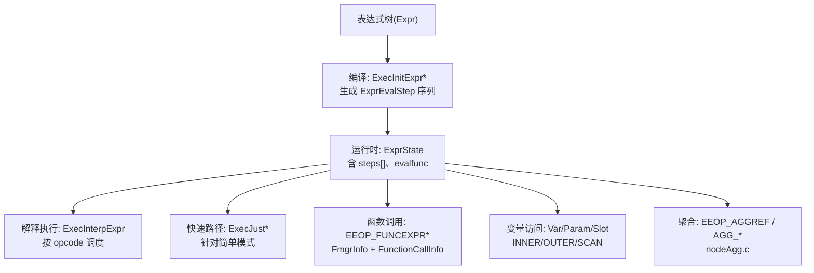
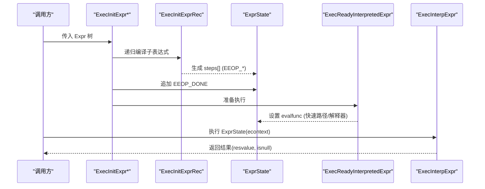
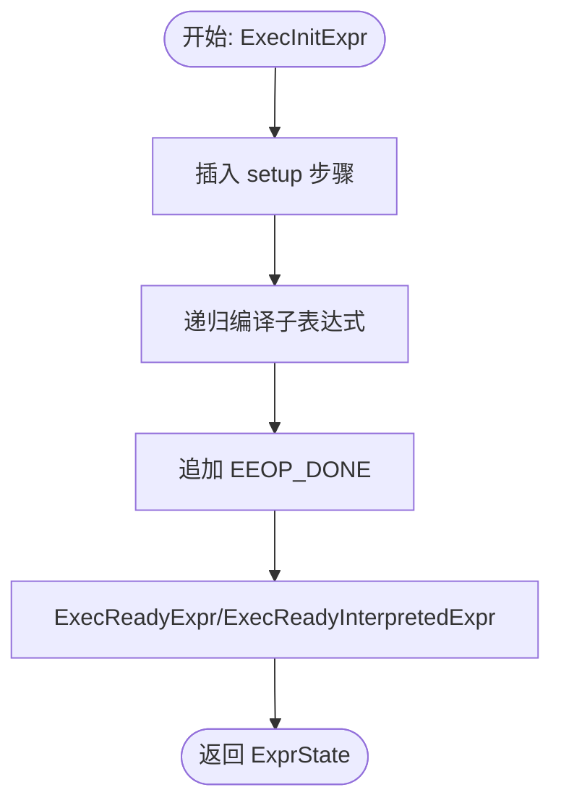
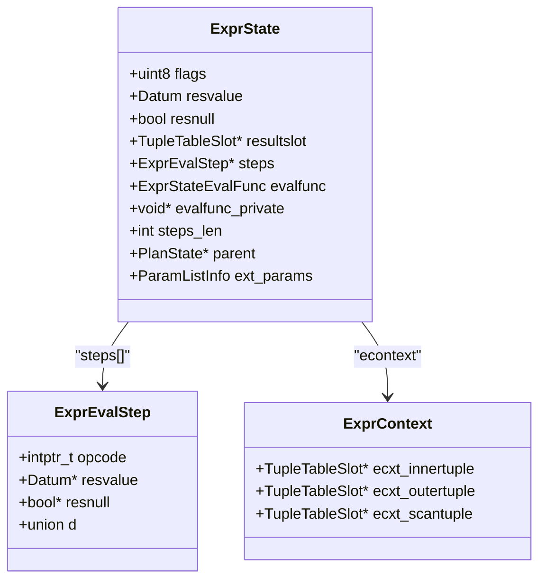
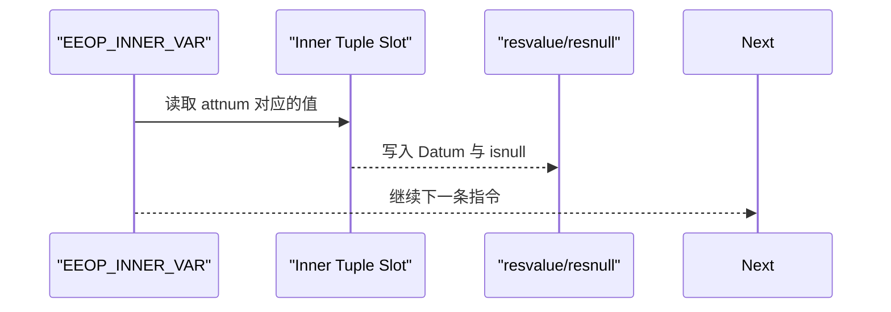
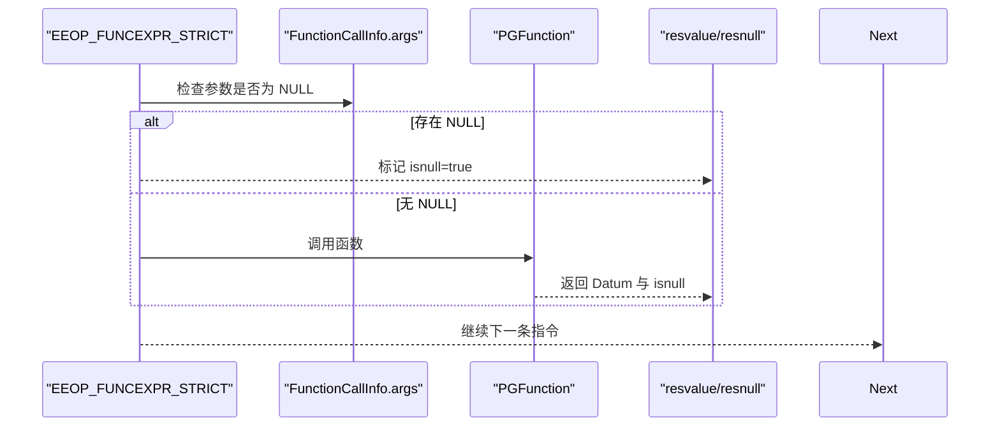
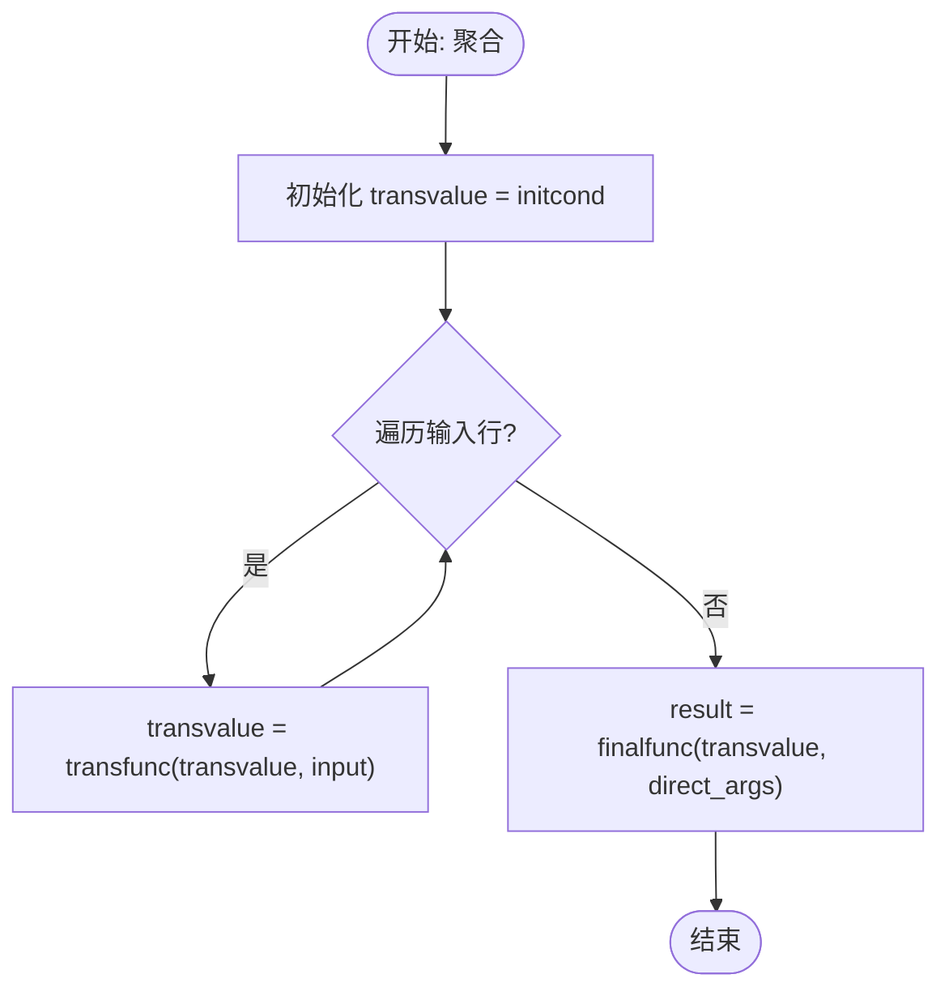
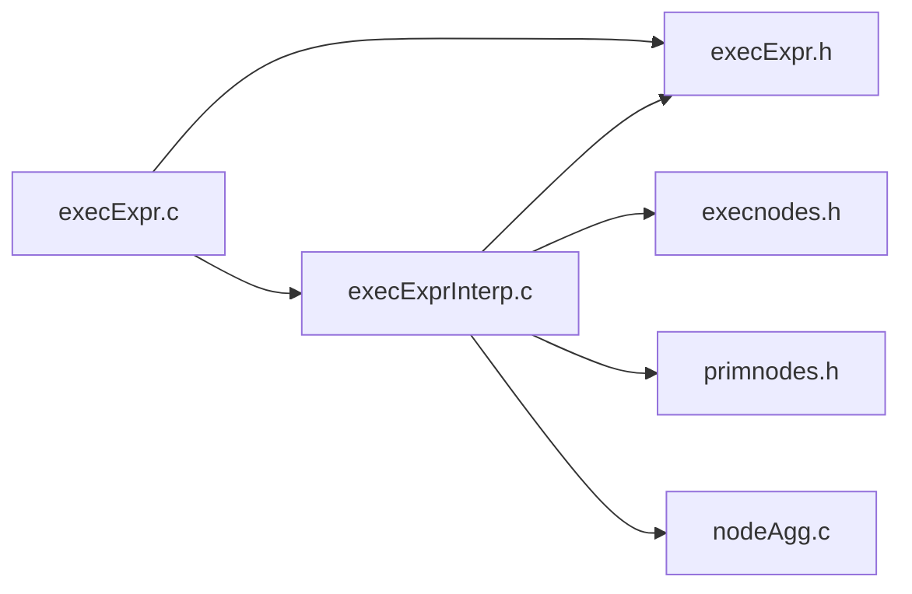

# 表达式求值

<cite>
**本文引用的文件**
- [execExpr.c](file://src/backend/executor/execExpr.c)
- [execExprInterp.c](file://src/backend/executor/execExprInterp.c)
- [execnodes.h](file://src/include/nodes/execnodes.h)
- [execExpr.h](file://src/include/executor/execExpr.h)
- [primnodes.h](file://src/include/nodes/primnodes.h)
- [nodeAgg.c](file://src/backend/executor/nodeAgg.c)
</cite>

## 目录
1. [简介](#简介)
2. [项目结构](#项目结构)
3. [核心组件](#核心组件)
4. [架构总览](#架构总览)
5. [详细组件分析](#详细组件分析)
6. [依赖关系分析](#依赖关系分析)
7. [性能考量](#性能考量)
8. [故障排查指南](#故障排查指南)
9. [结论](#结论)
10. [附录](#附录)

## 简介
本文件面向 Mini PostgreSQL 的表达式求值系统，系统性阐述从表达式树构建、编译到执行的全流程。重点覆盖：
- 表达式树的编译与指令化（将 Expr 转换为可执行的 ExprEvalStep 序列）
- 变量绑定机制、上下文管理与作用域处理（Var、Param、Slot、EContext）
- 内置函数调用流程、参数传递与返回值处理（FunctionCallInfo、严格性优化）
- 表达式缓存、预编译优化与快速路径（EEOP_* 指令、直接线程化、简单模式快路径）
- 标量表达式、聚合函数与窗口函数的执行差异
- 自定义表达式扩展指南与性能调优建议

## 项目结构
表达式求值相关代码主要分布在后端执行器与头文件中：
- 编译阶段：将表达式树编译为步骤序列（ExprEvalStep），并生成 ExprState
- 解释执行阶段：按步骤调度执行，支持直接线程化与 switch 分发
- 数据结构定义：ExprState、ExprEvalStep、ExprContext、Var/Const/Param 等节点类型
- 聚合执行：独立模块负责聚合状态机与转换函数调用

图表来源
- [execExpr.c:123-152](file://src/backend/executor/execExpr.c#L123-L152)
- [execExprInterp.c:235-383](file://src/backend/executor/execExprInterp.c#L235-L383)
- [execExpr.h:64-257](file://src/include/executor/execExpr.h#L64-L257)
- [execnodes.h:59-114](file://src/include/nodes/execnodes.h#L59-L114)

章节来源
- [execExpr.c:123-152](file://src/backend/executor/execExpr.c#L123-L152)
- [execExprInterp.c:235-383](file://src/backend/executor/execExprInterp.c#L235-L383)
- [execExpr.h:64-257](file://src/include/executor/execExpr.h#L64-L257)
- [execnodes.h:59-114](file://src/include/nodes/execnodes.h#L59-L114)

## 核心组件
- ExprState：表达式执行状态，包含步骤数组 steps[]、结果存储 resvalue/resnull、可选的结果槽 resultslot、父 PlanState、外部参数 ext_params 等
- ExprEvalStep：单步指令，opcode 标识操作类型，d 联合体携带具体参数
- ExprContext：表达式执行上下文，提供当前元组插槽（inner/outer/scan）、内存上下文、回调等
- 节点类型：Var/Const/Param 等用于表达数据源与常量；在 execExprInterp.c 中通过 FETCHSOME+VAR 或 CONST 指令高效读取
- 聚合：EEOP_AGGREF 及一系列 AGG_* 指令驱动聚合状态机，配合 nodeAgg.c 完成转换/合并/序列化

章节来源
- [execnodes.h:59-114](file://src/include/nodes/execnodes.h#L59-L114)
- [execExpr.h:260-647](file://src/include/executor/execExpr.h#L260-L647)
- [execExprInterp.c:508-517](file://src/backend/executor/execExprInterp.c#L508-L517)
- [nodeAgg.c:6-79](file://src/backend/executor/nodeAgg.c#L6-L79)

## 架构总览
表达式求值分为“编译”和“执行”两个阶段：
- 编译阶段：ExecInitExpr/ExecInitQual/ExecBuildProjectionInfo 等将 Expr 树转换为 ExprEvalStep 序列，插入必要的 SETUP/FETCH/ASSIGN 指令，并在末尾追加 DONE
- 执行阶段：ExecReadyInterpretedExpr 选择 evalfunc（快速路径或通用解释器），ExecInterpExpr 根据 opcode 分派到对应实现

图表来源
- [execExpr.c:123-152](file://src/backend/executor/execExpr.c#L123-L152)
- [execExprInterp.c:235-383](file://src/backend/executor/execExprInterp.c#L235-L383)
- [execExprInterp.c:395-517](file://src/backend/executor/execExprInterp.c#L395-L517)

## 详细组件分析

### 表达式编译与指令化
- ExecInitExpr：创建 ExprState，插入必要 setup 步骤，递归编译表达式，追加 DONE，最后调用 ExecReadyExpr
- ExecInitQual：为布尔合取短路优化，使用 EEOP_QUAL 指令检测 false/null 提前退出
- ExecBuildProjectionInfo：为目标列表生成投影，优先使用 ASSIGN_*_VAR 快速路径，否则走常规表达式编译并将结果写入结果槽

图表来源
- [execExpr.c:123-152](file://src/backend/executor/execExpr.c#L123-L152)
- [execExpr.c:209-284](file://src/backend/executor/execExpr.c#L209-L284)
- [execExpr.c:353-479](file://src/backend/executor/execExpr.c#L353-L479)

章节来源
- [execExpr.c:123-152](file://src/backend/executor/execExpr.c#L123-L152)
- [execExpr.c:209-284](file://src/backend/executor/execExpr.c#L209-L284)
- [execExpr.c:353-479](file://src/backend/executor/execExpr.c#L353-L479)

### 解释执行与指令调度
- ExecReadyInterpretedExpr：首次初始化解释器，检测简单模式并切换到 ExecJust* 快速路径；否则启用直接线程化或 switch 分发
- ExecInterpExpr：维护 op 指针，基于 dispatch_table 或 switch 分派到各 EEOP_* 实现；支持 INNER/OUTER/SCAN VAR、CONST、FUNCEXPR、BOOL_AND/OR、JUMP、NULLTEST、PARAM、ROW、FIELDSELECT、SUBPLAN、AGGREF 等

图表来源
- [execnodes.h:59-114](file://src/include/nodes/execnodes.h#L59-L114)
- [execExpr.h:260-647](file://src/include/executor/execExpr.h#L260-L647)
- [execExprInterp.c:508-517](file://src/backend/executor/execExprInterp.c#L508-L517)

章节来源
- [execExprInterp.c:235-383](file://src/backend/executor/execExprInterp.c#L235-L383)
- [execExprInterp.c:395-517](file://src/backend/executor/execExprInterp.c#L395-L517)

### 变量绑定与作用域管理
- Var 节点：通过 INNER_VAR/OUTER_VAR/INDEX_VAR 标识引用来源；编译期生成 FETCHSOME+VAR 指令，直接从 Slot 的已解构数组取值
- Param 节点：PARAM_EXEC/PARAM_EXTERN/PARAM_CALLBACK，分别由内部执行参数、外部参数与回调函数提供值
- 作用域：ExprContext 提供 inner/outer/scan tuple 插槽，确保 Var 正确解析到当前作用域的列

图表来源
- [execExprInterp.c:553-594](file://src/backend/executor/execExprInterp.c#L553-L594)
- [primnodes.h:96-156](file://src/include/nodes/primnodes.h#L96-L156)

章节来源
- [execExprInterp.c:553-594](file://src/backend/executor/execExprInterp.c#L553-L594)
- [primnodes.h:96-156](file://src/include/nodes/primnodes.h#L96-L156)

### 内置函数调用流程
- 编译期：为函数调用生成 EEOP_FUNCEXPR* 指令，填充 FmgrInfo 与 FunctionCallInfo（参数、严格性标志、usage 统计）
- 执行期：根据严格性与 usage 需求选择不同分支；严格函数遇到 NULL 参数直接短路返回 NULL；非严格则正常调用 PGFunction
- 返回值：通过 fcinfo->isnull 与返回值写入 resvalue/resnull

图表来源
- [execExprInterp.c:722-774](file://src/backend/executor/execExprInterp.c#L722-L774)
- [execExpr.h:337-346](file://src/include/executor/execExpr.h#L337-L346)

章节来源
- [execExprInterp.c:722-774](file://src/backend/executor/execExprInterp.c#L722-L774)
- [execExpr.h:337-346](file://src/include/executor/execExpr.h#L337-L346)

### 聚合函数执行差异
- 聚合状态机：transvalue = initcond；foreach 输入行 transvalue = transfunc(transvalue, input)；最终 result = finalfunc(transvalue, direct_args)
- 严格性与空值：strict 函数跳过 NULL 输入；finalfunc 若 strict 且 transvalue 为 NULL 则自动返回 NULL
- 分组集与部分聚合：支持 AGG_HASHED/AGG_SORTED/AGG_PLAIN 模式，以及 combinefunc/serializefunc/deserializefunc 的组合
- 指令层面：EEOP_AGGREF 与一系列 AGG_* 指令驱动状态转移与函数调用

图表来源
- [nodeAgg.c:6-79](file://src/backend/executor/nodeAgg.c#L6-L79)
- [execExpr.h:583-646](file://src/include/executor/execExpr.h#L583-L646)

章节来源
- [nodeAgg.c:6-79](file://src/backend/executor/nodeAgg.c#L6-L79)
- [execExpr.h:583-646](file://src/include/executor/execExpr.h#L583-L646)

### 窗口函数执行差异
- 窗口函数在表达式层通常以 WindowFunc 节点出现，其执行依赖于窗口框架与分区/排序语义
- 在当前代码片段中，未直接看到 WindowFunc 的专用 EEOP_* 指令；常见做法是将窗口计算委托给上层计划节点（如 Sort/Window 节点）并按需调用表达式求值
- 因此，表达式层对窗口函数的支持主要体现在参数传递与上下文访问，而窗口框架逻辑由执行器节点协调

[本节为概念性说明，不直接分析具体文件]

### 表达式缓存与预编译优化
- 直接线程化：ExecReadyInterpretedExpr 将 opcode 替换为跳转地址，减少分发开销
- 简单模式快路径：对仅包含 FETCHSOME+VAR/CONST 等极短序列，直接切换至 ExecJust* 函数，避免解释器启动成本
- 投影优化：ExecBuildProjectionInfo 对安全 Var 使用 ASSIGN_*_VAR 直接赋值，减少中间拷贝

章节来源
- [execExprInterp.c:235-383](file://src/backend/executor/execExprInterp.c#L235-L383)
- [execExpr.c:353-479](file://src/backend/executor/execExpr.c#L353-L479)

## 依赖关系分析
- execExpr.c 依赖 execExprInterp.c 提供的解释执行能力，并通过 execExpr.h 暴露接口
- execExprInterp.c 依赖 execnodes.h 中的 ExprState/ExprEvalStep 定义，以及 primnodes.h 中的 Var/Const/Param
- nodeAgg.c 与 execExpr.h 协作，通过 EEOP_AGGREF 与 AGG_* 指令驱动聚合

图表来源
- [execExpr.c:123-152](file://src/backend/executor/execExpr.c#L123-L152)
- [execExprInterp.c:235-383](file://src/backend/executor/execExprInterp.c#L235-L383)
- [execExpr.h:64-257](file://src/include/executor/execExpr.h#L64-L257)
- [execnodes.h:59-114](file://src/include/nodes/execnodes.h#L59-L114)
- [primnodes.h:96-156](file://src/include/nodes/primnodes.h#L96-L156)
- [nodeAgg.c:6-79](file://src/backend/executor/nodeAgg.c#L6-L79)

章节来源
- [execExpr.c:123-152](file://src/backend/executor/execExpr.c#L123-L152)
- [execExprInterp.c:235-383](file://src/backend/executor/execExprInterp.c#L235-L383)
- [execExpr.h:64-257](file://src/include/executor/execExpr.h#L64-L257)
- [execnodes.h:59-114](file://src/include/nodes/execnodes.h#L59-L114)
- [primnodes.h:96-156](file://src/include/nodes/primnodes.h#L96-L156)
- [nodeAgg.c:6-79](file://src/backend/executor/nodeAgg.c#L6-L79)

## 性能考量
- 使用直接线程化与简单模式快路径降低解释器开销
- 投影阶段优先采用 ASSIGN_*_VAR 快速路径，避免不必要的拷贝与类型检查
- 严格函数短路：EEOP_FUNCEXPR_STRICT 在遇到 NULL 参数时立即返回，减少函数调用
- 聚合优化：strict 转换函数跳过 NULL 输入，finalfunc 对 NULL 状态自动处理
- 注意：复杂表达式或罕见指令不走内联路径，应评估是否可通过查询重写简化

[本节提供一般性指导，不直接分析具体文件]

## 故障排查指南
- 表达式无效或步骤不完整：ExecReadyInterpretedExpr 会断言 steps_len>=1 且最后一步为 EEOP_DONE
- 插槽兼容性：FETCHSOME/VAR 前进行 CheckOpSlotCompatibility，确保类型与布局一致
- 函数调用错误：严格函数短路可能导致意外 NULL 结果，需检查参数是否为 NULL
- 聚合状态异常：确认 transfunc/finalfunc 的严格性与 initcond 设置，避免内存泄漏或状态不一致

章节来源
- [execExprInterp.c:235-269](file://src/backend/executor/execExprInterp.c#L235-L269)
- [execExprInterp.c:526-551](file://src/backend/executor/execExprInterp.c#L526-L551)
- [execExprInterp.c:722-774](file://src/backend/executor/execExprInterp.c#L722-L774)
- [nodeAgg.c:6-79](file://src/backend/executor/nodeAgg.c#L6-L79)

## 结论
Mini PostgreSQL 的表达式求值系统通过“编译为指令序列 + 解释执行”的方式，实现了高性能与可扩展性。关键优化包括直接线程化、简单模式快路径、严格函数短路与投影快速赋值。聚合通过独立状态机与指令协同，支持多种分组策略与部分聚合。对于窗口函数，表达式层主要负责参数与上下文访问，框架逻辑由执行器节点协调。扩展开发时可遵循现有指令模型与函数调用约定，结合查询重写与投影优化提升性能。

[本节为总结性内容，不直接分析具体文件]

## 附录
- 自定义表达式开发建议
  - 新增表达式节点时，考虑是否需要专用 EEOP_* 指令；若为常见模式，优先复用现有指令组合
  - 函数扩展遵循 FmgrInfo 与 FunctionCallInfo 约定，明确严格性与 usage 统计需求
  - 利用投影快速路径：尽量将表达式简化为安全 Var 引用，以便 ASSIGN_*_VAR 优化
  - 聚合扩展：实现 transfunc/finalfunc，注意严格性与内存上下文管理，必要时使用 AggCheckCallContext
- 性能调优建议
  - 减少复杂表达式嵌套，利用子查询或临时表分解计算
  - 合理使用严格函数，避免不必要的类型转换与空值处理
  - 监控热点路径：通过 EXPLAIN 与分析工具定位慢查询，针对性优化表达式结构

[本节为一般性指导，不直接分析具体文件]