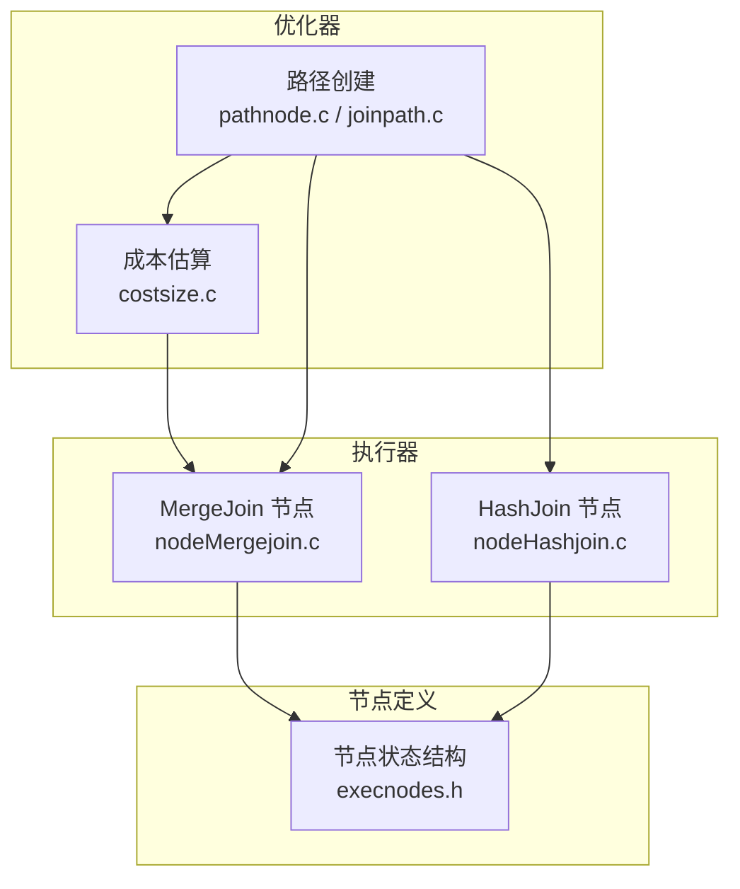
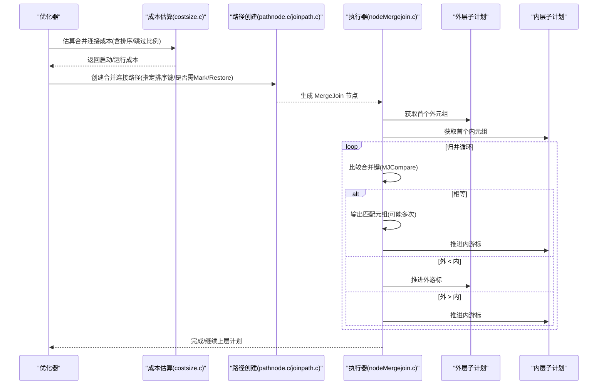
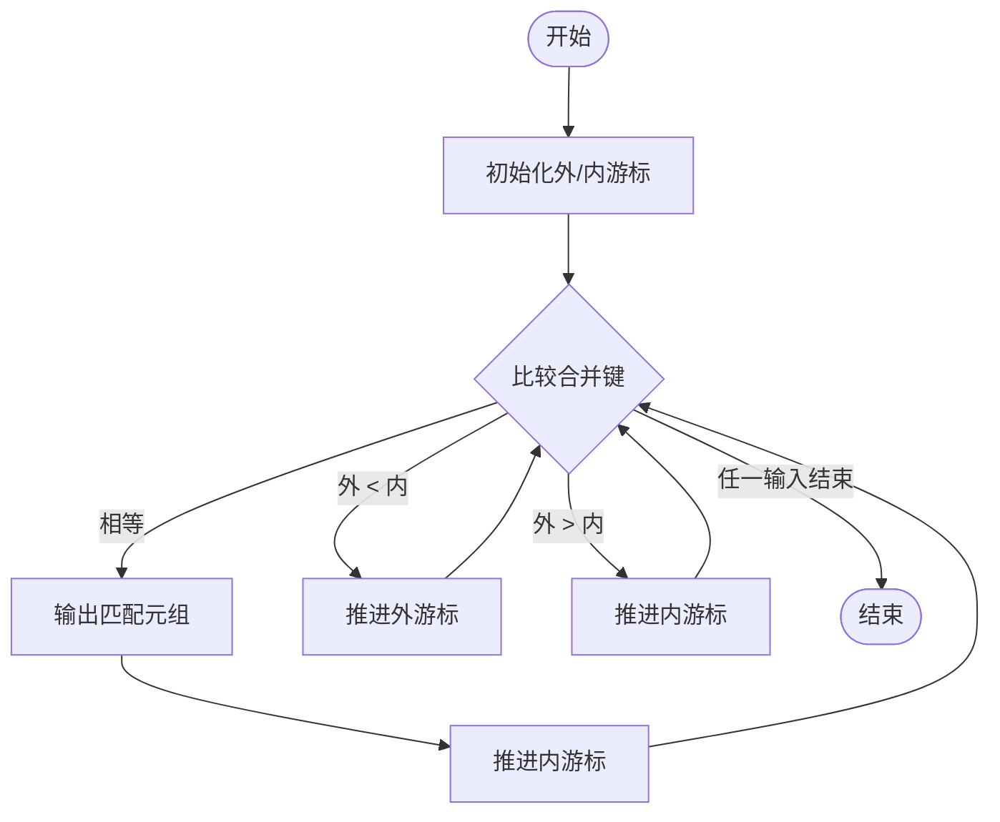
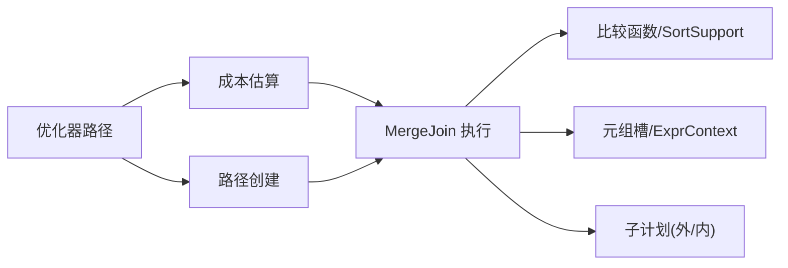
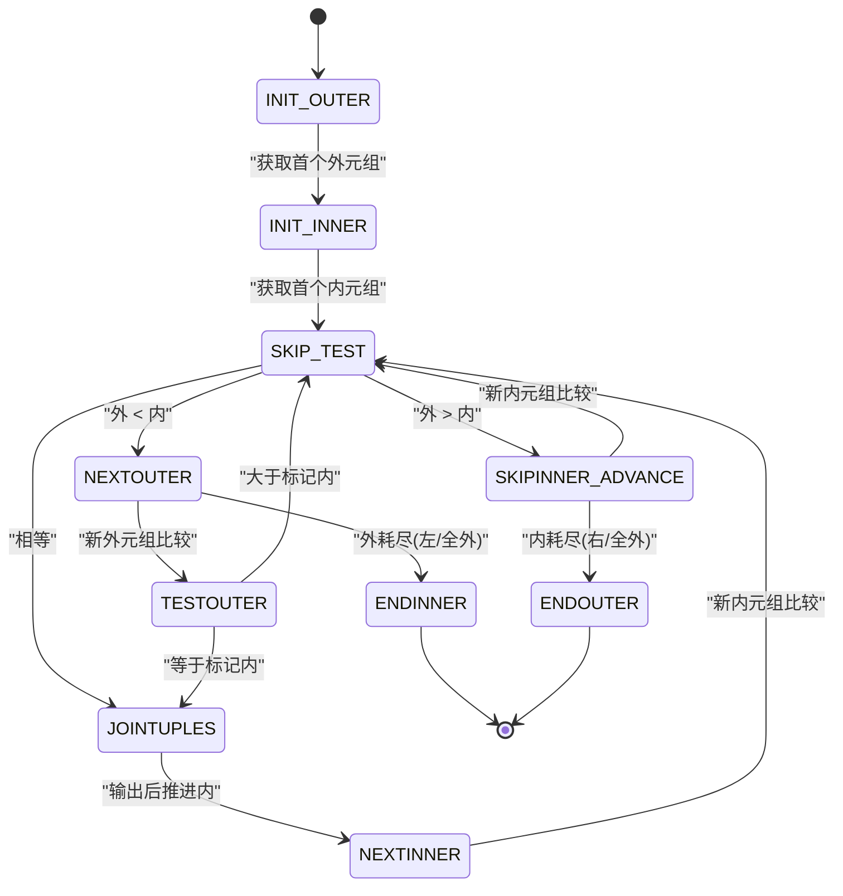

# 合并连接

<cite>
**本文引用的文件**
- [nodeMergejoin.c](file://src/backend/executor/nodeMergejoin.c)
- [nodeMergejoin.h](file://src/include/executor/nodeMergejoin.h)
- [execnodes.h](file://src/include/nodes/execnodes.h)
- [costsize.c](file://src/backend/optimizer/path/costsize.c)
- [pathnode.c](file://src/backend/optimizer/util/pathnode.c)
- [joinpath.c](file://src/backend/optimizer/path/joinpath.c)
- [nodeHashjoin.c](file://src/backend/executor/nodeHashjoin.c)
</cite>

## 目录
1. [简介](#简介)
2. [项目结构](#项目结构)
3. [核心组件](#核心组件)
4. [架构总览](#架构总览)
5. [详细组件分析](#详细组件分析)
6. [依赖关系分析](#依赖关系分析)
7. [性能考量](#性能考量)
8. [故障排查指南](#故障排查指南)
9. [结论](#结论)
10. [附录](#附录)

## 简介
本文件为 Mini PostgreSQL 中的合并连接（MergeJoin）提供系统化、可操作的文档。内容涵盖：
- 排序驱动算法与归并流程
- 输入预排序要求、匹配查找机制
- 索引使用、排序键选择与内存优化
- 不同连接类型（内连接、左外、右外、全外）的实现细节
- 与哈希连接的对比、适用场景与切换条件
- 执行流程图、复杂度分析与调优建议

## 项目结构
Mini PostgreSQL 的合并连接实现位于执行器层，核心代码在 nodeMergejoin.c；数据结构定义在 execnodes.h；优化器成本估算与路径创建在 costsize.c、pathnode.c、joinpath.c；与哈希连接的对比参考 nodeHashjoin.c。

图表来源
- [nodeMergejoin.c:1-120](file://src/backend/executor/nodeMergejoin.c#L1-L120)
- [nodeHashjoin.c:1-120](file://src/backend/executor/nodeHashjoin.c#L1-L120)
- [costsize.c:2887-3200](file://src/backend/optimizer/path/costsize.c#L2887-L3200)
- [pathnode.c:2262-2300](file://src/backend/optimizer/util/pathnode.c#L2262-L2300)
- [joinpath.c:900-1000](file://src/backend/optimizer/path/joinpath.c#L900-L1000)
- [execnodes.h:1730-1780](file://src/include/nodes/execnodes.h#L1730-L1780)

章节来源
- [nodeMergejoin.c:1-120](file://src/backend/executor/nodeMergejoin.c#L1-L120)
- [execnodes.h:1730-1780](file://src/include/nodes/execnodes.h#L1730-L1780)

## 核心组件
- MergeJoinState：保存合并连接运行期状态，包括子计划指针、当前元组槽、标记槽、填充槽、表达式上下文等。
- MergeJoinClauseData：保存每个合并谓词的可执行表达式、当前值、比较支持信息（排序族、排序方向、空值位置）。
- 状态机：ExecMergeJoin 通过多个内部状态推进归并流程，包括初始化、跳过测试、匹配、前进内外侧、结束处理等。

关键职责
- 预计算合并谓词的比较函数与排序参数
- 按序读取左右输入流，比较并推进游标
- 支持 Mark/Restore 以处理重复键与外连接填充
- 根据连接类型生成填充元组（左/右/全外）

章节来源
- [execnodes.h:1730-1780](file://src/include/nodes/execnodes.h#L1730-L1780)
- [nodeMergejoin.c:118-149](file://src/backend/executor/nodeMergejoin.c#L118-L149)
- [nodeMergejoin.c:156-270](file://src/backend/executor/nodeMergejoin.c#L156-L270)

## 架构总览
合并连接由优化器生成路径并在执行器中作为节点运行。其输入必须满足“按合并键有序”的要求，通常来自索引扫描或显式排序。执行阶段采用双指针归并策略，遇到相等时进行匹配输出，不等时推进较小一侧。

图表来源
- [costsize.c:2887-3200](file://src/backend/optimizer/path/costsize.c#L2887-L3200)
- [pathnode.c:2262-2300](file://src/backend/optimizer/util/pathnode.c#L2262-L2300)
- [joinpath.c:900-1000](file://src/backend/optimizer/path/joinpath.c#L900-L1000)
- [nodeMergejoin.c:599-1429](file://src/backend/executor/nodeMergejoin.c#L599-L1429)

## 详细组件分析

### 排序驱动算法与归并过程
- 输入要求：左右输入必须按合并键升序或降序（由 btree 操作族与 collation 决定），空值位置由 nulls_first 控制。
- 比较机制：对每个合并谓词依次调用排序比较函数（优先使用 SortSupport comparator，否则回退到 btree 比较 shim）。
- 游标推进：当 outer < inner 时推进 outer；当 outer > inner 时推进 inner；相等时进入匹配阶段。
- 重复键处理：在进入匹配前对内层当前位置做 Mark，以便后续外键重复时恢复内层游标。
- 提前终止：若首列出现不可匹配的空值且非外连接模式，可提前结束该侧扫描。

图表来源
- [nodeMergejoin.c:599-1429](file://src/backend/executor/nodeMergejoin.c#L599-L1429)
- [nodeMergejoin.c:381-445](file://src/backend/executor/nodeMergejoin.c#L381-L445)

章节来源
- [nodeMergejoin.c:156-270](file://src/backend/executor/nodeMergejoin.c#L156-L270)
- [nodeMergejoin.c:272-379](file://src/backend/executor/nodeMergejoin.c#L272-L379)
- [nodeMergejoin.c:381-445](file://src/backend/executor/nodeMergejoin.c#L381-L445)
- [nodeMergejoin.c:599-1429](file://src/backend/executor/nodeMergejoin.c#L599-L1429)

### 索引使用与排序键选择
- 索引利用：若存在按合并键构建的 btree 索引，可直接顺序扫描，避免额外排序开销。
- 排序键选择：优化器依据 pathkeys 确定左右输入的排序族、collation、方向与空值位置，确保两侧一致。
- 成本估算：initial_cost_mergejoin 会考虑是否需要显式排序（outersortkeys/innersortkeys），以及基于选择性估计的跳过行数，影响启动与运行成本。

章节来源
- [costsize.c:2916-3117](file://src/backend/optimizer/path/costsize.c#L2916-L3117)
- [nodeMergejoin.c:156-270](file://src/backend/executor/nodeMergejoin.c#L156-L270)

### 内存使用与优化
- Mark/Restore：需要支持内层子计划的标记与恢复能力（如 IndexScan/IndexOnlyScan 有限制）。若不需要回溯（例如只需首个匹配），可跳过 Mark/Restore。
- Extra Marks：当内层是 Material 且无需 Rewind 时，可在必要时多打标记以减少回溯代价。
- 表达式上下文：为外/内分别维护独立 ExprContext，减少每元组重置带来的开销。
- 填充元组：外连接模式下准备 Null 元组槽，避免重复分配。

章节来源
- [nodeMergejoin.c:1435-1511](file://src/backend/executor/nodeMergejoin.c#L1435-L1511)
- [execnodes.h:1730-1780](file://src/include/nodes/execnodes.h#L1730-L1780)

### 不同连接类型的实现细节
- 内连接（INNER）：仅输出匹配元组。
- 左外连接（LEFT）：当内层耗尽而外层仍有剩余时，输出外层元组并填充内层为空。
- 右外连接（RIGHT）：当外层耗尽而内层仍有剩余时，输出内层元组并填充外层为空；要求额外 joinqual 为常量（否则报错）。
- 全外连接（FULL）：同时支持左右填充；同样要求额外 joinqual 为常量。
- 半连接/反连接：支持单匹配优化（single_match），减少回溯。

章节来源
- [nodeMergejoin.c:1541-1593](file://src/backend/executor/nodeMergejoin.c#L1541-L1593)
- [nodeMergejoin.c:801-835](file://src/backend/executor/nodeMergejoin.c#L801-L835)

### 与哈希连接的对比、适用场景与切换条件
- 数据有序性：合并连接要求输入有序；哈希连接不要求，但需构建哈希表。
- 内存占用：合并连接主要消耗在排序与少量缓冲；哈希连接需内存容纳哈希表，超限时落盘分桶。
- 并行化：哈希连接有并行感知实现（Parallel Hash Join）；合并连接在此仓库中未见并行实现。
- 适用场景：
  - 已有索引或已排序数据：合并连接更优（避免排序/哈希构建）。
  - 大表无合适索引：哈希连接可能更稳健（受限于内存预算）。
- 切换条件：优化器基于成本估算（initial/final_cost_mergejoin）与 enable_mergejoin 开关选择路径。

章节来源
- [nodeHashjoin.c:1-120](file://src/backend/executor/nodeHashjoin.c#L1-L120)
- [costsize.c:2887-3200](file://src/backend/optimizer/path/costsize.c#L2887-L3200)

## 依赖关系分析
- 执行器依赖：MergeJoin 依赖外层/内层子计划、表达式求值、排序比较、元组槽管理。
- 优化器依赖：成本估算依赖路径 key 与选择性缓存；路径创建依赖 joinpath 逻辑与 enable_mergejoin 配置。
- 外部接口：btree 操作族提供比较函数；SortSupport 提供高效比较。

图表来源
- [nodeMergejoin.c:156-270](file://src/backend/executor/nodeMergejoin.c#L156-L270)
- [costsize.c:2887-3200](file://src/backend/optimizer/path/costsize.c#L2887-L3200)
- [pathnode.c:2262-2300](file://src/backend/optimizer/util/pathnode.c#L2262-L2300)

章节来源
- [nodeMergejoin.c:156-270](file://src/backend/executor/nodeMergejoin.c#L156-L270)
- [costsize.c:2887-3200](file://src/backend/optimizer/path/costsize.c#L2887-L3200)

## 性能考量
- 时间复杂度：
  - 归并阶段：O(N + M)，N、M 为左右输入规模。
  - 若需排序：额外 O(N log N + M log M)。
  - 若需哈希：构建 O(M)，探测 O(N) 平均，最坏退化。
- 空间复杂度：
  - 合并连接：排序时 O(N + M)（或磁盘溢出），运行时少量缓冲。
  - 哈希连接：哈希表大小受 work_mem 限制，超限则分桶落盘。
- 关键优化点：
  - 尽量利用索引顺序，避免显式排序。
  - 合理设置 work_mem 以平衡排序/哈希内存使用。
  - 对于仅需首个匹配的场景，启用 single_match 减少回溯。
  - 对 Material 内层且无需 Rewind 时开启 Extra Marks 降低回溯成本。

[本节为通用性能讨论，不直接分析具体文件]

## 故障排查指南
- 输入无序错误：若比较结果违反预期（如外 > 内却期望相等），将触发错误提示“输入数据顺序错误”。检查上游排序或索引是否正确。
- 右/全外连接限制：若非常量 joinqual 出现在右/全外连接中，将报“仅支持与 merge-joinable 的连接条件”，需调整查询或改用其他连接方式。
- Mark/Restore 不支持：某些内层扫描不支持标记/恢复，需确保 skip_mark_restore 正确设置或插入 Material 节点。
- 性能异常：
  - 大量排序：检查是否存在可用索引或统计信息是否准确。
  - 内存不足：增大 work_mem 或调整查询以减小中间结果。

章节来源
- [nodeMergejoin.c:896-900](file://src/backend/executor/nodeMergejoin.c#L896-L900)
- [nodeMergejoin.c:1562-1589](file://src/backend/executor/nodeMergejoin.c#L1562-L1589)
- [nodeMergejoin.c:1477-1511](file://src/backend/executor/nodeMergejoin.c#L1477-L1511)

## 结论
Mini PostgreSQL 的合并连接实现了经典的排序驱动归并算法，具备完整的连接类型支持与必要的优化（Mark/Restore、Extra Marks、单匹配优化）。在输入已有序或可利用索引的场景下，合并连接通常优于哈希连接；在无合适索引且内存充足时，哈希连接更具鲁棒性。优化器通过成本估算与路径创建自动选择最佳方案，用户可通过索引设计、work_mem 配置与查询改写进一步调优。

[本节为总结性内容，不直接分析具体文件]

## 附录

### 执行流程图（代码级映射）

图表来源
- [nodeMergejoin.c:646-1429](file://src/backend/executor/nodeMergejoin.c#L646-L1429)

### 复杂度分析
- 合并阶段：O(N + M)
- 排序阶段（如需）：O(N log N + M log M)
- 哈希连接（对比）：构建 O(M)，探测 O(N) 平均，最坏退化至 O(NM)

[本节为通用分析，不直接分析具体文件]

### 调优清单
- 确保合并键上有合适的 btree 索引
- 合理设置 work_mem 以支持排序/哈希
- 对只取首个匹配的场景启用 single_match
- 对 Material 内层且无需 Rewind 时允许 Extra Marks
- 审查统计信息准确性，避免错误的选择性估计

[本节为通用建议，不直接分析具体文件]