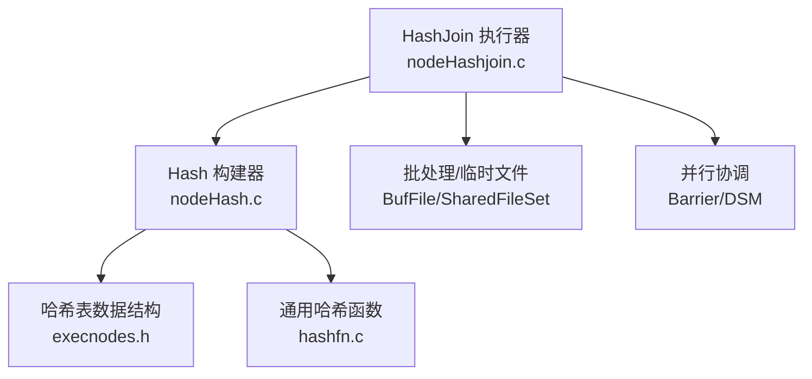
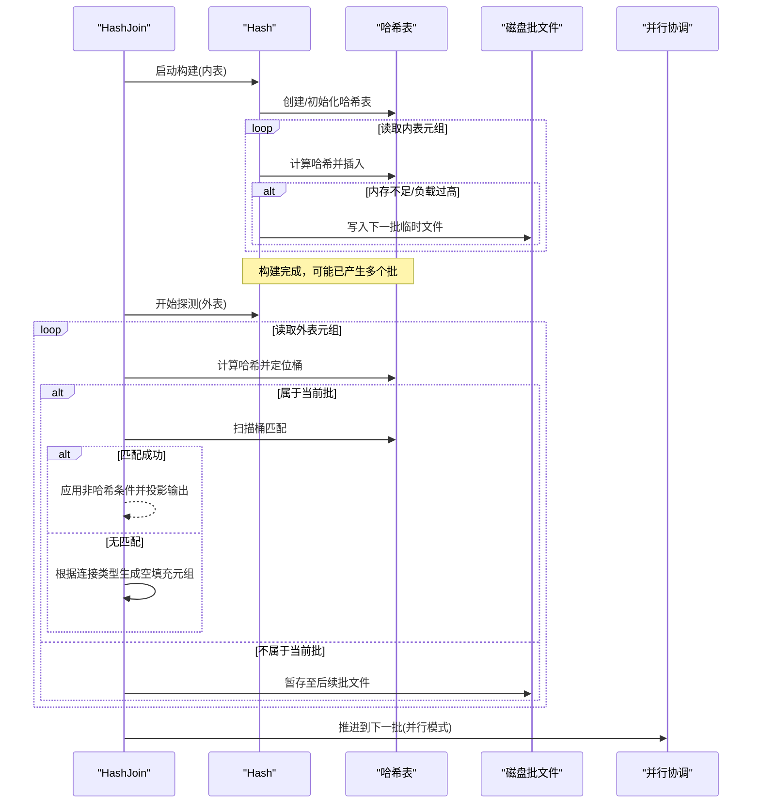
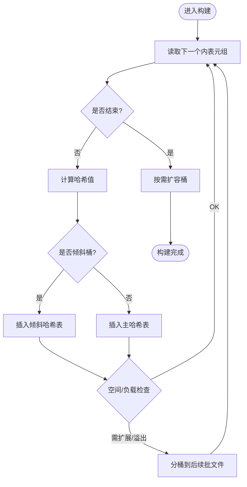
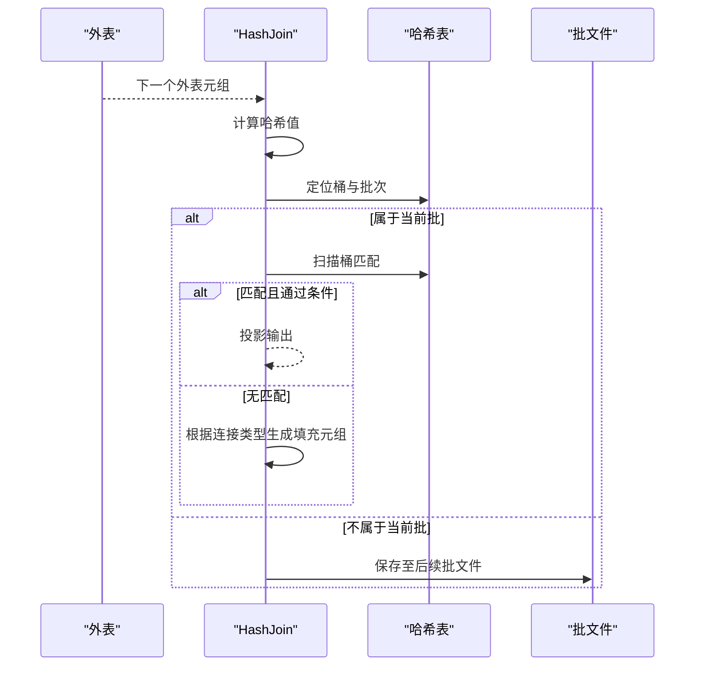
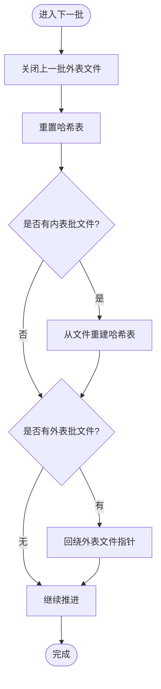
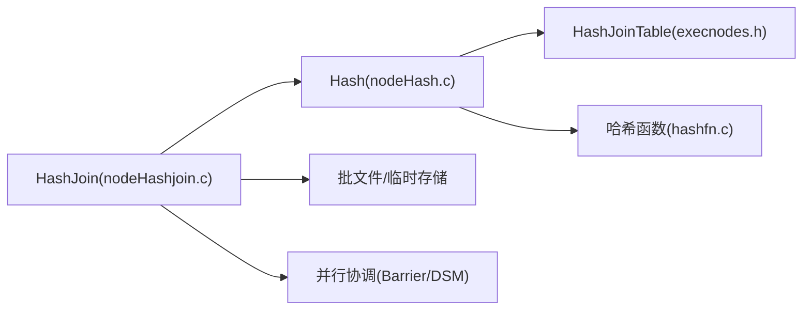

# 哈希连接

<cite>
**本文引用的文件**
- [nodeHashjoin.c](file://src/backend/executor/nodeHashjoin.c)
- [nodeHash.c](file://src/backend/executor/nodeHash.c)
- [hashfn.c](file://src/common/hashfn.c)
- [execnodes.h](file://src/include/nodes/execnodes.h)
</cite>

## 目录
1. [简介](#简介)
2. [项目结构](#项目结构)
3. [核心组件](#核心组件)
4. [架构总览](#架构总览)
5. [详细组件分析](#详细组件分析)
6. [依赖关系分析](#依赖关系分析)
7. [性能考量](#性能考量)
8. [故障排查指南](#故障排查指南)
9. [结论](#结论)
10. [附录](#附录)

## 简介
本文件为 Mini PostgreSQL 的哈希连接（HashJoin）实现提供系统化、可操作的文档。内容覆盖构建阶段与探测阶段的算法流程、哈希表构建与内存管理策略、溢出处理机制、哈希函数选择与冲突解决、内连接/外连接/半连接的差异实现，以及性能特征、适用场景与调优建议，并附带代码级图示与调试方法。

## 项目结构
Mini PostgreSQL 的哈希连接由执行器节点 HashJoin 与 Hash 协作完成：
- HashJoin 负责状态机驱动、批处理推进、外连接填充、并行协调等。
- Hash 负责将输入流构建为哈希表（含分桶、扩展、倾斜优化、临时文件落盘）。
- 通用哈希函数位于 common 层，供动态哈希表与执行期哈希使用。

**图表来源**
- [nodeHashjoin.c:170-606](file://src/backend/executor/nodeHashjoin.c#L170-L606)
- [nodeHash.c:138-200](file://src/backend/executor/nodeHash.c#L138-L200)
- [execnodes.h:2261-2284](file://src/include/nodes/execnodes.h#L2261-L2284)
- [hashfn.c:127-200](file://src/common/hashfn.c#L127-L200)

**章节来源**
- [nodeHashjoin.c:170-606](file://src/backend/executor/nodeHashjoin.c#L170-L606)
- [nodeHash.c:138-200](file://src/backend/executor/nodeHash.c#L138-L200)
- [execnodes.h:2261-2284](file://src/include/nodes/execnodes.h#L2261-L2284)
- [hashfn.c:127-200](file://src/common/hashfn.c#L127-L200)

## 核心组件
- HashJoinState：哈希连接的状态机与运行时上下文，维护当前批次、桶号、斜桶、匹配标记、空元组槽等。
- HashState：负责从子计划读取元组、计算哈希值、插入哈希表或写入批文件。
- HashJoinTable：哈希表控制块，包含桶数、批数、空间配额、统计信息、批文件指针、并行状态等。
- 并行支持：ParallelHashJoinState、Barrier、DSM/SharedFileSet，用于多进程协同构建与探测。

关键职责划分：
- 构建阶段：Hash 节点遍历内表，计算键哈希，插入哈希表；若超内存则分桶到临时文件。
- 探测阶段：HashJoin 遍历外表，按哈希定位桶，扫描匹配元组，应用非哈希条件后投影输出。
- 溢出处理：当桶/批增长或数据无法放入内存时，将元组分派到后续批次的临时文件中，逐批重放。

**章节来源**
- [nodeHashjoin.c:646-786](file://src/backend/executor/nodeHashjoin.c#L646-L786)
- [nodeHash.c:437-600](file://src/backend/executor/nodeHash.c#L437-L600)
- [execnodes.h:2261-2284](file://src/include/nodes/execnodes.h#L2261-L2284)

## 架构总览
哈希连接采用混合哈希连接（Hybrid Hash Join）思想：优先在内存中构建与探测，必要时分桶到磁盘，按批推进。并行模式下通过 Barrier 协调各参与者的构建与探测进度，共享临时文件与共享内存区域。

**图表来源**
- [nodeHashjoin.c:170-606](file://src/backend/executor/nodeHashjoin.c#L170-L606)
- [nodeHash.c:138-200](file://src/backend/executor/nodeHash.c#L138-L200)
- [nodeHashjoin.c:976-1110](file://src/backend/executor/nodeHashjoin.c#L976-L1110)

## 详细组件分析

### 构建阶段（内表哈希化）
- 入口：MultiExecHash -> MultiExecPrivateHash/MultiExecParallelHash。
- 流程要点：
  - 从子计划拉取元组，计算哈希值（基于哈希操作符对应的哈希函数族）。
  - 检测倾斜桶（skew bucket），将热点键单独处理。
  - 正常键插入哈希表；若负载因子超限或空间不足，触发桶/批扩展，或将元组写入后续批的临时文件。
  - 完成后按需扩容桶以维持目标负载因子。

**图表来源**
- [nodeHash.c:138-200](file://src/backend/executor/nodeHash.c#L138-L200)
- [nodeHash.c:437-600](file://src/backend/executor/nodeHash.c#L437-L600)

**章节来源**
- [nodeHash.c:138-200](file://src/backend/executor/nodeHash.c#L138-L200)
- [nodeHash.c:437-600](file://src/backend/executor/nodeHash.c#L437-L600)

### 探测阶段（外表扫描与匹配）
- 入口：ExecHashJoinImpl -> HJ_NEED_NEW_OUTER/HJ_SCAN_BUCKET。
- 流程要点：
  - 获取下一个外表元组，计算哈希值，定位桶与批次。
  - 若属于当前批：扫描桶匹配，应用 joinqual 与 otherqual，投影输出。
  - 若不属于当前批：将外表元组保存到对应批的临时文件，延迟到后续批处理。
  - 无匹配时，根据连接类型决定是否输出左/右/全外连接的填充元组。

**图表来源**
- [nodeHashjoin.c:170-606](file://src/backend/executor/nodeHashjoin.c#L170-L606)
- [nodeHashjoin.c:837-906](file://src/backend/executor/nodeHashjoin.c#L837-L906)

**章节来源**
- [nodeHashjoin.c:170-606](file://src/backend/executor/nodeHashjoin.c#L170-L606)
- [nodeHashjoin.c:837-906](file://src/backend/executor/nodeHashjoin.c#L837-L906)

### 批处理与溢出机制
- 批推进：ExecHashJoinNewBatch/ExecParallelHashJoinNewBatch。
- 行为：
  - 关闭并释放上一批的外表批文件。
  - 重置哈希表，从当前批的内表临时文件重新加载构建。
  - 若外表批文件存在，回绕指针准备探测。
  - 跳过完全空的批；在外/右/全外连接下保留必要的批处理路径。

**图表来源**
- [nodeHashjoin.c:976-1110](file://src/backend/executor/nodeHashjoin.c#L976-L1110)

**章节来源**
- [nodeHashjoin.c:976-1110](file://src/backend/executor/nodeHashjoin.c#L976-L1110)

### 哈希函数与冲突解决
- 哈希函数：
  - 执行期哈希键通过哈希操作符解析出左右哈希函数族，分别用于外表与内表键。
  - 通用哈希函数（如 hash_bytes）提供高质量 32 位散列，保证位随机性，利于桶分布均匀。
- 冲突解决：
  - 采用链式哈希（桶内链表/数组）存储元组引用，配合负载因子阈值进行扩容。
  - 倾斜优化：对热点键建立独立倾斜哈希表，避免单桶过大导致退化。

**章节来源**
- [nodeHash.c:437-600](file://src/backend/executor/nodeHash.c#L437-L600)
- [hashfn.c:127-200](file://src/common/hashfn.c#L127-L200)

### 连接类型差异（内连接、外连接、半连接）
- 内连接（INNER）：仅输出匹配成功的元组。
- 左/右/全外连接（LEFT/RIGHT/FULL）：
  - 左/右/全外连接需要空填充元组槽（NullOuterTupleSlot/NullInnerTupleSlot）。
  - 当外表元组无匹配时，输出带 NULL 的填充元组；当内表未匹配时，在批结束后扫描哈希表输出未匹配内表元组。
- 半连接（SEMI）与反连接（ANTI）：
  - 半连接只需找到首个匹配即返回（single_match 标志）。
  - 反连接不输出匹配元组，仅输出未匹配的外表元组。

**章节来源**
- [nodeHashjoin.c:646-786](file://src/backend/executor/nodeHashjoin.c#L646-L786)
- [nodeHashjoin.c:170-606](file://src/backend/executor/nodeHashjoin.c#L170-L606)

### 并行哈希连接
- 并行协调：
  - 使用 Barrier 同步构建阶段各参与者（分配、哈希、运行、完成）。
  - 每批也有独立 Barrier，协调加载与探测。
- 共享资源：
  - 共享临时文件集（SharedFileSet）与共享内存（DSM），减少重复构建与拷贝。
- 工作进程：
  - ExecHashJoinInitializeWorker/ExecHashJoinInitializeDSM 设置共享状态与工作函数。

**章节来源**
- [nodeHashjoin.c:1465-1515](file://src/backend/executor/nodeHashjoin.c#L1465-L1515)
- [nodeHashjoin.c:1523-1559](file://src/backend/executor/nodeHashjoin.c#L1523-L1559)
- [nodeHashjoin.c:1561-1578](file://src/backend/executor/nodeHashjoin.c#L1561-L1578)

## 依赖关系分析
- HashJoin 依赖 Hash 节点完成内表哈希化；两者通过 PlanState 树连接。
- HashJoinTable 作为核心数据结构，被 Hash 与 HashJoin 共同读写。
- 通用哈希函数为哈希键计算提供基础能力。
- 并行模块通过 Barrier/DSM/SharedFileSet 提供跨进程协调与共享存储。

**图表来源**
- [nodeHashjoin.c:170-606](file://src/backend/executor/nodeHashjoin.c#L170-L606)
- [nodeHash.c:138-200](file://src/backend/executor/nodeHash.c#L138-L200)
- [execnodes.h:2261-2284](file://src/include/nodes/execnodes.h#L2261-L2284)
- [hashfn.c:127-200](file://src/common/hashfn.c#L127-L200)

**章节来源**
- [nodeHashjoin.c:170-606](file://src/backend/executor/nodeHashjoin.c#L170-L606)
- [nodeHash.c:138-200](file://src/backend/executor/nodeHash.c#L138-L200)
- [execnodes.h:2261-2284](file://src/include/nodes/execnodes.h#L2261-L2284)
- [hashfn.c:127-200](file://src/common/hashfn.c#L127-L200)

## 性能考量
- 内存与负载因子：
  - 哈希表初始大小与批数由估计行数与宽度决定，目标负载因子影响扩容频率与 I/O 开销。
  - spaceAllowed/spaceUsed/spacePeak 用于监控与诊断。
- 倾斜优化：
  - 对热点键使用倾斜哈希表，避免单桶过大导致的扫描退化。
- 批处理与 I/O：
  - 合理预估 nbatch 可减少临时文件读写；批推进时尽量跳过空批。
- 并行度：
  - 多参与者共享哈希表与临时文件可降低整体构建成本；注意 Barrier 同步开销。
- 表达式评估：
  - 每元组重置 ExprContext，避免泄漏；非哈希条件过滤应尽可能前置以减少投影与输出。

[本节为通用指导，不直接分析具体文件]

## 故障排查指南
- 常见错误与日志：
  - 临时文件读写失败：检查 BufFile 打开/回绕/读取返回值，关注“could not rewind/read”类错误。
  - 非法状态：遇到 unrecognized hashjoin state 时，检查状态机转换逻辑。
- 调试步骤：
  - 启用 EXPLAIN ANALYZE 观察 Hash 节点统计（partialTuples、spacePeak 等）。
  - 检查哈希表统计（totalTuples、skewTuples、nbuckets、nbatch）判断是否频繁扩容或倾斜。
  - 核对连接类型与空填充槽配置，确认 LEFT/RIGHT/FULL 的 Null 槽是否正确初始化。
- 定位热点：
  - 若某桶过大，考虑调整哈希键或增加哈希表容量；检查是否存在数据倾斜。

**章节来源**
- [nodeHashjoin.c:976-1110](file://src/backend/executor/nodeHashjoin.c#L976-L1110)
- [nodeHash.c:437-600](file://src/backend/executor/nodeHash.c#L437-L600)

## 结论
Mini PostgreSQL 的哈希连接实现了高效的混合哈希连接算法，具备完善的内存管理、溢出处理与并行协调机制。通过合理的哈希函数选择、倾斜优化与批处理策略，能够在不同数据分布与资源约束下保持良好性能。针对外连接与半/反连接的特殊处理，使其适用于广泛的查询场景。实际使用中应结合 EXPLAIN 统计与系统参数调优，以获得最佳效果。

[本节为总结性内容，不直接分析具体文件]

## 附录
- 关键函数路径参考：
  - 构建与探测主循环：[ExecHashJoinImpl:170-606](file://src/backend/executor/nodeHashjoin.c#L170-L606)
  - 外表元组获取与哈希计算：[ExecHashJoinOuterGetTuple:837-906](file://src/backend/executor/nodeHashjoin.c#L837-L906)
  - 批推进与重加载：[ExecHashJoinNewBatch:976-1110](file://src/backend/executor/nodeHashjoin.c#L976-L1110)
  - 哈希表创建与初始化：[ExecHashTableCreate:437-600](file://src/backend/executor/nodeHash.c#L437-L600)
  - 通用哈希函数：[hash_bytes:127-200](file://src/common/hashfn.c#L127-L200)
  - 哈希表数据结构定义：[HashState:2261-2284](file://src/include/nodes/execnodes.h#L2261-L2284)

[本节为索引与导航，不直接分析具体文件]