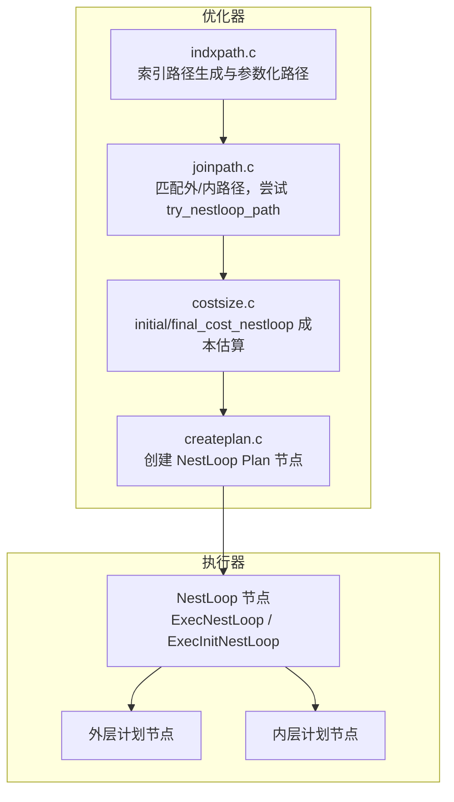
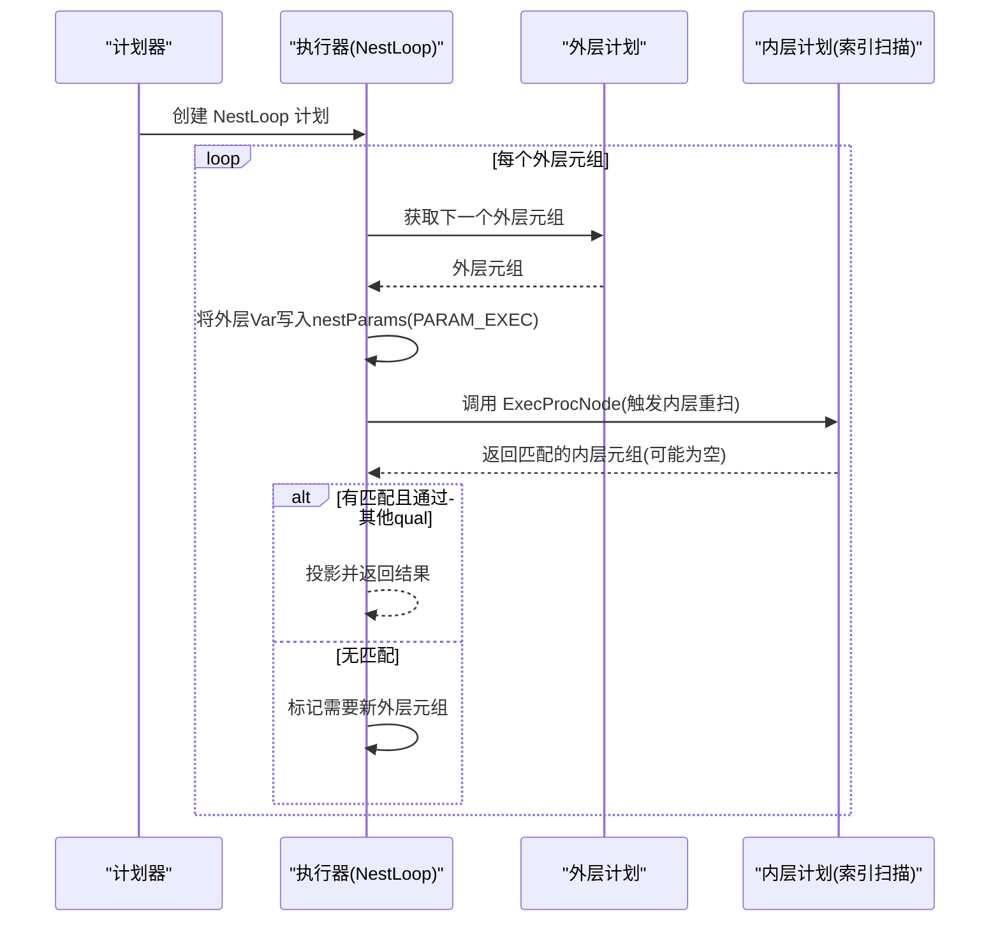
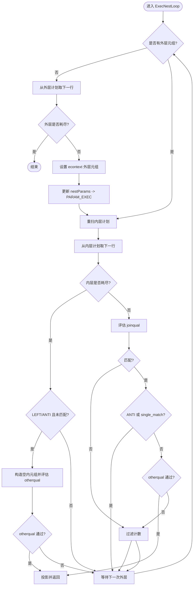
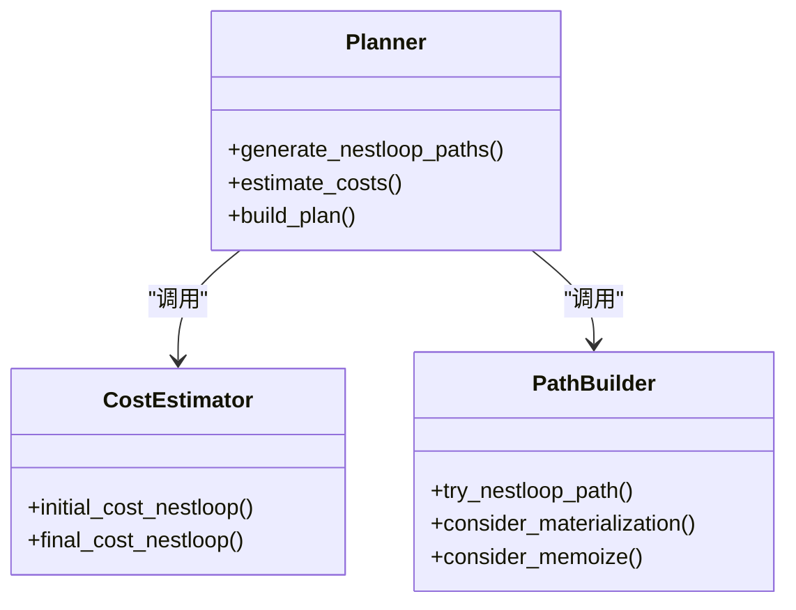
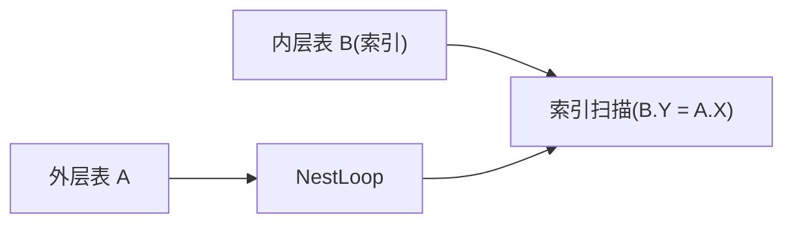
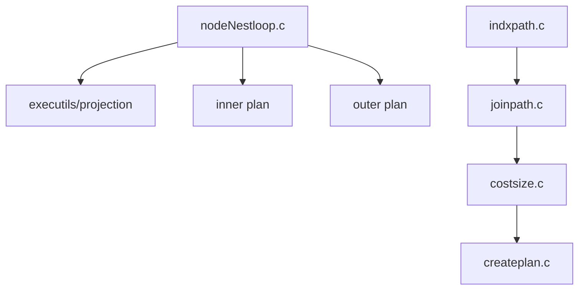

# 嵌套循环连接

<cite>
**本文引用的文件**
- [nodeNestloop.c](file://src/backend/executor/nodeNestloop.c)
- [nodeNestloop.h](file://src/include/executor/nodeNestloop.h)
- [costsize.c](file://src/backend/optimizer/path/costsize.c)
- [joinpath.c](file://src/backend/optimizer/path/joinpath.c)
- [createplan.c](file://src/backend/optimizer/plan/createplan.c)
- [indxpath.c](file://src/backend/optimizer/path/indxpath.c)
- [README（优化器）](file://src/backend/optimizer/README)
</cite>

## 目录
1. [简介](#简介)
2. [项目结构](#项目结构)
3. [核心组件](#核心组件)
4. [架构总览](#架构总览)
5. [详细组件分析](#详细组件分析)
6. [依赖关系分析](#依赖关系分析)
7. [性能考量](#性能考量)
8. [故障排查指南](#故障排查指南)
9. [结论](#结论)
10. [附录](#附录)

## 简介
本文件围绕 Mini PostgreSQL 中的嵌套循环连接（NestLoop）进行系统化文档化，覆盖算法原理、执行流程、索引扫描与参数化路径、批量处理机制、与其他连接类型的组合、并行执行支持、计划器选择策略以及在子查询/相关子查询/复杂连接树中的应用。同时给出性能分析与优化建议及最佳实践。

## 项目结构
与 NestLoop 直接相关的代码分布在执行器与优化器两个层面：
- 执行器层：负责实际驱动外层/内层计划节点、维护状态、评估连接条件并产出结果元组。
- 优化器层：负责生成 NestLoop 路径、估算成本、选择合适的外/内输入以及是否使用索引扫描或物化等策略。

图表来源
- [nodeNestloop.c:60-256](file://src/backend/executor/nodeNestloop.c#L60-L256)
- [joinpath.c:1611-1799](file://src/backend/optimizer/path/joinpath.c#L1611-L1799)
- [costsize.c:2611-2884](file://src/backend/optimizer/path/costsize.c#L2611-L2884)
- [createplan.c:3561-3605](file://src/backend/optimizer/plan/createplan.c#L3561-L3605)
- [indxpath.c:1-200](file://src/backend/optimizer/path/indxpath.c#L1-L200)

章节来源
- [nodeNestloop.c:60-256](file://src/backend/executor/nodeNestloop.c#L60-L256)
- [joinpath.c:1611-1799](file://src/backend/optimizer/path/joinpath.c#L1611-L1799)
- [costsize.c:2611-2884](file://src/backend/optimizer/path/costsize.c#L2611-L2884)
- [createplan.c:3561-3605](file://src/backend/optimizer/plan/createplan.c#L3561-L3605)
- [indxpath.c:1-200](file://src/backend/optimizer/path/indxpath.c#L1-L200)

## 核心组件
- 执行器 NestLoopState：维护外层/内层计划节点、表达式上下文、连接类型、是否需要新外层元组、是否已匹配外层、用于外连接的空内元组槽等。
- 执行函数 ExecNestLoop：实现“外层驱动、内层重扫”的核心循环；支持 SEMI/ANTI 的 single_match 早停；支持 LEFT/ANTI 的空填充；支持 nestParams 将外层变量作为运行期参数传入内层。
- 初始化/结束/重扫：ExecInitNestLoop、ExecEndNestLoop、ExecReScanNestLoop。
- 优化器路径与成本：initial_cost_nestloop、final_cost_nestloop 分别做初步与最终成本估算；match_unsorted_outer 中尝试 try_nestloop_path 并考虑物化与 memoize；create_nestloop_plan 构建计划节点与投影。
- 索引与参数化路径：indxpath.c 为内层生成可参数化的索引路径，使 NestLoop 能在每次外层迭代时以常量键值高效定位。

章节来源
- [nodeNestloop.c:262-353](file://src/backend/executor/nodeNestloop.c#L262-L353)
- [nodeNestloop.c:361-411](file://src/backend/executor/nodeNestloop.c#L361-L411)
- [costsize.c:2611-2884](file://src/backend/optimizer/path/costsize.c#L2611-L2884)
- [joinpath.c:1611-1799](file://src/backend/optimizer/path/joinpath.c#L1611-L1799)
- [createplan.c:3561-3605](file://src/backend/optimizer/plan/createplan.c#L3561-L3605)
- [indxpath.c:1-200](file://src/backend/optimizer/path/indxpath.c#L1-L200)

## 架构总览
下图展示从优化器到执行器的关键交互：优化器生成带参数的内层索引路径，执行器在每次外层元组到来时将外层变量注入内层参数，内层按参数重扫索引，快速定位匹配行。

图表来源
- [nodeNestloop.c:60-256](file://src/backend/executor/nodeNestloop.c#L60-L256)
- [createplan.c:3561-3605](file://src/backend/optimizer/plan/createplan.c#L3561-L3605)
- [indxpath.c:1-200](file://src/backend/optimizer/path/indxpath.c#L1-L200)

## 详细组件分析

### 执行器：NestLoop 主循环与状态机
- 外层驱动：当没有外层元组时，从外层计划取下一行；若外层耗尽则结束。
- 参数传递：对每个外层元组，将其 Var 值写入 PARAM_EXEC 槽，并标记内层计划 chgParam 变化，随后重扫内层。
- 内层扫描：调用内层计划获取下一行；若无匹配，针对 LEFT/ANTI 外连接生成空填充行（若通过非连接条件）。
- 连接条件评估：仅 joinqual 决定 matchedOuter 状态；otherqual 决定是否输出。
- 早停与去重：SEMI/ANTI 或 inner_unique 时，single_match 标志允许找到第一个匹配后即推进外层。
- 内存管理：每元组重置表达式上下文，避免累积临时存储；结束时释放上下文、清空结果槽、关闭子计划。

图表来源
- [nodeNestloop.c:60-256](file://src/backend/executor/nodeNestloop.c#L60-L256)

章节来源
- [nodeNestloop.c:60-256](file://src/backend/executor/nodeNestloop.c#L60-L256)
- [nodeNestloop.c:262-353](file://src/backend/executor/nodeNestloop.c#L262-L353)
- [nodeNestloop.c:361-411](file://src/backend/executor/nodeNestloop.c#L361-L411)

### 优化器：路径生成与成本估算
- 路径生成：match_unsorted_outer 遍历外层路径，结合内层 cheapest_parameterized_paths 尝试 try_nestloop_path；必要时考虑物化内层或 memoize 路径。
- 成本估算：
  - initial_cost_nestloop：快速下界估计，区分 SEMI/ANTI/inner_unique 的早期停止场景。
  - final_cost_nestloop：精确 CPU 成本、目标列投影成本、基于 has_indexed_join_quals 的索引利用收益、outer_matched/unmatched 的成本拆分。
- 计划构建：create_nestloop_plan 组装外/内计划、排序连接条件、提取 join/other 条件、建立投影。

图表来源
- [joinpath.c:1611-1799](file://src/backend/optimizer/path/joinpath.c#L1611-L1799)
- [costsize.c:2611-2884](file://src/backend/optimizer/path/costsize.c#L2611-L2884)
- [createplan.c:3561-3605](file://src/backend/optimizer/plan/createplan.c#L3561-L3605)

章节来源
- [joinpath.c:1611-1799](file://src/backend/optimizer/path/joinpath.c#L1611-L1799)
- [costsize.c:2611-2884](file://src/backend/optimizer/path/costsize.c#L2611-L2884)
- [createplan.c:3561-3605](file://src/backend/optimizer/plan/createplan.c#L3561-L3605)

### 索引扫描与参数化路径
- 参数化路径：内层索引扫描可将外层变量作为运行期常量键值，从而在每次外层迭代时精准定位，避免全表扫描。
- 多层传递：参数可跨中间连接层传递，形成深层嵌套的 NestLoop + Index Scan 模式。
- 代价权衡：对小外层基数，NestLoop+Index 通常最优；随着外层增大，Merge/Hash Join 更优。

图表来源
- [README（优化器）:732-819](file://src/backend/optimizer/README#L732-L819)
- [indxpath.c:1-200](file://src/backend/optimizer/path/indxpath.c#L1-L200)

章节来源
- [README（优化器）:732-819](file://src/backend/optimizer/README#L732-L819)
- [indxpath.c:1-200](file://src/backend/optimizer/path/indxpath.c#L1-L200)

### 批量处理机制
- NestLoop 本身不采用哈希分桶式批处理；其“批量”体现在每次外层元组驱动一次内层扫描。
- 当内层支持 REWIND 且无 nestParams 时，可通过 EXEC_FLAG_REWIND 提示内层支持低成本重扫。
- 对比 HashJoin 的批次处理（分批写盘/读盘），NestLoop 更适合小外层基数的逐行驱动。

章节来源
- [nodeNestloop.c:297-302](file://src/backend/executor/nodeNestloop.c#L297-L302)
- [nodeHashjoin.c:1044-1057](file://src/backend/executor/nodeHashjoin.c#L1044-L1057)

### 与其他连接类型的组合
- 可与 MergeJoin/HashJoin 组合形成多连接树；NestLoop 常作为叶子或中间节点，配合参数化路径穿透上层连接。
- 在存在外连接约束时，连接顺序不可随意重排，NestLoop 能承载参数向下传递。

章节来源
- [README（优化器）:732-819](file://src/backend/optimizer/README#L732-L819)
- [joinpath.c:1611-1799](file://src/backend/optimizer/path/joinpath.c#L1611-L1799)

### 并行执行支持
- 成本估算中对 partial paths 的行数按比例缩放，体现并行工作进程的影响。
- 具体并行执行由上层 Gather/GatherMerge 协调，NestLoop 节点自身不直接并行化。

章节来源
- [costsize.c:2736-2743](file://src/backend/optimizer/path/costsize.c#L2736-L2743)

### 在子查询/相关子查询/复杂连接树中的应用
- 相关子查询常被转化为带 nestParams 的 NestLoop，外层提供相关列，内层用索引扫描快速求值。
- 复杂连接树中，NestLoop 可作为“参数透传”的关键节点，使底层索引扫描获得多个外层变量的联合过滤条件。

章节来源
- [README（优化器）:732-819](file://src/backend/optimizer/README#L732-L819)
- [nodeNestloop.c:129-152](file://src/backend/executor/nodeNestloop.c#L129-L152)

## 依赖关系分析
- 执行器依赖：
  - 表达式上下文与投影：ExecAssignExprContext、ExecProject。
  - 子计划接口：ExecProcNode、ExecReScan。
  - 统计与过滤计数：InstrCountFiltered*。
- 优化器依赖：
  - 路径枚举：joinpath.c 中的 try_nestloop_path 与 cheapest_parameterized_paths。
  - 成本模型：costsize.c 的两阶段估算。
  - 计划构建：createplan.c 的 create_nestloop_plan。
  - 索引路径：indxpath.c 的参数化索引路径生成。

图表来源
- [nodeNestloop.c:60-256](file://src/backend/executor/nodeNestloop.c#L60-L256)
- [joinpath.c:1611-1799](file://src/backend/optimizer/path/joinpath.c#L1611-L1799)
- [costsize.c:2611-2884](file://src/backend/optimizer/path/costsize.c#L2611-L2884)
- [createplan.c:3561-3605](file://src/backend/optimizer/plan/createplan.c#L3561-L3605)
- [indxpath.c:1-200](file://src/backend/optimizer/path/indxpath.c#L1-L200)

章节来源
- [nodeNestloop.c:60-256](file://src/backend/executor/nodeNestloop.c#L60-L256)
- [joinpath.c:1611-1799](file://src/backend/optimizer/path/joinpath.c#L1611-L1799)
- [costsize.c:2611-2884](file://src/backend/optimizer/path/costsize.c#L2611-L2884)
- [createplan.c:3561-3605](file://src/backend/optimizer/plan/createplan.c#L3561-L3605)
- [indxpath.c:1-200](file://src/backend/optimizer/path/indxpath.c#L1-L200)

## 性能考量
- 数据规模与选择策略：
  - 小外层基数 + 强选择性内层索引：NestLoop + Index Scan 通常最优。
  - 大外层基数：Merge/Hash Join 更具优势。
- 索引利用策略：
  - 确保连接条件可映射为索引条件；必要时使用复合索引或函数索引。
  - 利用 has_indexed_join_quals 的收益，减少内层扫描比例。
- 内存管理：
  - 每元组重置表达式上下文，避免泄漏。
  - 无 nestParams 时启用 REWIND 以降低重扫成本。
- 早停与去重：
  - SEMI/ANTI/inner_unique 的 single_match 可减少内层扫描量。
- 并行：
  - 部分路径行数按比例缩放，整体并行收益由上层协调。

章节来源
- [costsize.c:2611-2884](file://src/backend/optimizer/path/costsize.c#L2611-L2884)
- [nodeNestloop.c:297-302](file://src/backend/executor/nodeNestloop.c#L297-L302)
- [nodeNestloop.c:218-231](file://src/backend/executor/nodeNestloop.c#L218-L231)

## 故障排查指南
- 现象：NestLoop 性能退化，出现大量全表扫描。
  - 检查是否缺少合适的索引或连接条件无法下推为索引条件。
  - 确认外层基数是否过大导致 NestLoop 不再是最优选择。
- 现象：LEFT/ANTI 外连接结果异常。
  - 核对 nl_MatchedOuter 与空填充逻辑，确保 otherqual 正确评估。
- 现象：参数化路径未生效。
  - 检查 nestParams 是否正确设置，内层计划是否被标记为参数化路径。
- 现象：内存增长或泄漏。
  - 确认每元组 ResetExprContext 被调用；结束时释放上下文与子计划。

章节来源
- [nodeNestloop.c:163-201](file://src/backend/executor/nodeNestloop.c#L163-L201)
- [nodeNestloop.c:297-302](file://src/backend/executor/nodeNestloop.c#L297-L302)
- [nodeNestloop.c:361-411](file://src/backend/executor/nodeNestloop.c#L361-L411)

## 结论
NestLoop 在小外层基数与强索引选择性场景下表现优异，通过参数化路径将外层变量高效传递给内层索引扫描，显著降低 I/O 与 CPU 开销。在大外层基数或弱索引条件下，应优先考虑 Merge/Hash Join。合理配置索引、理解单匹配早停与外连接空填充行为、关注内存上下文管理，是获得稳定高性能的关键。

## 附录
- 术语
  - 外层/内层：NestLoop 的两个输入源，外层驱动，内层重扫。
  - 参数化路径：依赖外部关系的列值作为运行期常量的访问路径。
  - 早停：在 SEMI/ANTI/inner_unique 情况下找到首个匹配即停止内层扫描。
- 参考
  - 执行器接口：ExecInitNestLoop、ExecNestLoop、ExecEndNestLoop、ExecReScanNestLoop。
  - 优化器接口：initial_cost_nestloop、final_cost_nestloop、try_nestloop_path、create_nestloop_plan。