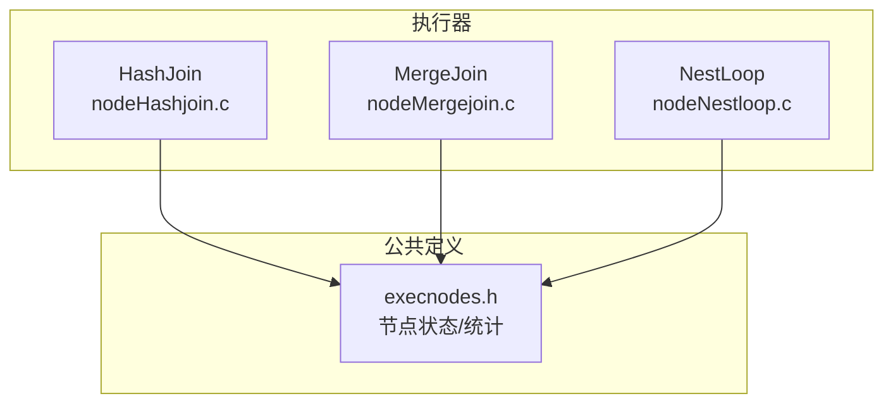
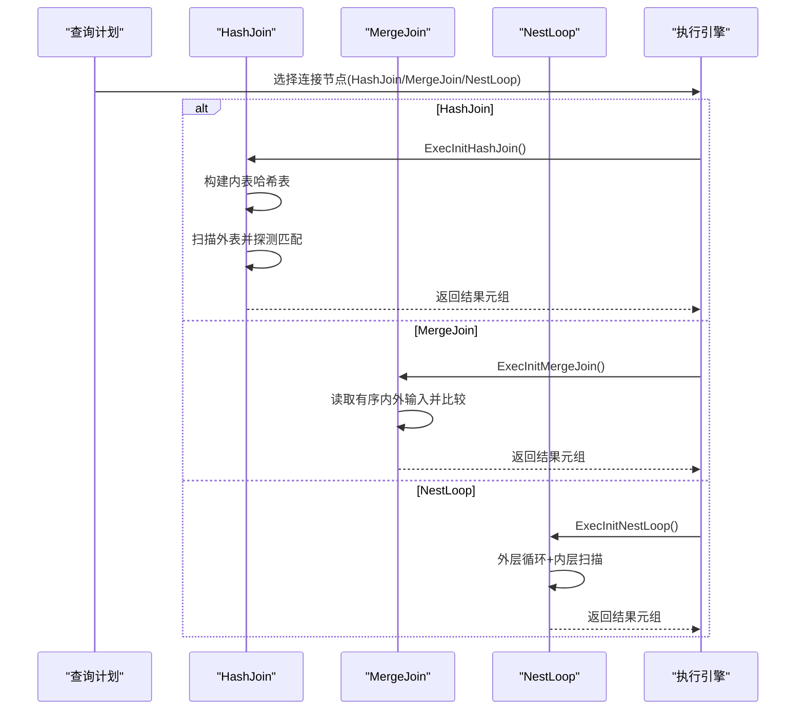
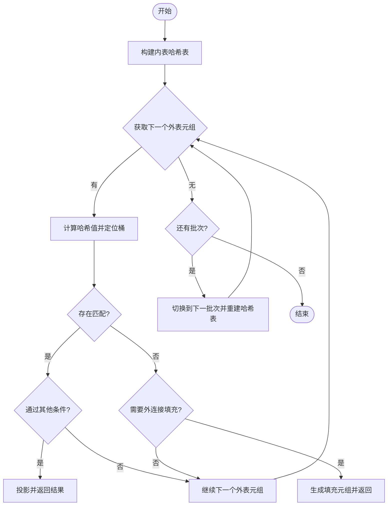
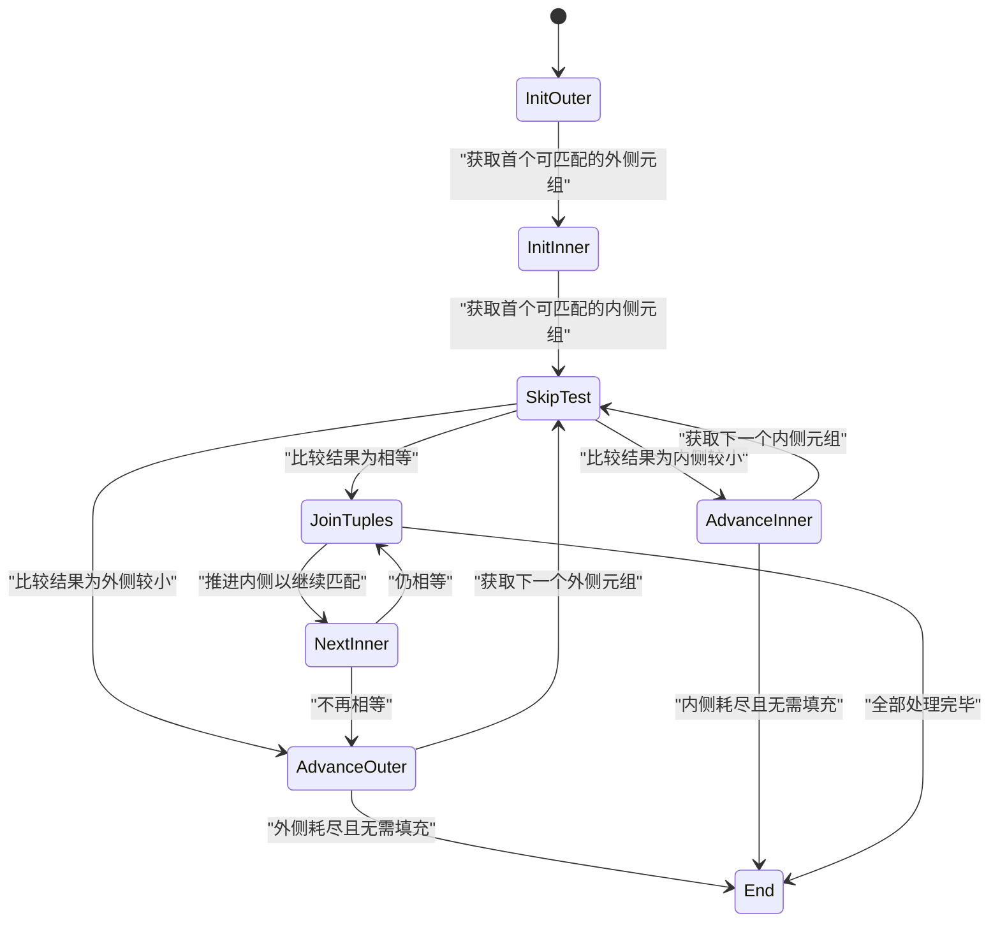
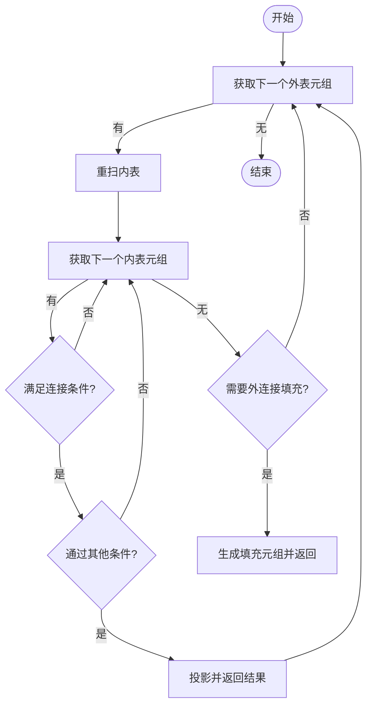
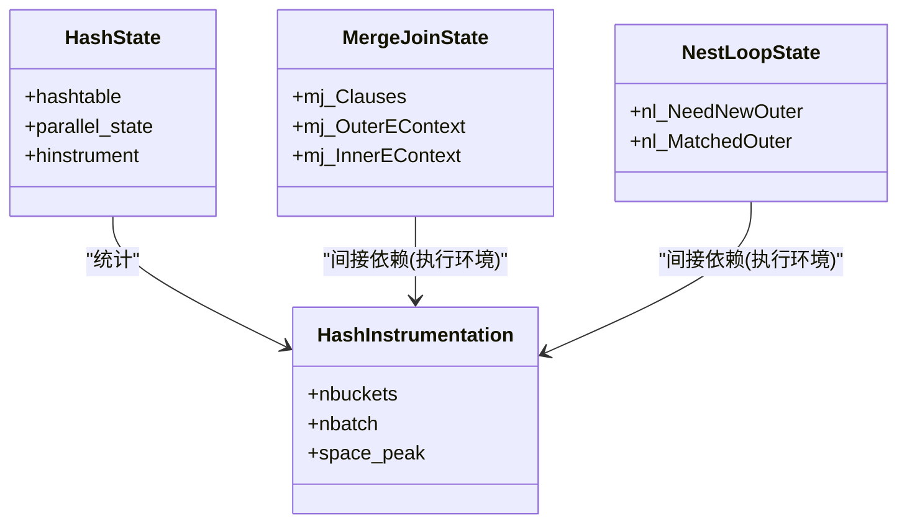

# 连接节点

<cite>
**本文引用的文件**
- [nodeHashjoin.c](file://src/backend/executor/nodeHashjoin.c)
- [nodeMergejoin.c](file://src/backend/executor/nodeMergejoin.c)
- [nodeNestloop.c](file://src/backend/executor/nodeNestloop.c)
- [execnodes.h](file://src/include/nodes/execnodes.h)
</cite>

## 目录
1. [简介](#简介)
2. [项目结构](#项目结构)
3. [核心组件](#核心组件)
4. [架构总览](#架构总览)
5. [详细组件分析](#详细组件分析)
6. [依赖关系分析](#依赖关系分析)
7. [性能考量](#性能考量)
8. [故障排查指南](#故障排查指南)
9. [结论](#结论)
10. [附录](#附录)

## 简介
本文面向Mini PostgreSQL执行器中的连接节点，系统性阐述三种核心连接算法的实现与运行机制：哈希连接（HashJoin）、合并连接（MergeJoin）和嵌套循环连接（NestLoop）。文档覆盖连接条件处理、算法选择策略、内存管理、构建阶段与执行阶段的划分、哈希表构建与匹配查找、结果生成流程，以及不同连接类型的复杂度与适用场景。同时提供流程图、状态机图与调优建议，帮助读者在复杂查询优化中做出合理决策。

## 项目结构
连接节点位于执行器子系统中，分别由以下源文件实现：
- 哈希连接：src/backend/executor/nodeHashjoin.c
- 合并连接：src/backend/executor/nodeMergejoin.c
- 嵌套循环连接：src/backend/executor/nodeNestloop.c
- 执行期节点定义与统计信息：src/include/nodes/execnodes.h

图表来源
- [nodeHashjoin.c:1-120](file://src/backend/executor/nodeHashjoin.c#L1-L120)
- [nodeMergejoin.c:1-120](file://src/backend/executor/nodeMergejoin.c#L1-L120)
- [nodeNestloop.c:1-60](file://src/backend/executor/nodeNestloop.c#L1-L60)
- [execnodes.h:2238-2284](file://src/include/nodes/execnodes.h#L2238-L2284)

章节来源
- [nodeHashjoin.c:1-120](file://src/backend/executor/nodeHashjoin.c#L1-L120)
- [nodeMergejoin.c:1-120](file://src/backend/executor/nodeMergejoin.c#L1-L120)
- [nodeNestloop.c:1-60](file://src/backend/executor/nodeNestloop.c#L1-L60)
- [execnodes.h:2238-2284](file://src/include/nodes/execnodes.h#L2238-L2284)

## 核心组件
- 哈希连接（HashJoin）
  - 构建阶段：基于内表（inner）构建哈希表；支持多批次（batch）与并行（Parallel Hash）；支持倾斜桶（skew bucket）与溢出到临时文件。
  - 执行阶段：扫描外表（outer），计算哈希值并定位桶，进行匹配；支持左/右/全外连接的填充元组；支持反连接（ANTI）与半连接（SEMI）的短路逻辑。
  - 关键函数：ExecInitHashJoin、ExecHashJoinImpl、ExecHashJoinOuterGetTuple、ExecHashJoinNewBatch、ExecParallelHashJoinNewBatch、ExecReScanHashJoin。
- 合并连接（MergeJoin）
  - 前提：内外输入需按连接键有序；通过比较函数推进两侧游标，找到相等区间后批量产出。
  - 状态机：初始化、跳过测试、连接元组、前进内外侧、结束处理等；支持标记/恢复以处理重复键。
  - 关键函数：ExecInitMergeJoin、ExecMergeJoin、MJEvalOuterValues/MJEvalInnerValues、MJCompare、MJFillOuter/MJFillInner。
- 嵌套循环连接（NestLoop）
  - 对每个外表元组，重扫内表并应用连接条件；支持参数化内表（nestParams）与外部连接填充。
  - 关键函数：ExecInitNestLoop、ExecNestLoop、ExecReScanNestLoop。

章节来源
- [nodeHashjoin.c:157-606](file://src/backend/executor/nodeHashjoin.c#L157-L606)
- [nodeMergejoin.c:595-1429](file://src/backend/executor/nodeMergejoin.c#L595-L1429)
- [nodeNestloop.c:60-256](file://src/backend/executor/nodeNestloop.c#L60-L256)

## 架构总览
连接节点在执行期作为PlanState的子节点被调度，统一遵循“构建-探测”或“流式比较/嵌套”的执行范式。三者共享表达式上下文、投影与过滤机制，并通过execnodes.h中的统计结构收集运行指标。

图表来源
- [nodeHashjoin.c:646-786](file://src/backend/executor/nodeHashjoin.c#L646-L786)
- [nodeMergejoin.c:1435-1599](file://src/backend/executor/nodeMergejoin.c#L1435-L1599)
- [nodeNestloop.c:262-353](file://src/backend/executor/nodeNestloop.c#L262-L353)

## 详细组件分析

### 哈希连接（HashJoin）
- 构建阶段
  - 创建哈希表并执行Hash节点将内表数据插入；若为并行模式，使用屏障协调各参与者完成构建。
  - 支持多批次：当内存不足时，将内外表分片写入临时文件，逐批重建哈希表并探测。
  - 倾斜优化：识别热点键并放入倾斜桶，避免长链退化。
- 执行阶段
  - 对外表每行计算哈希值，定位桶并扫描匹配；根据连接类型决定是否输出填充元组。
  - 支持ANTI/SEMI短路：一旦找到匹配即推进到下一个外表元组。
- 内存与I/O
  - 单批次尽量在内存完成；多批次通过BufFile/SharedTupleStore落盘；批次切换时重置哈希表并重载内表批次。
- 状态机
  - 主要状态：构建哈希表、获取新外表元组、扫描桶、填充外连接元组、填充内连接元组、切换到下一批次。

图表来源
- [nodeHashjoin.c:170-606](file://src/backend/executor/nodeHashjoin.c#L170-L606)
- [nodeHashjoin.c:976-1110](file://src/backend/executor/nodeHashjoin.c#L976-L1110)

章节来源
- [nodeHashjoin.c:170-606](file://src/backend/executor/nodeHashjoin.c#L170-L606)
- [nodeHashjoin.c:837-906](file://src/backend/executor/nodeHashjoin.c#L837-L906)
- [nodeHashjoin.c:976-1110](file://src/backend/executor/nodeHashjoin.c#L976-L1110)
- [nodeHashjoin.c:1117-1226](file://src/backend/executor/nodeHashjoin.c#L1117-L1226)
- [nodeHashjoin.c:1229-1309](file://src/backend/executor/nodeHashjoin.c#L1229-L1309)
- [nodeHashjoin.c:1313-1395](file://src/backend/executor/nodeHashjoin.c#L1313-L1395)

### 合并连接（MergeJoin）
- 前提与准备
  - 要求内外输入按连接键有序；初始化时解析mergeclauses并准备比较函数与排序支持。
- 执行流程
  - 维护当前内外元组，比较键值决定推进哪一侧；当相等时进入连接阶段，批量产出匹配元组。
  - 支持标记/恢复以处理重复键；支持LEFT/RIGHT/FULL外连接填充。
- 状态机
  - 初始化外侧/内侧、跳过测试、连接元组、前进外侧/内侧、结束处理等。

图表来源
- [nodeMergejoin.c:595-1429](file://src/backend/executor/nodeMergejoin.c#L595-L1429)

章节来源
- [nodeMergejoin.c:175-270](file://src/backend/executor/nodeMergejoin.c#L175-L270)
- [nodeMergejoin.c:294-379](file://src/backend/executor/nodeMergejoin.c#L294-L379)
- [nodeMergejoin.c:391-445](file://src/backend/executor/nodeMergejoin.c#L391-L445)
- [nodeMergejoin.c:595-1429](file://src/backend/executor/nodeMergejoin.c#L595-L1429)
- [nodeMergejoin.c:1435-1599](file://src/backend/executor/nodeMergejoin.c#L1435-L1599)

### 嵌套循环连接（NestLoop）
- 执行流程
  - 外层循环取一个外表元组，设置参数（如有），重扫内表并应用连接条件；若无匹配且为外连接则生成填充元组。
  - 支持ANTI/SEMI短路：找到匹配后即推进到下一个外表元组。
- 特点
  - 简单直观，适合小表或索引驱动的场景；当内表可通过索引快速定位时表现良好。

图表来源
- [nodeNestloop.c:60-256](file://src/backend/executor/nodeNestloop.c#L60-L256)

章节来源
- [nodeNestloop.c:60-256](file://src/backend/executor/nodeNestloop.c#L60-L256)
- [nodeNestloop.c:262-353](file://src/backend/executor/nodeNestloop.c#L262-L353)
- [nodeNestloop.c:391-412](file://src/backend/executor/nodeNestloop.c#L391-L412)

## 依赖关系分析
- 执行期节点状态与统计
  - HashState包含哈希表指针、并行状态与统计信息；HashInstrumentation记录峰值内存、批次与桶数量等。
- 连接节点之间的耦合
  - 三者均依赖表达式上下文与投影机制；HashJoin依赖Hash节点构建哈希表；MergeJoin依赖有序输入与比较函数；NestLoop依赖内表的重新扫描能力。

图表来源
- [execnodes.h:2238-2284](file://src/include/nodes/execnodes.h#L2238-L2284)

章节来源
- [execnodes.h:2238-2284](file://src/include/nodes/execnodes.h#L2238-L2284)

## 性能考量
- 算法复杂度
  - HashJoin：平均O(N+M)，最坏O(NM)（哈希冲突严重）；多批次时增加I/O开销。
  - MergeJoin：O(N+M)，前提是输入已排序；排序成本另计。
  - NestLoop：O(N×M)，但配合索引可接近O(N log M)或更低。
- 内存与I/O
  - HashJoin在内存不足时自动分片落盘；合理设置hash_mem可减少批次切换。
  - MergeJoin依赖上游排序或索引顺序；若需额外排序，成本较高。
  - NestLoop适合小表或强选择性谓词；避免在大表上无索引的全表扫描。
- 并行与批处理
  - HashJoin支持并行构建与探测，利用屏障协调；多批次提升可扩展性。
- 选择策略（指导原则）
  - 小表或带索引：优先NestLoop。
  - 大表且无合适索引：优先HashJoin。
  - 输入已有序或可低成本排序：优先MergeJoin。
  - 外连接/反连接/半连接：三者均支持，但HashJoin与MergeJoin通常更高效。

[本节为通用性能讨论，不直接分析具体文件]

## 故障排查指南
- 哈希连接
  - 检查是否发生多批次：观察HashInstrumentation的nbatch与space_peak；若频繁批次切换，考虑增大hash_mem或优化连接键分布以减少倾斜。
  - 临时文件错误：如无法读写批次文件，检查磁盘空间与权限。
  - 并行死锁：确保屏障阶段正确推进，避免在等待期间输出元组。
- 合并连接
  - 输入无序：若出现“输入数据无序”错误，检查上游排序或索引。
  - 标记/恢复失败：确认内表支持Mark/Restore；Material节点在无REWIND时可启用额外标记以提升性能。
- 嵌套循环
  - 性能瓶颈：若内表扫描代价过高，考虑添加索引或改用HashJoin/MergeJoin。
  - 参数传递错误：确保nestParams正确设置，避免内表参数未更新导致重复扫描。

章节来源
- [nodeHashjoin.c:1229-1309](file://src/backend/executor/nodeHashjoin.c#L1229-L1309)
- [nodeHashjoin.c:1313-1395](file://src/backend/executor/nodeHashjoin.c#L1313-L1395)
- [nodeMergejoin.c:1435-1599](file://src/backend/executor/nodeMergejoin.c#L1435-L1599)
- [nodeNestloop.c:262-353](file://src/backend/executor/nodeNestloop.c#L262-L353)

## 结论
Mini PostgreSQL的连接节点实现了完整的HashJoin、MergeJoin与NestLoop算法，覆盖常见连接类型与边界情况。HashJoin通过多批次与并行扩展性应对大数据集；MergeJoin在有序输入下高效稳定；NestLoop在小表或索引驱动场景中简洁有效。理解其构建与执行阶段、内存管理与状态机流转，有助于在复杂查询中选择合适的连接策略并进行针对性调优。

[本节为总结性内容，不直接分析具体文件]

## 附录
- 连接类型语义参考
  - INNER JOIN、LEFT/RIGHT/FULL OUTER JOIN、SEMI/ANTI等语义与行为在各连接节点中均有对应实现。
- 相关数据结构
  - HashState、HashInstrumentation、MergeJoinState、NestLoopState等定义于execnodes.h，用于运行时状态与统计。

章节来源
- [execnodes.h:2238-2284](file://src/include/nodes/execnodes.h#L2238-L2284)