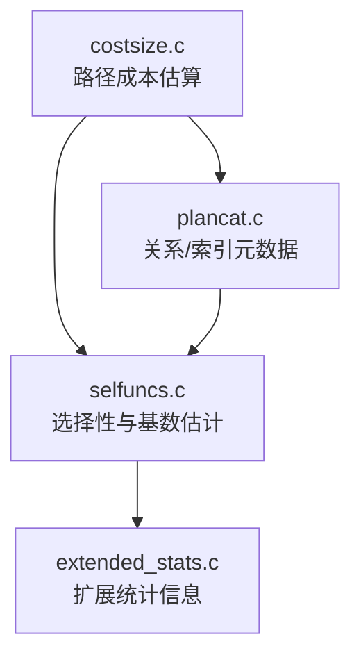
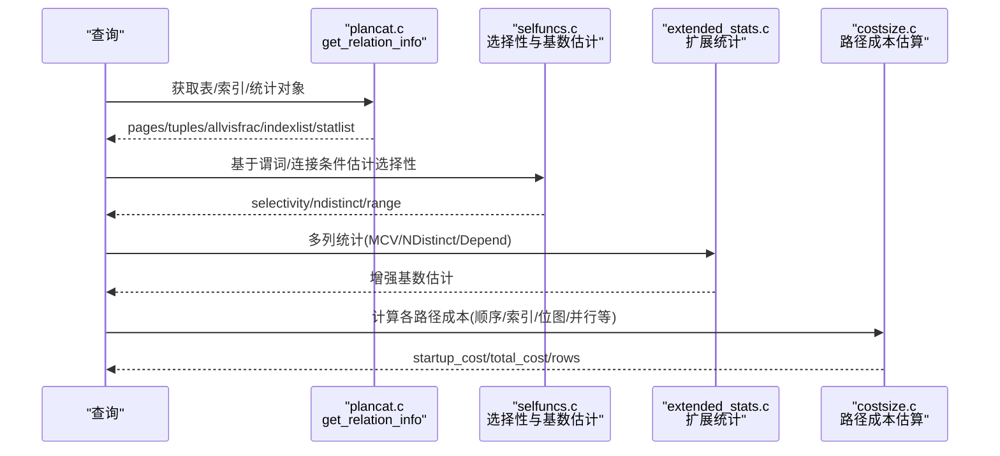
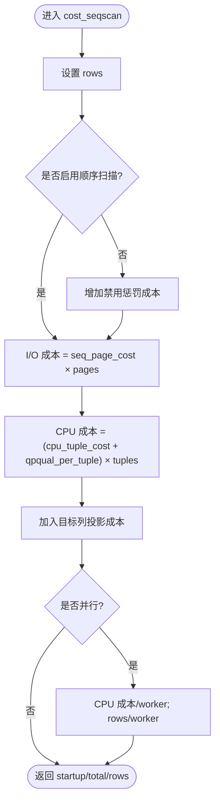
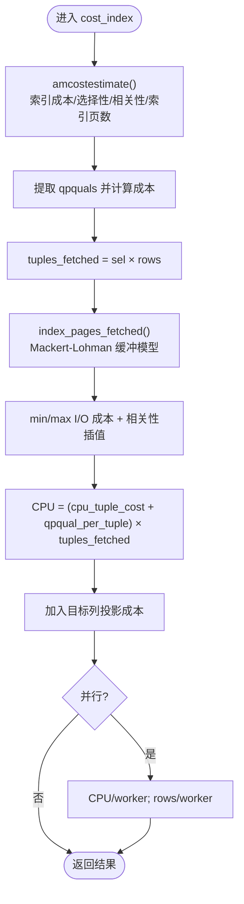
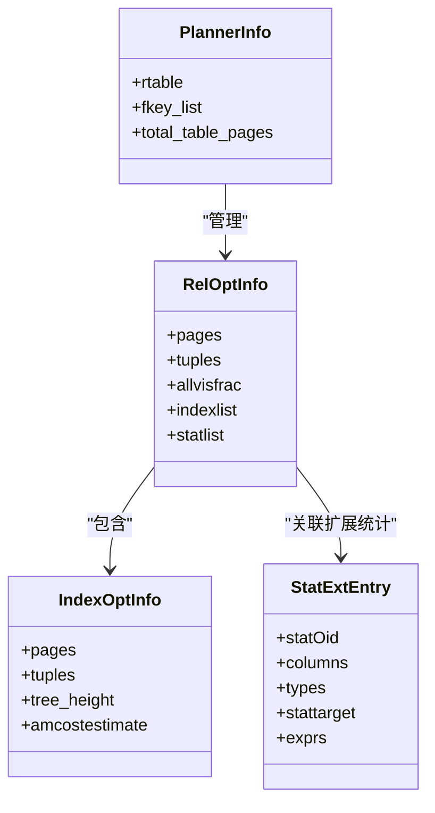
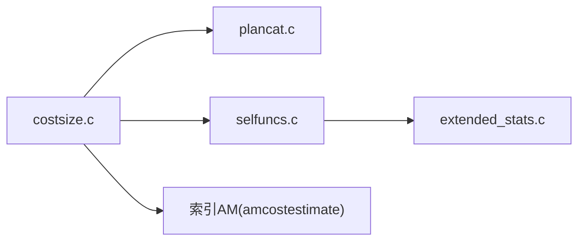

# 成本估算

<cite>
**本文引用的文件**
- [costsize.c](file://src/backend/optimizer/path/costsize.c)
- [plancat.c](file://src/backend/optimizer/util/plancat.c)
- [selfuncs.c](file://src/backend/utils/adt/selfuncs.c)
- [extended_stats.c](file://src/backend/statistics/extended_stats.c)
</cite>

## 目录
1. [简介](#简介)
2. [项目结构](#项目结构)
3. [核心组件](#核心组件)
4. [架构总览](#架构总览)
5. [详细组件分析](#详细组件分析)
6. [依赖关系分析](#依赖关系分析)
7. [性能考量](#性能考量)
8. [故障排查指南](#故障排查指南)
9. [结论](#结论)
10. [附录](#附录)

## 简介
本文件为 Mini PostgreSQL 的成本估算模块提供系统化文档，聚焦于：
- 成本模型的数学原理与公式（I/O、CPU、内存）
- 统计信息的使用方式（表大小、列分布、索引选择性等）
- 各类操作的成本计算方法（顺序扫描、索引扫描、连接、排序等）
- 基数估计算法（直方图、MCV、相关性、多变量统计）
- 成本参数调优指南与性能影响分析
- 实际查询的成本估算示例与优化建议

## 项目结构
Mini PostgreSQL 的成本估算主要分布在优化器路径层与工具层：
- 路径成本计算：src/backend/optimizer/path/costsize.c
- 关系与索引元数据获取：src/backend/optimizer/util/plancat.c
- 选择性与基数估计：src/backend/utils/adt/selfuncs.c
- 扩展统计信息构建与使用：src/backend/statistics/extended_stats.c

图表来源
- [costsize.c:220-286](file://src/backend/optimizer/path/costsize.c#L220-L286)
- [plancat.c:101-151](file://src/backend/optimizer/util/plancat.c#L101-L151)
- [selfuncs.c:23-93](file://src/backend/utils/adt/selfuncs.c#L23-L93)
- [extended_stats.c:111-248](file://src/backend/statistics/extended_stats.c#L111-L248)

章节来源
- [costsize.c:118-148](file://src/backend/optimizer/path/costsize.c#L118-L148)
- [plancat.c:101-151](file://src/backend/optimizer/util/plancat.c#L101-L151)
- [selfuncs.c:23-93](file://src/backend/utils/adt/selfuncs.c#L23-L93)
- [extended_stats.c:111-248](file://src/backend/statistics/extended_stats.c#L111-L248)

## 核心组件
- 成本参数与开关
  - I/O 成本：顺序页成本 seq_page_cost、随机页成本 random_page_cost
  - CPU 成本：每元组 cpu_tuple_cost、索引元组 cpu_index_tuple_cost、算子/函数 cpu_operator_cost
  - 并行成本：parallel_setup_cost、parallel_tuple_cost
  - 缓存容量：effective_cache_size
  - 计划开关：enable_seqscan、enable_indexscan、enable_bitmapscan、enable_sort 等
- 路径成本估算
  - 顺序扫描 cost_seqscan
  - 采样扫描 cost_samplescan
  - 索引扫描 cost_index（含 Mackert-Lohman 缓冲模型）
  - 位图堆扫描 cost_bitmap_heap_scan
  - TID/TID Range 扫描 cost_tidscan / cost_tidrangescan
  - 子查询/函数/VALUES/NamedTuplestore/Result 扫描
  - 收集 Gather/GatherMerge
- 元数据与统计
  - get_relation_info：读取表大小、索引列表、统计对象
  - selfuncs：选择性与基数估计（直方图、MCV、范围、相关性）
  - extended_stats：多列 MCV、NDistinct、Dependencies、表达式统计

章节来源
- [costsize.c:118-148](file://src/backend/optimizer/path/costsize.c#L118-L148)
- [costsize.c:220-286](file://src/backend/optimizer/path/costsize.c#L220-L286)
- [costsize.c:482-754](file://src/backend/optimizer/path/costsize.c#L482-L754)
- [costsize.c:945-1039](file://src/backend/optimizer/path/costsize.c#L945-L1039)
- [costsize.c:1180-1275](file://src/backend/optimizer/path/costsize.c#L1180-L1275)
- [costsize.c:1286-1369](file://src/backend/optimizer/path/costsize.c#L1286-L1369)
- [plancat.c:101-151](file://src/backend/optimizer/util/plancat.c#L101-L151)
- [selfuncs.c:23-93](file://src/backend/utils/adt/selfuncs.c#L23-L93)
- [extended_stats.c:111-248](file://src/backend/statistics/extended_stats.c#L111-L248)

## 架构总览
成本估算由“元数据 + 统计信息”驱动，结合“成本参数”对执行路径进行量化评估。整体流程如下：

图表来源
- [plancat.c:101-151](file://src/backend/optimizer/util/plancat.c#L101-L151)
- [selfuncs.c:23-93](file://src/backend/utils/adt/selfuncs.c#L23-L93)
- [extended_stats.c:111-248](file://src/backend/statistics/extended_stats.c#L111-L248)
- [costsize.c:220-286](file://src/backend/optimizer/path/costsize.c#L220-L286)
- [costsize.c:482-754](file://src/backend/optimizer/path/costsize.c#L482-L754)

## 详细组件分析

### 成本参数与基本公式
- I/O 成本
  - 顺序扫描：disk_run_cost = spc_seq_page_cost × baserel->pages
  - 索引扫描：根据索引相关性与缓冲命中估算页面访问数，再乘以随机/顺序页成本
  - 位图堆扫描：按访问页数与页成本插值（小范围随机、大范围趋近顺序）
- CPU 成本
  - 每元组：cpu_tuple_cost + qpqual.per_tuple
  - 目标列投影：pathtarget.cost.startup + pathtarget.cost.per_tuple × rows
- 并行成本
  - 启动开销：parallel_setup_cost
  - 通信开销：parallel_tuple_cost × rows
- 缓冲与缓存
  - effective_cache_size 用于分配共享缓冲空间，参与 Mackert-Lohman 模型

章节来源
- [costsize.c:118-148](file://src/backend/optimizer/path/costsize.c#L118-L148)
- [costsize.c:220-286](file://src/backend/optimizer/path/costsize.c#L220-L286)
- [costsize.c:482-754](file://src/backend/optimizer/path/costsize.c#L482-L754)
- [costsize.c:945-1039](file://src/backend/optimizer/path/costsize.c#L945-L1039)

### 顺序扫描成本估算
- 输入：基表 RelOptInfo、可选 ParamPathInfo
- 步骤
  - 设置 rows（考虑参数化或基表估计）
  - 若禁用顺序扫描则增加惩罚成本
  - 磁盘成本：seq_page_cost × pages
  - CPU 成本：qpqual 启动+每元组成本 × tuples；加上目标列投影成本
  - 并行：CPU 成本按 worker 数分摊，rows 相应缩放
- 输出：startup_cost、total_cost、rows

图表来源
- [costsize.c:220-286](file://src/backend/optimizer/path/costsize.c#L220-L286)

章节来源
- [costsize.c:220-286](file://src/backend/optimizer/path/costsize.c#L220-L286)

### 索引扫描成本估算
- 关键思想
  - 调用索引 AM 的 amcostestimate 得到索引自身成本、选择性、相关性、索引页数
  - 使用 Mackert-Lohman 缓冲模型估算实际访问的堆页面数
  - 根据索引与堆的相关性在“完全随机”和“完全顺序”之间插值
  - 索引仅扫描时利用 allvisfrac 减少堆访问估计
- 步骤
  - 提取非索引可处理的限制条件作为 qpquals
  - 计算 tuples_fetched = clamp_row_est(selectivity × baserel->tuples)
  - 计算 pages_fetched（Mackert-Lohman），并考虑 loop_count 重复扫描的缓存效应
  - 计算 min_IO_cost（相关性高）与 max_IO_cost（相关性低），按 csquared 插值
  - 累加 CPU 成本（qpqual + 目标列投影），并行时分摊 CPU 并缩放 rows
- 输出：path->indextotalcost、path->indexselectivity、startup_cost、total_cost、rows

图表来源
- [costsize.c:482-754](file://src/backend/optimizer/path/costsize.c#L482-L754)
- [costsize.c:830-884](file://src/backend/optimizer/path/costsize.c#L830-L884)

章节来源
- [costsize.c:482-754](file://src/backend/optimizer/path/costsize.c#L482-L754)
- [costsize.c:830-884](file://src/backend/optimizer/path/costsize.c#L830-L884)

### 位图堆扫描成本估算
- 特点
  - 先通过位图树节点聚合多个索引路径的成本与选择性
  - 对小范围访问近似随机页成本，大范围访问向顺序页成本过渡
- 步骤
  - compute_bitmap_pages 汇总索引成本与预估访问页数
  - 按 sqrt(pages_fetched / T) 插值每页成本
  - 累加 qpqual 与目标列投影成本，并行时分摊 CPU

章节来源
- [costsize.c:945-1039](file://src/backend/optimizer/path/costsize.c#L945-L1039)
- [costsize.c:1045-1170](file://src/backend/optimizer/path/costsize.c#L1045-L1170)

### TID 与 TID Range 扫描
- TID 扫描：假设每个元组位于不同页面，按 random_page_cost × ntuples 估算 I/O
- TID Range 扫描：首页随机访问，后续顺序访问；按 selectivity × pages 估算页数

章节来源
- [costsize.c:1180-1275](file://src/backend/optimizer/path/costsize.c#L1180-L1275)
- [costsize.c:1286-1369](file://src/backend/optimizer/path/costsize.c#L1286-L1369)

### 连接与排序（概念性说明）
- 连接
  - 基数估计：基于单表选择性、NDistinct、MCV、多列依赖（extended_stats）
  - 成本：取决于连接算法（嵌套循环、哈希、归并）与中间结果大小
- 排序
  - 成本受 sort_mem、外部排序溢出、比较成本影响
  - 并行合并（GatherMerge）引入堆维护成本与通信成本

注：本节为概念性说明，具体实现细节不在当前引用文件中展开。

### 统计信息与基数估计
- 元数据获取
  - get_relation_info：填充 pages、tuples、allvisfrac、indexlist、statlist
- 选择性与基数估计
  - selfuncs：支持范围估计、直方图、MCV、相等/不等/范围操作的选择性
  - 扩展统计：多列 MCV、NDistinct、Dependencies、表达式统计
- 扩展统计构建
  - BuildRelationExtStatistics：从 pg_statistic_ext 读取统计类型，计算并存储
  - ComputeExtStatisticsRows：根据 stattarget 决定采样行数

图表来源
- [plancat.c:101-151](file://src/backend/optimizer/util/plancat.c#L101-L151)
- [plancat.c:165-431](file://src/backend/optimizer/util/plancat.c#L165-L431)
- [extended_stats.c:64-73](file://src/backend/statistics/extended_stats.c#L64-L73)

章节来源
- [plancat.c:101-151](file://src/backend/optimizer/util/plancat.c#L101-L151)
- [plancat.c:165-431](file://src/backend/optimizer/util/plancat.c#L165-L431)
- [selfuncs.c:23-93](file://src/backend/utils/adt/selfuncs.c#L23-L93)
- [extended_stats.c:111-248](file://src/backend/statistics/extended_stats.c#L111-L248)

## 依赖关系分析
- costsize.c 依赖 plancat.c 提供的表/索引元数据
- costsize.c 依赖 selfuncs.c 的选择性与基数估计
- selfuncs.c 依赖 extended_stats.c 的多列统计以增强估计精度
- 索引 AM 通过 amcostestimate 回调贡献索引侧成本与选择性

图表来源
- [costsize.c:482-754](file://src/backend/optimizer/path/costsize.c#L482-L754)
- [plancat.c:165-431](file://src/backend/optimizer/util/plancat.c#L165-L431)
- [selfuncs.c:23-93](file://src/backend/utils/adt/selfuncs.c#L23-L93)
- [extended_stats.c:111-248](file://src/backend/statistics/extended_stats.c#L111-L248)

章节来源
- [costsize.c:482-754](file://src/backend/optimizer/path/costsize.c#L482-L754)
- [plancat.c:165-431](file://src/backend/optimizer/util/plancat.c#L165-L431)
- [selfuncs.c:23-93](file://src/backend/utils/adt/selfuncs.c#L23-L93)
- [extended_stats.c:111-248](file://src/backend/statistics/extended_stats.c#L111-L248)

## 性能考量
- 参数调优要点
  - seq_page_cost / random_page_cost：反映磁盘特性与预读策略；SSD 可降低 random_page_cost
  - effective_cache_size：反映 OS/DB 缓存能力；增大可改善索引扫描的缓冲命中估计
  - cpu_tuple_cost / cpu_operator_cost：CPU 密集型工作负载需适当提高
  - parallel_setup_cost / parallel_tuple_cost：并行收益与通信开销平衡
  - 计划开关：针对特定负载关闭/开启某些路径（如 enable_seqscan、enable_bitmapscan）
- 统计质量
  - 确保 ANALYZE 及时更新统计；必要时调整 default_statistics_target
  - 对多列相关性强的场景创建扩展统计（NDistinct、Dependencies、MCV）
- 索引设计
  - 高选择性且与查询模式匹配；注意索引与堆的相关性对 I/O 成本的影响
  - 覆盖索引可减少堆访问，降低 I/O

[本节为通用指导，不直接分析具体文件]

## 故障排查指南
- 成本异常偏高
  - 检查统计是否过期（ANALYZE）
  - 核对 effective_cache_size 与实际缓存一致
  - 确认索引可用性（valid、ready）
- 计划选择不当
  - 临时调整成本参数验证假设（如 random_page_cost）
  - 查看扩展统计是否缺失导致基数估计偏差
- 并行计划问题
  - 检查 parallel_setup_cost 与 worker 数量配置
  - 关注 Gather/GatherMerge 的额外开销

章节来源
- [costsize.c:118-148](file://src/backend/optimizer/path/costsize.c#L118-L148)
- [plancat.c:165-431](file://src/backend/optimizer/util/plancat.c#L165-L431)
- [extended_stats.c:111-248](file://src/backend/statistics/extended_stats.c#L111-L248)

## 结论
Mini PostgreSQL 的成本估算以“元数据 + 统计 + 参数”为核心，通过顺序/索引/位图等路径的成本建模，结合 Mackert-Lohman 缓冲模型与扩展统计信息，实现对 I/O、CPU、并行成本的合理量化。良好的统计质量与合理的参数调优是获得准确计划的关键。

[本节为总结，不直接分析具体文件]

## 附录
- 常用成本参数速查
  - seq_page_cost：顺序页成本
  - random_page_cost：随机页成本
  - cpu_tuple_cost：每元组 CPU 成本
  - cpu_operator_cost：算子/函数 CPU 成本
  - effective_cache_size：有效缓存大小
  - parallel_setup_cost / parallel_tuple_cost：并行启动与通信成本
- 典型查询估算流程
  - 获取表/索引大小与统计
  - 计算 WHERE/JOIN 选择性
  - 估算各路径成本（顺序/索引/位图/并行）
  - 选择最小成本路径

[本节为补充说明，不直接分析具体文件]