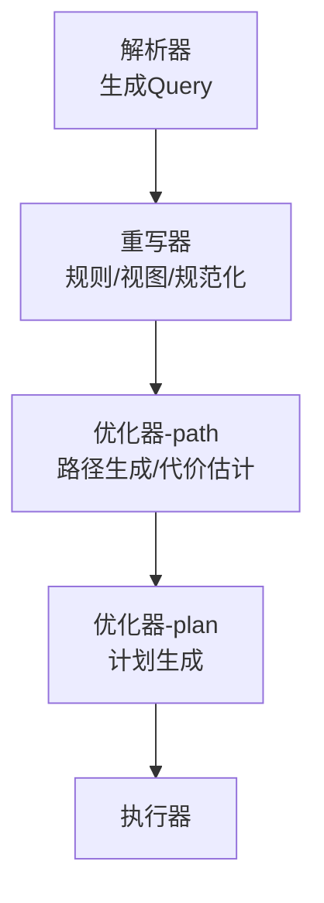
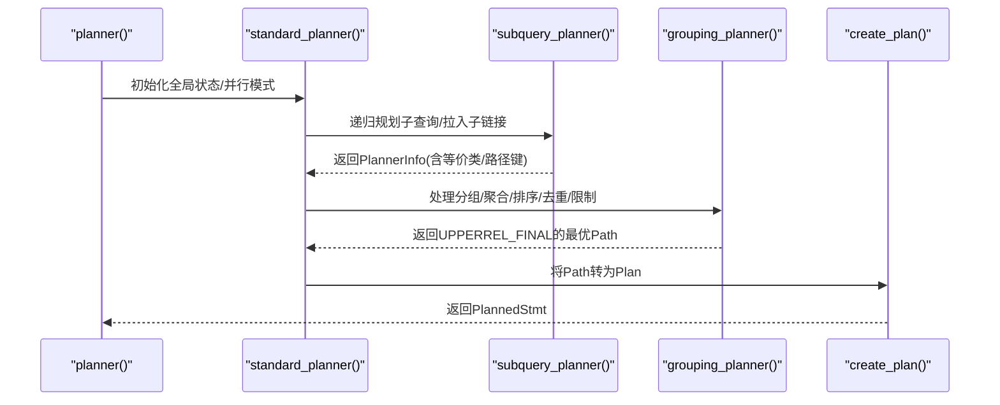
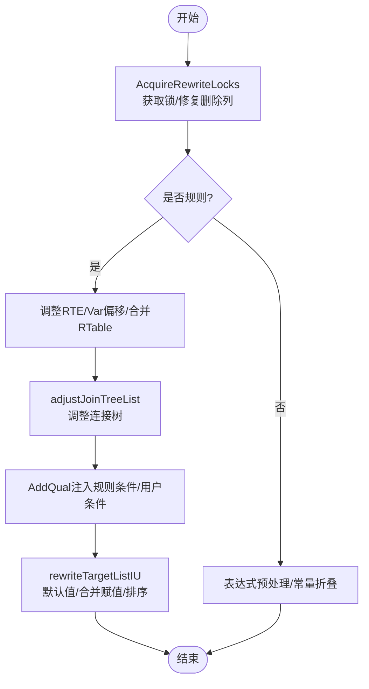
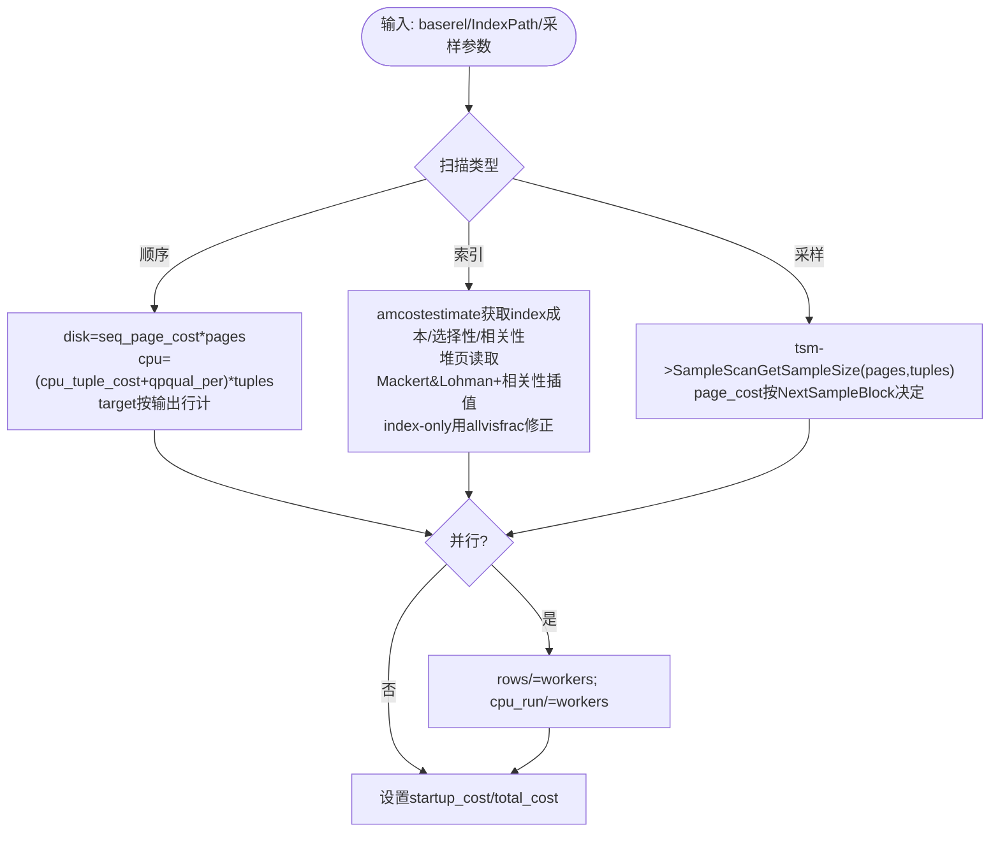
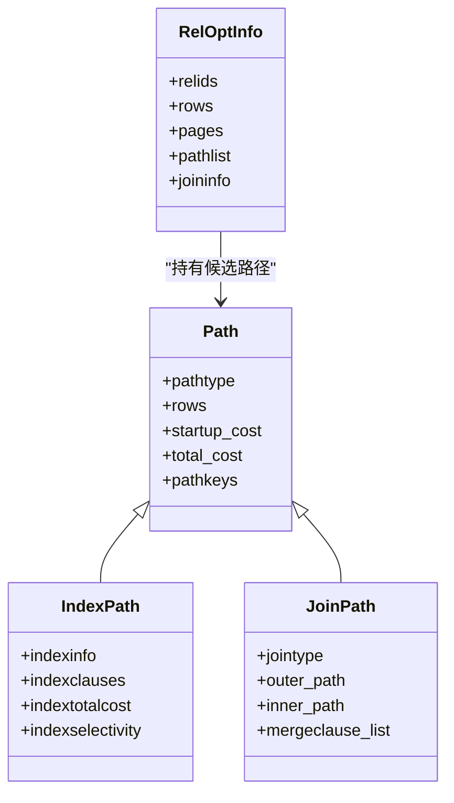
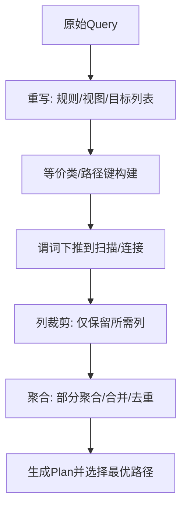
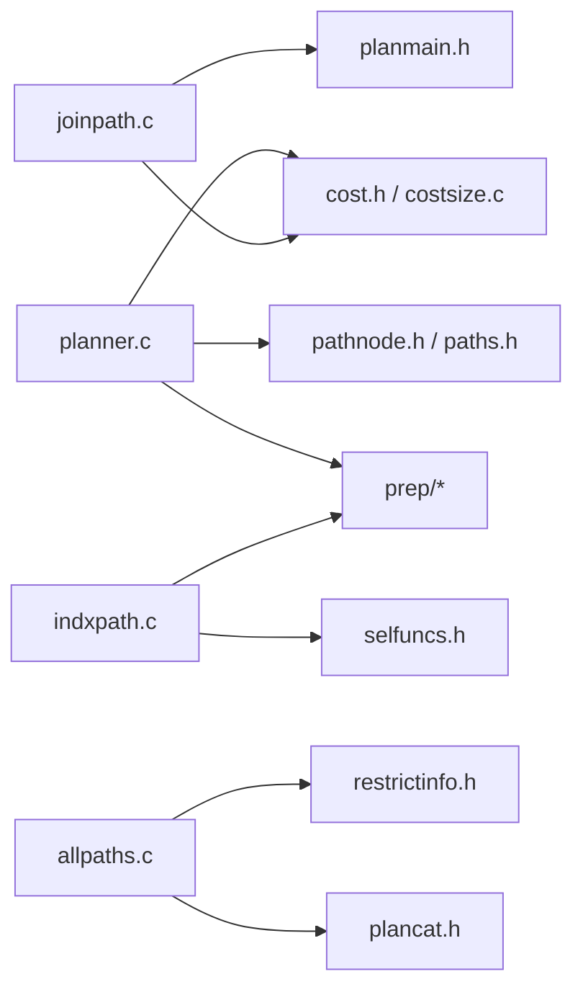

# 查询优化器

<cite>
**本文引用的文件**
- [src/backend/optimizer/README](file://src/backend/optimizer/README)
- [src/backend/optimizer/path/costsize.c](file://src/backend/optimizer/path/costsize.c)
- [src/backend/optimizer/path/allpaths.c](file://src/backend/optimizer/path/allpaths.c)
- [src/backend/optimizer/path/joinpath.c](file://src/backend/optimizer/path/joinpath.c)
- [src/backend/optimizer/path/indxpath.c](file://src/backend/optimizer/path/indxpath.c)
- [src/backend/optimizer/plan/planner.c](file://src/backend/optimizer/plan/planner.c)
- [src/backend/rewrite/rewriteHandler.c](file://src/backend/rewrite/rewriteHandler.c)
</cite>

## 目录
1. [简介](#简介)
2. [项目结构](#项目结构)
3. [核心组件](#核心组件)
4. [架构总览](#架构总览)
5. [详细组件分析](#详细组件分析)
6. [依赖关系分析](#依赖关系分析)
7. [性能考量](#性能考量)
8. [故障排查指南](#故障排查指南)
9. [结论](#结论)
10. [附录](#附录)

## 简介
本文件面向Mini PostgreSQL的查询优化器，系统性阐述查询重写机制（规则系统、视图展开与查询规范化）、成本估算模型（I/O、CPU、内存/并行相关成本）、执行计划生成算法（路径选择、连接顺序优化、索引选择策略），以及常见优化技术（谓词下推、列裁剪、聚合优化等）。文档提供架构图、成本模型公式与优化策略示例，帮助读者理解并扩展优化器功能。

## 项目结构
优化器位于 src/backend/optimizer，分为 path（路径生成与代价估计）、plan（计划生成）、prep（预处理）、util（工具）四个子目录；重写子系统位于 src/backend/rewrite。整体流程：解析器输出 Query → 重写器进行规则/视图处理 → 优化器构建 Path 树并选择最优 → 生成 Plan 交由执行器。

图表来源
- [src/backend/optimizer/README:6-13](file://src/backend/optimizer/README#L6-L13)
- [src/backend/optimizer/plan/planner.c:215-226](file://src/backend/optimizer/plan/planner.c#L215-L226)

章节来源
- [src/backend/optimizer/README:6-13](file://src/backend/optimizer/README#L6-L13)
- [src/backend/optimizer/plan/planner.c:215-226](file://src/backend/optimizer/plan/planner.c#L215-L226)

## 核心组件
- 重写器（Rewrite）：负责规则触发、视图展开、目标列表与连接树调整、锁获取与一致性保障。
- 路径生成（Path）：为每个基表/连接关系生成多种访问路径（顺序扫描、索引扫描、位图扫描、TID扫描、采样扫描等），并进行代价估计。
- 连接搜索（Join Search）：使用动态规划自底向上构造连接关系，枚举嵌套循环、合并连接、哈希连接等实现方式，选择最便宜路径。
- 计划生成（Plan）：将最优 Path 转换为可执行的 Plan 树，处理分组、排序、去重、限制等上层操作。
- 成本模型（Cost）：统一度量 I/O、CPU、并行通信等成本，支撑路径比较与选择。

章节来源
- [src/backend/optimizer/README:16-41](file://src/backend/optimizer/README#L16-L41)
- [src/backend/optimizer/path/allpaths.c:123-212](file://src/backend/optimizer/path/allpaths.c#L123-L212)
- [src/backend/optimizer/path/joinpath.c:99-130](file://src/backend/optimizer/path/joinpath.c#L99-L130)
- [src/backend/optimizer/plan/planner.c:215-226](file://src/backend/optimizer/plan/planner.c#L215-L226)
- [src/backend/optimizer/path/costsize.c:6-30](file://src/backend/optimizer/path/costsize.c#L6-L30)

## 架构总览
优化器主入口 planner() 调用 standard_planner()，内部通过 subquery_planner() 完成子查询拉取、表达式预处理、等价类与路径键构建，再进入 grouping_planner() 处理 GROUP/HAVING/DISTINCT/ORDER BY/LIMIT 等上层操作，最终由 create_plan() 将最佳 Path 转为 Plan。

图表来源
- [src/backend/optimizer/plan/planner.c:215-226](file://src/backend/optimizer/plan/planner.c#L215-L226)
- [src/backend/optimizer/plan/planner.c:512-516](file://src/backend/optimizer/plan/planner.c#L512-L516)
- [src/backend/optimizer/README:297-345](file://src/backend/optimizer/README#L297-L345)

## 详细组件分析

### 重写机制：规则系统、视图展开与查询规范化
- 规则系统：AcquireRewriteLocks 确保在重写期间 schema 稳定；rewriteRuleAction 对规则动作进行变量偏移、RTE合并、条件注入与 RETURNING 重写；adjustJoinTreeList 调整连接树以支持 INSTEAD 规则。
- 视图展开：通过规则与目标列表重写，将视图引用替换为底层表的投影与过滤，必要时保留必要列以支持后续裁剪。
- 查询规范化：预处理阶段对 targetlist、qual、havingQual、limitOffset/Count 等进行表达式简化与常量折叠；同时处理 LATERAL、子查询拉取与别名展开。

图表来源
- [src/backend/rewrite/rewriteHandler.c:144-293](file://src/backend/rewrite/rewriteHandler.c#L144-L293)
- [src/backend/rewrite/rewriteHandler.c:339-632](file://src/backend/rewrite/rewriteHandler.c#L339-L632)
- [src/backend/rewrite/rewriteHandler.c:666-800](file://src/backend/rewrite/rewriteHandler.c#L666-L800)

章节来源
- [src/backend/rewrite/rewriteHandler.c:144-293](file://src/backend/rewrite/rewriteHandler.c#L144-L293)
- [src/backend/rewrite/rewriteHandler.c:339-632](file://src/backend/rewrite/rewriteHandler.c#L339-L632)
- [src/backend/rewrite/rewriteHandler.c:666-800](file://src/backend/rewrite/rewriteHandler.c#L666-L800)

### 成本估算模型：I/O、CPU、内存/并行成本
- 基本参数：seq_page_cost、random_page_cost、cpu_tuple_cost、cpu_index_tuple_cost、cpu_operator_cost、parallel_tuple_cost、parallel_setup_cost、effective_cache_size。
- 顺序扫描 cost_seqscan：磁盘成本 = seq_page_cost × pages；CPU成本 = (cpu_tuple_cost + qpqual.per_tuple) × tuples；目标列表开销按输出行计入；并行时 CPU 成本按 worker 数分摊，rows 按 worker 数缩放。
- 索引扫描 cost_index：先调用索引访问方法 amcostestimate 得到 indexStartupCost/indexTotalCost/indexSelectivity/indexCorrelation/index_pages；堆页读取采用 Mackert & Lohman 近似并结合相关性插值；index-only 扫描根据 allvisfrac 减少堆页读取；并行时 rows/CPU 成本按 worker 数调整。
- 采样扫描 cost_samplescan：根据 TSM 接口估计 pages/tuples，并按随机/顺序访问选择 page_cost；CPU 成本包含限制条件评估与目标列表开销。
- Gather/GatherMerge：startup 增加 parallel_setup_cost，run 增加 parallel_tuple_cost × rows；GatherMerge 额外考虑堆维护的比较成本 N log N。

图表来源
- [src/backend/optimizer/path/costsize.c:214-286](file://src/backend/optimizer/path/costsize.c#L214-L286)
- [src/backend/optimizer/path/costsize.c:465-754](file://src/backend/optimizer/path/costsize.c#L465-L754)
- [src/backend/optimizer/path/costsize.c:289-357](file://src/backend/optimizer/path/costsize.c#L289-L357)
- [src/backend/optimizer/path/costsize.c:360-462](file://src/backend/optimizer/path/costsize.c#L360-L462)

章节来源
- [src/backend/optimizer/path/costsize.c:6-30](file://src/backend/optimizer/path/costsize.c#L6-L30)
- [src/backend/optimizer/path/costsize.c:214-286](file://src/backend/optimizer/path/costsize.c#L214-L286)
- [src/backend/optimizer/path/costsize.c:465-754](file://src/backend/optimizer/path/costsize.c#L465-L754)
- [src/backend/optimizer/path/costsize.c:289-357](file://src/backend/optimizer/path/costsize.c#L289-L357)
- [src/backend/optimizer/path/costsize.c:360-462](file://src/backend/optimizer/path/costsize.c#L360-L462)

### 执行计划生成：路径选择、连接顺序优化与索引选择
- 路径生成：set_base_rel_pathlists 为每个基表生成顺序/索引/TID/采样等路径；create_index_paths 匹配限制/连接/等价类到索引列，生成 IndexPath/BitmapIndexScan 等；add_path/set_cheapest 维护每关系的候选路径集合。
- 连接搜索：make_one_rel 计算 total_table_pages 后调用 make_rel_from_joinlist，标准算法自底向上组合 joinrel，考虑左/右/灌木形计划；joinpath.c 中 add_paths_to_joinrel 为每对外内关系尝试嵌套循环、合并连接、哈希连接，并考虑唯一性证明与参数化路径。
- 索引选择：indxpath.c 将限制/连接/等价类匹配到索引列，支持 OR 条件位图路径、部分索引谓词、覆盖索引（index-only scan）；结合 cost_index 的成本估计选择最优索引路径。

图表来源
- [src/backend/optimizer/path/allpaths.c:123-212](file://src/backend/optimizer/path/allpaths.c#L123-L212)
- [src/backend/optimizer/path/joinpath.c:99-130](file://src/backend/optimizer/path/joinpath.c#L99-L130)
- [src/backend/optimizer/path/indxpath.c:197-200](file://src/backend/optimizer/path/indxpath.c#L197-L200)

章节来源
- [src/backend/optimizer/path/allpaths.c:123-212](file://src/backend/optimizer/path/allpaths.c#L123-L212)
- [src/backend/optimizer/path/joinpath.c:99-130](file://src/backend/optimizer/path/joinpath.c#L99-L130)
- [src/backend/optimizer/path/indxpath.c:197-200](file://src/backend/optimizer/path/indxpath.c#L197-L200)

### 优化技术：谓词下推、列裁剪、聚合优化
- 谓词下推：在重写阶段通过 rewriteRuleAction 将规则条件与用户条件注入到子查询/视图；在优化阶段，等价类与 restrictinfo 用于将条件尽可能下推到扫描层，减少中间结果大小。
- 列裁剪：rewriteTargetListIU 标准化目标列表，合并重复赋值并排序；后续 plan 阶段基于所需列剔除无关列，降低 I/O 与 CPU 开销。
- 聚合优化：grouping_planner 处理 GROUP BY/HAVING/窗口函数，创建 AggPath/GroupPath/UniquePath 等；利用 partial aggregation 与 merge 策略减少数据量与排序成本。

图表来源
- [src/backend/rewrite/rewriteHandler.c:339-632](file://src/backend/rewrite/rewriteHandler.c#L339-L632)
- [src/backend/optimizer/plan/planner.c:512-516](file://src/backend/optimizer/plan/planner.c#L512-L516)
- [src/backend/optimizer/README:313-345](file://src/backend/optimizer/README#L313-L345)

章节来源
- [src/backend/rewrite/rewriteHandler.c:339-632](file://src/backend/rewrite/rewriteHandler.c#L339-L632)
- [src/backend/optimizer/plan/planner.c:512-516](file://src/backend/optimizer/plan/planner.c#L512-L516)
- [src/backend/optimizer/README:313-345](file://src/backend/optimizer/README#L313-L345)

## 依赖关系分析
- planner.c 依赖 optimizer 各模块（cost、pathnode、paths、planmain、prep、subselect、tlist）与 parser、rewrite、utils。
- allpaths.c 依赖 plancat、restrictinfo、tlist、rewriteManip、lsyscache 等，用于尺寸估计与路径生成。
- joinpath.c 依赖 cost、optimizer、pathnode、paths、planmain、restrictinfo、typcache，用于连接路径生成与代价评估。
- indxpath.c 依赖 access/catalog/optimizer/prep/restrictinfo/selfuncs，用于索引可用性判断与路径构建。
- costsize.c 依赖 executor、optimizer、parser、utils/tuplesort，用于各类扫描/连接的代价计算。

图表来源
- [src/backend/optimizer/plan/planner.c:16-63](file://src/backend/optimizer/plan/planner.c#L16-L63)
- [src/backend/optimizer/path/allpaths.c:16-46](file://src/backend/optimizer/path/allpaths.c#L16-L46)
- [src/backend/optimizer/path/joinpath.c:15-28](file://src/backend/optimizer/path/joinpath.c#L15-L28)
- [src/backend/optimizer/path/indxpath.c:16-37](file://src/backend/optimizer/path/indxpath.c#L16-L37)
- [src/backend/optimizer/path/costsize.c:72-99](file://src/backend/optimizer/path/costsize.c#L72-L99)

章节来源
- [src/backend/optimizer/plan/planner.c:16-63](file://src/backend/optimizer/plan/planner.c#L16-L63)
- [src/backend/optimizer/path/allpaths.c:16-46](file://src/backend/optimizer/path/allpaths.c#L16-L46)
- [src/backend/optimizer/path/joinpath.c:15-28](file://src/backend/optimizer/path/joinpath.c#L15-L28)
- [src/backend/optimizer/path/indxpath.c:16-37](file://src/backend/optimizer/path/indxpath.c#L16-L37)
- [src/backend/optimizer/path/costsize.c:72-99](file://src/backend/optimizer/path/costsize.c#L72-L99)

## 性能考量
- 成本参数调优：根据硬件与缓存特性调整 seq_page_cost/random_page_cost/cpu_*_cost/parallel_*_cost/effective_cache_size，使成本估计更贴近实际。
- 索引设计：优先建立与 WHERE/JOIN 条件匹配的索引，利用覆盖索引减少堆访问；注意部分索引谓词与统计信息准确性。
- 并行度控制：合理设置 max_parallel_workers_per_gather 与最小并行阈值，避免过度并行导致上下文切换与通信开销。
- 连接顺序：复杂多表连接时，确保统计信息准确，必要时使用提示或改写查询以引导更好的连接顺序。
- 聚合与排序：尽量利用索引有序性避免显式排序；对大结果集启用部分聚合与合并策略。

[本节为通用指导，不直接分析具体文件]

## 故障排查指南
- 规则冲突与递归：检查 AcquireRewriteLocks 与 fireRIRrules 的锁与递归处理，避免死锁与无限重写。
- 视图展开错误：确认 rewriteTargetListIU 是否正确处理默认值与合并赋值；检查 adjustJoinTreeList 是否正确移除/保留 RTE。
- 成本估计偏差：核对 costsize.c 中的 I/O 与 CPU 成本公式，检查 effective_cache_size 与并行参数是否合理；验证索引选择性估计。
- 连接顺序异常：查看 join_is_legal 与 SpecialJoinInfo 约束，确保外连接语义正确；检查等价类与路径键是否被正确构建。
- 计划不可行：若路径为空或均为禁用（如 enable_seqscan=false），检查 GUC 开关与路径生成逻辑。

章节来源
- [src/backend/rewrite/rewriteHandler.c:144-293](file://src/backend/rewrite/rewriteHandler.c#L144-L293)
- [src/backend/rewrite/rewriteHandler.c:339-632](file://src/backend/rewrite/rewriteHandler.c#L339-L632)
- [src/backend/optimizer/path/costsize.c:6-30](file://src/backend/optimizer/path/costsize.c#L6-L30)
- [src/backend/optimizer/README:192-243](file://src/backend/optimizer/README#L192-L243)

## 结论
Mini PostgreSQL 的查询优化器遵循经典的分阶段优化架构：重写器负责规则与视图转换，路径生成器枚举访问与连接方式并进行代价估计，计划生成器将最优路径转化为可执行计划。通过精确的成本模型与丰富的优化技术（谓词下推、列裁剪、聚合优化），系统在多数场景下能生成高效计划。开发者可通过调整成本参数、完善索引与统计信息、合理使用并行与连接策略，进一步优化查询性能。

[本节为总结，不直接分析具体文件]

## 附录
- 关键函数路径参考：
  - 重写入口与规则处理：[rewriteHandler.c:144-293](file://src/backend/rewrite/rewriteHandler.c#L144-L293)、[rewriteHandler.c:339-632](file://src/backend/rewrite/rewriteHandler.c#L339-L632)
  - 成本估计：[costsize.c:214-286](file://src/backend/optimizer/path/costsize.c#L214-L286)、[costsize.c:465-754](file://src/backend/optimizer/path/costsize.c#L465-L754)
  - 路径生成与连接搜索：[allpaths.c:123-212](file://src/backend/optimizer/path/allpaths.c#L123-L212)、[joinpath.c:99-130](file://src/backend/optimizer/path/joinpath.c#L99-L130)
  - 索引选择：[indxpath.c:197-200](file://src/backend/optimizer/path/indxpath.c#L197-L200)
  - 计划生成入口：[planner.c:215-226](file://src/backend/optimizer/plan/planner.c#L215-L226)

[本节为附录，不直接分析具体文件]