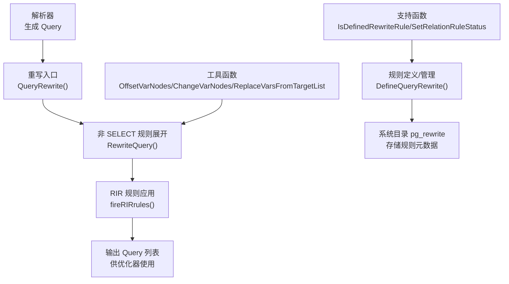
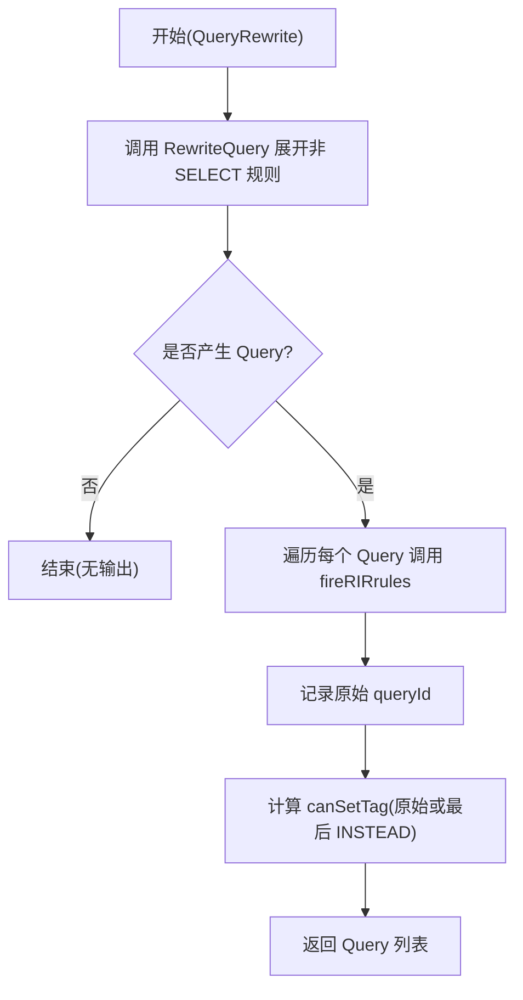
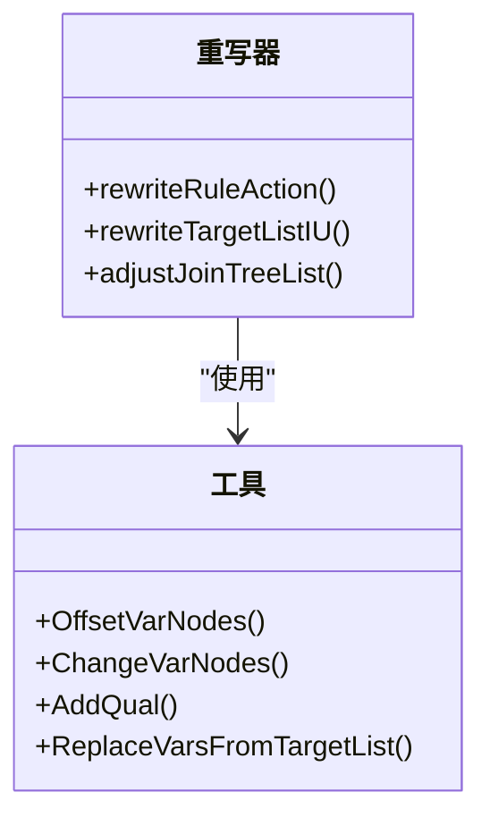
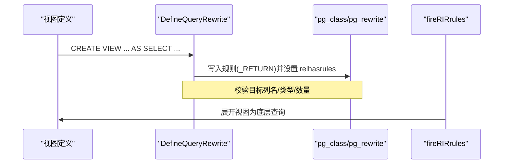
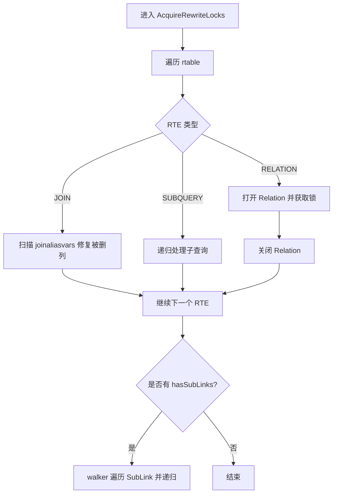
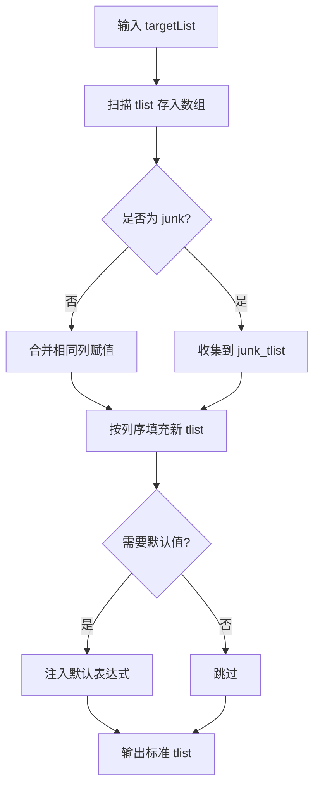
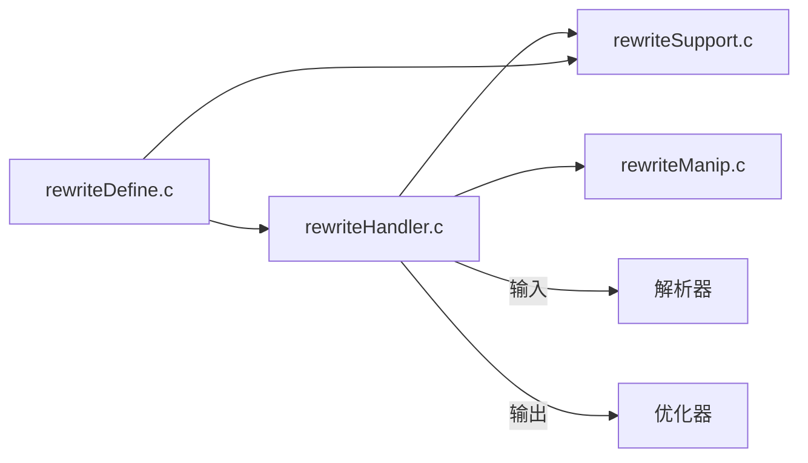

# 查询重写器

<cite>
**本文引用的文件**
- [rewriteHandler.c](file://src/backend/rewrite/rewriteHandler.c)
- [rewriteManip.c](file://src/backend/rewrite/rewriteManip.c)
- [rewriteSupport.c](file://src/backend/rewrite/rewriteSupport.c)
- [rewriteDefine.c](file://src/backend/rewrite/rewriteDefine.c)
- [rewriteHandler.h](file://src/include/rewrite/rewriteHandler.h)
- [rewriteManip.h](file://src/include/rewrite/rewriteManip.h)
</cite>

## 目录
1. [简介](#简介)
2. [项目结构](#项目结构)
3. [核心组件](#核心组件)
4. [架构总览](#架构总览)
5. [详细组件分析](#详细组件分析)
6. [依赖关系分析](#依赖关系分析)
7. [性能考量](#性能考量)
8. [故障排查指南](#故障排查指南)
9. [结论](#结论)
10. [附录：自定义规则与常见场景](#附录：自定义规则与常见场景)

## 简介
本文件为 Mini PostgreSQL 的查询重写器提供系统化、可操作的文档。重点覆盖：
- SQL 查询重写机制与规则系统工作原理
- 视图展开过程与安全视图展开
- 查询规范化算法（目标列合并、默认值注入、RETURNING 处理等）
- 各类重写规则实现（INSERT/UPDATE/DELETE 重写、WITH 子句处理、RIR 规则应用）
- 从 AST 到优化器输入的完整执行流程
- 重写规则的注册机制、条件匹配算法与结果验证
- 如何添加自定义重写规则及常见重写场景的处理方式

## 项目结构
Mini PostgreSQL 的重写子系统位于 src/backend/rewrite，配合 include/rewrite 头文件暴露接口；命令层通过 parser/analyze 生成 Query 后调用重写入口，最终产出供优化器使用的 Query 列表。



**图示来源**
- [rewriteHandler.c:3808-3898](file://src/backend/rewrite/rewriteHandler.c#L3808-L3898)
- [rewriteDefine.c:229-616](file://src/backend/rewrite/rewriteDefine.c#L229-L616)
- [rewriteSupport.c:32-84](file://src/backend/rewrite/rewriteSupport.c#L32-L84)
- [rewriteManip.c:234-383](file://src/backend/rewrite/rewriteManip.c#L234-L383)

**章节来源**
- [rewriteHandler.c:3808-3898](file://src/backend/rewrite/rewriteHandler.c#L3808-L3898)
- [rewriteDefine.c:229-616](file://src/backend/rewrite/rewriteDefine.c#L229-L616)
- [rewriteSupport.c:32-84](file://src/backend/rewrite/rewriteSupport.c#L32-L84)
- [rewriteManip.c:234-383](file://src/backend/rewrite/rewriteManip.c#L234-L383)

## 核心组件
- 重写入口与主循环
  - QueryRewrite：入口函数，负责分阶段应用规则并标记 canSetTag。
  - RewriteQuery：对非 SELECT 事件触发规则进行展开，生成新的 Query 列表。
  - fireRIRrules：对每个 Query 应用 RIR（Retrieve-Instead-Retrieve）规则，用于视图展开等。
- 规则定义与管理
  - DefineQueryRewrite：创建/替换规则，校验规则语义（如 ON SELECT 必须为 INSTEAD SELECT），更新 relhasrules 标志。
  - SetRelationRuleStatus：更新 pg_class.relhasrules 并广播失效消息以刷新 relcache。
  - IsDefinedRewriteRule/get_rewrite_oid：按名称查找规则 OID。
- 查询树操作工具
  - OffsetVarNodes/ChangeVarNodes/IncrementVarSublevelsUp：调整 Var/RangeTblRef/JoinExpr 等的 RTE 索引与层级。
  - ReplaceVarsFromTargetList：将 NEW/OLD 或目标列表达式替换到规则动作中。
  - AddQual/AddInvertedQual：向 Query 附加 WHERE 条件。
  - contain_aggs_of_level/locate_agg_of_level/checkExprHasSubLink：表达式属性探测。
- 锁与可见性
  - AcquireRewriteLocks：在重写前获取必要锁，修复 JOIN RTE 中被删除列的引用。

**章节来源**
- [rewriteHandler.c:144-293](file://src/backend/rewrite/rewriteHandler.c#L144-L293)
- [rewriteHandler.c:3808-3898](file://src/backend/rewrite/rewriteHandler.c#L3808-L3898)
- [rewriteDefine.c:229-616](file://src/backend/rewrite/rewriteDefine.c#L229-L616)
- [rewriteSupport.c:32-118](file://src/backend/rewrite/rewriteSupport.c#L32-L118)
- [rewriteManip.c:234-718](file://src/backend/rewrite/rewriteManip.c#L234-L718)

## 架构总览
重写器遵循“先展开非 SELECT 规则，再应用 RIR 规则”的两阶段策略，确保视图展开、安全约束检查与权限校验在计划之前完成。

```mermaid
sequenceDiagram
participant P as "解析器"
participant RW as "重写器(QueryRewrite)"
participant RQ as "RewriteQuery"
participant FIR as "fireRIRrules"
participant OPT as "优化器"
P->>RW : 传入原始 Query
RW->>RQ : 展开非 SELECT 规则(可能产生 0..N 个 Query)
RQ-->>RW : 返回中间 Query 列表
loop 遍历每个 Query
RW->>FIR : 应用 RIR 规则(视图展开/安全视图)
FIR-->>RW : 返回改写后的 Query
end
RW-->>OPT : 输出 Query 列表(含 canSetTag 标记)
```

**图示来源**
- [rewriteHandler.c:3808-3898](file://src/backend/rewrite/rewriteHandler.c#L3808-L3898)

## 详细组件分析

### 重写入口与执行流程（QueryRewrite）
- 职责
  - 仅作用于顶层原始查询（QSRC_ORIGINAL）。
  - 第一阶段：调用 RewriteQuery 展开所有非 SELECT 规则。
  - 第二阶段：对每个 Query 调用 fireRIRrules 应用 RIR 规则。
  - 第三阶段：确定哪个 Query 设置 canSetTag（原始查询或最后一个同类型的 INSTEAD 查询）。
- 关键行为
  - 保留原始 queryId 到每个结果 Query。
  - 保证 canSetTag 唯一性。



**图示来源**
- [rewriteHandler.c:3808-3898](file://src/backend/rewrite/rewriteHandler.c#L3808-L3898)

**章节来源**
- [rewriteHandler.c:3808-3898](file://src/backend/rewrite/rewriteHandler.c#L3808-L3898)

### 规则展开与动作重写（RewriteQuery / rewriteRuleAction）
- 变量偏移与合并
  - 使用 OffsetVarNodes/ChangeVarNodes 将规则动作中的 varno 与 OLD/NEW 引用对齐到主查询 rtable。
  - 合并主查询与规则动作的 rtable，避免共享子结构。
- 连接树调整
  - adjustJoinTreeList 根据是否需要保留原 rt_index 决定 fromlist。
- 条件合并
  - AddQual 将规则 qual 与用户查询 qual 合并到规则动作。
- INSERT/UPDATE 目标列重写
  - rewriteTargetListIU：标准化目标列，合并重复赋值，注入默认值，排序 junk 字段。
  - 生成列处理：为 generated columns 构造表达式并参与 NEW.* 替换。
- RETURNING 处理
  - 若触发查询无 RETURNING，丢弃规则动作 RETURNING；否则替换为触发查询所需列。



**图示来源**
- [rewriteHandler.c:339-632](file://src/backend/rewrite/rewriteHandler.c#L339-L632)
- [rewriteHandler.c:642-663](file://src/backend/rewrite/rewriteHandler.c#L642-L663)
- [rewriteManip.c:234-718](file://src/backend/rewrite/rewriteManip.c#L234-L718)

**章节来源**
- [rewriteHandler.c:339-632](file://src/backend/rewrite/rewriteHandler.c#L339-L632)
- [rewriteHandler.c:642-663](file://src/backend/rewrite/rewriteHandler.c#L642-L663)
- [rewriteManip.c:234-718](file://src/backend/rewrite/rewriteManip.c#L234-L718)

### 视图展开与安全视图（RIR 规则）
- RIR（Retrieve-Instead-Retrieve）规则在 fireRIRrules 中统一应用，主要用于：
  - 视图展开：将 ON SELECT 的 _RETURN 规则转换为实际查询。
  - 安全视图：在执行前进行行级/列级访问控制检查。
- 视图定义与转换
  - DefineQueryRewrite 强制 ON SELECT 规则必须为 INSTEAD SELECT，且目标列与类型严格匹配。
  - 表转视图时清理存储、TOAST、索引等，并更新 relkind。



**图示来源**
- [rewriteDefine.c:302-448](file://src/backend/rewrite/rewriteDefine.c#L302-L448)
- [rewriteDefine.c:536-608](file://src/backend/rewrite/rewriteDefine.c#L536-L608)

**章节来源**
- [rewriteDefine.c:302-448](file://src/backend/rewrite/rewriteDefine.c#L302-L448)
- [rewriteDefine.c:536-608](file://src/backend/rewrite/rewriteDefine.c#L536-L608)

### 锁管理与 JOIN 列修复（AcquireRewriteLocks）
- 在重写前对涉及的 Relation 获取适当锁，防止 schema 变更。
- 修复 JOIN RTE 中指向已删除列的别名引用，将其置空以避免后续错误。
- 递归处理 SubLink 中的子查询。



**图示来源**
- [rewriteHandler.c:144-293](file://src/backend/rewrite/rewriteHandler.c#L144-L293)

**章节来源**
- [rewriteHandler.c:144-293](file://src/backend/rewrite/rewriteHandler.c#L144-L293)

### 查询规范化与目标列处理（rewriteTargetListIU）
- 插入默认值：对未指定且有默认值的列注入默认表达式。
- 合并重复赋值：同一列多次赋值合并为单一表达式（数组/记录字段部分更新）。
- 排序：非 junk 字段按 resno 排序，junk 字段后置。
- 多行 VALUES 插入：记录未使用列以便后续 DEFAULT 处理。



**图示来源**
- [rewriteHandler.c:666-800](file://src/backend/rewrite/rewriteHandler.c#L666-L800)

**章节来源**
- [rewriteHandler.c:666-800](file://src/backend/rewrite/rewriteHandler.c#L666-L800)

### WITH 子句处理
- 在重写阶段，WITH 子句通常作为子查询或 CTE 节点存在；重写器通过 walker 遍历并处理其内部表达式与 RTE 引用。
- 相关工具函数（如 checkExprHasSubLink、contain_aggs_of_level）可用于检测 CTE 内聚合与子链接入点，辅助后续优化。

**章节来源**
- [rewriteManip.c:186-210](file://src/backend/rewrite/rewriteManip.c#L186-L210)
- [rewriteManip.c:48-141](file://src/backend/rewrite/rewriteManip.c#L48-L141)

### 规则注册与条件匹配
- 规则注册
  - InsertRule：将规则写入 pg_rewrite，建立依赖关系，必要时更新 relhasrules。
  - SetRelationRuleStatus：更新 pg_class.relhasrules 并广播失效消息。
- 条件匹配
  - 规则条件（rule_qual）在 rewriteRuleAction 中与用户查询条件合并，形成最终过滤条件。
  - 对于 INSTEAD 规则，原始查询不执行；对于非 INSTEAD，原始查询仍执行并与规则动作组合。

**章节来源**
- [rewriteDefine.c:55-189](file://src/backend/rewrite/rewriteDefine.c#L55-L189)
- [rewriteSupport.c:53-84](file://src/backend/rewrite/rewriteSupport.c#L53-L84)
- [rewriteHandler.c:526-533](file://src/backend/rewrite/rewriteHandler.c#L526-L533)

## 依赖关系分析
- 模块耦合
  - rewriteHandler.c 依赖 rewriteManip.c 提供的 AST 变换工具，以及 rewriteSupport.c 的规则查询能力。
  - rewriteDefine.c 依赖 catalog 与 utils/inval 进行规则持久化与缓存失效。
- 外部依赖
  - 解析器生成的 Query 作为输入。
  - 优化器接收重写后的 Query 列表。
- 潜在循环依赖
  - 通过头文件隔离接口，避免直接循环；重写器与解析器/优化器之间通过函数边界解耦。



**图示来源**
- [rewriteHandler.c:3808-3898](file://src/backend/rewrite/rewriteHandler.c#L3808-L3898)
- [rewriteDefine.c:229-616](file://src/backend/rewrite/rewriteDefine.c#L229-L616)
- [rewriteSupport.c:32-118](file://src/backend/rewrite/rewriteSupport.c#L32-L118)

**章节来源**
- [rewriteHandler.c:3808-3898](file://src/backend/rewrite/rewriteHandler.c#L3808-L3898)
- [rewriteDefine.c:229-616](file://src/backend/rewrite/rewriteDefine.c#L229-L616)
- [rewriteSupport.c:32-118](file://src/backend/rewrite/rewriteSupport.c#L32-L118)

## 性能考量
- 避免 O(N^2) 操作：rewriteTargetListIU 使用数组暂存目标列，减少重复扫描。
- 最小化拷贝：OffsetVarNodes/ChangeVarNodes 在已拷贝的树上就地修改，减少额外分配。
- 锁粒度：AcquireRewriteLocks 仅在必要时打开 Relation 并尽快关闭，降低锁竞争。
- RIR 规则应用：fireRIRrules 在每 Query 上快速展开视图，避免重复工作。

[本节为通用指导，无需具体文件引用]

## 故障排查指南
- 规则冲突与命名
  - 同名规则重复创建会报错；ON SELECT 规则必须命名为 _RETURN。
- 视图转换限制
  - 表转视图要求表为空、无触发器、无索引、无父子分区等。
- 目标列不匹配
  - SELECT 规则的目标列名、类型、长度需与视图定义一致。
- 锁与并发
  - 若重写期间 schema 变更，可能导致不一致；确保在事务内正确加锁。

**章节来源**
- [rewriteDefine.c:302-448](file://src/backend/rewrite/rewriteDefine.c#L302-L448)
- [rewriteDefine.c:618-745](file://src/backend/rewrite/rewriteDefine.c#L618-L745)
- [rewriteHandler.c:144-293](file://src/backend/rewrite/rewriteHandler.c#L144-L293)

## 结论
Mini PostgreSQL 的重写器采用清晰的两阶段策略：先展开非 SELECT 规则，再应用 RIR 规则完成视图展开与安全检查。通过强大的 AST 变换工具与严格的规则校验，确保了从解析到优化的平滑过渡。扩展自定义规则时，应遵循现有接口与校验逻辑，确保目标列兼容性与安全性。

[本节为总结，无需具体文件引用]

## 附录：自定义规则与常见场景

### 如何添加自定义重写规则
- 步骤概览
  - 使用 DefineQueryRewrite 或上层命令创建规则，指定事件类型、条件与动作。
  - 对于 ON SELECT 规则，确保 action 为 INSTEAD SELECT，且目标列与视图定义一致。
  - 规则写入 pg_rewrite 后，系统自动更新 relhasrules 并通知其他后端刷新缓存。
- 关键点
  - 规则动作中的 NEW/OLD 引用会在 rewriteRuleAction 中被替换为目标列或上下文变量。
  - 条件 rule_qual 将与用户查询条件合并，形成最终过滤。
  - 若为 INSTEAD 规则，原始查询不执行；否则与原始查询共同执行。

**章节来源**
- [rewriteDefine.c:229-616](file://src/backend/rewrite/rewriteDefine.c#L229-L616)
- [rewriteHandler.c:339-632](file://src/backend/rewrite/rewriteHandler.c#L339-L632)

### 常见重写场景
- INSERT/UPDATE/DELETE 重写
  - 目标列标准化、默认值注入、重复赋值合并。
  - NEW/OLD 替换与 RETURNING 处理。
- 视图展开
  - ON SELECT _RETURN 规则展开为底层查询。
  - 安全视图在执行前进行访问控制检查。
- WITH 子句
  - CTE 作为子查询参与重写，注意聚合与子链接入点的检测。

**章节来源**
- [rewriteHandler.c:666-800](file://src/backend/rewrite/rewriteHandler.c#L666-L800)
- [rewriteDefine.c:302-448](file://src/backend/rewrite/rewriteDefine.c#L302-L448)
- [rewriteManip.c:186-210](file://src/backend/rewrite/rewriteManip.c#L186-L210)