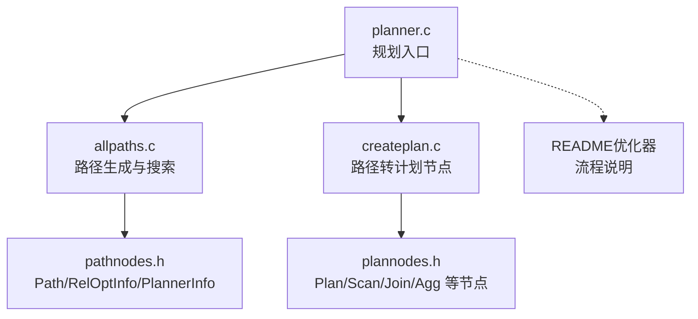
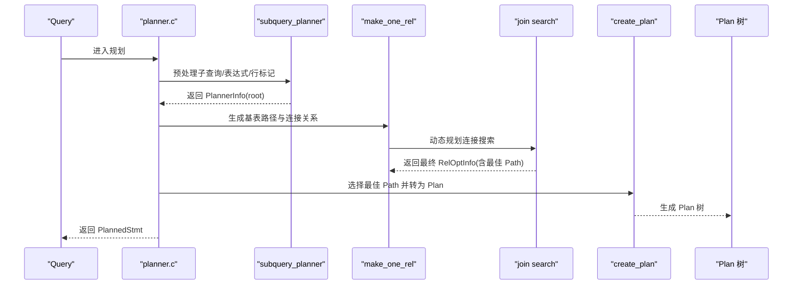
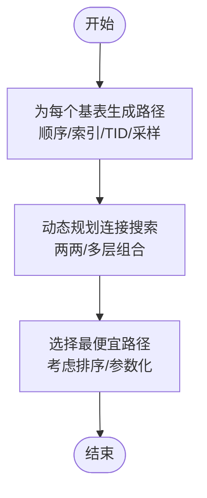
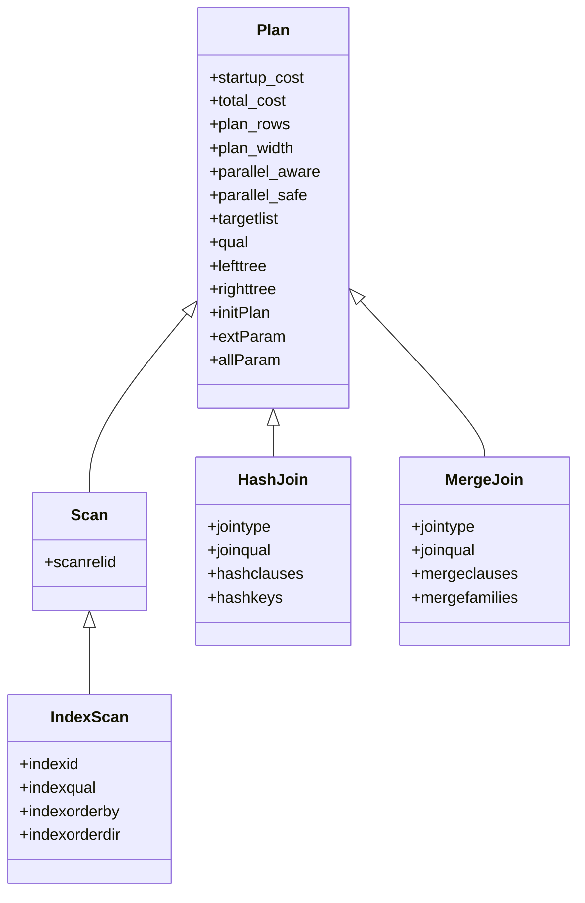
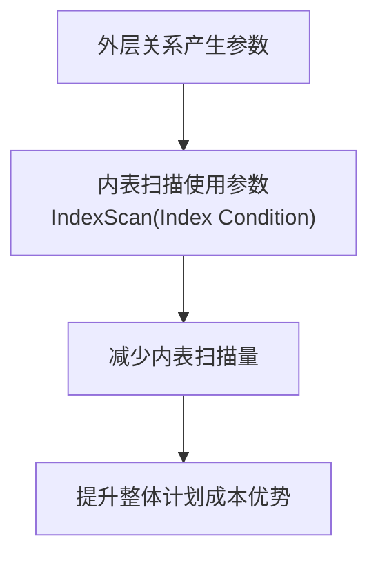
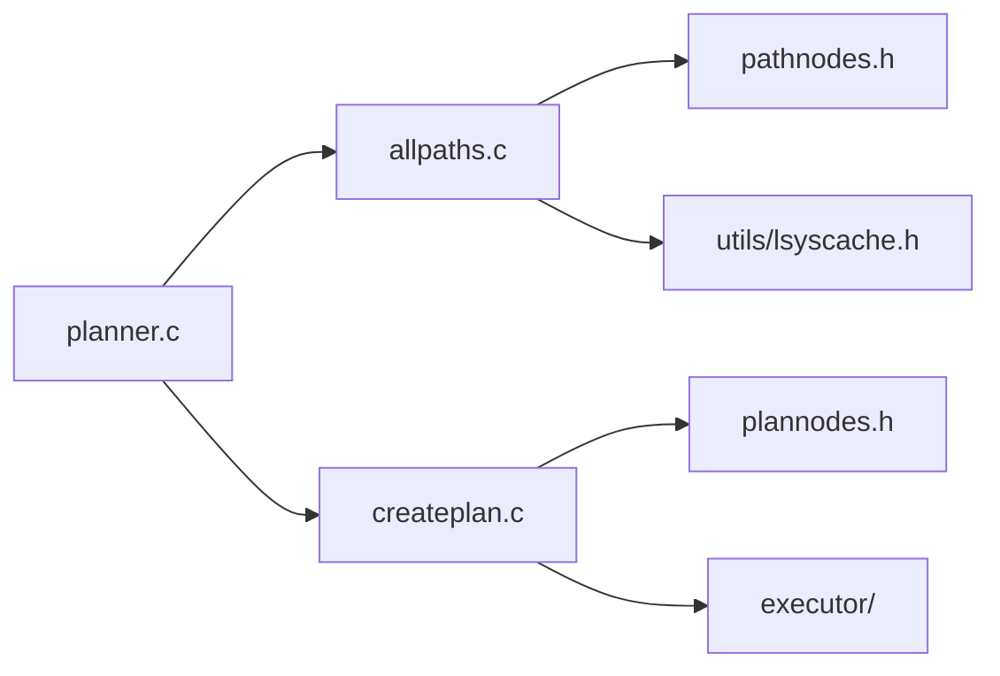

# 计划构建

<cite>
**本文引用的文件**
- [planner.c](file://src/backend/optimizer/plan/planner.c)
- [createplan.c](file://src/backend/optimizer/plan/createplan.c)
- [allpaths.c](file://src/backend/optimizer/path/allpaths.c)
- [README（优化器）](file://src/backend/optimizer/README)
- [plannodes.h](file://src/include/nodes/plannodes.h)
- [pathnodes.h](file://src/include/nodes/pathnodes.h)
</cite>

## 目录
1. [简介](#简介)
2. [项目结构](#项目结构)
3. [核心组件](#核心组件)
4. [架构总览](#架构总览)
5. [详细组件分析](#详细组件分析)
6. [依赖关系分析](#依赖关系分析)
7. [性能考量](#性能考量)
8. [故障排查指南](#故障排查指南)
9. [结论](#结论)
10. [附录](#附录)

## 简介
本文件面向 Mini PostgreSQL 的计划构建模块，系统性阐述从查询到执行计划的生成过程：包括路径（Path）的探索与选择、路径到计划节点（Plan）的转换算法、各类计划节点的结构与行为、参数化路径与依赖管理、执行上下文初始化、常见优化技术（谓词下推、列裁剪、聚合优化等）、以及计划验证与调试方法。文档同时提供可视化图示与性能分析技巧，帮助开发者理解计划生成的内部机制。

## 项目结构
Mini PostgreSQL 的优化器位于 src/backend/optimizer，分为 path、plan、prep、util 四个子目录：
- path：负责为每个基表或连接关系生成多种访问路径（如顺序扫描、索引扫描、哈希/合并/嵌套循环连接等），并维护排序键（PathKey）和等价类（EquivalenceClass）。
- plan：将选定的最优 Path 转换为可执行的 Plan 树，填充目标列表、过滤条件、参数绑定等。
- prep：预处理阶段（如子查询提升、等价类构造、限制/连接条件拆分等）。
- util：通用工具函数（如约束排除、统计信息、表达式处理等）。

图表来源
- [planner.c:215-480](file://src/backend/optimizer/plan/planner.c#L215-L480)
- [allpaths.c:123-212](file://src/backend/optimizer/path/allpaths.c#L123-L212)
- [createplan.c:297-496](file://src/backend/optimizer/plan/createplan.c#L297-L496)
- [pathnodes.h:78-129](file://src/include/nodes/pathnodes.h#L78-L129)
- [plannodes.h:108-154](file://src/include/nodes/plannodes.h#L108-L154)

章节来源
- [README（优化器）:1-14](file://src/backend/optimizer/README#L1-L14)

## 核心组件
- 规划入口与全局状态
  - planner()/standard_planner()：设置 PlannerGlobal，评估并行模式可行性，计算元组比例，调用 subquery_planner() 完成递归规划，选择最佳路径并转换为 Plan。
  - subquery_planner()：为每个子查询创建 PlannerInfo，进行子链接/子查询提升、表达式预处理、行标记处理、HAVING/LIMIT 等预处理。
- 路径生成与搜索
  - make_one_rel()：汇总所有基表 RelOptInfo，计算总页数，生成基表路径，再组合成最终连接关系。
  - set_base_rel_pathlists()：为每个基表生成顺序扫描、索引扫描、TID 扫描等路径；必要时考虑并行路径。
  - standard_join_search()（在 README 中描述）：动态规划式连接搜索，按层级逐步构建 join rels，选择最便宜路径。
- 路径到计划节点转换
  - create_plan()/create_plan_recurse()：根据 Path 类型分派到具体 create_xxx_plan()，生成 Plan 树；处理 tlist、qual、initPlan、参数绑定等。
  - create_scan_plan()：抽取限制条件，决定物理 tlist 或最小 tlist，生成 SeqScan/IndexScan/BitmapHeapScan/TidScan 等。
- 计划节点定义
  - Plan 基类与具体节点：SeqScan、IndexScan、IndexOnlyScan、BitmapIndexScan、BitmapHeapScan、TidScan、TidRangeScan、SubqueryScan、FunctionScan、ValuesScan、NamedTuplestoreScan、CustomScan、Join/NestLoop/MergeJoin/HashJoin、Sort、Group、Agg、Limit、Material、Memoize、Gather/GatherMerge、Append/MergeAppend、ProjectSet、ModifyTable 等。

章节来源
- [planner.c:215-480](file://src/backend/optimizer/plan/planner.c#L215-L480)
- [planner.c:512-800](file://src/backend/optimizer/plan/planner.c#L512-L800)
- [allpaths.c:123-212](file://src/backend/optimizer/path/allpaths.c#L123-L212)
- [allpaths.c:304-503](file://src/backend/optimizer/path/allpaths.c#L304-L503)
- [allpaths.c:652-700](file://src/backend/optimizer/path/allpaths.c#L652-L700)
- [createplan.c:297-496](file://src/backend/optimizer/plan/createplan.c#L297-L496)
- [createplan.c:498-715](file://src/backend/optimizer/plan/createplan.c#L498-L715)
- [plannodes.h:108-154](file://src/include/nodes/plannodes.h#L108-L154)
- [plannodes.h:300-565](file://src/include/nodes/plannodes.h#L300-L565)

## 架构总览
下图展示从查询到执行计划的关键流程：规划入口 -> 子查询预处理 -> 路径生成与搜索 -> 选择最佳路径 -> 转换为 Plan -> 清理与封装。

图表来源
- [planner.c:215-480](file://src/backend/optimizer/plan/planner.c#L215-L480)
- [allpaths.c:123-212](file://src/backend/optimizer/path/allpaths.c#L123-L212)
- [createplan.c:297-496](file://src/backend/optimizer/plan/createplan.c#L297-L496)

## 详细组件分析

### 路径生成与连接搜索（allpaths.c）
- 基表路径生成
  - set_plain_rel_pathlist()：为普通关系添加顺序扫描路径；若允许并行则创建部分并行路径；随后尝试索引扫描与 TID 扫描。
  - set_tablesample_rel_pathlist()：为 TABLESAMPLE 关系生成采样扫描路径，并在不可重复扫描时包裹 Material 以避免多次扫描风险。
- 连接搜索
  - make_one_rel()：汇总 all_baserels，计算 total_table_pages，生成基表路径后，通过 make_rel_from_joinlist() 构建连接关系。
  - README 中描述的 standard_join_search()：自底向上按层级构建 join rels，考虑左/右/树状计划，使用等价类与 PathKey 减少排序开销。

图表来源
- [allpaths.c:304-503](file://src/backend/optimizer/path/allpaths.c#L304-L503)
- [allpaths.c:652-700](file://src/backend/optimizer/path/allpaths.c#L652-L700)
- [README（优化器）:65-181](file://src/backend/optimizer/README#L65-L181)

章节来源
- [allpaths.c:123-212](file://src/backend/optimizer/path/allpaths.c#L123-L212)
- [allpaths.c:304-503](file://src/backend/optimizer/path/allpaths.c#L304-L503)
- [allpaths.c:652-700](file://src/backend/optimizer/path/allpaths.c#L652-L700)
- [README（优化器）:65-181](file://src/backend/optimizer/README#L65-L181)

### 路径到计划节点的转换（createplan.c）
- 分派逻辑
  - create_plan_recurse()：依据 Path 的 pathtype 分派到对应 create_xxx_plan()，覆盖扫描、连接、排序、聚合、限制、并行收集等。
- 扫描计划
  - create_scan_plan()：抽取 baserestrictinfo/indexrestrictinfo，处理伪常量 gating qual，决定物理 tlist 或最小 tlist，生成 SeqScan/IndexScan/BitmapHeapScan/TidScan/SubqueryScan/FunctionScan/ValuesScan/NamedTuplestoreScan/CustomScan。
- 连接计划
  - create_join_plan()：根据 NestPath/MergePath/HashPath 生成 NestLoop/MergeJoin/HashJoin，并处理 joinqual、hashkeys、mergeclauses、inner_unique 等。
- 其他计划
  - Sort/Group/Agg/Limit/Material/Memoize/Gather/GatherMerge/Append/MergeAppend/ProjectSet/ModifyTable 等均有对应的 create_xxx_plan()。

图表来源
- [plannodes.h:108-154](file://src/include/nodes/plannodes.h#L108-L154)
- [plannodes.h:300-600](file://src/include/nodes/plannodes.h#L300-L600)
- [createplan.c:297-496](file://src/backend/optimizer/plan/createplan.c#L297-L496)
- [createplan.c:498-715](file://src/backend/optimizer/plan/createplan.c#L498-L715)

章节来源
- [createplan.c:297-496](file://src/backend/optimizer/plan/createplan.c#L297-L496)
- [createplan.c:498-715](file://src/backend/optimizer/plan/createplan.c#L498-L715)
- [plannodes.h:108-154](file://src/include/nodes/plannodes.h#L108-L154)
- [plannodes.h:300-600](file://src/include/nodes/plannodes.h#L300-L600)

### 计划节点类型与行为
- 扫描节点
  - SeqScan：全表扫描，支持并行与参数化路径。
  - IndexScan/IndexOnlyScan：基于索引的条件扫描与仅索引扫描，支持 ORDER BY 与重检查条件。
  - BitmapIndexScan/BitmapHeapScan：位图索引扫描与堆扫描结合，支持多索引位图合并。
  - TidScan/TidRangeScan：基于 CTID 的直接定位与范围扫描。
  - SubqueryScan/FunctionScan/ValuesScan/NamedTuplestoreScan：对子查询、函数、VALUES、ENR 的扫描。
  - CustomScan：扩展扫描接口，支持自定义实现。
- 连接节点
  - NestLoop：嵌套循环，适合小驱动集与参数化内表。
  - MergeJoin：归并连接，需要有序输入，避免额外排序。
  - HashJoin：哈希连接，先构建内表哈希表，再探测外表。
- 上层操作
  - Sort/IncrementalSort：排序与增量排序。
  - Group/Agg/GroupingSets：分组与聚合。
  - Limit：限制输出行数。
  - Material/Memoize：物化与缓存。
  - Gather/GatherMerge：并行结果收集与合并。
  - Append/MergeAppend：追加与有序追加。
  - ProjectSet：包含集合返回函数的投影。
  - ModifyTable：DML 操作（INSERT/UPDATE/DELETE）。

章节来源
- [plannodes.h:300-600](file://src/include/nodes/plannodes.h#L300-L600)
- [createplan.c:297-496](file://src/backend/optimizer/plan/createplan.c#L297-L496)

### 参数化路径与依赖管理
- 参数化路径（Parameterized Paths）
  - 当内表扫描可利用外层关系的值作为参数（如 NestLoop 中的 Index Scan 条件 B.Y = A.X），可显著减少 I/O。
  - allpaths.c 中通过 required_outer 与 lateral_relids 控制参数化需求，并在 add_path/add_partial_path 中记录依赖。
- 依赖与参数传播
  - createplan.c 中 build_path_tlist() 会替换 nestloop params，确保 tlist 正确引用外部参数。
  - extParam/allParam 用于标识影响当前节点或其子树的 PARAM_EXEC 参数集合，便于执行期重扫与资源管理。

图表来源
- [README（优化器）:716-800](file://src/backend/optimizer/README#L716-L800)
- [createplan.c:723-756](file://src/backend/optimizer/plan/createplan.c#L723-L756)
- [plannodes.h:141-154](file://src/include/nodes/plannodes.h#L141-L154)

章节来源
- [README（优化器）:716-800](file://src/backend/optimizer/README#L716-L800)
- [createplan.c:723-756](file://src/backend/optimizer/plan/createplan.c#L723-L756)
- [plannodes.h:141-154](file://src/include/nodes/plannodes.h#L141-L154)

### 执行上下文初始化
- 顶层计划封装
  - planner.c 中 final cleanup 阶段调用 set_plan_references() 修正 Var 引用、绑定子计划与 initPlan，并构建 PlannedStmt。
- 并行模式与 Gather
  - 若 force_parallel_mode 非关闭且计划安全，可在顶层插入 Gather 节点以启用并行执行。
- 参数执行类型
  - 若存在 PARAM_EXEC 参数，遍历子计划与主计划，调用 SS_finalize_plan() 完成参数绑定与依赖计算。

章节来源
- [planner.c:215-480](file://src/backend/optimizer/plan/planner.c#L215-L480)

### 优化技术
- 谓词下推（Predicate Pushdown）
  - 将 WHERE/HAVING 中的条件尽可能下推到扫描层（如 indexqual、baserestrictinfo），减少后续过滤开销。
  - create_scan_plan() 中抽取 baserestrictinfo/indexrestrictinfo 并处理伪常量 gating qual。
- 列裁剪（Column Pruning）
  - 通过 build_physical_tlist() 或 build_path_tlist() 生成最小必要 tlist，避免不必要列传输。
  - use_physical_tlist() 决策是否采用物理 tlist（全列）以提升执行期投影优化机会。
- 聚合优化
  - grouping_planner() 与 planagg.c 支持部分聚合、分组集（GROUPING SETS）、去重（DISTINCT）等优化。
  - AggPath/GroupPath/GroupingSetsPath 在 createplan.c 中转换为相应 Plan 节点。
- 等价类与排序键（EquivalenceClasses & PathKeys）
  - 通过等价类推导相等关系，减少冗余比较；利用 PathKey 表达已知排序，避免显式 Sort。
  - README 中详述等价类与 PathKey 的构造与使用。

章节来源
- [createplan.c:498-715](file://src/backend/optimizer/plan/createplan.c#L498-L715)
- [README（优化器）:436-714](file://src/backend/optimizer/README#L436-L714)
- [planner.c:512-800](file://src/backend/optimizer/plan/planner.c#L512-L800)

### 计划验证与调试
- 调试开关
  - OPTIMIZER_DEBUG：启用后可打印 RelOptInfo 与路径信息，辅助诊断路径选择。
- EXPLAIN 输出
  - 通过 EXPLAIN 查看计划树、成本估计、过滤条件、索引使用情况等。
- 断言与错误
  - create_plan_recurse() 中对未识别节点类型抛出错误；set_plan_references 前断言保证状态一致性。

章节来源
- [planner.c:38-40](file://src/backend/optimizer/plan/planner.c#L38-L40)
- [createplan.c:488-492](file://src/backend/optimizer/plan/createplan.c#L488-L492)

## 依赖关系分析
- 模块耦合
  - planner.c 依赖 allpaths.c（路径生成）、createplan.c（计划转换）、pathnodes.h/plannodes.h（数据结构）。
  - allpaths.c 依赖 costsize.c（成本估算）、selfuncs.c（选择性估计）、plancat.c（统计信息）。
- 外部依赖
  - 执行器接口（executor/）、存储访问（access/）、系统缓存（utils/lsyscache.h）等。

图表来源
- [planner.c:16-62](file://src/backend/optimizer/plan/planner.c#L16-L62)
- [allpaths.c:16-45](file://src/backend/optimizer/path/allpaths.c#L16-L45)
- [createplan.c:17-43](file://src/backend/optimizer/plan/createplan.c#L17-L43)

章节来源
- [planner.c:16-62](file://src/backend/optimizer/plan/planner.c#L16-L62)
- [allpaths.c:16-45](file://src/backend/optimizer/path/allpaths.c#L16-L45)
- [createplan.c:17-43](file://src/backend/optimizer/plan/createplan.c#L17-L43)

## 性能考量
- 成本模型
  - startup_cost 与 total_cost 用于选择最快启动或最低总成本的计划；对于游标场景，cursor_tuple_fraction 影响选择。
- 并行执行
  - consider_parallel 标志与 partial paths 支持并行扫描；Gather/GatherMerge 用于结果收集。
- 排序与等价类
  - 利用 PathKey 与等价类避免显式排序；MERGE JOIN 可复用已有排序。
- 参数化路径
  - 小驱动集+参数化内表扫描可显著降低 I/O；需权衡 NestLoop 与 Hash/Merge Join 的成本。
- 列裁剪与物化
  - 最小 tlist 减少数据传输；Material 避免重复计算；Memoize 缓存子路径结果。

[本节为通用性能讨论，不直接分析具体文件]

## 故障排查指南
- 常见问题
  - 未识别节点类型：检查 Path 类型与 create_plan_recurse() 分支覆盖。
  - 参数绑定失败：确认 NestLoopParams 已正确分配到计划节点，检查 extParam/allParam。
  - 并行模式异常：验证 parallelModeOK 与函数并行安全性标记。
- 调试步骤
  - 启用 OPTIMIZER_DEBUG 打印路径信息。
  - 使用 EXPLAIN (ANALYZE, BUFFERS) 观察实际执行成本与 I/O。
  - 检查等价类与 PathKey 是否正确推导，避免不必要的排序。

章节来源
- [createplan.c:488-492](file://src/backend/optimizer/plan/createplan.c#L488-L492)
- [planner.c:420-437](file://src/backend/optimizer/plan/planner.c#L420-L437)
- [planner.c:377-418](file://src/backend/optimizer/plan/planner.c#L377-L418)

## 结论
Mini PostgreSQL 的计划构建模块遵循标准 PostgreSQL 的优化器架构：通过路径探索与动态规划选择最优执行策略，再将路径转换为可执行的计划节点。其核心在于等价类与排序键的利用、参数化路径的推广、并行执行的支持，以及严格的成本模型指导。开发者可通过 EXPLAIN、调试开关与断言进行验证与调优，结合列裁剪、谓词下推、聚合优化等技术获得更佳性能。

[本节为总结性内容，不直接分析具体文件]

## 附录
- 关键数据结构
  - PlannerGlobal：跨子查询的全局状态（绑定参数、子计划、并行模式等）。
  - PlannerInfo：每查询级别的规划状态（基表数组、连接信息、目标列表等）。
  - RelOptInfo：关系或连接关系的优化信息（路径列表、大小估计、限制/连接条件等）。
  - Path/Plan：路径与计划节点的一一对应，前者侧重规划信息，后者侧重执行信息。

章节来源
- [pathnodes.h:78-129](file://src/include/nodes/pathnodes.h#L78-L129)
- [pathnodes.h:154-200](file://src/include/nodes/pathnodes.h#L154-L200)
- [plannodes.h:108-154](file://src/include/nodes/plannodes.h#L108-L154)