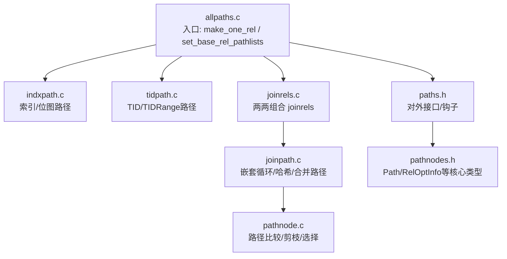
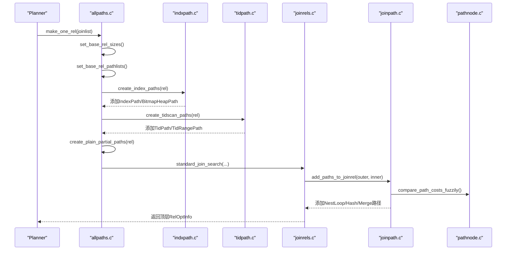
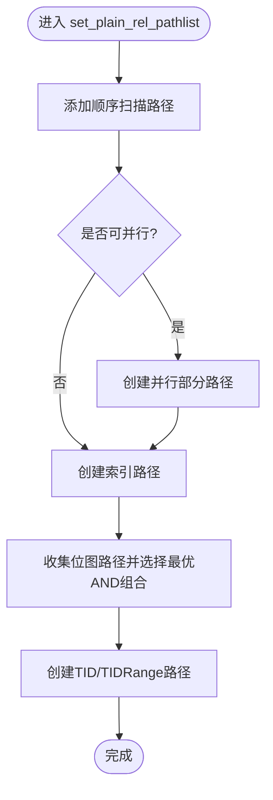
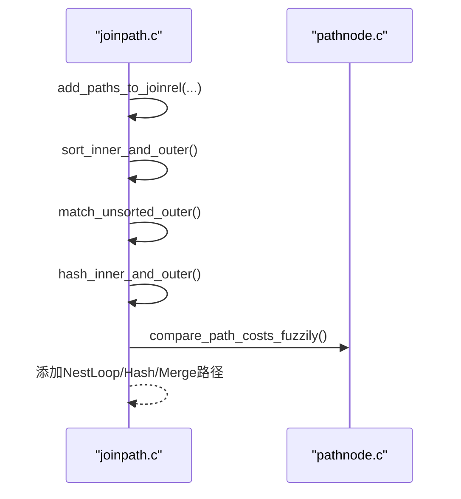
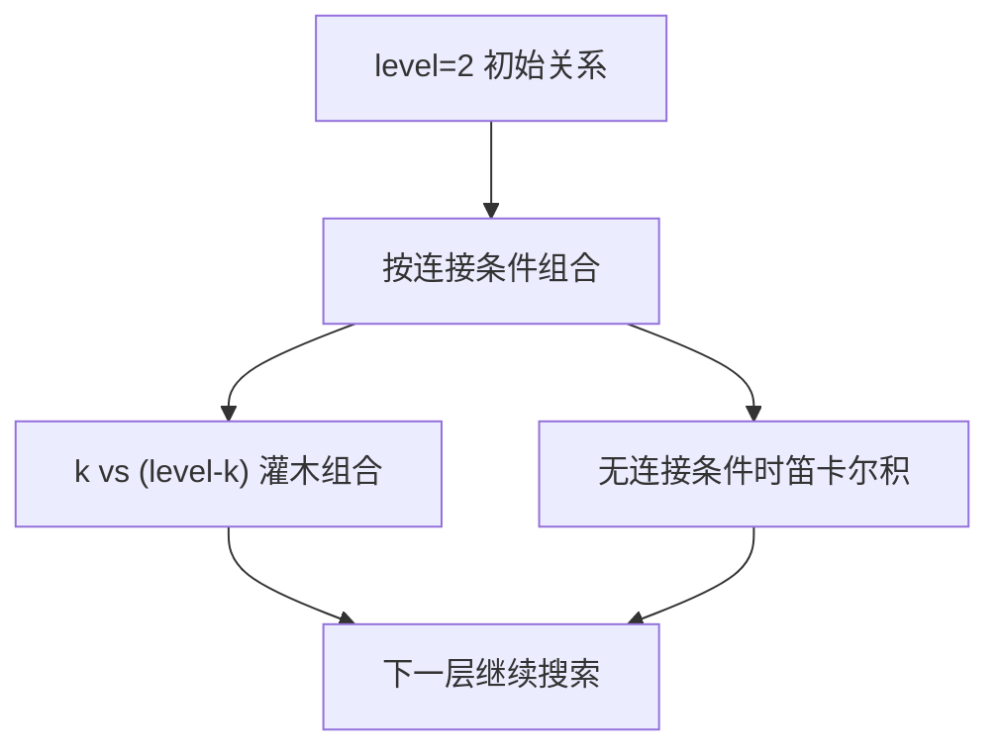
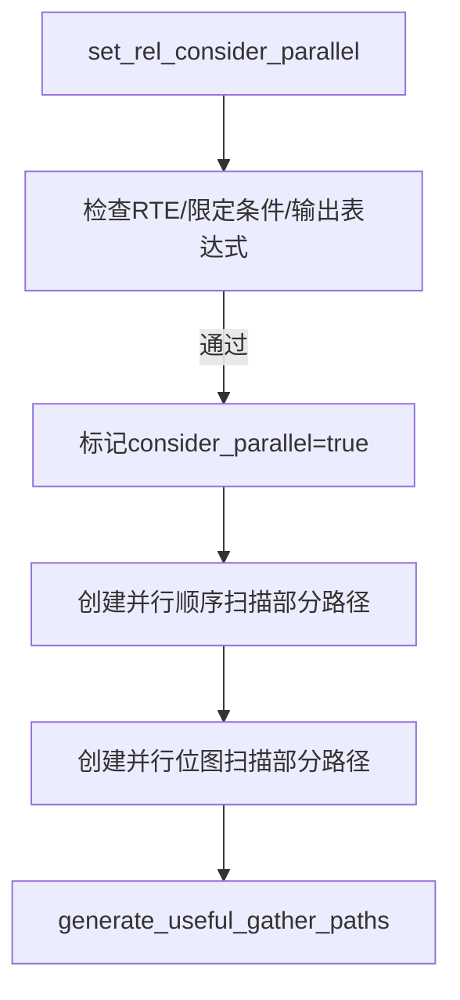
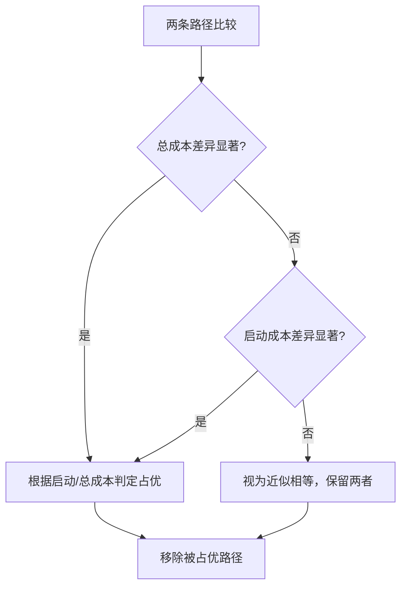
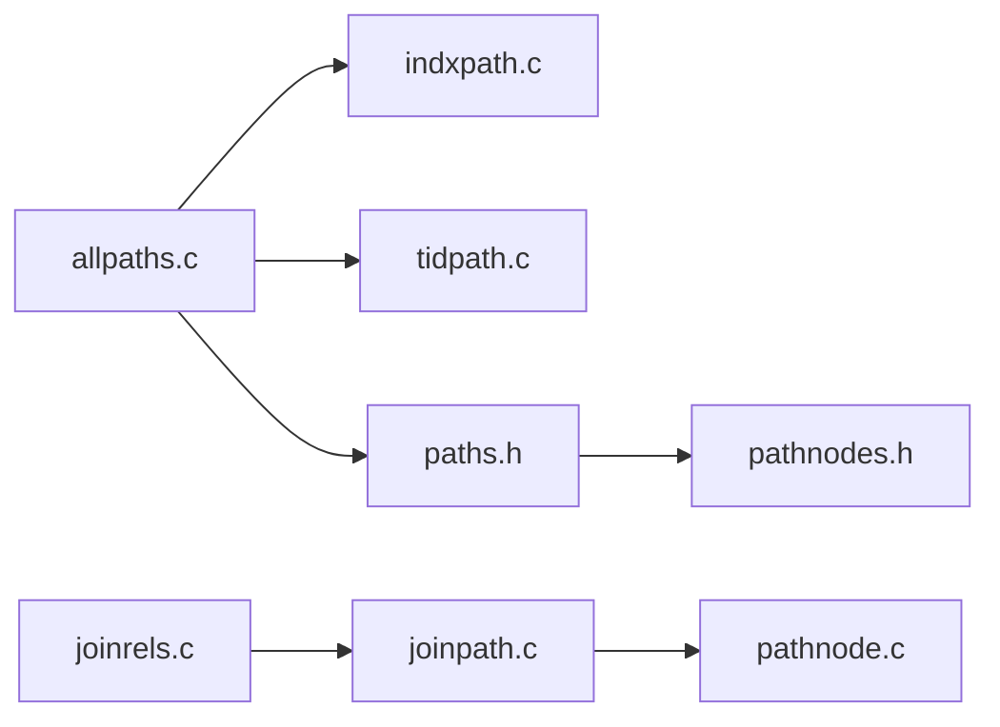

# 路径生成

<cite>
**本文引用的文件**
- [allpaths.c](file://src/backend/optimizer/path/allpaths.c)
- [indxpath.c](file://src/backend/optimizer/path/indxpath.c)
- [tidpath.c](file://src/backend/optimizer/path/tidpath.c)
- [joinpath.c](file://src/backend/optimizer/path/joinpath.c)
- [joinrels.c](file://src/backend/optimizer/path/joinrels.c)
- [pathnode.c](file://src/backend/optimizer/util/pathnode.c)
- [paths.h](file://src/include/optimizer/paths.h)
- [pathnodes.h](file://src/include/nodes/pathnodes.h)
</cite>

## 目录
1. [简介](#简介)
2. [项目结构](#项目结构)
3. [核心组件](#核心组件)
4. [架构总览](#架构总览)
5. [详细组件分析](#详细组件分析)
6. [依赖关系分析](#依赖关系分析)
7. [性能考量](#性能考量)
8. [故障排查指南](#故障排查指南)
9. [结论](#结论)
10. [附录：扩展与示例](#附录：扩展与示例)

## 简介
本文件面向Mini PostgreSQL的路径生成模块，系统性阐述执行计划“路径”的概念、生成算法与优化策略。内容覆盖单表访问路径（顺序扫描、索引扫描、位图扫描、TID扫描）、连接路径（嵌套循环、哈希、合并）的选择机制、并行路径的生成与收集、路径剪枝与比较、最优路径选择过程，并提供扩展新访问方法或连接算法的实践指引。

## 项目结构
路径生成位于优化器子系统的 path 目录，配合 util 中的路径工具与 include 中的接口定义，形成从“基表路径生成 → 连接路径组合 → 全局搜索与剪枝”的完整流水线。

图表来源
- [allpaths.c:123-212](file://src/backend/optimizer/path/allpaths.c#L123-L212)
- [indxpath.c:234-415](file://src/backend/optimizer/path/indxpath.c#L234-L415)
- [tidpath.c:458-529](file://src/backend/optimizer/path/tidpath.c#L458-L529)
- [joinrels.c:55-258](file://src/backend/optimizer/path/joinrels.c#L55-L258)
- [joinpath.c:122-343](file://src/backend/optimizer/path/joinpath.c#L122-L343)
- [pathnode.c:74-200](file://src/backend/optimizer/util/pathnode.c#L74-L200)
- [paths.h:20-109](file://src/include/optimizer/paths.h#L20-L109)
- [pathnodes.h:23-76](file://src/include/nodes/pathnodes.h#L23-L76)

章节来源
- [allpaths.c:123-212](file://src/backend/optimizer/path/allpaths.c#L123-L212)
- [paths.h:20-109](file://src/include/optimizer/paths.h#L20-L109)

## 核心组件
- 基表路径生成：负责为每个基表生成顺序扫描、索引扫描、位图扫描、TID扫描以及并行部分路径，并设置考虑并行标志与大小估计。
- 连接路径生成：对每对输入关系尝试多种连接算法（嵌套循环、哈希、合并），并考虑参数化路径、唯一性、半连接/反连接修正因子等。
- 连接搜索：按层动态规划构建所有可能的连接关系集合，支持左/右侧连接与“灌木状”计划。
- 路径比较与剪枝：基于启动成本/总成本与模糊容忍度进行支配判断，剔除被占优路径。
- 并行路径：为可并行的基表生成部分路径，并在合适时机收集为Gather。

章节来源
- [allpaths.c:267-331](file://src/backend/optimizer/path/allpaths.c#L267-L331)
- [allpaths.c:657-700](file://src/backend/optimizer/path/allpaths.c#L657-L700)
- [joinpath.c:122-343](file://src/backend/optimizer/path/joinpath.c#L122-L343)
- [joinrels.c:55-258](file://src/backend/optimizer/path/joinrels.c#L55-L258)
- [pathnode.c:74-200](file://src/backend/optimizer/util/pathnode.c#L74-L200)

## 架构总览
下图展示了从基表到最终连接的端到端路径生成流程，包括并行路径的生成与收集。

图表来源
- [allpaths.c:123-212](file://src/backend/optimizer/path/allpaths.c#L123-L212)
- [indxpath.c:234-415](file://src/backend/optimizer/path/indxpath.c#L234-L415)
- [tidpath.c:458-529](file://src/backend/optimizer/path/tidpath.c#L458-L529)
- [joinrels.c:55-258](file://src/backend/optimizer/path/joinrels.c#L55-L258)
- [joinpath.c:122-343](file://src/backend/optimizer/path/joinpath.c#L122-L343)
- [pathnode.c:74-200](file://src/backend/optimizer/util/pathnode.c#L74-L200)

## 详细组件分析

### 单表访问路径生成
- 顺序扫描：为普通关系创建SeqScan路径；若允许并行且无外部参数需求，则创建并行部分路径。
- 索引扫描：匹配限制条件与等价类，生成IndexPath；同时收集可用于位图扫描的候选，最终构造最佳BitmapHeapPath，必要时生成并行部分路径。
- 位图扫描：将多个索引位图路径通过AND/OR组合，选择最优组合后生成BitmapHeapPath。
- TID扫描：识别CTID等值、范围、ANY数组及CURRENT OF等条件，生成TidPath/TidRangePath；也支持由等价类推导的参数化TID路径。

图表来源
- [allpaths.c:657-700](file://src/backend/optimizer/path/allpaths.c#L657-L700)
- [indxpath.c:234-415](file://src/backend/optimizer/path/indxpath.c#L234-L415)
- [tidpath.c:458-529](file://src/backend/optimizer/path/tidpath.c#L458-L529)

章节来源
- [allpaths.c:657-700](file://src/backend/optimizer/path/allpaths.c#L657-L700)
- [indxpath.c:234-415](file://src/backend/optimizer/path/indxpath.c#L234-L415)
- [tidpath.c:458-529](file://src/backend/optimizer/path/tidpath.c#L458-L529)

### 连接路径生成与选择
- 入口：add_paths_to_joinrel 接收外/内关系、连接类型与限制条件，准备额外数据（如mergeclause列表、半/反连接修正因子）。
- 合并连接：先尝试双方显式排序的合并连接，再尝试外层已有序的情况。
- 嵌套循环：match_unsorted_outer 中尝试嵌套循环，并对参数化路径做合法性检查与星型模式放宽。
- 哈希连接：hash_inner_and_outer 在启用时尝试哈希连接。
- 唯一性与Memoize：对半连接/反连接计算修正因子；当内路径可缓存且键合法时，尝试在嵌套循环之上叠加Memoize路径。

图表来源
- [joinpath.c:122-343](file://src/backend/optimizer/path/joinpath.c#L122-L343)
- [pathnode.c:74-200](file://src/backend/optimizer/util/pathnode.c#L74-L200)

章节来源
- [joinpath.c:122-343](file://src/backend/optimizer/path/joinpath.c#L122-L343)
- [pathnode.c:74-200](file://src/backend/optimizer/util/pathnode.c#L74-L200)

### 连接搜索与关系组合
- 分层搜索：join_search_one_level 按层构建包含恰好 level 个基关系的连接关系集合。
- 有连接条件优先：优先使用存在连接条件或连接顺序限制的初始关系进行组合。
- 无连接条件兜底：若无可用连接条件，退化为笛卡尔积组合，确保能找到可行计划。
- 灌木计划：对 k 与 level-k 的两组关系进行成对组合，仅在存在相关连接条件或顺序限制时考虑。

图表来源
- [joinrels.c:55-258](file://src/backend/optimizer/path/joinrels.c#L55-L258)

章节来源
- [joinrels.c:55-258](file://src/backend/optimizer/path/joinrels.c#L55-L258)

### 并行路径生成与收集
- 基表并行：若查询整体允许并行且关系满足安全条件，设置 consider_parallel，并为顺序扫描创建并行部分路径。
- 索引并行：当位图扫描组合确定后，若关系可并行且无LATERAL依赖，创建并行位图堆扫描部分路径。
- 收集阶段：在合适的时机调用 generate_useful_gather_paths 将部分路径提升为可收集的并行执行路径。

图表来源
- [allpaths.c:527-650](file://src/backend/optimizer/path/allpaths.c#L527-L650)
- [allpaths.c:687-700](file://src/backend/optimizer/path/allpaths.c#L687-L700)
- [indxpath.c:336-349](file://src/backend/optimizer/path/indxpath.c#L336-L349)
- [paths.h:53-62](file://src/include/optimizer/paths.h#L53-L62)

章节来源
- [allpaths.c:527-650](file://src/backend/optimizer/path/allpaths.c#L527-L650)
- [indxpath.c:336-349](file://src/backend/optimizer/path/indxpath.c#L336-L349)
- [paths.h:53-62](file://src/include/optimizer/paths.h#L53-L62)

### 路径剪枝、比较与最优选择
- 比较函数：compare_path_costs 以启动成本/总成本为依据；compare_fractional_path_costs 支持按分数成本比较；compare_path_costs_fuzzily 引入模糊容忍度避免微小差异导致的路径膨胀。
- 支配规则：若一条路径在启动与总成本上均不劣于另一条，则认为其占优；否则视为不同特性路径保留。
- 选择策略：add_path/add_partial_path 内部会结合父关系的 consider_startup/consider_param_startup 标志决定保留哪些路径；set_cheapest 维护最便宜路径。

图表来源
- [pathnode.c:74-200](file://src/backend/optimizer/util/pathnode.c#L74-L200)

章节来源
- [pathnode.c:74-200](file://src/backend/optimizer/util/pathnode.c#L74-L200)

### 连接算法适用场景与选择标准
- 嵌套循环：适合小驱动集、内表可通过索引/参数化快速定位的场景；支持参数化路径与Memoize优化。
- 哈希连接：适合大表等值连接、内存充足时可一次性构建哈希表；对不等值连接不适用。
- 合并连接：适合两端已有序或可低成本排序的等值/范围连接；全外连接必须走合并或嵌套循环。
- 选择依据：enable_* 开关、连接类型（INNER/LEFT/FULL/SEMI/ANTI）、是否可排序、是否有哈希操作符、是否存在唯一性证明、半/反连接修正因子等。

章节来源
- [joinpath.c:122-343](file://src/backend/optimizer/path/joinpath.c#L122-L343)

## 依赖关系分析
- allpaths.c 依赖 indxpath.c、tidpath.c 生成基表路径，并通过 paths.h 暴露的接口与钩子扩展路径集合。
- joinrels.c 负责关系组合，调用 joinpath.c 生成连接路径。
- pathnode.c 提供路径比较与剪枝的核心逻辑，被 joinpath.c 广泛使用。
- pathnodes.h 定义了 Path、CostSelector、UpperRelationKind 等基础类型，贯穿整个路径系统。

图表来源
- [allpaths.c:123-212](file://src/backend/optimizer/path/allpaths.c#L123-L212)
- [indxpath.c:234-415](file://src/backend/optimizer/path/indxpath.c#L234-L415)
- [tidpath.c:458-529](file://src/backend/optimizer/path/tidpath.c#L458-L529)
- [joinrels.c:55-258](file://src/backend/optimizer/path/joinrels.c#L55-L258)
- [joinpath.c:122-343](file://src/backend/optimizer/path/joinpath.c#L122-L343)
- [pathnode.c:74-200](file://src/backend/optimizer/util/pathnode.c#L74-L200)
- [paths.h:20-109](file://src/include/optimizer/paths.h#L20-L109)
- [pathnodes.h:23-76](file://src/include/nodes/pathnodes.h#L23-L76)

章节来源
- [paths.h:20-109](file://src/include/optimizer/paths.h#L20-L109)
- [pathnodes.h:23-76](file://src/include/nodes/pathnodes.h#L23-L76)

## 性能考量
- 路径爆炸控制：通过模糊比较、仅保留非占优路径、限制参数化路径的组合数量，避免规划时间指数增长。
- 并行收益评估：compute_parallel_worker 估算并行工作进程数，结合 min_parallel_*_size 阈值决定是否启用并行。
- 统计信息利用：索引选择性、等价类、特殊连接信息等用于更精确的成本估计与路径选择。
- 内存与I/O权衡：哈希连接需内存，合并连接可能引入排序开销，需在成本模型中综合评估。

[本节为通用指导，不直接分析具体文件]

## 故障排查指南
- 未生成期望路径：检查 enable_* 开关、索引谓词是否匹配、等价类是否推导成功、LATERAL 依赖是否阻止了某些路径。
- 并行路径缺失：确认 consider_parallel 标志、并行安全函数/表达式、min_parallel_*_size 阈值与 max_parallel_workers_per_gather 配置。
- 连接路径不合理：查看半/反连接修正因子、唯一性证明、哈希/合并操作符可用性、连接类型限制。
- 路径过多导致慢：调整模糊容忍度、减少参数化路径组合、限制 OR 分支数量。

章节来源
- [allpaths.c:527-650](file://src/backend/optimizer/path/allpaths.c#L527-L650)
- [indxpath.c:234-415](file://src/backend/optimizer/path/indxpath.c#L234-L415)
- [joinpath.c:122-343](file://src/backend/optimizer/path/joinpath.c#L122-L343)
- [pathnode.c:74-200](file://src/backend/optimizer/util/pathnode.c#L74-L200)

## 结论
Mini PostgreSQL 的路径生成模块遵循PostgreSQL的经典设计：以基表路径为基础，通过连接搜索与多种连接算法组合，辅以并行路径与严格的剪枝比较，最终选出成本最优的执行计划。理解各组件的职责与交互，有助于诊断性能问题与扩展新的访问方法或连接算法。

[本节为总结，不直接分析具体文件]

## 附录：扩展与示例
- 新增访问方法（例如自定义索引AM）：
  - 在基表路径生成阶段，于 set_plain_rel_pathlist 或对应 RTE 处理分支中添加调用，生成并 add_path 你的自定义路径节点。
  - 若支持并行，参考 create_plain_partial_paths 的模式添加部分路径。
  - 参考路径：[allpaths.c:657-700](file://src/backend/optimizer/path/allpaths.c#L657-L700)

- 新增连接算法：
  - 在 add_paths_to_joinrel 中增加新算法的尝试逻辑，使用 initial_cost_* 快速预检，再通过 add_path_precheck 与 create_*_path 添加路径。
  - 注意参数化路径合法性、星型模式放宽与 Memoize 叠加条件。
  - 参考路径：[joinpath.c:122-343](file://src/backend/optimizer/path/joinpath.c#L122-L343)

- 利用钩子扩展：
  - 通过 set_rel_pathlist_hook 在基表路径生成后插入自定义路径。
  - 通过 set_join_pathlist_hook 在连接路径生成后插入自定义连接路径。
  - 参考路径：[paths.h:26-46](file://src/include/optimizer/paths.h#L26-L46)

章节来源
- [allpaths.c:657-700](file://src/backend/optimizer/path/allpaths.c#L657-L700)
- [joinpath.c:122-343](file://src/backend/optimizer/path/joinpath.c#L122-L343)
- [paths.h:26-46](file://src/include/optimizer/paths.h#L26-L46)