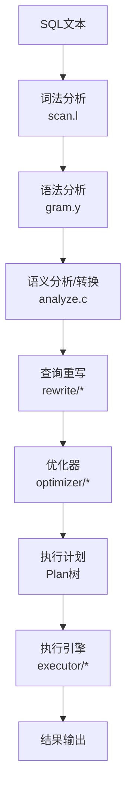
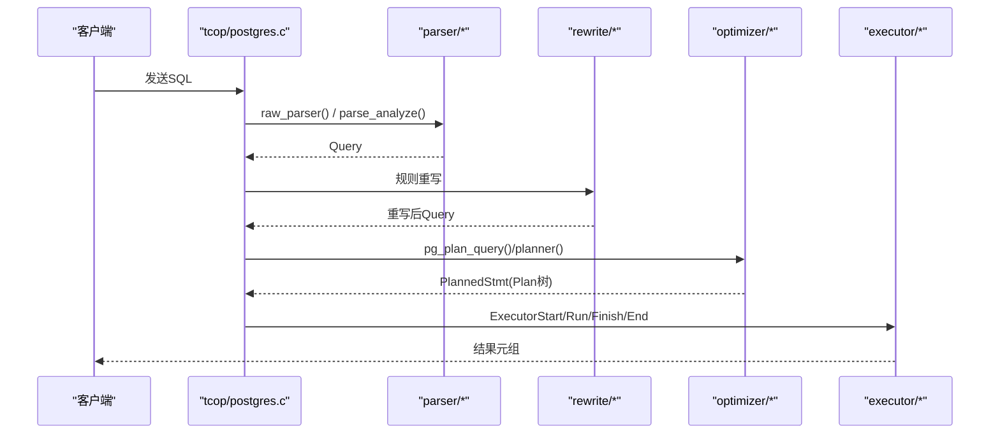
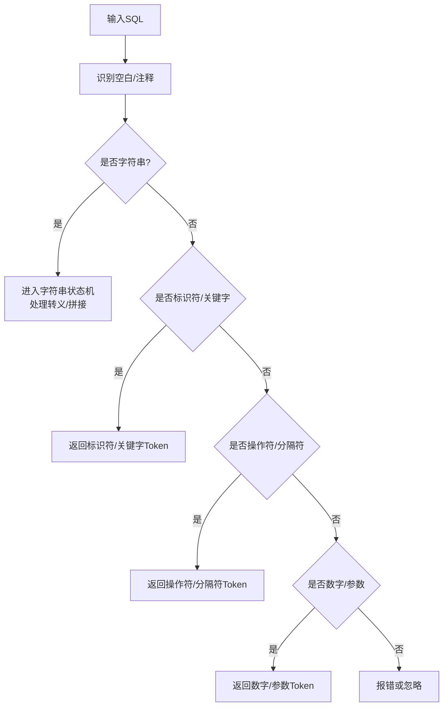
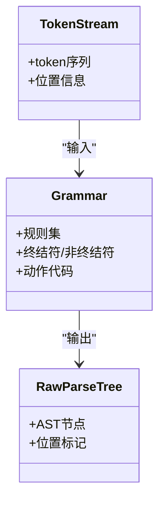
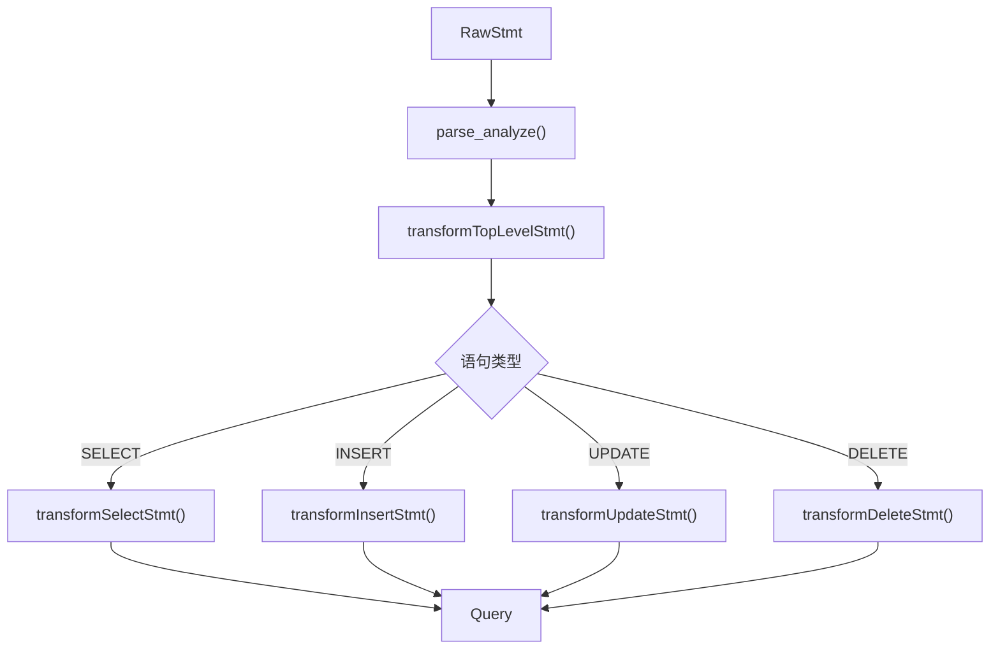
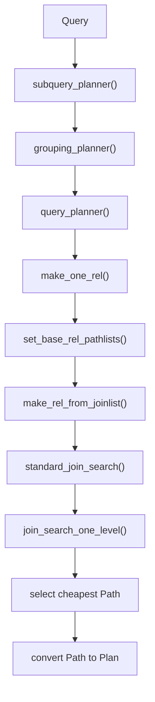
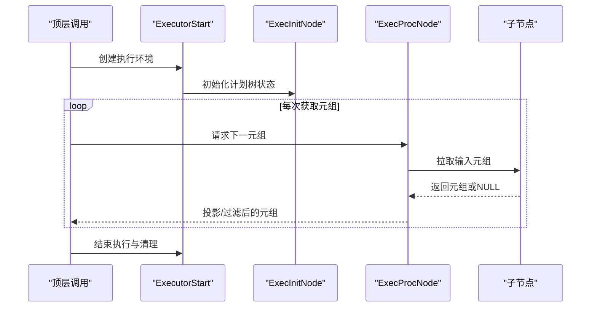
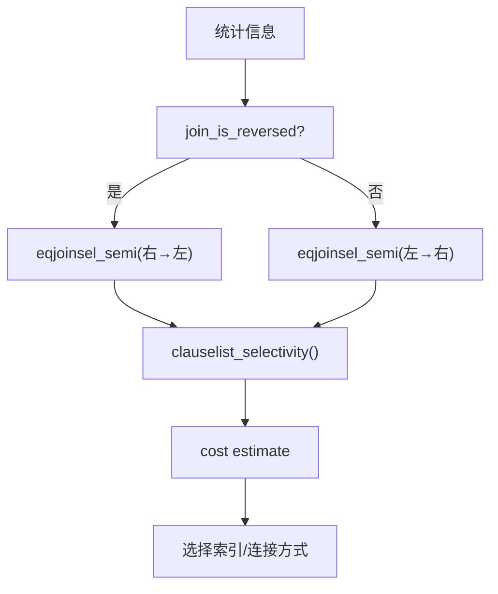
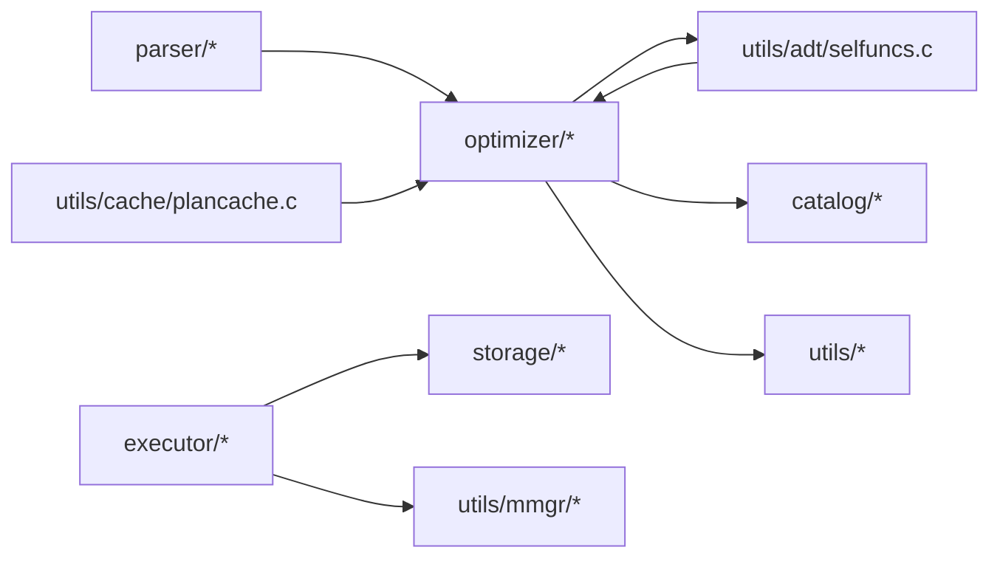

# 查询处理

<cite>
**本文引用的文件**
- [scan.l](file://src/backend/parser/scan.l)
- [gram.y](file://src/backend/parser/gram.y)
- [parser.c](file://src/backend/parser/parser.c)
- [analyze.c](file://src/backend/parser/analyze.c)
- [optimizer/README](file://src/backend/optimizer/README)
- [planner.c](file://src/backend/optimizer/plan/planner.c)
- [postgres.c](file://src/backend/tcop/postgres.c)
- [execMain.c](file://src/backend/executor/execMain.c)
- [nodeResult.c](file://src/backend/executor/nodeResult.c)
- [selfuncs.c](file://src/backend/utils/adt/selfuncs.c)
- [plancache.c](file://src/backend/utils/cache/plancache.c)
- [mmgr/README](file://src/backend/utils/mmgr/README)
- [fmgr/README](file://src/backend/utils/fmgr/README)
</cite>

## 目录
1. [简介](#简介)
2. [项目结构](#项目结构)
3. [核心组件](#核心组件)
4. [架构总览](#架构总览)
5. [详细组件分析](#详细组件分析)
6. [依赖关系分析](#依赖关系分析)
7. [性能考量](#性能考量)
8. [故障排查指南](#故障排查指南)
9. [结论](#结论)
10. [附录](#附录)

## 简介
本文件面向Mini PostgreSQL的查询处理系统，系统性阐述从SQL文本到执行计划再到结果返回的全链路实现。内容覆盖：
- SQL解析器：词法分析、语法分析与语义分析（构建Query）
- 查询优化器：成本估算、路径生成与计划选择
- 执行引擎：节点执行模型、数据流处理与结果返回
- 优化技术：查询重写、索引选择、连接算法等
- 图示与示例：流程图、执行计划示例与优化策略说明

## 项目结构
查询处理贯穿后端多个子系统，关键目录与职责如下：
- src/backend/parser：词法/语法/语义分析，产出Query
- src/backend/rewrite：规则重写（视图、继承等）
- src/backend/optimizer：基于代价的路径搜索与计划生成
- src/backend/executor：计划树执行，拉取式管道
- src/backend/utils：统计信息、缓存、内存管理等支撑模块

**图表来源**
- [scan.l:1-120](file://src/backend/parser/scan.l#L1-L120)
- [gram.y:1-605](file://src/backend/parser/gram.y#L1-L605)
- [analyze.c:86-128](file://src/backend/parser/analyze.c#L86-L128)
- [optimizer/README:1-14](file://src/backend/optimizer/README#L1-L14)
- [execMain.c:248-279](file://src/backend/executor/execMain.c#L248-L279)

**章节来源**
- [scan.l:1-120](file://src/backend/parser/scan.l#L1-L120)
- [gram.y:1-605](file://src/backend/parser/gram.y#L1-L605)
- [analyze.c:86-128](file://src/backend/parser/analyze.c#L86-L128)
- [optimizer/README:1-14](file://src/backend/optimizer/README#L1-L14)
- [execMain.c:248-279](file://src/backend/executor/execMain.c#L248-L279)

## 核心组件
- 词法器（Lexer）：将SQL文本切分为Token流，支持字符串、标识符、操作符、注释、Unicode转义等
- 语法分析器（Parser）：基于Bison规则将Token序列转换为原始解析树
- 语义分析器（Analyzer）：将原始解析树转换为Query，完成类型推导、作用域解析、聚合/分组等语义检查
- 重写器（Rewriter）：应用规则（如视图展开、继承）对Query进行变换
- 优化器（Planner）：基于代价的路径搜索，生成最优Plan树
- 执行器（Executor）：以节点为单位的拉取式执行，逐元组推进并产生结果

**章节来源**
- [parser.c:34-113](file://src/backend/parser/parser.c#L34-L113)
- [analyze.c:86-128](file://src/backend/parser/analyze.c#L86-L128)
- [optimizer/README:16-41](file://src/backend/optimizer/README#L16-L41)
- [execMain.c:248-279](file://src/backend/executor/execMain.c#L248-L279)

## 架构总览
下图展示从SQL到执行的端到端流程，标注了关键入口函数与模块交互。

**图表来源**
- [postgres.c:782-862](file://src/backend/tcop/postgres.c#L782-L862)
- [parser.c:34-113](file://src/backend/parser/parser.c#L34-L113)
- [analyze.c:86-128](file://src/backend/parser/analyze.c#L86-L128)
- [optimizer/README:297-345](file://src/backend/optimizer/README#L297-L345)
- [execMain.c:248-279](file://src/backend/executor/execMain.c#L248-L279)

## 详细组件分析

### 词法分析（Lexer）
- 使用Flex生成扫描器，定义多种独占状态以处理字符串、注释、标识符、数字等
- 支持标准字符串、扩展字符串、美元引号、Unicode转义、位串、十六进制串等
- 通过位置追踪yylloc提升错误定位能力

**图表来源**
- [scan.l:162-200](file://src/backend/parser/scan.l#L162-L200)
- [scan.l:219-401](file://src/backend/parser/scan.l#L219-L401)
- [scan.l:418-800](file://src/backend/parser/scan.l#L418-L800)

**章节来源**
- [scan.l:1-120](file://src/backend/parser/scan.l#L1-L120)
- [scan.l:162-200](file://src/backend/parser/scan.l#L162-L200)
- [scan.l:219-401](file://src/backend/parser/scan.l#L219-L401)
- [scan.l:418-800](file://src/backend/parser/scan.l#L418-L800)

### 语法分析（Parser）
- 使用Bison规则定义SQL语法，将Token流转换为原始解析树
- 通过lookahead机制保持LALR(1)，避免回溯
- 在parser.c中提供base_yylex过滤器，统一多Token前瞻与U*/US*转换

**图表来源**
- [gram.y:1-605](file://src/backend/parser/gram.y#L1-L605)
- [parser.c:85-113](file://src/backend/parser/parser.c#L85-L113)

**章节来源**
- [gram.y:1-605](file://src/backend/parser/gram.y#L1-L605)
- [parser.c:85-113](file://src/backend/parser/parser.c#L85-L113)

### 语义分析（Analyzer）
- 将原始解析树转换为Query，完成类型推导、列解析、聚合/分组/HAVING/窗口函数等
- 维护ParseState上下文，递归处理子语句
- 支持固定参数与可变参数两种模式

**图表来源**
- [analyze.c:86-128](file://src/backend/parser/analyze.c#L86-L128)
- [analyze.c:170-200](file://src/backend/parser/analyze.c#L170-L200)

**章节来源**
- [analyze.c:86-128](file://src/backend/parser/analyze.c#L86-L128)
- [analyze.c:170-200](file://src/backend/parser/analyze.c#L170-L200)

### 查询重写（Rewrite）
- 应用规则系统对Query进行变换，如视图展开、继承表合并等
- 重写发生在语义分析之后、优化之前，确保后续优化基于等价且更利于优化的表示

**章节来源**
- [optimizer/README:1-14](file://src/backend/optimizer/README#L1-L14)

### 查询优化器（Planner）
- 目标：为Query生成低成本执行计划（Plan树）
- 核心概念：
  - RelOptInfo：表示基表或中间连接结果
  - Path：一种可行的访问/连接方式（顺序扫描、索引扫描、嵌套循环、合并连接、哈希连接等）
  - EquivalenceClass/PathKey：用于等价类推导与排序信息传递，减少不必要的Sort
- 流程要点：
  - 子查询上拉、WHERE规范化、常量折叠
  - 分解qual为restrict/join两类
  - 动态规划搜索join顺序，生成各Rel的候选Paths
  - 选择最便宜Path并转换为Plan

**图表来源**
- [optimizer/README:297-345](file://src/backend/optimizer/README#L297-L345)
- [optimizer/README:16-41](file://src/backend/optimizer/README#L16-L41)

**章节来源**
- [optimizer/README:16-41](file://src/backend/optimizer/README#L16-L41)
- [optimizer/README:297-345](file://src/backend/optimizer/README#L297-L345)
- [planner.c:1-200](file://src/backend/optimizer/plan/planner.c#L1-L200)

### 执行引擎（Executor）
- 以“需求拉取”的方式驱动Plan树：每个节点在被调用时产生下一个元组或结束信号
- 启动阶段建立EState与PlanState树，表达式编译为扁平步骤（ExprState）
- 每元组周期切换至per-tuple内存上下文，避免泄漏
- 支持Rescan、参数化、方向控制等

**图表来源**
- [execMain.c:248-279](file://src/backend/executor/execMain.c#L248-L279)
- [execMain.c:113-200](file://src/backend/executor/execMain.c#L113-L200)

**章节来源**
- [execMain.c:248-279](file://src/backend/executor/execMain.c#L248-L279)
- [execMain.c:113-200](file://src/backend/executor/execMain.c#L113-L200)
- [nodeResult.c:67-92](file://src/backend/executor/nodeResult.c#L67-L92)

### 成本估算与索引选择
- 使用统计信息与选择性函数估计扫描/连接成本
- 针对Merge Join、Index Scan、Bitmap Index Scan等路径进行精细化估算
- 考虑indexCorrelation、indexPages、ScalarArrayOpExpr等对成本的修正

**图表来源**
- [selfuncs.c:2311-2341](file://src/backend/utils/adt/selfuncs.c#L2311-L2341)
- [selfuncs.c:2877-2903](file://src/backend/utils/adt/selfuncs.c#L2877-L2903)
- [selfuncs.c:6420-6463](file://src/backend/utils/adt/selfuncs.c#L6420-L6463)

**章节来源**
- [selfuncs.c:2311-2341](file://src/backend/utils/adt/selfuncs.c#L2311-L2341)
- [selfuncs.c:2877-2903](file://src/backend/utils/adt/selfuncs.c#L2877-L2903)
- [selfuncs.c:6420-6463](file://src/backend/utils/adt/selfuncs.c#L6420-L6463)

### 连接算法
- 嵌套循环（NestLoop）：适合小驱动表+索引查找
- 合并连接（MergeJoin）：需要有序输入，利用PathKey避免显式排序
- 哈希连接（HashJoin）：先构建内表哈希表，再探测外表行
- 优化器根据代价与约束选择合适算法

**章节来源**
- [optimizer/README:43-63](file://src/backend/optimizer/README#L43-L63)

### 执行计划示例
- 典型计划包含SeqScan/IndexScan/BitmapHeapScan/NestLoop/MergeJoin/HashJoin/Sort/Limit等节点
- EXPLAIN可观察节点顺序、条件与成本

（本节为概念性说明，不直接引用具体文件）

## 依赖关系分析
- parser依赖utils中的关键词表与GUC变量
- optimizer依赖catalog/statistics获取统计信息，依赖utils/adt中的选择性函数
- executor依赖storage/buffer访问数据页，依赖utils/mmgr管理内存
- plancache在重复执行时选择通用/定制计划，权衡计划成本与执行收益

**图表来源**
- [selfuncs.c:2311-2341](file://src/backend/utils/adt/selfuncs.c#L2311-L2341)
- [plancache.c:1022-1217](file://src/backend/utils/cache/plancache.c#L1022-L1217)

**章节来源**
- [plancache.c:1022-1217](file://src/backend/utils/cache/plancache.c#L1022-L1217)
- [selfuncs.c:2311-2341](file://src/backend/utils/adt/selfuncs.c#L2311-L2341)

## 性能考量
- 表达式求值采用扁平步骤（ExprEvalStep），减少递归与函数调用开销
- 每元组内存上下文及时重置，避免泄漏；聚合等特殊场景双上下文乒乓切换
- 计划缓存：通用计划与定制计划按平均成本比较选择，兼顾计划与执行成本
- 连接与索引选择依赖统计信息准确性，必要时更新统计以提升估算质量

**章节来源**
- [execMain.c:248-279](file://src/backend/executor/execMain.c#L248-L279)
- [mmgr/README:302-361](file://src/backend/utils/mmgr/README#L302-L361)
- [plancache.c:1022-1217](file://src/backend/utils/cache/plancache.c#L1022-L1217)

## 故障排查指南
- 词法错误：检查字符串闭合、转义序列、Unicode代理对合法性
- 语法错误：确认SQL结构与Bison规则匹配，关注多Token前瞻场景
- 语义错误：类型不匹配、作用域冲突、聚合/分组非法使用
- 计划问题：EXPLAIN查看实际计划，核对索引条件、连接顺序、排序需求
- 执行异常：检查快照可见性、并发更新重检（READ COMMITTED）、资源释放

**章节来源**
- [scan.l:549-717](file://src/backend/parser/scan.l#L549-L717)
- [gram.y:562-605](file://src/backend/parser/gram.y#L562-L605)
- [analyze.c:86-128](file://src/backend/parser/analyze.c#L86-L128)
- [execMain.c:311-368](file://src/backend/executor/execMain.c#L311-L368)

## 结论
Mini PostgreSQL的查询处理遵循经典的分层架构：词法/语法/语义分析生成Query，重写器进行等价变换，优化器基于代价搜索最优计划，执行器以节点为单位高效执行。通过统计信息驱动的估算、丰富的连接与索引策略、以及稳健的执行期内存与缓存管理，系统在正确性与性能之间取得平衡。开发者可据此理解各环节职责与接口，针对性地进行优化与扩展。

## 附录
- 术语
  - Path：一种可行的访问/连接方式
  - Plan：可执行的计划节点树
  - RelOptInfo：关系或连接结果的优化信息
  - EquivalenceClass：已知相等的表达式集合
  - PathKey：路径的排序信息
- 最佳实践
  - 合理设计索引以支持常见查询条件与排序
  - 定期更新统计信息以提高估算准确性
  - 使用EXPLAIN/ANALYZE验证计划与执行时间
  - 注意表达式复杂度与函数副作用对计划的影响