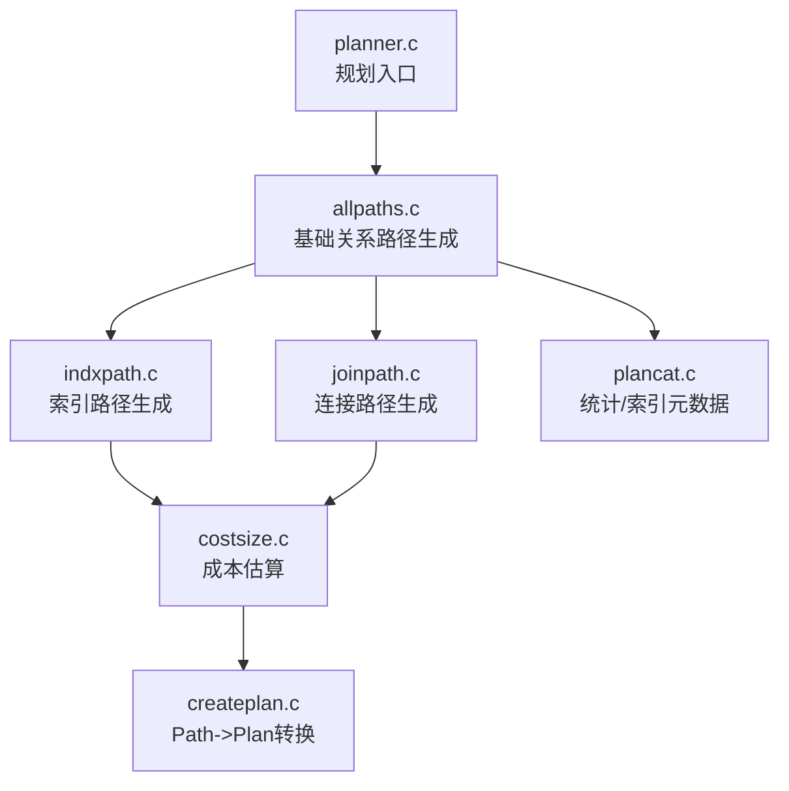
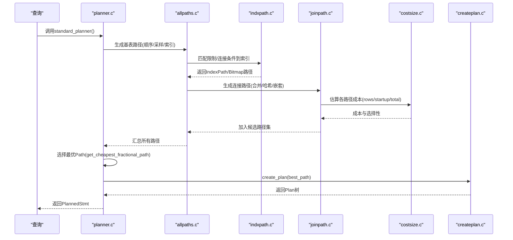
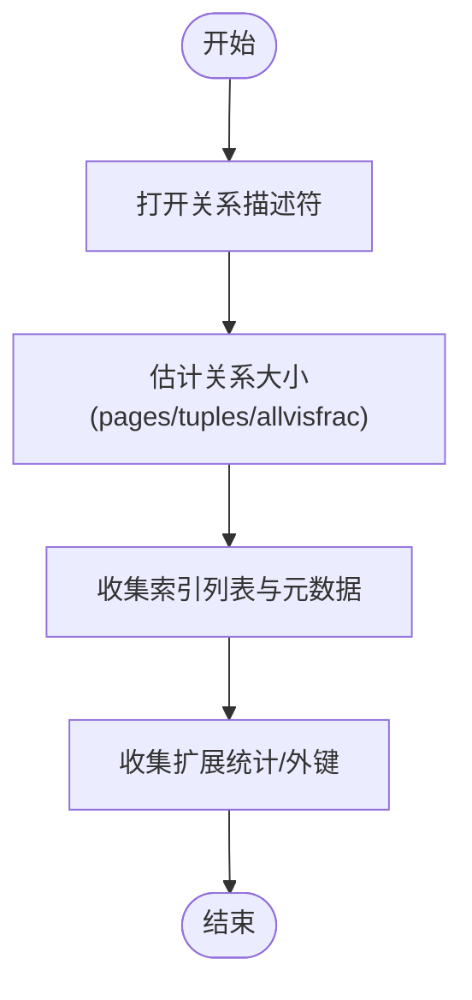
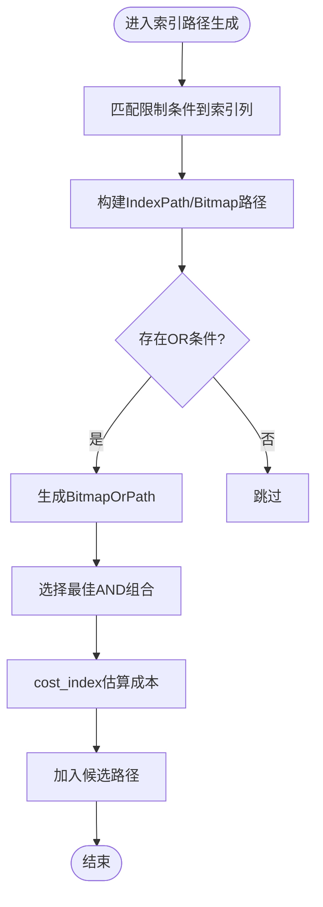
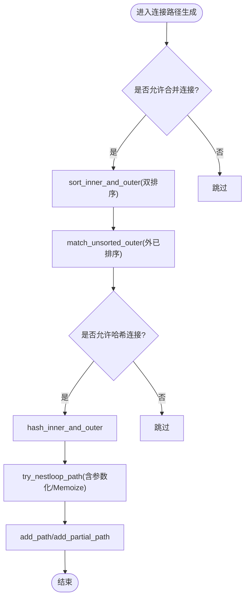
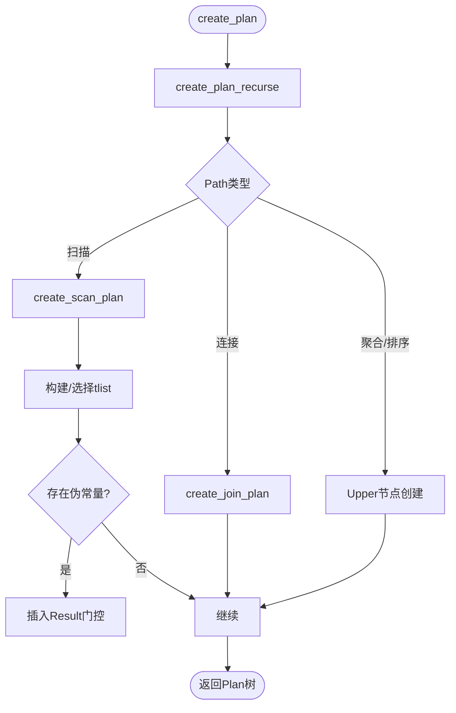
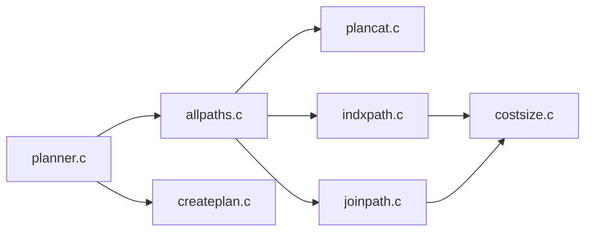

# 计划生成

<cite>
**本文引用的文件**
- [planner.c](file://src/backend/optimizer/plan/planner.c)
- [createplan.c](file://src/backend/optimizer/plan/createplan.c)
- [costsize.c](file://src/backend/optimizer/path/costsize.c)
- [joinpath.c](file://src/backend/optimizer/path/joinpath.c)
- [indxpath.c](file://src/backend/optimizer/path/indxpath.c)
- [allpaths.c](file://src/backend/optimizer/path/allpaths.c)
- [plancat.c](file://src/backend/optimizer/util/plancat.c)
</cite>

## 目录
1. [简介](#简介)
2. [项目结构](#项目结构)
3. [核心组件](#核心组件)
4. [架构总览](#架构总览)
5. [详细组件分析](#详细组件分析)
6. [依赖关系分析](#依赖关系分析)
7. [性能考量](#性能考量)
8. [故障排查指南](#故障排查指南)
9. [结论](#结论)
10. [附录](#附录)

## 简介
本文面向Mini PostgreSQL的计划生成功能，系统性阐述从查询到执行计划的完整过程：关系映射、操作符选择与计划节点创建；连接算法（嵌套循环、哈希连接、合并连接）的决策逻辑；索引使用策略（扫描条件判断、多索引组合、覆盖优化）；以及计划节点的属性设置、统计信息利用与约束传播。文档包含流程图、复杂度分析与最佳实践建议，帮助读者理解并优化查询计划。

## 项目结构
Mini PostgreSQL的优化器位于src/backend/optimizer下，按职责划分为路径探索（path）、计划构建（plan）、预处理（prep）与工具（util）。关键文件如下：
- planner.c：规划入口与顶层流程控制
- allpaths.c：基础关系路径生成与整体搜索组织
- joinpath.c：连接路径生成与连接算法候选
- costsize.c：成本估算与大小估计
- indxpath.c：索引路径生成与匹配
- createplan.c：将最优Path转换为Plan树
- plancat.c：系统目录访问、统计信息与索引元数据收集

图表来源
- [planner.c:215-481](file://src/backend/optimizer/plan/planner.c#L215-L481)
- [allpaths.c:123-200](file://src/backend/optimizer/path/allpaths.c#L123-L200)
- [indxpath.c:234-415](file://src/backend/optimizer/path/indxpath.c#L234-L415)
- [joinpath.c:122-343](file://src/backend/optimizer/path/joinpath.c#L122-L343)
- [costsize.c:220-754](file://src/backend/optimizer/path/costsize.c#L220-L754)
- [createplan.c:297-496](file://src/backend/optimizer/plan/createplan.c#L297-L496)
- [plancat.c:101-453](file://src/backend/optimizer/util/plancat.c#L101-L453)

章节来源
- [planner.c:215-481](file://src/backend/optimizer/plan/planner.c#L215-L481)
- [allpaths.c:123-200](file://src/backend/optimizer/path/allpaths.c#L123-L200)

## 核心组件
- 规划入口与流程控制：planner.c负责初始化全局状态、并行模式判定、子查询规划、最终路径选择与Plan构建。
- 基础关系路径生成：allpaths.c为每个基表生成顺序扫描、采样扫描、索引扫描等候选路径，并计算大小与并行能力。
- 索引路径生成：indxpath.c根据限制条件、连接条件与等价类匹配索引列，生成IndexPath与Bitmap路径。
- 连接路径生成：joinpath.c考虑合并连接、哈希连接、嵌套循环连接，评估唯一性、参数化与半连接/反连接因子。
- 成本估算：costsize.c提供顺序扫描、索引扫描、采样扫描、Gather/GatherMerge等的成本模型，支持缓存效应与相关性插值。
- Plan构建：createplan.c将最优Path递归转换为Plan节点，处理tlist、过滤条件、伪常量门控等。
- 统计与元数据：plancat.c读取表/索引统计、外键、排序族、部分索引谓词等，支撑成本与选择性估计。

章节来源
- [planner.c:215-481](file://src/backend/optimizer/plan/planner.c#L215-L481)
- [allpaths.c:123-200](file://src/backend/optimizer/path/allpaths.c#L123-L200)
- [indxpath.c:234-415](file://src/backend/optimizer/path/indxpath.c#L234-L415)
- [joinpath.c:122-343](file://src/backend/optimizer/path/joinpath.c#L122-L343)
- [costsize.c:220-754](file://src/backend/optimizer/path/costsize.c#L220-L754)
- [createplan.c:297-496](file://src/backend/optimizer/plan/createplan.c#L297-L496)
- [plancat.c:101-453](file://src/backend/optimizer/util/plancat.c#L101-L453)

## 架构总览
下图展示了从查询解析到计划生成的端到端流程，包括路径探索、成本比较与Plan构建的关键阶段。

图表来源
- [planner.c:215-481](file://src/backend/optimizer/plan/planner.c#L215-L481)
- [allpaths.c:123-200](file://src/backend/optimizer/path/allpaths.c#L123-L200)
- [indxpath.c:234-415](file://src/backend/optimizer/path/indxpath.c#L234-L415)
- [joinpath.c:122-343](file://src/backend/optimizer/path/joinpath.c#L122-L343)
- [costsize.c:220-754](file://src/backend/optimizer/path/costsize.c#L220-L754)
- [createplan.c:297-496](file://src/backend/optimizer/plan/createplan.c#L297-L496)

## 详细组件分析

### 关系映射与统计信息利用
- 关系信息获取：plancat.c在get_relation_info中加载表的页数量、元组数、可见度比例、索引列表、统计对象、外键信息等，用于后续成本与选择性估计。
- 索引元数据：对BTree索引提取排序族、反向排序与空值优先标志；对其他索引类型尝试映射btree排序族以支持合并连接。
- 统计信息：通过estimate_rel_size与扩展统计对象提升基数估计准确性，影响路径选择与成本。

图表来源
- [plancat.c:101-453](file://src/backend/optimizer/util/plancat.c#L101-L453)

章节来源
- [plancat.c:101-453](file://src/backend/optimizer/util/plancat.c#L101-L453)

### 索引使用策略
- 索引匹配：indxpath.c将限制条件、连接条件与等价类匹配到索引列，生成IndexPath或Bitmap路径；支持部分索引谓词检查。
- 多索引选择：对OR条件生成BitmapOrPath，并对不同参数化集合选择最佳AND组合；避免重复relids组合。
- 覆盖优化：IndexOnlyScan在可见度映射允许时减少堆访问，降低I/O成本。
- 成本估算：costsize.c的cost_index考虑索引AM提供的成本、选择性、相关性，结合Mackert-Lohman公式估计实际页面访问，区分随机与顺序I/O。

图表来源
- [indxpath.c:234-415](file://src/backend/optimizer/path/indxpath.c#L234-L415)
- [costsize.c:482-754](file://src/backend/optimizer/path/costsize.c#L482-L754)

章节来源
- [indxpath.c:234-415](file://src/backend/optimizer/path/indxpath.c#L234-L415)
- [costsize.c:482-754](file://src/backend/optimizer/path/costsize.c#L482-L754)

### 连接算法选择与决策逻辑
- 候选生成：joinpath.c的add_paths_to_joinrel依次考虑合并连接（需排序）、哈希连接（需可哈希）、嵌套循环（含参数化与Memoize），并根据连接类型（INNER/SEMI/ANTI/FULL）调整策略。
- 唯一性与因子：对SEMI/ANTI或inner_unique情况计算修正因子，影响成本估计。
- 参数化与LATERAL：考虑外层关系提供的参数化路径，限制NestLoop参数传递范围，避免危险PHV。
- 成本比较：通过initial_cost_nestloop、hash_inner_and_outer、sort_inner_and_outer等函数估算成本，并使用add_path_precheck快速剔除劣路径。

图表来源
- [joinpath.c:122-343](file://src/backend/optimizer/path/joinpath.c#L122-L343)
- [joinpath.c:638-800](file://src/backend/optimizer/path/joinpath.c#L638-L800)

章节来源
- [joinpath.c:122-343](file://src/backend/optimizer/path/joinpath.c#L122-L343)
- [joinpath.c:638-800](file://src/backend/optimizer/path/joinpath.c#L638-L800)

### 计划节点创建与属性设置
- Path到Plan转换：createplan.c根据Path类型递归创建对应Plan节点（SeqScan/IndexScan/HashJoin/MergeJoin/NestLoop等），并处理目标列、过滤条件、伪常量门控。
- tlist策略：优先物理tlist以减少投影开销，必要时回退到最小tlist；支持标签与排序分组引用。
- 并行与Gather：顶层可选择插入Gather节点，标记parallelModeNeeded，并在需要时添加Material以支持滚动游标。

图表来源
- [createplan.c:297-496](file://src/backend/optimizer/plan/createplan.c#L297-L496)
- [createplan.c:498-715](file://src/backend/optimizer/plan/createplan.c#L498-L715)

章节来源
- [createplan.c:297-496](file://src/backend/optimizer/plan/createplan.c#L297-L496)
- [createplan.c:498-715](file://src/backend/optimizer/plan/createplan.c#L498-L715)

### 约束传播与统计信息利用
- 约束传播：plancat.c收集外键与约束信息，参与连接选择性估计与路径剪枝；部分索引谓词在索引路径生成时进行匹配。
- 统计信息：plancat.c与costsize.c利用表/索引统计、扩展统计对象与可见度比例，改进rows估计与I/O成本；相关性插值影响索引扫描的堆访问成本。
- 半连接/反连接：joinpath.c针对SEMI/ANTI计算修正因子，影响成本与行数估计。

章节来源
- [plancat.c:101-453](file://src/backend/optimizer/util/plancat.c#L101-L453)
- [costsize.c:220-754](file://src/backend/optimizer/path/costsize.c#L220-L754)
- [joinpath.c:122-343](file://src/backend/optimizer/path/joinpath.c#L122-L343)

## 依赖关系分析
- planner.c依赖allpaths.c生成基础路径，依赖indxpath.c进行索引匹配，依赖joinpath.c生成连接路径，依赖costsize.c进行成本估算，最终由createplan.c生成Plan。
- allpaths.c依赖plancat.c获取统计与索引元数据，驱动路径生成。
- indxpath.c依赖costsize.c进行索引成本估算，依赖plancat.c的索引元数据。
- joinpath.c依赖costsize.c进行连接成本估算，依赖plancat.c的外键与约束信息。

图表来源
- [planner.c:215-481](file://src/backend/optimizer/plan/planner.c#L215-L481)
- [allpaths.c:123-200](file://src/backend/optimizer/path/allpaths.c#L123-L200)
- [indxpath.c:234-415](file://src/backend/optimizer/path/indxpath.c#L234-L415)
- [joinpath.c:122-343](file://src/backend/optimizer/path/joinpath.c#L122-L343)
- [costsize.c:220-754](file://src/backend/optimizer/path/costsize.c#L220-L754)
- [createplan.c:297-496](file://src/backend/optimizer/plan/createplan.c#L297-L496)
- [plancat.c:101-453](file://src/backend/optimizer/util/plancat.c#L101-L453)

章节来源
- [planner.c:215-481](file://src/backend/optimizer/plan/planner.c#L215-L481)
- [allpaths.c:123-200](file://src/backend/optimizer/path/allpaths.c#L123-L200)

## 性能考量
- 成本模型：seq_page_cost、random_page_cost、cpu_tuple_cost等参数直接影响路径选择；effective_cache_size影响缓存命中估计。
- 并行化：Gather/GatherMerge成本考虑worker通信与堆维护；partial路径与并行感知路径提升吞吐。
- 索引相关性：indexCorrelation影响堆访问I/O成本；高相关性可减少随机I/O。
- 连接算法复杂度：
  - 嵌套循环：O(N×M)，适合小内表或带索引的内表；参数化路径可降低内表扫描代价。
  - 哈希连接：平均O(N+M)，内存不足时退化至外部哈希；适合大表等值连接。
  - 合并连接：O(N log N + M log M)，需预排序；适合有序输入或已有排序路径。
- 多索引组合：BitmapAnd/Or路径在复杂条件下可能优于单索引；但需权衡位图构建与堆访问成本。

[本节为通用指导，不直接分析具体文件]

## 故障排查指南
- 未使用索引：检查限制条件是否与索引列匹配；确认部分索引谓词是否满足；查看Bitmap路径是否被选择。
- 连接算法不佳：检查enable_mergejoin/enable_hashjoin/enable_nestloop开关；验证外键与约束信息是否正确；确认统计信息是否更新。
- 成本异常：核对GUC参数（如seq_page_cost、effective_cache_size）；检查索引相关性估计；确认并行参数设置。
- Plan节点问题：确认tlist策略与物理tlist可用性；检查伪常量门控是否插入；验证并行安全标记。

章节来源
- [indxpath.c:234-415](file://src/backend/optimizer/path/indxpath.c#L234-L415)
- [joinpath.c:122-343](file://src/backend/optimizer/path/joinpath.c#L122-L343)
- [costsize.c:220-754](file://src/backend/optimizer/path/costsize.c#L220-L754)
- [createplan.c:498-715](file://src/backend/optimizer/plan/createplan.c#L498-L715)

## 结论
Mini PostgreSQL的计划生成模块通过系统化的路径探索、成本估算与Plan构建，实现了高效的查询优化。索引策略、连接算法选择与统计信息利用共同决定了执行计划的质量。实践中应关注统计信息准确性、索引设计与GUC参数调优，以获得更优的执行性能。

[本节为总结性内容，不直接分析具体文件]

## 附录
- 关键函数路径参考：
  - 规划入口：[planner.c:215-481](file://src/backend/optimizer/plan/planner.c#L215-L481)
  - 基础路径生成：[allpaths.c:123-200](file://src/backend/optimizer/path/allpaths.c#L123-L200)
  - 索引路径生成：[indxpath.c:234-415](file://src/backend/optimizer/path/indxpath.c#L234-L415)
  - 连接路径生成：[joinpath.c:122-343](file://src/backend/optimizer/path/joinpath.c#L122-L343)
  - 成本估算：[costsize.c:220-754](file://src/backend/optimizer/path/costsize.c#L220-L754)
  - Plan构建：[createplan.c:297-496](file://src/backend/optimizer/plan/createplan.c#L297-L496)
  - 统计与元数据：[plancat.c:101-453](file://src/backend/optimizer/util/plancat.c#L101-L453)