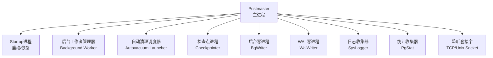
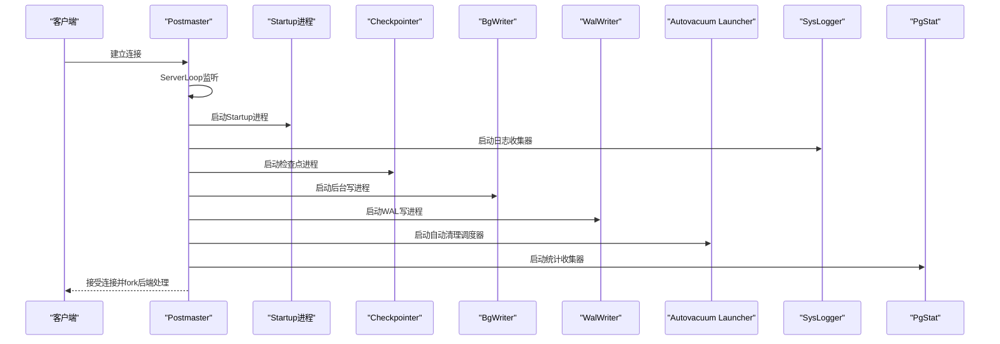
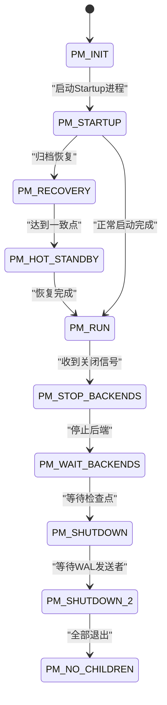
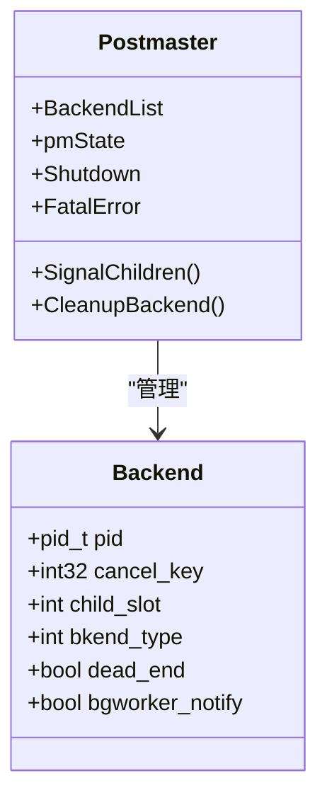
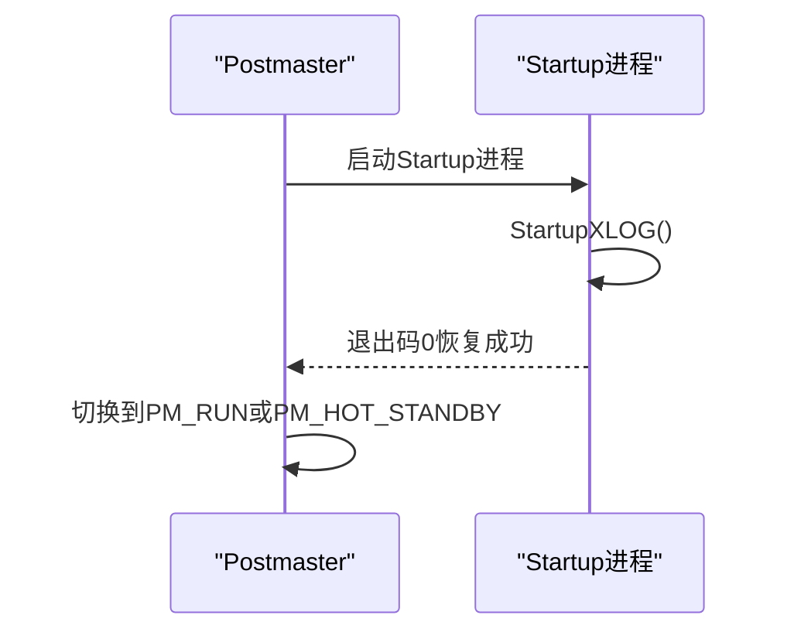
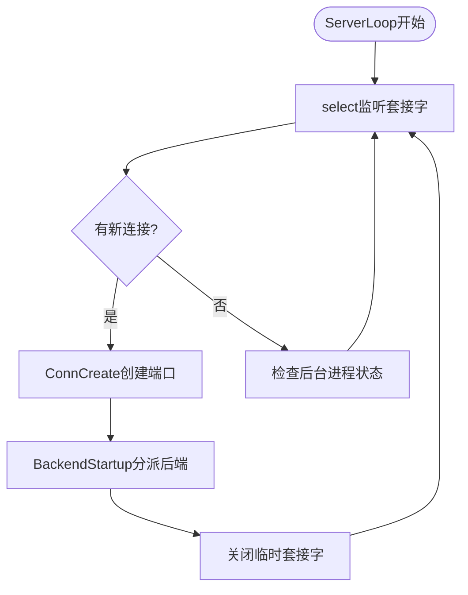
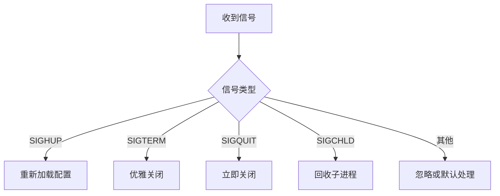
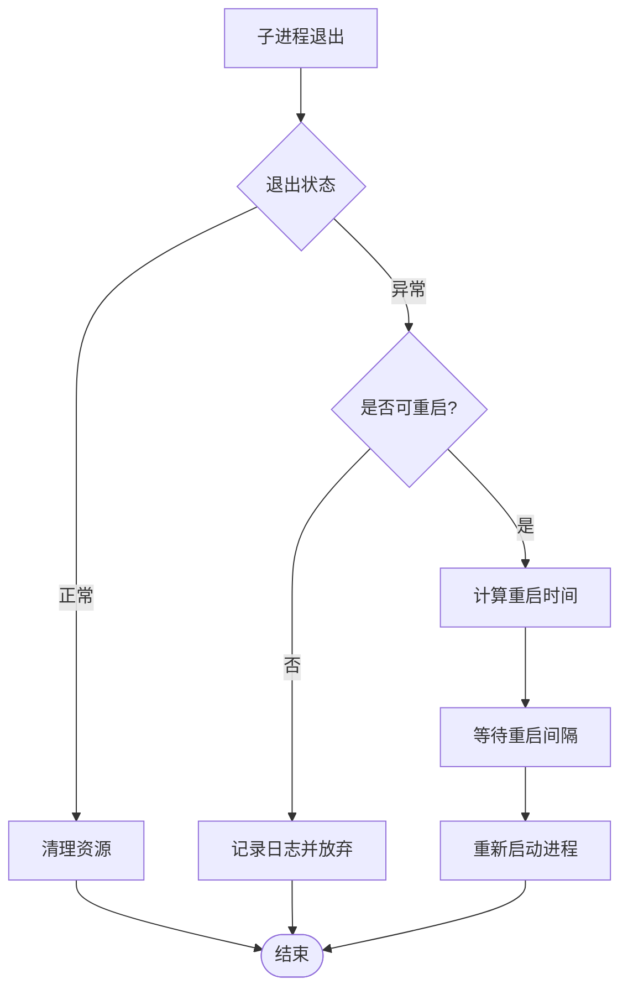
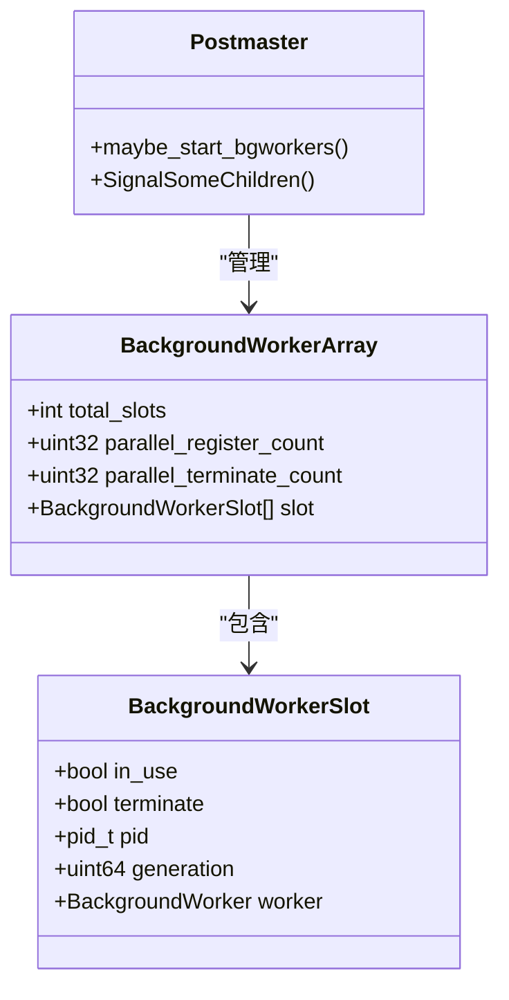
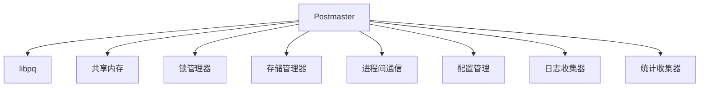

# Postmaster主进程

<cite>
**本文引用的文件**
- [postmaster.c](file://src/backend/postmaster/postmaster.c)
- [startup.c](file://src/backend/postmaster/startup.c)
- [bgworker.c](file://src/backend/postmaster/bgworker.c)
- [autovacuum.c](file://src/backend/postmaster/autovacuum.c)
- [postmaster.h](file://src/include/postmaster/postmaster.h)
- [proc.h](file://src/include/storage/proc.h)
</cite>

## 目录
1. [简介](#简介)
2. [项目结构](#项目结构)
3. [核心组件](#核心组件)
4. [架构总览](#架构总览)
5. [详细组件分析](#详细组件分析)
6. [依赖关系分析](#依赖关系分析)
7. [性能考量](#性能考量)
8. [故障排查指南](#故障排查指南)
9. [结论](#结论)

## 简介
Postmaster是Mini PostgreSQL的“系统协调器”，负责共享内存初始化、后端进程生命周期管理、启动与关闭流程、监听套接字设置、信号处理机制，以及与其他后台工作进程的通信和存储层协调。它通过状态机驱动整个系统的启动、恢复、运行与优雅关闭，并在后端崩溃时进行自动重启与资源清理，确保系统的高可用性与稳定性。

## 项目结构
围绕Postmaster的关键代码主要位于以下位置：
- 主循环与生命周期控制：src/backend/postmaster/postmaster.c
- 启动与恢复子进程：src/backend/postmaster/startup.c
- 可插拔后台工作者（Background Worker）：src/backend/postmaster/bgworker.c
- 自动清理（Autovacuum）调度与执行：src/backend/postmaster/autovacuum.c
- 对外接口与全局变量声明：src/include/postmaster/postmaster.h
- 进程共享数据结构定义：src/include/storage/proc.h

图表来源
- [postmaster.c:800-1030](file://src/backend/postmaster/postmaster.c#L800-L1030)
- [startup.c:199-244](file://src/backend/postmaster/startup.c#L199-L244)
- [bgworker.c:133-200](file://src/backend/postmaster/bgworker.c#L133-L200)
- [autovacuum.c:1-60](file://src/backend/postmaster/autovacuum.c#L1-L60)

章节来源
- [postmaster.c:407-1030](file://src/backend/postmaster/postmaster.c#L407-L1030)
- [startup.c:199-244](file://src/backend/postmaster/startup.c#L199-L244)
- [bgworker.c:133-200](file://src/backend/postmaster/bgworker.c#L133-L200)
- [autovacuum.c:1-60](file://src/backend/postmaster/autovacuum.c#L1-L60)

## 核心组件
- 主进程入口与初始化：PostmasterMain负责参数解析、配置加载、数据目录校验、共享内存与信号量初始化、监听套接字创建、子系统初始化（syslogger、pgstat、autovacuum），并启动Startup进程进入PM_STARTUP状态。
- 服务器主循环：ServerLoop基于select监听连接请求，分派后端进程；周期性维护后台进程（checkpointer、bgwriter、walwriter、autovacuum launcher、pgstat、background workers）。
- 启动/恢复子进程：StartupProcessMain负责读取控制文件、执行WAL重放或归档恢复，完成后退出并将状态返回给Postmaster。
- 后台工作者管理：BackgroundWorkerShmemInit在共享内存中建立槽位数组，支持无锁协议协调Postmaster与后端对槽位的访问，实现动态注册与生命周期管理。
- 自动清理：Autovacuum由Launcher调度，Worker实际执行清理任务；Launcher通过共享内存与信号通知Postmaster启动Worker。

章节来源
- [postmaster.c:407-1030](file://src/backend/postmaster/postmaster.c#L407-L1030)
- [postmaster.c:1245-1464](file://src/backend/postmaster/postmaster.c#L1245-L1464)
- [startup.c:199-244](file://src/backend/postmaster/startup.c#L199-L244)
- [bgworker.c:133-200](file://src/backend/postmaster/bgworker.c#L133-L200)
- [autovacuum.c:1-60](file://src/backend/postmaster/autovacuum.c#L1-L60)

## 架构总览
Postmaster作为协调器，采用状态机驱动系统行为，并与多个后台进程协作完成数据库服务。其关键职责包括：
- 共享内存初始化与子系统准备
- 监听套接字绑定与连接分发
- 启动/恢复流程协调
- 后台进程监控与自动重启
- 信号处理与优雅关闭

图表来源
- [postmaster.c:800-1030](file://src/backend/postmaster/postmaster.c#L800-L1030)
- [postmaster.c:1245-1464](file://src/backend/postmaster/postmaster.c#L1245-L1464)
- [startup.c:199-244](file://src/backend/postmaster/startup.c#L199-L244)

## 详细组件分析

### Postmaster主进程生命周期与状态机
Postmaster使用内部状态机控制启动、恢复、运行与关闭流程。关键状态包括：
- PM_INIT：Postmaster自身启动阶段
- PM_STARTUP：等待Startup进程完成初始化
- PM_RECOVERY：归档恢复模式
- PM_HOT_STANDBY：热备只读查询模式
- PM_RUN：正常运行模式
- PM_STOP_BACKENDS / PM_WAIT_BACKENDS / PM_SHUTDOWN / PM_SHUTDOWN_2：关闭流程中的中间状态
- PM_WAIT_DEAD_END：等待拒绝连接的“dead_end”子进程退出
- PM_NO_CHILDREN：所有重要子进程已退出

图表来源
- [postmaster.c:280-320](file://src/backend/postmaster/postmaster.c#L280-L320)
- [postmaster.c:1005-1030](file://src/backend/postmaster/postmaster.c#L1005-L1030)

章节来源
- [postmaster.c:280-320](file://src/backend/postmaster/postmaster.c#L280-L320)
- [postmaster.c:1005-1030](file://src/backend/postmaster/postmaster.c#L1005-L1030)

### 共享内存初始化与后端进程管理
- 共享内存与信号量：Postmaster在启动早期调用reset_shared完成共享内存与信号量池初始化，为后端进程提供进程表（PGPROC）、锁管理器、事务ID生成等基础设施。
- 后端进程列表：Postmaster维护BackendList跟踪活跃的后端与特殊子进程，用于计数、信号广播与清理。
- 进程类型标记：BACKEND_TYPE_NORMAL、BACKEND_TYPE_AUTOVAC、BACKEND_TYPE_BGWORKER等区分不同子进程角色，便于差异化处理。

图表来源
- [postmaster.c:126-174](file://src/backend/postmaster/postmaster.c#L126-L174)
- [postmaster.c:196-237](file://src/backend/postmaster/postmaster.c#L196-L237)

章节来源
- [postmaster.c:126-174](file://src/backend/postmaster/postmaster.c#L126-L174)
- [postmaster.c:196-237](file://src/backend/postmaster/postmaster.c#L196-L237)

### 启动与恢复流程
- Startup进程：StartupProcessMain负责WAL重放与恢复，接收SIGHUP重载配置、SIGTERM安全退出、SIGUSR2触发提升。完成后以退出码0通知Postmaster恢复成功。
- Postmaster协调：Postmaster在PM_STARTUP等待Startup进程，根据退出码与信号切换至PM_RECOVERY、PM_HOT_STANDBY或PM_RUN。

图表来源
- [startup.c:199-244](file://src/backend/postmaster/startup.c#L199-L244)
- [postmaster.c:1005-1030](file://src/backend/postmaster/postmaster.c#L1005-L1030)

章节来源
- [startup.c:199-244](file://src/backend/postmaster/startup.c#L199-L244)
- [postmaster.c:1005-1030](file://src/backend/postmaster/postmaster.c#L1005-L1030)

### 监听套接字与连接分发
- 监听套接字：Postmaster根据listen_addresses配置创建TCP/Unix监听套接字，记录到ListenSocket数组，并在关闭时清理。
- 连接处理：ServerLoop通过select监听新连接，创建Port对象并调用BackendStartup分发给后端进程处理认证与会话。

图表来源
- [postmaster.c:856-987](file://src/backend/postmaster/postmaster.c#L856-L987)
- [postmaster.c:1245-1464](file://src/backend/postmaster/postmaster.c#L1245-L1464)

章节来源
- [postmaster.c:856-987](file://src/backend/postmaster/postmaster.c#L856-L987)
- [postmaster.c:1245-1464](file://src/backend/postmaster/postmaster.c#L1245-L1464)

### 信号处理机制
Postmaster设置多种信号处理器以响应外部事件：
- SIGHUP：重新加载配置文件并通知子进程
- SIGINT/SIGTERM/SIGQUIT：触发不同级别的关闭流程
- SIGUSR1：来自子进程的消息（如启动完成、崩溃报告）
- SIGCHLD：回收子进程并处理崩溃重启逻辑
- SIGPIPE/SIGURG/SIGTTIN/SIGTTOU/SIGXFSZ：忽略或默认处理以避免阻塞

图表来源
- [postmaster.c:477-520](file://src/backend/postmaster/postmaster.c#L477-L520)

章节来源
- [postmaster.c:477-520](file://src/backend/postmaster/postmaster.c#L477-L520)

### 错误恢复与自动重启
- 后端崩溃检测：SIGCHLD处理器识别子进程异常退出，记录日志并决定是否重启。
- 自动重启策略：对于可重启的后台工作者，Postmaster根据配置的restart_time延迟后尝试重启；对于不可重启或终止标志置位的进程，则不再尝试。
- 强制终止：在立即关闭或崩溃恢复期间，若子进程长时间未退出，Postmaster会发送SIGKILL强制终止。

图表来源
- [postmaster.c:1138-1238](file://src/backend/postmaster/postmaster.c#L1138-L1238)
- [bgworker.c:133-200](file://src/backend/postmaster/bgworker.c#L133-L200)

章节来源
- [postmaster.c:1138-1238](file://src/backend/postmaster/postmaster.c#L1138-L1238)
- [bgworker.c:133-200](file://src/backend/postmaster/bgworker.c#L133-L200)

### 与后台工作进程的交互
- Background Worker：Postmaster通过BackgroundWorkerArray在共享内存中管理工作者槽位，支持无锁协议协调Postmaster与后端对槽位的访问。
- Autovacuum：Launcher通过共享内存与信号通知Postmaster启动Worker；Worker完成后发送SIGUSR2唤醒Launcher继续调度。
- 其他后台进程：Checkpointer、BgWriter、WalWriter、PgStat等在ServerLoop中被监控与自动重启。

图表来源
- [bgworker.c:74-109](file://src/backend/postmaster/bgworker.c#L74-L109)
- [bgworker.c:133-200](file://src/backend/postmaster/bgworker.c#L133-L200)

章节来源
- [bgworker.c:74-109](file://src/backend/postmaster/bgworker.c#L74-L109)
- [bgworker.c:133-200](file://src/backend/postmaster/bgworker.c#L133-L200)

### 与存储层的协调
- 共享内存：Postmaster不直接操作共享内存，避免与后端竞争导致死锁或崩溃传播。
- 进程表（PGPROC）：每个后端在共享内存中有PGPROC结构，Postmaster通过进程ID与槽位间接管理。
- 检查点与WAL：Postmaster启动Checkpointer与WalWriter，确保数据持久化与一致性。

章节来源
- [postmaster.c:15-23](file://src/backend/postmaster/postmaster.c#L15-L23)
- [proc.h:102-200](file://src/include/storage/proc.h#L102-L200)

## 依赖关系分析
Postmaster依赖多个子系统与模块，形成松耦合但高内聚的架构：
- 输入输出：libpq、socket网络栈
- 存储层：storage/shm、storage/lmgr、storage/smgr
- 进程间通信：storage/ipc、storage/pmsignal、storage/procsignal
- 配置管理：utils/guc、common/config_info
- 日志与统计：postmaster/syslogger、pgstat

图表来源
- [postmaster.c:88-123](file://src/backend/postmaster/postmaster.c#L88-L123)
- [bgworker.c:13-35](file://src/backend/postmaster/bgworker.c#L13-L35)

章节来源
- [postmaster.c:88-123](file://src/backend/postmaster/postmaster.c#L88-L123)
- [bgworker.c:13-35](file://src/backend/postmaster/bgworker.c#L13-L35)

## 性能考量
- 非阻塞I/O：Postmaster使用select监听连接，避免阻塞于单个客户端。
- 最小化共享内存访问：Postmaster尽量避免直接操作共享内存，降低与后端竞争的风险。
- 后台进程监控：ServerLoop定期检查后台进程状态，及时重启失败进程，减少服务中断时间。
- 信号处理优化：Postmaster使用pqsignal_pm设置信号处理器，避免SA_RESTART导致的select阻塞问题。

[本节为通用指导，无需具体文件引用]

## 故障排查指南
- 启动失败：检查数据目录权限、pg_control文件完整性、监听端口占用情况。
- 后端崩溃：查看日志中关于子进程退出的记录，确认是否触发自动重启。
- 无法连接：验证listen_addresses配置与防火墙规则，检查Unix套接字文件是否存在。
- 后台进程缺失：确认Postmaster是否在PM_RUN状态，检查相关GUC参数是否启用。

章节来源
- [postmaster.c:1118-1136](file://src/backend/postmaster/postmaster.c#L1118-L1136)
- [postmaster.c:1419-1429](file://src/backend/postmaster/postmaster.c#L1419-L1429)

## 结论
Postmaster作为Mini PostgreSQL的核心协调器，通过状态机驱动系统生命周期，管理共享内存、后端进程、后台工作者与存储层协调，具备完善的错误恢复与自动重启机制。其设计遵循最小共享内存访问原则，确保高可用性与稳定性。开发者应重点关注状态转换、信号处理、后台进程管理与共享内存协议，以正确扩展与维护系统功能。

[本节为总结性内容，无需具体文件引用]