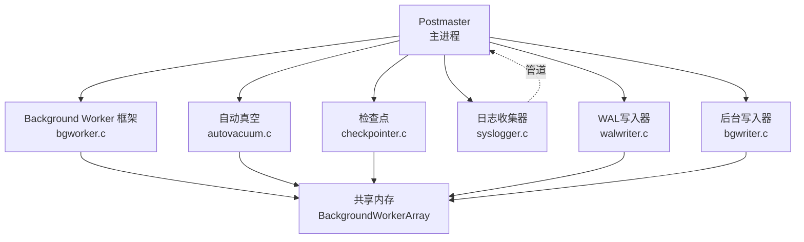
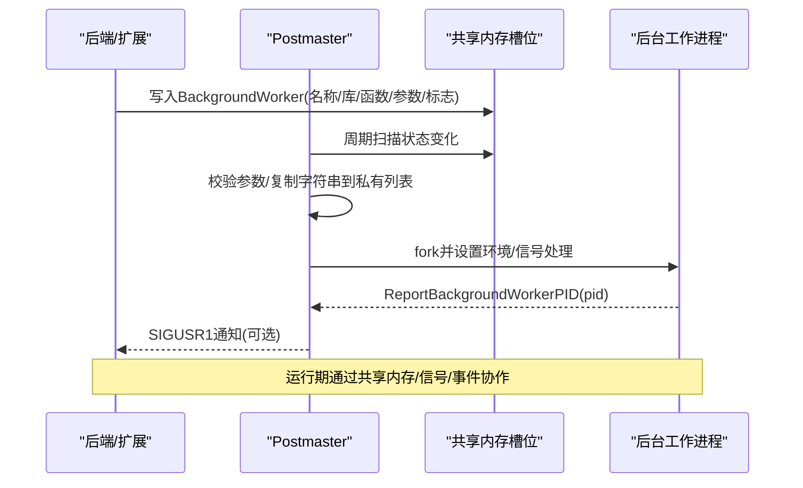
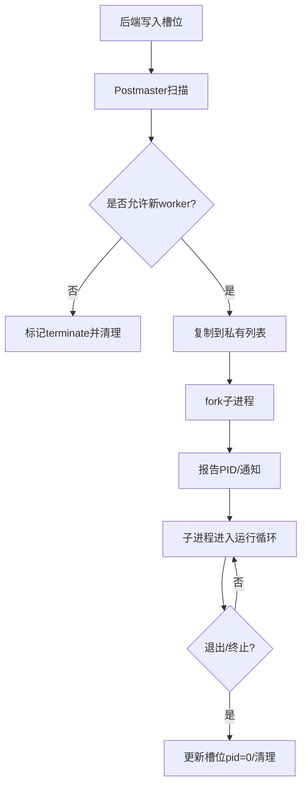
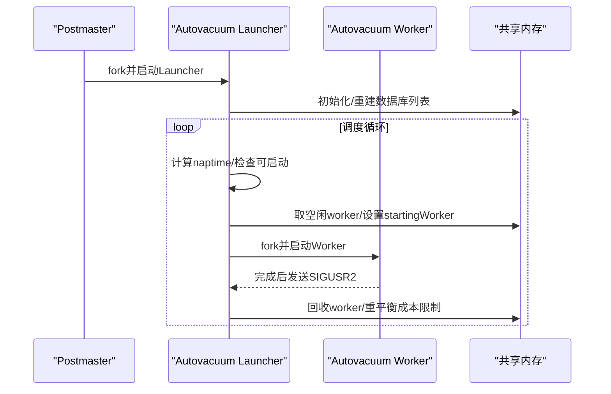
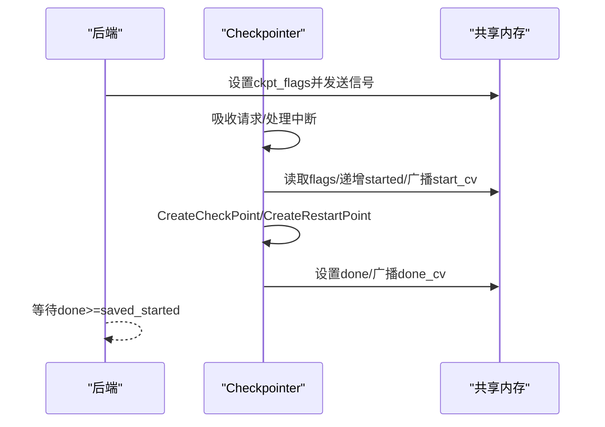
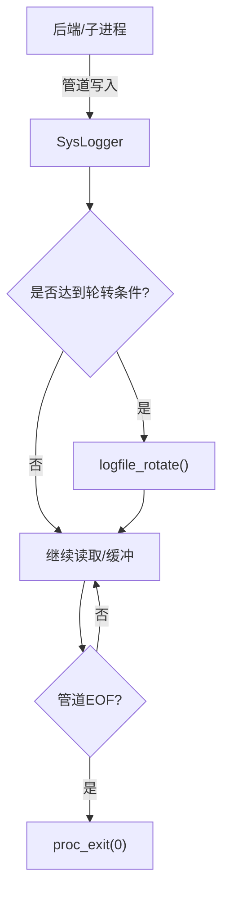
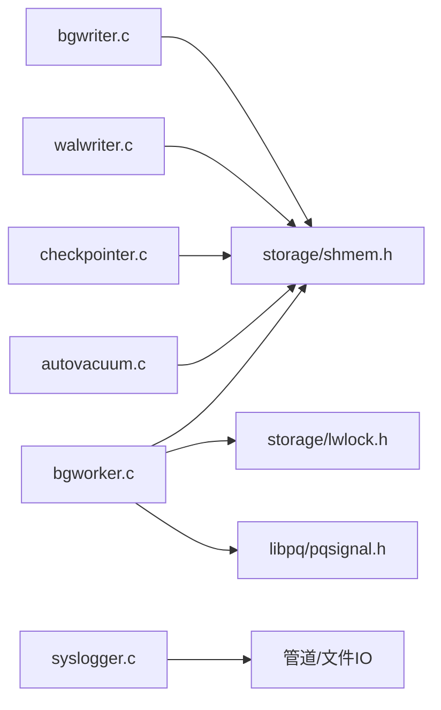

# 后台工作进程

<cite>
**本文引用的文件**
- [bgworker.c](file://src/backend/postmaster/bgworker.c)
- [bgworker_internals.h](file://src/include/postmaster/bgworker_internals.h)
- [autovacuum.c](file://src/backend/postmaster/autovacuum.c)
- [checkpointer.c](file://src/backend/postmaster/checkpointer.c)
- [syslogger.c](file://src/backend/postmaster/syslogger.c)
- [walwriter.c](file://src/backend/postmaster/walwriter.c)
- [bgwriter.c](file://src/backend/postmaster/bgwriter.c)
</cite>

## 目录
1. [简介](#简介)
2. [项目结构](#项目结构)
3. [核心组件](#核心组件)
4. [架构总览](#架构总览)
5. [详细组件分析](#详细组件分析)
6. [依赖关系分析](#依赖关系分析)
7. [性能考量](#性能考量)
8. [故障排查指南](#故障排查指南)
9. [结论](#结论)
10. [附录：开发接口与扩展指南](#附录：开发接口与扩展指南)

## 简介
本文件面向Mini PostgreSQL的后台工作进程（Background Workers）子系统，系统性阐述其设计架构、注册机制（静态注册与动态加载）、生命周期管理（启动、运行、停止、清理）、内置后台进程实现（自动真空、检查点、日志记录器、WAL写入器、后台写入器），以及主进程与后台进程之间的通信机制（共享内存、事件通知、参数传递）。文末提供开发者扩展指南，帮助实现自定义后台工作进程。

## 项目结构
后台工作进程相关代码主要位于后端后管进程目录及公共头文件中：
- 通用框架与注册表：src/backend/postmaster/bgworker.c、src/include/postmaster/bgworker_internals.h
- 内置后台进程：
  - 自动真空：src/backend/postmaster/autovacuum.c
  - 检查点：src/backend/postmaster/checkpointer.c
  - 日志收集器：src/backend/postmaster/syslogger.c
  - WAL写入器：src/backend/postmaster/walwriter.c
  - 后台写入器：src/backend/postmaster/bgwriter.c

图表来源
- [bgworker.c:130-202](file://src/backend/postmaster/bgworker.c#L130-L202)
- [autovacuum.c:356-384](file://src/backend/postmaster/autovacuum.c#L356-L384)
- [checkpointer.c:176-206](file://src/backend/postmaster/checkpointer.c#L176-L206)
- [syslogger.c:466-607](file://src/backend/postmaster/syslogger.c#L466-L607)
- [walwriter.c:84-111](file://src/backend/postmaster/walwriter.c#L84-L111)
- [bgwriter.c:87-116](file://src/backend/postmaster/bgwriter.c#L87-L116)

章节来源
- [bgworker.c:130-202](file://src/backend/postmaster/bgworker.c#L130-L202)
- [bgworker_internals.h:19-58](file://src/include/postmaster/bgworker_internals.h#L19-L58)

## 核心组件
- 后台工作进程框架（bgworker.c）
  - 共享内存槽位数组 BackgroundWorkerArray，用于在postmaster与普通后端之间无锁协调访问。
  - 注册表 RegisteredBgWorker 链表，维护已注册的后台工作进程元数据。
  - 生命周期函数：StartBackgroundWorker、ReportBackgroundWorkerPID、ReportBackgroundWorkerExit、ForgetBackgroundWorker、BackgroundWorkerStateChange、ResetBackgroundWorkerCrashTimes 等。
- 内置后台进程
  - 自动真空（autovacuum.c）：包含launcher与worker两个角色，通过共享内存调度并启动实际vacuum worker。
  - 检查点（checkpointer.c）：集中执行checkpoint/restartpoint，并通过共享内存标志与条件变量与后端交互。
  - 日志收集器（syslogger.c）：通过管道接收所有stderr输出，按时间/大小轮转写入日志文件。
  - WAL写入器（walwriter.c）：周期性将WAL页刷盘，保障异步提交事务落盘时限。
  - 后台写入器（bgwriter.c）：定期写出脏页，减轻后端写放大。

章节来源
- [bgworker.c:74-108](file://src/backend/postmaster/bgworker.c#L74-L108)
- [bgworker.c:417-498](file://src/backend/postmaster/bgworker.c#L417-L498)
- [autovacuum.c:218-288](file://src/backend/postmaster/autovacuum.c#L218-L288)
- [checkpointer.c:108-137](file://src/backend/postmaster/checkpointer.c#L108-L137)
- [syslogger.c:103-113](file://src/backend/postmaster/syslogger.c#L103-L113)
- [walwriter.c:67-79](file://src/backend/postmaster/walwriter.c#L67-L79)
- [bgwriter.c:61-84](file://src/backend/postmaster/bgwriter.c#L61-L84)

## 架构总览
后台工作进程由postmaster统一编排，分为两类：
- 静态注册：系统内置的后台进程（如checkpointer、bgwriter、walwriter、syslogger、autovacuum launcher）在启动阶段由postmaster直接fork并进入各自Main循环。
- 动态注册：普通后端或扩展通过API向共享内存写入BackgroundWorker描述，postmaster检测到新槽位后fork子进程并调用对应入口函数。

图表来源
- [bgworker.c:233-403](file://src/backend/postmaster/bgworker.c#L233-L403)
- [bgworker.c:452-498](file://src/backend/postmaster/bgworker.c#L452-L498)

章节来源
- [bgworker.c:233-403](file://src/backend/postmaster/bgworker.c#L233-L403)
- [bgworker.c:452-498](file://src/backend/postmaster/bgworker.c#L452-L498)

## 详细组件分析

### 后台工作进程框架（bgworker.c）
- 共享内存布局
  - BackgroundWorkerArray：包含total_slots、parallel_register_count、parallel_terminate_count和可变长slot数组。
  - BackgroundWorkerSlot：in_use、terminate、pid、generation、worker描述。
- 注册与发现
  - 后端写入槽位并置in_use；postmaster在BackgroundWorkerStateChange中检测新槽位，复制到RegisteredBgWorker链表，并准备启动。
- 生命周期
  - StartBackgroundWorker：设置IsBackgroundWorker、MyBackendType、信号处理、异常捕获、必要时分离共享内存。
  - ReportBackgroundWorkerPID/ReportBackgroundWorkerExit：更新槽位pid并通知等待者。
  - ForgetBackgroundWorker：释放槽位，更新并行计数，从链表删除。
  - ResetBackgroundWorkerCrashTimes：崩溃恢复后重置重启计时或忽略永不重启的worker。
- 安全与并发
  - 使用内存屏障与无锁协议保证postmaster与后端对共享内存的安全访问。
  - 对字符串采用安全拷贝避免共享内存损坏导致崩溃。

图表来源
- [bgworker.c:233-403](file://src/backend/postmaster/bgworker.c#L233-L403)
- [bgworker.c:417-498](file://src/backend/postmaster/bgworker.c#L417-L498)

章节来源
- [bgworker.c:74-108](file://src/backend/postmaster/bgworker.c#L74-L108)
- [bgworker.c:233-403](file://src/backend/postmaster/bgworker.c#L233-L403)
- [bgworker.c:417-498](file://src/backend/postmaster/bgworker.c#L417-L498)
- [bgworker.c:570-615](file://src/backend/postmaster/bgworker.c#L570-L615)

### 自动真空（autovacuum.c）
- 双角色模型
  - Launcher：常驻进程，负责调度数据库列表、决定何时启动worker，维护共享内存中的工作项队列与worker信息。
  - Worker：连接具体数据库，选择需要vacuum/analyze的关系并执行。
- 共享内存与同步
  - AutoVacuumShmemStruct：保存信号、launcher pid、空闲/运行worker链表、当前启动中的worker与工作项数组。
  - 通过LWLock保护关键区域，信号量与WaitLatch协调唤醒。
- 启动流程
  - StartAutoVacLauncher：fork子进程，初始化环境后进入AutoVacLauncherMain。
- 运行循环
  - 计算休眠时间、处理配置重载、检查可启动条件、启动worker、处理SIGUSR2完成信号。

图表来源
- [autovacuum.c:356-384](file://src/backend/postmaster/autovacuum.c#L356-L384)
- [autovacuum.c:389-755](file://src/backend/postmaster/autovacuum.c#L389-L755)
- [autovacuum.c:218-288](file://src/backend/postmaster/autovacuum.c#L218-L288)

章节来源
- [autovacuum.c:218-288](file://src/backend/postmaster/autovacuum.c#L218-L288)
- [autovacuum.c:356-384](file://src/backend/postmaster/autovacuum.c#L356-L384)
- [autovacuum.c:389-755](file://src/backend/postmaster/autovacuum.c#L389-L755)

### 检查点（checkpointer.c）
- 职责
  - 集中执行checkpoint/restartpoint，控制写速率，统计指标上报。
- 共享内存
  - CheckpointerShmemStruct：ckpt_started/done/failed、ckpt_flags、请求队列、条件变量。
- 信号与事件
  - 监听SIGHUP/SIGINT/SIGTERM/SIGUSR2，通过Latch唤醒主循环。
- 主循环
  - 吸收fsync请求、处理中断、判断是否需要checkpoint（超时或外部请求）、执行checkpoint并通知等待后端。

图表来源
- [checkpointer.c:108-137](file://src/backend/postmaster/checkpointer.c#L108-L137)
- [checkpointer.c:176-206](file://src/backend/postmaster/checkpointer.c#L176-L206)
- [checkpointer.c:338-531](file://src/backend/postmaster/checkpointer.c#L338-L531)

章节来源
- [checkpointer.c:108-137](file://src/backend/postmaster/checkpointer.c#L108-L137)
- [checkpointer.c:176-206](file://src/backend/postmaster/checkpointer.c#L176-L206)
- [checkpointer.c:338-531](file://src/backend/postmaster/checkpointer.c#L338-L531)

### 日志收集器（syslogger.c）
- 职责
  - 通过管道接收所有stderr输出，按时间/大小轮转写入日志文件，支持CSVLOG。
- 通信机制
  - 管道协议：带头部（长度、源进程pid、是否最后分片）的分块消息，避免消息交错与截断。
- 启动与运行
  - SysLogger_Start：创建管道、打开初始日志文件、fork子进程、重定向stdout/stderr。
  - SysLoggerMain：主循环读取管道、处理配置重载、触发轮转、优雅关闭。

图表来源
- [syslogger.c:466-607](file://src/backend/postmaster/syslogger.c#L466-L607)
- [syslogger.c:638-781](file://src/backend/postmaster/syslogger.c#L638-L781)

章节来源
- [syslogger.c:66-89](file://src/backend/postmaster/syslogger.c#L66-L89)
- [syslogger.c:138-218](file://src/backend/postmaster/syslogger.c#L138-L218)
- [syslogger.c:466-607](file://src/backend/postmaster/syslogger.c#L466-L607)
- [syslogger.c:638-781](file://src/backend/postmaster/syslogger.c#L638-L781)

### WAL写入器（walwriter.c）
- 职责
  - 周期性将WAL页刷盘，确保异步提交事务在限定时间内落盘。
- 运行模式
  - 主循环根据WalWriterDelay休眠，处理中断，必要时hibernate以降低CPU占用。
- 错误恢复
  - 使用sigsetjmp包裹主循环，异常时释放锁、关闭文件、重试前短暂休眠。

章节来源
- [walwriter.c:67-79](file://src/backend/postmaster/walwriter.c#L67-L79)
- [walwriter.c:84-111](file://src/backend/postmaster/walwriter.c#L84-L111)
- [walwriter.c:147-200](file://src/backend/postmaster/walwriter.c#L147-L200)

### 后台写入器（bgwriter.c）
- 职责
  - 定期写出脏页，减少后端写放大；自9.2起不再负责checkpoint。
- 运行模式
  - 主循环根据BgWriterDelay休眠，处理中断，必要时hibernate。
- 错误恢复
  - sigsetjmp包裹主循环，异常时释放资源并重写回上下文。

章节来源
- [bgwriter.c:61-84](file://src/backend/postmaster/bgwriter.c#L61-L84)
- [bgwriter.c:87-116](file://src/backend/postmaster/bgwriter.c#L87-L116)
- [bgwriter.c:155-200](file://src/backend/postmaster/bgwriter.c#L155-L200)

## 依赖关系分析
- 耦合性
  - bgworker.c与postmaster强耦合，负责生命周期与共享内存槽位管理。
  - 各内置后台进程通过共享内存与信号与postmaster及其他后端交互，解耦业务逻辑。
- 外部依赖
  - 共享内存（storage/shmem.h）、进程信号（libpq/pqsignal.h）、锁（storage/lwlock.h）、条件变量（storage/condition_variable.h）。
- 潜在循环依赖
  - 通过模块化头文件隔离，未见直接循环引用；共享内存结构体作为契约边界。

图表来源
- [bgworker.c:13-35](file://src/backend/postmaster/bgworker.c#L13-L35)
- [autovacuum.c:62-108](file://src/backend/postmaster/autovacuum.c#L62-L108)
- [checkpointer.c:37-61](file://src/backend/postmaster/checkpointer.c#L37-L61)
- [syslogger.c:24-53](file://src/backend/postmaster/syslogger.c#L24-L53)
- [walwriter.c:42-64](file://src/backend/postmaster/walwriter.c#L42-L64)
- [bgwriter.c:35-59](file://src/backend/postmaster/bgwriter.c#L35-L59)

章节来源
- [bgworker.c:13-35](file://src/backend/postmaster/bgworker.c#L13-L35)
- [autovacuum.c:62-108](file://src/backend/postmaster/autovacuum.c#L62-L108)
- [checkpointer.c:37-61](file://src/backend/postmaster/checkpointer.c#L37-L61)
- [syslogger.c:24-53](file://src/backend/postmaster/syslogger.c#L24-L53)
- [walwriter.c:42-64](file://src/backend/postmaster/walwriter.c#L42-L64)
- [bgwriter.c:35-59](file://src/backend/postmaster/bgwriter.c#L35-L59)

## 性能考量
- 共享内存访问
  - 使用无锁协议与内存屏障避免postmaster阻塞；合理设置max_worker_processes以控制槽位规模。
- 信号与唤醒
  - 使用Latch与条件变量减少忙轮询；检查点与日志轮转按需唤醒。
- I/O吞吐
  - checkpointer/bgwiter/walwriter均具备hibernate机制降低空闲开销；日志收集器按分片写入避免大I/O抖动。
- 可扩展性
  - 动态注册允许按需扩展后台任务；并行worker计数通过计数器限流防止过载。

[本节为通用指导，不直接分析具体文件]

## 故障排查指南
- 后台工作进程未启动
  - 检查BackgroundWorkerStateChange是否被调用；确认allow_new_workers标志；查看槽位in_use与terminate状态。
- 后台工作进程频繁崩溃
  - 查看ResetBackgroundWorkerCrashTimes后的重启行为；确认bgw_restart_time与BGWORKER_CLASS_PARALLEL约束。
- 检查点延迟过高
  - 观察ckpt_flags与ckpt_started/done计数；调整CheckpointTimeout与CompletionTarget；关注CHECKPOINT_CAUSE_XLOG告警。
- 日志未轮转
  - 检查Log_RotationAge/Log_RotationSize配置；确认rotation_requested标志与logfile_rotate调用路径。
- 自动真空未执行
  - 验证DatabaseList是否为空；检查av_freeWorkers与startingWorker状态；确认SIGUSR2处理逻辑。

章节来源
- [bgworker.c:233-403](file://src/backend/postmaster/bgworker.c#L233-L403)
- [bgworker.c:570-615](file://src/backend/postmaster/bgworker.c#L570-L615)
- [checkpointer.c:338-531](file://src/backend/postmaster/checkpointer.c#L338-L531)
- [syslogger.c:273-335](file://src/backend/postmaster/syslogger.c#L273-L335)
- [autovacuum.c:658-755](file://src/backend/postmaster/autovacuum.c#L658-L755)

## 结论
Mini PostgreSQL的后台工作进程体系以postmaster为核心，通过共享内存与信号机制实现高内聚、低耦合的后台任务编排。静态注册适合系统级常驻任务（检查点、日志、WAL/缓冲写入），动态注册支持扩展与按需任务。完善的生命周期管理与错误恢复机制保障了系统的健壮性与可维护性。

[本节为总结，不直接分析具体文件]

## 附录：开发接口与扩展指南
- 静态注册（内置进程）
  - 在postmaster启动流程中fork并进入各自Main函数（如CheckpointerMain、BackgroundWriterMain、WalWriterMain、SysLoggerMain、StartAutoVacLauncher）。
  - 适用场景：系统级常驻任务，需长期运行且与内核紧密集成。
- 动态注册（扩展/后端）
  - 通过共享内存写入BackgroundWorker描述（名称、类型、库名、函数名、参数、标志、通知PID等）。
  - Postmaster检测到新槽位后fork子进程并调用入口函数；子进程通过ReportBackgroundWorkerPID反馈PID，并可接收SIGUSR1通知。
  - 生命周期回调：StartBackgroundWorker负责初始化环境与信号处理；退出时通过ReportBackgroundWorkerExit清理。
- 通信机制
  - 共享内存：槽位数组、各进程自有shmem结构（如CheckpointerShmemStruct、AutoVacuumShmemStruct）。
  - 事件通知：信号（SIGUSR1/SIGUSR2）、Latch、条件变量。
  - 参数传递：BackgroundWorker.bgw_main_arg与bgw_extra字段。
- 最佳实践
  - 正确设置bgw_flags（如BGWORKER_SHMEM_ACCESS、BGWORKER_BACKEND_DATABASE_CONNECTION）。
  - 合理配置bgw_start_time与bgw_restart_time；并行worker不得配置重启。
  - 使用安全字符串拷贝与内存屏障，避免共享内存损坏导致崩溃。
  - 在异常路径中释放锁、关闭文件、重置内存上下文，确保可恢复。

章节来源
- [bgworker.c:130-202](file://src/backend/postmaster/bgworker.c#L130-L202)
- [bgworker.c:704-800](file://src/backend/postmaster/bgworker.c#L704-L800)
- [bgworker_internals.h:19-58](file://src/include/postmaster/bgworker_internals.h#L19-L58)
- [autovacuum.c:356-384](file://src/backend/postmaster/autovacuum.c#L356-L384)
- [checkpointer.c:176-206](file://src/backend/postmaster/checkpointer.c#L176-L206)
- [syslogger.c:466-607](file://src/backend/postmaster/syslogger.c#L466-L607)
- [walwriter.c:84-111](file://src/backend/postmaster/walwriter.c#L84-L111)
- [bgwriter.c:87-116](file://src/backend/postmaster/bgwriter.c#L87-L116)