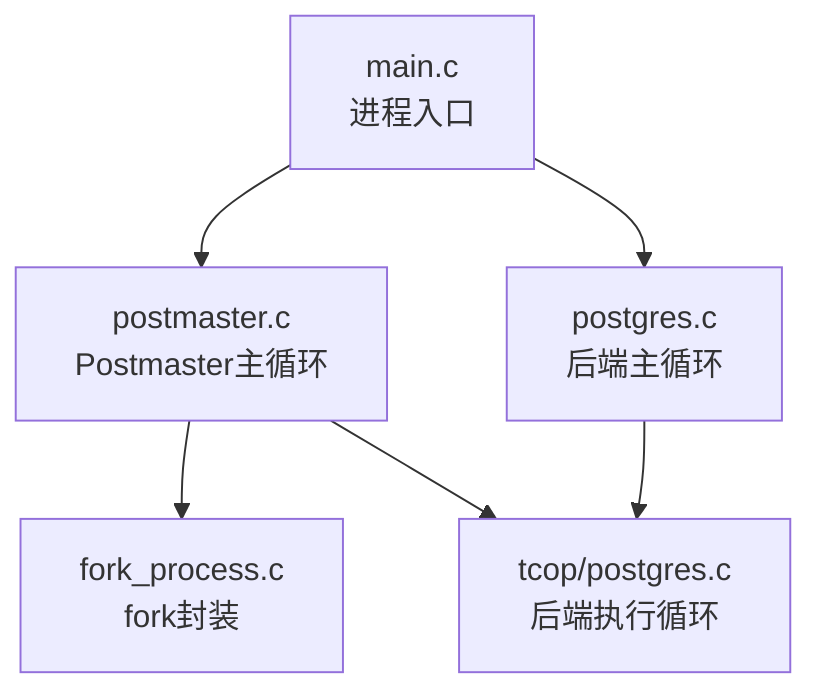
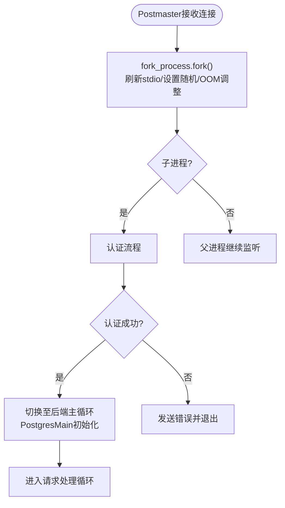
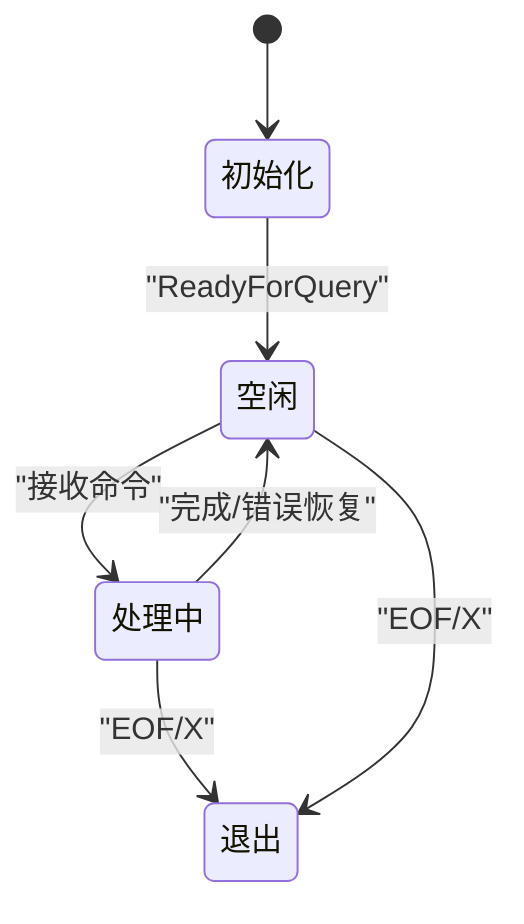
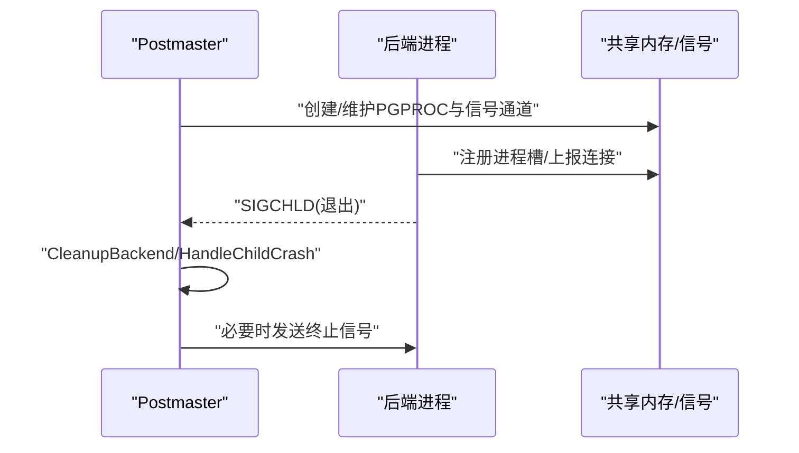
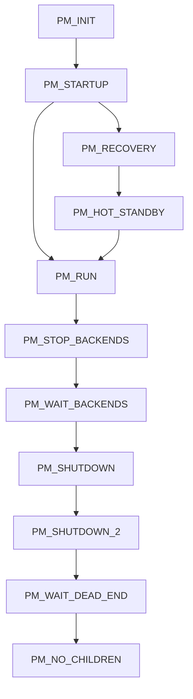
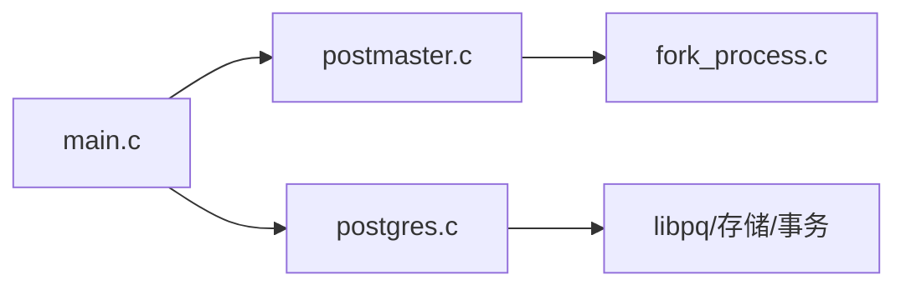

# 后端进程管理

<cite>
**本文引用的文件**
- [src/backend/postmaster/postmaster.c](file://src/backend/postmaster/postmaster.c)
- [src/backend/main/main.c](file://src/backend/main/main.c)
- [src/backend/tcop/postgres.c](file://src/backend/tcop/postgres.c)
- [src/backend/postmaster/fork_process.c](file://src/backend/postmaster/fork_process.c)
</cite>

## 目录
1. [简介](#简介)
2. [项目结构](#项目结构)
3. [核心组件](#核心组件)
4. [架构总览](#架构总览)
5. [详细组件分析](#详细组件分析)
6. [依赖关系分析](#依赖关系分析)
7. [性能考虑](#性能考虑)
8. [故障排查指南](#故障排查指南)
9. [结论](#结论)
10. [附录](#附录)

## 简介
本文件面向Mini PostgreSQL的后端进程管理系统，系统性阐述不同类型后端进程的设计原理与使用场景（单用户模式、普通后端进程、认证子进程），并详细说明后端进程的创建流程（fork()调用、资源继承、内存空间隔离）、生命周期管理（初始化、请求处理、清理与释放）、以及与Postmaster的通信机制（进程间同步、状态报告、异常通知）。文档包含进程状态转换图与关键控制流程图，帮助开发者理解并维护后端进程管理的完整实现。

## 项目结构
围绕后端进程管理的关键代码分布在以下模块：
- Postmaster主循环与子进程管理：负责监听连接、派生子进程、跟踪后端进程、处理崩溃与重启等。
- 通用入口main：根据命令行参数选择启动模式（postmaster、单用户、引导/辅助进程）。
- 后端主循环postgres.c：后端进程接收并处理客户端协议消息的主循环。
- fork_process封装：统一fork前后置处理，确保子进程环境正确。



图表来源
- [src/backend/main/main.c:49-177](file://src/backend/main/main.c#L49-L177)
- [src/backend/postmaster/postmaster.c:407-800](file://src/backend/postmaster/postmaster.c#L407-L800)
- [src/backend/postmaster/fork_process.c:25-111](file://src/backend/postmaster/fork_process.c#L25-L111)
- [src/backend/tcop/postgres.c:3988-4732](file://src/backend/tcop/postgres.c#L3988-L4732)

章节来源
- [src/backend/main/main.c:49-177](file://src/backend/main/main.c#L49-L177)
- [src/backend/postmaster/postmaster.c:407-800](file://src/backend/postmaster/postmaster.c#L407-L800)

## 核心组件
- Postmaster主进程：负责系统级启动/关闭、共享内存与信号量初始化、监听端口、派生后端进程、监控子进程退出、崩溃恢复。
- 后端进程：每个客户端会话一个后端进程，负责协议解析、事务执行、资源管理与清理。
- 单用户模式：直接以独立后端进程运行，不经过Postmaster，常用于数据库初始化或交互式调试。
- 认证子进程：在收到连接后先fork子进程进行认证，成功后再转为后端；避免阻塞库影响其他客户端。

章节来源
- [src/backend/postmaster/postmaster.c:126-173](file://src/backend/postmaster/postmaster.c#L126-L173)
- [src/backend/postmaster/postmaster.c:407-800](file://src/backend/postmaster/postmaster.c#L407-L800)
- [src/backend/main/main.c:169-177](file://src/backend/main/main.c#L169-L177)

## 架构总览
下图展示从连接建立到后端处理的总体流程，包括Postmaster派生子进程、认证、进入后端主循环以及请求分发。

```mermaid
sequenceDiagram
participant FE as "前端客户端"
participant PM as "Postmaster"
participant AUTH as "认证子进程"
participant BE as "后端进程"
participant LOOP as "后端主循环"
FE->>PM : "建立TCP/Unix套接字连接"
PM->>AUTH : "fork子进程进行认证"
AUTH-->>FE : "认证交互"
alt 认证成功
AUTH->>BE : "exec/转入后端主循环"
BE->>LOOP : "PostgresMain初始化"
LOOP-->>FE : "ReadyForQuery"
loop 请求处理
FE->>LOOP : "Q/P/B/E/C/D/H/S/X..."
LOOP-->>FE : "响应/错误/完成"
end
else 认证失败
AUTH-->>FE : "错误并退出"
end
```

图表来源
- [src/backend/postmaster/postmaster.c:407-800](file://src/backend/postmaster/postmaster.c#L407-L800)
- [src/backend/tcop/postgres.c:3988-4732](file://src/backend/tcop/postgres.c#L3988-L4732)

## 详细组件分析

### 进程类型与使用场景
- 单用户模式：通过命令行参数直接进入后端主循环，不经过Postmaster。适用于数据库初始化、交互式调试等场景。
- 普通后端进程：由Postmaster为每个客户端会话派生，负责协议处理与SQL执行。
- 认证子进程：在Postmaster接收到新连接后立即fork子进程进行认证，避免非多线程库阻塞影响其他连接。

章节来源
- [src/backend/main/main.c:169-177](file://src/backend/main/main.c#L169-L177)
- [src/backend/postmaster/postmaster.c:25-32](file://src/backend/postmaster/postmaster.c#L25-L32)

### 后端进程创建流程（fork与资源隔离）
- fork封装：统一在fork前刷新stdio缓冲，设置子进程随机数种子，调整OOM评分策略，确保子进程环境一致。
- 资源继承与隔离：子进程继承父进程的文件描述符、环境变量、内存映射等；但通过独立的进程地址空间实现内存隔离。
- 进入后端：认证成功后，子进程切换到后端主循环，完成后端初始化并进入请求处理。



图表来源
- [src/backend/postmaster/fork_process.c:25-111](file://src/backend/postmaster/fork_process.c#L25-L111)
- [src/backend/tcop/postgres.c:3988-4732](file://src/backend/tcop/postgres.c#L3988-L4732)

章节来源
- [src/backend/postmaster/fork_process.c:25-111](file://src/backend/postmaster/fork_process.c#L25-L111)
- [src/backend/tcop/postgres.c:3988-4732](file://src/backend/tcop/postgres.c#L3988-L4732)

### 后端进程生命周期管理
- 初始化阶段：设置信号处理器、GUC选项、数据目录、锁文件、共享内存进程槽、数据库上下文、会话预加载库、准备消息上下文等。
- 请求处理阶段：进入无限循环，读取客户端消息，分派到不同处理函数（简单查询、解析、绑定、执行、关闭、描述、快速路径等）。
- 清理与退出：检测到EOF或X消息时重置输出目标并退出；注册on_proc_exit回调用于日志记录与资源释放。



图表来源
- [src/backend/tcop/postgres.c:3988-4732](file://src/backend/tcop/postgres.c#L3988-L4732)

章节来源
- [src/backend/tcop/postgres.c:3988-4732](file://src/backend/tcop/postgres.c#L3988-L4732)

### Postmaster与后端的通信机制
- 进程间同步：通过信号（SIGUSR1、SIGCHLD等）和共享内存（PGPROC数组）协调；Postmaster通过reaper收集子进程退出信息。
- 状态报告：后端在连接建立时上报统计信息；空闲时更新活动状态；崩溃时触发HandleChildCrash并通知其他后端快速退出。
- 异常通知：当某个后端崩溃，Postmaster向其余后端发送终止信号，必要时重启系统或等待死端进程退出。



图表来源
- [src/backend/postmaster/postmaster.c:2500-2800](file://src/backend/postmaster/postmaster.c#L2500-L2800)
- [src/backend/postmaster/postmaster.c:2663-2800](file://src/backend/postmaster/postmaster.c#L2663-L2800)

章节来源
- [src/backend/postmaster/postmaster.c:2500-2800](file://src/backend/postmaster/postmaster.c#L2500-L2800)
- [src/backend/postmaster/postmaster.c:2663-2800](file://src/backend/postmaster/postmaster.c#L2663-L2800)

### 关键控制流程与状态机
- Postmaster状态机：涵盖启动、恢复、热备、运行、停止后端、等待后端退出、关闭检查点、等待死端进程、无子进程等状态。
- 后端主循环：按协议消息类型分派处理，支持简单查询、扩展协议（Parse/Bind/Execute/Describe/Close/Flush/Sync）及快速路径调用。



图表来源
- [src/backend/postmaster/postmaster.c:280-297](file://src/backend/postmaster/postmaster.c#L280-L297)

章节来源
- [src/backend/postmaster/postmaster.c:280-297](file://src/backend/postmaster/postmaster.c#L280-L297)

## 依赖关系分析
- main.c作为统一入口，依据参数选择PostmasterMain或PostgresMain。
- postmaster.c依赖fork_process.c进行安全的进程派生，并在ServerLoop中处理连接与子进程管理。
- postgres.c在后端主循环中依赖libpq协议层、存储与事务子系统、统计与超时机制。



图表来源
- [src/backend/main/main.c:49-177](file://src/backend/main/main.c#L49-L177)
- [src/backend/postmaster/postmaster.c:407-800](file://src/backend/postmaster/postmaster.c#L407-L800)
- [src/backend/postmaster/fork_process.c:25-111](file://src/backend/postmaster/fork_process.c#L25-L111)
- [src/backend/tcop/postgres.c:3988-4732](file://src/backend/tcop/postgres.c#L3988-L4732)

章节来源
- [src/backend/main/main.c:49-177](file://src/backend/main/main.c#L49-L177)
- [src/backend/postmaster/postmaster.c:407-800](file://src/backend/postmaster/postmaster.c#L407-L800)
- [src/backend/postmaster/fork_process.c:25-111](file://src/backend/postmaster/fork_process.c#L25-L111)
- [src/backend/tcop/postgres.c:3988-4732](file://src/backend/tcop/postgres.c#L3988-L4732)

## 性能考虑
- 认证子进程隔离：将认证过程放入子进程，避免SSL/PAM等非多线程库阻塞影响其他客户端。
- 信号与中断：合理设置信号处理器与中断标志，减少不必要的上下文切换与阻塞。
- 内存上下文：后端主循环使用MessageContext按命令周期重置，降低频繁分配开销。
- 空闲超时：启用空闲会话与空闲事务超时，及时回收资源，防止僵尸连接占用。

[本节提供一般性指导，无需特定文件引用]

## 故障排查指南
- 后端崩溃处理：Postmaster检测非零退出码（除正常与FATAL）视为崩溃，记录日志并通知其他后端快速退出，必要时重启系统。
- 子进程清理：CleanupBackend与CleanupBackgroundWorker负责从BackendList移除、释放槽位、取消通知、记录退出信息。
- 配置重载：SIGHUP触发配置文件重新加载，并向所有子进程广播，确保一致性。

章节来源
- [src/backend/postmaster/postmaster.c:2663-2800](file://src/backend/postmaster/postmaster.c#L2663-L2800)
- [src/backend/postmaster/postmaster.c:2100-2134](file://src/backend/postmaster/postmaster.c#L2100-L2134)

## 结论
Mini PostgreSQL的后端进程管理采用经典的Postmaster-Backend模型，通过安全的fork封装、严格的进程生命周期管理、完善的信号与共享内存通信机制，实现了高可用与可扩展的并发处理能力。单用户模式、普通后端进程与认证子进程各司其职，满足不同的使用场景。开发者可基于本文的状态图与控制流，进一步定位问题与优化性能。

## 附录
- 关键函数路径参考：
  - Postmaster主循环与子进程管理：[postmaster.c:407-800](file://src/backend/postmaster/postmaster.c#L407-L800)
  - 后端主循环与协议处理：[postgres.c:3988-4732](file://src/backend/tcop/postgres.c#L3988-L4732)
  - fork封装与环境初始化：[fork_process.c:25-111](file://src/backend/postmaster/fork_process.c#L25-L111)
  - 进程入口与模式选择：[main.c:49-177](file://src/backend/main/main.c#L49-L177)