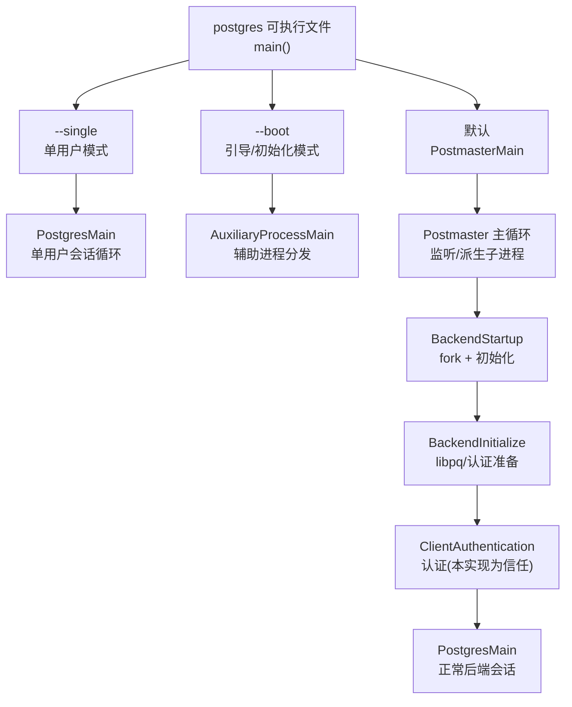
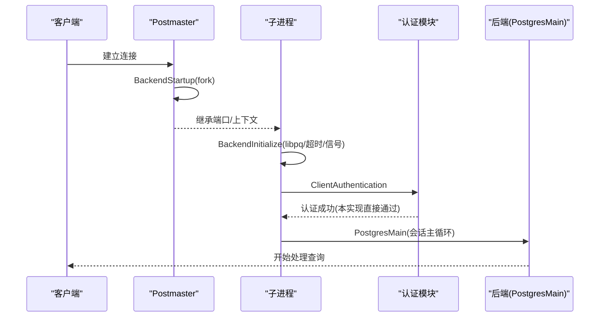
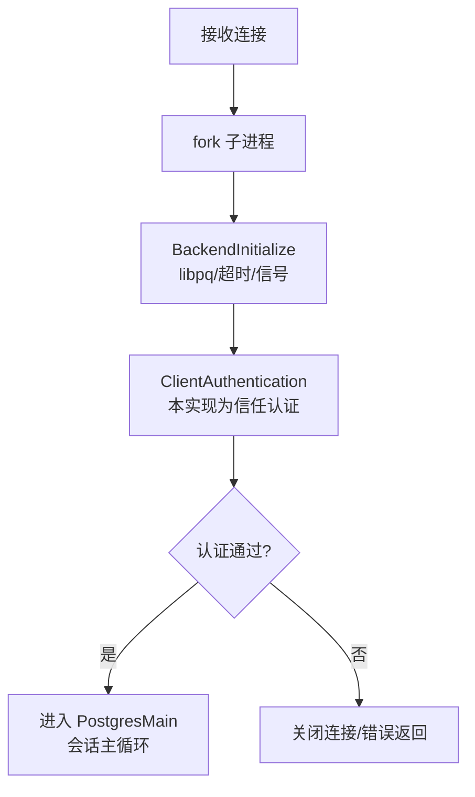
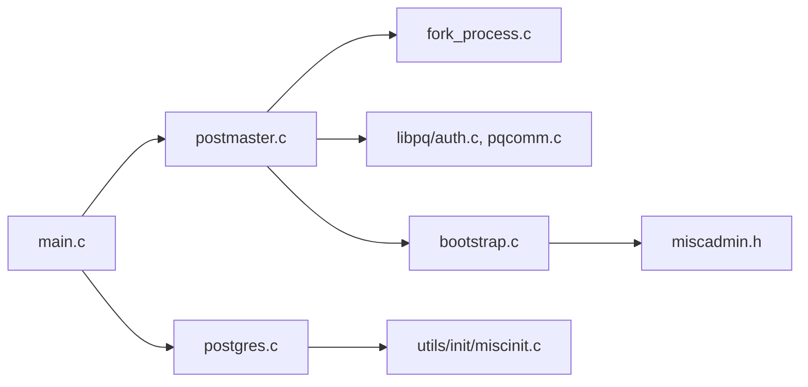

# 后端进程类型

<cite>
**本文引用的文件**
- [main.c](file://src/backend/main/main.c)
- [postmaster.c](file://src/backend/postmaster/postmaster.c)
- [fork_process.c](file://src/backend/postmaster/fork_process.c)
- [postgres.c](file://src/backend/tcop/postgres.c)
- [auth.c](file://src/backend/libpq/auth.c)
- [pqcomm.c](file://src/backend/libpq/pqcomm.c)
- [miscinit.c](file://src/backend/utils/init/miscinit.c)
- [bootstrap.c](file://src/backend/bootstrap/bootstrap.c)
- [miscadmin.h](file://src/include/miscadmin.h)
</cite>

## 目录
1. [简介](#简介)
2. [项目结构](#项目结构)
3. [核心组件](#核心组件)
4. [架构总览](#架构总览)
5. [详细组件分析](#详细组件分析)
6. [依赖关系分析](#依赖关系分析)
7. [性能考量](#性能考量)
8. [故障排查指南](#故障排查指南)
9. [结论](#结论)
10. [附录](#附录)

## 简介
本文面向 Mini PostgreSQL 的后端进程模型，系统梳理并文档化以下进程类型及其设计原理、启动方式、职责边界与适用场景：
- 单用户模式（Single-user）
- 普通后端进程（Normal Backend，由 Postmaster 派生）
- 认证子进程（在连接建立后、进入正式后端前执行的认证阶段；在本实现中为“信任认证”的简化流程）
- 辅助/后台进程（Bootstrap、Startup、BgWriter、Checkpointer、WalWriter 等）

同时给出进程类型的选择逻辑、关键配置参数、对比表与最佳实践，帮助开发者理解何时使用哪种进程类型以及各自的优缺点。

## 项目结构
Mini PostgreSQL 将不同进程类型的入口统一收敛到 postgres 可执行文件的 main()，根据命令行参数分发到不同主循环或辅助进程入口：
- --single：单用户模式，直接进入 PostgresMain
- --boot：引导/初始化模式，进入 AuxiliaryProcessMain
- 默认：PostmasterMain，作为守护进程管理连接与派生子进程

图示来源
- [main.c:169-176](file://src/backend/main/main.c#L169-L176)
- [postmaster.c:3392-3459](file://src/backend/postmaster/postmaster.c#L3392-L3459)
- [postmaster.c:3533-3584](file://src/backend/postmaster/postmaster.c#L3533-L3584)
- [auth.c:59-76](file://src/backend/libpq/auth.c#L59-L76)
- [postgres.c:3988-4015](file://src/backend/tcop/postgres.c#L3988-L4015)

章节来源
- [main.c:169-176](file://src/backend/main/main.c#L169-L176)
- [postmaster.c:3392-3459](file://src/backend/postmaster/postmaster.c#L3392-L3459)

## 核心组件
- 进程入口与分发：main() 根据 argv[1] 决定运行模式
- Postmaster：负责监听连接、派生后端、生命周期管理与崩溃恢复
- 后端初始化：BackendInitialize 完成 libpq 初始化、超时与信号处理设置
- 认证：ClientAuthentication（本实现为无条件信任）
- 后端主循环：PostgresMain 提供统一的会话处理入口
- 辅助进程：AuxiliaryProcessMain 根据 MyAuxProcType 分发到具体辅助进程主循环

章节来源
- [main.c:169-176](file://src/backend/main/main.c#L169-L176)
- [postmaster.c:3533-3584](file://src/backend/postmaster/postmaster.c#L3533-L3584)
- [auth.c:59-76](file://src/backend/libpq/auth.c#L59-L76)
- [postgres.c:3988-4015](file://src/backend/tcop/postgres.c#L3988-L4015)
- [bootstrap.c:415-455](file://src/backend/bootstrap/bootstrap.c#L415-L455)

## 架构总览
下图展示从客户端连接到后端处理的完整时序，包括 Postmaster 派生、认证与进入后端主循环的关键步骤。

图示来源
- [postmaster.c:3392-3459](file://src/backend/postmaster/postmaster.c#L3392-L3459)
- [postmaster.c:3533-3584](file://src/backend/postmaster/postmaster.c#L3533-L3584)
- [auth.c:59-76](file://src/backend/libpq/auth.c#L59-L76)
- [postgres.c:3988-4015](file://src/backend/tcop/postgres.c#L3988-L4015)

## 详细组件分析

### 单用户模式（Single-user）
- 启动方式
  - 通过命令行参数 --single 启动，main() 直接调用 PostgresMain，不经过 Postmaster
- 功能职责
  - 以独立进程运行，适合数据库初始化、修复、迁移等一次性任务
  - 会话身份通过 InitializeSessionUserIdStandalone 设置为引导超级用户
- 适用环境
  - 维护窗口、数据修复、批量导入导出、脚本式运维
- 优点
  - 无共享内存依赖，隔离性好，便于调试
- 缺点
  - 不支持并发连接，不适合生产服务

章节来源
- [main.c:169-176](file://src/backend/main/main.c#L169-L176)
- [postgres.c:3988-4015](file://src/backend/tcop/postgres.c#L3988-L4015)
- [miscinit.c:688-718](file://src/backend/utils/init/miscinit.c#L688-L718)

### 普通后端进程（Normal Backend）
- 启动方式
  - Postmaster 收到新连接后，调用 BackendStartup fork 子进程，随后子进程执行 BackendInitialize 与 BackendRun
- 功能职责
  - 每个连接一个后端进程，负责协议解析、事务执行、结果返回
  - 在子进程中完成 libpq 初始化、超时与信号处理、认证与进入 PostgresMain
- 适用环境
  - 标准客户端连接，生产服务主要工作负载
- 优点
  - 隔离性强，单个后端崩溃不影响其他连接
  - 易于扩展与调试
- 缺点
  - 进程创建开销较大，高并发下需合理配置最大连接数

章节来源
- [postmaster.c:3392-3459](file://src/backend/postmaster/postmaster.c#L3392-L3459)
- [postmaster.c:3533-3584](file://src/backend/postmaster/postmaster.c#L3533-L3584)
- [pqcomm.c:161-193](file://src/backend/libpq/pqcomm.c#L161-L193)
- [postgres.c:3988-4015](file://src/backend/tcop/postgres.c#L3988-L4015)

### 认证子进程（连接建立后的认证阶段）
- 说明
  - 在 Postmaster 派生的子进程中，先进行认证，成功后再进入后端主循环
  - 本实现移除了基于主机与角色的访问控制，所有入站连接被无条件信任放行
- 功能职责
  - 初始化 libpq 输出通道，发送认证请求/响应，完成后置标志位以便后续日志输出
- 适用环境
  - 开发/测试环境或受控网络内网部署
- 优点
  - 路径短、延迟低
- 缺点
  - 无鉴权能力，存在安全风险，不建议在生产开放网络使用

章节来源
- [postmaster.c:3533-3584](file://src/backend/postmaster/postmaster.c#L3533-L3584)
- [auth.c:59-76](file://src/backend/libpq/auth.c#L59-L76)

### 辅助/后台进程（Bootstrap、Startup、BgWriter、Checkpointer、WalWriter 等）
- 启动方式
  - Postmaster 通过 StartChildProcess 启动辅助进程，子进程进入 AuxiliaryProcessMain，依据 MyAuxProcType 分发到具体主循环
- 功能职责
  - Bootstrap：数据库初始化与系统对象构建
  - Startup：WAL 恢复与一致性检查
  - BgWriter/Checkpointer/WalWriter：持久化与 WAL 写入
- 适用环境
  - 服务器启动、恢复、日常维护与性能优化
- 优点
  - 职责清晰、与业务会话解耦
- 缺点
  - 需要与 Postmaster 协调生命周期与信号

章节来源
- [bootstrap.c:415-455](file://src/backend/bootstrap/bootstrap.c#L415-L455)
- [miscadmin.h:426-447](file://src/include/miscadmin.h#L426-L447)
- [postmaster.c:3995-4010](file://src/backend/postmaster/postmaster.c#L3995-L4010)

### 进程类型选择逻辑与配置要点
- 选择逻辑
  - 命令行参数决定初始模式：--single 走单用户；--boot 走引导；默认走 Postmaster
  - Postmaster 内部根据 canAcceptConnections 状态决定是否接受新连接，并在异常状态下限制新后端创建
- 关键配置点
  - PreAuthDelay：认证前延时，用于调试
  - PostAuthDelay：认证后延时，可通过 PGOPTIONS 传递
  - 最大连接数、超时、日志级别等通过运行时参数控制（不在本文展开）

章节来源
- [main.c:169-176](file://src/backend/main/main.c#L169-L176)
- [postmaster.c:3548-3559](file://src/backend/postmaster/postmaster.c#L3548-L3559)
- [postmaster.c:3427-3438](file://src/backend/postmaster/postmaster.c#L3427-L3438)

### 流程图：连接建立与认证

图示来源
- [postmaster.c:3392-3459](file://src/backend/postmaster/postmaster.c#L3392-L3459)
- [postmaster.c:3533-3584](file://src/backend/postmaster/postmaster.c#L3533-L3584)
- [auth.c:59-76](file://src/backend/libpq/auth.c#L59-L76)

## 依赖关系分析
- main.c 依赖 tcop/postgres.c 与 postmaster/postmaster.c，按参数分发
- postmaster.c 依赖 fork_process.c 进行安全 fork，依赖 libpq 进行认证与通信
- postgres.c 作为后端主循环，依赖 libpq、存储、事务、优化器等子系统
- bootstrap.c 与 miscadmin.h 定义辅助进程类型与分发逻辑

图示来源
- [main.c:169-176](file://src/backend/main/main.c#L169-L176)
- [postmaster.c:3392-3459](file://src/backend/postmaster/postmaster.c#L3392-L3459)
- [fork_process.c:25-112](file://src/backend/postmaster/fork_process.c#L25-L112)
- [auth.c:59-76](file://src/backend/libpq/auth.c#L59-L76)
- [pqcomm.c:161-193](file://src/backend/libpq/pqcomm.c#L161-L193)
- [bootstrap.c:415-455](file://src/backend/bootstrap/bootstrap.c#L415-L455)
- [miscadmin.h:426-447](file://src/include/miscadmin.h#L426-L447)

章节来源
- [main.c:169-176](file://src/backend/main/main.c#L169-L176)
- [postmaster.c:3392-3459](file://src/backend/postmaster/postmaster.c#L3392-L3459)
- [fork_process.c:25-112](file://src/backend/postmaster/fork_process.c#L25-L112)
- [auth.c:59-76](file://src/backend/libpq/auth.c#L59-L76)
- [pqcomm.c:161-193](file://src/backend/libpq/pqcomm.c#L161-L193)
- [bootstrap.c:415-455](file://src/backend/bootstrap/bootstrap.c#L415-L455)
- [miscadmin.h:426-447](file://src/include/miscadmin.h#L426-L447)

## 性能考量
- 进程模型优势
  - 隔离性与稳定性：单个后端崩溃不影响其他连接
  - 简单可靠：避免多线程共享内存竞争带来的复杂性
- 成本与权衡
  - fork 与进程切换开销在高并发下显著，需结合连接池与最大连接数调优
  - 认证阶段若引入复杂库（如 SSL/PAM），应确保不会阻塞其他连接（当前实现已规避）
- 建议
  - 合理设置最大连接数与超时
  - 使用连接池减少频繁 fork
  - 监控后端数量与资源占用，必要时扩容

## 故障排查指南
- 常见症状与定位
  - 无法 fork 新后端：检查系统资源与内核限制，查看 Postmaster 日志中的 fork 失败信息
  - 认证失败：当前实现为信任认证，若启用外部认证库，请检查相关配置与依赖
  - 后端异常退出：Postmaster 会记录子进程退出码并清理状态，必要时触发快速死亡以保护系统
- 关键日志与位置
  - Postmaster 子进程退出日志
  - 认证阶段错误与超时信息
  - 后端主循环异常堆栈

章节来源
- [postmaster.c:3492-3520](file://src/backend/postmaster/postmaster.c#L3492-L3520)
- [postmaster.c:2663-2682](file://src/backend/postmaster/postmaster.c#L2663-L2682)
- [auth.c:59-76](file://src/backend/libpq/auth.c#L59-L76)

## 结论
Mini PostgreSQL 采用经典的进程模型：Postmaster 统一管理连接与生命周期，单用户模式用于维护任务，普通后端进程处理常规会话，认证阶段在当前实现中为信任模式，辅助进程承担启动、恢复与持久化职责。该设计简洁稳定，适合学习与轻量部署；在生产环境中应根据安全与性能需求调整认证策略与连接规模。

## 附录

### 进程类型对比表
- 单用户模式
  - 启动：--single
  - 职责：单次会话，无共享内存依赖
  - 适用：维护、修复、脚本
  - 优点：隔离、易调试
  - 缺点：不支持并发
- 普通后端进程
  - 启动：Postmaster 派生
  - 职责：协议处理、事务执行
  - 适用：生产服务
  - 优点：隔离、稳定
  - 缺点：fork 开销
- 认证子进程
  - 启动：连接建立后子进程内执行
  - 职责：认证与前置准备
  - 适用：开发/测试
  - 优点：路径短
  - 缺点：当前无鉴权
- 辅助/后台进程
  - 启动：Postmaster 启动
  - 职责：启动、恢复、持久化
  - 适用：服务器生命周期管理
  - 优点：职责清晰
  - 缺点：需与 Postmaster 协调

### 最佳实践
- 开发与测试
  - 使用单用户模式进行数据修复与迁移
  - 开启 PreAuthDelay/PostAuthDelay 便于调试
- 生产部署
  - 启用强认证机制（如密码/证书），避免信任认证
  - 合理配置最大连接数与超时，配合连接池
  - 监控后端数量与资源，及时扩容或限流
- 运维
  - 关注 Postmaster 日志中的子进程退出与崩溃信息
  - 定期评估辅助进程健康度（BgWriter、Checkpointer、WalWriter）