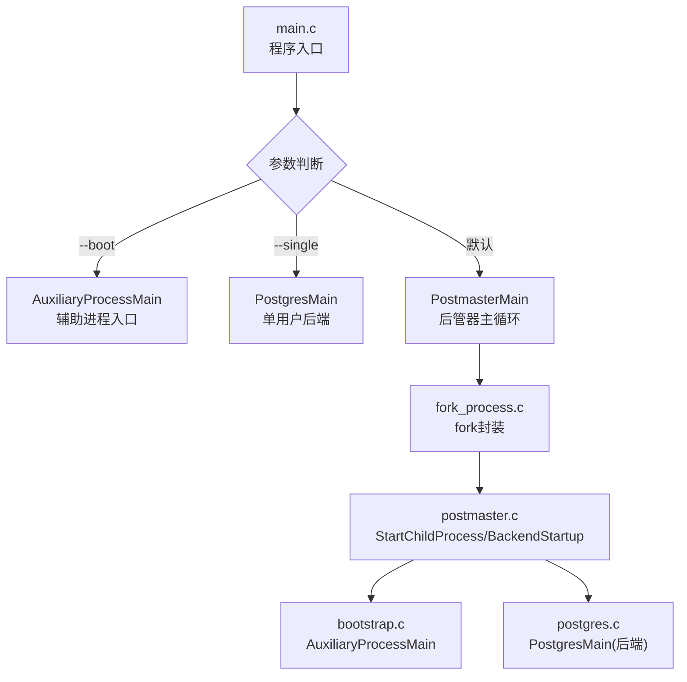
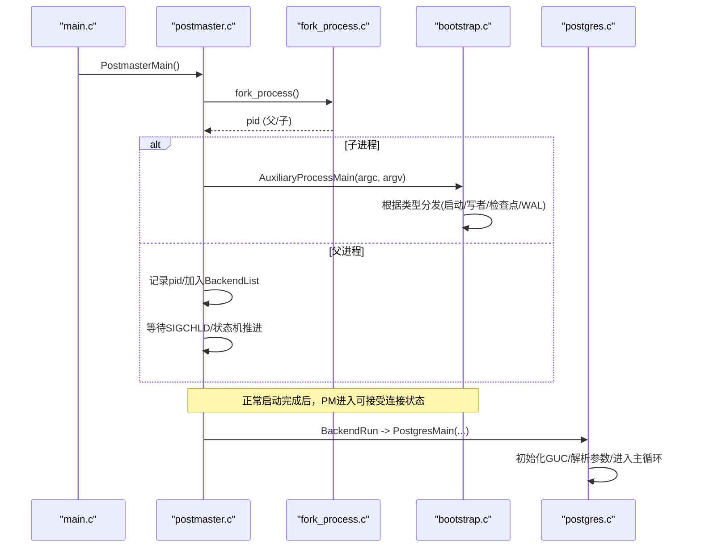
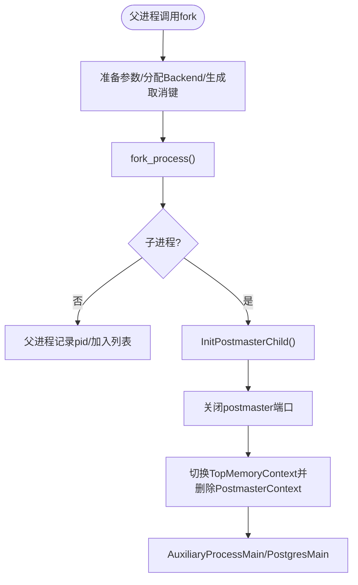
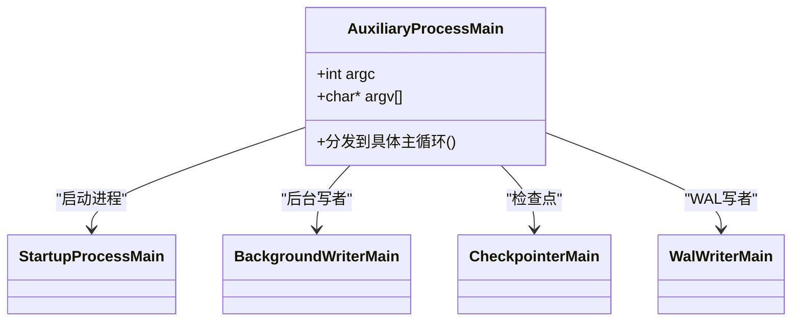
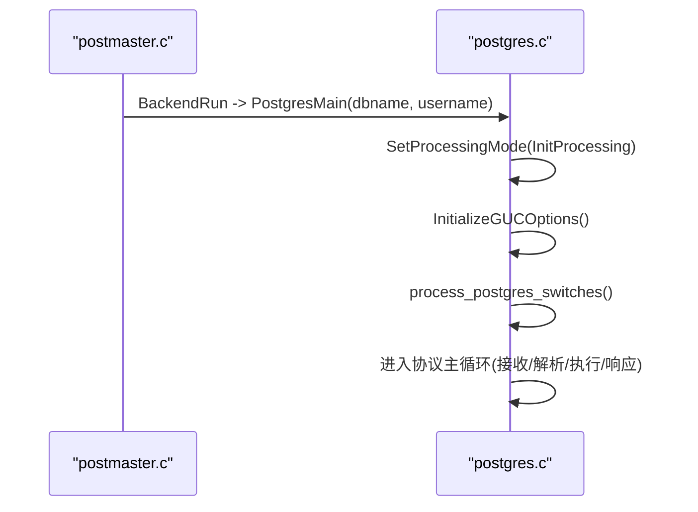
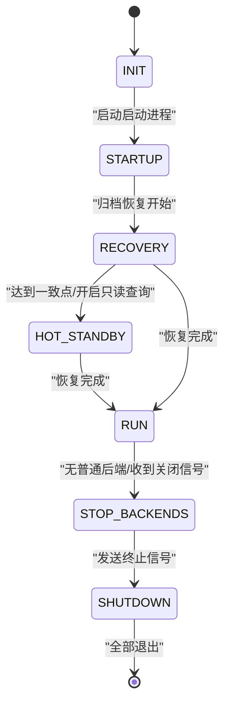
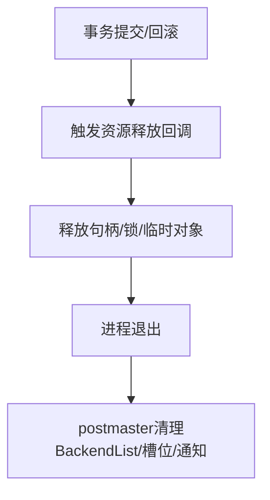
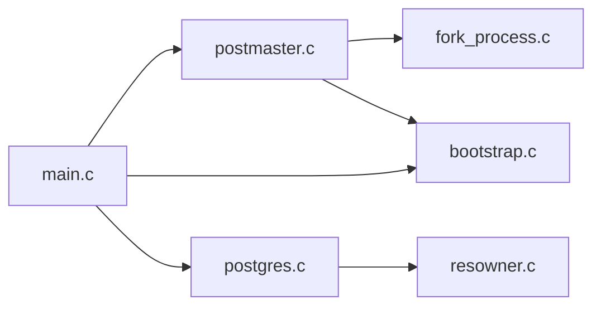

# 进程生命周期管理

<cite>
**本文引用的文件**
- [src/backend/main/main.c](file://src/backend/main/main.c)
- [src/backend/postmaster/postmaster.c](file://src/backend/postmaster/postmaster.c)
- [src/backend/postmaster/fork_process.c](file://src/backend/postmaster/fork_process.c)
- [src/backend/bootstrap/bootstrap.c](file://src/backend/bootstrap/bootstrap.c)
- [src/backend/tcop/postgres.c](file://src/backend/tcop/postgres.c)
- [src/backend/utils/resowner/resowner.c](file://src/backend/utils/resowner/resowner.c)
</cite>

## 目录
1. [简介](#简介)
2. [项目结构](#项目结构)
3. [核心组件](#核心组件)
4. [架构总览](#架构总览)
5. [详细组件分析](#详细组件分析)
6. [依赖关系分析](#依赖关系分析)
7. [性能考虑](#性能考虑)
8. [故障排查指南](#故障排查指南)
9. [结论](#结论)
10. [附录](#附录)

## 简介
本文面向Mini PostgreSQL后端进程的完整生命周期，围绕“创建—初始化—请求处理—清理—资源释放”的主线，系统阐述postmaster如何fork子进程、子进程如何进入辅助进程或后端主循环、共享内存与资源隔离机制、异常与恢复策略，以及状态机驱动的启动/关闭流程。文档同时提供进程状态转换图与关键调用时序图，帮助开发者快速定位实现位置并理解控制流。

## 项目结构
与进程生命周期直接相关的代码主要分布在以下模块：
- 入口与分发：main.c 负责平台初始化、locale设置、权限检查，并根据参数分派到PostmasterMain、PostgresMain或AuxiliaryProcessMain。
- 后管器（postmaster）：postmaster.c 实现进程状态机、子进程创建、信号处理、崩溃恢复与退出清理。
- fork封装：fork_process.c 对fork进行包装，完成stdio刷新、随机数初始化、OOM调整等。
- 辅助进程：bootstrap.c 中的 AuxiliaryProcessMain 统一调度后台写者、检查点、WAL写者、启动进程等。
- 后端主循环：postgres.c 中的 PostgresMain 是普通后端请求处理主循环的入口。
- 资源所有者：resowner.c 提供资源注册与释放回调，确保事务/会话结束时正确回收资源。

**图表来源**
- [src/backend/main/main.c:49-177](file://src/backend/main/main.c#L49-L177)
- [src/backend/postmaster/postmaster.c:3392-4077](file://src/backend/postmaster/postmaster.c#L3392-L4077)
- [src/backend/postmaster/fork_process.c:25-110](file://src/backend/postmaster/fork_process.c#L25-L110)
- [src/backend/bootstrap/bootstrap.c:191-456](file://src/backend/bootstrap/bootstrap.c#L191-L456)
- [src/backend/tcop/postgres.c:3988-4015](file://src/backend/tcop/postgres.c#L3988-L4015)

**章节来源**
- [src/backend/main/main.c:49-177](file://src/backend/main/main.c#L49-L177)
- [src/backend/postmaster/postmaster.c:239-3886](file://src/backend/postmaster/postmaster.c#L239-L3886)

## 核心组件
- 进程入口与分发：main.c 中根据命令行参数选择运行模式，完成早期环境初始化后分派到不同主函数。
- 后管器状态机：postmaster.c 维护PM_*状态，驱动启动、恢复、热备、停止等阶段，并在子进程退出时进行清理与重启。
- 子进程创建：fork_process.c 封装fork，保证输出缓冲刷新、随机数初始化、OOM策略调整；postmaster.c 在父进程准备参数并调用fork，在子进程执行InitPostmasterChild、关闭监听端口、释放postmaster工作内存上下文，然后进入AuxiliaryProcessMain或后端主循环。
- 辅助进程调度：bootstrap.c 的 AuxiliaryProcessMain 根据类型分发到具体主循环（如启动进程、后台写者、检查点、WAL写者）。
- 后端主循环：postgres.c 的 PostgresMain 是普通后端请求处理主循环入口，负责GUC初始化、协议处理、事务与资源管理。
- 资源释放：resowner.c 提供资源所有者与释放回调机制，确保提交/回滚或进程退出时释放句柄、锁、临时对象等。

**章节来源**
- [src/backend/main/main.c:49-177](file://src/backend/main/main.c#L49-L177)
- [src/backend/postmaster/postmaster.c:239-3886](file://src/backend/postmaster/postmaster.c#L239-L3886)
- [src/backend/postmaster/fork_process.c:25-110](file://src/backend/postmaster/fork_process.c#L25-L110)
- [src/backend/bootstrap/bootstrap.c:191-456](file://src/backend/bootstrap/bootstrap.c#L191-L456)
- [src/backend/tcop/postgres.c:3988-4015](file://src/backend/tcop/postgres.c#L3988-L4015)
- [src/backend/utils/resowner/resowner.c:144-879](file://src/backend/utils/resowner/resowner.c#L144-L879)

## 架构总览
下图展示从进程创建到请求处理的端到端流程，包括postmaster、辅助进程与后端进程之间的交互。

**图表来源**
- [src/backend/main/main.c:49-177](file://src/backend/main/main.c#L49-L177)
- [src/backend/postmaster/postmaster.c:3392-4077](file://src/backend/postmaster/postmaster.c#L3392-L4077)
- [src/backend/postmaster/fork_process.c:25-110](file://src/backend/postmaster/fork_process.c#L25-L110)
- [src/backend/bootstrap/bootstrap.c:191-456](file://src/backend/bootstrap/bootstrap.c#L191-L456)
- [src/backend/tcop/postgres.c:3988-4015](file://src/backend/tcop/postgres.c#L3988-L4015)

## 详细组件分析

### 进程创建与资源继承（fork）
- 父进程侧：postmaster.c 在创建子进程前分配Backend结构、生成取消键、计算canAcceptConnections，并设置child_slot；随后通过fork_process()创建子进程。
- 子进程侧：fork_process.c 在fork后立即更新MyProcPid、初始化强随机源、必要时写入OOM调整值；随后返回到调用处。
- 子进程后续：postmaster.c 在子进程中调用InitPostmasterChild、关闭postmaster监听端口、切换到TopMemoryContext并删除PostmasterContext，再进入AuxiliaryProcessMain或后端主循环，从而实现内存空间隔离（不再持有postmaster的工作上下文）。

**图表来源**
- [src/backend/postmaster/postmaster.c:3392-4077](file://src/backend/postmaster/postmaster.c#L3392-L4077)
- [src/backend/postmaster/fork_process.c:25-110](file://src/backend/postmaster/fork_process.c#L25-L110)

**章节来源**
- [src/backend/postmaster/postmaster.c:3392-4077](file://src/backend/postmaster/postmaster.c#L3392-L4077)
- [src/backend/postmaster/fork_process.c:25-110](file://src/backend/postmaster/fork_process.c#L25-L110)

### 辅助进程调度（启动/写者/检查点/WAL）
- AuxiliaryProcessMain 接收argc/argv，初始化进程环境，根据MyAuxProcType分发到对应主循环：
  - 启动进程：StartupProcessMain
  - 后台写者：BackgroundWriterMain
  - 检查点：CheckpointerMain
  - WAL写者：WalWriterMain
- 这些进程均通过before_shmem_exit注册清理回调，确保退出时释放共享内存相关资源。

**图表来源**
- [src/backend/bootstrap/bootstrap.c:191-456](file://src/backend/bootstrap/bootstrap.c#L191-L456)

**章节来源**
- [src/backend/bootstrap/bootstrap.c:191-456](file://src/backend/bootstrap/bootstrap.c#L191-L456)

### 后端主循环（请求处理）
- PostgresMain 作为后端主循环入口，在非postmaster环境下初始化独立进程环境，设置处理模式为InitProcessing，初始化GUC选项，解析命令行参数，进入协议处理与事务执行主循环。
- 该循环负责接收客户端消息、解析SQL、执行计划、返回结果，并在事务边界或会话结束时触发资源释放。

**图表来源**
- [src/backend/postmaster/postmaster.c:3698-3720](file://src/backend/postmaster/postmaster.c#L3698-L3720)
- [src/backend/tcop/postgres.c:3988-4015](file://src/backend/tcop/postgres.c#L3988-L4015)

**章节来源**
- [src/backend/postmaster/postmaster.c:3698-3720](file://src/backend/postmaster/postmaster.c#L3698-L3720)
- [src/backend/tcop/postgres.c:3988-4015](file://src/backend/tcop/postgres.c#L3988-L4015)

### 进程状态机与生命周期控制
- postmaster.c 定义PM_*状态（INIT、STARTUP、RECOVERY、HOT_STANDBY、RUN、STOP_BACKENDS、SHUTDOWN等），并通过PostmasterStateMachine推进状态。
- 子进程退出由reaper处理：收集SIGCHLD，区分统计收集器、系统日志器、后台工作者与普通后端，分别进行重启或清理；非正常退出会触发HandleChildCrash，通知其他子进程快速退出。
- 关闭流程：当允许的连接数为仅超级用户或禁止连接时，等待普通后端退出，进入STOP_BACKENDS，向所有子进程发送终止信号，最终进入SHUTDOWN。

**图表来源**
- [src/backend/postmaster/postmaster.c:239-3886](file://src/backend/postmaster/postmaster.c#L239-L3886)

**章节来源**
- [src/backend/postmaster/postmaster.c:239-3886](file://src/backend/postmaster/postmaster.c#L239-L3886)

### 资源释放与清理
- resowner.c 提供ResourceOwner机制，支持注册释放回调（RegisterResourceReleaseCallback），在提交/回滚或进程退出时按序释放资源。
- 辅助进程通过before_shmem_exit注册清理回调，确保共享内存相关资源在退出时被释放。
- 后端退出时，postmaster.c 的CleanupBackend会从BackendList移除条目、释放槽位、取消后台工作者通知，并处理异常退出情况。

**图表来源**
- [src/backend/utils/resowner/resowner.c:826-879](file://src/backend/utils/resowner/resowner.c#L826-L879)
- [src/backend/postmaster/postmaster.c:2663-2719](file://src/backend/postmaster/postmaster.c#L2663-L2719)

**章节来源**
- [src/backend/utils/resowner/resowner.c:826-879](file://src/backend/utils/resowner/resowner.c#L826-L879)
- [src/backend/postmaster/postmaster.c:2663-2719](file://src/backend/postmaster/postmaster.c#L2663-L2719)

## 依赖关系分析
- main.c 依赖 postmaster/postmaster.c、tcop/postgres.c、bootstrap/bootstrap.c 以完成进程分派。
- postmaster.c 依赖 fork_process.c 进行安全的fork操作，并依赖 bootstrap.c 的辅助进程主循环。
- postgres.c 依赖 utils/resowner.c 的资源管理机制，确保事务/会话级资源正确释放。
- 各组件通过共享内存与信号进行通信（例如子进程通过SIGUSR1通知postmaster事件，postmaster通过信号广播关闭指令）。

**图表来源**
- [src/backend/main/main.c:49-177](file://src/backend/main/main.c#L49-L177)
- [src/backend/postmaster/postmaster.c:3392-4077](file://src/backend/postmaster/postmaster.c#L3392-L4077)
- [src/backend/bootstrap/bootstrap.c:191-456](file://src/backend/bootstrap/bootstrap.c#L191-L456)
- [src/backend/tcop/postgres.c:3988-4015](file://src/backend/tcop/postgres.c#L3988-L4015)
- [src/backend/utils/resowner/resowner.c:826-879](file://src/backend/utils/resowner/resowner.c#L826-L879)

**章节来源**
- [src/backend/main/main.c:49-177](file://src/backend/main/main.c#L49-L177)
- [src/backend/postmaster/postmaster.c:3392-4077](file://src/backend/postmaster/postmaster.c#L3392-L4077)
- [src/backend/bootstrap/bootstrap.c:191-456](file://src/backend/bootstrap/bootstrap.c#L191-L456)
- [src/backend/tcop/postgres.c:3988-4015](file://src/backend/tcop/postgres.c#L3988-L4015)
- [src/backend/utils/resowner/resowner.c:826-879](file://src/backend/utils/resowner/resowner.c#L826-L879)

## 性能考虑
- fork前刷新stdio输出，避免重复输出导致的I/O开销与竞争。
- 子进程立即释放postmaster工作内存上下文，减少内存占用与拷贝成本。
- 状态机仅在必要时推进，避免频繁访问共享内存造成锁竞争。
- 使用资源所有者机制批量释放资源，降低逐条释放的开销。

[本节为通用指导，不直接分析具体文件]

## 故障排查指南
- 子进程崩溃：reaper捕获SIGCHLD，若为非正常退出则调用HandleChildCrash，通知其他子进程快速退出，防止状态不一致。
- fork失败：postmaster.c 针对不同类型子进程记录错误日志；启动进程fork失败视为致命错误并退出postmaster。
- 启动超时：StartupPacketTimeoutHandler通过_exit快速退出，避免阻塞。
- 资源泄漏：检查是否注册了资源释放回调，确认事务提交/回滚路径是否正确触发释放。

**章节来源**
- [src/backend/postmaster/postmaster.c:2272-2734](file://src/backend/postmaster/postmaster.c#L2272-L2734)
- [src/backend/postmaster/postmaster.c:3938-3946](file://src/backend/postmaster/postmaster.c#L3938-L3946)
- [src/backend/utils/resowner/resowner.c:826-879](file://src/backend/utils/resowner/resowner.c#L826-L879)

## 结论
Mini PostgreSQL的后端进程生命周期由main.c的分发、postmaster的状态机与子进程管理、fork封装的安全保障、辅助进程的统一调度、后端主循环的请求处理，以及资源所有者的释放机制共同构成。通过清晰的状态转换与严格的资源隔离，系统在启动、运行、关闭与异常恢复过程中保持了稳定性与一致性。开发者可依据本文档的定位与图示，快速定位实现细节并进行扩展或优化。

## 附录
- 关键函数路径参考：
  - 进程入口与分发：[src/backend/main/main.c:49-177](file://src/backend/main/main.c#L49-L177)
  - 子进程创建与隔离：[src/backend/postmaster/postmaster.c:3392-4077](file://src/backend/postmaster/postmaster.c#L3392-L4077)、[src/backend/postmaster/fork_process.c:25-110](file://src/backend/postmaster/fork_process.c#L25-L110)
  - 辅助进程调度：[src/backend/bootstrap/bootstrap.c:191-456](file://src/backend/bootstrap/bootstrap.c#L191-L456)
  - 后端主循环：[src/backend/tcop/postgres.c:3988-4015](file://src/backend/tcop/postgres.c#L3988-L4015)
  - 资源释放回调：[src/backend/utils/resowner/resowner.c:826-879](file://src/backend/utils/resowner/resowner.c#L826-L879)
  - 状态机与清理：[src/backend/postmaster/postmaster.c:239-3886](file://src/backend/postmaster/postmaster.c#L239-L3886)