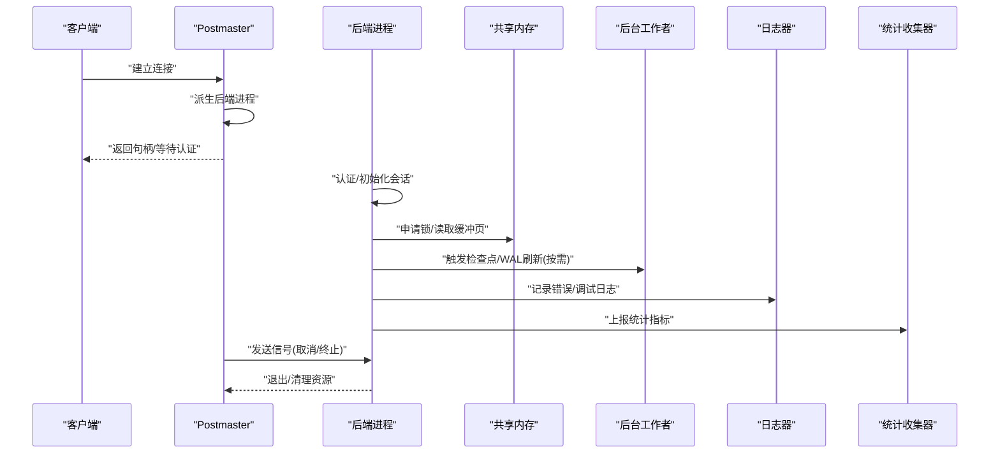
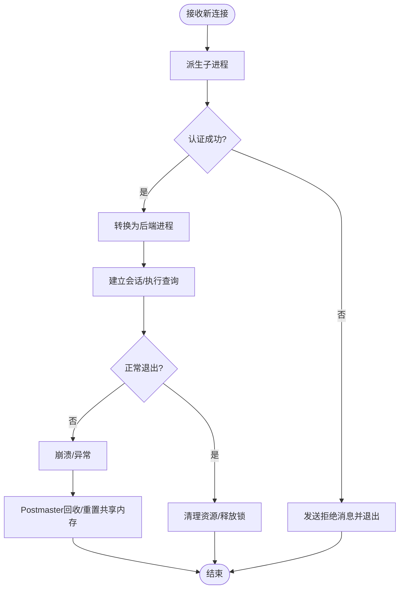
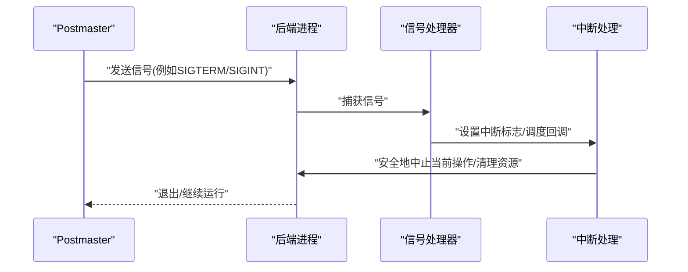
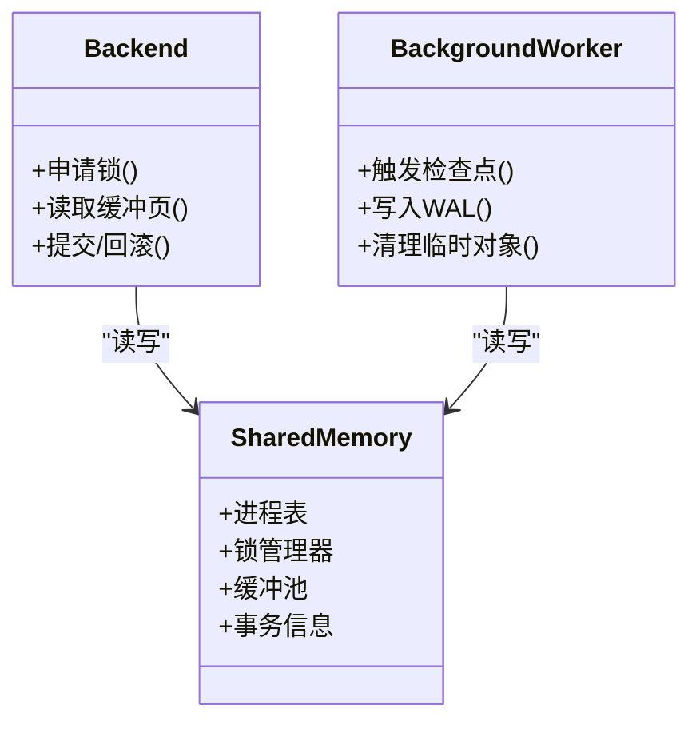
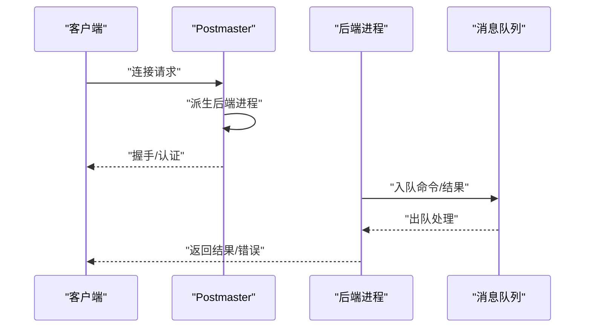
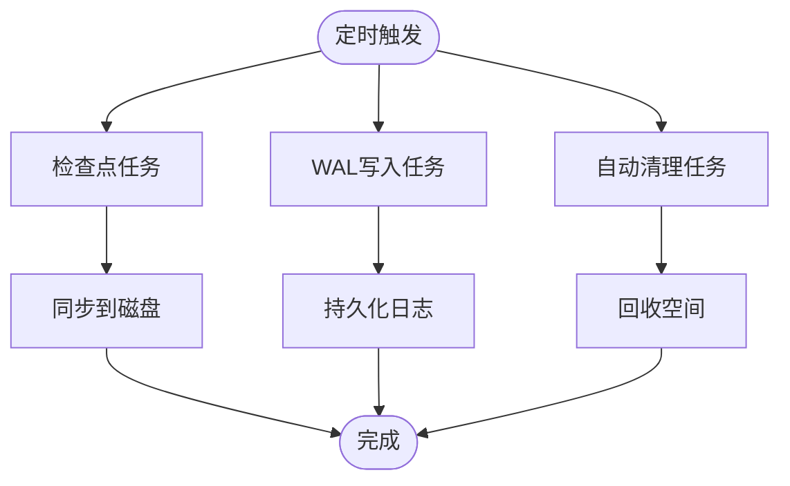
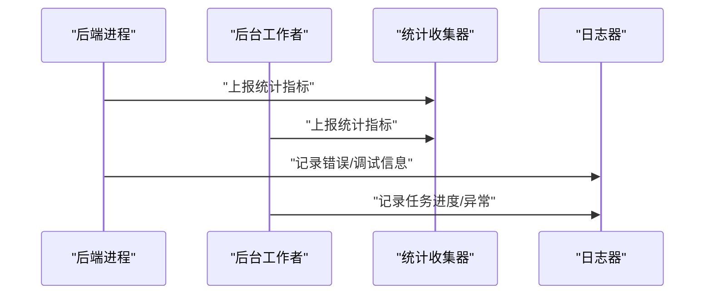
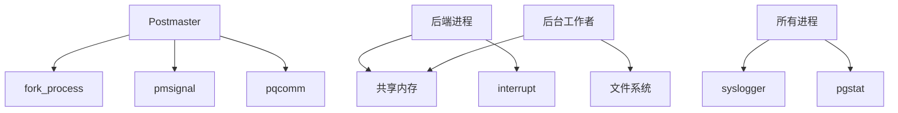

# 进程间通信机制

<cite>
**本文引用的文件**
- [postmaster.c](file://src/backend/postmaster/postmaster.c)
- [fork_process.c](file://src/backend/postmaster/fork_process.c)
- [ipc.h](file://src/include/storage/ipc.h)
- [pmsignal.h](file://src/include/storage/pmsignal.h)
- [pqcomm.c](file://src/backend/libpq/pqcomm.c)
- [pqsignal.c](file://src/backend/libpq/pqsignal.c)
- [pgstat.c](file://src/backend/postmaster/pgstat.c)
- [startup.c](file://src/backend/postmaster/startup.c)
- [syslogger.c](file://src/backend/postmaster/syslogger.c)
- [walwriter.c](file://src/backend/postmaster/walwriter.c)
- [bgworker.c](file://src/backend/postmaster/bgworker.c)
- [interrupt.c](file://src/backend/postmaster/interrupt.c)
</cite>

## 目录
1. [简介](#简介)
2. [项目结构](#项目结构)
3. [核心组件](#核心组件)
4. [架构总览](#架构总览)
5. [详细组件分析](#详细组件分析)
6. [依赖关系分析](#依赖关系分析)
7. [性能考虑](#性能考虑)
8. [故障处理指南](#故障处理指南)
9. [结论](#结论)
10. [附录](#附录)

## 简介
本文件面向Mini PostgreSQL的进程间通信（IPC）机制，聚焦Postmaster与后端/后台进程之间的通信协议、消息队列、信号机制、共享内存同步等关键能力。文档从系统架构出发，逐步深入到具体实现细节，涵盖进程状态报告、异常通知、资源协调的实现方式，并给出通信接口API与数据格式规范、性能优化建议与故障处理策略，帮助开发者构建可靠的进程间通信方案。

## 项目结构
Mini PostgreSQL将进程间通信相关代码分布在以下模块：
- Postmaster主进程：负责监听连接、派生后端/后台进程、管理生命周期与全局事件。
- 后端/后台进程：执行认证、会话处理、查询执行、后台任务（检查点、WAL写入、自动清理等）。
- 共享内存与信号：通过共享数据结构与信号进行跨进程同步与事件通知。
- 日志与统计：集中式日志收集与进程/数据库级统计上报。

```mermaid
graph TB
PM["Postmaster<br/>主进程"] --> |派生子进程/管理| BE["后端进程<br/>会话/查询"]
PM --> |启动/监控| BGW["后台工作者<br/>检查点/WAL/自动清理"]
PM --> |日志/统计| LOG["系统日志器"]
PM --> |统计上报| STAT["统计收集器"]
BE < --> SHM["共享内存<br/>进程表/锁/缓冲池"]
BGW < --> SHM
PM <- --> SIG["信号机制<br/>进程间事件通知"]
PM <- --> MSG["消息通道<br/>管道/套接字"]
```

图表来源
- [postmaster.c:1-200](file://src/backend/postmaster/postmaster.c#L1-L200)
- [fork_process.c:1-112](file://src/backend/postmaster/fork_process.c#L1-L112)
- [pmsignal.h:1-200](file://src/include/storage/pmsignal.h#L1-L200)

章节来源
- [postmaster.c:1-200](file://src/backend/postmaster/postmaster.c#L1-L200)
- [fork_process.c:1-112](file://src/backend/postmaster/fork_process.c#L1-L112)

## 核心组件
- Postmaster主进程：负责监听客户端连接、派生后端进程、维护子进程列表、统一调度后台任务、处理崩溃恢复与资源回收。
- 后端进程：完成认证、解析与执行SQL、访问存储引擎、与共享内存交互以获取锁与缓冲页。
- 后台工作者：包括检查点、WAL写入、自动清理、日志轮转等，独立于会话生命周期运行。
- 共享内存与信号：提供进程表、锁管理器、缓冲池等共享数据结构；通过信号实现快速事件通知（如终止、重启、取消）。
- 日志与统计：集中化日志输出与统计信息收集，便于运维与诊断。

章节来源
- [postmaster.c:1-200](file://src/backend/postmaster/postmaster.c#L1-L200)
- [pgstat.c:1-200](file://src/backend/postmaster/pgstat.c#L1-L200)
- [syslogger.c:1-200](file://src/backend/postmaster/syslogger.c#L1-L200)
- [walwriter.c:1-200](file://src/backend/postmaster/walwriter.c#L1-L200)
- [bgworker.c:1-200](file://src/backend/postmaster/bgworker.c#L1-L200)

## 架构总览
下图展示Postmaster与后端/后台进程之间的主要通信路径：
- 连接接入：Postmaster监听套接字，接受连接后派生后端进程。
- 认证与会话：后端进程完成认证，建立与客户端的通信通道。
- 共享内存：后端与后台进程通过共享内存访问锁、缓冲池、事务信息等。
- 信号机制：Postmaster通过信号向子进程发送控制指令（如停止、重启、取消）。
- 日志与统计：各进程将日志与统计信息发送至集中式组件。



图表来源
- [postmaster.c:1-200](file://src/backend/postmaster/postmaster.c#L1-L200)
- [fork_process.c:1-112](file://src/backend/postmaster/fork_process.c#L1-L112)
- [pmsignal.h:1-200](file://src/include/storage/pmsignal.h#L1-L200)
- [pgstat.c:1-200](file://src/backend/postmaster/pgstat.c#L1-L200)
- [syslogger.c:1-200](file://src/backend/postmaster/syslogger.c#L1-L200)

## 详细组件分析

### Postmaster与后端进程的生命周期管理
- 派生流程：Postmaster在接收到新连接时立即派生子进程，由子进程完成认证，成功后转为后端进程。这避免阻塞其他客户端，同时隔离非线程安全库（如SSL/PAM）带来的风险。
- 进程跟踪：Postmaster维护活跃后端列表，包含普通后端、自动清理工作进程、后台工作者等，用于计数与定向信号发送。
- 资源回收：当后端崩溃或异常退出时，Postmaster负责清理共享内存、重置状态，必要时重启相关服务。



图表来源
- [postmaster.c:1-200](file://src/backend/postmaster/postmaster.c#L1-L200)
- [fork_process.c:1-112](file://src/backend/postmaster/fork_process.c#L1-L112)

章节来源
- [postmaster.c:1-200](file://src/backend/postmaster/postmaster.c#L1-L200)
- [fork_process.c:1-112](file://src/backend/postmaster/fork_process.c#L1-L112)

### 信号机制与进程间事件通知
- 信号用途：Postmaster通过信号向子进程发送控制指令，如终止、重启、取消查询、切换日志文件等。
- 信号注册：libpq提供统一的信号处理封装，确保在不同平台上行为一致。
- 进程内中断：后端进程内部使用中断机制响应外部信号，保证可中断性与安全性。



图表来源
- [pmsignal.h:1-200](file://src/include/storage/pmsignal.h#L1-L200)
- [pqsignal.c:1-200](file://src/backend/libpq/pqsignal.c#L1-L200)
- [interrupt.c:1-200](file://src/backend/postmaster/interrupt.c#L1-L200)

章节来源
- [pmsignal.h:1-200](file://src/include/storage/pmsignal.h#L1-L200)
- [pqsignal.c:1-200](file://src/backend/libpq/pqsignal.c#L1-L200)
- [interrupt.c:1-200](file://src/backend/postmaster/interrupt.c#L1-L200)

### 共享内存与同步
- 共享数据结构：进程表、锁管理器、缓冲池等位于共享内存中，供后端与后台进程并发访问。
- 同步原语：使用信号量与原子操作保证一致性，避免死锁与竞态条件。
- 退出清理：提供退出时回调机制，确保在错误或致命退出时正确释放共享资源。



图表来源
- [ipc.h:1-83](file://src/include/storage/ipc.h#L1-L83)

章节来源
- [ipc.h:1-83](file://src/include/storage/ipc.h#L1-L83)

### 消息通道与协议
- 连接通道：Postmaster监听套接字，接受连接后为每个客户端创建独立的通信通道。
- 认证与会话：后端进程完成认证后，建立与客户端的消息收发协议，支持命令执行与结果返回。
- 消息队列：在进程内部使用队列组织待处理消息，避免阻塞与丢失。



图表来源
- [postmaster.c:1-200](file://src/backend/postmaster/postmaster.c#L1-L200)
- [pqcomm.c:1-200](file://src/backend/libpq/pqcomm.c#L1-L200)

章节来源
- [postmaster.c:1-200](file://src/backend/postmaster/postmaster.c#L1-L200)
- [pqcomm.c:1-200](file://src/backend/libpq/pqcomm.c#L1-L200)

### 后台工作者与资源协调
- 检查点：定期将脏页刷盘，减少崩溃恢复时间。
- WAL写入：异步持久化事务日志，提高可靠性。
- 自动清理：回收过期元组与索引，维持性能。
- 资源协调：通过共享内存与信号与Postmaster及其他后台进程协作，避免冲突。



图表来源
- [startup.c:1-200](file://src/backend/postmaster/startup.c#L1-L200)
- [syslogger.c:1-200](file://src/backend/postmaster/syslogger.c#L1-L200)
- [walwriter.c:1-200](file://src/backend/postmaster/walwriter.c#L1-L200)
- [bgworker.c:1-200](file://src/backend/postmaster/bgworker.c#L1-L200)

章节来源
- [startup.c:1-200](file://src/backend/postmaster/startup.c#L1-L200)
- [syslogger.c:1-200](file://src/backend/postmaster/syslogger.c#L1-L200)
- [walwriter.c:1-200](file://src/backend/postmaster/walwriter.c#L1-L200)
- [bgworker.c:1-200](file://src/backend/postmaster/bgworker.c#L1-L200)

### 进程状态报告与统计
- 进程状态：Postmaster维护子进程列表与状态，便于监控与告警。
- 统计上报：后端与后台进程定期上报统计指标，供运维工具采集与分析。
- 日志输出：集中式日志器统一收集各进程日志，便于排障。



图表来源
- [pgstat.c:1-200](file://src/backend/postmaster/pgstat.c#L1-L200)
- [syslogger.c:1-200](file://src/backend/postmaster/syslogger.c#L1-L200)

章节来源
- [pgstat.c:1-200](file://src/backend/postmaster/pgstat.c#L1-L200)
- [syslogger.c:1-200](file://src/backend/postmaster/syslogger.c#L1-L200)

## 依赖关系分析
- Postmaster依赖fork_process进行子进程派生，依赖pmsignal进行信号管理，依赖pqcomm进行网络通信。
- 后端进程依赖共享内存与锁管理器，依赖中断机制响应外部信号。
- 后台工作者依赖共享内存与文件系统，依赖信号与定时器进行调度。
- 日志与统计模块被所有进程调用，形成集中化的可观测性体系。



图表来源
- [postmaster.c:1-200](file://src/backend/postmaster/postmaster.c#L1-L200)
- [fork_process.c:1-112](file://src/backend/postmaster/fork_process.c#L1-L112)
- [pmsignal.h:1-200](file://src/include/storage/pmsignal.h#L1-L200)
- [pqcomm.c:1-200](file://src/backend/libpq/pqcomm.c#L1-L200)
- [interrupt.c:1-200](file://src/backend/postmaster/interrupt.c#L1-L200)
- [syslogger.c:1-200](file://src/backend/postmaster/syslogger.c#L1-L200)
- [pgstat.c:1-200](file://src/backend/postmaster/pgstat.c#L1-L200)

章节来源
- [postmaster.c:1-200](file://src/backend/postmaster/postmaster.c#L1-L200)
- [fork_process.c:1-112](file://src/backend/postmaster/fork_process.c#L1-L112)
- [pmsignal.h:1-200](file://src/include/storage/pmsignal.h#L1-L200)
- [pqcomm.c:1-200](file://src/backend/libpq/pqcomm.c#L1-L200)
- [interrupt.c:1-200](file://src/backend/postmaster/interrupt.c#L1-L200)
- [syslogger.c:1-200](file://src/backend/postmaster/syslogger.c#L1-L200)
- [pgstat.c:1-200](file://src/backend/postmaster/pgstat.c#L1-L200)

## 性能考虑
- 最小化共享内存竞争：合理设计锁粒度，避免热点字段频繁更新。
- 批量操作：对统计上报与日志写入进行批处理，降低系统调用开销。
- 异步化：将I/O密集型任务（如WAL写入、检查点）异步执行，减少阻塞。
- 信号节流：避免高频信号导致上下文切换开销过大。
- 内存管理：及时释放临时对象，避免共享内存泄漏。

[本节为通用性能指导，不直接分析具体文件]

## 故障处理指南
- 崩溃恢复：Postmaster检测后端崩溃后，清理共享内存并重启相关服务，确保系统可用性。
- 信号超时：为信号处理设置超时与重试机制，防止长时间阻塞。
- 资源泄漏：利用退出回调机制确保在异常退出时释放锁与缓冲区。
- 日志定位：通过集中式日志器快速定位问题根因，结合统计指标评估影响范围。

章节来源
- [postmaster.c:1-200](file://src/backend/postmaster/postmaster.c#L1-L200)
- [ipc.h:1-83](file://src/include/storage/ipc.h#L1-L83)
- [syslogger.c:1-200](file://src/backend/postmaster/syslogger.c#L1-L200)

## 结论
Mini PostgreSQL的进程间通信机制以Postmaster为核心，结合共享内存、信号机制与消息通道，实现了高效、可靠的进程协作。通过合理的锁设计、异步化与批处理优化，系统在并发场景下具备良好性能。完善的故障处理与可观测性体系保障了系统的稳定性与可维护性。开发者应遵循本文档的接口规范与实践建议，构建健壮的进程间通信方案。

[本节为总结性内容，不直接分析具体文件]

## 附录
- 通信接口API参考：
  - 信号处理：参见pmsignal.h中的信号定义与注册接口。
  - 网络通信：参见pqcomm.c中的连接管理与消息收发接口。
  - 退出回调：参见ipc.h中的on_proc_exit/on_shmem_exit等接口。
- 数据格式规范：
  - 消息头：包含类型、长度、校验码等字段。
  - 负载体：根据消息类型序列化参数与结果。
- 最佳实践：
  - 避免在信号处理函数中进行复杂逻辑。
  - 使用原子操作与锁保护共享数据结构。
  - 定期巡检日志与统计指标，提前发现潜在问题。

[本节为补充说明，不直接分析具体文件]