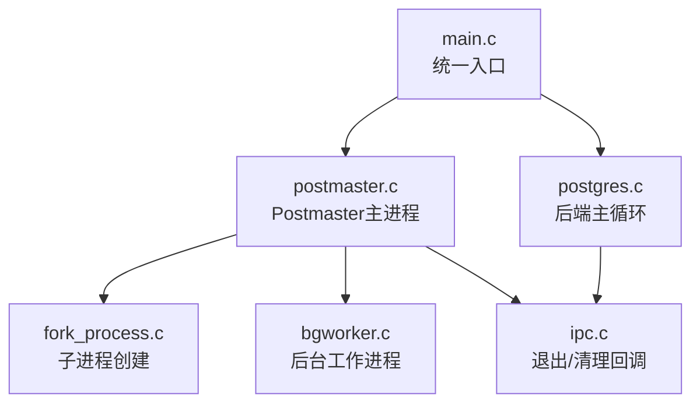
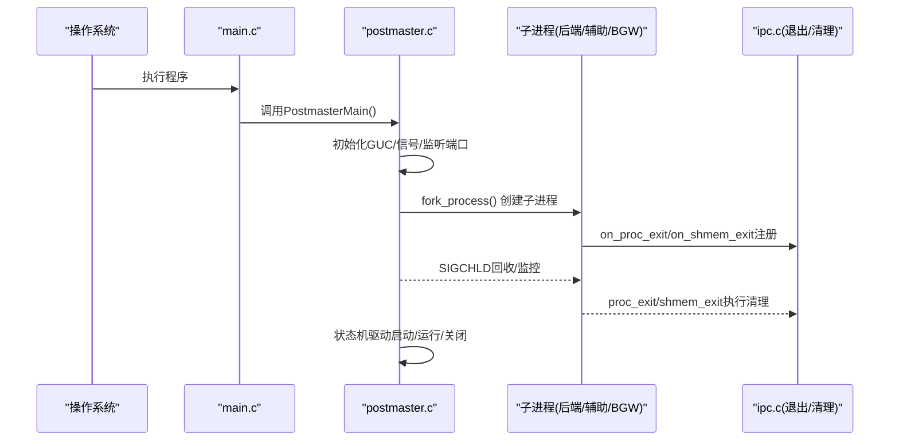
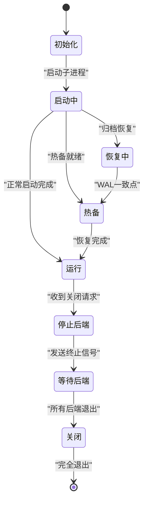
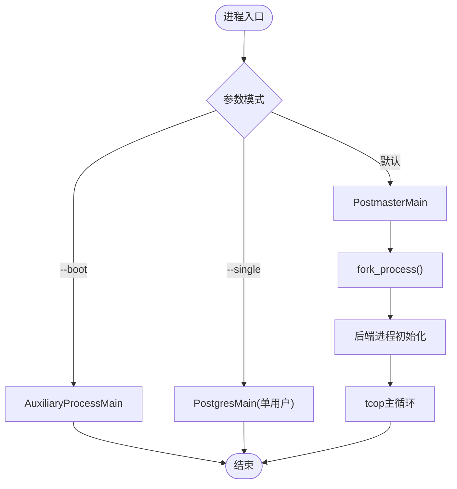
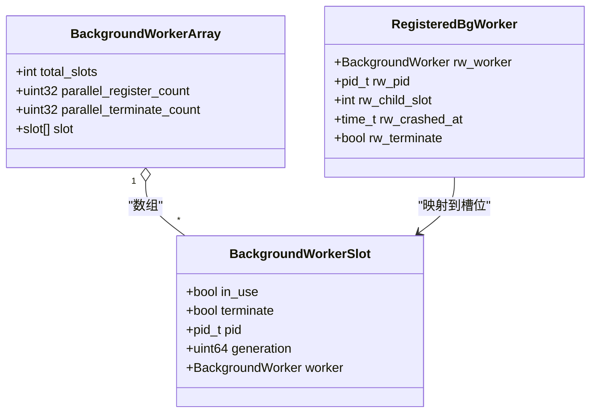
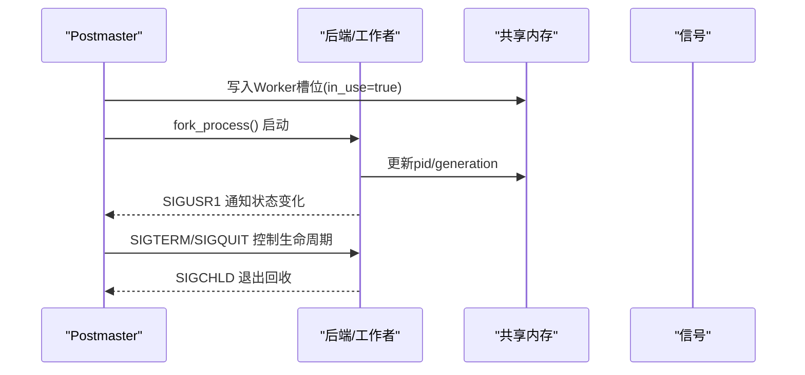
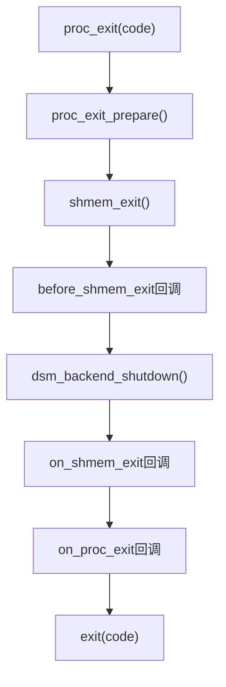
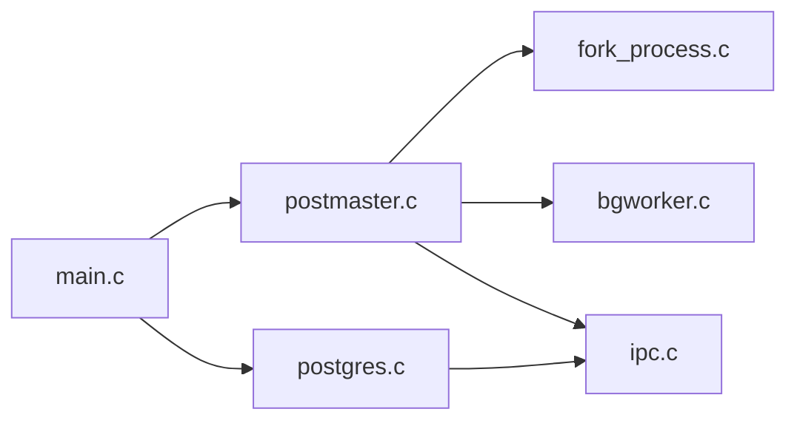

# 进程管理

<cite>
**本文引用的文件**
- [main.c](file://src/backend/main/main.c)
- [postmaster.c](file://src/backend/postmaster/postmaster.c)
- [bgworker.c](file://src/backend/postmaster/bgworker.c)
- [fork_process.c](file://src/backend/postmaster/fork_process.c)
- [ipc.c](file://src/backend/storage/ipc/ipc.c)
- [postgres.c](file://src/backend/tcop/postgres.c)
</cite>

## 目录
1. [简介](#简介)
2. [项目结构](#项目结构)
3. [核心组件](#核心组件)
4. [架构总览](#架构总览)
5. [详细组件分析](#详细组件分析)
6. [依赖关系分析](#依赖关系分析)
7. [性能考量](#性能考量)
8. [故障排查指南](#故障排查指南)
9. [结论](#结论)
10. [附录](#附录)

## 简介
本文件面向Mini PostgreSQL的进程管理系统，系统性阐述Postmaster主进程的设计原理与生命周期管理（启动、监控、重启），后端进程的创建与管理流程（单用户模式、普通后端进程、辅助进程）的差异，后台工作进程（Background Workers）的实现机制与使用场景，以及进程间通信模型（共享内存、信号量/信号、消息队列）的使用方式。文档同时提供进程状态转换图与关键数据结构说明，帮助开发者理解并扩展进程管理实现。

## 项目结构
与进程管理直接相关的代码主要分布在以下模块：
- 入口与分发：src/backend/main/main.c
- Postmaster主进程：src/backend/postmaster/postmaster.c
- 后台工作进程：src/backend/postmaster/bgworker.c
- 子进程创建封装：src/backend/postmaster/fork_process.c
- 退出与清理：src/backend/storage/ipc/ipc.c
- 后端主循环与协议处理：src/backend/tcop/postgres.c

**图示来源**
- [main.c:49-177](file://src/backend/main/main.c#L49-L177)
- [postmaster.c:407-800](file://src/backend/postmaster/postmaster.c#L407-L800)
- [fork_process.c:25-112](file://src/backend/postmaster/fork_process.c#L25-L112)
- [bgworker.c:130-202](file://src/backend/postmaster/bgworker.c#L130-L202)
- [ipc.c:104-288](file://src/backend/storage/ipc/ipc.c#L104-L288)
- [postgres.c:223-477](file://src/backend/tcop/postgres.c#L223-L477)

**章节来源**
- [main.c:49-177](file://src/backend/main/main.c#L49-L177)
- [postmaster.c:407-800](file://src/backend/postmaster/postmaster.c#L407-L800)

## 核心组件
- Postmaster主进程：负责系统级启动/关闭、共享内存初始化、监听端口、子进程生命周期管理、崩溃恢复与重启策略。
- 后端进程：包括单用户模式、普通后端进程（会话）、辅助进程（如启动、检查点、WAL写入等）。
- 后台工作进程（BGW）：可插拔的长期运行任务，支持共享内存访问、数据库连接、通知机制与自动重启。
- 进程间通信：通过共享内存、信号（SIGUSR1/SIGUSR2/SIGCHLD等）、动态共享内存段（DSM）进行协调。
- 退出与清理：统一的退出路径，确保资源释放、锁释放、DSM分离与回调执行顺序正确。

**章节来源**
- [postmaster.c:126-397](file://src/backend/postmaster/postmaster.c#L126-L397)
- [bgworker.c:74-108](file://src/backend/postmaster/bgworker.c#L74-L108)
- [ipc.c:104-288](file://src/backend/storage/ipc/ipc.c#L104-L288)

## 架构总览
PostgreSQL采用多进程架构：一个Postmaster守护多个后端与辅助进程。主进程不直接操作共享内存中的锁结构，避免自身被阻塞或崩溃；它通过信号和共享内存槽位与子进程协作。

**图示来源**
- [main.c:49-177](file://src/backend/main/main.c#L49-L177)
- [postmaster.c:407-800](file://src/backend/postmaster/postmaster.c#L407-L800)
- [fork_process.c:25-112](file://src/backend/postmaster/fork_process.c#L25-L112)
- [ipc.c:104-288](file://src/backend/storage/ipc/ipc.c#L104-L288)

## 详细组件分析

### Postmaster主进程：生命周期与状态机
- 启动阶段：解析参数、加载配置、校验数据目录与控制文件、设置信号处理器、创建监听套接字、准备共享内存槽位。
- 运行阶段：维护BackendList跟踪活跃后端/工作者；接收客户端连接后fork子进程进行认证与处理；监控子进程退出并通过SIGCHLD回收。
- 关闭/恢复：支持智能/快速/立即关闭；在崩溃时可选择重启共享内存并重建必要进程。

**图示来源**
- [postmaster.c:219-321](file://src/backend/postmaster/postmaster.c#L219-L321)

**章节来源**
- [postmaster.c:407-800](file://src/backend/postmaster/postmaster.c#L407-L800)
- [postmaster.c:219-321](file://src/backend/postmaster/postmaster.c#L219-L321)

### 后端进程：单用户、普通后端与辅助进程
- 单用户模式：由main.c根据命令行参数直接进入PostgresMain，用于交互式或脚本化维护。
- 普通后端进程：Postmaster为每个客户端连接fork子进程，子进程进行认证、初始化会话、进入tcop主循环处理协议消息。
- 辅助进程：启动、检查点、WAL写入、统计日志等专用进程，由Postmaster按类型启动并单独跟踪PID。

**图示来源**
- [main.c:169-177](file://src/backend/main/main.c#L169-L177)
- [fork_process.c:25-112](file://src/backend/postmaster/fork_process.c#L25-L112)
- [postgres.c:223-477](file://src/backend/tcop/postgres.c#L223-L477)

**章节来源**
- [main.c:169-177](file://src/backend/main/main.c#L169-L177)
- [postgres.c:223-477](file://src/backend/tcop/postgres.c#L223-L477)

### 后台工作进程（Background Workers）
- 共享内存槽位：BackgroundWorkerArray包含固定数量的槽位，使用无锁协议协调Postmaster与后端对槽位的读写（in_use/terminate/pid/generation）。
- 注册与启动：后端将Worker定义写入共享内存槽位，Postmaster周期性扫描并复制到私有列表，随后fork并启动对应函数。
- 生命周期：支持按需启动、自动重启、终止通知；并行工作者计数通过register_count与terminate_count维护上限。
- 安全约束：Postmaster不持锁访问共享内存，需保证内存屏障与原子性；对字符串字段进行安全拷贝以防损坏。

**图示来源**
- [bgworker.c:74-108](file://src/backend/postmaster/bgworker.c#L74-L108)
- [bgworker.c:130-202](file://src/backend/postmaster/bgworker.c#L130-L202)
- [bgworker.c:234-404](file://src/backend/postmaster/bgworker.c#L234-L404)

**章节来源**
- [bgworker.c:130-202](file://src/backend/postmaster/bgworker.c#L130-L202)
- [bgworker.c:234-404](file://src/backend/postmaster/bgworker.c#L234-L404)
- [bgworker.c:704-800](file://src/backend/postmaster/bgworker.c#L704-L800)

### 进程间通信模型
- 共享内存：Postmaster与后端通过共享内存槽位交换Worker信息；DSM用于动态共享内存段的生命周期管理。
- 信号：SIGCHLD用于子进程回收；SIGUSR1/SIGUSR2用于内部通知（如BGW状态变更）；SIGTERM/SIGQUIT用于优雅/强制关闭。
- 消息队列：libpq层提供消息格式与读取；后端通过SocketBackend读取前端消息并分派处理。

**图示来源**
- [bgworker.c:234-404](file://src/backend/postmaster/bgworker.c#L234-L404)
- [postmaster.c:480-489](file://src/backend/postmaster/postmaster.c#L480-L489)
- [postgres.c:339-458](file://src/backend/tcop/postgres.c#L339-L458)

**章节来源**
- [postmaster.c:480-489](file://src/backend/postmaster/postmaster.c#L480-L489)
- [postgres.c:339-458](file://src/backend/tcop/postgres.c#L339-L458)

### 退出与清理流程
- 统一退出：proc_exit()确保仅通过该函数退出，调用shmem_exit()释放锁与DSM，再执行on_proc_exit回调。
- 清理顺序：before_shmem_exit -> DSM关闭 -> on_shmem_exit -> on_proc_exit，保证资源有序释放。
- 异常保护：atexit回调兜底，防止直接exit导致资源泄漏。

**图示来源**
- [ipc.c:104-288](file://src/backend/storage/ipc/ipc.c#L104-L288)

**章节来源**
- [ipc.c:104-288](file://src/backend/storage/ipc/ipc.c#L104-L288)

## 依赖关系分析
- main.c作为统一入口，根据参数分发至不同模式，降低耦合。
- postmaster.c依赖fork_process.c进行子进程创建，依赖bgworker.c管理BGW，依赖ipc.c进行退出清理。
- postgres.c作为后端主循环，依赖libpq进行协议处理，依赖ipc.c进行退出清理。
- bgworker.c通过共享内存与Postmaster协同，避免锁竞争导致的死锁风险。

**图示来源**
- [main.c:49-177](file://src/backend/main/main.c#L49-L177)
- [postmaster.c:407-800](file://src/backend/postmaster/postmaster.c#L407-L800)
- [postgres.c:223-477](file://src/backend/tcop/postgres.c#L223-L477)

**章节来源**
- [main.c:49-177](file://src/backend/main/main.c#L49-L177)
- [postmaster.c:407-800](file://src/backend/postmaster/postmaster.c#L407-L800)
- [postgres.c:223-477](file://src/backend/tcop/postgres.c#L223-L477)

## 性能考量
- 无锁共享内存访问：BGW槽位使用in_use标志与内存屏障，避免Postmaster持锁导致的崩溃风险。
- 子进程隔离：认证与网络I/O在子进程中进行，避免阻塞影响其他客户端。
- 退出顺序优化：先释放锁与DSM，再执行用户级清理，减少死锁与资源竞争。
- OOM保护：子进程可调整OOM优先级，避免内核误杀Postmaster。

[本节为通用指导，无需特定文件引用]

## 故障排查指南
- 子进程崩溃：检查SIGCHLD处理与LogChildExit逻辑，确认是否触发重启或共享内存重建。
- BGW未启动：验证BackgroundWorkerStateChange是否正确扫描槽位，检查terminate标志与notify_pid。
- 退出卡住：确认on_proc_exit/on_shmem_exit回调是否抛出异常导致无限循环；检查DSM分离是否成功。
- 信号丢失：核对pqsignal_pm设置与SA_RESTART行为，确保ServerLoop能被信号中断。

**章节来源**
- [postmaster.c:480-489](file://src/backend/postmaster/postmaster.c#L480-L489)
- [bgworker.c:234-404](file://src/backend/postmaster/bgworker.c#L234-L404)
- [ipc.c:104-288](file://src/backend/storage/ipc/ipc.c#L104-L288)

## 结论
Mini PostgreSQL的进程管理以Postmaster为核心，通过多进程隔离、共享内存槽位与信号机制实现高可靠的服务编排。BGW提供了可扩展的后台任务框架，配合严格的退出清理流程，确保系统在异常情况下仍能稳定恢复。开发者可基于本文档的状态机、数据结构与流程图，安全地扩展进程管理与后台任务能力。

[本节为总结，无需特定文件引用]

## 附录
- 关键枚举与常量：
  - 后端类型：BACKEND_TYPE_NORMAL/AUTOVAC/BGWORKER
  - Postmaster状态：PM_INIT/PM_STARTUP/PM_RUN/PM_SHUTDOWN等
  - BGW槽位字段：in_use/terminate/pid/generation
- 参考路径：
  - 主进程入口：src/backend/main/main.c
  - Postmaster实现：src/backend/postmaster/postmaster.c
  - BGW实现：src/backend/postmaster/bgworker.c
  - 子进程创建：src/backend/postmaster/fork_process.c
  - 退出清理：src/backend/storage/ipc/ipc.c
  - 后端主循环：src/backend/tcop/postgres.c

[本节为附录，无需特定文件引用]