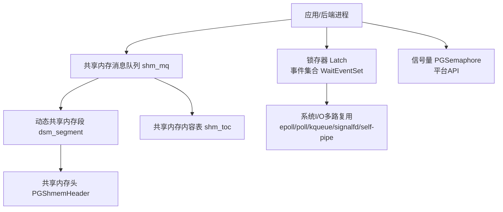
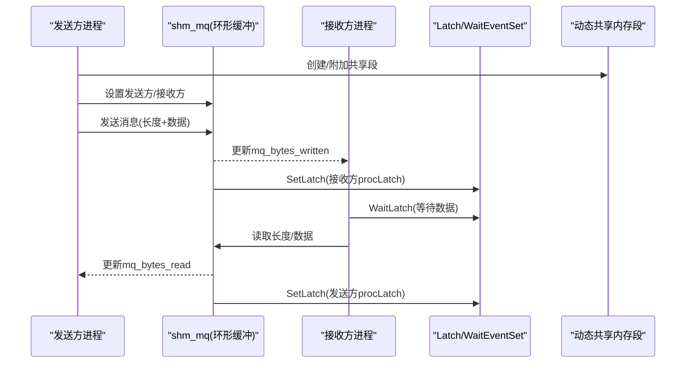
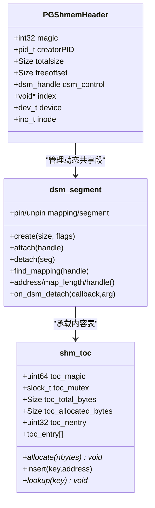
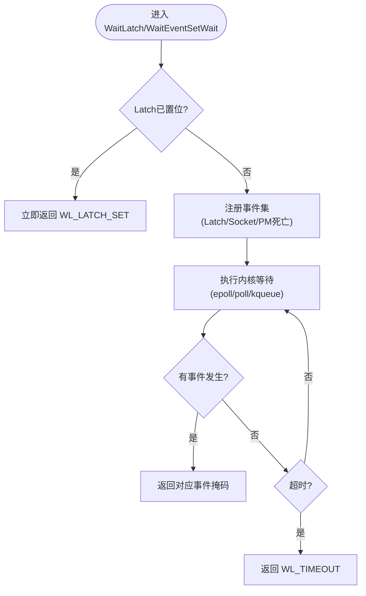
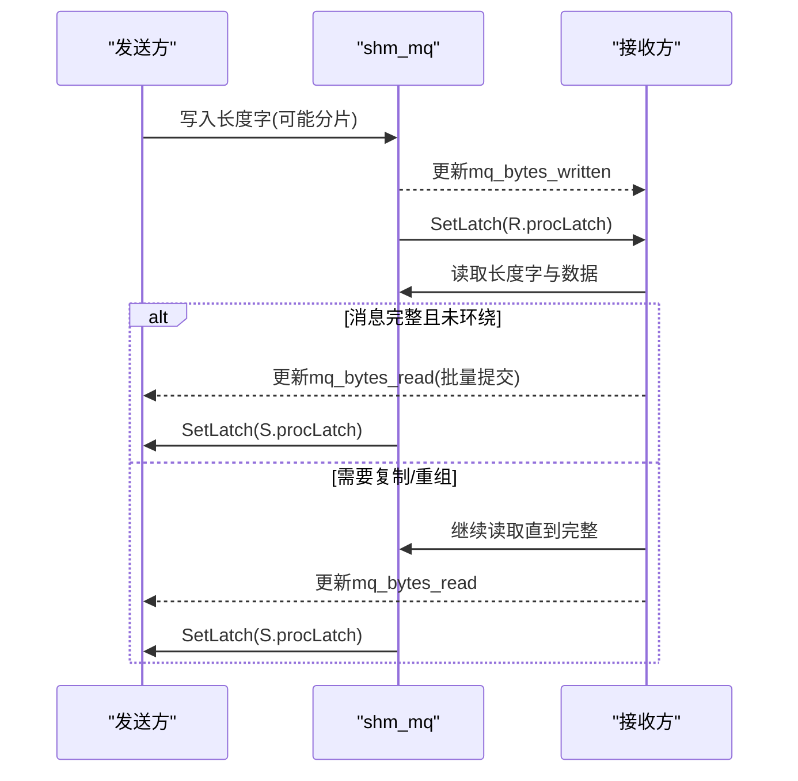
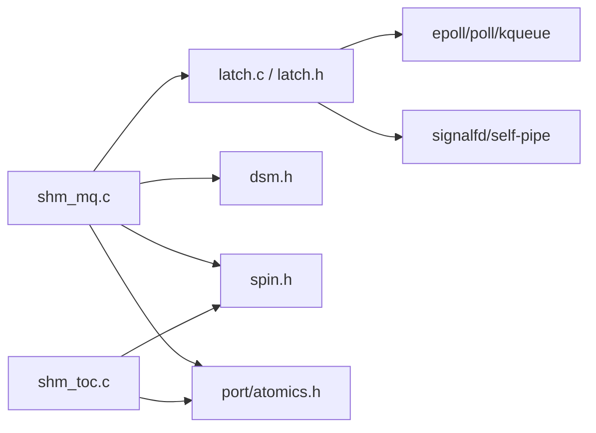

# 进程间通信

<cite>
**本文引用的文件**
- [shm_mq.h](file://src/include/storage/shm_mq.h)
- [latch.h](file://src/include/storage/latch.h)
- [pg_shmem.h](file://src/include/storage/pg_shmem.h)
- [pg_sema.h](file://src/include/storage/pg_sema.h)
- [dsm.h](file://src/include/storage/dsm.h)
- [shm_mq.c](file://src/backend/storage/ipc/shm_mq.c)
- [latch.c](file://src/backend/storage/ipc/latch.c)
- [shm_toc.c](file://src/backend/storage/ipc/shm_toc.c)
</cite>

## 目录
1. [简介](#简介)
2. [项目结构](#项目结构)
3. [核心组件](#核心组件)
4. [架构总览](#架构总览)
5. [详细组件分析](#详细组件分析)
6. [依赖关系分析](#依赖关系分析)
7. [性能考虑](#性能考虑)
8. [故障排查指南](#故障排查指南)
9. [结论](#结论)
10. [附录](#附录)

## 简介
本文面向Mini PostgreSQL的进程间通信（IPC）机制，聚焦共享内存、信号量、锁存器（Latch）、以及基于共享内存的消息队列等关键子系统。目标是帮助开发者理解：
- 共享内存段的分配与布局、并发访问控制
- 信号量的使用模式（同步、条件等待、超时处理）
- 锁存器的实现原理（事件通知、状态同步、性能优化）
- 进程间消息传递的实现（以共享内存环形缓冲为核心）
- IPC的性能考量与最佳实践

## 项目结构
Mini PostgreSQL将IPC相关能力集中在后端存储层，主要涉及以下模块：
- 共享内存抽象与动态共享内存段管理
- 锁存器（Latch）与事件集合（WaitEventSet）
- 单写者/单读者共享内存消息队列（shm_mq）
- 共享内存内容表（shm_toc），用于在共享段内定位子对象
- 平台无关的信号量API

图表来源
- [latch.c:102-142](file://src/backend/storage/ipc/latch.c#L102-L142)
- [shm_mq.c:71-82](file://src/backend/storage/ipc/shm_mq.c#L71-L82)
- [pg_shmem.h:29-40](file://src/include/storage/pg_shmem.h#L29-L40)
- [dsm.h:18-58](file://src/include/storage/dsm.h#L18-L58)
- [shm_toc.c:20-34](file://src/backend/storage/ipc/shm_toc.c#L20-L34)

章节来源
- [latch.h:105-175](file://src/include/storage/latch.h#L105-L175)
- [pg_shmem.h:29-74](file://src/include/storage/pg_shmem.h#L29-L74)
- [pg_sema.h:23-57](file://src/include/storage/pg_sema.h#L23-L57)
- [dsm.h:18-58](file://src/include/storage/dsm.h#L18-L58)
- [shm_mq.h:20-86](file://src/include/storage/shm_mq.h#L20-L86)

## 核心组件
- 共享内存与动态共享内存段
  - 通过PGShmemHeader标识全局共享段，支持多种底层实现类型（如mmap、SysV等）。
  - 动态共享内存段由dsm_*系列接口创建、附加、分离，并支持分离回调。
- 锁存器（Latch）与事件集合
  - 提供跨进程/线程的事件通知与等待，避免忙轮询；支持超时、主进程死亡检测、套接字就绪等多事件合并等待。
  - 内部根据平台选择epoll/poll/kqueue或signalfd/self-pipe等机制，保证可靠唤醒。
- 共享内存消息队列（shm_mq）
  - 单写者/单读者环形缓冲，原子计数器维护读写边界，自旋锁保护元数据，结合Latch进行高效同步。
  - 支持非阻塞模式、向量发送、自动缓冲重装配、对端分离检测。
- 共享内存内容表（shm_toc）
  - 在共享段内维护键到偏移的映射，便于不同进程按约定键查找共享数据结构位置。
- 信号量（PGSemaphore）
  - 平台无关计数信号量接口，用于更细粒度的同步原语（如条件变量底层等）。

章节来源
- [pg_shmem.h:29-74](file://src/include/storage/pg_shmem.h#L29-L74)
- [dsm.h:18-58](file://src/include/storage/dsm.h#L18-L58)
- [latch.h:105-175](file://src/include/storage/latch.h#L105-L175)
- [shm_mq.h:20-86](file://src/include/storage/shm_mq.h#L20-L86)
- [shm_toc.c:20-34](file://src/backend/storage/ipc/shm_toc.c#L20-L34)
- [pg_sema.h:23-57](file://src/include/storage/pg_sema.h#L23-L57)

## 架构总览
下图展示了Mini PostgreSQL中IPC的关键交互：后端进程通过Latch等待事件，通过shm_mq在共享内存中进行零拷贝或最小拷贝的消息传递，共享段由dsm管理，并由PGShmemHeader统一标识。

图表来源
- [shm_mq.c:320-523](file://src/backend/storage/ipc/shm_mq.c#L320-L523)
- [shm_mq.c:547-785](file://src/backend/storage/ipc/shm_mq.c#L547-L785)
- [latch.c:102-142](file://src/backend/storage/ipc/latch.c#L102-L142)
- [dsm.h:35-58](file://src/include/storage/dsm.h#L35-L58)

## 详细组件分析

### 共享内存段与布局
- 全局共享段头部包含魔数、创建者PID、总大小、空闲偏移、动态共享内存控制句柄、索引指针、设备/inode等信息，用于识别和生命周期管理。
- 动态共享内存段（dsm_segment）提供创建、附加、分离、固定/解固定、查找映射等能力，并支持在分离时触发回调，确保资源清理。
- 共享内存内容表（shm_toc）在段内维护“键→偏移”的条目，从段尾向前分配数据区，条目从段头向后增长，避免地址绝对化，提高可移植性。

图表来源
- [pg_shmem.h:29-40](file://src/include/storage/pg_shmem.h#L29-L40)
- [dsm.h:18-58](file://src/include/storage/dsm.h#L18-L58)
- [shm_toc.c:20-34](file://src/backend/storage/ipc/shm_toc.c#L20-L34)

章节来源
- [pg_shmem.h:29-74](file://src/include/storage/pg_shmem.h#L29-L74)
- [dsm.h:18-58](file://src/include/storage/dsm.h#L18-L58)
- [shm_toc.c:39-125](file://src/backend/storage/ipc/shm_toc.c#L39-L125)
- [shm_toc.c:170-200](file://src/backend/storage/ipc/shm_toc.c#L170-L200)

### 锁存器（Latch）与事件集合
- Latch是布尔型事件标志，支持Set/Reset/Wait操作，可在同一进程或跨进程设置。WaitLatch支持超时、主进程死亡检测、套接字可读/可写事件合并等待。
- WaitEventSet允许一次性注册多个事件（Latch、Socket、Postmaster死亡等），减少系统调用次数，提升高并发下的效率。
- 平台适配：Linux epoll+signalfd、kqueue、poll+self-pipe等，确保信号不会丢失且能可靠中断等待。

图表来源
- [latch.c:102-142](file://src/backend/storage/ipc/latch.c#L102-L142)
- [latch.h:118-175](file://src/include/storage/latch.h#L118-L175)

章节来源
- [latch.h:105-175](file://src/include/storage/latch.h#L105-L175)
- [latch.c:192-200](file://src/backend/storage/ipc/latch.c#L192-L200)

### 共享内存消息队列（shm_mq）
- 数据结构：环形缓冲mq_ring，原子计数器mq_bytes_read/mq_bytes_written记录已读/已写字节数；mq_mutex保护receiver/sender等元数据；mq_detached标记对端分离。
- 发送流程：写入长度字和数据块，必要时合并对齐；缓冲区满时等待接收方消费（通过SetLatch唤醒接收方，自身WaitLatch等待空间）。
- 接收流程：读取长度字与数据，若消息跨越环形缓冲则复制到本地缓冲；消费后更新mq_bytes_read并唤醒发送方。
- 非阻塞模式：nowait=true时不修改Latch状态，直接返回SHM_MQ_WOULD_BLOCK；调用方需自行在Latch被设置后重试。
- 对端分离：任一方向detach都会设置mq_detached并唤醒对方，避免死锁。

图表来源
- [shm_mq.c:320-523](file://src/backend/storage/ipc/shm_mq.c#L320-L523)
- [shm_mq.c:547-785](file://src/backend/storage/ipc/shm_mq.c#L547-L785)
- [shm_mq.c:883-1027](file://src/backend/storage/ipc/shm_mq.c#L883-L1027)
- [shm_mq.c:1038-1133](file://src/backend/storage/ipc/shm_mq.c#L1038-L1133)

章节来源
- [shm_mq.h:20-86](file://src/include/storage/shm_mq.h#L20-L86)
- [shm_mq.c:71-82](file://src/backend/storage/ipc/shm_mq.c#L71-L82)
- [shm_mq.c:169-192](file://src/backend/storage/ipc/shm_mq.c#L169-L192)
- [shm_mq.c:320-523](file://src/backend/storage/ipc/shm_mq.c#L320-L523)
- [shm_mq.c:547-785](file://src/backend/storage/ipc/shm_mq.c#L547-L785)
- [shm_mq.c:819-869](file://src/backend/storage/ipc/shm_mq.c#L819-L869)
- [shm_mq.c:883-1027](file://src/backend/storage/ipc/shm_mq.c#L883-L1027)
- [shm_mq.c:1038-1133](file://src/backend/storage/ipc/shm_mq.c#L1038-L1133)
- [shm_mq.c:1177-1224](file://src/backend/storage/ipc/shm_mq.c#L1177-L1224)

### 信号量机制
- 提供计数信号量API（创建、重置、加锁、解锁、尝试加锁），用于更细粒度的同步原语。
- 典型用法：作为条件变量的底层实现，配合共享状态与Latch实现“条件满足即唤醒”。
- 注意：信号量本身不提供超时语义，超时通常由上层WaitLatch/WaitEventSetWait提供。

章节来源
- [pg_sema.h:23-57](file://src/include/storage/pg_sema.h#L23-L57)

### 进程间消息传递机制对比
- 共享内存消息队列（shm_mq）：适用于同机高性能、低延迟、小/中消息场景；零拷贝优先，必要时本地缓冲重组。
- 管道/套接字：适合跨主机或跨网络通信；开销较大但通用性强。
- 内存映射文件：适合大对象共享、持久化共享；可通过dsm抽象统一管理生命周期。
- 在本项目中，shm_mq是首选的进程内IPC方式，结合Latch与WaitEventSet达到极低延迟与高吞吐。

[本节为概念性说明，不直接分析具体文件]

## 依赖关系分析
- shm_mq依赖：
  - Latch/WaitEventSet：用于发送/接收侧的等待与唤醒
  - dsm_segment：承载共享内存段及分离回调
  - SpinLock：保护元数据（receiver/sender）
  - 原子操作：读写计数器（mq_bytes_read/mq_bytes_written）
- Latch依赖：
  - 平台I/O多路复用（epoll/poll/kqueue）与信号处理（signalfd/self-pipe）
  - Postmaster信号：主进程死亡检测
- shm_toc依赖：
  - SpinLock：保护TOC条目与分配状态
  - 原子/内存屏障：确保可见性与顺序

图表来源
- [shm_mq.c:71-82](file://src/backend/storage/ipc/shm_mq.c#L71-L82)
- [latch.c:102-142](file://src/backend/storage/ipc/latch.c#L102-L142)
- [dsm.h:18-58](file://src/include/storage/dsm.h#L18-L58)
- [shm_toc.c:20-34](file://src/backend/storage/ipc/shm_toc.c#L20-L34)

章节来源
- [shm_mq.c:71-82](file://src/backend/storage/ipc/shm_mq.c#L71-L82)
- [latch.c:102-142](file://src/backend/storage/ipc/latch.c#L102-L142)
- [dsm.h:18-58](file://src/include/storage/dsm.h#L18-L58)
- [shm_toc.c:20-34](file://src/backend/storage/ipc/shm_toc.c#L20-L34)

## 性能考虑
- 共享内存消息队列
  - 尽量保持消息小于环形缓冲以避免复制；超长消息会触发本地缓冲重组。
  - 批量提交消费（consume_pending）以减少SetLatch频率，降低唤醒开销。
  - 使用原子计数器与内存屏障精确控制可见性，避免不必要的锁竞争。
  - 非阻塞模式(nowait)适合事件驱动循环，避免阻塞上下文切换。
- 锁存器与事件集合
  - 使用WaitEventSet合并多个事件，减少系统调用次数。
  - 合理设置超时，避免忙轮询；仅在必要时使用短超时。
  - 利用主进程死亡检测快速退出，避免僵尸等待。
- 动态共享内存段
  - 合理使用on_dsm_detach回调确保资源释放，避免泄漏。
  - 大对象共享优先考虑内存映射文件，减少拷贝。
- 信号量
  - 仅用于必要的细粒度同步；多数情况下用Latch+共享状态更高效。

[本节提供一般性指导，不直接分析具体文件]

## 故障排查指南
- 发送方无法唤醒接收方
  - 检查是否设置了接收方（shm_mq_set_receiver）并在发送完成后调用SetLatch。
  - 确认接收方正在WaitLatch并正确ResetLatch。
- 接收方一直阻塞
  - 检查发送方是否成功写入并更新mq_bytes_written。
  - 确认对端未提前detach（mq_detached为true会导致返回SHM_MQ_DETACHED）。
- 非阻塞模式下频繁返回WILL_BLOCK
  - 调整事件循环策略，确保在Latch被设置后立即重试。
  - 评估消息大小与环形缓冲大小，必要时增大缓冲或拆分消息。
- 主进程死亡导致子进程卡住
  - 使用WL_EXIT_ON_PM_DEATH或WaitEventSet中的PM死亡事件，确保及时退出。

章节来源
- [shm_mq.c:320-523](file://src/backend/storage/ipc/shm_mq.c#L320-L523)
- [shm_mq.c:547-785](file://src/backend/storage/ipc/shm_mq.c#L547-L785)
- [shm_mq.c:819-869](file://src/backend/storage/ipc/shm_mq.c#L819-L869)
- [latch.c:102-142](file://src/backend/storage/ipc/latch.c#L102-L142)

## 结论
Mini PostgreSQL的IPC体系以共享内存为核心，结合Latch与WaitEventSet实现高效、可靠的进程间同步与通知；shm_mq提供高性能的单写者/单读者消息通道，shm_toc简化共享段内对象定位；动态共享内存段抽象屏蔽了底层差异。遵循本文的最佳实践，可在保证正确性的前提下获得极低的延迟与高吞吐。

[本节为总结性内容，不直接分析具体文件]

## 附录
- 术语
  - 共享内存：操作系统提供的多进程可访问的内存区域
  - 锁存器（Latch）：跨进程/线程的事件标志与等待机制
  - 动态共享内存段（DSM）：可动态创建/附加/分离的共享内存单元
  - 环形缓冲：首尾相接的循环缓冲区，常用于生产者-消费者模型
- 参考路径
  - 共享内存头定义：[pg_shmem.h:29-40](file://src/include/storage/pg_shmem.h#L29-L40)
  - 动态共享内存接口：[dsm.h:18-58](file://src/include/storage/dsm.h#L18-L58)
  - 锁存器接口：[latch.h:105-175](file://src/include/storage/latch.h#L105-L175)
  - 消息队列接口：[shm_mq.h:20-86](file://src/include/storage/shm_mq.h#L20-L86)
  - 共享内存内容表：[shm_toc.c:39-125](file://src/backend/storage/ipc/shm_toc.c#L39-L125)