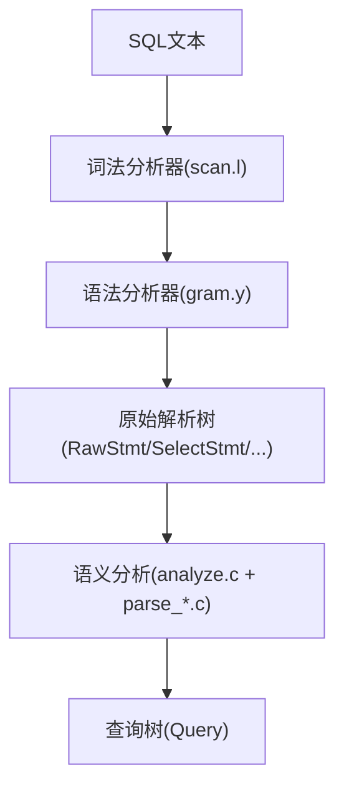
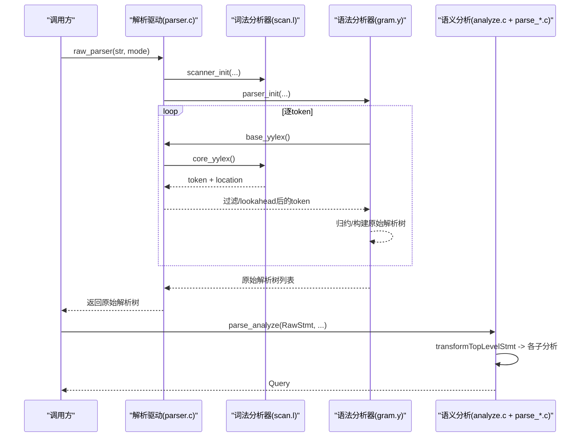
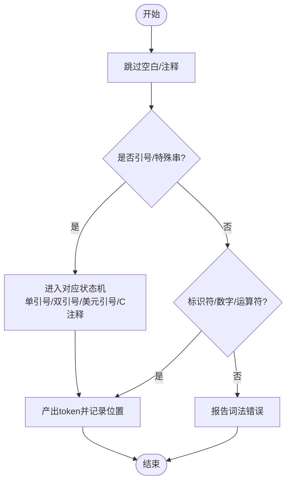
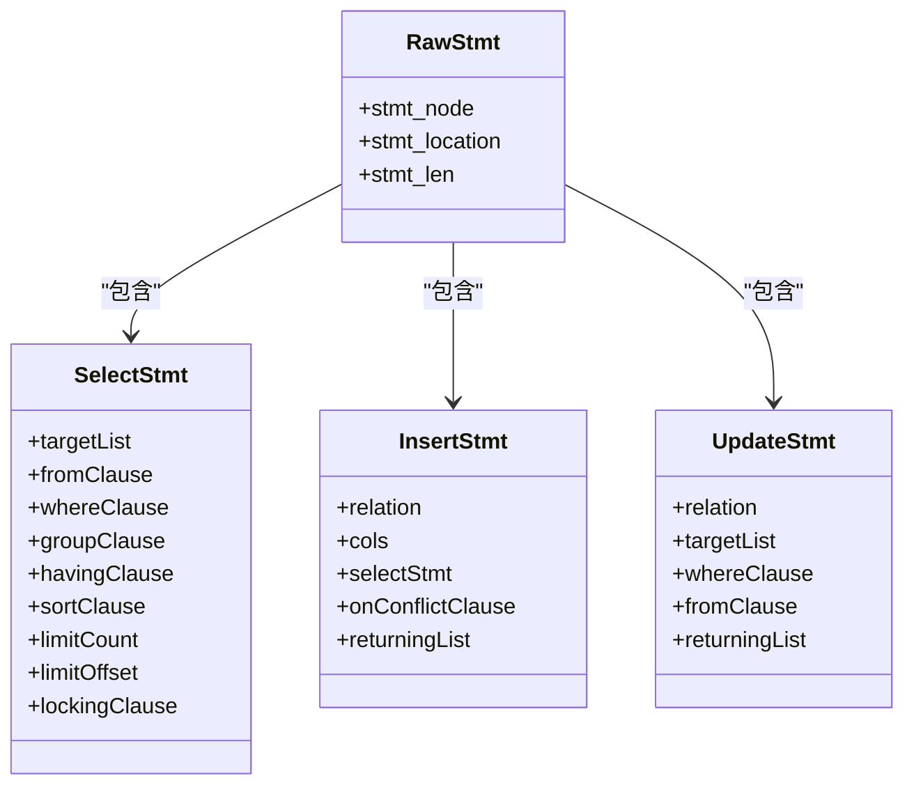
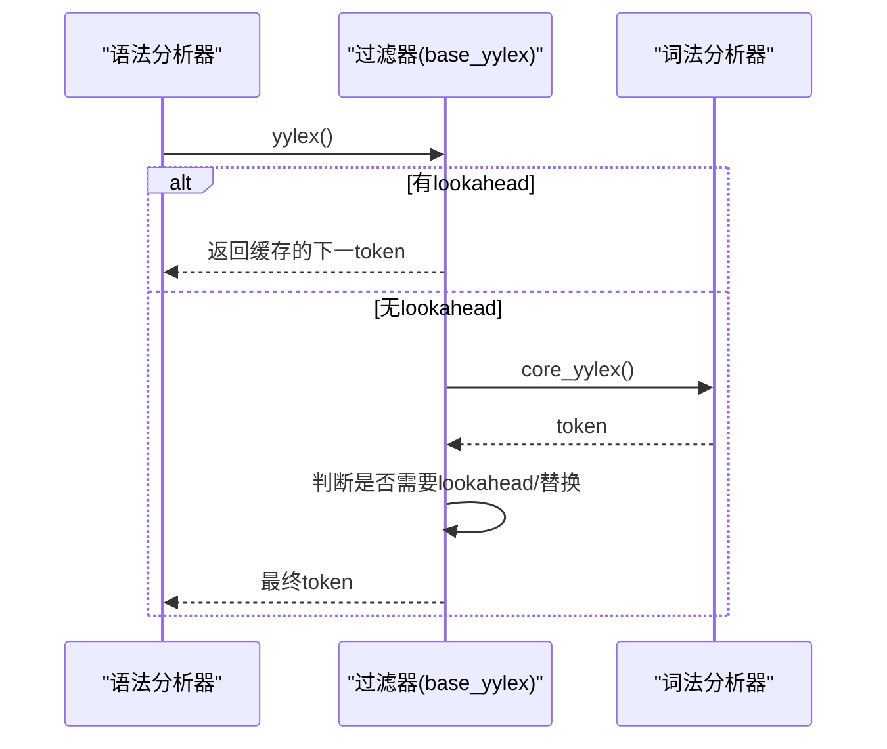
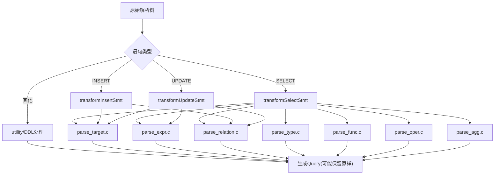
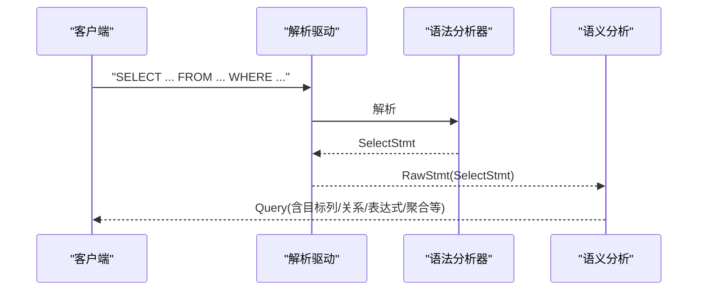
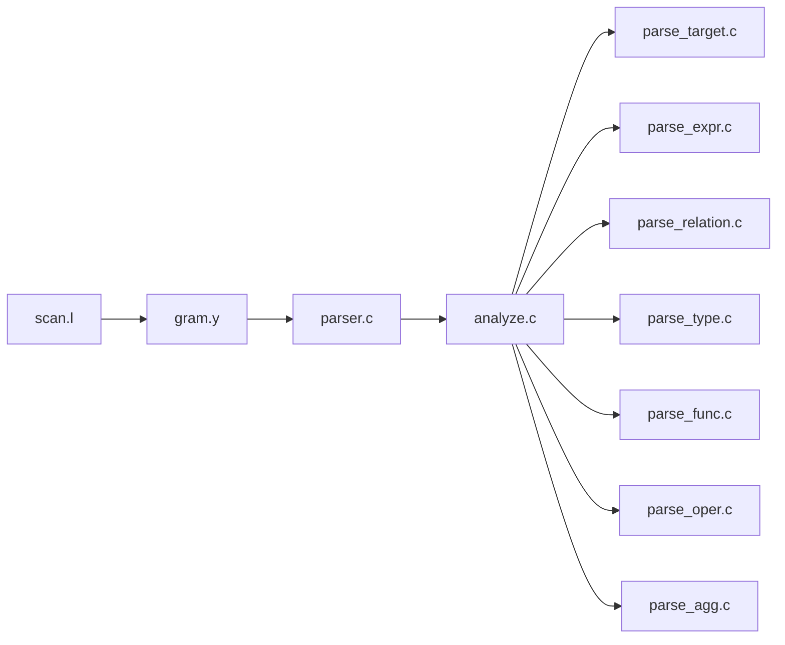

# SQL解析器

<cite>
**本文引用的文件**
- [gram.y](file://src/backend/parser/gram.y)
- [scan.l](file://src/backend/parser/scan.l)
- [parser.c](file://src/backend/parser/parser.c)
- [analyze.c](file://src/backend/parser/analyze.c)
- [parse_clause.c](file://src/backend/parser/parse_clause.c)
- [parse_expr.c](file://src/backend/parser/parse_expr.c)
- [parse_target.c](file://src/backend/parser/parse_target.c)
- [parse_relation.c](file://src/backend/parser/parse_relation.c)
- [parse_type.c](file://src/backend/parser/parse_type.c)
- [parse_func.c](file://src/backend/parser/parse_func.c)
- [parse_oper.c](file://src/backend/parser/parse_oper.c)
- [parse_agg.c](file://src/backend/parser/parse_agg.c)
- [parse_utilcmd.c](file://src/backend/parser/parse_utilcmd.c)
- [parser.h](file://src/include/parser/parser.h)
</cite>

## 更新摘要
**所做更改**
- 更新了语义分析章节，反映移除`transformOptionalSelectInto`包装函数的重构
- 简化了语句转换流程的说明，强调内部调用结构更加直接
- 保持了外部行为不变的前提下，提升了代码可维护性的描述

## 目录
1. [简介](#简介)
2. [项目结构](#项目结构)
3. [核心组件](#核心组件)
4. [架构总览](#架构总览)
5. [详细组件分析](#详细组件分析)
6. [依赖关系分析](#依赖关系分析)
7. [性能考量](#性能考量)
8. [故障排查指南](#故障排查指南)
9. [结论](#结论)
10. [附录](#附录)

## 简介
本文件面向PostgreSQL风格的SQL解析器，系统性说明从词法分析、语法分析到语义分析的完整流程。重点包括：
- 词法分析器如何将SQL字符串切分为标记流（关键字识别、数据类型字面量、错误检测）
- 语法分析器如何使用Bison规则构建抽象语法树（AST），覆盖SELECT、INSERT、UPDATE等复杂语句
- 语义分析阶段如何验证语法正确性并生成中间表示（Query）
- 提供解析流程图与常见SQL语法的解析示例
- 给出性能优化技巧与调试方法

## 项目结构
本项目采用分层组织：
- 词法层：基于Flex的扫描器，负责将输入文本切分为token，处理字符串、标识符、数字、注释、转义序列等
- 语法层：基于Bison的语法文件，定义SQL文法，将token流规约为原始解析树（RawStmt/SelectStmt/InsertStmt/UpdateStmt等）
- 入口驱动：统一初始化扫描器与解析器，协调一次解析过程
- 语义分析：将原始解析树转换为可优化的查询树（Query），进行名称解析、类型检查、函数/操作符解析、聚合校验等
- 辅助模块：按职责拆分的目标列、表达式、关系、类型、函数、操作符、DDL/DML工具命令等

**图示来源**
- [scan.l:1-120](file://src/backend/parser/scan.l#L1-L120)
- [gram.y:676-784](file://src/backend/parser/gram.y#L676-L784)
- [parser.c:41-82](file://src/backend/parser/parser.c#L41-L82)
- [analyze.c:97-128](file://src/backend/parser/analyze.c#L97-L128)

**章节来源**
- [scan.l:1-120](file://src/backend/parser/scan.l#L1-L120)
- [gram.y:676-784](file://src/backend/parser/gram.y#L676-L784)
- [parser.c:41-82](file://src/backend/parser/parser.c#L41-L82)
- [analyze.c:97-128](file://src/backend/parser/analyze.c#L97-L128)

## 核心组件
- 词法分析器（scanner）：实现无回溯匹配、多状态机（单引号串、双引号标识符、美元引号、C风格注释、十六进制/二进制字面量、Unicode转义等），输出标准token并维护位置信息
- 语法分析器（grammar）：使用Bison声明非终结符、优先级与结合性，定义SQL文法规则，构造原始解析节点
- 解析驱动（driver）：raw_parser()初始化扫描器与解析器，调用base_yylex过滤与lookahead处理，返回原始解析树
- 语义分析（analysis）：transformTopLevelStmt分发各语句类型，逐步完成目标列、表达式、关系、类型、函数、操作符、聚合等的语义检查，生成Query

**章节来源**
- [scan.l:162-200](file://src/backend/parser/scan.l#L162-L200)
- [gram.y:608-666](file://src/backend/parser/gram.y#L608-L666)
- [parser.c:86-105](file://src/backend/parser/parser.c#L86-L105)
- [analyze.c:191-200](file://src/backend/parser/analyze.c#L191-L200)

## 架构总览
下图展示从SQL文本到查询树的端到端流程，以及关键组件间的交互。

**图示来源**
- [parser.c:41-82](file://src/backend/parser/parser.c#L41-L82)
- [parser.c:106-293](file://src/backend/parser/parser.c#L106-L293)
- [gram.y:676-784](file://src/backend/parser/gram.y#L676-L784)
- [analyze.c:97-128](file://src/backend/parser/analyze.c#L97-L128)

## 详细组件分析

### 词法分析器（scan.l）
- 设计要点
  - 无回溯匹配：通过合理组织规则顺序与"失败"占位规则，避免backtracking，提升性能
  - 多状态机：支持多种引号与注释状态（单引号串、双引号标识符、美元引号、C风格注释、扩展字符串、Unicode转义等）
  - 位置追踪：每个token设置yylloc，便于错误定位
  - 关键字映射：通过ScanKeywordTokens将关键词映射为Bison token
- 关键字识别
  - 在扫描阶段将SQL关键字识别为相应token，供语法层使用
- 数据类型处理
  - 整数、浮点、十六进制、二进制、字符/字节串、带Unicode转义的字符串等字面量均被识别并规范化
- 语法错误检测
  - 未终止的字符串、注释、标识符；非法Unicode转义；不安全的转义序列等均在扫描阶段报错

**图示来源**
- [scan.l:162-200](file://src/backend/parser/scan.l#L162-L200)
- [scan.l:418-800](file://src/backend/parser/scan.l#L418-L800)

**章节来源**
- [scan.l:1-120](file://src/backend/parser/scan.l#L1-L120)
- [scan.l:162-200](file://src/backend/parser/scan.l#L162-L200)
- [scan.l:418-800](file://src/backend/parser/scan.l#L418-L800)

### 语法分析器（gram.y）
- 文法与优先级
  - 通过%left/%right/%nonassoc定义运算符优先级与结合性，确保表达式、集合操作、连接等正确解析
- 语句入口
  - stmtmulti/toplevel_stmt/stmt 将SQL语句拆分为RawStmt列表，包裹起止位置
- SELECT语句
  - select_no_parens/select_with_parens/simple_select 组合出目标列、FROM/WHERE/GROUP/HAVING、排序、限制、锁等
  - 集合操作（UNION/INTERSECT/EXCEPT）在本仓库中显式拒绝（minipg特性）
- INSERT/UPDATE/DELETE
  - 由stmt规则直接指向InsertStmt/UpdateStmt/DeleteStmt等非终结符，具体规则位于gram.y后续部分
- 错误与位置
  - 通过parser_errposition与scanner_yyerror配合，精确定位语法错误

**图示来源**
- [gram.y:676-784](file://src/backend/parser/gram.y#L676-L784)
- [gram.y:5345-5539](file://src/backend/parser/gram.y#L5345-L5539)

**章节来源**
- [gram.y:608-666](file://src/backend/parser/gram.y#L608-L666)
- [gram.y:676-784](file://src/backend/parser/gram.y#L676-L784)
- [gram.y:5345-5539](file://src/backend/parser/gram.y#L5345-L5539)

### 解析驱动（parser.c）
- raw_parser()
  - 初始化扫描器与解析器，根据模式注入lookahead token
  - 调用base_yyparse完成解析，清理资源并返回原始解析树
- base_yylex()过滤器
  - 处理NOT_LA、NULLS_LA、WITH_LA等需要前瞻的token
  - 处理U&''/U&"" Unicode字符串，执行转义转换与截断
  - 保证语法保持LALR(1)，减少冲突

**图示来源**
- [parser.c:41-82](file://src/backend/parser/parser.c#L41-L82)
- [parser.c:106-293](file://src/backend/parser/parser.c#L106-L293)

**章节来源**
- [parser.c:41-82](file://src/backend/parser/parser.c#L41-L82)
- [parser.c:86-105](file://src/backend/parser/parser.c#L86-L105)
- [parser.c:106-293](file://src/backend/parser/parser.c#L106-L293)

### 语义分析（analyze.c + parse_*.c）
- 入口
  - parse_analyze()/parse_sub_analyze()创建ParseState，调用transformTopLevelStmt分发
- 语句变换
  - transformSelectStmt/transformInsertStmt/transformUpdateStmt等将原始解析树转为Query
- **更新** 移除了不必要的包装函数transformOptionalSelectInto，简化了语句转换流程。虽然外部行为保持不变，但内部调用结构更加直接，提升了代码可维护性。
- 子模块职责
  - parse_target.c：目标列解析与别名处理
  - parse_expr.c：表达式解析、类型推断、强制转换
  - parse_relation.c：表名/别名解析、范围变量、JOIN解析
  - parse_type.c：类型名解析、修饰符处理
  - parse_func.c：函数名解析、参数类型推导
  - parse_oper.c：操作符解析与重载选择
  - parse_agg.c：聚合函数约束检查（如GROUP BY要求）
  - parse_utilcmd.c：工具命令（DDL/DCL等）的轻量分析

**图示来源**
- [analyze.c:97-128](file://src/backend/parser/analyze.c#L97-L128)
- [analyze.c:191-200](file://src/backend/parser/analyze.c#L191-L200)

**章节来源**
- [analyze.c:97-128](file://src/backend/parser/analyze.c#L97-L128)
- [analyze.c:191-200](file://src/backend/parser/analyze.c#L191-L200)

### 典型SQL解析示例
- SELECT语句
  - 语法层：simple_select 组合目标列、FROM/WHERE/GROUP/HAVING，再叠加排序、限制、锁等
  - 语义层：目标列解析、表达式求值、关系解析、类型检查、聚合约束校验
- INSERT语句
  - 语法层：InsertStmt 关联目标表、列清单、VALUES或SELECT子句、ON CONFLICT、RETURNING
  - 语义层：列存在性与类型匹配、默认值处理、冲突策略解析
- UPDATE语句
  - 语法层：UpdateStmt 指定目标表、SET目标列表达式、WHERE条件、可选FROM/RETURNING
  - 语义层：表达式类型检查、关系解析、权限与可见性（由上层决定）

**图示来源**
- [gram.y:5345-5539](file://src/backend/parser/gram.y#L5345-L5539)
- [analyze.c:97-128](file://src/backend/parser/analyze.c#L97-L128)

**章节来源**
- [gram.y:5345-5539](file://src/backend/parser/gram.y#L5345-L5539)
- [analyze.c:97-128](file://src/backend/parser/analyze.c#L97-L128)

## 依赖关系分析
- 组件耦合
  - 词法层对语法层仅暴露token接口，低耦合
  - 语法层依赖公共节点类型与工具函数（makeNode等）
  - 语义分析强依赖各parse_*模块，按职责解耦
- 外部依赖
  - 节点系统（nodes）、类型系统（catalog/utils）、错误报告（utils/error）
- 循环依赖
  - 通过头文件隔离与模块化组织避免循环

**图示来源**
- [parser.h:21-51](file://src/include/parser/parser.h#L21-L51)
- [analyze.c:25-53](file://src/backend/parser/analyze.c#L25-L53)

**章节来源**
- [parser.h:21-51](file://src/include/parser/parser.h#L21-L51)
- [analyze.c:25-53](file://src/backend/parser/analyze.c#L25-L53)

## 性能考量
- 词法层
  - 无回溯匹配：减少回退开销，提高吞吐
  - 状态机复用：减少重复逻辑，降低表大小
  - 位置计算延迟：仅在必要时更新yylloc
- 语法层
  - 明确优先级与结合性：避免冲突与多余规约
  - 最小化lookahead：通过过滤器集中处理，保持LALR(1)
- 语义层
  - 按需解析：仅在需要时解析类型/函数/操作符
  - 缓存与重用：利用ParseState上下文减少重复查找
  - **更新** 移除不必要的包装函数减少了函数调用开销，简化了调用链
- 内存管理
  - 解析期使用palloc/pfree，避免泄漏
  - 大查询分块处理（应用层）

## 故障排查指南
- 词法错误
  - 未终止字符串/注释/标识符：检查引号配对与状态机退出
  - 非法Unicode转义：确认U&''格式与转义字符合法性
- 语法错误
  - 关键字冲突/歧义：检查优先级与lookahead替换（NOT_LA/NULLS_LA/WITH_LA）
  - 集合操作不支持：minipg中显式拒绝UNION/INTERSECT/EXCEPT
- 语义错误
  - 目标列/表达式类型不匹配：查看parse_target.c/parse_expr.c的错误路径
  - 聚合函数误用：检查parse_agg.c中的GROUP BY约束
- 调试建议
  - 启用bison调试（YYDEBUG）观察移进/规约
  - 打印token流（在base_yylex前后加日志）
  - 使用psql的EXPLAIN/ERROR位置信息定位问题

**章节来源**
- [scan.l:418-800](file://src/backend/parser/scan.l#L418-L800)
- [parser.c:106-293](file://src/backend/parser/parser.c#L106-L293)
- [gram.y:5476-5493](file://src/backend/parser/gram.y#L5476-L5493)

## 结论
该SQL解析器以清晰的三层架构（词法、语法、语义）实现了健壮且可扩展的解析能力。词法层通过状态机与无回溯策略保障性能；语法层通过严谨的文法与优先级控制构建原始解析树；语义层通过模块化子分析完成类型、函数、操作符与聚合等校验，最终生成Query供后续优化与执行。**更新** 最近的重构移除了不必要的包装函数transformOptionalSelectInto，简化了语句转换流程，在保持外部行为不变的同时提升了代码可维护性和执行效率。针对minipg的特性（如禁用集合操作），在语法层即给出友好提示，提升用户体验。

## 附录
- 常用命令入口
  - raw_parser：获取原始解析树
  - parse_analyze：生成Query
- 参考文件
  - 词法：scan.l
  - 语法：gram.y
  - 驱动：parser.c
  - 语义：analyze.c 与各parse_*.c