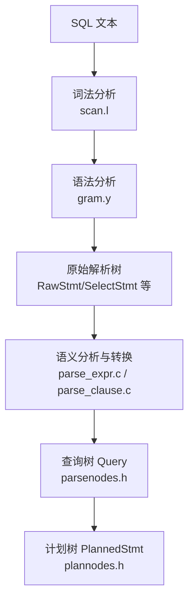
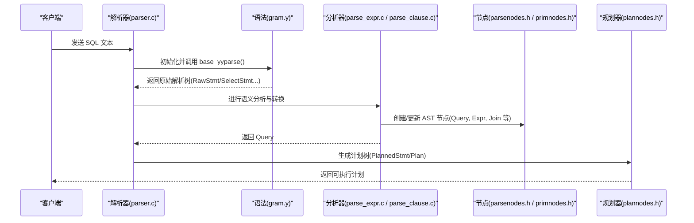
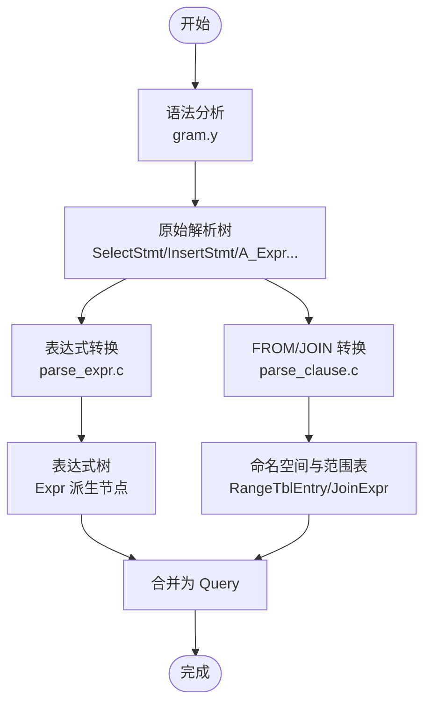
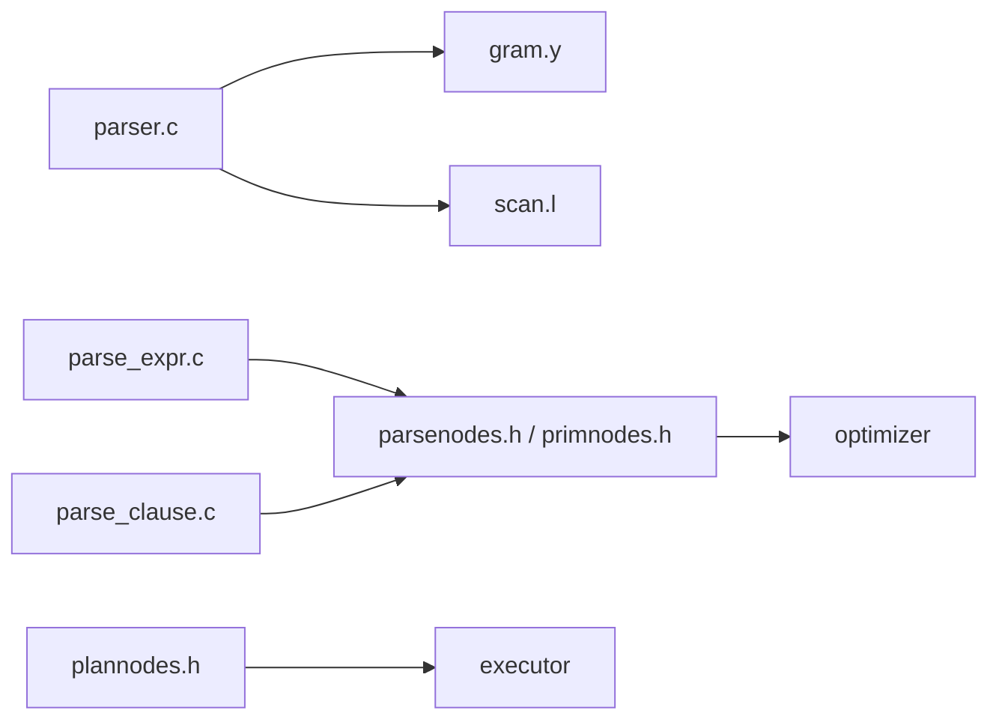

# 抽象语法树生成

<cite>
**本文引用的文件**
- [src/include/nodes/parsenodes.h](file://src/include/nodes/parsenodes.h)
- [src/include/nodes/primnodes.h](file://src/include/nodes/primnodes.h)
- [src/include/nodes/plannodes.h](file://src/include/nodes/plannodes.h)
- [src/backend/parser/gram.y](file://src/backend/parser/gram.y)
- [src/backend/parser/parser.c](file://src/backend/parser/parser.c)
- [src/backend/parser/parse_expr.c](file://src/backend/parser/parse_expr.c)
- [src/backend/parser/parse_clause.c](file://src/backend/parser/parse_clause.c)
</cite>

## 目录
1. [简介](#简介)
2. [项目结构](#项目结构)
3. [核心组件](#核心组件)
4. [架构总览](#架构总览)
5. [详细组件分析](#详细组件分析)
6. [依赖关系分析](#依赖关系分析)
7. [性能考量](#性能考量)
8. [故障排查指南](#故障排查指南)
9. [结论](#结论)
10. [附录](#附录)

## 简介
本文件系统性阐述 PostgreSQL 中从 SQL 文本到抽象语法树（AST）的生成过程，覆盖节点类型定义、数据结构设计、语法规则到 AST 节点的转换流程、层次结构构建、遍历与操作接口（复制、修改、序列化），以及常见 SQL 语句的 AST 表示示例和扩展实践。文档面向不同技术背景的读者，提供由浅入深的说明与图示。

## 项目结构
PostgreSQL 的解析与 AST 相关代码主要分布在以下位置：
- 节点定义：位于 include/nodes 下的头文件，如 parsenodes.h（解析阶段节点）、primnodes.h（可执行表达式节点）、plannodes.h（计划节点）。
- 解析器：backend/parser 下的 gram.y（Bison 语法）、parser.c（入口驱动）、parse_expr.c（表达式转换）、parse_clause.c（子句与 FROM/JOIN 处理）。

**图表来源**
- [src/backend/parser/parser.c:34-82](file://src/backend/parser/parser.c#L34-L82)
- [src/backend/parser/gram.y:1-180](file://src/backend/parser/gram.y#L1-L180)
- [src/include/nodes/parsenodes.h:112-178](file://src/include/nodes/parsenodes.h#L112-L178)
- [src/include/nodes/plannodes.h:31-89](file://src/include/nodes/plannodes.h#L31-L89)

**章节来源**
- [src/backend/parser/parser.c:34-82](file://src/backend/parser/parser.c#L34-L82)
- [src/backend/parser/gram.y:1-180](file://src/backend/parser/gram.y#L1-L180)
- [src/include/nodes/parsenodes.h:112-178](file://src/include/nodes/parsenodes.h#L112-L178)
- [src/include/nodes/plannodes.h:31-89](file://src/include/nodes/plannodes.h#L31-L89)

## 核心组件
- 解析阶段节点（parsenodes.h）：描述 SQL 语法结构的原始节点，如 Query、RangeVar、A_Expr、FuncCall、ResTarget、SortBy、JoinExpr 等。这些节点在语法分析后形成“原始解析树”，随后由分析器转换为更语义化的结构。
- 可执行表达式节点（primnodes.h）：用于表达式求值的通用基类 Expr 及其派生节点，如 Var、Const、Param、Aggref、FuncExpr、OpExpr、BoolExpr、SubLink/SubPlan 等。
- 计划节点（plannodes.h）：规划阶段的输出 PlannedStmt 及 Plan 树，包含成本估计、并行信息、目标列、条件等。

关键要点：
- Query 是优化语句的核心容器，包含命令类型、范围表、连接树、目标列表、分组、排序、限制等。
- RangeTblEntry 表示范围表条目，支持普通关系、子查询、函数、VALUES、JOIN 等多种来源。
- JoinExpr 表达显式 JOIN 语义（含 USING/NATURAL、ON 条件、连接类型）。
- 表达式节点以 Expr 为基类，统一了函数调用、运算符、聚合、子查询等的表示。

**章节来源**
- [src/include/nodes/parsenodes.h:112-178](file://src/include/nodes/parsenodes.h#L112-L178)
- [src/include/nodes/parsenodes.h:721-869](file://src/include/nodes/parsenodes.h#L721-L869)
- [src/include/nodes/primnodes.h:82-156](file://src/include/nodes/primnodes.h#L82-L156)
- [src/include/nodes/primnodes.h:274-332](file://src/include/nodes/primnodes.h#L274-L332)
- [src/include/nodes/primnodes.h:427-485](file://src/include/nodes/primnodes.h#L427-L485)
- [src/include/nodes/primnodes.h:556-701](file://src/include/nodes/primnodes.h#L556-L701)
- [src/include/nodes/plannodes.h:31-89](file://src/include/nodes/plannodes.h#L31-L89)

## 架构总览
从 SQL 文本到 AST 的关键步骤：
1. 词法分析：将输入字符串切分为 token。
2. 语法分析：依据 gram.y 规则将 token 归约为原始解析树（RawStmt/SelectStmt/InsertStmt/UpdateStmt/DeleteStmt 等）。
3. 语义分析与转换：将原始解析树转换为语义明确的中间结构（Query、表达式树、FROM/JOIN 命名空间等）。
4. 规划与执行：生成计划树（PlannedStmt/Plan）并执行。

**图表来源**
- [src/backend/parser/parser.c:34-82](file://src/backend/parser/parser.c#L34-L82)
- [src/backend/parser/gram.y:1-180](file://src/backend/parser/gram.y#L1-L180)
- [src/backend/parser/parse_expr.c:84-106](file://src/backend/parser/parse_expr.c#L84-L106)
- [src/backend/parser/parse_clause.c:96-146](file://src/backend/parser/parse_clause.c#L96-L146)
- [src/include/nodes/parsenodes.h:112-178](file://src/include/nodes/parsenodes.h#L112-L178)
- [src/include/nodes/plannodes.h:31-89](file://src/include/nodes/plannodes.h#L31-L89)

## 详细组件分析

### 节点类型与数据结构设计
- Query（查询树）：封装 SELECT/INSERT/UPDATE/DELETE 的完整语义，包括 rtable（范围表）、jointree（连接树）、targetList（目标列表）、groupClause/havingQual（分组与过滤）、sortClause（排序）、limitOffset/limitCount（限制）等。
- RangeTblEntry（范围表条目）：表示 FROM 中的各种来源（关系、子查询、函数、VALUES、JOIN），包含别名、权限位、采样信息等。
- JoinExpr（连接表达式）：表示显式 JOIN，包含连接类型、USING/NATURAL、ON 条件、左右输入等。
- 表达式节点（Expr 派生）：
  - Var：变量/列引用，携带关系索引与属性号。
  - Const：常量值，包含类型信息与空值标志。
  - Param：参数占位符，区分外部参数、执行期参数、子链接输出等。
  - Aggref：聚合函数，包含直接参数、聚合参数、ORDER BY/DISTINCT/FILTER 等。
  - FuncExpr/OpExpr：函数调用与运算符调用，记录 OID、结果类型、排序规则等。
  - BoolExpr：布尔逻辑 AND/OR/NOT。
  - SubLink/SubPlan：子查询表达式与可执行子计划。

复杂度与特性：
- 列表与集合：大量使用 List/Bitmapset 表示可变长度结构与位集，便于高效合并与检查。
- 类型与排序规则：多数节点携带 Oid 与 collation，确保类型安全与排序一致性。
- 位置信息：location 字段用于错误定位与调试。

**章节来源**
- [src/include/nodes/parsenodes.h:112-178](file://src/include/nodes/parsenodes.h#L112-L178)
- [src/include/nodes/parsenodes.h:721-869](file://src/include/nodes/parsenodes.h#L721-L869)
- [src/include/nodes/primnodes.h:82-156](file://src/include/nodes/primnodes.h#L82-L156)
- [src/include/nodes/primnodes.h:274-332](file://src/include/nodes/primnodes.h#L274-L332)
- [src/include/nodes/primnodes.h:427-485](file://src/include/nodes/primnodes.h#L427-L485)
- [src/include/nodes/primnodes.h:556-701](file://src/include/nodes/primnodes.h#L556-L701)

### 从语法规则到 AST 节点的转换
- 语法分析阶段（gram.y）：根据 SQL 文法规则将 token 归约为原始解析树节点（如 SelectStmt、InsertStmt、A_Expr、FuncCall 等），并维护 location。
- 表达式转换（parse_expr.c）：将原始表达式节点转换为可执行的表达式树（Expr 派生），完成类型推导、强制转换、函数/运算符解析、聚合与子链接处理。
- 子句与 FROM/JOIN 处理（parse_clause.c）：解析 FROM 子句，构建命名空间与范围表，处理 JOIN（USING/NATURAL/ON）、LATERAL、TABLESAMPLE 等，生成 JoinExpr 与 RangeTblEntry。

**图表来源**
- [src/backend/parser/gram.y:1-180](file://src/backend/parser/gram.y#L1-L180)
- [src/backend/parser/parse_expr.c:84-106](file://src/backend/parser/parse_expr.c#L84-L106)
- [src/backend/parser/parse_clause.c:96-146](file://src/backend/parser/parse_clause.c#L96-L146)

**章节来源**
- [src/backend/parser/gram.y:1-180](file://src/backend/parser/gram.y#L1-L180)
- [src/backend/parser/parse_expr.c:84-106](file://src/backend/parser/parse_expr.c#L84-L106)
- [src/backend/parser/parse_clause.c:96-146](file://src/backend/parser/parse_clause.c#L96-L146)

### 节点创建、属性设置与层次结构构建
- 节点创建：通过 makefuncs 系列函数创建节点（如 makeNode、makeFuncCall、makeAExpr 等），并在节点上设置必要属性（类型 OID、排序规则、位置等）。
- 属性设置：在转换过程中填充节点字段，例如：
  - Query：设置 commandType、rtable、jointree、targetList、groupClause、havingQual、sortClause、limit* 等。
  - RangeTblEntry：设置 rtekind、relid/subquery/functions/values_lists、alias/eref、lateral/inh/inFromCl、selectedCols/insertedCols/updatedCols 等。
  - JoinExpr：设置 jointype、usingClause/onClause、left/right 输入。
  - 表达式节点：设置类型、collation、参数列表、子查询等。
- 层次结构：通过 List 与指针组合构建 AST 树形结构，保证父节点指向子节点，便于遍历与优化。

**章节来源**
- [src/include/nodes/parsenodes.h:112-178](file://src/include/nodes/parsenodes.h#L112-L178)
- [src/include/nodes/parsenodes.h:721-869](file://src/include/nodes/parsenodes.h#L721-L869)
- [src/include/nodes/primnodes.h:82-156](file://src/include/nodes/primnodes.h#L82-L156)
- [src/include/nodes/primnodes.h:274-332](file://src/include/nodes/primnodes.h#L274-L332)
- [src/include/nodes/primnodes.h:427-485](file://src/include/nodes/primnodes.h#L427-L485)
- [src/include/nodes/primnodes.h:556-701](file://src/include/nodes/primnodes.h#L556-L701)

### AST 的遍历与操作接口
- 遍历：基于 nodeTag 与递归遍历，访问每个节点并执行特定操作（如类型检查、重写、打印）。
- 复制：通过 copyNode 机制深拷贝 AST，避免共享状态导致的副作用。
- 修改：在分析/规划阶段对 AST 进行重写（如替换 SubLink 为 SubPlan、展开视图、优化表达式）。
- 序列化：通过 outfuncs/readfuncs 将 AST 序列化为文本或内部格式，便于调试与持久化。

注意：具体实现细节位于 nodes 目录下的相应文件（如 copyfuncs.c、outfuncs.c、readfuncs.c），本文不展开源码内容。

**章节来源**
- [src/include/nodes/parsenodes.h:112-178](file://src/include/nodes/parsenodes.h#L112-L178)
- [src/include/nodes/primnodes.h:82-156](file://src/include/nodes/primnodes.h#L82-L156)

### 常见 SQL 语句的 AST 表示示例
- SELECT 语句：
  - 顶层节点：Query（commandType=CMD_SELECT）
  - rtable：包含 RangeTblEntry（关系或子查询）
  - targetList：目标列表达式（ColumnRef、FuncCall、A_Expr 等）
  - whereClause：WHERE 条件（A_Expr/BoolExpr）
  - groupClause/havingQual：GROUP BY/HAVING
  - sortClause：ORDER BY
  - limitOffset/limitCount：LIMIT/OFFSET
- INSERT 语句：
  - InsertStmt：relation、cols、selectStmt（SELECT/VALUES）、onConflictClause、returningList
- UPDATE 语句：
  - UpdateStmt：relation、targetList（ResTarget）、whereClause、fromClause、returningList
- DELETE 语句：
  - DeleteStmt：relation、usingClause、whereClause、returningList

这些结构在 parsenodes.h 中定义，并由解析器与分析器逐步填充。

**章节来源**
- [src/include/nodes/parsenodes.h:112-178](file://src/include/nodes/parsenodes.h#L112-L178)
- [src/include/nodes/parsenodes.h:1162-1198](file://src/include/nodes/parsenodes.h#L1162-L1198)

### 扩展方法与最佳实践
- 扩展节点类型：
  - 在 parsenodes.h/primnodes.h 中添加新节点类型，并确保 NodeTag 唯一。
  - 实现 copy/out/read/equal 函数以支持复制、序列化与比较。
  - 在解析器与分析器中添加对应规则与转换逻辑。
- 表达式与子句扩展：
  - 在 gram.y 中添加新的非终结符与动作，生成原始解析节点。
  - 在 parse_expr.c/parse_clause.c 中实现转换逻辑，完善类型推导与语义检查。
- 性能与正确性：
  - 合理使用 List/Bitmapset，避免不必要的拷贝。
  - 保持 location 字段准确，便于错误报告。
  - 在复杂表达式中使用递归深度保护（check_stack_depth）。
- 调试与维护：
  - 利用 outfuncs/print 输出 AST 结构进行调试。
  - 通过单元测试验证新增语法与分析逻辑。

**章节来源**
- [src/backend/parser/gram.y:1-180](file://src/backend/parser/gram.y#L1-L180)
- [src/backend/parser/parse_expr.c:84-106](file://src/backend/parser/parse_expr.c#L84-L106)
- [src/backend/parser/parse_clause.c:96-146](file://src/backend/parser/parse_clause.c#L96-L146)
- [src/include/nodes/parsenodes.h:112-178](file://src/include/nodes/parsenodes.h#L112-L178)
- [src/include/nodes/primnodes.h:82-156](file://src/include/nodes/primnodes.h#L82-L156)

## 依赖关系分析
- 解析器依赖：
  - parser.c 依赖 gram.y 生成的解析器与 scanner.l 的词法器。
  - parse_expr.c/parse_clause.c 依赖节点定义（parsenodes.h/primnodes.h）与工具函数（makefuncs/nodeFuncs）。
- 节点依赖：
  - parsenodes.h 依赖 primnodes.h/value.h/bitmapset.h/lockoptions.h。
  - plannodes.h 依赖 primnodes.h 与访问层头文件。
- 外部集成点：
  - 目录与类型系统（catalog/namespace/type）在分析阶段被访问以解析名称与类型。
  - 优化器（optimizer）在表达式与子句转换中被调用以进行成本估算与重写。

**图表来源**
- [src/backend/parser/parser.c:34-82](file://src/backend/parser/parser.c#L34-L82)
- [src/backend/parser/gram.y:1-180](file://src/backend/parser/gram.y#L1-L180)
- [src/backend/parser/parse_expr.c:84-106](file://src/backend/parser/parse_expr.c#L84-L106)
- [src/backend/parser/parse_clause.c:96-146](file://src/backend/parser/parse_clause.c#L96-L146)
- [src/include/nodes/parsenodes.h:25-28](file://src/include/nodes/parsenodes.h#L25-L28)
- [src/include/nodes/plannodes.h:17-22](file://src/include/nodes/plannodes.h#L17-L22)

**章节来源**
- [src/backend/parser/parser.c:34-82](file://src/backend/parser/parser.c#L34-L82)
- [src/backend/parser/gram.y:1-180](file://src/backend/parser/gram.y#L1-L180)
- [src/backend/parser/parse_expr.c:84-106](file://src/backend/parser/parse_expr.c#L84-L106)
- [src/backend/parser/parse_clause.c:96-146](file://src/backend/parser/parse_clause.c#L96-L146)
- [src/include/nodes/parsenodes.h:25-28](file://src/include/nodes/parsenodes.h#L25-L28)
- [src/include/nodes/plannodes.h:17-22](file://src/include/nodes/plannodes.h#L17-L22)

## 性能考量
- 解析阶段应避免数据库访问与可变状态依赖，确保在事务中止时仍可解析。
- 表达式转换中注意递归深度保护，防止栈溢出。
- 合理使用 List/Bitmapset，减少内存分配与拷贝开销。
- 在 JOIN 与 FROM 处理中，按从左到右顺序处理以支持 LATERAL 引用。
- 规划阶段成本估算影响执行计划选择，需确保统计信息准确。

[本节为通用指导，无需具体文件来源]

## 故障排查指南
- 解析错误：
  - 检查 gram.y 规则是否正确，确认 token 流与期望匹配。
  - 使用 location 字段定位错误位置，结合错误消息排查。
- 语义错误：
  - 在 parse_expr.c/parse_clause.c 中检查类型推导与名称解析逻辑。
  - 确认命名空间冲突与可见性（LATERAL/CTE/ENR）。
- 节点构造问题：
  - 确保节点字段正确初始化，尤其是类型 OID、collation、location。
  - 使用 outfuncs/print 输出 AST 结构进行调试。
- 性能问题：
  - 分析复杂表达式与 JOIN 的 AST 规模，考虑重写与优化。
  - 检查递归深度与内存使用，必要时调整策略。

**章节来源**
- [src/backend/parser/gram.y:1-180](file://src/backend/parser/gram.y#L1-L180)
- [src/backend/parser/parse_expr.c:84-106](file://src/backend/parser/parse_expr.c#L84-L106)
- [src/backend/parser/parse_clause.c:96-146](file://src/backend/parser/parse_clause.c#L96-L146)

## 结论
PostgreSQL 的 AST 生成体系以清晰的节点定义与模块化解析/分析为核心，通过 gram.y 将 SQL 文本转化为原始解析树，再由 parse_expr.c/parse_clause.c 完成语义分析与转换，最终形成 Query 与表达式树。该体系具备良好的可扩展性与可维护性，支持丰富的 SQL 特性与高效的执行计划生成。遵循最佳实践与性能考量，可有效提升解析与分析的质量与效率。

[本节为总结，无需具体文件来源]

## 附录
- 术语表：
  - AST：抽象语法树，表示源代码的树形结构。
  - Query：查询树，封装 SELECT/INSERT/UPDATE/DELETE 的语义。
  - RangeTblEntry：范围表条目，表示 FROM 中的各种来源。
  - JoinExpr：连接表达式，表示显式 JOIN。
  - Expr：可执行表达式基类，派生出 Var/Const/Param/Aggref/FuncExpr/OpExpr/BoolExpr/SubLink 等。
- 参考路径：
  - 节点定义：src/include/nodes/parsenodes.h、src/include/nodes/primnodes.h、src/include/nodes/plannodes.h
  - 解析器：src/backend/parser/gram.y、src/backend/parser/parser.c
  - 分析器：src/backend/parser/parse_expr.c、src/backend/parser/parse_clause.c

[本节为补充信息，无需具体文件来源]