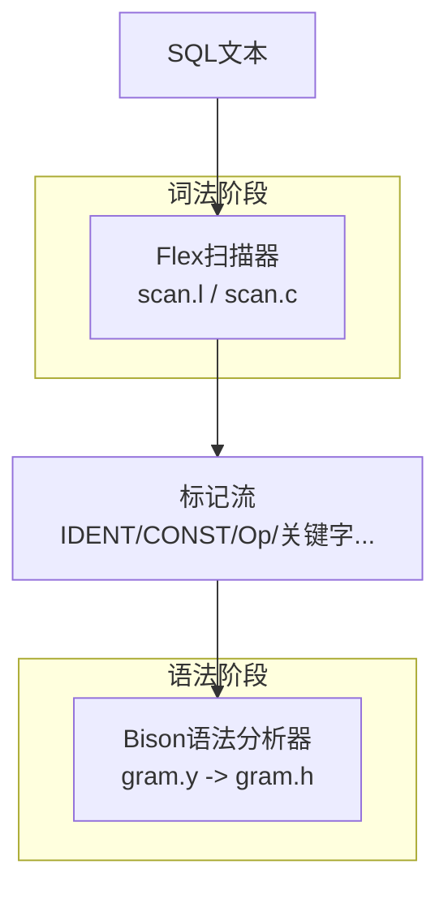
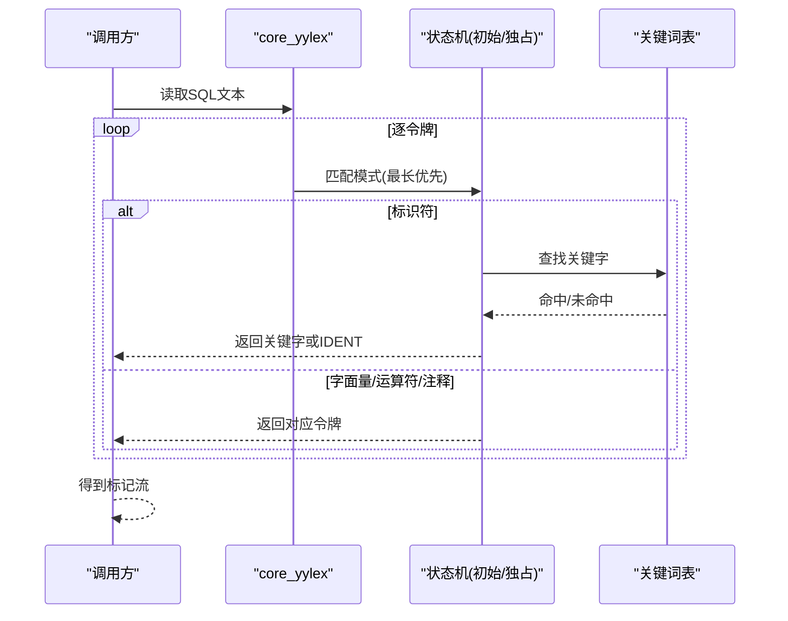
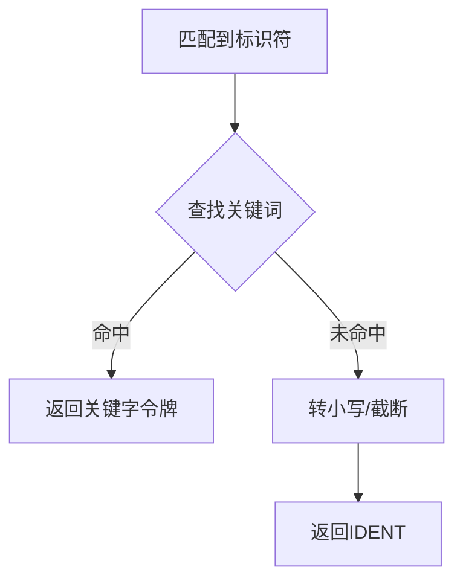
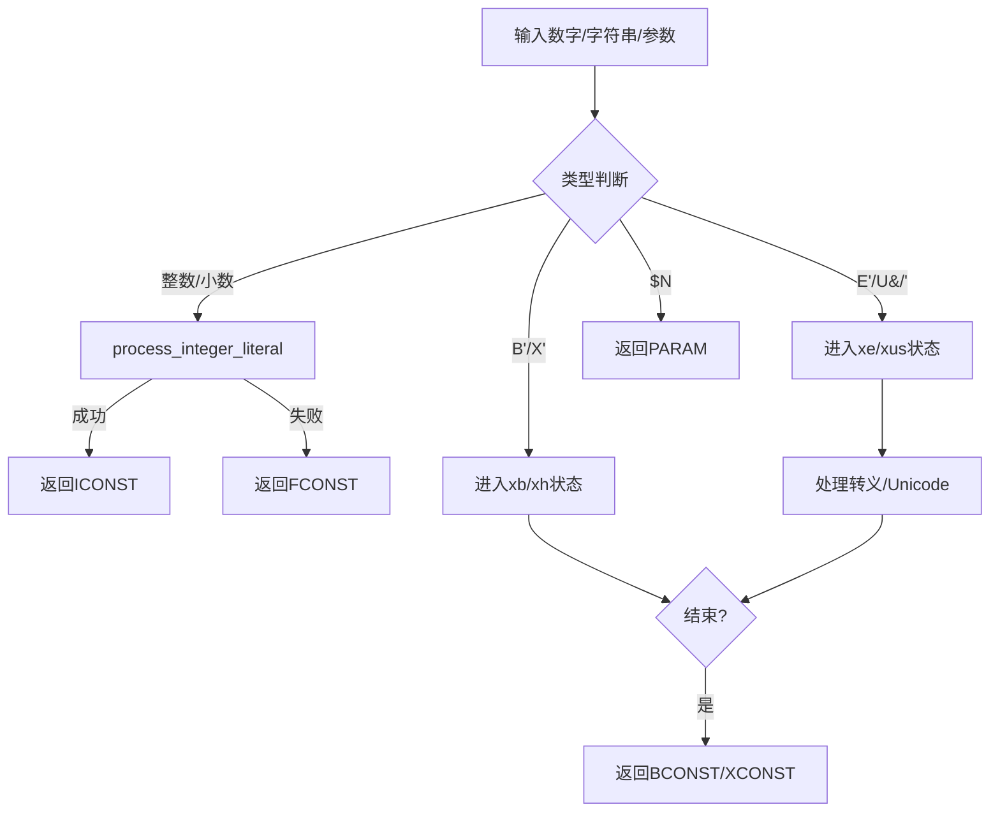
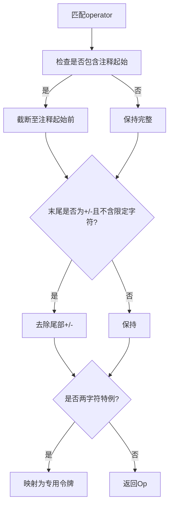
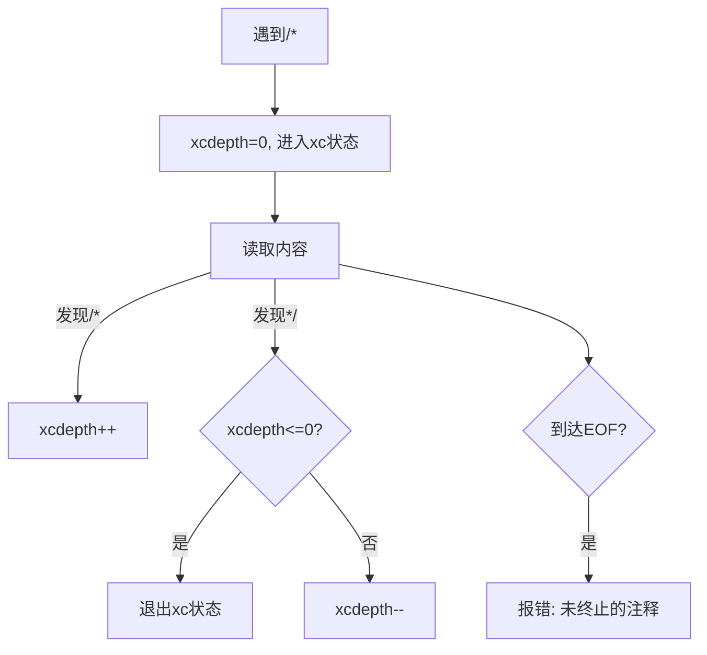
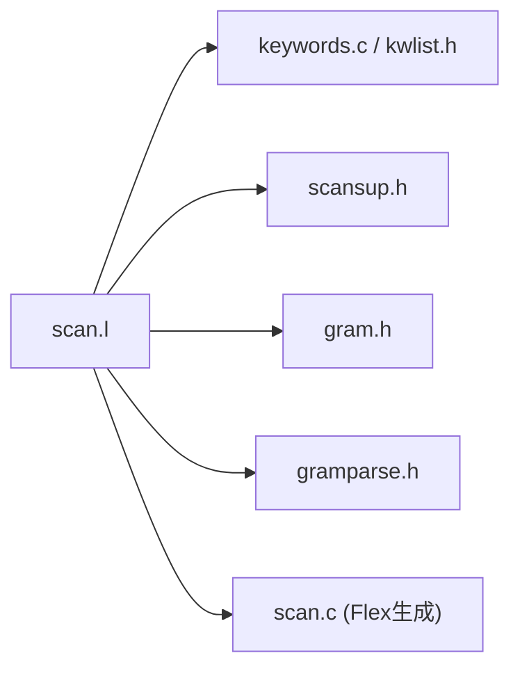

# 词法分析器

<cite>
**本文引用的文件**
- [scan.l](file://src/backend/parser/scan.l)
- [gram.h](file://src/include/parser/gram.h)
- [gramparse.h](file://src/include/parser/gramparse.h)
- [scansup.h](file://src/include/parser/scansup.h)
- [keywords.c](file://src/common/keywords.c)
- [kwlist.h](file://src/include/parser/kwlist.h)
</cite>

## 目录
1. [简介](#简介)
2. [项目结构](#项目结构)
3. [核心组件](#核心组件)
4. [架构总览](#架构总览)
5. [详细组件分析](#详细组件分析)
6. [依赖关系分析](#依赖关系分析)
7. [性能考量](#性能考量)
8. [故障排查指南](#故障排查指南)
9. [结论](#结论)
10. [附录](#附录)

## 简介
本文件面向PostgreSQL的SQL词法分析器（基于Flex），系统性说明其如何将SQL字符串转换为标记流，覆盖关键字识别、标识符处理、字面量解析与运算符识别；并深入解释状态机实现（字符串常量、数字常量、注释处理、错误恢复）；文档化标记类型定义与优先级规则；提供流程图与常见SQL语法的词法分析示例；最后给出性能优化技巧与调试方法。

## 项目结构
词法分析的核心由以下文件组成：
- Flex源文件：定义正则表达式与动作，生成无回溯的状态机
- 生成的C代码：由Flex生成的扫描器实现
- 语法头文件：Bison生成的标记枚举与值联合体
- 关键词表：集中管理SQL关键字及其类别
- 扫描支持函数：标识符大小写转换、截断等工具



图表来源
- [scan.l:162-187](file://src/backend/parser/scan.l#L162-L187)
- [gram.h:48-514](file://src/include/parser/gram.h#L48-L514)

章节来源
- [scan.l:1-187](file://src/backend/parser/scan.l#L1-L187)
- [gram.h:48-514](file://src/include/parser/gram.h#L48-L514)

## 核心组件
- 状态机与模式匹配：通过Flex声明多个独占状态（如xq、xe、xdolq、xc等）以处理不同字面量与注释
- 关键字识别：将标识符与内置关键字表比对，返回对应关键字令牌
- 字面量解析：整数、浮点、二进制/十六进制字符串、标准/扩展字符串、美元引号字符串、Unicode转义
- 运算符识别：单字符与多字符运算符，含特殊边界处理（如“+-”结尾）
- 位置与错误：维护yylloc，统一错误上报与上下文定位

章节来源
- [scan.l:162-187](file://src/backend/parser/scan.l#L162-L187)
- [scan.l:418-1047](file://src/backend/parser/scan.l#L418-L1047)
- [scan.l:1079-1182](file://src/backend/parser/scan.l#L1079-L1182)
- [gram.h:48-514](file://src/include/parser/gram.h#L48-L514)

## 架构总览
词法分析器在初始化时加载关键词表与GUC配置，构建扫描缓冲与字面量缓冲区；随后按最长匹配优先、同等长度按规则顺序优先的原则进行匹配；遇到独占状态则进入相应子状态机；最终输出标记给Bison解析器。



图表来源
- [scan.l:162-187](file://src/backend/parser/scan.l#L162-L187)
- [scan.l:1012-1035](file://src/backend/parser/scan.l#L1012-L1035)
- [keywords.c:21-49](file://src/common/keywords.c#L21-L49)
- [kwlist.h:21-200](file://src/include/parser/kwlist.h#L21-L200)

## 详细组件分析

### 状态机与独占状态
- 初始状态：匹配空白、注释、普通标识符、数字、运算符、参数等
- 独占状态：
  - xq/xe/xus：标准/扩展/Unicode字符串
  - xd/xui：双引号标识符/带Unicode转义的标识符
  - xb/xh：二进制/十六进制位串
  - xc：C风格注释（支持嵌套）
  - xdolq：$...$ 美元引号字符串
  - xqs：字符串结束后的续行检测
  - xeu：Unicode代理对处理

```mermaid
flowchart TD
Start(["开始"]) --> Init["初始状态"]
Init --> |'/*'| XC["进入xc状态"]
Init --> |'B"/b"| XB["进入xb状态"]
Init --> |'X"/x"| XH["进入xh状态"]
Init --> |'E"/e"| XE["进入xe状态"]
Init --> |'U&"/u&"| XUS["进入xus状态"]
Init --> |'" '| XD["进入xd状态"]
Init --> |$...$| XDOLQ["进入xdolq状态"]
XC --> |*/| Init
XB --> |' | END| ReturnBCONST["返回BCONST"]
XH --> |' | END| ReturnXCONST["返回XCONST"]
XE --> |' | END| ReturnSCONST["返回SCONST"]
XUS --> |' | END| ReturnUSCONST["返回USCONST"]
XD --> |' | END| ReturnIDENT["返回IDENT/UIDENT"]
XDOLQ --> |匹配分隔符| ReturnSCONST
```

图表来源
- [scan.l:162-187](file://src/backend/parser/scan.l#L162-L187)
- [scan.l:422-460](file://src/backend/parser/scan.l#L422-L460)
- [scan.l:462-503](file://src/backend/parser/scan.l#L462-L503)
- [scan.l:520-547](file://src/backend/parser/scan.l#L520-L547)
- [scan.l:719-762](file://src/backend/parser/scan.l#L719-L762)
- [scan.l:764-793](file://src/backend/parser/scan.l#L764-L793)

章节来源
- [scan.l:162-187](file://src/backend/parser/scan.l#L162-L187)
- [scan.l:418-1047](file://src/backend/parser/scan.l#L418-L1047)

### 关键字识别
- 标识符匹配后，调用关键词查找；若命中则返回对应的关键字令牌，否则转为小写并返回IDENT
- 关键词表集中管理名称、令牌值、类别与是否可裸标签



图表来源
- [scan.l:1012-1035](file://src/backend/parser/scan.l#L1012-L1035)
- [keywords.c:21-49](file://src/common/keywords.c#L21-L49)
- [kwlist.h:21-200](file://src/include/parser/kwlist.h#L21-L200)

章节来源
- [scan.l:1012-1035](file://src/backend/parser/scan.l#L1012-L1035)
- [keywords.c:21-49](file://src/common/keywords.c#L21-L49)
- [kwlist.h:21-200](file://src/include/parser/kwlist.h#L21-L200)

### 字面量解析
- 整数/小数/实数：尝试解析为整数，失败回退为浮点；科学计数法失败时回退
- 二进制/十六进制位串：进入独占状态收集内容，结束时返回BCONST/XCONST
- 字符串：
  - 标准字符串：''嵌入、换行续行
  - 扩展字符串：支持\转义序列、八进制/十六进制/Unicode
  - Unicode字符串：U&前缀，严格校验代理对
  - 美元引号：原样保留，无转义
- 参数：$编号形式



图表来源
- [scan.l:392-400](file://src/backend/parser/scan.l#L392-L400)
- [scan.l:462-503](file://src/backend/parser/scan.l#L462-L503)
- [scan.l:520-547](file://src/backend/parser/scan.l#L520-L547)
- [scan.l:549-606](file://src/backend/parser/scan.l#L549-L606)
- [scan.l:608-717](file://src/backend/parser/scan.l#L608-L717)
- [scan.l:719-762](file://src/backend/parser/scan.l#L719-L762)
- [scan.l:975-1009](file://src/backend/parser/scan.l#L975-L1009)
- [scan.l:1304-1320](file://src/backend/parser/scan.l#L1304-L1320)

章节来源
- [scan.l:392-400](file://src/backend/parser/scan.l#L392-L400)
- [scan.l:462-503](file://src/backend/parser/scan.l#L462-L503)
- [scan.l:520-547](file://src/backend/parser/scan.l#L520-L547)
- [scan.l:549-606](file://src/backend/parser/scan.l#L549-L606)
- [scan.l:608-717](file://src/backend/parser/scan.l#L608-L717)
- [scan.l:719-762](file://src/backend/parser/scan.l#L719-L762)
- [scan.l:975-1009](file://src/backend/parser/scan.l#L975-L1009)
- [scan.l:1304-1320](file://src/backend/parser/scan.l#L1304-L1320)

### 运算符识别与优先级
- 单字符运算符直接返回
- 多字符运算符需检查是否包含注释起始符（/*、--），必要时截断
- 兼容SQL：以+/-结尾的多字符运算符需满足特定条件，否则截去尾部+/-
- 两字符特例：=>、>=、<=、<>、!= 分别映射为专用令牌



图表来源
- [scan.l:856-967](file://src/backend/parser/scan.l#L856-L967)

章节来源
- [scan.l:856-967](file://src/backend/parser/scan.l#L856-L967)

### 注释处理
- -- 行注释：视为空白，直到换行
- /* */ 块注释：支持嵌套，使用深度计数器；EOF未闭合时报错



图表来源
- [scan.l:224-226](file://src/backend/parser/scan.l#L224-L226)
- [scan.l:321-341](file://src/backend/parser/scan.l#L321-L341)
- [scan.l:422-460](file://src/backend/parser/scan.l#L422-L460)

章节来源
- [scan.l:224-226](file://src/backend/parser/scan.l#L224-L226)
- [scan.l:321-341](file://src/backend/parser/scan.l#L321-L341)
- [scan.l:422-460](file://src/backend/parser/scan.l#L422-L460)

### 错误恢复与位置信息
- 所有错误均携带位置信息（yylloc），通过scanner_errposition与setup_scanner_errposition_callback注入上下文
- 常见错误：未终止的字符串/注释、非法Unicode代理对、非法转义、标识符过长、运算符过长等

章节来源
- [scan.l:1079-1182](file://src/backend/parser/scan.l#L1079-L1182)
- [scan.l:457-460](file://src/backend/parser/scan.l#L457-L460)
- [scan.l:717-717](file://src/backend/parser/scan.l#L717-L717)
- [scan.l:762-762](file://src/backend/parser/scan.l#L762-L762)
- [scan.l:962-967](file://src/backend/parser/scan.l#L962-L967)

### 标记类型定义与优先级
- 标记类型：IDENT、UIDENT、FCONST、SCONST、USCONST、BCONST、XCONST、Op、ICONST、PARAM、TYPECAST、DOT_DOT、COLON_EQUALS、EQUALS_GREATER、LESS_EQUALS、GREATER_EQUALS、NOT_EQUALS，以及大量关键字令牌
- 优先级规则：
  - 最长匹配优先
  - 同等长度时，规则列表中靠前者优先
  - 独占状态下仅适用该状态的规则

章节来源
- [gram.h:48-514](file://src/include/parser/gram.h#L48-L514)
- [scan.l:162-187](file://src/backend/parser/scan.l#L162-L187)

## 依赖关系分析
- scan.l依赖：
  - 关键词表：ScanKeywordLookup、GetScanKeyword、keyword_tokens
  - 扫描支持：downcase_truncate_identifier、truncate_identifier、scanner_isspace
  - 内存与错误：palloc/pfree、ereport、errposition
- 生成的scan.c包含Flex状态转移表与核心循环
- gramparse.h定义了yyextra结构与基础扫描接口



图表来源
- [scan.l:33-43](file://src/backend/parser/scan.l#L33-L43)
- [scan.l:76-80](file://src/backend/parser/scan.l#L76-L80)
- [keywords.c:21-49](file://src/common/keywords.c#L21-L49)
- [scansup.h:17-25](file://src/include/parser/scansup.h#L17-L25)
- [gramparse.h:31-75](file://src/include/parser/gramparse.h#L31-L75)

章节来源
- [scan.l:33-43](file://src/backend/parser/scan.l#L33-L43)
- [keywords.c:21-49](file://src/common/keywords.c#L21-L49)
- [scansup.h:17-25](file://src/include/parser/scansup.h#L17-L25)
- [gramparse.h:31-75](file://src/include/parser/gramparse.h#L31-L75)

## 性能考量
- 无回溯设计：规则保证始终能匹配已消费输入，避免回溯带来的开销
- 独占状态减少冲突：将复杂字面量隔离到独立状态，降低主状态机复杂度
- 最短路径匹配：利用Flex的最长匹配与规则顺序，减少分支判断
- 内存分配策略：字面量缓冲区按需倍增扩容，减少频繁realloc
- 建议：
  - 避免引入需要回溯的模式
  - 合理拆分复杂字面量为独占状态
  - 控制标识符/运算符最大长度，尽早报错
  - 使用palloc族管理内存，避免系统malloc/free开销

章节来源
- [scan.l:12-22](file://src/backend/parser/scan.l#L12-L22)
- [scan.l:162-187](file://src/backend/parser/scan.l#L162-L187)
- [scan.l:1250-1282](file://src/backend/parser/scan.l#L1250-L1282)
- [scan.l:1409-1429](file://src/backend/parser/scan.l#L1409-L1429)

## 故障排查指南
- 常见问题：
  - 未终止的字符串/注释：检查结束定界符与续行规则
  - 非法Unicode转义/代理对：确认\UXXXX/\\uXXXX格式与配对
  - 非标准转义警告：注意escape_string_warning与backslash_quote设置
  - 标识符/运算符过长：检查长度限制与截断策略
- 调试方法：
  - 启用Flex调试：设置yy_flex_debug观察状态转移
  - 打印yylloc与当前token：定位错误位置
  - 逐步缩小输入：最小化复现用例
  - 检查关键词表：确认关键字类别与令牌映射

章节来源
- [scan.l:457-460](file://src/backend/parser/scan.l#L457-L460)
- [scan.l:672-680](file://src/backend/parser/scan.l#L672-L680)
- [scan.l:1366-1402](file://src/backend/parser/scan.l#L1366-L1402)
- [scan.l:962-967](file://src/backend/parser/scan.l#L962-L967)

## 结论
PostgreSQL的词法分析器通过严谨的Flex规则与独占状态机，实现了高效、可扩展且健壮的SQL词法解析。其设计强调无回溯、明确优先级与完善的错误定位，配合关键词表与扫描支持函数，能够准确识别关键字、标识符、字面量与运算符。遵循本文的性能与调试建议，可进一步提升稳定性与维护性。

## 附录

### 常见SQL语法的词法分析示例
- SELECT a FROM t WHERE b = 1;
  - 标记序列：SELECT、IDENT(a)、FROM、IDENT(t)、WHERE、IDENT(b)、=、ICONST(1)、;
- 'hello world' E'\n\t' U&'abc' $tag$raw$ "my id" 123.45e2
  - 标记序列：SCONST('hello world')、SCONST(E'\n\t')、USCONST(U&'abc')、SCONST($tag$raw$)、UIDENT("my id")、FCONST(123.45e2)
- /* nested /* comment */ still */ end
  - 标记序列：注释被整体忽略，直至最外层*/结束

[本节为概念性示例，不直接引用具体代码]