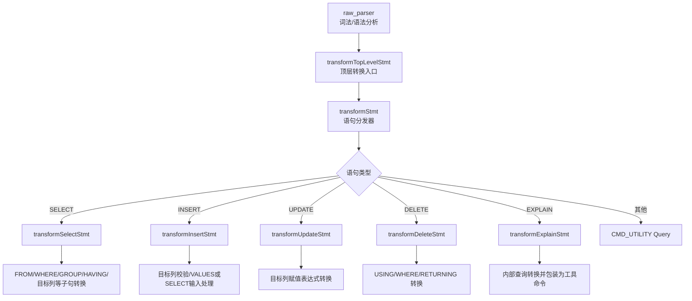
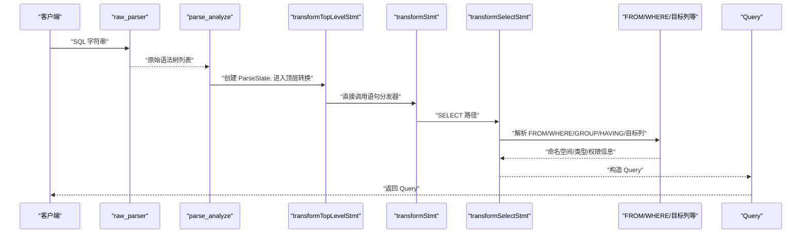
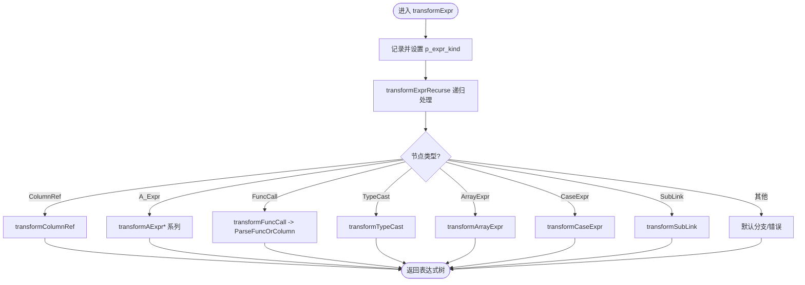
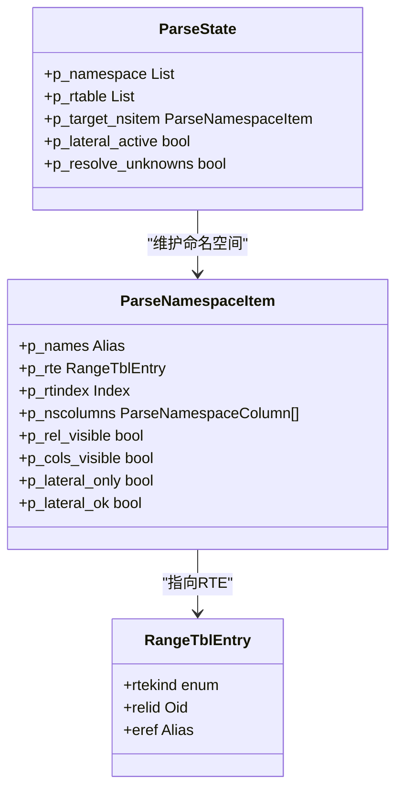
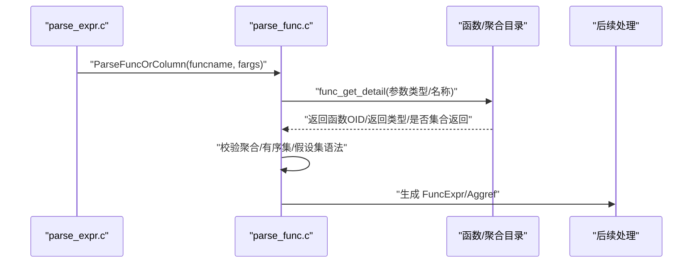
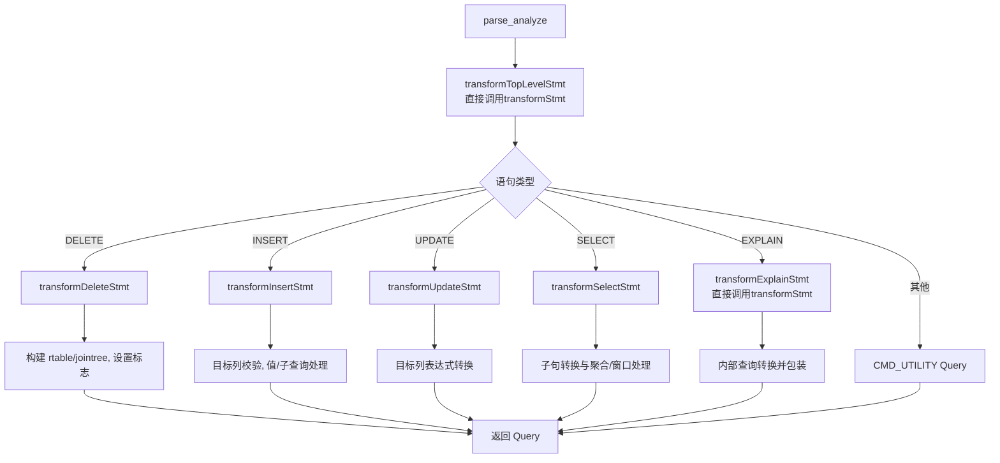
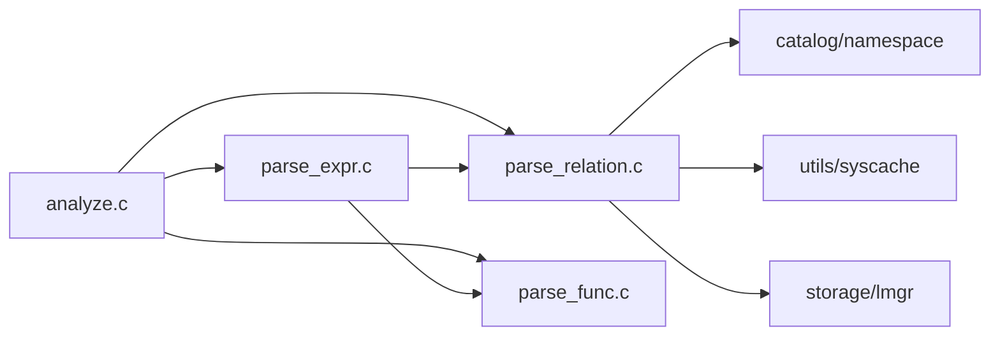

# 语义分析

<cite>
**本文引用的文件**
- [analyze.c](file://src/backend/parser/analyze.c)
- [parser.c](file://src/backend/parser/parser.c)
- [parse_expr.c](file://src/backend/parser/parse_expr.c)
- [parse_relation.c](file://src/backend/parser/parse_relation.c)
- [parse_func.c](file://src/backend/parser/parse_func.c)
- [parse_node.c](file://src/backend/parser/parse_node.c)
- [parsenodes.h](file://src/include/nodes/parsenodes.h)
- [analyze.h](file://src/include/parser/analyze.h)
</cite>

## 更新摘要
**所做更改**
- 更新了transformTopLevelStmt和transformExplainStmt的实现说明，移除了不必要的抽象层
- 简化了语句转换流程，直接调用transformStmt而非通过包装函数
- 改进了代码清晰度但不影响功能行为
- 更新了相关架构图表和流程说明

## 目录
1. [简介](#简介)
2. [项目结构](#项目结构)
3. [核心组件](#核心组件)
4. [架构总览](#架构总览)
5. [详细组件分析](#详细组件分析)
6. [依赖关系分析](#依赖关系分析)
7. [性能考虑](#性能考虑)
8. [故障排查指南](#故障排查指南)
9. [结论](#结论)
10. [附录](#附录)

## 简介
本文件聚焦于 PostgreSQL 的语义分析阶段，系统阐述从原始语法树到可优化查询树（Query）的转换过程。内容涵盖：
- 类型检查、作用域与命名空间解析、列绑定、函数/聚合调用验证、约束相关检查
- 符号表（ParseState、命名空间项、范围表 RTE）管理与错误报告机制
- 典型 SQL 语句（SELECT/INSERT/UPDATE/DELETE）的语义分析流程
- 扩展点与性能优化策略

**最新更新**：语义分析模块内部实现进行了优化，移除了transformOptionalSelectInto包装函数，现在transformTopLevelStmt和transformExplainStmt直接调用transformStmt，减少了不必要的抽象层，改善了代码清晰度。

## 项目结构
语义分析位于后端 parser 模块，入口由 raw_parser 生成原始语法树，再由 analyze.c 驱动 transform* 系列函数完成语义分析与中间表示构建。关键文件职责如下：
- parser.c：词法/语法分析入口，返回原始语法树
- analyze.c：顶层调度，按语句类型分发到具体转换器
- parse_expr.c：表达式转换、类型推导与绑定
- parse_relation.c：表/别名/列名解析、命名空间可见性、LATERAL 规则
- parse_func.c：函数/聚合查找、参数匹配、返回值与集合返回校验
- parse_node.c：ParseState 生命周期管理
- parsenodes.h：Query、CmdType、权限位等核心节点定义

**图表来源**
- [parser.c:41-82](file://src/backend/parser/parser.c#L41-L82)
- [analyze.c:194-205](file://src/backend/parser/analyze.c#L194-L205)
- [analyze.c:211-283](file://src/backend/parser/analyze.c#L211-L283)
- [analyze.c:1764-1777](file://src/backend/parser/analyze.c#L1764-L1777)

**章节来源**
- [parser.c:41-82](file://src/backend/parser/parser.c#L41-L82)
- [analyze.c:194-205](file://src/backend/parser/analyze.c#L194-L205)
- [analyze.c:211-283](file://src/backend/parser/analyze.c#L211-L283)

## 核心组件
- ParseState：语义分析上下文，维护命名空间、范围表、目标表、表达式种类、钩子等
- 命名空间项（ParseNamespaceItem）：描述一个可见的关系或列源，控制可见性与 LATERAL 限制
- 范围表（RangeTblEntry, RTE）：底层表的逻辑视图，承载列元数据、权限标记等
- Query：语义分析后的中间表示，供重写器与规划器使用

**章节来源**
- [parse_node.c:43-94](file://src/backend/parser/parse_node.c#L43-L94)
- [parse_relation.c:1150-1224](file://src/backend/parser/parse_relation.c#L1150-L1224)
- [parsenodes.h:112-178](file://src/include/nodes/parsenodes.h#L112-L178)

## 架构总览
语义分析的整体流程经过优化后更加简洁：
1. raw_parser 将 SQL 字符串转换为原始语法树（RawStmt/SelectStmt/InsertStmt 等）
2. parse_analyze/parse_analyze_varparams 初始化 ParseState，调用 transformTopLevelStmt
3. **更新**：transformTopLevelStmt 现在直接调用 transformStmt，移除了中间的包装层
4. transformStmt 根据语句类型分派到具体转换器
5. 各转换器负责：
   - 建立/更新命名空间与范围表
   - 解析 FROM/JOIN/USING/WHERE/GROUP/HAVING/LIMIT 等子句
   - 解析目标列、表达式、函数/聚合、操作符
   - 进行类型检查、作用域与可见性校验、权限标记
   - 组装 Query 并设置标志位（如 hasAggs、hasSubLinks）
6. 可选地执行 post_parse_analyze_hook 与查询 ID 统计

**图表来源**
- [parser.c:41-82](file://src/backend/parser/parser.c#L41-L82)
- [analyze.c:97-128](file://src/backend/parser/analyze.c#L97-L128)
- [analyze.c:194-205](file://src/backend/parser/analyze.c#L194-L205)
- [analyze.c:211-283](file://src/backend/parser/analyze.c#L211-L283)

## 详细组件分析

### 表达式与类型检查（parse_expr.c）
- 入口 transformExpr 统一处理表达式递归转换，依据节点类型分派到具体处理器
- 支持列引用、参数、常量、数组、类型转换、排序规则、操作符、布尔表达式、函数调用、CASE、子查询、NULL 测试、当前行等
- 列引用解析通过 transformColumnRef，结合命名空间与 RTE 进行列绑定，支持 A/B/C/D 多级限定与整行引用
- 下标与字段访问通过 transformIndirection，先处理下标再处理字段选择，必要时调用 ParseFuncOrColumn 以支持复合类型的投影
- 未知属性错误通过 unknown_attribute 给出友好提示

**图表来源**
- [parse_expr.c:90-106](file://src/backend/parser/parse_expr.c#L90-L106)
- [parse_expr.c:108-304](file://src/backend/parser/parse_expr.c#L108-L304)
- [parse_expr.c:358-423](file://src/backend/parser/parse_expr.c#L358-L423)
- [parse_expr.c:430-800](file://src/backend/parser/parse_expr.c#L430-L800)

**章节来源**
- [parse_expr.c:90-106](file://src/backend/parser/parse_expr.c#L90-L106)
- [parse_expr.c:108-304](file://src/backend/parser/parse_expr.c#L108-L304)
- [parse_expr.c:358-423](file://src/backend/parser/parse_expr.c#L358-L423)
- [parse_expr.c:430-800](file://src/backend/parser/parse_expr.c#L430-L800)

### 表引用与作用域解析（parse_relation.c）
- refnameNamespaceItem：根据 schema/relname 在当前及父级命名空间中查找可见的关系项，支持按 OID 精确匹配
- scanNameSpaceForRefname：在 p_namespace 中查找唯一匹配，处理 LATERAL 可见性限制与歧义报错
- scanNSItemForColumn：在单个 nsitem 中查找列，生成 Var 并标记 SELECT 权限；对系统列与已删除列做特殊处理
- colNameToVar：无限定列名解析，自内向外搜索命名空间，遇到歧义报错
- addNSItemToQuery：将 nsitem/RTE 加入 joinlist 和/或命名空间，控制可见性与 LATERAL 标志
- expandNSItemVars/expandNSItemAttrs：展开 * 与列变量，用于目标列与 VALUES RTE 等场景

**图表来源**
- [parse_relation.c:108-160](file://src/backend/parser/parse_relation.c#L108-L160)
- [parse_relation.c:179-253](file://src/backend/parser/parse_relation.c#L179-L253)
- [parse_relation.c:558-638](file://src/backend/parser/parse_relation.c#L558-L638)
- [parse_relation.c:747-796](file://src/backend/parser/parse_relation.c#L747-L796)
- [parse_relation.c:2203-2223](file://src/backend/parser/parse_relation.c#L2203-L2223)

**章节来源**
- [parse_relation.c:108-160](file://src/backend/parser/parse_relation.c#L108-L160)
- [parse_relation.c:179-253](file://src/backend/parser/parse_relation.c#L179-L253)
- [parse_relation.c:558-638](file://src/backend/parser/parse_relation.c#L558-L638)
- [parse_relation.c:747-796](file://src/backend/parser/parse_relation.c#L747-L796)
- [parse_relation.c:2203-2223](file://src/backend/parser/parse_relation.c#L2203-L2223)

### 函数/聚合调用验证（parse_func.c）
- ParseFuncOrColumn：统一处理"列投影"与"函数调用"两种语法形式；当单参且类型为复合/记录时优先尝试列投影
- 参数提取与命名参数校验：过滤 VOID 参数、检测重复命名参数、位置参数与命名参数混用限制
- 函数查找与消歧：func_get_detail 返回函数详情，处理多态、继承、默认参数、VARIADIC 等
- 聚合/有序集/假设集校验：WITHIN GROUP、ORDER BY、DISTINCT、FILTER 等语法的合法性检查
- 集合返回函数：check_srf_call_placement 确保 SRF 出现在允许的位置
- 输出结构：普通函数生成 FuncExpr，聚合生成 Aggref 并交由后续 transformAggregateCall 完善

**图表来源**
- [parse_func.c:89-141](file://src/backend/parser/parse_func.c#L89-L141)
- [parse_func.c:143-270](file://src/backend/parser/parse_func.c#L143-L270)
- [parse_func.c:271-341](file://src/backend/parser/parse_func.c#L271-L341)
- [parse_func.c:346-504](file://src/backend/parser/parse_func.c#L346-L504)
- [parse_func.c:505-800](file://src/backend/parser/parse_func.c#L505-L800)

**章节来源**
- [parse_func.c:89-141](file://src/backend/parser/parse_func.c#L89-L141)
- [parse_func.c:143-270](file://src/backend/parser/parse_func.c#L143-L270)
- [parse_func.c:271-341](file://src/backend/parser/parse_func.c#L271-L341)
- [parse_func.c:346-504](file://src/backend/parser/parse_func.c#L346-L504)
- [parse_func.c:505-800](file://src/backend/parser/parse_func.c#L505-L800)

### 语句级语义分析流程（analyze.c）
- parse_analyze / parse_analyze_varparams：初始化 ParseState，处理参数类型推断，调用顶层转换
- **更新**：transformTopLevelStmt 现在直接调用 transformStmt，移除了 transformOptionalSelectInto 包装函数
- transformStmt：按语句类型分发，SELECT/INSERT/UPDATE/DELETE/RETURN 分别处理，其余包装为 CMD_UTILITY
- **更新**：transformExplainStmt 现在直接调用 transformStmt 处理内部查询，然后包装为工具命令
- 各转换器要点：
  - DELETE：设置 resultRelation，处理 USING/WHERE/RETURNING，构建 jointree
  - INSERT：三种输入模式（DEFAULT VALUES、VALUES 列表、SELECT），目标列校验与类型强制，VALUES RTE 或子查询 RTE 的处理
  - SELECT：由 transformSelectStmt 处理（不在本节展开）
  - UPDATE：目标列赋值表达式转换（不在本节展开）

**图表来源**
- [analyze.c:97-128](file://src/backend/parser/analyze.c#L97-L128)
- [analyze.c:194-205](file://src/backend/parser/analyze.c#L194-L205)
- [analyze.c:211-283](file://src/backend/parser/analyze.c#L211-L283)
- [analyze.c:1764-1777](file://src/backend/parser/analyze.c#L1764-L1777)

**章节来源**
- [analyze.c:97-128](file://src/backend/parser/analyze.c#L97-L128)
- [analyze.c:194-205](file://src/backend/parser/analyze.c#L194-L205)
- [analyze.c:211-283](file://src/backend/parser/analyze.c#L211-L283)
- [analyze.c:1764-1777](file://src/backend/parser/analyze.c#L1764-L1777)

### 常见 SQL 语法的语义分析示例
- SELECT 表引用解析：
  - 无限定列名：colNameToVar 自内向外扫描命名空间，若找到多个匹配则报歧义
  - 限定列名：refnameNamespaceItem 定位 nsitem，scanNSItemForColumn 生成 Var
  - 整行引用：A.* / A.B.* / A.B.C.* 通过 transformWholeRowRef 处理
- INSERT ... VALUES：
  - 单行：直接作为目标列表达式列表
  - 多行：生成 VALUES RTE，每行表达式经 transformExpressionList 转换后入 RTE
  - 目标列校验：checkInsertTargets 校验列存在性与顺序
- UPDATE 目标列：
  - 目标列表达式经 transformAssignmentIndirection 处理，支持字段/数组赋值
- DELETE USING：
  - USING 等价于 FROM 列表，但结果表不可被 lateral 引用，需设置 p_lateral_only/p_lateral_ok

**章节来源**
- [parse_relation.c:108-160](file://src/backend/parser/parse_relation.c#L108-L160)
- [parse_relation.c:558-638](file://src/backend/parser/parse_relation.c#L558-L638)
- [parse_expr.c:430-800](file://src/backend/parser/parse_expr.c#L430-L800)
- [analyze.c:363-417](file://src/backend/parser/analyze.c#L363-L417)

## 依赖关系分析
- 模块耦合：
  - analyze.c 依赖 parse_expr.c、parse_relation.c、parse_func.c、parse_clause.c、parse_target.c 等
  - parse_expr.c 依赖 parse_func.c、parse_relation.c、parse_coerce.c、parse_collate.c
  - parse_relation.c 依赖 catalog/namespace、utils/syscache、storage/lmgr 等
- 外部依赖：
  - 目录缓存（syscache）、系统表（pg_proc/pg_type/pg_aggregate 等）
  - 锁管理器（存储层）用于获取必要锁（注释中提及）

**图表来源**
- [analyze.c:25-53](file://src/backend/parser/analyze.c#L25-L53)
- [parse_expr.c:16-39](file://src/backend/parser/parse_expr.c#L16-L39)
- [parse_relation.c:15-38](file://src/backend/parser/parse_relation.c#L15-L38)

**章节来源**
- [analyze.c:25-53](file://src/backend/parser/analyze.c#L25-L53)
- [parse_expr.c:16-39](file://src/backend/parser/parse_expr.c#L16-L39)
- [parse_relation.c:15-38](file://src/backend/parser/parse_relation.c#L15-L38)

## 性能考虑
- **更新**：移除 transformOptionalSelectInto 包装函数减少了函数调用开销，提高了代码清晰度
- 避免不必要的目录访问：refnameNamespaceItem 在有 schema 限定时使用 LookupNamespaceNoError 快速定位，减少权限检查开销
- 命名空间查找优化：scanNameSpaceForRefname 忽略列-only 项与 lateral-only 项，减少遍历成本
- 模糊匹配仅在错误消息中使用，避免影响正常路径性能
- 表达式转换中的栈深度保护：check_stack_depth 防止过深嵌套导致崩溃
- 批量展开：expandNSItemVars/expandNSItemAttrs 一次性生成 Var/TLE 列表，减少多次分配

## 故障排查指南
- 列不存在/歧义：
  - unknown_attribute/errorMissingColumn/errorMissingRTE 提供上下文与位置信息
  - 歧义列/表名会触发 AMBIGUOUS_* 错误码
- 函数/聚合错误：
  - 未找到函数/过程：UNDEFINED_FUNCTION
  - 多候选函数：AMBIGUOUS_FUNCTION
  - 非聚合使用 DISTINCT/WITHIN GROUP/ORDER BY/FILTER：WRONG_OBJECT_TYPE
- LATERAL 限制：
  - check_lateral_ref_ok 在非 INNER/LEFT JOIN 或目标表引用时报错
- 目标列/插入列校验：
  - checkInsertTargets 与 transformInsertRow 保证列存在性与类型兼容

**章节来源**
- [parse_expr.c:312-356](file://src/backend/parser/parse_expr.c#L312-L356)
- [parse_expr.c:783-800](file://src/backend/parser/parse_expr.c#L783-L800)
- [parse_func.c:271-341](file://src/backend/parser/parse_func.c#L271-L341)
- [parse_func.c:515-604](file://src/backend/parser/parse_func.c#L515-L604)
- [parse_relation.c:385-406](file://src/backend/parser/parse_relation.c#L385-L406)

## 结论
PostgreSQL 的语义分析阶段通过 ParseState 与命名空间机制，将原始语法树转换为具备完整类型与作用域信息的 Query。**最新优化**：通过移除不必要的包装函数（如 transformOptionalSelectInto），简化了转换流程，提高了代码清晰度和可维护性，同时保持了功能的完整性。该阶段严格进行列绑定、函数/聚合验证、LATERAL 可见性检查与权限标记，为后续重写与规划提供可靠基础。通过模块化设计与可扩展钩子，既保证了正确性，也便于功能扩展与性能优化。

## 附录
- 扩展点：
  - post_parse_analyze_hook：在语义分析结束后回调，可用于插件注入行为
  - Pre/Post ColumnRef Hook：在列引用解析前后拦截，实现自定义列解析
  - ParamRef Hook：参数引用解析钩子
- 数据结构要点：
  - Query 包含 commandType、rtable、jointree、targetList、groupClause、havingQual、distinctClause、sortClause、limitOffset/Count、rowMarks、constraintDeps 等
  - CmdType 与权限位（ACL_*）用于权限与命令语义

**章节来源**
- [analyze.c:56-57](file://src/backend/parser/analyze.c#L56-L57)
- [parse_node.c:43-94](file://src/backend/parser/parse_node.c#L43-L94)
- [parsenodes.h:112-178](file://src/include/nodes/parsenodes.h#L112-L178)
- [parsenodes.h:72-95](file://src/include/nodes/parsenodes.h#L72-L95)
- [analyze.h:20-46](file://src/include/parser/analyze.h#L20-L46)