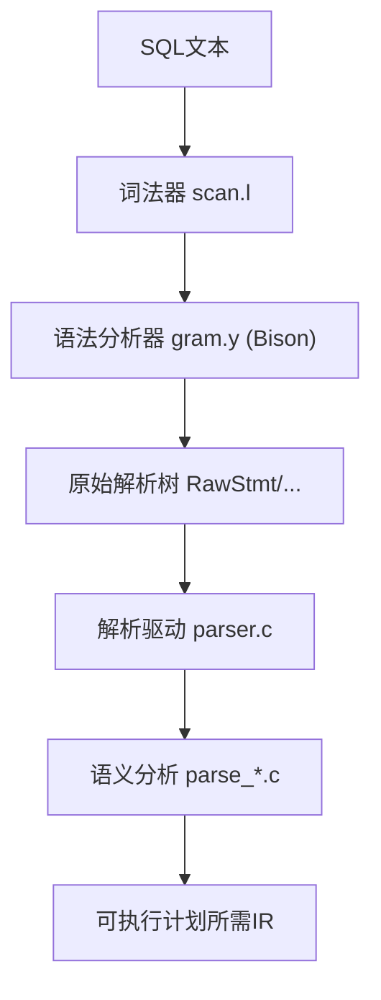
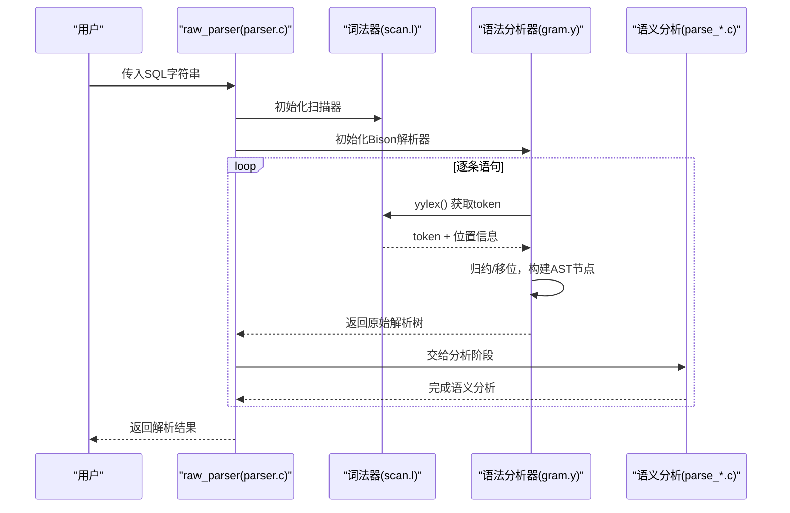
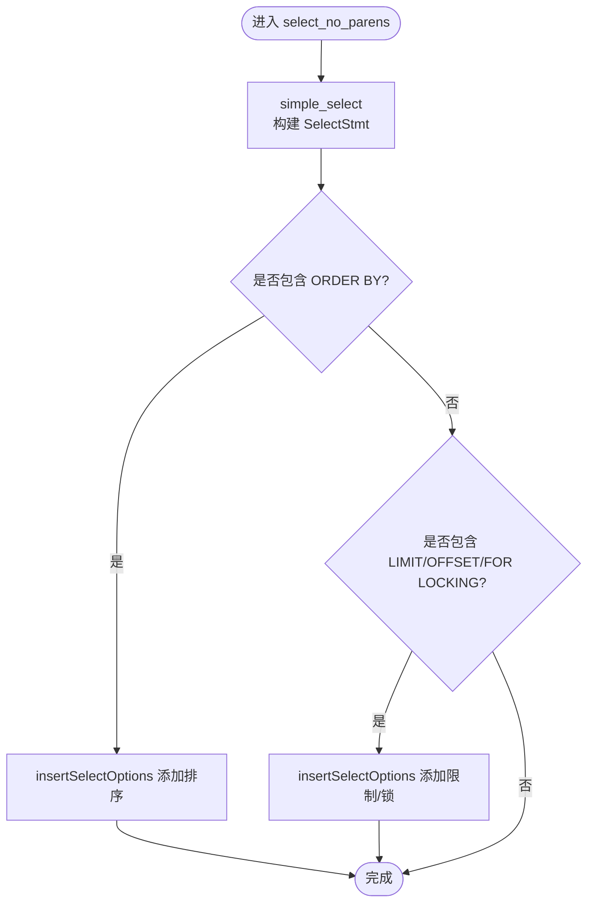
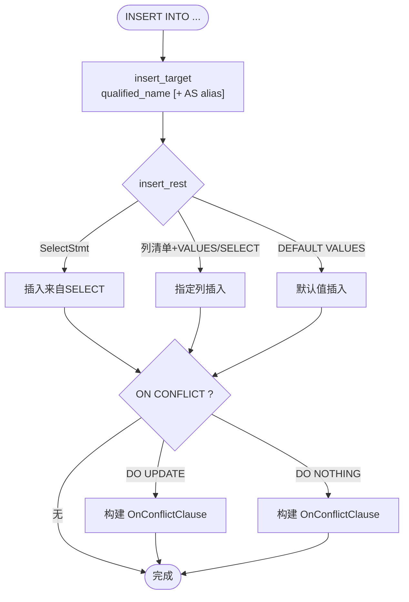
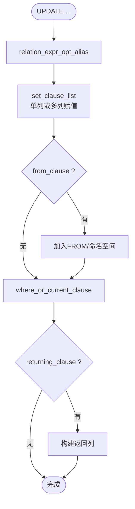
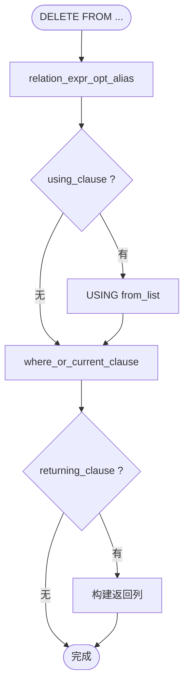
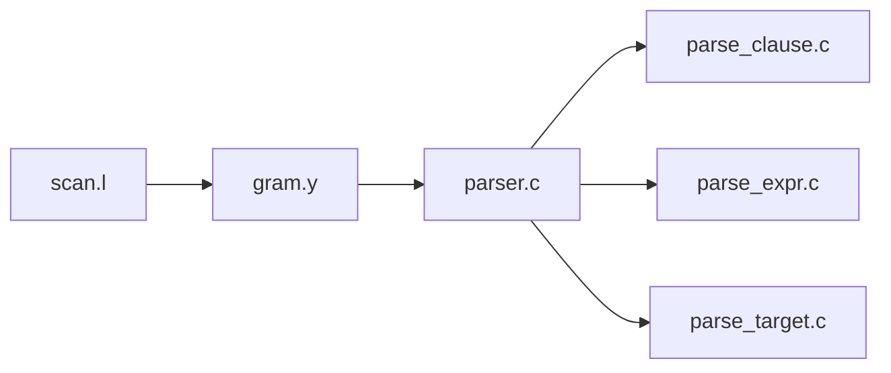

# 语法分析器

<cite>
**本文引用的文件**
- [gram.y](file://src/backend/parser/gram.y)
- [scan.l](file://src/backend/parser/scan.l)
- [parser.c](file://src/backend/parser/parser.c)
- [parse_clause.c](file://src/backend/parser/parse_clause.c)
- [parse_expr.c](file://src/backend/parser/parse_expr.c)
- [parse_target.c](file://src/backend/parser/parse_target.c)
</cite>

## 目录
1. [简介](#简介)
2. [项目结构](#项目结构)
3. [核心组件](#核心组件)
4. [架构总览](#架构总览)
5. [详细组件分析](#详细组件分析)
6. [依赖关系分析](#依赖关系分析)
7. [性能考量](#性能考量)
8. [故障排查指南](#故障排查指南)
9. [结论](#结论)
10. [附录](#附录)

## 简介
本文件面向PostgreSQL（及minipg）中的SQL语法分析子系统，系统性说明Bison语法规则如何构建抽象语法树（AST），覆盖SELECT、INSERT、UPDATE、DELETE等复杂查询的解析过程。文档同时解释LR(1)算法的实现要点与冲突解决策略，提供流程图与典型SQL的解析树示例，并给出扩展语法规则与调试技巧。

## 项目结构
语法分析由词法分析、语法分析、以及后续的分析转换三阶段组成：
- 词法分析：scan.l 将SQL文本切分为token流，处理字符串、标识符、操作符、注释、Unicode转义等。
- 语法分析：gram.y 定义Bison规则，将token流归约为原始解析树（RawStmt/SelectStmt/InsertStmt/UpdateStmt/DeleteStmt等）。
- 分析与转换：parser.c 驱动解析；parse_*.c 对原始解析树进行语义分析、类型检查、命名空间构建、表达式变换等，生成最终可执行计划所需的中间表示。

图表来源
- [scan.l:1-120](file://src/backend/parser/scan.l#L1-L120)
- [gram.y:676-784](file://src/backend/parser/gram.y#L676-L784)
- [parser.c:35-82](file://src/backend/parser/parser.c#L35-L82)

章节来源
- [scan.l:1-120](file://src/backend/parser/scan.l#L1-L120)
- [gram.y:676-784](file://src/backend/parser/gram.y#L676-L784)
- [parser.c:35-82](file://src/backend/parser/parser.c#L35-L82)

## 核心组件
- 词法器（scan.l）
  - 无回溯设计，使用独占状态机处理引号字符串、C风格注释、十六进制/二进制字面量、Unicode转义等。
  - 通过 SET_YYLLOC/ADVANCE_YYLLOC 维护精确错误位置。
- 语法分析器（gram.y）
  - 定义非终结符、终结符、优先级/结合性，声明各非终结符的union类型。
  - 在动作中构造AST节点（如 SelectStmt、InsertStmt、UpdateStmt、DeleteStmt），并填充字段。
  - 通过 %prec 和显式优先级解决移位/归约冲突。
- 解析驱动（parser.c）
  - raw_parser 初始化扫描器与Bison解析器，调用 base_yyparse，返回原始解析树列表。
  - base_yylex 作为过滤器，实现必要的多令牌前瞻（NOT_LA、NULLS_LA、WITH_LA）与U&字符串转义。
- 语义分析（parse_*.c）
  - parse_clause.c：FROM子句、JOIN USING/ON、目标表设置、命名空间管理。
  - parse_expr.c：表达式变换、类型推导、函数/操作符解析。
  - parse_target.c：目标列展开（*）、列名推断、TargetEntry构建。

章节来源
- [scan.l:147-200](file://src/backend/parser/scan.l#L147-L200)
- [gram.y:181-468](file://src/backend/parser/gram.y#L181-L468)
- [parser.c:35-293](file://src/backend/parser/parser.c#L35-L293)
- [parse_clause.c:96-215](file://src/backend/parser/parse_clause.c#L96-L215)
- [parse_expr.c:84-200](file://src/backend/parser/parse_expr.c#L84-L200)
- [parse_target.c:63-200](file://src/backend/parser/parse_target.c#L63-L200)

## 架构总览
下图展示从SQL到AST的关键路径与交互：

图表来源
- [parser.c:35-82](file://src/backend/parser/parser.c#L35-L82)
- [scan.l:147-200](file://src/backend/parser/scan.l#L147-L200)
- [gram.y:676-784](file://src/backend/parser/gram.y#L676-L784)

## 详细组件分析

### 词法器（scan.l）
- 关键特性
  - 无回溯：确保匹配规则始终可推进，提升性能。
  - 独占状态：xb/xh/xq/xe/xdolq等用于不同字面量与注释。
  - Unicode支持：U&''/U&"" 与 UESCAPE，在base_yylex中进行解码与校验。
  - 错误定位：SET_YYLLOC/ADVANCE_YYLLOC/PUSH_YYLLOC/POP_YYLLOC 保证错误位置准确。
- 与语法分析的协作
  - 将U&标识符/字符串转换为IDENT/SCONST，必要时注入额外token（如NOT_LA）。
  - 为语法分析提供稳定的token流与位置信息。

章节来源
- [scan.l:147-200](file://src/backend/parser/scan.l#L147-L200)
- [scan.l:418-800](file://src/backend/parser/scan.l#L418-L800)
- [parser.c:85-293](file://src/backend/parser/parser.c#L85-L293)

### 语法分析器（gram.y）
- 非终结符与类型
  - 通过 %union 声明 YYSTYPE 的多种类型（node、list、str、ival等），并在 %type 中绑定到具体非终结符。
- 优先级与冲突解决
  - 通过 %left/%right/%nonassoc 定义运算符优先级与结合性，避免歧义。
  - 使用 NOT_LA、NULLS_LA、WITH_LA 等“伪关键字”降低二义性，使语法保持LALR(1)。
- 语句级规则
  - stmtmulti/toplevel_stmt 负责多条语句与事务包装。
  - InsertStmt/DeleteStmt/UpdateStmt/SelectStmt 分别对应DML与查询语句。
- 动作函数
  - 在动作中创建AST节点（makeNode(...)），填充字段，组合子树，返回给上层。

章节来源
- [gram.y:181-468](file://src/backend/parser/gram.y#L181-L468)
- [gram.y:676-784](file://src/backend/parser/gram.y#L676-L784)

#### SELECT 语句解析流程

图表来源
- [gram.y:5345-5393](file://src/backend/parser/gram.y#L5345-L5393)
- [gram.y:5423-5494](file://src/backend/parser/gram.y#L5423-L5494)

章节来源
- [gram.y:5345-5393](file://src/backend/parser/gram.y#L5345-L5393)
- [gram.y:5423-5494](file://src/backend/parser/gram.y#L5423-L5494)

#### INSERT 语句解析流程

图表来源
- [gram.y:4982-5122](file://src/backend/parser/gram.y#L4982-L5122)

章节来源
- [gram.y:4982-5122](file://src/backend/parser/gram.y#L4982-L5122)

#### UPDATE 语句解析流程

图表来源
- [gram.y:5200-5264](file://src/backend/parser/gram.y#L5200-L5264)

章节来源
- [gram.y:5200-5264](file://src/backend/parser/gram.y#L5200-L5264)

#### DELETE 语句解析流程

图表来源
- [gram.y:5132-5147](file://src/backend/parser/gram.y#L5132-L5147)

章节来源
- [gram.y:5132-5147](file://src/backend/parser/gram.y#L5132-L5147)

### 语义分析（parse_*.c）
- FROM子句与命名空间
  - transformFromClause 遍历from_list，构建RangeTableEntry与ParseNamespaceItem，处理LATERAL可见性与重复引用检查。
  - setTargetTable 打开目标表并加写锁，建立p_target_relation/p_target_nsitem。
- 表达式变换
  - transformExpr 递归处理各类表达式节点（操作符、函数、数组、类型转换、大小写敏感等），并进行类型推导与强制转换。
- 目标列处理
  - transformTargetList 展开 *、推断列名、构建TargetEntry，支持多列赋值场景。

章节来源
- [parse_clause.c:96-215](file://src/backend/parser/parse_clause.c#L96-L215)
- [parse_expr.c:84-200](file://src/backend/parser/parse_expr.c#L84-L200)
- [parse_target.c:63-200](file://src/backend/parser/parse_target.c#L63-L200)

## 依赖关系分析
- 模块耦合
  - gram.y 依赖 scan.l 提供的token流与位置信息，并通过 parser.c 的 base_yylex 进行过滤与前瞻。
  - 语法分析产物（原始解析树）交由 parse_*.c 进行语义分析，形成更高层的IR。
- 外部依赖
  - nodes/makefuncs.h、nodes/nodeFuncs.h 等用于AST节点创建与遍历。
  - catalog/namespace.h、utils/lsyscache.h 等在语义分析阶段用于对象查找与缓存。

图表来源
- [parser.c:35-82](file://src/backend/parser/parser.c#L35-L82)
- [gram.y:676-784](file://src/backend/parser/gram.y#L676-L784)
- [parse_clause.c:96-215](file://src/backend/parser/parse_clause.c#L96-L215)
- [parse_expr.c:84-200](file://src/backend/parser/parse_expr.c#L84-L200)
- [parse_target.c:63-200](file://src/backend/parser/parse_target.c#L63-L200)

章节来源
- [parser.c:35-82](file://src/backend/parser/parser.c#L35-L82)
- [gram.y:676-784](file://src/backend/parser/gram.y#L676-L784)
- [parse_clause.c:96-215](file://src/backend/parser/parse_clause.c#L96-L215)
- [parse_expr.c:84-200](file://src/backend/parser/parse_expr.c#L84-L200)
- [parse_target.c:63-200](file://src/backend/parser/parse_target.c#L63-L200)

## 性能考量
- 词法器无回溯：减少匹配开销，提高整体解析速度。
- 前瞻过滤：仅在必要处进行多token前瞻（NOT_LA、NULLS_LA、WITH_LA），避免全局回溯。
- 内存管理：Bison使用palloc/pfree，避免解析过程中的内存泄漏。
- 表达式变换保护：transformExprRecurse 检查栈深度，防止过深嵌套导致的崩溃。

[本节为通用指导，不直接分析具体文件]

## 故障排查指南
- 常见错误来源
  - 词法错误：未闭合的字符串/注释、非法Unicode转义、非法标识符长度等。
  - 语法错误：缺失关键字、括号不匹配、UNION/INTERSECT/EXCEPT在minipg中不支持。
  - 语义错误：目标表不可写、列不存在、类型不兼容、权限不足等。
- 定位技巧
  - 利用yylloc与scanner_errposition精确定位错误位置。
  - 启用Bison调试（如YYDEBUG）观察状态机行为。
  - 在base_yylex中打印token流，辅助诊断前瞻替换逻辑。
- 修复建议
  - 修正SQL语法或调整关键字优先级。
  - 在gram.y中谨慎添加新规则，避免引入新的shift/reduce冲突。
  - 在parse_*.c中完善错误信息与提示，提升用户体验。

章节来源
- [scan.l:418-800](file://src/backend/parser/scan.l#L418-L800)
- [gram.y:5476-5494](file://src/backend/parser/gram.y#L5476-L5494)
- [parser.c:85-293](file://src/backend/parser/parser.c#L85-L293)

## 结论
PostgreSQL/minipg的语法分析器采用经典的Flex+Bison方案，通过严格的优先级与前瞻机制维持LALR(1)属性，高效地将SQL文本转化为原始解析树。随后由语义分析阶段完成类型检查、命名空间管理与表达式变换，生成可执行的中间表示。理解gram.y的规则设计与parse_*.c的转换逻辑，是扩展语法与优化性能的关键。

[本节为总结性内容，不直接分析具体文件]

## 附录

### LR(1)算法与冲突解决策略
- 优先级与结合性
  - 通过%left/%right/%nonassoc明确运算符优先级，例如算术、比较、逻辑、IS/LIKE、JOIN等。
- 前瞻标记
  - NOT_LA、NULLS_LA、WITH_LA 将某些上下文相关的关键字转为专用token，消除二义性。
- 冲突处理
  - 对于可能产生冲突的规则，优先选择移位（shift）以延迟决策，或在必要时手动赋予更低优先级。

章节来源
- [gram.y:608-666](file://src/backend/parser/gram.y#L608-L666)
- [parser.c:134-220](file://src/backend/parser/parser.c#L134-L220)

### 常见SQL语法的解析树示例（概念性）
- SELECT a, b FROM t WHERE a > 10 ORDER BY a;
  - 根：SelectStmt
  - 子节点：targetList(a,b)、fromClause(t)、whereClause(A_Expr>)、sortClause(a ASC)
- INSERT INTO t(a,b) VALUES(1,2) ON CONFLICT DO NOTHING;
  - 根：InsertStmt
  - 子节点：relation(t)、cols(a,b)、selectStmt(NULL)、onConflictClause(NOTHING)
- UPDATE t SET a=1 WHERE b=2 RETURNING a;
  - 根：UpdateStmt
  - 子节点：relation(t)、targetList(a=1)、whereClause(b=2)、returningList(a)
- DELETE FROM t USING s WHERE t.id=s.id;
  - 根：DeleteStmt
  - 子节点：relation(t)、usingClause(s)、whereClause(id相等)

[本节为概念性示例，不直接映射到具体源码文件]

### 语法规则扩展方法
- 新增关键字
  - 在gram.y中添加%token声明，并在合适的位置参与优先级定义。
  - 如需上下文相关，考虑引入LA标记（如X_LA）。
- 新增语句/子句
  - 在gram.y中定义新的非终结符与生产式，在动作中创建相应AST节点。
  - 在parse_*.c中实现对应的语义分析与验证逻辑。
- 测试与回归
  - 编写SQL回归测试用例，覆盖正常路径与异常路径。
  - 使用Bison工具链生成并验证状态机，确保无新增冲突。

章节来源
- [gram.y:494-596](file://src/backend/parser/gram.y#L494-L596)
- [gram.y:676-784](file://src/backend/parser/gram.y#L676-L784)

### 调试技巧
- 启用Bison调试
  - 在gram.y中开启YYDEBUG，输出状态转移与归约过程。
- 打印Token流
  - 在base_yylex中记录token序列与位置，辅助定位前瞻替换问题。
- 错误定位
  - 利用scanner_errposition与yyloc，确保错误消息指向准确位置。
- 最小化复现
  - 将复杂SQL逐步简化，隔离问题所在子句或表达式。

章节来源
- [parser.c:85-293](file://src/backend/parser/parser.c#L85-L293)
- [scan.l:96-120](file://src/backend/parser/scan.l#L96-L120)