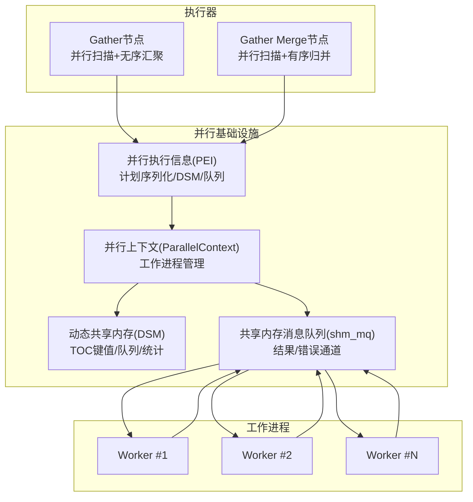
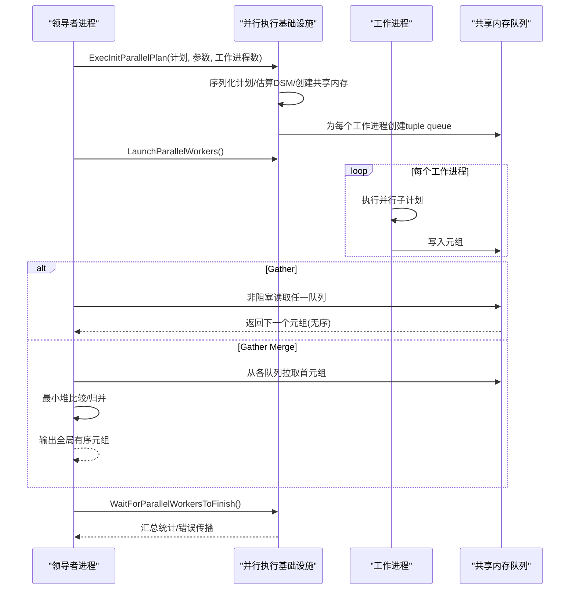
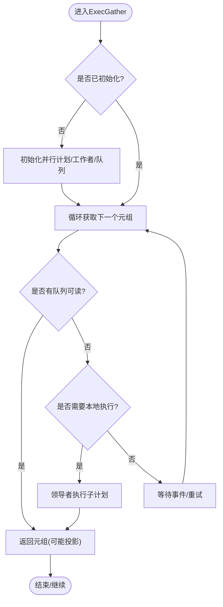
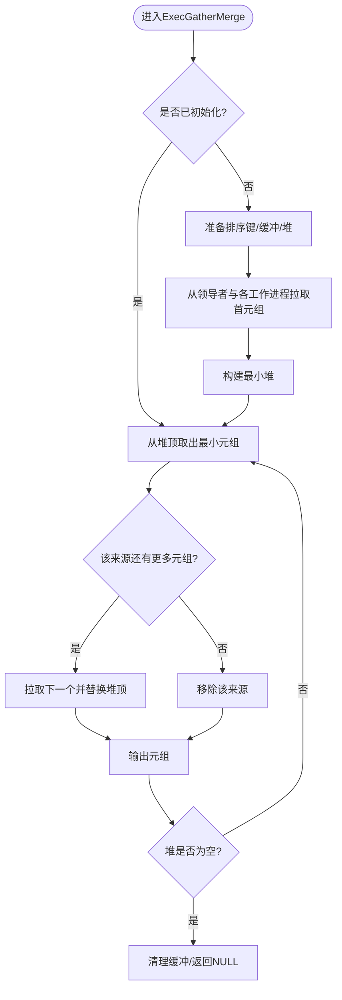
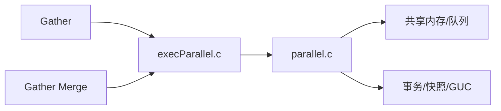

# 并行执行

<cite>
**本文引用的文件**
- [parallel.sgml](file://doc/src/sgml/parallel.sgml)
- [config.sgml](file://doc/src/sgml/config.sgml)
- [nodeGather.c](file://src/backend/executor/nodeGather.c)
- [nodeGatherMerge.c](file://src/backend/executor/nodeGatherMerge.c)
- [execParallel.c](file://src/backend/executor/execParallel.c)
- [parallel.c](file://src/backend/access/transam/parallel.c)
</cite>

## 目录
1. [简介](#简介)
2. [项目结构](#项目结构)
3. [核心组件](#核心组件)
4. [架构总览](#架构总览)
5. [详细组件分析](#详细组件分析)
6. [依赖关系分析](#依赖关系分析)
7. [性能与调优](#性能与调优)
8. [故障排查指南](#故障排查指南)
9. [结论](#结论)
10. [附录](#附录)

## 简介
本文件面向PostgreSQL的并行查询子系统，系统性阐述并行执行的基本概念、工作进程模型、任务分配与数据收集机制；深入解析Gather与Gather Merge节点的工作原理（结果集合并、负载均衡与故障恢复）；文档化并行执行的限制条件与兼容性要求（锁机制、事务一致性、资源管理）；给出配置参数与性能调优建议（worker数量、内存分配、通信开销优化）；并提供监控与调试方法。

## 项目结构
围绕并行执行的关键代码分布在以下模块：
- 执行器节点：Gather/Gather Merge负责并行扫描与结果汇聚
- 并行执行基础设施：并行上下文、动态共享内存（DSM）、消息队列、工作进程生命周期管理
- 文档：并行查询能力、限制、安全标注与配置项说明

图表来源
- [nodeGather.c:141-240](file://src/backend/executor/nodeGather.c#L141-L240)
- [nodeGatherMerge.c:187-280](file://src/backend/executor/nodeGatherMerge.c#L187-L280)
- [execParallel.c:573-800](file://src/backend/executor/execParallel.c#L573-L800)
- [parallel.c:558-644](file://src/backend/access/transam/parallel.c#L558-L644)

章节来源
- [parallel.sgml:25-105](file://doc/src/sgml/parallel.sgml#L25-L105)
- [config.sgml:2015-2118](file://doc/src/sgml/config.sgml#L2015-L2118)

## 核心组件
- Gather节点：在多个工作进程中并行执行子计划，将各工作进程产生的元组以任意顺序汇聚到领导者进程输出。适合无序结果或上层无需保持顺序的场景。
- Gather Merge节点：在工作进程各自产生有序流的基础上，由领导者进行多路归并，保证全局有序输出。适用于需要ORDER BY且下推排序到各工作进程的场景。
- 并行执行基础设施（execParallel.c）：负责序列化计划、估算DSM大小、创建共享内存段、建立tuple queue、初始化各节点的并行感知状态、启动工作进程等。
- 工作进程生命周期（parallel.c）：创建工作进程、等待其附着错误队列、等待完成、清理资源，以及处理失败与重启逻辑。

章节来源
- [nodeGather.c:57-132](file://src/backend/executor/nodeGather.c#L57-L132)
- [nodeGatherMerge.c:71-178](file://src/backend/executor/nodeGatherMerge.c#L71-L178)
- [execParallel.c:573-800](file://src/backend/executor/execParallel.c#L573-L800)
- [parallel.c:558-644](file://src/backend/access/transam/parallel.c#L558-L644)

## 架构总览
并行查询的执行流程大致如下：
1. 优化器生成包含Gather或Gather Merge的计划，并标注并行部分。
2. 执行器到达Gather/GM时，首次调用ExecInitParallelPlan构建并行执行环境（序列化计划、估算DSM、创建共享内存、建立tuple queue）。
3. 通过LaunchParallelWorkers启动若干工作进程，每个工作进程执行相同的并行子计划，并将结果写入共享内存队列。
4. 领导者从各工作进程的队列读取元组：Gather按可用即取，GM使用最小堆维护多路有序流的当前最小元组，实现有序归并。
5. 当所有工作进程完成或遇到错误时，领导者等待完成并汇总统计信息，最终返回结果。

图表来源
- [execParallel.c:573-800](file://src/backend/executor/execParallel.c#L573-L800)
- [parallel.c:558-644](file://src/backend/access/transam/parallel.c#L558-L644)
- [nodeGather.c:141-240](file://src/backend/executor/nodeGather.c#L141-L240)
- [nodeGatherMerge.c:187-280](file://src/backend/executor/nodeGatherMerge.c#L187-L280)

## 详细组件分析

### Gather节点
- 职责：并行执行子计划，将各工作进程产生的元组汇聚为单一输出流；支持领导者参与计算（可本地执行一部分以减少延迟）。
- 关键行为：
  - 首次执行时初始化并行计划与工作者，创建tuple queue读者数组。
  - 循环从各队列非阻塞读取，若无可读则轮询下一读者；若无工作者或单拷贝模式，则在领导者本地执行子计划。
  - 结束时关闭工作者并清理并行上下文。
- 负载均衡：采用“尽可能从同一队列连续读取”的策略，减少上下文切换；当队列无数据时切换到其他队列，近似轮询。
- 故障恢复：若某工作进程未能初始化，TupleQueueReaderNext返回空，视为该工作进程未产出元组；最终在等待完成时抛出错误。

图表来源
- [nodeGather.c:141-240](file://src/backend/executor/nodeGather.c#L141-L240)
- [nodeGather.c:263-392](file://src/backend/executor/nodeGather.c#L263-L392)

章节来源
- [nodeGather.c:57-132](file://src/backend/executor/nodeGather.c#L57-L132)
- [nodeGather.c:141-240](file://src/backend/executor/nodeGather.c#L141-L240)
- [nodeGather.c:263-392](file://src/backend/executor/nodeGather.c#L263-L392)

### Gather Merge节点
- 职责：在工作进程各自产生有序流的前提下，由领导者进行多路归并，保证全局有序输出。
- 关键行为：
  - 初始化时准备排序键、为每个工作进程分配缓冲与槽位，并创建最小堆。
  - 首次拉取时尝试从领导者与各工作进程各取一个元组，放入堆中；每次弹出最小元组后，将该来源的下一个元组入堆。
  - 对每个工作进程维护最多MAX_TUPLE_STORE个预取元组，降低阻塞与上下文切换成本。
- 负载均衡：基于最小堆的比较选择当前最小元组，天然实现有序归并；预取策略提升吞吐。
- 故障恢复：若某工作进程未完成初始化，读取为空，视为该来源耗尽；当所有来源耗尽时清理并返回NULL。

图表来源
- [nodeGatherMerge.c:187-280](file://src/backend/executor/nodeGatherMerge.c#L187-L280)
- [nodeGatherMerge.c:395-520](file://src/backend/executor/nodeGatherMerge.c#L395-L520)
- [nodeGatherMerge.c:547-591](file://src/backend/executor/nodeGatherMerge.c#L547-L591)
- [nodeGatherMerge.c:636-740](file://src/backend/executor/nodeGatherMerge.c#L636-L740)

章节来源
- [nodeGatherMerge.c:71-178](file://src/backend/executor/nodeGatherMerge.c#L71-L178)
- [nodeGatherMerge.c:187-280](file://src/backend/executor/nodeGatherMerge.c#L187-L280)
- [nodeGatherMerge.c:395-520](file://src/backend/executor/nodeGatherMerge.c#L395-L520)
- [nodeGatherMerge.c:547-591](file://src/backend/executor/nodeGatherMerge.c#L547-L591)
- [nodeGatherMerge.c:636-740](file://src/backend/executor/nodeGatherMerge.c#L636-L740)

### 并行执行基础设施（execParallel.c）
- 计划序列化：将计划树转换为字符串，修正resjunk列，过滤不安全子计划，确保工作进程仅执行安全的并行部分。
- DSM与TOC：估算所需空间，创建动态共享内存段，插入固定状态、查询文本、计划、参数列表、BufferUsage/WalUsage、tuple queue、DSA区域等键值。
- 元组队列：为每个工作进程创建shm_mq队列，设置接收者为领导者进程，用于高效传输结果。
- 统计与诊断：可选分配SharedExecutorInstrumentation，记录每个计划节点在每个工作进程上的统计信息。

章节来源
- [execParallel.c:142-214](file://src/backend/executor/execParallel.c#L142-L214)
- [execParallel.c:225-296](file://src/backend/executor/execParallel.c#L225-L296)
- [execParallel.c:429-515](file://src/backend/executor/execParallel.c#L429-L515)
- [execParallel.c:521-567](file://src/backend/executor/execParallel.c#L521-L567)
- [execParallel.c:573-800](file://src/backend/executor/execParallel.c#L573-L800)

### 工作进程生命周期（parallel.c）
- 创建并行上下文：校验并行模式、保存子事务ID、估计DSM大小。
- 初始化DSM：复制库状态、GUC、组合CID、快照、事务状态、重索引状态、关系映射器等；为每个工作进程创建错误队列。
- 启动工作进程：注册后台工作进程，绑定错误队列，记录已启动数量。
- 等待附着与完成：等待工作进程附着错误队列，检测启动失败；等待所有工作进程完成，传播错误并更新XLog进度。

章节来源
- [parallel.c:163-194](file://src/backend/access/transam/parallel.c#L163-L194)
- [parallel.c:201-480](file://src/backend/access/transam/parallel.c#L201-L480)
- [parallel.c:558-644](file://src/backend/access/transam/parallel.c#L558-L644)
- [parallel.c:678-768](file://src/backend/access/transam/parallel.c#L678-L768)
- [parallel.c:781-800](file://src/backend/access/transam/parallel.c#L781-L800)

## 依赖关系分析
- Gather/GM依赖并行执行基础设施提供的工作进程与队列；基础设施依赖共享内存与消息队列子系统；工作进程依赖事务快照、GUC、库状态等上下文。
- 耦合点：
  - 计划安全性：只有标记为并行安全的子计划才能下发至工作进程。
  - 资源上限：max_worker_processes、max_parallel_workers、max_parallel_workers_per_gather共同限制实际并发度。
  - 内存与通信：work_mem影响各工作进程内部临时结构；tuple queue大小影响吞吐与阻塞概率。

图表来源
- [execParallel.c:573-800](file://src/backend/executor/execParallel.c#L573-L800)
- [parallel.c:201-480](file://src/backend/access/transam/parallel.c#L201-L480)

章节来源
- [parallel.sgml:108-245](file://doc/src/sgml/parallel.sgml#L108-L245)
- [config.sgml:2015-2118](file://doc/src/sgml/config.sgml#L2015-L2118)

## 性能与调优
- worker数量设置
  - max_parallel_workers_per_gather：控制单个Gather/GM节点允许的最大工作进程数。
  - max_parallel_workers：系统级并行工作进程总数上限。
  - max_worker_processes：系统最大后台进程数上限。
  - 建议：根据CPU核数与IO带宽合理设置；大表扫描/聚合通常可从较多worker受益，但需避免过度导致上下文切换与内存压力。
- 领导者参与
  - parallel_leader_participation：默认开启，允许领导者在等待worker时自行执行子计划以降低首行延迟；关闭可减少worker被阻塞的概率，但首行延迟可能增加。
- 内存分配
  - work_mem：每个工作进程独立受限，并行查询总内存占用可能显著高于串行；注意排序/哈希/中间结果的内存消耗。
  - maintenance_work_mem/autovacuum_work_mem：影响维护操作中的并行内存使用（如VACUUM/重建索引），间接影响并行效率。
- 通信开销优化
  - tuple queue大小：execParallel中为每个工作进程分配固定大小的队列，过大浪费内存，过小易阻塞；可根据数据量与网络/内核缓冲区调整。
  - 预取策略：Gather Merge对每个工作进程预取最多10个元组，减少阻塞与上下文切换；在高吞吐场景下收益明显。
- 计划提示
  - 若期望的并行计划未出现，可降低parallel_setup_cost或parallel_tuple_cost促使优化器选择并行计划；或使用EXPLAIN (ANALYZE, VERBOSE)查看每工作进程统计，定位瓶颈。

章节来源
- [parallel.sgml:443-468](file://doc/src/sgml/parallel.sgml#L443-L468)
- [config.sgml:2015-2118](file://doc/src/sgml/config.sgml#L2015-L2118)
- [nodeGatherMerge.c:30-36](file://src/backend/executor/nodeGatherMerge.c#L30-L36)
- [execParallel.c:521-567](file://src/backend/executor/execParallel.c#L521-L567)

## 故障排查指南
- 常见限制与原因
  - 无法生成并行计划：查询写数据/加锁、游标/PL/pgSQL循环、函数标记PARALLEL UNSAFE、嵌套并行等。
  - 执行时退化为串行：达到max_worker_processes或max_parallel_workers上限；客户端Fetch计数非零等。
- 工作进程失败
  - 若工作进程未能附着错误队列，会抛出“parallel worker failed to initialize”；检查服务器日志获取更多细节。
  - 若某工作进程初始化失败，Gather/GM将其视为无输出来源；最终在等待完成时传播错误。
- 监控与调试
  - 使用EXPLAIN (ANALYZE, VERBOSE)查看每工作进程统计，评估负载分布与热点。
  - 关注work_mem、parallel_leader_participation、tuple queue大小对吞吐与延迟的影响。
  - 通过pg_stat_activity、pg_stat_bgworkers观察工作进程状态与生命周期。

章节来源
- [parallel.sgml:108-245](file://doc/src/sgml/parallel.sgml#L108-L245)
- [parallel.sgml:443-468](file://doc/src/sgml/parallel.sgml#L443-L468)
- [parallel.c:678-768](file://src/backend/access/transam/parallel.c#L678-L768)

## 结论
PostgreSQL的并行执行通过Gather/GM节点与工作进程协作，结合DSM与共享内存队列实现高效的数据并行与结果汇聚。Gather适合无序结果快速返回，Gather Merge保证有序输出。合理的worker数量、内存与通信参数调优能显著提升大查询吞吐。同时需关注并行安全、资源上限与故障恢复机制，确保稳定性与正确性。

## 附录
- 并行扫描类型：并行顺序扫描、并行位图堆扫描、并行索引/索引-only扫描（btree）。
- 并行连接：嵌套循环、合并连接、哈希连接（含并行哈希）。
- 并行聚合：两阶段聚合（Partial/Finalize Aggregate），要求聚合函数并行安全且具备combine函数。
- 并行Append：将多个源的结果集并行合并，避免串行Append的启动开销与竞争。

章节来源
- [parallel.sgml:265-441](file://doc/src/sgml/parallel.sgml#L265-L441)