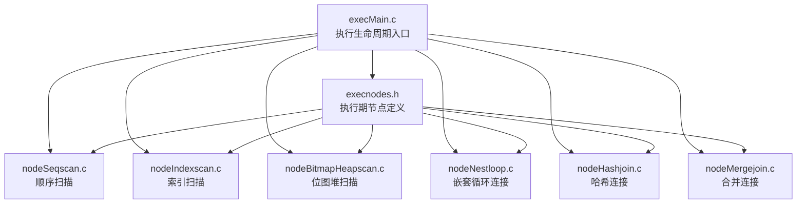
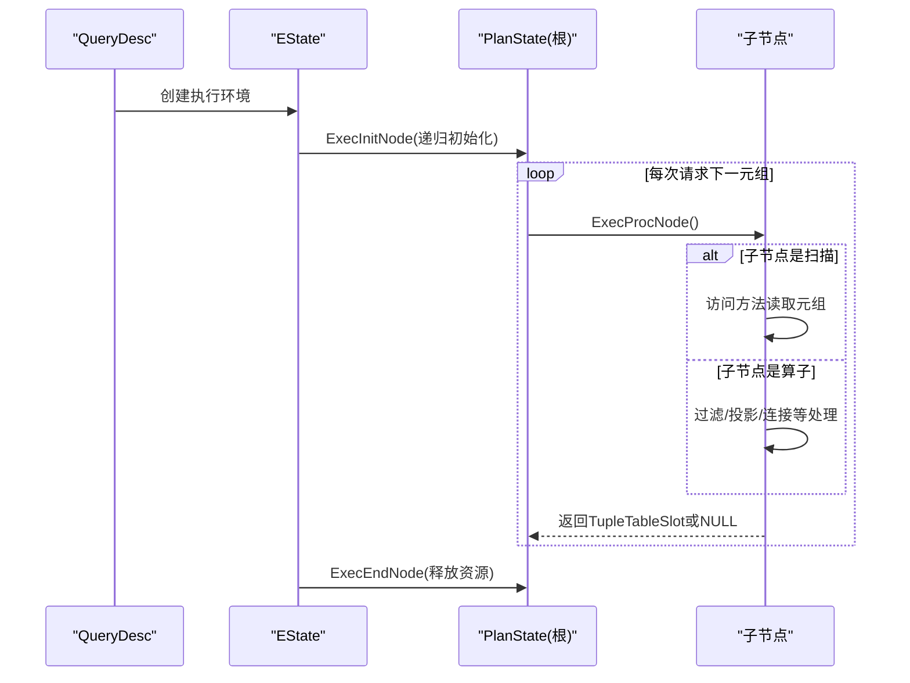
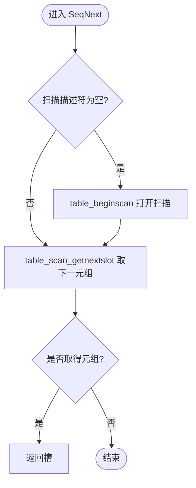
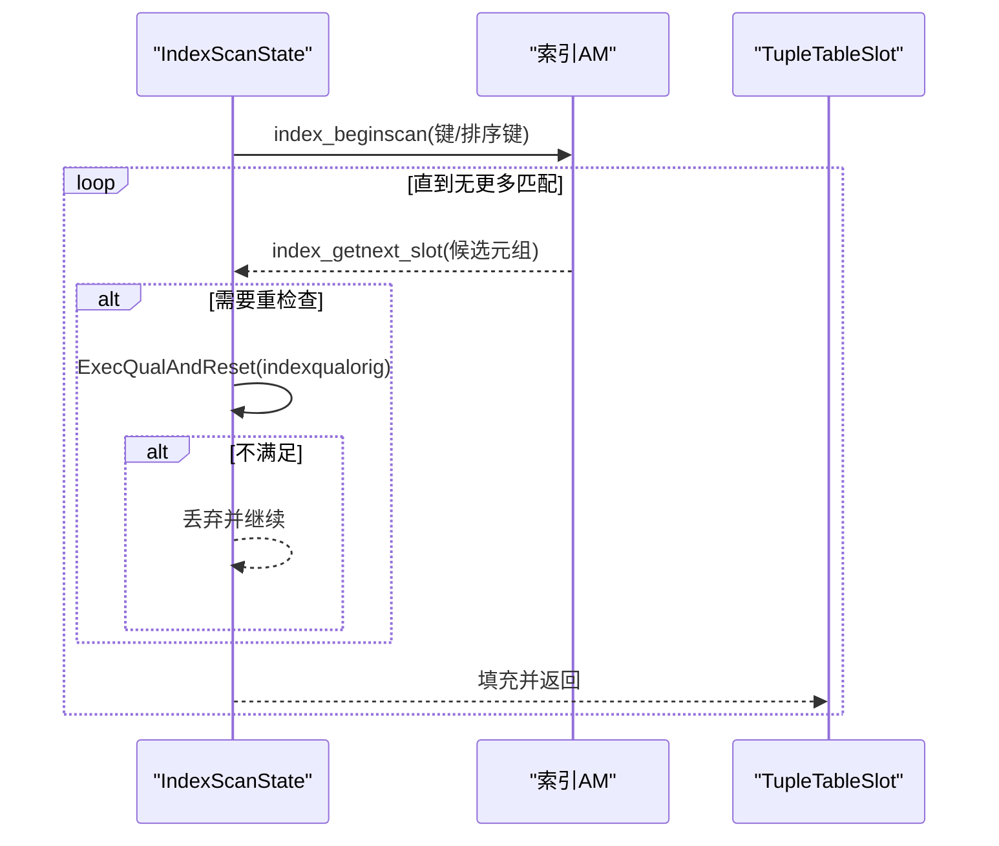
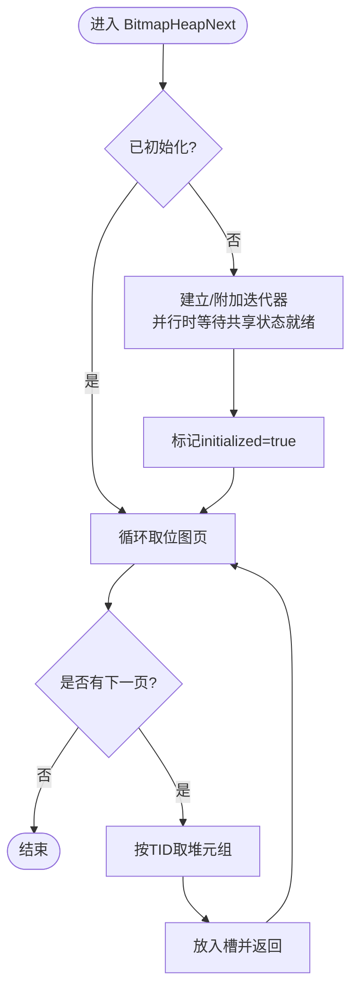
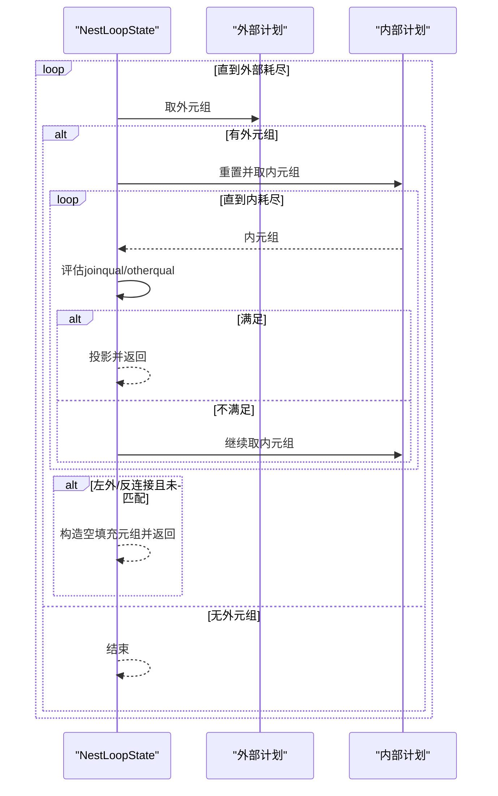
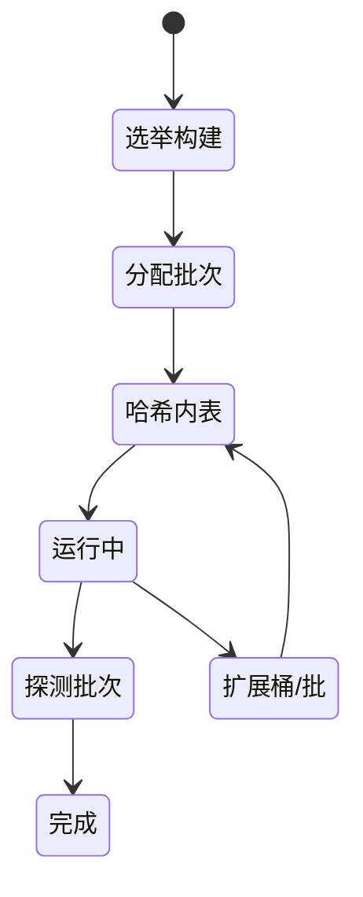
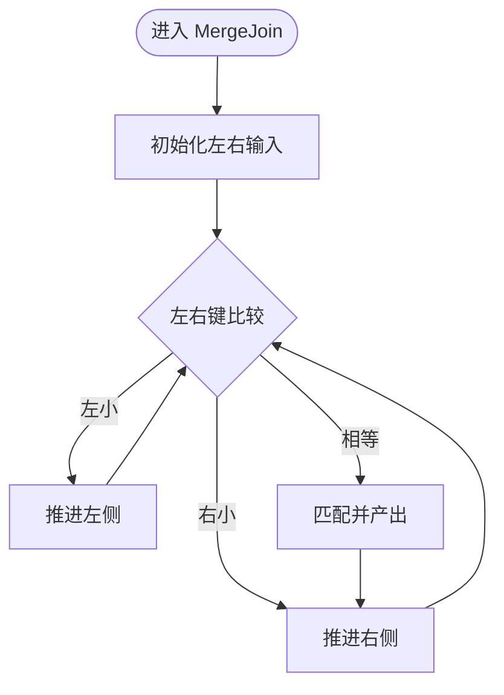
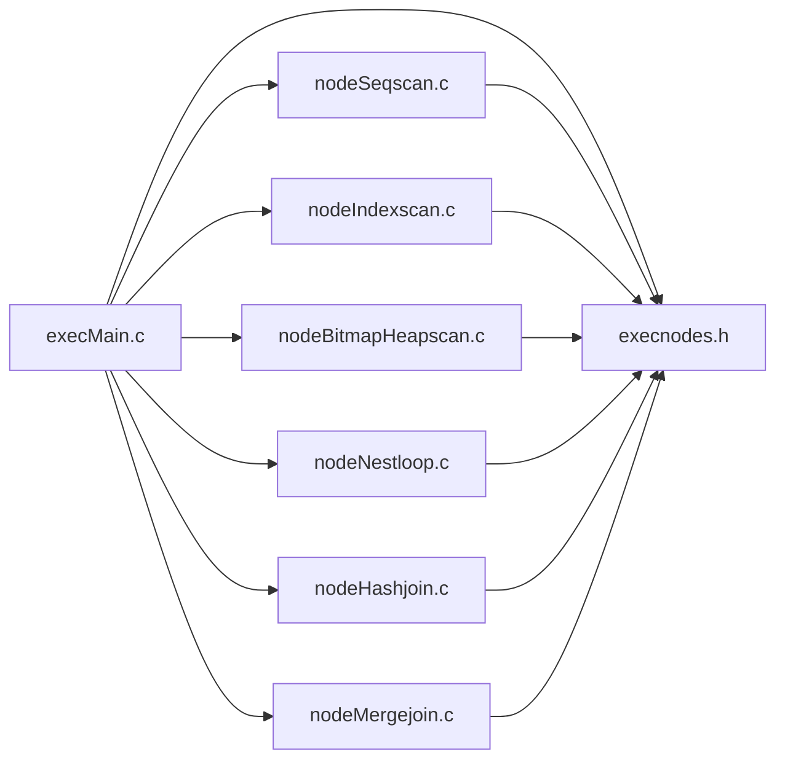

# 执行引擎

<cite>
**本文引用的文件**
- [src/backend/executor/README](file://src/backend/executor/README)
- [src/backend/executor/execMain.c](file://src/backend/executor/execMain.c)
- [src/include/nodes/execnodes.h](file://src/include/nodes/execnodes.h)
- [src/backend/executor/nodeSeqscan.c](file://src/backend/executor/nodeSeqscan.c)
- [src/backend/executor/nodeIndexscan.c](file://src/backend/executor/nodeIndexscan.c)
- [src/backend/executor/nodeBitmapHeapscan.c](file://src/backend/executor/nodeBitmapHeapscan.c)
- [src/backend/executor/nodeNestloop.c](file://src/backend/executor/nodeNestloop.c)
- [src/backend/executor/nodeHashjoin.c](file://src/backend/executor/nodeHashjoin.c)
- [src/backend/executor/nodeMergejoin.c](file://src/backend/executor/nodeMergejoin.c)
</cite>

## 目录
1. [简介](#简介)
2. [项目结构](#项目结构)
3. [核心组件](#核心组件)
4. [架构总览](#架构总览)
5. [详细组件分析](#详细组件分析)
6. [依赖关系分析](#依赖关系分析)
7. [性能考虑](#性能考虑)
8. [故障排查指南](#故障排查指南)
9. [结论](#结论)
10. [附录](#附录)

## 简介
本文件面向PostgreSQL执行引擎，聚焦以下目标：
- 解释执行计划节点的生命周期管理（初始化、数据获取、结果返回、清理）。
- 详细说明扫描节点的访问方法实现：顺序扫描、索引扫描、位图扫描。
- 文档化连接算法的执行过程：嵌套循环连接、哈希连接、合并连接。
- 提供执行监控与性能分析方法，以及并行执行与内存管理的优化技巧。

## 项目结构
执行引擎位于 src/backend/executor，配合头文件 src/include/nodes/execnodes.h 定义执行期状态节点；顶层入口在 execMain.c；各具体节点按功能拆分到 node*.c 文件。README 提供了执行模型、表达式求值、内存管理与控制流的总体说明。

**图示来源**
- [src/backend/executor/execMain.c:113-200](file://src/backend/executor/execMain.c#L113-L200)
- [src/include/nodes/execnodes.h:44-114](file://src/include/nodes/execnodes.h#L44-L114)

**章节来源**
- [src/backend/executor/README:47-283](file://src/backend/executor/README#L47-L283)
- [src/backend/executor/execMain.c:113-200](file://src/backend/executor/execMain.c#L113-L200)
- [src/include/nodes/execnodes.h:44-114](file://src/include/nodes/execnodes.h#L44-L114)

## 核心组件
- 执行期节点与上下文
  - ExprState/ExprContext：表达式求值与每元组内存上下文，支持快速路径与非递归步骤数组。
  - PlanState/Plan：计划树与执行期状态树分离，执行期修改状态树，计划树只读便于缓存复用。
- 执行生命周期
  - ExecutorStart/ExecutorRun/ExecutorFinish/ExecutorEnd：创建EState、初始化节点、逐元组拉取、收尾清理。
- 扫描节点基类
  - ScanState：封装当前关系、扫描描述符、槽等通用能力；具体扫描通过ExecScan调用访问方法回调。

**章节来源**
- [src/include/nodes/execnodes.h:44-114](file://src/include/nodes/execnodes.h#L44-L114)
- [src/include/nodes/execnodes.h:189-258](file://src/include/nodes/execnodes.h#L189-L258)
- [src/backend/executor/README:47-113](file://src/backend/executor/README#L47-L113)
- [src/backend/executor/README:226-283](file://src/backend/executor/README#L226-L283)
- [src/backend/executor/execMain.c:113-200](file://src/backend/executor/execMain.c#L113-L200)

## 架构总览
执行引擎采用“需求拉取”的管道模型：每个节点在被调用时产生下一个元组或NULL；非原始扫描节点会调用其子节点以获取输入元组。表达式求值被编译为扁平步骤数组，减少函数调用开销并支持解释与编译两种执行方式。内存管理采用“每查询”和“每元组”两级上下文，简化资源回收。

**图示来源**
- [src/backend/executor/README:47-113](file://src/backend/executor/README#L47-L113)
- [src/backend/executor/README:245-283](file://src/backend/executor/README#L245-L283)

**章节来源**
- [src/backend/executor/README:47-113](file://src/backend/executor/README#L47-L113)
- [src/backend/executor/README:245-283](file://src/backend/executor/README#L245-L283)

## 详细组件分析

### 顺序扫描（SeqScan）
- 职责：顺序遍历表，返回满足条件的元组。
- 生命周期
  - 初始化：打开关系、创建槽、构建投影与qual表达式上下文。
  - 数据获取：通过table_beginscan/table_scan_getnextslot拉取元组。
  - 结果返回：将元组放入槽并返回给上层。
  - 清理：关闭扫描描述符、释放表达式上下文。
- 关键点：支持方向扫描；重检查接口用于EPQ场景。

**图示来源**
- [src/backend/executor/nodeSeqscan.c:49-83](file://src/backend/executor/nodeSeqscan.c#L49-L83)

**章节来源**
- [src/backend/executor/nodeSeqscan.c:107-175](file://src/backend/executor/nodeSeqscan.c#L107-L175)
- [src/backend/executor/nodeSeqscan.c:183-200](file://src/backend/executor/nodeSeqscan.c#L183-L200)

### 索引扫描（IndexScan）
- 职责：基于索引键与排序键访问表，必要时回表取完整元组。
- 生命周期
  - 初始化：建立索引扫描描述符、准备扫描键与排序键。
  - 数据获取：index_beginscan/index_getnext_slot循环获取，支持lossy索引的重检查。
  - 结果返回：将元组放入槽；若需ORDER BY重排则使用优先队列缓冲并重排输出。
  - 清理：关闭索引扫描描述符、释放资源。
- 关键点：支持反向扫描；可结合reorderqueue对非索引列排序进行后处理。

**图示来源**
- [src/backend/executor/nodeIndexscan.c:80-161](file://src/backend/executor/nodeIndexscan.c#L80-L161)

**章节来源**
- [src/backend/executor/nodeIndexscan.c:80-161](file://src/backend/executor/nodeIndexscan.c#L80-L161)
- [src/backend/executor/nodeIndexscan.c:163-200](file://src/backend/executor/nodeIndexscan.c#L163-L200)

### 位图堆扫描（BitmapHeapScan）
- 职责：先由索引生成TID位图，再按位图访问堆表，适合多条件组合或选择性较低的场景。
- 生命周期
  - 初始化：从外层子计划获取TIDBitmap，建立迭代器；可选并行共享迭代器。
  - 数据获取：tbm_iterate/tbm_shared_iterate分页推进，按需预取页面以提升吞吐。
  - 结果返回：根据TID从堆表取元组，放入槽返回。
  - 清理：释放迭代器与相关资源。
- 关键点：必须使用MVCC快照以保证一致性；支持并行位图扫描与预取策略。

**图示来源**
- [src/backend/executor/nodeBitmapHeapscan.c:70-200](file://src/backend/executor/nodeBitmapHeapscan.c#L70-L200)

**章节来源**
- [src/backend/executor/nodeBitmapHeapscan.c:70-200](file://src/backend/executor/nodeBitmapHeapscan.c#L70-L200)

### 嵌套循环连接（NestLoop）
- 职责：对外部关系的每一行，驱动内部关系扫描并应用连接条件。
- 生命周期
  - 初始化：设置外部/内部计划指针、连接条件表达式上下文。
  - 数据获取：取外元组，更新PARAM_EXEC参数，重置内部扫描；取内元组。
  - 结果返回：评估连接条件与其他限定，投影输出；支持左外/反连接的空填充。
  - 清理：释放表达式上下文与资源。
- 关键点：当内部扫描耗尽时回到外部循环；支持参数传递与重扫描。

**图示来源**
- [src/backend/executor/nodeNestloop.c:60-200](file://src/backend/executor/nodeNestloop.c#L60-L200)

**章节来源**
- [src/backend/executor/nodeNestloop.c:60-200](file://src/backend/executor/nodeNestloop.c#L60-L200)

### 哈希连接（HashJoin）
- 职责：对内关系构建哈希表，对外关系探测匹配；支持多批次与并行。
- 生命周期
  - 构建阶段：对内部关系分桶/分批构建哈希表；可扩展桶/批以控制负载因子与内存。
  - 探测阶段：对外关系逐行计算哈希值，定位桶并比较连接条件。
  - 并行协调：使用屏障同步构建/探测阶段；主进程与工作者协作分配批次与探测。
  - 清理：释放哈希表、批次与共享状态。
- 关键点：Hybrid Hash Join；单批或多批；支持并行感知与不可感知两种模式。

**图示来源**
- [src/backend/executor/nodeHashjoin.c:15-109](file://src/backend/executor/nodeHashjoin.c#L15-L109)
- [src/backend/executor/nodeHashjoin.c:127-200](file://src/backend/executor/nodeHashjoin.c#L127-L200)

**章节来源**
- [src/backend/executor/nodeHashjoin.c:15-109](file://src/backend/executor/nodeHashjoin.c#L15-L109)
- [src/backend/executor/nodeHashjoin.c:127-200](file://src/backend/executor/nodeHashjoin.c#L127-L200)

### 合并连接（MergeJoin）
- 职责：对已排序的外/内关系，按连接键逐步推进并匹配。
- 生命周期
  - 初始化：解析merge clauses，准备比较函数与排序信息。
  - 推进阶段：比较左右键，移动较小一侧；相等时批量匹配并推进。
  - 标记恢复：利用mark/restartable接口回退内游标以处理重复匹配。
  - 清理：释放比较信息与资源。
- 关键点：要求输入有序；支持多键合并；可处理nulls-first/last策略。

**图示来源**
- [src/backend/executor/nodeMergejoin.c:21-92](file://src/backend/executor/nodeMergejoin.c#L21-L92)
- [src/backend/executor/nodeMergejoin.c:103-200](file://src/backend/executor/nodeMergejoin.c#L103-L200)

**章节来源**
- [src/backend/executor/nodeMergejoin.c:21-92](file://src/backend/executor/nodeMergejoin.c#L21-L92)
- [src/backend/executor/nodeMergejoin.c:103-200](file://src/backend/executor/nodeMergejoin.c#L103-L200)

## 依赖关系分析
- 执行期节点依赖
  - 扫描节点依赖访问方法（heapam/indexam），通过table_beginscan/index_beginscan抽象。
  - 连接节点依赖子计划与表达式求值（ExprState/ExprContext）。
  - 并行连接依赖屏障与共享状态（ParallelHashJoinState等）。
- 模块耦合
  - execMain.c作为入口，协调生命周期；各node*.c实现具体逻辑；execnodes.h提供公共类型。
  - 表达式求值与内存管理贯穿所有节点，形成横向依赖。

**图示来源**
- [src/backend/executor/execMain.c:113-200](file://src/backend/executor/execMain.c#L113-L200)
- [src/include/nodes/execnodes.h:44-114](file://src/include/nodes/execnodes.h#L44-L114)

**章节来源**
- [src/backend/executor/execMain.c:113-200](file://src/backend/executor/execMain.c#L113-L200)
- [src/include/nodes/execnodes.h:44-114](file://src/include/nodes/execnodes.h#L44-L114)

## 性能考虑
- 表达式求值优化
  - 将表达式编译为扁平步骤数组，避免递归与频繁函数调用；简单表达式走特化路径。
  - 使用每元组ExprContext，及时释放中间结果，降低峰值内存。
- 扫描优化
  - 顺序扫描：顺序I/O友好，适合全表或高选择性低的情况。
  - 索引扫描：利用索引键减少回表次数；lossy索引需重检查，注意代价。
  - 位图扫描：多条件组合时减少随机I/O；启用预取提升吞吐。
- 连接优化
  - 嵌套循环：小驱动集或小内表时高效；注意参数传递与重扫描成本。
  - 哈希连接：大表连接首选；合理设置hash_mem与批次/桶数量，避免溢出。
  - 合并连接：输入有序时线性扫描；注意排序成本与null策略。
- 并行与内存
  - 并行哈希连接：通过屏障协调多进程，分摊构建与探测；注意死锁避免与阶段推进。
  - 内存管理：每查询上下文集中管理，每元组上下文快速复位；避免跨元组泄漏。

[本节为通用指导，无需特定文件引用]

## 故障排查指南
- 常见问题定位
  - 扫描未返回元组：检查扫描描述符是否正确打开、快照是否有效、是否误用非MVCC快照（位图扫描）。
  - 连接结果为空：确认连接条件表达式、参数传递、内外输入顺序与排序约束。
  - 性能异常：观察是否发生大量重检查（lossy索引）、哈希溢出、排序回盘。
- 调试建议
  - 使用EXPLAIN/ANALYZE查看计划与统计；关注过滤计数与耗时分布。
  - 检查表达式上下文与槽的使用，确保每元组内存正确复位。
  - 并行执行下核对屏障阶段与共享状态初始化。

[本节为通用指导，无需特定文件引用]

## 结论
执行引擎通过清晰的节点生命周期、高效的表达式求值与灵活的访问方法，实现了高性能的数据处理。顺序、索引与位图扫描覆盖不同访问模式；嵌套循环、哈希与合并连接在不同数据规模与排序条件下各有优势。结合并行执行与内存管理策略，可在复杂查询中获得稳定与可扩展的性能表现。

[本节为总结性内容，无需特定文件引用]

## 附录
- 执行生命周期参考
  - 创建查询描述、启动执行、运行、收尾、结束。
- 关键数据结构
  - ExprState/ExprContext、PlanState/Plan、ScanState、各类连接状态。
- 典型流程
  - 扫描：打开→取元组→过滤→返回→关闭。
  - 连接：驱动→探测→匹配→输出→推进。

[本节为补充信息，无需特定文件引用]