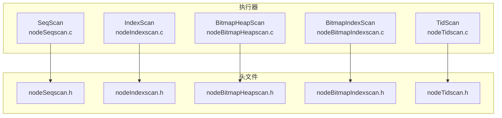
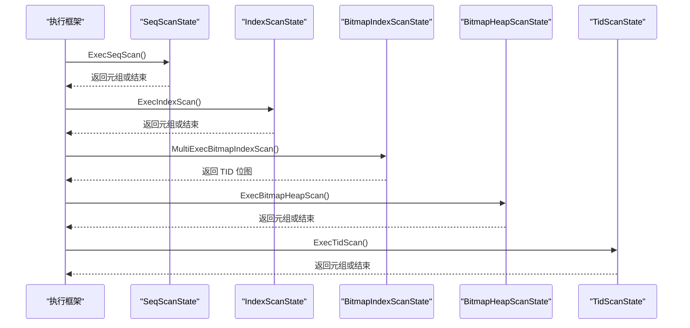
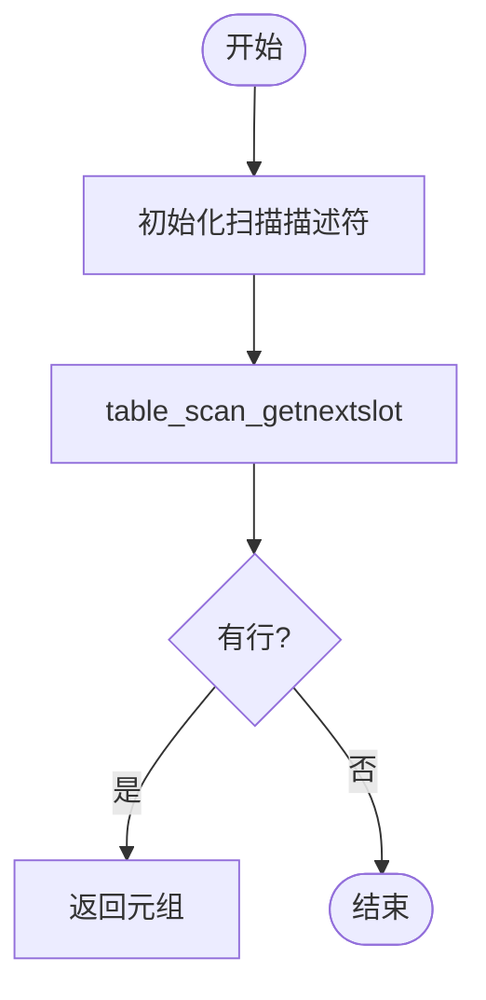
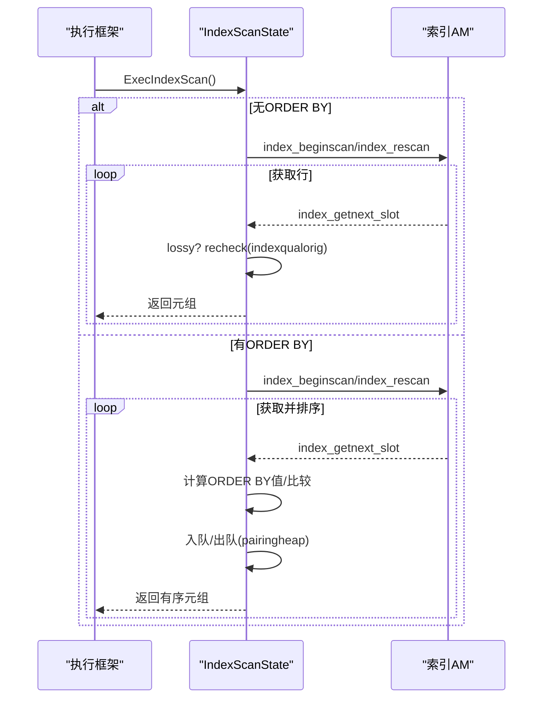
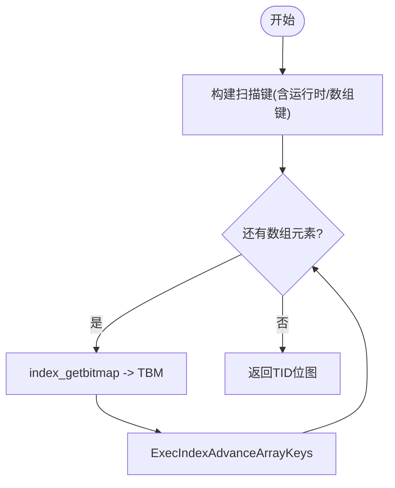
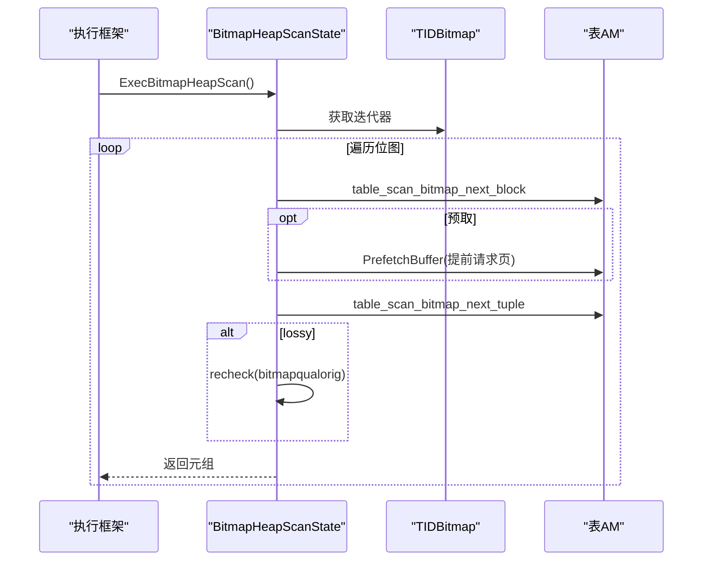
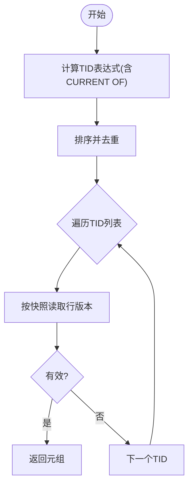
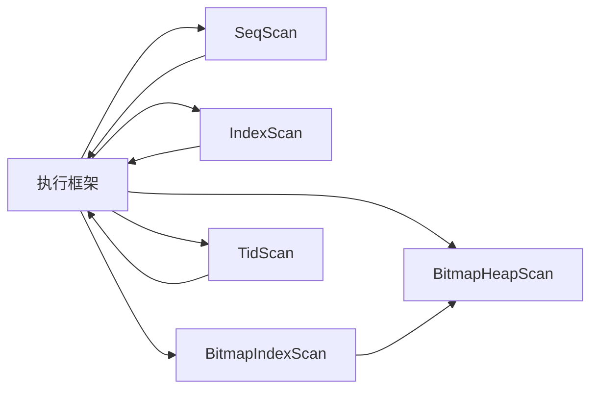

# 扫描节点

<cite>
**本文引用的文件**
- [nodeSeqscan.c](file://src/backend/executor/nodeSeqscan.c)
- [nodeIndexscan.c](file://src/backend/executor/nodeIndexscan.c)
- [nodeBitmapHeapscan.c](file://src/backend/executor/nodeBitmapHeapscan.c)
- [nodeBitmapIndexscan.c](file://src/backend/executor/nodeBitmapIndexscan.c)
- [nodeTidscan.c](file://src/backend/executor/nodeTidscan.c)
- [nodeSeqscan.h](file://src/include/executor/nodeSeqscan.h)
- [nodeIndexscan.h](file://src/include/executor/nodeIndexscan.h)
- [nodeBitmapHeapscan.h](file://src/include/executor/nodeBitmapHeapscan.h)
- [nodeBitmapIndexscan.h](file://src/include/executor/nodeBitmapIndexscan.h)
- [nodeTidscan.h](file://src/include/executor/nodeTidscan.h)
</cite>

## 目录
1. [简介](#简介)
2. [项目结构](#项目结构)
3. [核心组件](#核心组件)
4. [架构总览](#架构总览)
5. [详细组件分析](#详细组件分析)
6. [依赖关系分析](#依赖关系分析)
7. [性能考量](#性能考量)
8. [故障排查指南](#故障排查指南)
9. [结论](#结论)
10. [附录](#附录)

## 简介
本文件聚焦于执行器中的扫描节点，系统性地解释顺序扫描（SeqScan）、索引扫描（IndexScan）、位图堆扫描（BitmapHeapScan）、位图索引扫描（BitmapIndexScan）和 TID 扫描（TidScan）的工作原理与实现细节。内容涵盖：
- 初始化流程、数据获取机制、条件过滤处理
- 性能优化策略（并行、预取、排序重排、可见性跳过等）
- 选择标准与执行计划使用场景
- 监控与调优方法

## 项目结构
扫描节点位于执行器子系统中，按功能拆分为独立源文件与头文件，便于维护与扩展。关键路径如下：
- 后端执行器实现：src/backend/executor/node*.c
- 执行器节点接口定义：src/include/executor/node*.h

图表来源
- [nodeSeqscan.c:1-315](file://src/backend/executor/nodeSeqscan.c#L1-L315)
- [nodeIndexscan.c:1-800](file://src/backend/executor/nodeIndexscan.c#L1-L800)
- [nodeBitmapHeapscan.c:1-800](file://src/backend/executor/nodeBitmapHeapscan.c#L1-L800)
- [nodeBitmapIndexscan.c:1-331](file://src/backend/executor/nodeBitmapIndexscan.c#L1-L331)
- [nodeTidscan.c:1-570](file://src/backend/executor/nodeTidscan.c#L1-L570)
- [nodeSeqscan.h:1-32](file://src/include/executor/nodeSeqscan.h#L1-L32)
- [nodeIndexscan.h:1-48](file://src/include/executor/nodeIndexscan.h#L1-L48)
- [nodeBitmapHeapscan.h:1-33](file://src/include/executor/nodeBitmapHeapscan.h#L1-L33)
- [nodeBitmapIndexscan.h:1-25](file://src/include/executor/nodeBitmapIndexscan.h#L1-L25)
- [nodeTidscan.h:1-24](file://src/include/executor/nodeTidscan.h#L1-L24)

章节来源
- [nodeSeqscan.c:1-315](file://src/backend/executor/nodeSeqscan.c#L1-L315)
- [nodeIndexscan.c:1-800](file://src/backend/executor/nodeIndexscan.c#L1-L800)
- [nodeBitmapHeapscan.c:1-800](file://src/backend/executor/nodeBitmapHeapscan.c#L1-L800)
- [nodeBitmapIndexscan.c:1-331](file://src/backend/executor/nodeBitmapIndexscan.c#L1-L331)
- [nodeTidscan.c:1-570](file://src/backend/executor/nodeTidscan.c#L1-L570)

## 核心组件
- SeqScan：顺序全表扫描，支持并行分区扫描与共享内存状态分配。
- IndexScan：基于索引的精确或范围扫描，支持 ORDER BY 重排序队列与运行时键。
- BitmapIndexScan：生成 TID 位图，供上层 BitmapHeapScan 消费；支持数组键与共享位图。
- BitmapHeapScan：根据位图访问堆页，支持预取、可见性跳过、并行迭代器。
- TidScan：直接按 TID 列表读取行，支持 CURRENT OF 与去重排序。

章节来源
- [nodeSeqscan.c:107-175](file://src/backend/executor/nodeSeqscan.c#L107-L175)
- [nodeIndexscan.c:521-593](file://src/backend/executor/nodeIndexscan.c#L521-L593)
- [nodeBitmapIndexscan.c:49-122](file://src/backend/executor/nodeBitmapIndexscan.c#L49-L122)
- [nodeBitmapHeapscan.c:70-338](file://src/backend/executor/nodeBitmapHeapscan.c#L70-L338)
- [nodeTidscan.c:309-449](file://src/backend/executor/nodeTidscan.c#L309-L449)

## 架构总览
扫描节点统一通过执行框架调用，提供“访问方法”回调以获取下一行，以及“重检查”回调用于 EvalPlanQual 等场景。

图表来源
- [nodeSeqscan.c:107-115](file://src/backend/executor/nodeSeqscan.c#L107-L115)
- [nodeIndexscan.c:521-540](file://src/backend/executor/nodeIndexscan.c#L521-L540)
- [nodeBitmapIndexscan.c:49-122](file://src/backend/executor/nodeBitmapIndexscan.c#L49-L122)
- [nodeBitmapHeapscan.c:586-594](file://src/backend/executor/nodeBitmapHeapscan.c#L586-L594)
- [nodeTidscan.c:441-449](file://src/backend/executor/nodeTidscan.c#L441-L449)

## 详细组件分析

### 顺序扫描（SeqScan）
- 初始化
  - 创建状态结构，设置执行函数指针
  - 打开扫描关系，创建槽位，初始化投影与 qual
  - 支持并行估计、DSM 初始化与 worker 初始化
- 数据获取
  - 首次调用时建立 table scan descriptor，随后通过 table_scan_getnextslot 逐行获取
  - 方向由执行环境决定
- 条件过滤
  - 不依赖索引键进行过滤，qual 在框架层评估
- 性能优化
  - 并行扫描：估算 DSM 空间、初始化并行描述符、worker 附着
  - 简单高效，适合全表或小表扫描

图表来源
- [nodeSeqscan.c:49-83](file://src/backend/executor/nodeSeqscan.c#L49-L83)
- [nodeSeqscan.c:107-115](file://src/backend/executor/nodeSeqscan.c#L107-L115)

章节来源
- [nodeSeqscan.c:122-175](file://src/backend/executor/nodeSeqscan.c#L122-L175)
- [nodeSeqscan.c:249-314](file://src/backend/executor/nodeSeqscan.c#L249-L314)

### 索引扫描（IndexScan）
- 初始化
  - 构建扫描键与可选 ORDER BY 键，支持运行时键与数组键
  - 懒启动：首次获取时才建立 index scan descriptor
- 数据获取
  - 通过 index_getnext_slot 获取行，必要时对 lossy 索引进行 recheck
  - 若存在 ORDER BY，使用 pairing heap 进行重排序输出
- 条件过滤
  - 对 lossy 索引结果用 indexqualorig 重新校验
- 性能优化
  - 运行时键延迟计算与更新
  - 数组键展开与推进
  - ORDER BY 重排序队列保证有序输出

图表来源
- [nodeIndexscan.c:80-161](file://src/backend/executor/nodeIndexscan.c#L80-L161)
- [nodeIndexscan.c:170-357](file://src/backend/executor/nodeIndexscan.c#L170-L357)
- [nodeIndexscan.c:521-593](file://src/backend/executor/nodeIndexscan.c#L521-L593)

章节来源
- [nodeIndexscan.c:521-593](file://src/backend/executor/nodeIndexscan.c#L521-L593)
- [nodeIndexscan.c:600-779](file://src/backend/executor/nodeIndexscan.c#L600-L779)

### 位图索引扫描（BitmapIndexScan）
- 初始化
  - 打开索引关系，构建扫描键（含运行时键与数组键）
  - 创建 bitmap index scan descriptor
- 数据获取
  - 循环调用 index_getbitmap 将匹配 TID 写入位图
  - 支持数组键推进与多次 rescan
- 输出
  - 返回 TID 位图给父节点（通常是 BitmapHeapScan）

图表来源
- [nodeBitmapIndexscan.c:210-331](file://src/backend/executor/nodeBitmapIndexscan.c#L210-L331)
- [nodeBitmapIndexscan.c:49-122](file://src/backend/executor/nodeBitmapIndexscan.c#L49-L122)

章节来源
- [nodeBitmapIndexscan.c:210-331](file://src/backend/executor/nodeBitmapIndexscan.c#L210-L331)

### 位图堆扫描（BitmapHeapScan）
- 初始化
  - 打开堆关系，初始化表达式上下文与槽位
  - 从子节点获取 TID 位图，准备迭代器（支持并行共享迭代器）
- 数据获取
  - 遍历位图块/元组，按需加载堆页
  - 支持预取：双迭代器与自适应目标距离
  - 可见性优化：若无需列且页面全部可见，可跳过实际读取
- 条件过滤
  - 对 lossy 位图项在每个元组上重新评估 bitmapqualorig
- 性能优化
  - 预取策略与并行共享状态
  - 可见性映射快速跳过
  - 精确/模糊页计数统计

图表来源
- [nodeBitmapHeapscan.c:70-338](file://src/backend/executor/nodeBitmapHeapscan.c#L70-L338)
- [nodeBitmapHeapscan.c:358-562](file://src/backend/executor/nodeBitmapHeapscan.c#L358-L562)

章节来源
- [nodeBitmapHeapscan.c:704-800](file://src/backend/executor/nodeBitmapHeapscan.c#L704-L800)
- [nodeBitmapHeapscan.c:586-641](file://src/backend/executor/nodeBitmapHeapscan.c#L586-L641)

### TID 扫描（TidScan）
- 初始化
  - 解析 TID 条件表达式，支持单 TID、TID[] 与 CURRENT OF
  - 延迟初始化扫描描述符，避免不必要开销
- 数据获取
  - 计算 TID 列表，排序去重以提升访问局部性
  - 按方向（前向/后向）遍历 TID 列表，读取最新版本
- 条件过滤
  - 对 WHERE CURRENT OF 总是返回最新可见版本
  - 非 CURRENT OF 情况下，通过二进制搜索验证 TID 是否在列表中
- 性能优化
  - TID 排序与去重减少随机 I/O
  - 惰性求值与按需初始化

图表来源
- [nodeTidscan.c:65-121](file://src/backend/executor/nodeTidscan.c#L65-L121)
- [nodeTidscan.c:129-275](file://src/backend/executor/nodeTidscan.c#L129-L275)
- [nodeTidscan.c:309-449](file://src/backend/executor/nodeTidscan.c#L309-L449)

章节来源
- [nodeTidscan.c:508-569](file://src/backend/executor/nodeTidscan.c#L508-L569)

## 依赖关系分析
- 执行框架依赖各扫描节点的访问方法与重检查回调
- IndexScan 与 BitmapIndexScan 共享运行时键与数组键工具函数
- BitmapHeapScan 依赖 TID 位图与表访问方法（AM）
- 并行能力在各节点中通过 DSM 与共享迭代器协调

图表来源
- [nodeIndexscan.h:36-45](file://src/include/executor/nodeIndexscan.h#L36-L45)
- [nodeBitmapIndexscan.c:49-122](file://src/backend/executor/nodeBitmapIndexscan.c#L49-L122)
- [nodeBitmapHeapscan.c:70-338](file://src/backend/executor/nodeBitmapHeapscan.c#L70-L338)

章节来源
- [nodeIndexscan.h:1-48](file://src/include/executor/nodeIndexscan.h#L1-L48)
- [nodeBitmapIndexscan.h:1-25](file://src/include/executor/nodeBitmapIndexscan.h#L1-L25)

## 性能考量
- 选择标准
  - 全表扫描/小表：SeqScan
  - 精确/范围查询：IndexScan
  - 多条件 OR/合并多个索引：BitmapIndexScan + BitmapHeapScan
  - 已知 TID 列表：TidScan
- 优化策略
  - 并行扫描：SeqScan/IndexScan/BitmapHeapScan 均支持并行与共享状态
  - 预取：BitmapHeapScan 的双迭代器与自适应目标距离
  - 可见性跳过：当不需要列且页面全部可见时跳过读取
  - 排序重排：IndexScan 使用 pairing heap 保证 ORDER BY 正确性
  - 运行时键与数组键：延迟计算与推进，减少重复开销
- 监控指标
  - 过滤计数：IndexScan/BitmapHeapScan 在 recheck 失败时增加过滤计数
  - 精确/模糊页计数：BitmapHeapScan 统计 exact_pages 与 lossy_pages
  - 并行状态：共享迭代器与预取进度

章节来源
- [nodeIndexscan.c:137-150](file://src/backend/executor/nodeIndexscan.c#L137-L150)
- [nodeBitmapHeapscan.c:209-227](file://src/backend/executor/nodeBitmapHeapscan.c#L209-L227)
- [nodeBitmapHeapscan.c:423-457](file://src/backend/executor/nodeBitmapHeapscan.c#L423-L457)

## 故障排查指南
- 常见问题
  - 位图堆扫描要求 MVCC 快照，否则可能返回不符合条件的行
  - 位图堆扫描在并发 vacuum 下禁用某些跳过优化以避免误判
  - IndexScan 的 lossy 索引必须 recheck，否则会返回错误结果
- 调试建议
  - 检查 recheck 标志与 qual 评估结果
  - 观察并行状态初始化是否完成（共享迭代器唤醒）
  - 确认 TID 列表排序与去重逻辑是否正确

章节来源
- [nodeBitmapHeapscan.c:6-16](file://src/backend/executor/nodeBitmapHeapscan.c#L6-L16)
- [nodeBitmapHeapscan.c:744-757](file://src/backend/executor/nodeBitmapHeapscan.c#L744-L757)
- [nodeIndexscan.c:137-150](file://src/backend/executor/nodeIndexscan.c#L137-L150)

## 结论
五种扫描节点覆盖了不同的数据访问模式与优化路径。合理选择与调优可显著提升查询性能：
- 全表与小表：SeqScan
- 精确/范围：IndexScan
- 多条件合并：BitmapIndexScan + BitmapHeapScan
- 已知 TID：TidScan
结合并行、预取、可见性跳过与排序重排等机制，可在不同工作负载下取得最佳效果。

## 附录
- 并行支持接口
  - SeqScan：Estimate/InitializeDSM/ReInitializeDSM/InitializeWorker
  - IndexScan：同 SeqScan 风格接口
  - BitmapHeapScan：同 SeqScan 风格接口
- 共享工具
  - 运行时键与数组键：ExecIndexBuildScanKeys、ExecIndexEvalRuntimeKeys、ExecIndexEvalArrayKeys、ExecIndexAdvanceArrayKeys

章节来源
- [nodeSeqscan.h:24-29](file://src/include/executor/nodeSeqscan.h#L24-L29)
- [nodeIndexscan.h:26-45](file://src/include/executor/nodeIndexscan.h#L26-L45)
- [nodeBitmapHeapscan.h:23-30](file://src/include/executor/nodeBitmapHeapscan.h#L23-L30)