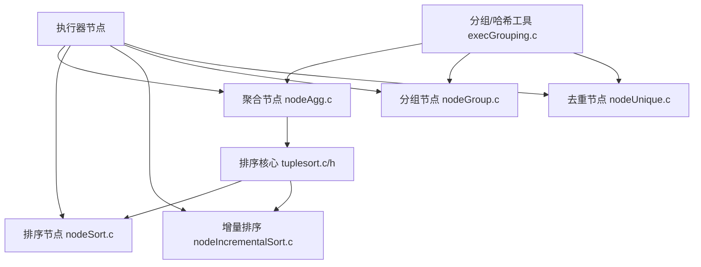
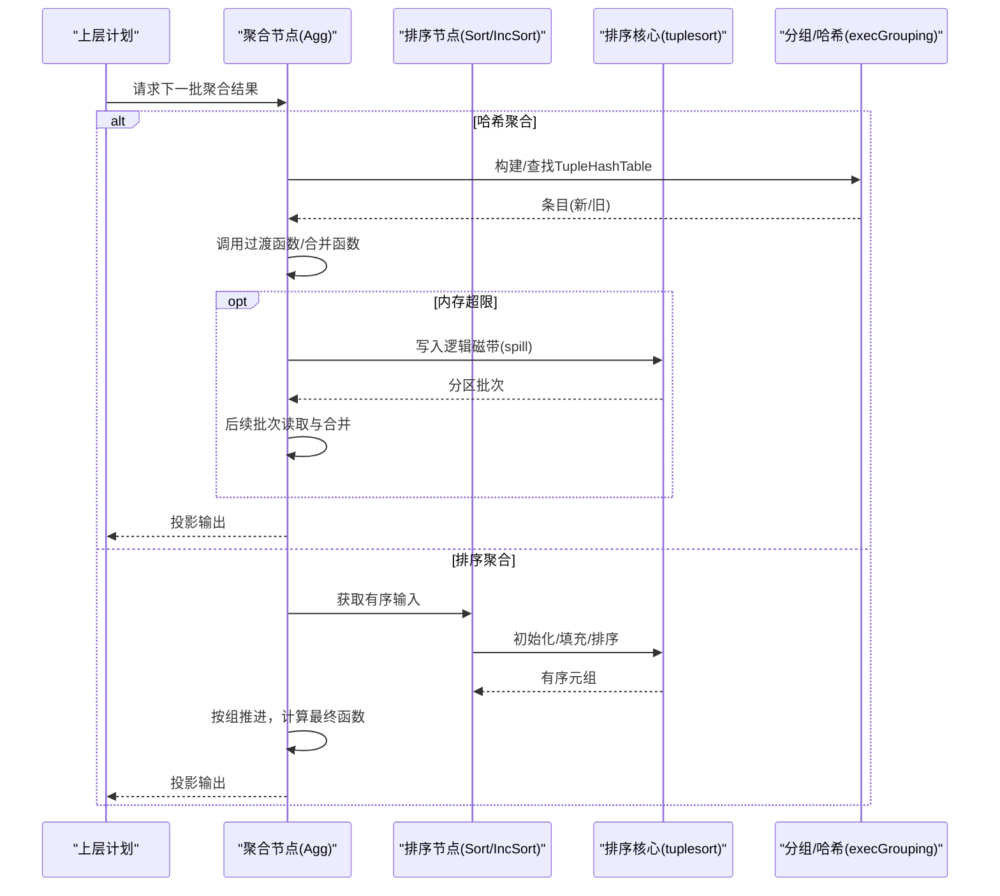
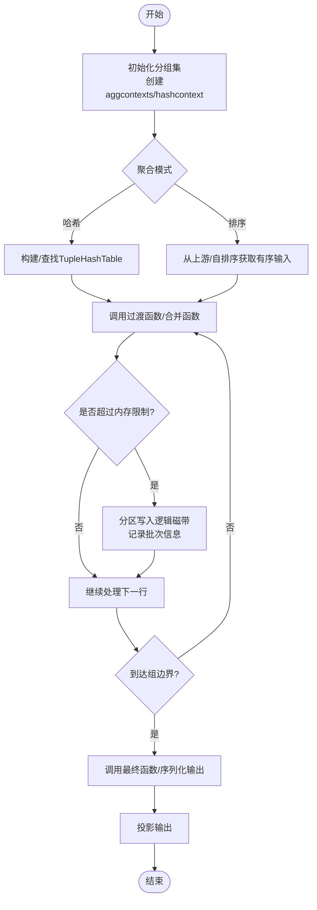
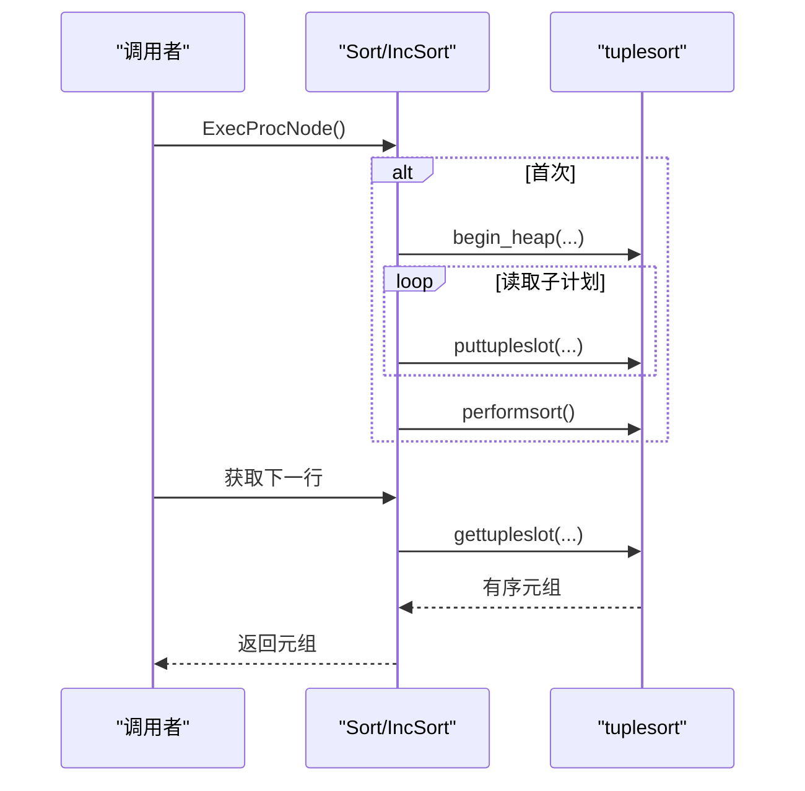
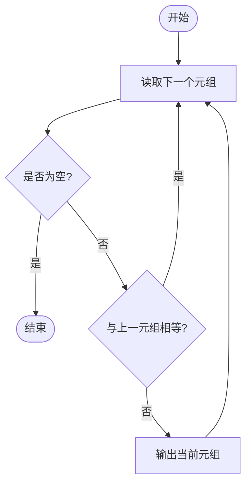
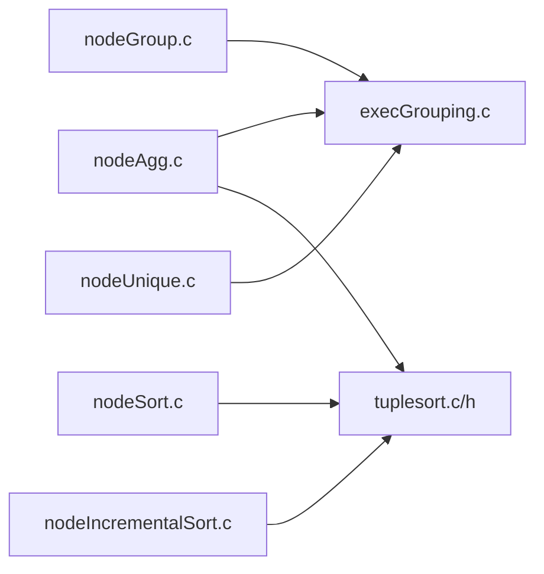

# 聚合与排序

<cite>
**本文引用的文件**
- [nodeAgg.c](file://src/backend/executor/nodeAgg.c)
- [nodeSort.c](file://src/backend/executor/nodeSort.c)
- [nodeIncrementalSort.c](file://src/backend/executor/nodeIncrementalSort.c)
- [nodeGroup.c](file://src/backend/executor/nodeGroup.c)
- [nodeUnique.c](file://src/backend/executor/nodeUnique.c)
- [execGrouping.c](file://src/backend/executor/execGrouping.c)
- [tuplesort.c](file://src/backend/utils/sort/tuplesort.c)
- [tuplesort.h](file://src/include/utils/tuplesort.h)
</cite>

## 目录
1. [简介](#简介)
2. [项目结构](#项目结构)
3. [核心组件](#核心组件)
4. [架构总览](#架构总览)
5. [详细组件分析](#详细组件分析)
6. [依赖关系分析](#依赖关系分析)
7. [性能考虑](#性能考虑)
8. [故障排查指南](#故障排查指南)
9. [结论](#结论)
10. [附录](#附录)

## 简介
本文件聚焦于PostgreSQL执行器中的聚合（Aggregate）与排序（Sort）功能，系统阐述以下主题：
- 聚合操作的执行机制：分组聚合、窗口函数支持、聚合函数的内部实现（过渡函数/合并函数/序列化/反序列化）、部分聚合与多阶段处理。
- 排序算法的工作流程：外部排序、增量排序、内存管理与溢出策略、并行排序支持。
- 分组（Group）与去重（Unique）的处理逻辑。
- 复杂查询中聚合与排序的执行计划分析与优化建议（内存限制、排序算法选择、并行处理）。

## 项目结构
围绕聚合与排序的关键代码分布在执行器与工具库中：
- 执行器节点：聚合（nodeAgg.c）、排序（nodeSort.c）、增量排序（nodeIncrementalSort.c）、分组（nodeGroup.c）、去重（nodeUnique.c）。
- 分组/哈希工具：execGrouping.c 提供元组匹配与哈希表构建、查找等通用能力。
- 排序核心：tuplesort.c/h 提供通用的堆元组/索引元组/Datum排序，支持内存排序、外部排序、并行排序、Top-N堆优化等。

图表来源
- [nodeAgg.c:1-267](file://src/backend/executor/nodeAgg.c#L1-L267)
- [nodeSort.c:1-431](file://src/backend/executor/nodeSort.c#L1-L431)
- [nodeIncrementalSort.c:1-1251](file://src/backend/executor/nodeIncrementalSort.c#L1-L1251)
- [nodeGroup.c:1-256](file://src/backend/executor/nodeGroup.c#L1-L256)
- [nodeUnique.c:1-193](file://src/backend/executor/nodeUnique.c#L1-L193)
- [execGrouping.c:1-555](file://src/backend/executor/execGrouping.c#L1-L555)
- [tuplesort.c:1-200](file://src/backend/utils/sort/tuplesort.c#L1-L200)
- [tuplesort.h:1-200](file://src/include/utils/tuplesort.h#L1-L200)

章节来源
- [nodeAgg.c:1-267](file://src/backend/executor/nodeAgg.c#L1-L267)
- [nodeSort.c:1-431](file://src/backend/executor/nodeSort.c#L1-L431)
- [nodeIncrementalSort.c:1-1251](file://src/backend/executor/nodeIncrementalSort.c#L1-L1251)
- [nodeGroup.c:1-256](file://src/backend/executor/nodeGroup.c#L1-L256)
- [nodeUnique.c:1-193](file://src/backend/executor/nodeUnique.c#L1-L193)
- [execGrouping.c:1-555](file://src/backend/executor/execGrouping.c#L1-L555)
- [tuplesort.c:1-200](file://src/backend/utils/sort/tuplesort.c#L1-L200)
- [tuplesort.h:1-200](file://src/include/utils/tuplesort.h#L1-L200)

## 核心组件
- 聚合节点（Agg）：负责按分组集计算聚合，支持普通模式、哈希模式、排序模式、混合模式；支持部分聚合、DISTINCT/ORDER BY的有序聚合、ROLLUP/CUBE等分组集；具备spill到磁盘的能力。
- 排序节点（Sort）：基于tuplesort进行排序，支持内存排序、外部排序、随机访问、有界排序（Top-N堆优化）。
- 增量排序（IncrementalSort）：当输入已按部分键有序时，将数据切分为组，仅对未排序后缀进行排序，减少I/O并尽早产出结果。
- 分组节点（Group）：假设输入已按分组键有序，通过相邻比较识别组边界，输出每组一行。
- 去重节点（Unique）：在有序流上过滤重复元组，返回唯一行。
- 分组/哈希工具（execGrouping.c）：提供元组相等性表达式构建、哈希表构建与查找、跨类型比较支持。
- 排序核心（tuplesort.c/h）：通用排序引擎，包含内存排序、外部排序、多路归并、并行排序、Top-N堆、统计信息等。

章节来源
- [nodeAgg.c:1-267](file://src/backend/executor/nodeAgg.c#L1-L267)
- [nodeSort.c:1-431](file://src/backend/executor/nodeSort.c#L1-L431)
- [nodeIncrementalSort.c:1-1251](file://src/backend/executor/nodeIncrementalSort.c#L1-L1251)
- [nodeGroup.c:1-256](file://src/backend/executor/nodeGroup.c#L1-L256)
- [nodeUnique.c:1-193](file://src/backend/executor/nodeUnique.c#L1-L193)
- [execGrouping.c:1-555](file://src/backend/executor/execGrouping.c#L1-L555)
- [tuplesort.c:1-200](file://src/backend/utils/sort/tuplesort.c#L1-L200)
- [tuplesort.h:1-200](file://src/include/utils/tuplesort.h#L1-L200)

## 架构总览
聚合与排序在执行计划中的典型交互如下：
- 聚合节点可选择：
  - 哈希聚合：使用TupleHashTable进行分组与状态累积，支持spill。
  - 排序聚合：依赖上游排序或自身维护排序，按组推进。
  - 混合模式：先哈希后排序或多阶段排序。
- 排序节点：
  - 普通排序：一次性收集全部输入，排序后输出。
  - 增量排序：利用前缀有序特性，分块排序，提前产出。
- 分组/去重：
  - Group/Unique要求输入已按分组键有序，通过相邻比较完成。

图表来源
- [nodeAgg.c:1-267](file://src/backend/executor/nodeAgg.c#L1-L267)
- [execGrouping.c:159-240](file://src/backend/executor/execGrouping.c#L159-L240)
- [tuplesort.c:1-200](file://src/backend/utils/sort/tuplesort.c#L1-L200)
- [nodeSort.c:39-157](file://src/backend/executor/nodeSort.c#L39-L157)
- [nodeIncrementalSort.c:495-800](file://src/backend/executor/nodeIncrementalSort.c#L495-L800)

## 详细组件分析

### 聚合（Aggregate）执行机制
- 基本流程：
  - 为每个分组维护过渡值（transValue），逐行调用过渡函数（transfunc），最后调用最终函数（finalfunc）生成结果。
  - 若未提供finalfunc，则直接返回结束时的transValue。
  - 支持部分聚合：可跳过finalfunc、用combinefunc合并中间状态、serialize/deserialize用于跨进程传输。
- 分组集与阶段：
  - ROLLUP/CUBE等分组集可在单次扫描中处理，按“最具体到最粗粒度”顺序重置内层聚合状态。
  - 多阶段：phase 0为哈希阶段，后续phase为排序阶段；AGG_MIXED可同时存在哈希与排序。
- 有序聚合与DISTINCT：
  - 对需要DISTINCT或ORDER BY的聚合，先排序并去重再执行聚合；不支持部分聚合以保证全局有序与去重。
- 内存与上下文：
  - 使用临时econtext计算输入表达式，aggcontexts保存各分组集的transValue；hashcontext管理哈希表。
- 溢出（Spill）：
  - 哈希聚合超限时进入spill模式，仅推进已在哈希表中的组状态，新组元组分区写入逻辑磁带；后续分批读取并递归spill。
- 表达式编译优化：
  - 过渡函数（含combine）通过ExecBuildAggTrans构建单一表达式，避免多次表达式评估开销，便于JIT。

图表来源
- [nodeAgg.c:1-267](file://src/backend/executor/nodeAgg.c#L1-L267)
- [execGrouping.c:159-240](file://src/backend/executor/execGrouping.c#L159-L240)
- [tuplesort.c:1-200](file://src/backend/utils/sort/tuplesort.c#L1-L200)

章节来源
- [nodeAgg.c:1-267](file://src/backend/executor/nodeAgg.c#L1-L267)
- [execGrouping.c:159-240](file://src/backend/executor/execGrouping.c#L159-L240)
- [tuplesort.c:1-200](file://src/backend/utils/sort/tuplesort.c#L1-L200)

### 排序（Sort）工作流程
- 普通排序（Sort）：
  - 首次调用时，从子计划读取所有元组，调用tuplesort_begin_heap初始化排序状态，puttupleslot填充，performsort完成排序，之后gettuple按需返回。
  - 支持randomAccess（反向扫描、标记/恢复）与bounded（Top-N堆优化）。
- 增量排序（IncrementalSort）：
  - 当输入已按部分键有序时，将输入划分为若干组，仅对未排序后缀排序；采用两阶段模式（全量排序+前缀有序模式）切换，尽早产出结果。
  - 使用启发式阈值（最小组大小、最大全量组大小）决定何时切换到前缀有序模式。
- 排序核心（tuplesort）：
  - 小数据：内存qsort；大数据：外部排序，使用逻辑磁带与多路归并；支持并行排序（leader与workers各自partial sort，最终merge）。
  - 支持Top-N堆（bounded sort）以减少不必要的全量排序。

图表来源
- [nodeSort.c:39-157](file://src/backend/executor/nodeSort.c#L39-L157)
- [nodeIncrementalSort.c:495-800](file://src/backend/executor/nodeIncrementalSort.c#L495-L800)
- [tuplesort.c:1-200](file://src/backend/utils/sort/tuplesort.c#L1-L200)
- [tuplesort.h:125-189](file://src/include/utils/tuplesort.h#L125-L189)

章节来源
- [nodeSort.c:39-157](file://src/backend/executor/nodeSort.c#L39-L157)
- [nodeIncrementalSort.c:495-800](file://src/backend/executor/nodeIncrementalSort.c#L495-L800)
- [tuplesort.c:1-200](file://src/backend/utils/sort/tuplesort.c#L1-L200)
- [tuplesort.h:125-189](file://src/include/utils/tuplesort.h#L125-L189)

### 分组（Group）与去重（Unique）
- 分组（Group）：
  - 假设输入已按分组键有序，通过比较相邻元组识别组边界；对每组应用HAVING条件并投影输出。
- 去重（Unique）：
  - 在有序流上比较当前元组与上一个输出元组，跳过重复项；不执行投影与qual检查，效率更高。

图表来源
- [nodeGroup.c:36-152](file://src/backend/executor/nodeGroup.c#L36-L152)
- [nodeUnique.c:46-105](file://src/backend/executor/nodeUnique.c#L46-L105)

章节来源
- [nodeGroup.c:36-152](file://src/backend/executor/nodeGroup.c#L36-L152)
- [nodeUnique.c:46-105](file://src/backend/executor/nodeUnique.c#L46-L105)

### 窗口函数与聚合的关系
- 窗口函数通常由专门的执行节点处理，但在聚合模块中可见对有序集合聚合的特殊处理说明（如ordered-set aggregates的direct参数传递）。
- 对于需要窗口语义的聚合，规划器会选择合适的执行路径（如排序窗口、哈希窗口等），此处以聚合模块注释为依据，不展开窗口节点细节。

章节来源
- [nodeAgg.c:57-64](file://src/backend/executor/nodeAgg.c#L57-L64)

## 依赖关系分析
- 聚合节点依赖：
  - execGrouping.c：元组匹配与哈希表构建/查找。
  - tuplesort：有序聚合与阶段间排序。
  - 逻辑磁带（logtape）：spill到磁盘。
- 排序节点依赖：
  - tuplesort：核心排序算法与并行协调。
- 分组/去重依赖：
  - execGrouping.c：execTuplesMatchPrepare构建相等性表达式。

图表来源
- [nodeAgg.c:1-267](file://src/backend/executor/nodeAgg.c#L1-L267)
- [execGrouping.c:1-555](file://src/backend/executor/execGrouping.c#L1-L555)
- [tuplesort.c:1-200](file://src/backend/utils/sort/tuplesort.c#L1-L200)
- [tuplesort.h:1-200](file://src/include/utils/tuplesort.h#L1-L200)
- [nodeSort.c:1-431](file://src/backend/executor/nodeSort.c#L1-L431)
- [nodeIncrementalSort.c:1-1251](file://src/backend/executor/nodeIncrementalSort.c#L1-L1251)
- [nodeGroup.c:1-256](file://src/backend/executor/nodeGroup.c#L1-L256)
- [nodeUnique.c:1-193](file://src/backend/executor/nodeUnique.c#L1-L193)

章节来源
- [nodeAgg.c:1-267](file://src/backend/executor/nodeAgg.c#L1-L267)
- [execGrouping.c:1-555](file://src/backend/executor/execGrouping.c#L1-L555)
- [tuplesort.c:1-200](file://src/backend/utils/sort/tuplesort.c#L1-L200)
- [tuplesort.h:1-200](file://src/include/utils/tuplesort.h#L1-L200)
- [nodeSort.c:1-431](file://src/backend/executor/nodeSort.c#L1-L431)
- [nodeIncrementalSort.c:1-1251](file://src/backend/executor/nodeIncrementalSort.c#L1-L1251)
- [nodeGroup.c:1-256](file://src/backend/executor/nodeGroup.c#L1-L256)
- [nodeUnique.c:1-193](file://src/backend/executor/nodeUnique.c#L1-L193)

## 性能考虑
- 内存限制配置：
  - work_mem：控制排序与聚合的内存预算；超出后触发外部排序或哈希spill。
  - hash_mem：哈希聚合的内存上限；通过hash_choose_num_buckets估算桶数，限制初始表大小。
  - spill分区因子与数量：HASHAGG_PARTITION_FACTOR、MIN/MAX_PARTITIONS控制spill分区规模，平衡I/O与内存缓冲。
- 排序算法选择：
  - 小数据：内存qsort；大数据：外部排序+多路归并；bounded场景优先Top-N堆。
  - 增量排序：利用前缀有序减少排序范围，降低I/O并提前产出。
- 并行处理支持：
  - tuplesort支持并行排序：leader与workers各自partial sort，最终merge；Sort/IncSort提供共享信息与统计收集。
  - 聚合的部分聚合：combinefunc/serialize/deserialize支持跨进程合并中间状态。
- 表达式优化：
  - 过渡函数通过ExecBuildAggTrans构建单一表达式，减少表达式评估开销，利于JIT。

章节来源
- [nodeAgg.c:269-311](file://src/backend/executor/nodeAgg.c#L269-L311)
- [execGrouping.c:159-240](file://src/backend/executor/execGrouping.c#L159-L240)
- [tuplesort.c:1-200](file://src/backend/utils/sort/tuplesort.c#L1-L200)
- [tuplesort.h:125-189](file://src/include/utils/tuplesort.h#L125-L189)
- [nodeSort.c:350-431](file://src/backend/executor/nodeSort.c#L350-L431)
- [nodeIncrementalSort.c:119-156](file://src/backend/executor/nodeIncrementalSort.c#L119-L156)

## 故障排查指南
- 聚合溢出问题：
  - 现象：大量spill到磁盘，I/O升高。
  - 排查：检查work_mem与hash_mem设置；观察spill分区数量与递归深度；确认过渡状态是否过大（如ARRAY_AGG）。
  - 参考：[nodeAgg.c:197-218](file://src/backend/executor/nodeAgg.c#L197-L218)、[nodeAgg.c:269-311](file://src/backend/executor/nodeAgg.c#L269-L311)
- 排序性能瓶颈：
  - 现象：外部排序频繁，Top-N未生效。
  - 排查：确认bounded设置；检查增量排序是否启用；查看tuplesort统计（空间类型与方法）。
  - 参考：[nodeSort.c:98-140](file://src/backend/executor/nodeSort.c#L98-L140)、[tuplesort.h:60-94](file://src/include/utils/tuplesort.h#L60-L94)
- 分组/去重错误：
  - 现象：结果不正确或性能差。
  - 排查：确保上游已按分组键有序；检查eqfunction构建是否正确。
  - 参考：[nodeGroup.c:11-16](file://src/backend/executor/nodeGroup.c#L11-L16)、[nodeUnique.c:30-32](file://src/backend/executor/nodeUnique.c#L30-L32)、[execGrouping.c:53-83](file://src/backend/executor/execGrouping.c#L53-L83)

章节来源
- [nodeAgg.c:197-218](file://src/backend/executor/nodeAgg.c#L197-L218)
- [nodeAgg.c:269-311](file://src/backend/executor/nodeAgg.c#L269-L311)
- [nodeSort.c:98-140](file://src/backend/executor/nodeSort.c#L98-L140)
- [tuplesort.h:60-94](file://src/include/utils/tuplesort.h#L60-L94)
- [nodeGroup.c:11-16](file://src/backend/executor/nodeGroup.c#L11-L16)
- [nodeUnique.c:30-32](file://src/backend/executor/nodeUnique.c#L30-L32)
- [execGrouping.c:53-83](file://src/backend/executor/execGrouping.c#L53-L83)

## 结论
- 聚合与排序是复杂查询的核心执行路径，PostgreSQL通过灵活的执行模式（哈希/排序/混合）、溢出策略、增量排序与并行支持，兼顾了正确性与性能。
- 合理配置work_mem与hash_mem、选择合适的排序模式（普通/增量/bounded）、利用部分聚合与并行，可显著提升复杂查询性能。
- 分组与去重在有序输入下高效运行，需确保上游排序满足要求。

## 附录
- 关键数据结构与复杂度：
  - TupleHashTable：近似O(1)查找/插入，受哈希冲突与内存限制影响。
  - tuplesort：内存排序O(n log n)，外部排序受I/O与归并路数影响。
- 执行计划分析要点：
  - 观察Agg模式（Hash/Sorted/Mixed）、Sort/IncSort选择、spill与并行统计。
  - 结合EXPLAIN ANALYZE查看实际内存/磁盘使用与排序方法。