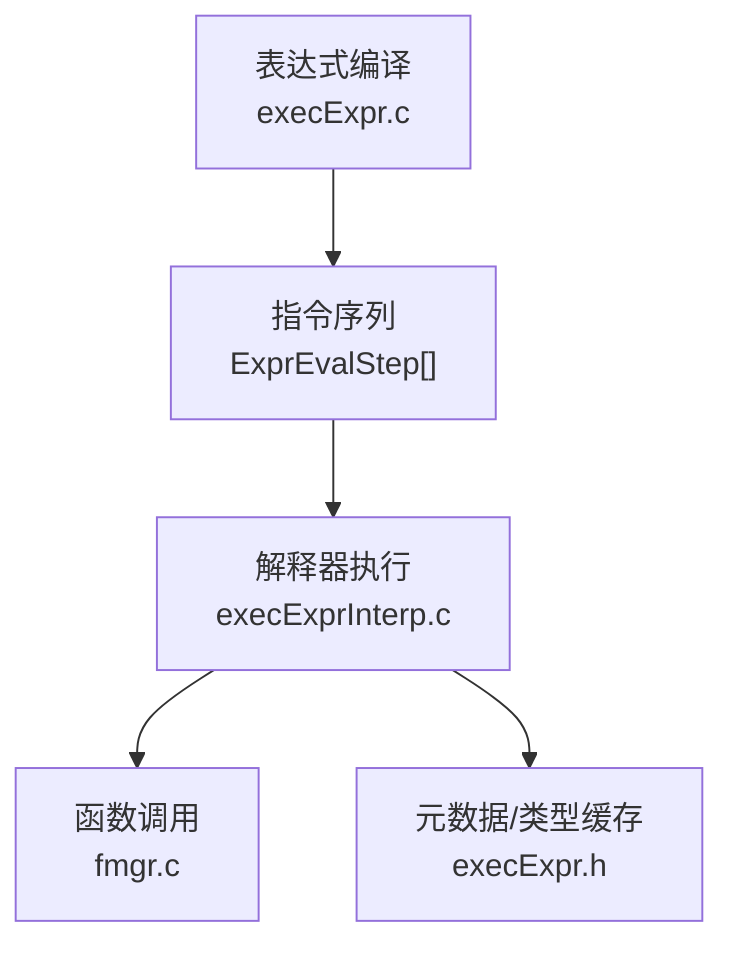
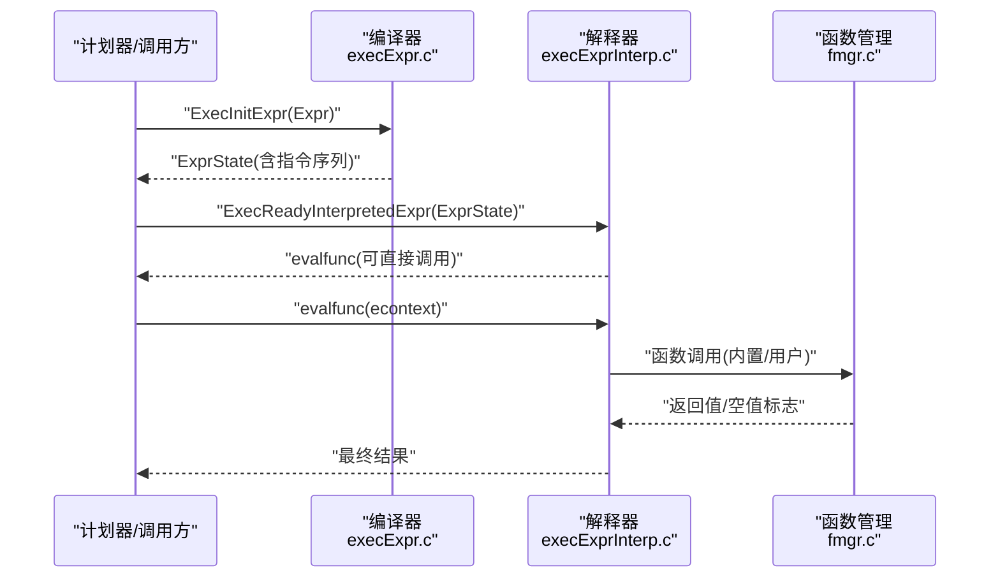
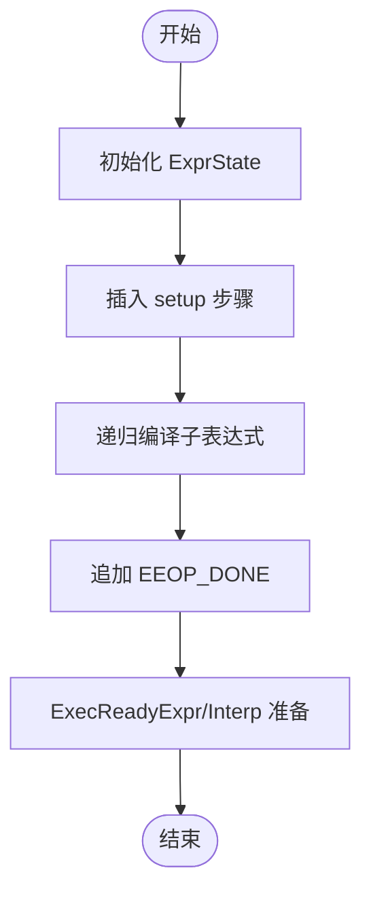
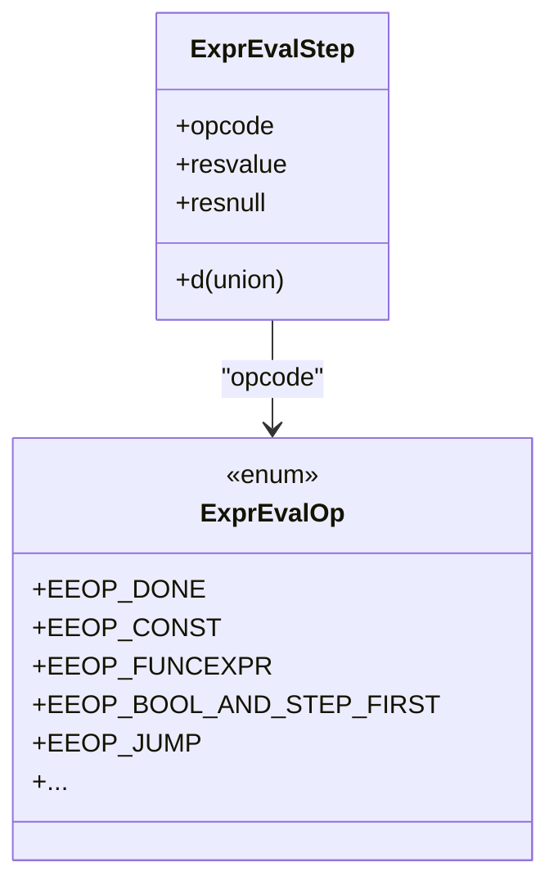
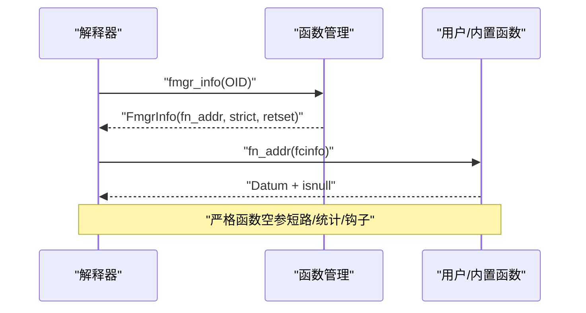
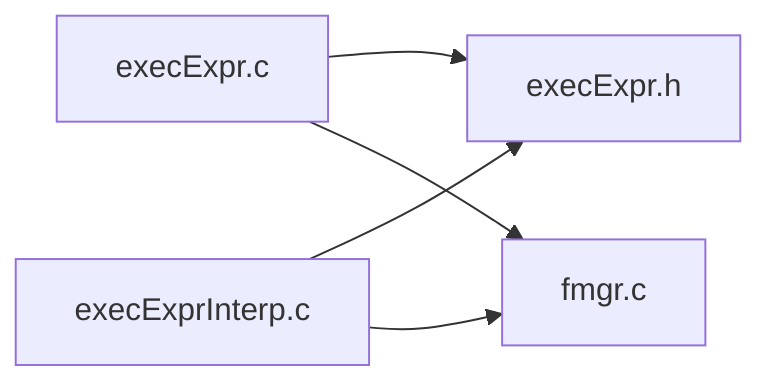

# 表达式求值

<cite>
**本文引用的文件**
- [execExpr.c](file://src/backend/executor/execExpr.c)
- [execExprInterp.c](file://src/backend/executor/execExprInterp.c)
- [execExpr.h](file://src/include/executor/execExpr.h)
- [fmgr.c](file://src/backend/utils/fmgr/fmgr.c)
</cite>

## 目录
1. [简介](#简介)
2. [项目结构](#项目结构)
3. [核心组件](#核心组件)
4. [架构总览](#架构总览)
5. [详细组件分析](#详细组件分析)
6. [依赖关系分析](#依赖关系分析)
7. [性能考量](#性能考量)
8. [故障排查指南](#故障排查指南)
9. [结论](#结论)
10. [附录](#附录)

## 简介
本文件围绕 PostgreSQL 执行器中的表达式求值机制，系统阐述表达式树如何被编译为可执行的步骤序列（指令），以及解释器如何按步执行。重点覆盖：
- 表达式树结构与求值过程
- 常量折叠、子表达式共享与缓存机制
- 解释器模式与“编译”模式的差异及适用场景
- 内置函数与用户定义函数的调用机制（参数传递、返回值、错误处理）
- 性能优化技巧（表达式重写、内联优化、并行求值）
- 复杂表达式的调试与性能分析方法

## 项目结构
表达式求值的核心位于执行器模块，主要包含三部分：
- 表达式编译与准备：将高层 Expr 节点转换为低层 ExprEvalStep 指令序列
- 解释器执行：以指令驱动的方式执行步骤，支持直接线程化或 switch 分发
- 函数管理：统一封装内置与用户函数查找、调用与统计

图表来源
- [execExpr.c:123-151](file://src/backend/executor/execExpr.c#L123-L151)
- [execExprInterp.c:235-383](file://src/backend/executor/execExprInterp.c#L235-L383)
- [execExpr.h:64-257](file://src/include/executor/execExpr.h#L64-L257)
- [fmgr.c:123-200](file://src/backend/utils/fmgr/fmgr.c#L123-L200)

章节来源
- [execExpr.c:123-151](file://src/backend/executor/execExpr.c#L123-L151)
- [execExprInterp.c:235-383](file://src/backend/executor/execExprInterp.c#L235-L383)
- [execExpr.h:64-257](file://src/include/executor/execExpr.h#L64-L257)
- [fmgr.c:123-200](file://src/backend/utils/fmgr/fmgr.c#L123-L200)

## 核心组件
- 表达式编译入口
  - ExecInitExpr：将 Expr 树编译为 ExprState，内含指令数组与结果槽信息
  - ExecInitQual/ExecInitCheck：针对布尔条件与约束的专用编译路径
  - ExecBuildProjectionInfo/ExecBuildUpdateProjection：投影与更新时的列赋值快速路径
- 解释器执行
  - ExecReadyInterpretedExpr：选择 fast-path 或直接线程化，设置 evalfunc
  - ExecInterpExpr：基于 opcode 的分发循环，实现各指令语义
- 函数管理
  - fmgr_info/fmgr_info_cxt：填充 FmgrInfo，区分内置与用户函数，缓存 fn_addr、strict、retset 等

章节来源
- [execExpr.c:123-151](file://src/backend/executor/execExpr.c#L123-L151)
- [execExpr.c:209-284](file://src/backend/executor/execExpr.c#L209-L284)
- [execExpr.c:353-479](file://src/backend/executor/execExpr.c#L353-L479)
- [execExpr.c:513-718](file://src/backend/executor/execExpr.c#L513-L718)
- [execExprInterp.c:235-383](file://src/backend/executor/execExprInterp.c#L235-L383)
- [execExprInterp.c:395-517](file://src/backend/executor/execExprInterp.c#L395-L517)
- [fmgr.c:123-200](file://src/backend/utils/fmgr/fmgr.c#L123-L200)

## 架构总览
表达式从高层 AST 到运行时执行的关键阶段：
- 编译期：将 Expr 树转换为扁平的 ExprEvalStep 指令序列，插入必要的 setup 步骤（如 tuple 解构、参数绑定）
- 运行期：解释器按指令顺序执行，遇到函数调用通过 FmgrInfo 直接调用目标函数；对简单模式使用 fast-path 跳过解释器开销
- 缓存与优化：类型描述符、行类型缓存、严格函数短路、布尔运算短路、变量快速读取等

图表来源
- [execExpr.c:123-151](file://src/backend/executor/execExpr.c#L123-L151)
- [execExprInterp.c:235-383](file://src/backend/executor/execExprInterp.c#L235-L383)
- [fmgr.c:123-200](file://src/backend/utils/fmgr/fmgr.c#L123-L200)

## 详细组件分析

### 表达式编译与指令生成
- 编译入口与流程
  - ExecInitExpr：创建 ExprState，插入 setup 步骤，递归编译子表达式，追加 EEOP_DONE，最后调用 ExecReadyExpr
  - ExecInitQual：为布尔合取生成 EEOP_QUAL 短路分支，空列表短路返回 NULL 表示恒真
  - ExecBuildProjectionInfo：对安全 Var 走 ASSIGN_*_VAR 快速路径，否则常规编译并写入结果槽
  - ExecBuildUpdateProjection：构造 UPDATE 新元组，校验列类型与顺序，必要时生成 DEFORM/FETCHSOME 步骤
- 关键数据结构
  - ExprEvalOp：指令枚举，涵盖变量读取、函数调用、布尔运算、数组/行操作、聚合、子计划等
  - ExprEvalStep：单条指令，包含 opcode、结果指针、内联数据（union），保证单缓存行友好

图表来源
- [execExpr.c:123-151](file://src/backend/executor/execExpr.c#L123-L151)
- [execExpr.c:209-284](file://src/backend/executor/execExpr.c#L209-L284)
- [execExpr.c:353-479](file://src/backend/executor/execExpr.c#L353-L479)
- [execExpr.c:513-718](file://src/backend/executor/execExpr.c#L513-L718)
- [execExpr.h:64-257](file://src/include/executor/execExpr.h#L64-L257)

章节来源
- [execExpr.c:123-151](file://src/backend/executor/execExpr.c#L123-L151)
- [execExpr.c:209-284](file://src/backend/executor/execExpr.c#L209-L284)
- [execExpr.c:353-479](file://src/backend/executor/execExpr.c#L353-L479)
- [execExpr.c:513-718](file://src/backend/executor/execExpr.c#L513-L718)
- [execExpr.h:64-257](file://src/include/executor/execExpr.h#L64-L257)

### 解释器执行与快路径
- 解释器启动
  - ExecReadyInterpretedExpr：检测简单指令模式，替换为 ExecJust* 快路径；否则启用直接线程化或 switch 分发
- 指令分发
  - ExecInterpExpr：维护 dispatch_table，按 opcode 跳转到对应 CASE 块；支持 EEO_NEXT/EEO_JUMP 控制流
- 典型指令
  - 变量读取：EEOP_INNER/OUTER/SCAN_VAR，配合 FETCHSOME 预取属性
  - 函数调用：EEOP_FUNCEXPR[_STRICT][_FUSAGE]，严格函数在参数为空时短路
  - 布尔运算：EEOP_BOOL_AND/OR_STEP_FIRST/STEP/ LAST，支持短路
  - 跳转与测试：JUMP/JUMP_IF_NULL/NOT_NULL/NOT_TRUE，NULLTEST/BOOLTEST

图表来源
- [execExprInterp.c:235-383](file://src/backend/executor/execExprInterp.c#L235-L383)
- [execExprInterp.c:395-517](file://src/backend/executor/execExprInterp.c#L395-L517)
- [execExpr.h:64-257](file://src/include/executor/execExpr.h#L64-L257)

章节来源
- [execExprInterp.c:235-383](file://src/backend/executor/execExprInterp.c#L235-L383)
- [execExprInterp.c:395-517](file://src/backend/executor/execExprInterp.c#L395-L517)
- [execExpr.h:64-257](file://src/include/executor/execExpr.h#L64-L257)

### 函数调用机制（内置与用户定义）
- 函数信息填充
  - fmgr_info/fmgr_info_cxt：根据 OID 填充 FmgrInfo，内置函数走快速路径（无需查表），用户函数通过系统缓存获取签名与地址
- 调用约定
  - 通过 FunctionCallInfoBaseData 传递参数与返回值，严格函数在编译期/运行期进行空参短路
  - 统计与钩子：fn_stats、needs_fmgr_hook/fmgr_hook 用于统计与安全包装
- 错误处理
  - 函数内部抛出异常由上层捕获；严格函数空参短路避免无效调用

图表来源
- [fmgr.c:123-200](file://src/backend/utils/fmgr/fmgr.c#L123-L200)
- [execExprInterp.c:722-774](file://src/backend/executor/execExprInterp.c#L722-L774)

章节来源
- [fmgr.c:123-200](file://src/backend/utils/fmgr/fmgr.c#L123-L200)
- [execExprInterp.c:722-774](file://src/backend/executor/execExprInterp.c#L722-L774)

### 常量折叠、子表达式共享与缓存
- 常量折叠
  - 编译期可将 Const 节点下推/提升，减少运行时计算；解释器中 EEOP_CONST 直接产出常量
- 子表达式共享
  - 通过 ExprState 与步骤复用，避免重复计算；投影/更新路径中对安全 Var 采用快速赋值
- 缓存机制
  - 行类型描述符缓存（ExprEvalRowtypeCache）、函数信息缓存（FmgrInfo）、严格函数短路、布尔短路、FETCHSOME 预取属性

章节来源
- [execExprInterp.c:235-383](file://src/backend/executor/execExprInterp.c#L235-L383)
- [execExprInterp.c:526-594](file://src/backend/executor/execExprInterp.c#L526-L594)
- [execExpr.h:41-53](file://src/include/executor/execExpr.h#L41-L53)
- [fmgr.c:123-200](file://src/backend/utils/fmgr/fmgr.c#L123-L200)

### 解释器模式 vs “编译”模式
- 解释器模式
  - 优点：通用性强，易于扩展新指令；支持直接线程化以获得接近原生代码的性能
  - 适用：通用表达式、动态 SQL、频繁变化的表达式
- “编译”模式（指令序列即“编译产物”）
  - 优点：将高层 AST 转为扁平指令，消除大量分支与间接调用；fast-path 进一步降低开销
  - 适用：热点路径（投影、过滤、更新）与常见模式（Var 读取、Const、严格函数）

章节来源
- [execExprInterp.c:1-46](file://src/backend/executor/execExprInterp.c#L1-L46)
- [execExprInterp.c:235-383](file://src/backend/executor/execExprInterp.c#L235-L383)
- [execExpr.c:353-479](file://src/backend/executor/execExpr.c#L353-L479)

## 依赖关系分析
- 模块耦合
  - execExpr.c 依赖 nodes、optimizer、utils/builtins、utils/datum 等，负责将高层表达式转化为指令
  - execExprInterp.c 依赖 execExpr.h 定义的指令集，实现解释器与 fast-path
  - fmgr.c 提供统一的函数查找与调用接口，被解释器在函数调用点使用
- 外部依赖
  - 系统缓存（pg_proc、类型信息等）用于函数与类型解析
  - 内存上下文管理确保 ExprState 生命周期

图表来源
- [execExpr.c:123-151](file://src/backend/executor/execExpr.c#L123-L151)
- [execExprInterp.c:235-383](file://src/backend/executor/execExprInterp.c#L235-L383)
- [fmgr.c:123-200](file://src/backend/utils/fmgr/fmgr.c#L123-L200)

章节来源
- [execExpr.c:123-151](file://src/backend/executor/execExpr.c#L123-L151)
- [execExprInterp.c:235-383](file://src/backend/executor/execExprInterp.c#L235-L383)
- [fmgr.c:123-200](file://src/backend/utils/fmgr/fmgr.c#L123-L200)

## 性能考量
- 表达式重写与常量折叠
  - 在编译期尽可能下推常量、合并相同子表达式，减少运行时步骤数
- 内联优化与快路径
  - 利用 ExecJust* 快路径处理简单模式（单 Var 读取、Const、Case+Strict 函数）
  - 直接线程化减少分发开销；严格函数空参短路避免无意义调用
- 并行求值
  - 对于独立子表达式，可在外层并行计划中拆分求值；注意共享状态与锁粒度
- 缓存与预取
  - 使用 FETCHSOME 预取所需属性，减少多次解构；行类型描述符缓存避免重复查找
- 监控与调优
  - 借助 EXPLAIN/ANALYZE 观察步骤数量与耗时；关注函数调用热点与严格性

[本节为通用指导，不直接引用具体文件]

## 故障排查指南
- 常见问题定位
  - 表达式未生效：检查 ExecInitExpr/ExecInitQual 是否被正确调用，指令序列是否完整（末尾 EEOP_DONE）
  - 函数调用失败：确认 FmgrInfo 已正确填充，OID 有效；严格函数空参短路导致未调用
  - 类型不匹配：投影/更新路径会进行类型校验，报错信息通常指出列位置与期望类型
- 调试建议
  - 使用 EXPLAIN 查看计划与表达式节点；结合 PG_TRACE/探针观察执行路径
  - 对热点表达式启用直接线程化与 fast-path，对比性能差异
- 错误处理
  - 严格函数空参短路：避免无效调用，但需确保业务逻辑符合预期
  - 异常传播：函数内部抛错由上层捕获，检查错误码与上下文

章节来源
- [execExpr.c:209-284](file://src/backend/executor/execExpr.c#L209-L284)
- [execExpr.c:513-718](file://src/backend/executor/execExpr.c#L513-L718)
- [execExprInterp.c:722-774](file://src/backend/executor/execExprInterp.c#L722-L774)
- [fmgr.c:123-200](file://src/backend/utils/fmgr/fmgr.c#L123-L200)

## 结论
PostgreSQL 的表达式求值通过“编译为指令 + 解释器执行”的架构，兼顾了灵活性与高性能。编译期进行常量折叠、子表达式共享与快路径选择；运行期通过直接线程化与严格函数短路显著降低开销。函数管理统一抽象内置与用户函数，便于扩展与维护。针对复杂表达式，应结合 EXPLAIN/ANALYZE 与探针进行调试与优化，充分利用缓存与预取机制，并在合适场景引入并行求值以提升吞吐。

[本节为总结性内容，不直接引用具体文件]

## 附录
- 关键术语
  - ExprState：表达式执行状态，包含指令序列与结果槽
  - ExprEvalStep：单条指令，包含 opcode 与内联数据
  - FmgrInfo：函数调用信息，包含函数地址、严格性、返回值集合等
- 参考路径
  - 表达式编译：[execExpr.c:123-151](file://src/backend/executor/execExpr.c#L123-L151)
  - 解释器执行：[execExprInterp.c:235-383](file://src/backend/executor/execExprInterp.c#L235-L383)
  - 指令定义：[execExpr.h:64-257](file://src/include/executor/execExpr.h#L64-L257)
  - 函数管理：[fmgr.c:123-200](file://src/backend/utils/fmgr/fmgr.c#L123-L200)

[本节为附录信息，不直接引用具体文件]