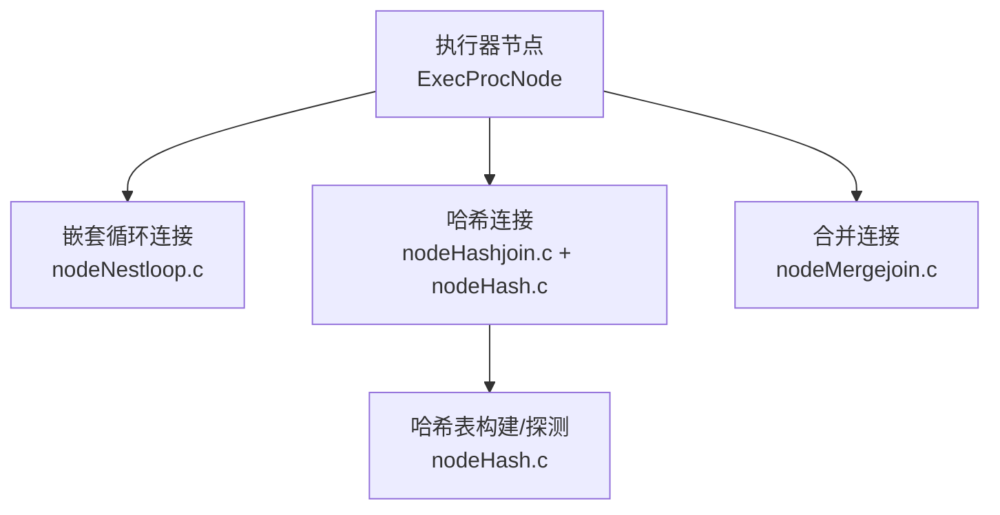
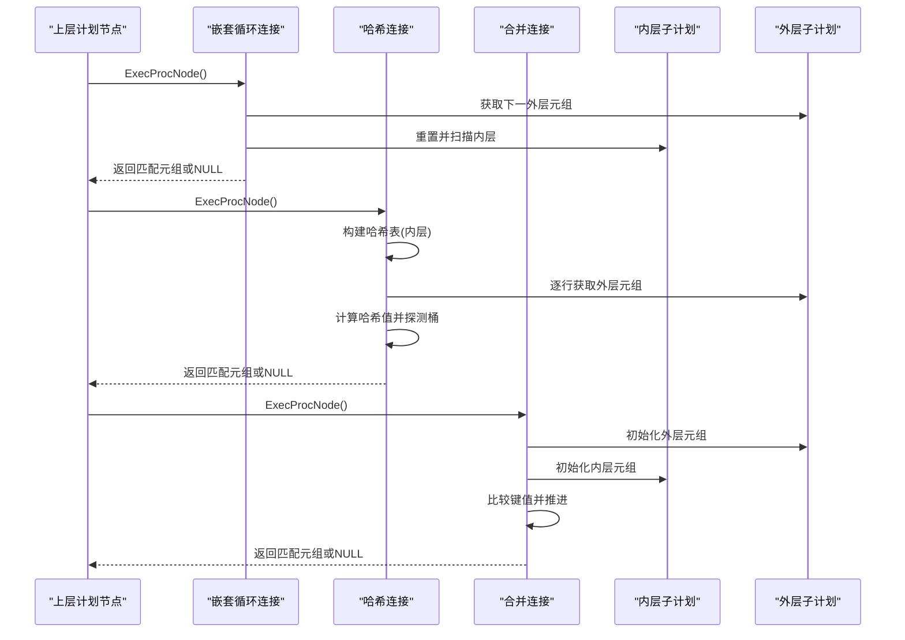
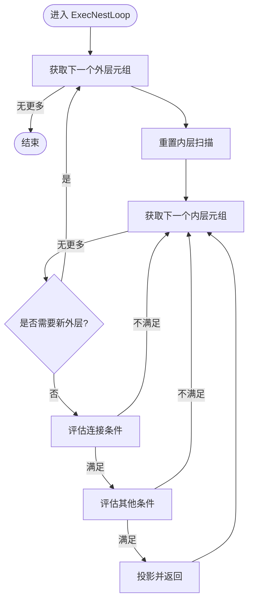
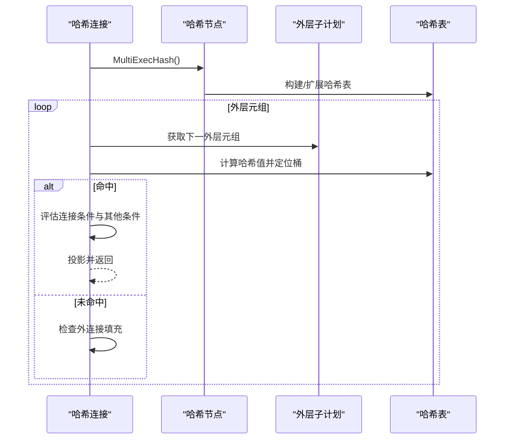
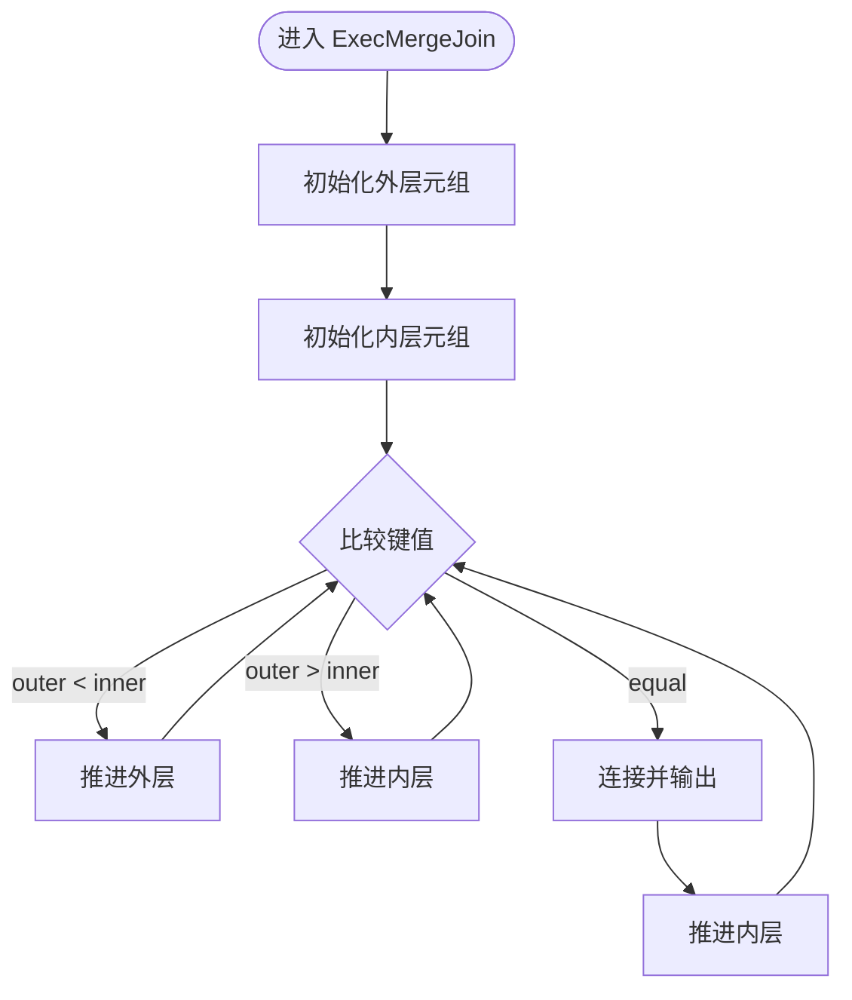
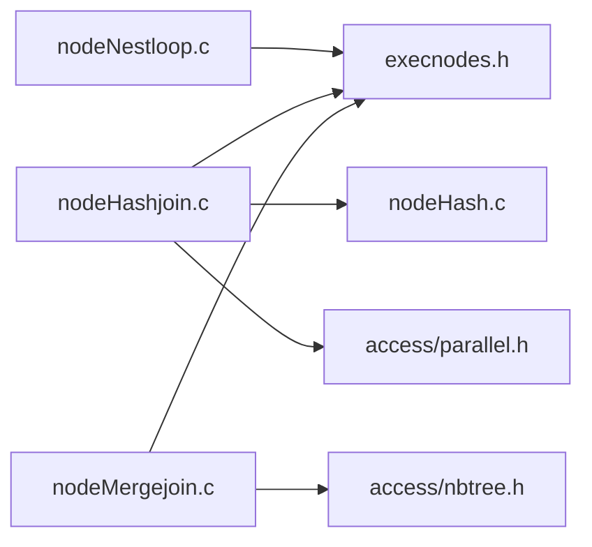

# 连接算法

<cite>
**本文引用的文件**
- [nodeNestloop.c](file://src/backend/executor/nodeNestloop.c)
- [nodeHashjoin.c](file://src/backend/executor/nodeHashjoin.c)
- [nodeMergejoin.c](file://src/backend/executor/nodeMergejoin.c)
- [nodeHash.c](file://src/backend/executor/nodeHash.c)
- [nodeNestloop.h](file://src/include/executor/nodeNestloop.h)
- [nodeHashjoin.h](file://src/include/executor/nodeHashjoin.h)
- [nodeMergejoin.h](file://src/include/executor/nodeMergejoin.h)
</cite>

## 目录
1. [简介](#简介)
2. [项目结构](#项目结构)
3. [核心组件](#核心组件)
4. [架构总览](#架构总览)
5. [详细组件分析](#详细组件分析)
6. [依赖关系分析](#依赖关系分析)
7. [性能考量](#性能考量)
8. [故障排查指南](#故障排查指南)
9. [结论](#结论)
10. [附录](#附录)

## 简介
本文件围绕 PostgreSQL 执行器中的三种经典连接算法——嵌套循环连接（Nested Loop Join）、哈希连接（Hash Join）与合并连接（Merge Join）——进行系统化、代码级文档化。内容涵盖：
- 每种算法的实现原理与执行流程
- 适用场景、时间/空间复杂度与内存使用模式
- 连接条件处理、连接键选择策略与结果生成机制
- 并行执行的实现细节与同步机制
- 统计信息的使用与参数调优建议（基于源码可见的约束与行为）

## 项目结构
连接算法位于后端执行器模块，分别由以下源文件实现：
- 嵌套循环连接：src/backend/executor/nodeNestloop.c
- 哈希连接：src/backend/executor/nodeHashjoin.c（配合 src/backend/executor/nodeHash.c 构建哈希表）
- 合并连接：src/backend/executor/nodeMergejoin.c

头文件提供对外接口声明：
- src/include/executor/nodeNestloop.h
- src/include/executor/nodeHashjoin.h
- src/include/executor/nodeMergejoin.h

**图表来源**
- [nodeNestloop.c:60-256](file://src/backend/executor/nodeNestloop.c#L60-L256)
- [nodeHashjoin.c:170-606](file://src/backend/executor/nodeHashjoin.c#L170-L606)
- [nodeHash.c:105-200](file://src/backend/executor/nodeHash.c#L105-L200)
- [nodeMergejoin.c:599-800](file://src/backend/executor/nodeMergejoin.c#L599-L800)

**章节来源**
- [nodeNestloop.c:60-256](file://src/backend/executor/nodeNestloop.c#L60-L256)
- [nodeHashjoin.c:170-606](file://src/backend/executor/nodeHashjoin.c#L170-L606)
- [nodeHash.c:105-200](file://src/backend/executor/nodeHash.c#L105-L200)
- [nodeMergejoin.c:599-800](file://src/backend/executor/nodeMergejoin.c#L599-L800)

## 核心组件
- 嵌套循环连接（NLJ）：以“外层每行驱动内层扫描”的方式工作，支持左外/反连接等变体，适合小表或索引驱动场景。
- 哈希连接（HJ）：将一侧（通常较小）构造成哈希表，另一侧逐行探测；支持多批次与并行，具备较好的通用性与稳定性。
- 合并连接（MJ）：要求两侧输入已按连接键排序，通过双指针推进匹配；对有序输入友好，常用于排序后聚合/去重等场景。

**章节来源**
- [nodeNestloop.c:60-256](file://src/backend/executor/nodeNestloop.c#L60-L256)
- [nodeHashjoin.c:170-606](file://src/backend/executor/nodeHashjoin.c#L170-L606)
- [nodeMergejoin.c:599-800](file://src/backend/executor/nodeMergejoin.c#L599-L800)

## 架构总览
三种连接均以状态机形式组织执行流程，统一通过 ExecProcNode 调用，并在内部维护当前元组、表达式上下文、投影信息等。

**图表来源**
- [nodeNestloop.c:60-256](file://src/backend/executor/nodeNestloop.c#L60-L256)
- [nodeHashjoin.c:170-606](file://src/backend/executor/nodeHashjoin.c#L170-L606)
- [nodeMergejoin.c:599-800](file://src/backend/executor/nodeMergejoin.c#L599-L800)

## 详细组件分析

### 嵌套循环连接（Nested Loop Join）
- 执行要点
  - 外层每产生一行，重置并扫描内层，逐对评估连接条件与附加条件，满足则投影输出。
  - 支持 LEFT/ANTI 等外连接语义：当内层无匹配时，可填充空元组并按非连接条件过滤后输出。
  - 支持 single_match 优化（如 SEMI 或 inner_unique），找到首个匹配即推进外层。
- 连接条件与键
  - joinqual 用于判定是否匹配；otherqual 为额外过滤条件，仅在匹配后评估。
  - 若存在 nestParams（外层变量作为内层参数），每次外层变化会更新参数并触发内层重新扫描。
- 内存与复杂度
  - 内存占用低，主要开销在 I/O 与表达式求值；时间复杂度近似 O(N_outer × N_inner)。
- 并行性
  - 该实现为串行版本；并行化通常由上层计划节点（如 Gather）完成。

**图表来源**
- [nodeNestloop.c:60-256](file://src/backend/executor/nodeNestloop.c#L60-L256)

**章节来源**
- [nodeNestloop.c:60-256](file://src/backend/executor/nodeNestloop.c#L60-L256)
- [nodeNestloop.c:262-353](file://src/backend/executor/nodeNestloop.c#L262-L353)
- [nodeNestloop.h:19-21](file://src/include/executor/nodeNestloop.h#L19-L21)

### 哈希连接（Hash Join）
- 执行要点
  - 先构建内层的哈希表（可能分批次），再逐行读取外层元组，计算哈希值并探测对应桶。
  - 支持多批次（nbatch）与倾斜桶（skew bucket）优化；当内存不足时落盘到临时文件。
  - 支持 RIGHT/FULL 外连接：在批次结束时扫描未匹配的元组进行填充。
- 并行实现
  - 提供并行感知版本 ExecParallelHashJoin，使用屏障（Barrier）协调多个参与者：
    - 构建阶段：PHJ_BUILD_* 各阶段（选举、分配、哈希、运行、完成）
    - 批次阶段：PHJ_BATCH_*（选举、分配、加载、探测、完成）
  - 共享哈希表与批处理文件，避免重复构建；最后阶段安全清理资源。
- 连接条件与键
  - hashclauses 指定哈希键与相等操作符族；joinqual 用于进一步过滤；otherqual 最终过滤。
  - 支持 outer unique/semi 等单匹配优化。
- 内存与复杂度
  - 构建阶段 O(N_inner)，探测阶段 O(N_outer × 平均桶大小)；空间受 hash_mem 限制，超限时分批。
  - 倾斜优化针对热点键减少冲突。

**图表来源**
- [nodeHashjoin.c:170-606](file://src/backend/executor/nodeHashjoin.c#L170-L606)
- [nodeHash.c:105-200](file://src/backend/executor/nodeHash.c#L105-L200)

**章节来源**
- [nodeHashjoin.c:170-606](file://src/backend/executor/nodeHashjoin.c#L170-L606)
- [nodeHash.c:105-200](file://src/backend/executor/nodeHash.c#L105-L200)
- [nodeHashjoin.h:21-32](file://src/include/executor/nodeHashjoin.h#L21-L32)

### 合并连接（Merge Join）
- 执行要点
  - 要求两侧输入按连接键有序；通过比较左右键值决定推进哪一侧，直到相等后进行连接。
  - 支持标记/恢复（mark/restore）以处理一对多的匹配情况。
  - 支持 LEFT/RIGHT/FULL 外连接：当一侧耗尽时，填充缺失侧的空元组。
- 连接条件与键
  - 由规划器传入 mergeclauses、opfamily、collation、strategy、nulls_first 等信息，运行时使用排序支持函数进行比较。
  - 连接键表达式在外部/内部上下文中分别求值，支持 NULL 特殊处理。
- 内存与复杂度
  - 内存占用低（主要为缓冲与标记槽），时间复杂度 O(N_outer + N_inner)；对有序输入非常高效。
- 并行性
  - 该实现为串行版本；并行化通常由上层计划节点（如 Gather Merge）完成。

**图表来源**
- [nodeMergejoin.c:599-800](file://src/backend/executor/nodeMergejoin.c#L599-L800)

**章节来源**
- [nodeMergejoin.c:599-800](file://src/backend/executor/nodeMergejoin.c#L599-L800)
- [nodeMergejoin.h:19-21](file://src/include/executor/nodeMergejoin.h#L19-L21)

## 依赖关系分析
- 执行器节点依赖
  - 三种连接均依赖 execnodes 定义的状态结构与 ExecProcNode 协议。
  - 哈希连接依赖 nodeHash 提供的哈希表构建与探测能力。
- 外部依赖
  - 哈希连接依赖共享内存与屏障（parallel.h）以实现并行。
  - 合并连接依赖排序支持（btree opfamily）进行键比较。
- 耦合与内聚
  - 连接节点与子计划松耦合，通过标准接口交互；内部状态集中管理，内聚度高。
- 循环依赖
  - 未见直接循环依赖；哈希连接与哈希节点通过显式 API 协作。

**图表来源**
- [nodeNestloop.c:22-27](file://src/backend/executor/nodeNestloop.c#L22-L27)
- [nodeHashjoin.c:113-124](file://src/backend/executor/nodeHashjoin.c#L113-L124)
- [nodeMergejoin.c:93-100](file://src/backend/executor/nodeMergejoin.c#L93-L100)

**章节来源**
- [nodeNestloop.c:22-27](file://src/backend/executor/nodeNestloop.c#L22-L27)
- [nodeHashjoin.c:113-124](file://src/backend/executor/nodeHashjoin.c#L113-L124)
- [nodeMergejoin.c:93-100](file://src/backend/executor/nodeMergejoin.c#L93-L100)

## 性能考量
- 嵌套循环连接
  - 适合小表或带索引的内层扫描；避免全表扫描时的巨大代价。
  - 优化点：启用 inner_unique/SEMI 以早停；利用索引参数传递减少扫描范围。
- 哈希连接
  - 通用性强，内存充足时表现优异；hash_mem 控制内存上限，超限自动分批。
  - 倾斜优化（skew buckets）缓解热点键导致的负载不均。
  - 并行哈希连接在多核下显著提升吞吐，但需权衡屏障同步成本。
- 合并连接
  - 对有序输入极高效；若上游已有排序（如 GROUP BY/ORDER BY），优先选择。
  - 注意 NULL 排序策略（nulls first/last）对比较逻辑的影响。
- 统计信息与参数
  - 规划阶段依据统计信息估算基数与成本，影响连接类型选择；执行期根据实际数据动态调整（如哈希表扩容）。
  - 可通过相关 GUC 调整内存与并行度（例如 hash_mem、max_parallel_workers），但具体参数名不在本仓库中直接体现，应参考系统配置。

[本节为通用指导，无需特定文件引用]

## 故障排查指南
- 常见错误与异常
  - 非法连接类型：在初始化阶段检测到不支持的连接类型会抛出错误。
  - 哈希连接状态机异常：遇到未识别状态会报错，通常意味着内部状态不一致。
- 调试技巧
  - 启用调试宏（如 EXEC_MERGEJOINDEBUG）可打印关键状态与元组信息，辅助定位问题。
  - 观察 INSTR_COUNT 计数，区分连接条件与非连接条件的过滤效果。
- 内存与溢出
  - 哈希连接在内存不足时落盘，关注磁盘 I/O 与批次切换频率；必要时增大 hash_mem。
  - 合并连接需确保输入有序，否则比较逻辑可能导致死循环或错误结果。

**章节来源**
- [nodeNestloop.c:326-341](file://src/backend/executor/nodeNestloop.c#L326-L341)
- [nodeHashjoin.c:601-604](file://src/backend/executor/nodeHashjoin.c#L601-L604)
- [nodeMergejoin.c:519-534](file://src/backend/executor/nodeMergejoin.c#L519-L534)

## 结论
- 嵌套循环连接简单可靠，适合小数据集或索引驱动场景。
- 哈希连接通用且稳定，具备并行与倾斜优化，适合大多数中等规模连接。
- 合并连接对有序输入高效，常与排序/分组结合使用。
- 选择依据：数据规模、是否有序、是否有索引、内存与并行资源、统计信息估计的成本。
- 优化方向：合理设置内存与并行参数、利用索引与参数传递、关注倾斜与批次行为。

[本节为总结性内容，无需特定文件引用]

## 附录
- 并行哈希连接阶段说明（来自源码注释）
  - 构建阶段：PHJ_BUILD_ELECTING → PHJ_BUILD_ALLOCATING → PHJ_BUILD_HASHING_INNER → PHJ_BUILD_HASHING_OUTER（仅多批次）→ PHJ_BUILD_RUNNING → PHJ_BUILD_DONE
  - 批次阶段：PHJ_BATCH_ELECTING → PHJ_BATCH_ALLOCATING → PHJ_BATCH_LOADING → PHJ_BATCH_PROBING → PHJ_BATCH_DONE
  - 这些阶段通过 Barrier 协调，保证一致性并避免死锁。

**章节来源**
- [nodeHashjoin.c:13-109](file://src/backend/executor/nodeHashjoin.c#L13-L109)