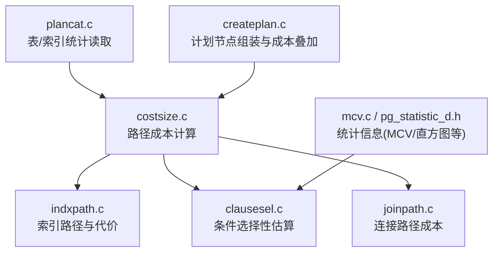
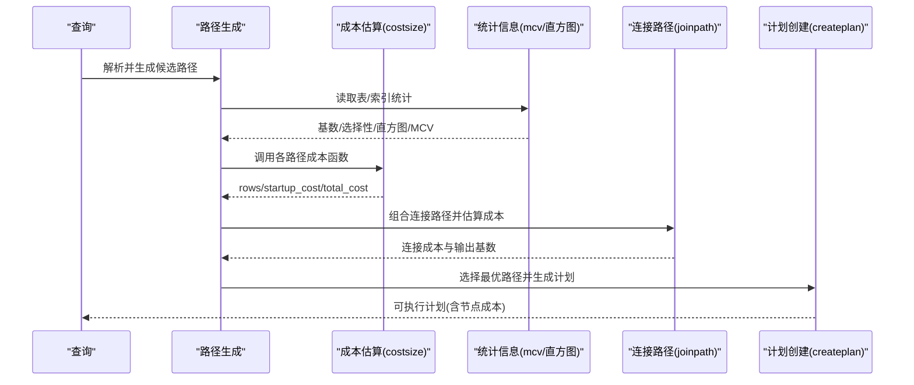
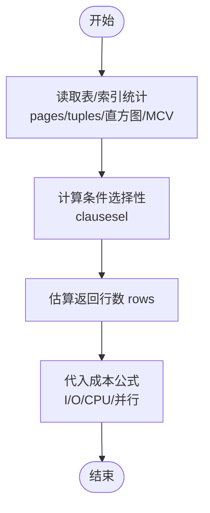
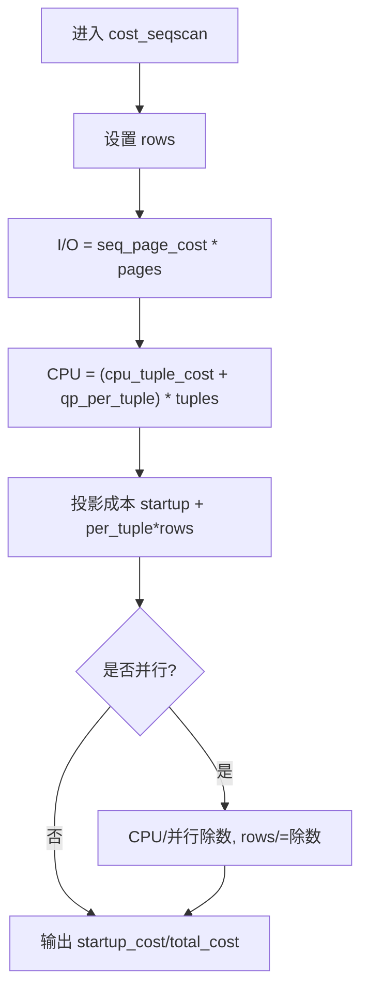
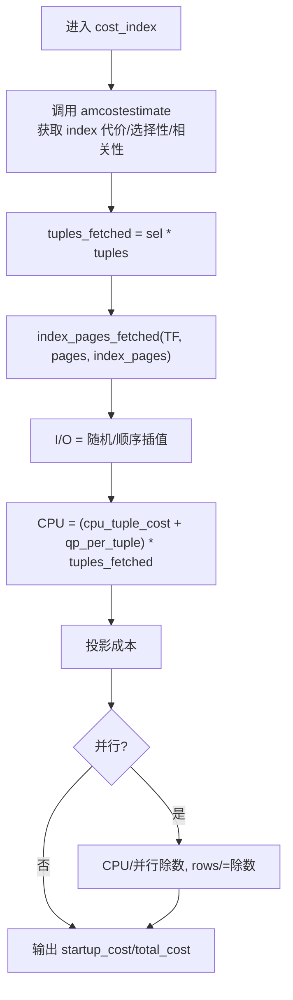
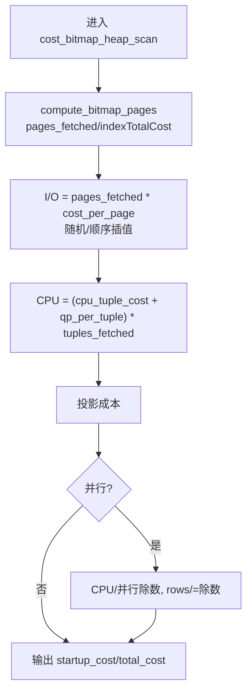
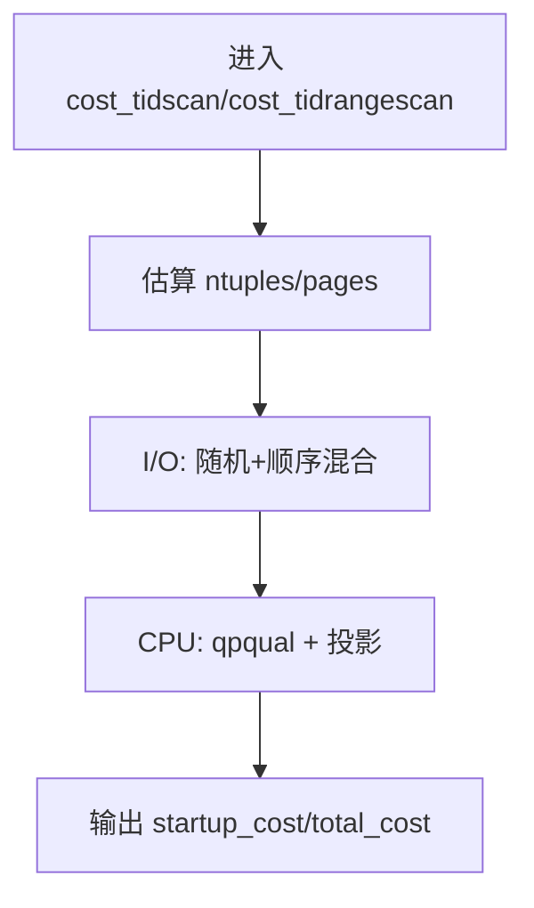
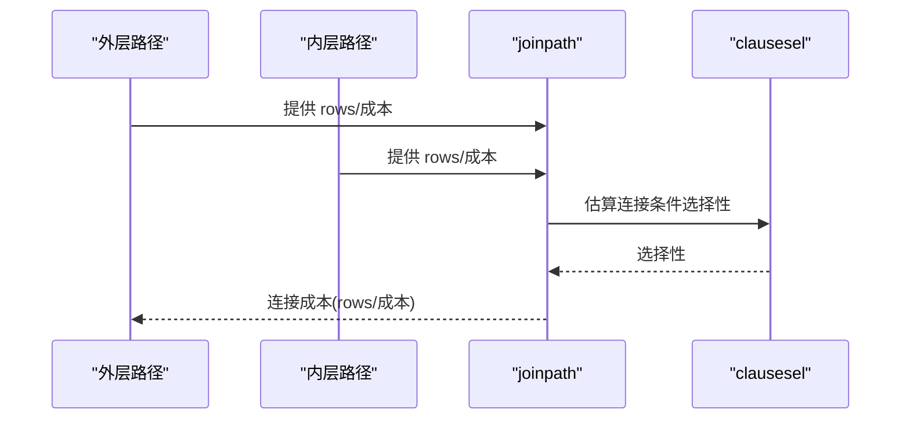
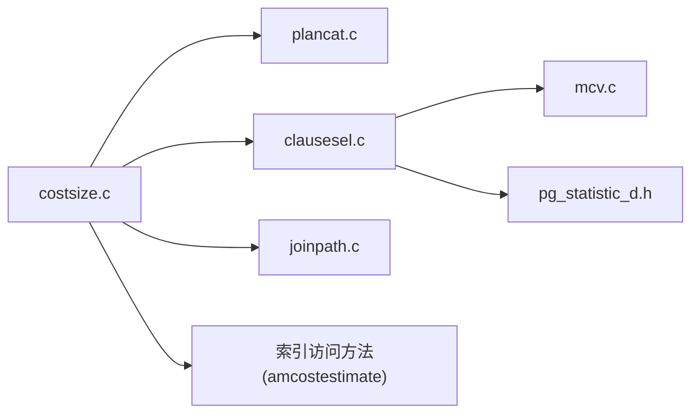

# 成本估算模型

<cite>
**本文引用的文件**
- [costsize.c](file://src/backend/optimizer/path/costsize.c)
- [mcv.c](file://src/backend/statistics/mcv.c)
- [plancat.c](file://src/backend/optimizer/util/plancat.c)
- [clausesel.c](file://src/backend/optimizer/path/clausesel.c)
- [joinpath.c](file://src/backend/optimizer/path/joinpath.c)
- [indxpath.c](file://src/backend/optimizer/path/indxpath.c)
- [createplan.c](file://src/backend/optimizer/plan/createplan.c)
- [pgstatistic.h](file://src/include/catalog/pg_statistic_d.h)
</cite>

## 目录
1. [简介](#简介)
2. [项目结构](#项目结构)
3. [核心组件](#核心组件)
4. [架构总览](#架构总览)
5. [详细组件分析](#详细组件分析)
6. [依赖关系分析](#依赖关系分析)
7. [性能考虑](#性能考虑)
8. [故障排查指南](#故障排查指南)
9. [结论](#结论)
10. [附录](#附录)

## 简介
本文件系统性阐述 PostgreSQL 查询优化器的成本估算模型，覆盖 I/O、CPU、内存三类成本的计算原理与实现要点；详细说明统计信息在表大小估计、选择性计算、直方图与 MCV（Most Common Values）中的应用；文档化顺序扫描、索引扫描、位图扫描、TID/TID Range 扫描等访问路径的成本算法；并给出连接操作的成本估算思路与参数调优建议。文末提供基于执行计划分析成本分布的实践方法。

## 项目结构
与成本估算直接相关的代码主要分布在优化器路径成本计算模块、统计信息模块以及计划生成阶段：
- 路径成本计算：src/backend/optimizer/path/costsize.c
- 统计信息构建与使用：src/backend/statistics/mcv.c、src/include/catalog/pg_statistic_d.h
- 选择性与连接路径：src/backend/optimizer/path/clausesel.c、src/backend/optimizer/path/joinpath.c
- 索引路径与代价：src/backend/optimizer/path/indxpath.c
- 计划创建与节点成本叠加：src/backend/optimizer/plan/createplan.c
- 计划元数据与表/索引统计读取：src/backend/optimizer/util/plancat.c

图表来源
- [costsize.c:214-754](file://src/backend/optimizer/path/costsize.c#L214-L754)
- [indxpath.c:1-200](file://src/backend/optimizer/path/indxpath.c#L1-L200)
- [clausesel.c:1-200](file://src/backend/optimizer/path/clausesel.c#L1-L200)
- [joinpath.c:1-200](file://src/backend/optimizer/path/joinpath.c#L1-L200)
- [mcv.c:170-200](file://src/backend/statistics/mcv.c#L170-L200)
- [pg_statistic_d.h:1-120](file://src/include/catalog/pg_statistic_d.h#L1-L120)
- [plancat.c:1-120](file://src/backend/optimizer/util/plancat.c#L1-L120)
- [createplan.c:1-120](file://src/backend/optimizer/plan/createplan.c#L1-L120)

章节来源
- [costsize.c:1-150](file://src/backend/optimizer/path/costsize.c#L1-L150)
- [mcv.c:170-200](file://src/backend/statistics/mcv.c#L170-L200)

## 核心组件
- 成本参数与全局常量
  - I/O 成本：seq_page_cost、random_page_cost
  - CPU 成本：cpu_tuple_cost、cpu_index_tuple_cost、cpu_operator_cost
  - 并行成本：parallel_setup_cost、parallel_tuple_cost
  - 缓存感知：effective_cache_size
  - 开关与禁用惩罚：enable_* 系列开关与 disable_cost
- 基础路径成本函数
  - 顺序扫描 cost_seqscan
  - 采样扫描 cost_samplescan
  - 索引扫描 cost_index（含 index_pages_fetched）
  - 位图堆扫描 cost_bitmap_heap_scan
  - TID/TID Range 扫描 cost_tidscan、cost_tidrangescan
  - 子查询/函数/VALUES/NamedTuplestore/Result 扫描
- 统计信息
  - MCV 列表构建与阈值策略（mcv.c）
  - 统计项定义与存储（pg_statistic_d.h）
- 选择性与连接
  - 条件选择性估算（clausesel.c）
  - 连接路径成本（joinpath.c）

章节来源
- [costsize.c:118-148](file://src/backend/optimizer/path/costsize.c#L118-L148)
- [costsize.c:214-754](file://src/backend/optimizer/path/costsize.c#L214-L754)
- [mcv.c:170-200](file://src/backend/statistics/mcv.c#L170-L200)
- [pg_statistic_d.h:1-120](file://src/include/catalog/pg_statistic_d.h#L1-L120)

## 架构总览
成本估算贯穿“路径生成—成本评估—计划选择”的流水线：
- 路径生成阶段为每个基表生成多种访问路径（顺序、索引、位图、TID 等），并为每条路径估算 rows、startup_cost、total_cost。
- 选择性与统计信息用于估算返回行数与过滤后的基数。
- 连接阶段组合左右子路径，估算连接成本与输出基数。
- 计划创建阶段将路径转换为具体计划节点，叠加目标列投影、聚合、排序等成本。

图表来源
- [costsize.c:214-754](file://src/backend/optimizer/path/costsize.c#L214-L754)
- [mcv.c:170-200](file://src/backend/statistics/mcv.c#L170-L200)
- [joinpath.c:1-200](file://src/backend/optimizer/path/joinpath.c#L1-L200)
- [createplan.c:1-120](file://src/backend/optimizer/plan/createplan.c#L1-L120)

## 详细组件分析

### I/O、CPU、内存成本的基本构成
- I/O 成本
  - 顺序扫描：按表页数乘以 seq_page_cost
  - 索引扫描：根据相关性插值随机/顺序页成本，结合有效缓存大小估算实际命中页
  - 位图扫描：小范围近似随机，大范围向顺序过渡的非线性插值
  - TID/TID Range：单行随机 + 后续顺序页
- CPU 成本
  - 每元组成本：cpu_tuple_cost + 条件表达式 per_tuple
  - 每算子成本：cpu_operator_cost（如比较、位图运算）
  - 目标列投影：pathtarget.cost.startup/per_tuple
- 内存与并行
  - 并行设置与通信：parallel_setup_cost、parallel_tuple_cost
  - 并行除数：对 CPU 成本进行分摊，rows 按 worker 数缩放
  - 工作内存溢出：外部排序/哈希的磁盘 I/O 由 work_mem 控制，影响成本（不在本节展开）

章节来源
- [costsize.c:118-148](file://src/backend/optimizer/path/costsize.c#L118-L148)
- [costsize.c:214-286](file://src/backend/optimizer/path/costsize.c#L214-L286)
- [costsize.c:482-754](file://src/backend/optimizer/path/costsize.c#L482-L754)
- [costsize.c:945-1039](file://src/backend/optimizer/path/costsize.c#L945-L1039)
- [costsize.c:1180-1369](file://src/backend/optimizer/path/costsize.c#L1180-L1369)

### 统计信息的使用：表大小估计、选择性、直方图与 MCV
- 表大小估计
  - 通过 plancat 读取 pages/tuples 等元数据，作为 I/O 与 CPU 成本的基础
- 选择性计算
  - 条件选择性由 clausesel 估算，受直方图与 MCV 影响
- 直方图与 MCV
  - MCV 列表保存高频值及其频率，提升等值/IN 条件的基数估计精度
  - mcv.c 中定义了最小计数阈值，保证样本外推的相对误差可控
- 统计项结构
  - pg_statistic_d.h 定义了统计项类型与字段，供优化器读取与解释

图表来源
- [plancat.c:1-120](file://src/backend/optimizer/util/plancat.c#L1-L120)
- [clausesel.c:1-200](file://src/backend/optimizer/path/clausesel.c#L1-L200)
- [mcv.c:170-200](file://src/backend/statistics/mcv.c#L170-L200)
- [pg_statistic_d.h:1-120](file://src/include/catalog/pg_statistic_d.h#L1-L120)

章节来源
- [mcv.c:170-200](file://src/backend/statistics/mcv.c#L170-L200)
- [pg_statistic_d.h:1-120](file://src/include/catalog/pg_statistic_d.h#L1-L120)

### 顺序扫描成本估算
- 输入：基表 RelOptInfo（pages、tuples）、可选 ParamPathInfo
- 步骤
  - 设置 rows（来自 rel 或 param_info）
  - 若关闭顺序扫描则增加禁用惩罚
  - I/O 成本 = spc_seq_page_cost × pages
  - CPU 成本 = (cpu_tuple_cost + qpqual.per_tuple) × tuples
  - 目标列投影成本：startup 加 per_tuple × rows
  - 并行：CPU 成本按并行除数分摊，rows 相应缩放
- 输出：startup_cost、total_cost

图表来源
- [costsize.c:214-286](file://src/backend/optimizer/path/costsize.c#L214-L286)

章节来源
- [costsize.c:214-286](file://src/backend/optimizer/path/costsize.c#L214-L286)

### 索引扫描成本估算
- 关键思想
  - 通过索引访问方法回调估算 indexStartupCost/indexTotalCost、selectivity、correlation、index_pages
  - 使用 Mackert & Lohman 近似估算实际访问的堆页数，考虑 effective_cache_size 的缓存效应
  - 根据相关性插值随机/顺序页成本
  - 索引仅扫描时利用 allvisfrac 减少堆访问
- 步骤
  - 提取非索引条件作为 qpquals
  - 计算 tuples_fetched = selectivity × baserel.tuples
  - 计算 pages_fetched（考虑循环次数 loop_count 与相关性）
  - 计算 I/O 成本（随机/顺序插值）
  - 计算 CPU 成本（qpqual + 投影）
  - 并行：CPU 分摊，rows 缩放

图表来源
- [costsize.c:482-754](file://src/backend/optimizer/path/costsize.c#L482-L754)
- [costsize.c:830-884](file://src/backend/optimizer/path/costsize.c#L830-L884)

章节来源
- [costsize.c:482-754](file://src/backend/optimizer/path/costsize.c#L482-L754)
- [costsize.c:830-884](file://src/backend/optimizer/path/costsize.c#L830-L884)

### 位图堆扫描成本估算
- 特点
  - 先构建位图（AND/OR 树），再回表访问
  - 位图节点成本包含索引代价与少量位图操作开销
  - 堆页访问成本随访问比例从随机向顺序非线性过渡
- 步骤
  - compute_bitmap_pages 估算 pages_fetched 与 indexTotalCost
  - 按 sqrt(pages_fetched/T) 插值每页成本
  - CPU 成本包含 qpqual 与投影
  - 并行：CPU 分摊，rows 缩放

图表来源
- [costsize.c:945-1039](file://src/backend/optimizer/path/costsize.c#L945-L1039)

章节来源
- [costsize.c:945-1039](file://src/backend/optimizer/path/costsize.c#L945-L1039)

### TID 与 TID Range 扫描成本估算
- TID 扫描
  - 假设每行在不同页，按 random_page_cost 计费
  - 支持 CURRENT OF 强制走 TID 扫描
- TID Range 扫描
  - 首页随机，后续顺序页
  - 选择性决定 pages 与 ntuples

图表来源
- [costsize.c:1180-1369](file://src/backend/optimizer/path/costsize.c#L1180-L1369)

章节来源
- [costsize.c:1180-1369](file://src/backend/optimizer/path/costsize.c#L1180-L1369)

### 连接操作的成本估算
- 连接路径由 joinpath 生成，成本取决于外层/内层行数、连接条件选择性、可用索引与哈希/合并策略
- 典型因素
  - 嵌套循环：外层行数 × 内层单次成本
  - 哈希连接：构建与探测阶段的 CPU/内存成本
  - 合并连接：排序成本 + 线性扫描成本
- 选择性由 clausesel 估算，MCV/直方图影响等值/范围条件

图表来源
- [joinpath.c:1-200](file://src/backend/optimizer/path/joinpath.c#L1-L200)
- [clausesel.c:1-200](file://src/backend/optimizer/path/clausesel.c#L1-L200)

章节来源
- [joinpath.c:1-200](file://src/backend/optimizer/path/joinpath.c#L1-L200)
- [clausesel.c:1-200](file://src/backend/optimizer/path/clausesel.c#L1-L200)

### 计划节点成本叠加
- createplan 将路径转为计划节点，叠加投影、聚合、排序、物化等成本
- 目标列投影成本已在路径中计入，但节点级额外处理（如 Sort、Hash、Agg）会追加成本

章节来源
- [createplan.c:1-120](file://src/backend/optimizer/plan/createplan.c#L1-L120)

## 依赖关系分析
- costsize.c 依赖
  - 统计信息：plancat 读取表/索引统计；clausesel 计算选择性；mcv 提供 MCV
  - 索引访问方法：amcostestimate 回调提供索引特定代价
  - 并行：get_parallel_divisor、compute_parallel_worker
- 统计信息模块
  - mcv.c 负责多列 MCV 列表构建与阈值控制
  - pg_statistic_d.h 定义统计项结构
- 连接与选择
  - joinpath 组合路径并估算连接成本
  - clausesel 依据直方图/MCV 估算条件选择性

图表来源
- [costsize.c:214-754](file://src/backend/optimizer/path/costsize.c#L214-L754)
- [plancat.c:1-120](file://src/backend/optimizer/util/plancat.c#L1-L120)
- [clausesel.c:1-200](file://src/backend/optimizer/path/clausesel.c#L1-L200)
- [mcv.c:170-200](file://src/backend/statistics/mcv.c#L170-L200)
- [pg_statistic_d.h:1-120](file://src/include/catalog/pg_statistic_d.h#L1-L120)
- [joinpath.c:1-200](file://src/backend/optimizer/path/joinpath.c#L1-L200)

章节来源
- [costsize.c:214-754](file://src/backend/optimizer/path/costsize.c#L214-L754)
- [mcv.c:170-200](file://src/backend/statistics/mcv.c#L170-L200)

## 性能考虑
- 参数调优要点
  - seq_page_cost：顺序读一页的成本，通常较低
  - random_page_cost：随机读一页的成本，通常高于顺序读
  - cpu_tuple_cost：处理一行数据的 CPU 成本
  - cpu_index_tuple_cost：处理索引行的 CPU 成本
  - cpu_operator_cost：算子/函数执行成本
  - parallel_setup_cost、parallel_tuple_cost：并行相关成本
  - effective_cache_size：PostgreSQL + OS 缓存的有效页面数
- 调优建议
  - SSD 环境：适当降低 random_page_cost，使索引扫描更具竞争力
  - 全缓存场景：可将 seq_page_cost 与 random_page_cost 设为相近值
  - 大表顺序扫描：提高 seq_page_cost 相对差距可能抑制不必要的索引扫描
  - 复杂查询：合理设置 effective_cache_size 以反映真实缓存命中率
  - 并行：根据硬件并发能力调整 max_parallel_workers_per_gather 与并行成本参数

[本节为通用指导，不直接分析具体文件]

## 故障排查指南
- 常见问题定位
  - 执行计划显示成本异常高：检查统计信息是否过期（ANALYZE）
  - 索引扫描未生效：确认 random_page_cost 与 effective_cache_size 配置是否合理
  - 并行计划未启用：检查 enable_* 开关与并行成本参数
  - 选择性估计偏差：查看直方图与 MCV 是否覆盖高频值
- 诊断手段
  - EXPLAIN (ANALYZE, BUFFERS) 观察实际行数与成本差异
  - 检查 pg_statistic 与扩展统计项，确保 ANALYZE 已更新
  - 针对热点表/索引，验证 allvisfrac、n_distinct、histogram_bounds 等统计项

章节来源
- [mcv.c:170-200](file://src/backend/statistics/mcv.c#L170-L200)
- [pg_statistic_d.h:1-120](file://src/include/catalog/pg_statistic_d.h#L1-L120)

## 结论
PostgreSQL 的成本估算以 I/O、CPU、内存为核心维度，结合统计信息（表大小、选择性、直方图、MCV）对不同访问路径进行精细化建模。顺序扫描、索引扫描、位图扫描、TID/TID Range 扫描各有明确的成本公式与缓存感知模型；连接操作通过组合外层/内层路径与选择性估算形成整体成本。合理的参数调优与准确的统计信息是获得优质执行计划的关键。

## 附录
- 关键函数与路径
  - 顺序扫描：cost_seqscan
  - 索引扫描：cost_index、index_pages_fetched
  - 位图扫描：cost_bitmap_heap_scan、cost_bitmap_and_node、cost_bitmap_or_node
  - TID/TID Range：cost_tidscan、cost_tidrangescan
  - 子查询/函数/VALUES/NamedTuplestore/Result：对应 cost_*scan
- 统计信息
  - MCV 构建：statext_mcv_build
  - 统计项定义：pg_statistic_d.h

章节来源
- [costsize.c:214-1599](file://src/backend/optimizer/path/costsize.c#L214-L1599)
- [mcv.c:170-200](file://src/backend/statistics/mcv.c#L170-L200)
- [pg_statistic_d.h:1-120](file://src/include/catalog/pg_statistic_d.h#L1-L120)