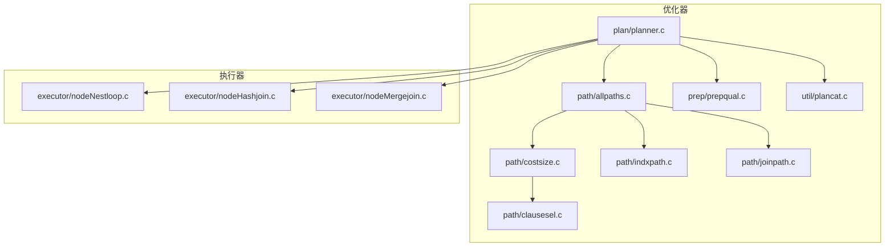
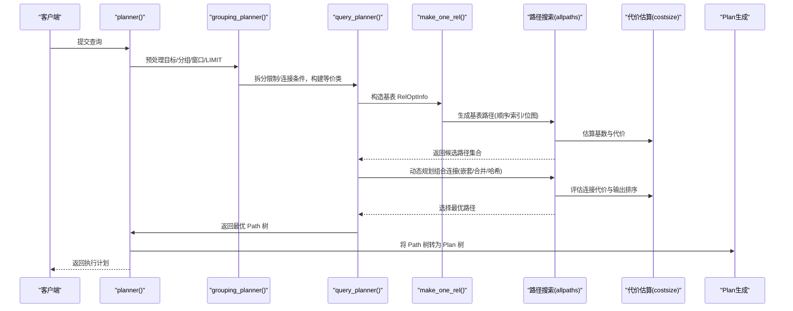
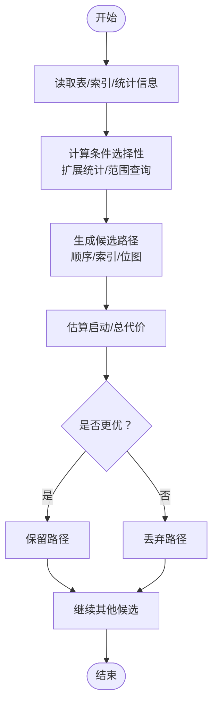
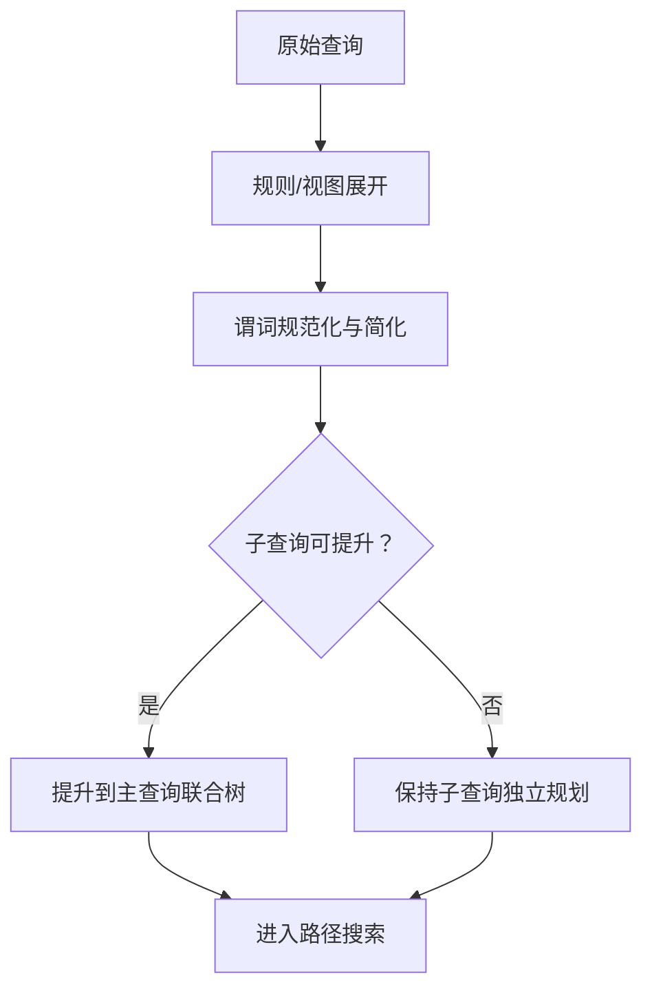
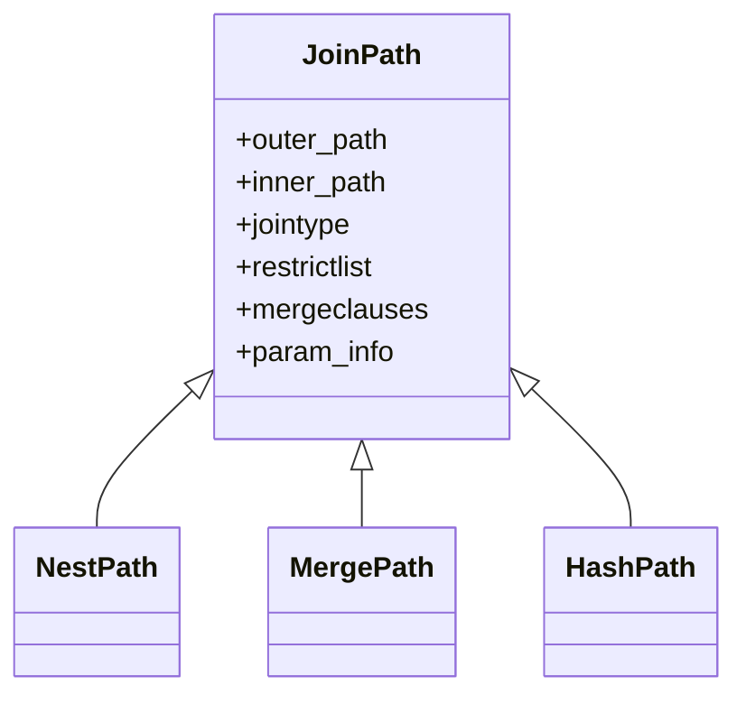
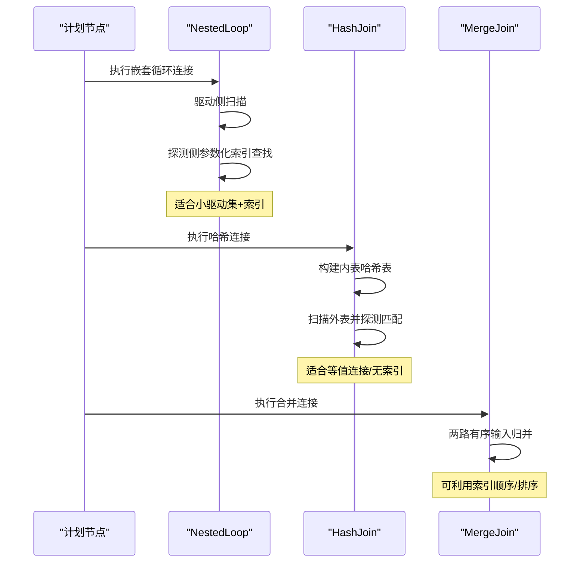
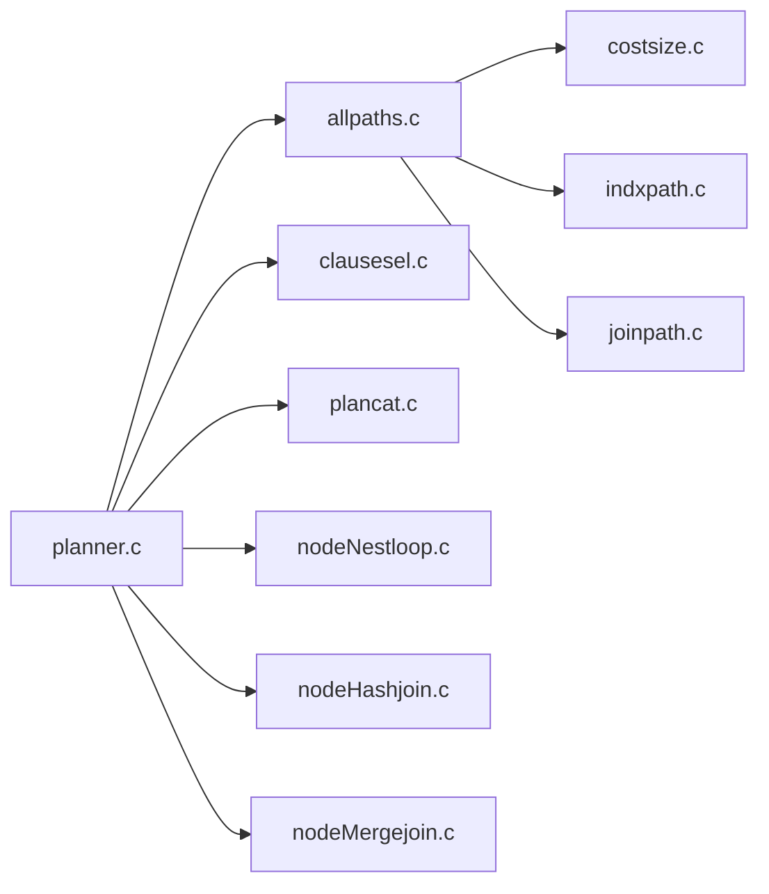

# 查询优化器

<cite>
**本文引用的文件**
- [README](file://src/backend/optimizer/README)
- [planner.c](file://src/backend/optimizer/plan/planner.c)
- [costsize.c](file://src/backend/optimizer/path/costsize.c)
- [indxpath.c](file://src/backend/optimizer/path/indxpath.c)
- [joinpath.c](file://src/backend/optimizer/path/joinpath.c)
- [allpaths.c](file://src/backend/optimizer/path/allpaths.c)
- [clausesel.c](file://src/backend/optimizer/path/clausesel.c)
- [prepqual.c](file://src/backend/optimizer/prep/prepqual.c)
- [plancat.c](file://src/backend/optimizer/util/plancat.c)
- [nodeNestloop.c](file://src/backend/executor/nodeNestloop.c)
- [nodeHashjoin.c](file://src/backend/executor/nodeHashjoin.c)
- [nodeMergejoin.c](file://src/backend/executor/nodeMergejoin.c)
</cite>

## 目录
1. [简介](#简介)
2. [项目结构](#项目结构)
3. [核心组件](#核心组件)
4. [架构总览](#架构总览)
5. [详细组件分析](#详细组件分析)
6. [依赖关系分析](#依赖关系分析)
7. [性能考量](#性能考量)
8. [故障排查指南](#故障排查指南)
9. [结论](#结论)
10. [附录](#附录)

## 简介
本文件面向查询优化器的设计与实现，系统阐述成本估算模型、统计信息使用与索引选择策略；说明查询重写（视图展开、条件简化、子查询转换等）；文档化计划生成算法（嵌套循环连接、哈希连接、合并连接的选择逻辑）；并提供执行计划分析与性能调优指南及常见查询模式的优化建议。内容基于代码库中的优化器模块与执行器节点进行梳理，力求在技术深度与可读性之间取得平衡。

## 项目结构
优化器位于 src/backend/optimizer，按职责划分为：
- plan：计划生成与顶层流程控制
- path：路径搜索与代价估算（含索引路径、连接路径、代价大小估计）
- prep：预处理（如谓词规范化、等价类构建等）
- util：工具函数（如统计信息与目录访问、约束处理等）

图表来源
- [planner.c:1-200](file://src/backend/optimizer/plan/planner.c#L1-L200)
- [allpaths.c:120-200](file://src/backend/optimizer/path/allpaths.c#L120-L200)
- [costsize.c:1-200](file://src/backend/optimizer/path/costsize.c#L1-L200)
- [indxpath.c:1-200](file://src/backend/optimizer/path/indxpath.c#L1-L200)
- [joinpath.c:1-200](file://src/backend/optimizer/path/joinpath.c#L1-L200)
- [clausesel.c:1-200](file://src/backend/optimizer/path/clausesel.c#L1-L200)
- [prepqual.c:1-200](file://src/backend/optimizer/prep/prepqual.c#L1-L200)
- [plancat.c:1-200](file://src/backend/optimizer/util/plancat.c#L1-L200)

章节来源
- [README:1-800](file://src/backend/optimizer/README#L1-L800)

## 核心组件
- 计划入口与流程编排：planner() 负责初始化、子查询提升、目标列表与分组集处理、调用 grouping_planner() 与 query_planner()，最终将 Path 树转换为 Plan 树。
- 基础关系与路径生成：make_one_rel() 收集所有基表 RelOptInfo，计算基数与并行度标志，并为每个基表生成扫描路径（顺序扫描、索引扫描、位图扫描等）。
- 代价与大小估算：costsize.c 提供统一的代价模型（启动代价与总代价），结合有效缓存、CPU/IO 成本参数估算各路径成本。
- 索引路径选择：indxpath.c 根据限制条件、等价类与排序需求匹配索引列，生成 IndexPath/BitmapPath 等候选路径。
- 连接路径生成：joinpath.c 为每对内外关系尝试嵌套循环、合并、哈希连接，并考虑参数化路径、部分聚合/连接、并行等。
- 选择性估算：clausesel.c 利用扩展统计与范围查询识别，估算 WHERE/HAVING/OVER 等条件的选择性。
- 预处理与条件简化：prepqual.c 维护 AND/OR 扁平化、德摩根变换、重复 OR 消除等，保证后续优化一致性与可预测性。
- 目录与统计信息：plancat.c 读取表的元数据、索引、统计对象，为代价与选择性估算提供输入。

章节来源
- [planner.c:1-200](file://src/backend/optimizer/plan/planner.c#L1-L200)
- [allpaths.c:120-200](file://src/backend/optimizer/path/allpaths.c#L120-L200)
- [costsize.c:1-200](file://src/backend/optimizer/path/costsize.c#L1-L200)
- [indxpath.c:1-200](file://src/backend/optimizer/path/indxpath.c#L1-L200)
- [joinpath.c:1-200](file://src/backend/optimizer/path/joinpath.c#L1-L200)
- [clausesel.c:1-200](file://src/backend/optimizer/path/clausesel.c#L1-L200)
- [prepqual.c:1-200](file://src/backend/optimizer/prep/prepqual.c#L1-L200)
- [plancat.c:1-200](file://src/backend/optimizer/util/plancat.c#L1-L200)

## 架构总览
优化器采用“路径搜索 + 代价最小化”的动态规划范式：为每个关系（基表或中间连接结果）维护一组可行路径，并在组合时评估不同连接顺序与实现方式，最终选择全局最优路径并实例化为执行计划。

图表来源
- [planner.c:1-200](file://src/backend/optimizer/plan/planner.c#L1-L200)
- [allpaths.c:120-200](file://src/backend/optimizer/path/allpaths.c#L120-L200)
- [costsize.c:1-200](file://src/backend/optimizer/path/costsize.c#L1-L200)

## 详细组件分析

### 成本估算模型与统计信息使用
- 成本模型：每个路径维护 startup_cost 与 total_cost，支持 LIMIT/EXISTS 场景的插值估算；关键参数包括 seq_page_cost、random_page_cost、cpu_tuple_cost、cpu_index_tuple_cost、cpu_operator_cost、parallel_* 等。
- 统计信息：plancat.c 从系统目录获取 pages/tuples、索引、扩展统计对象；clausesel.c 优先使用扩展统计捕捉跨列相关性，其次回退到单列统计；同时识别范围查询对选择性估算的影响。
- 索引选择：indxpath.c 依据限制条件、等价类与排序需求匹配索引列，生成多种索引路径（普通索引扫描、位图扫描、覆盖索引等），并结合代价与选择性筛选。

图表来源
- [costsize.c:1-200](file://src/backend/optimizer/path/costsize.c#L1-L200)
- [clausesel.c:1-200](file://src/backend/optimizer/path/clausesel.c#L1-L200)
- [plancat.c:1-200](file://src/backend/optimizer/util/plancat.c#L1-L200)
- [indxpath.c:1-200](file://src/backend/optimizer/path/indxpath.c#L1-L200)

章节来源
- [costsize.c:1-200](file://src/backend/optimizer/path/costsize.c#L1-L200)
- [clausesel.c:1-200](file://src/backend/optimizer/path/clausesel.c#L1-L200)
- [plancat.c:1-200](file://src/backend/optimizer/util/plancat.c#L1-L200)
- [indxpath.c:1-200](file://src/backend/optimizer/path/indxpath.c#L1-L200)

### 查询重写：视图展开、条件简化、子查询转换
- 视图与规则展开：由解析/重写阶段完成，优化器接收已展开的查询树。
- 条件简化：prepqual.c 维护 AND/OR 扁平化、德摩根变换、重复 OR 消除，确保后续优化行为一致。
- 子查询提升：README 描述在规划初期将简单子查询提升到主查询的联合树中，扩大搜索空间以获得更优计划；当提升导致 FROM 列表过大时，会限制合并以避免规划时间指数增长。

图表来源
- [README:270-295](file://src/backend/optimizer/README#L270-L295)
- [prepqual.c:1-200](file://src/backend/optimizer/prep/prepqual.c#L1-L200)

章节来源
- [README:270-295](file://src/backend/optimizer/README#L270-L295)
- [prepqual.c:1-200](file://src/backend/optimizer/prep/prepqual.c#L1-L200)

### 计划生成算法：连接算法选择逻辑
- 动态规划搜索：allpaths.c 的 make_one_rel() 为每个基表生成路径，随后逐步组合成更大连接关系，记录每种连接顺序与实现方式的候选路径。
- 连接类型：
  - 嵌套循环连接：适合小驱动集+索引查找的参数化路径，避免全表扫描大表。
  - 合并连接：需要有序输入，可利用索引顺序或显式排序，减少重复扫描。
  - 哈希连接：先构建内表哈希表，再扫描外表匹配，适合无索引或等值连接。
- 选择策略：joinpath.c 为每对外/内关系尝试多种连接方法，考虑唯一性、参数化、部分聚合/连接、并行等，综合代价与排序需求选择最优。

图表来源
- [joinpath.c:100-200](file://src/backend/optimizer/path/joinpath.c#L100-L200)
- [allpaths.c:120-200](file://src/backend/optimizer/path/allpaths.c#L120-L200)

章节来源
- [allpaths.c:120-200](file://src/backend/optimizer/path/allpaths.c#L120-L200)
- [joinpath.c:100-200](file://src/backend/optimizer/path/joinpath.c#L100-L200)

### 执行计划与执行器节点
- 嵌套循环连接：nodeNestloop.c 实现驱动-探测模式，支持参数化下推与索引查找。
- 哈希连接：nodeHashjoin.c 构建哈希表并探测匹配，支持批处理与内存溢出策略。
- 合并连接：nodeMergejoin.c 要求有序输入，利用索引顺序或排序节点，逐行推进。

图表来源
- [nodeNestloop.c:1-200](file://src/backend/executor/nodeNestloop.c#L1-L200)
- [nodeHashjoin.c:1-200](file://src/backend/executor/nodeHashjoin.c#L1-L200)
- [nodeMergejoin.c:1-200](file://src/backend/executor/nodeMergejoin.c#L1-L200)

章节来源
- [nodeNestloop.c:1-200](file://src/backend/executor/nodeNestloop.c#L1-L200)
- [nodeHashjoin.c:1-200](file://src/backend/executor/nodeHashjoin.c#L1-L200)
- [nodeMergejoin.c:1-200](file://src/backend/executor/nodeMergejoin.c#L1-L200)

## 依赖关系分析
- planner.c 作为入口，依赖 allpaths.c 进行路径搜索，依赖 costsize.c 进行代价估算，依赖 indxpath.c 生成索引路径，依赖 joinpath.c 生成连接路径，依赖 clausesel.c 计算选择性，依赖 plancat.c 获取目录与统计信息。
- 执行器节点依赖计划节点类型，分别实现不同的连接算法。

图表来源
- [planner.c:1-200](file://src/backend/optimizer/plan/planner.c#L1-L200)
- [allpaths.c:120-200](file://src/backend/optimizer/path/allpaths.c#L120-L200)
- [costsize.c:1-200](file://src/backend/optimizer/path/costsize.c#L1-L200)
- [indxpath.c:1-200](file://src/backend/optimizer/path/indxpath.c#L1-L200)
- [joinpath.c:1-200](file://src/backend/optimizer/path/joinpath.c#L1-L200)
- [clausesel.c:1-200](file://src/backend/optimizer/path/clausesel.c#L1-L200)
- [plancat.c:1-200](file://src/backend/optimizer/util/plancat.c#L1-L200)

章节来源
- [planner.c:1-200](file://src/backend/optimizer/plan/planner.c#L1-L200)
- [allpaths.c:120-200](file://src/backend/optimizer/path/allpaths.c#L120-L200)

## 性能考量
- 成本参数调优：seq_page_cost、random_page_cost、effective_cache_size 影响顺序/随机 IO 与缓存命中判断；cpu_* 参数影响 CPU 密集型操作的权衡。
- 统计信息质量：更新统计信息（ANALYZE）能显著提升选择性估算准确性，尤其是多列相关性与分布特征。
- 索引设计：为高频过滤与排序列创建合适索引，避免过多无用索引增加路径搜索开销。
- 连接顺序与算法：小表驱动大表、优先使用参数化索引查找；等值连接且无索引时倾向哈希连接；有序数据可用合并连接减少排序。
- 并行与内存：合理设置并行工作进程数与工作内存，避免外部排序/哈希溢出。

[本节为通用指导，不直接分析具体文件]

## 故障排查指南
- 计划异常：检查统计信息是否过期（ANALYZE）、是否存在缺失或失效索引、是否有不当的 GUC 设置抑制了某些路径。
- 慢查询定位：通过 EXPLAIN/EXPLAIN ANALYZE 观察实际行数与代价偏差，核对选择性估算与连接算法选择。
- 常见问题：
  - 选择性估算偏差：确认扩展统计是否启用且最新，检查范围查询与不等式组合。
  - 连接算法选择不当：评估数据分布与索引可用性，必要时调整统计或添加索引。
  - 排序与去重：确认 ORDER BY/DISTINCT 是否能利用索引顺序，避免不必要的显式排序。

章节来源
- [clausesel.c:1-200](file://src/backend/optimizer/path/clausesel.c#L1-L200)
- [costsize.c:1-200](file://src/backend/optimizer/path/costsize.c#L1-L200)
- [indxpath.c:1-200](file://src/backend/optimizer/path/indxpath.c#L1-L200)

## 结论
该查询优化器以路径搜索为核心，结合精确的成本模型与丰富的统计信息，在广泛的计划空间中寻找最优执行方案。通过合理的索引设计、统计信息维护与参数调优，可显著提升复杂查询的性能。理解其内部机制有助于诊断问题、制定优化策略与编写高效 SQL。

[本节为总结，不直接分析具体文件]

## 附录
- 常见查询模式优化建议：
  - 等值连接：优先哈希连接或合并连接（若有序），并确保连接列有索引或统计准确。
  - 范围查询：利用索引前缀匹配与范围选择性估算，避免全表扫描。
  - 聚合与分组：尽量利用索引顺序减少排序，必要时使用部分聚合。
  - 子查询：尽可能提升为连接，扩大优化空间；避免不可提升的子查询造成黑盒。
  - 外层连接：注意语义约束，避免非法重排；必要时显式提示或改写。

[本节为概念性内容，不直接分析具体文件]