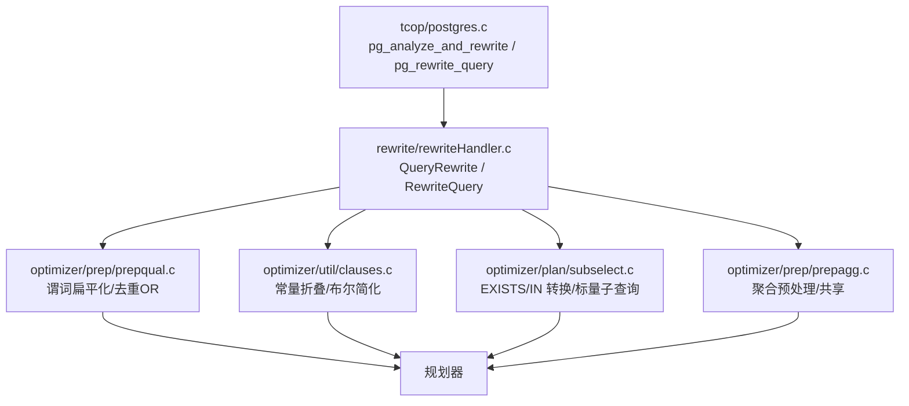
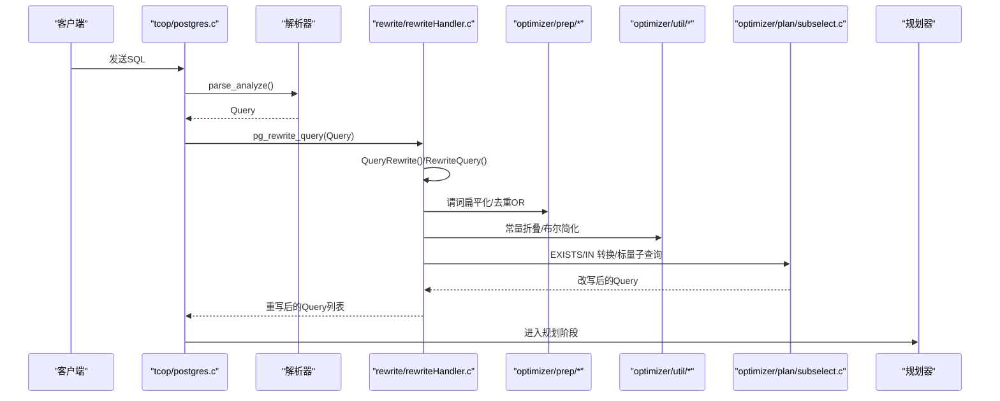
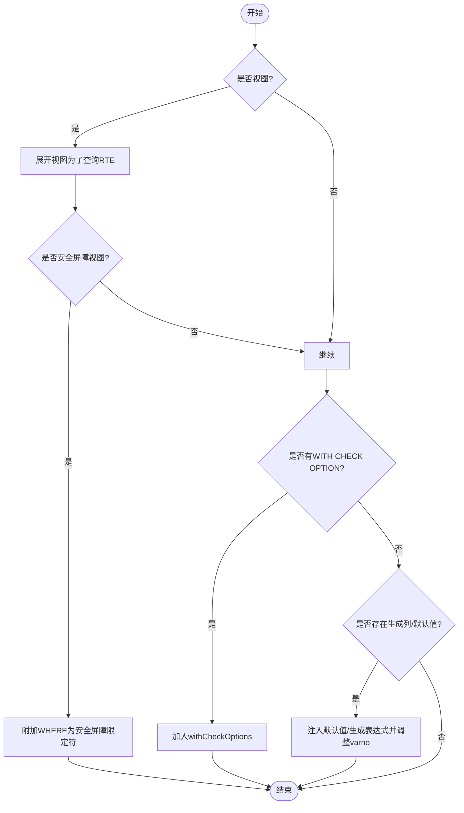
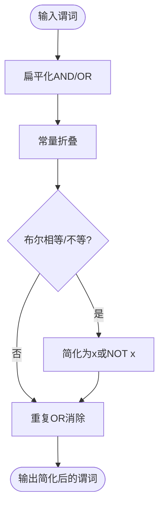
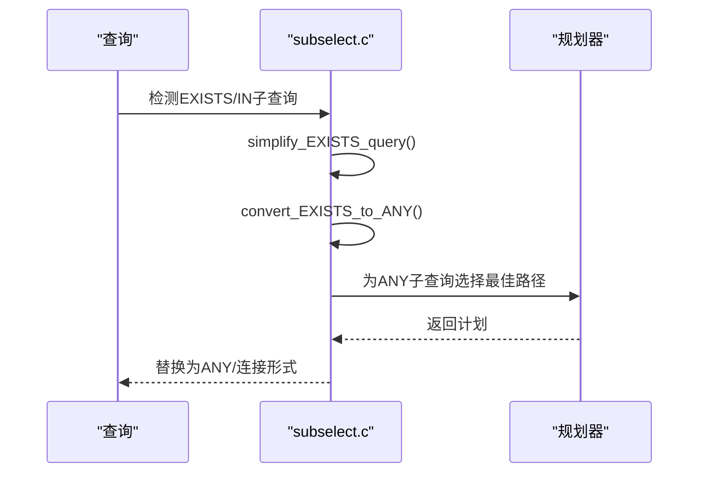
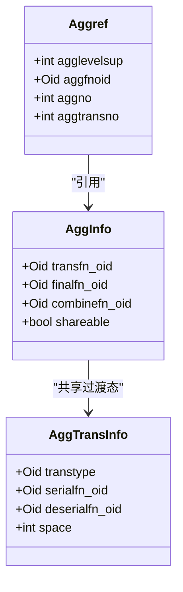
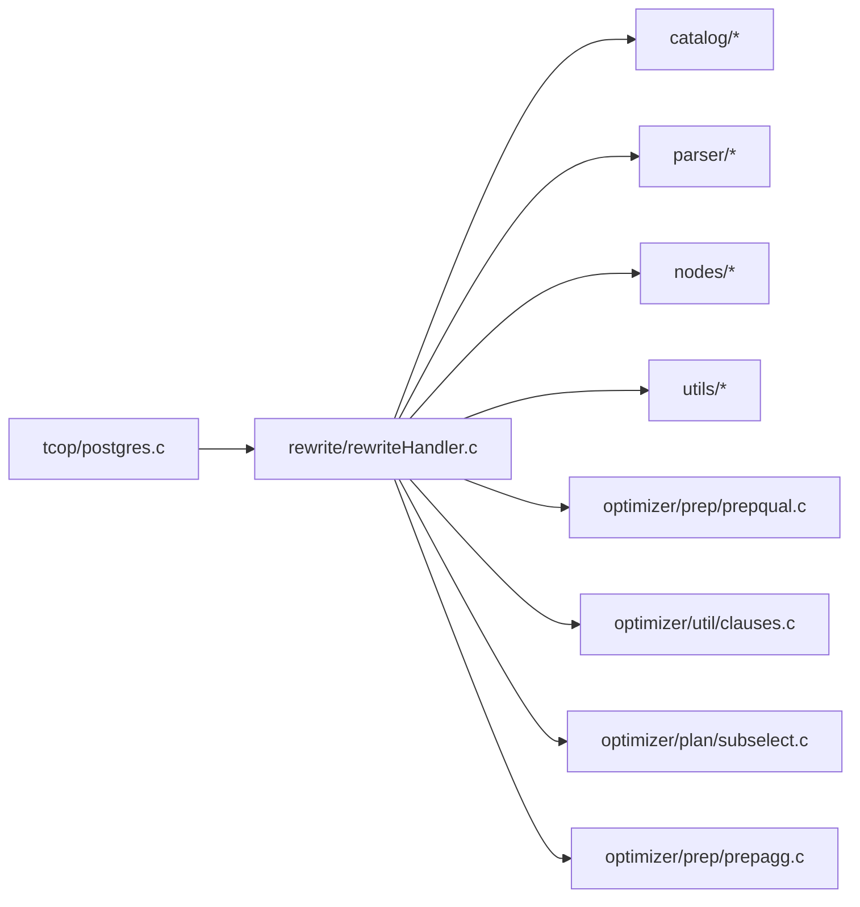

# 查询重写

<cite>
**本文引用的文件**
- [postgres.c](file://src/backend/tcop/postgres.c)
- [rewriteHandler.c](file://src/backend/rewrite/rewriteHandler.c)
- [prepqual.c](file://src/backend/optimizer/prep/prepqual.c)
- [clauses.c](file://src/backend/optimizer/util/clauses.c)
- [subselect.c](file://src/backend/optimizer/plan/subselect.c)
- [prepagg.c](file://src/backend/optimizer/prep/prepagg.c)
- [rules.sgml](file://doc/src/sgml/rules.sgml)
</cite>

## 目录
1. [简介](#简介)
2. [项目结构](#项目结构)
3. [核心组件](#核心组件)
4. [架构总览](#架构总览)
5. [详细组件分析](#详细组件分析)
6. [依赖关系分析](#依赖关系分析)
7. [性能考量](#性能考量)
8. [故障排查指南](#故障排查指南)
9. [结论](#结论)
10. [附录](#附录)

## 简介
本文件系统性梳理查询在优化前的重写与预处理流程，覆盖视图展开、别名与默认值注入、条件简化（常量折叠、布尔表达式简化、范围检查）、子查询转换（IN/EXISTS 到连接或 ANY、标量子查询优化）、聚合函数预处理与共享机会识别，并提供调试工具与性能分析方法。内容基于源码实现与官方文档说明，力求既深入又易于理解。

## 项目结构
查询重写贯穿“解析 -> 重写 -> 规划”的流水线：
- 入口位于后端主循环，负责调用解析分析与重写阶段，并输出可重写的查询树列表。
- 重写器核心在 rewrite 模块，负责规则触发、视图展开、安全屏障处理、WITH CHECK OPTION 等。
- 优化前准备在 optimizer/prep 与 optimizer/util，负责谓词扁平化、常量折叠、布尔简化、重复 OR 消除等。
- 子查询转换在 optimizer/plan/subselect，负责 EXISTS/IN 到连接或 ANY、标量子查询提升等。
- 聚合预处理在 optimizer/prep/prepagg，负责 Aggref 信息收集、过渡态共享、部分聚合可行性判断等。

**图示来源**
- [postgres.c:634-779](file://src/backend/tcop/postgres.c#L634-L779)
- [rewriteHandler.c:3807-3872](file://src/backend/rewrite/rewriteHandler.c#L3807-L3872)
- [prepqual.c:1-45](file://src/backend/optimizer/prep/prepqual.c#L1-L45)
- [clauses.c:3520-3679](file://src/backend/optimizer/util/clauses.c#L3520-L3679)
- [subselect.c:244-287](file://src/backend/optimizer/plan/subselect.c#L244-L287)
- [prepagg.c:1-332](file://src/backend/optimizer/prep/prepagg.c#L1-L332)

**章节来源**
- [postgres.c:634-779](file://src/backend/tcop/postgres.c#L634-L779)
- [rewriteHandler.c:3807-3872](file://src/backend/rewrite/rewriteHandler.c#L3807-L3872)

## 核心组件
- 重写入口与生命周期管理：解析后进入重写阶段，支持规则递归应用、RIR 规则执行、结果集标记控制。
- 视图与安全屏障：视图展开为子查询 RTE；安全屏障视图的 WHERE 需作为安全屏障限定符附加；INSERT/UPDATE/DELETE 对 WITH CHECK OPTION 的处理。
- 条件简化：常量折叠、布尔相等/不等简化、AND/OR 扁平化与重复 OR 消除、NULL 语义处理。
- 子查询转换：EXISTS 到 ANY 的可哈希化转换；标量子查询提升与参数化；IN 子查询到连接的等价变换。
- 聚合预处理：AggInfo/AggTransInfo 构建、过渡态共享、部分聚合可行性判定、序列化能力检查。

**章节来源**
- [rewriteHandler.c:3177-3281](file://src/backend/rewrite/rewriteHandler.c#L3177-L3281)
- [rewriteHandler.c:3298-3307](file://src/backend/rewrite/rewriteHandler.c#L3298-L3307)
- [prepqual.c:389-423](file://src/backend/optimizer/prep/prepqual.c#L389-L423)
- [clauses.c:3520-3679](file://src/backend/optimizer/util/clauses.c#L3520-L3679)
- [subselect.c:244-287](file://src/backend/optimizer/plan/subselect.c#L244-L287)
- [subselect.c:1034-1287](file://src/backend/optimizer/plan/subselect.c#L1034-L1287)
- [prepagg.c:1-332](file://src/backend/optimizer/prep/prepagg.c#L1-L332)

## 架构总览
下图展示从 SQL 文本到重写完成的关键路径与模块交互：

**图示来源**
- [postgres.c:634-779](file://src/backend/tcop/postgres.c#L634-L779)
- [rewriteHandler.c:3807-3872](file://src/backend/rewrite/rewriteHandler.c#L3807-L3872)
- [prepqual.c:1-45](file://src/backend/optimizer/prep/prepqual.c#L1-L45)
- [clauses.c:3520-3679](file://src/backend/optimizer/util/clauses.c#L3520-L3679)
- [subselect.c:244-287](file://src/backend/optimizer/plan/subselect.c#L244-L287)

## 详细组件分析

### 视图展开、别名与默认值注入
- 视图展开：将视图引用替换为包含视图定义动作的子查询 RTE，保留访问权限检查所需的额外 RTE 项。
- 安全屏障视图：WHERE 条件作为安全屏障限定符附加到 RTE，确保在外部查询之前应用。
- INSERT/UPDATE/DELETE 的 WITH CHECK OPTION：将视图的约束条件加入 withCheckOptions 列表，并在必要时复制和修正变量编号。
- 生成列与默认值：当目标列存在生成表达式且与目标列排序规则不一致时，包裹 COLLATE；同时调整 varno 以指向新 RTE。

**图示来源**
- [rewriteHandler.c:3177-3281](file://src/backend/rewrite/rewriteHandler.c#L3177-L3281)
- [rewriteHandler.c:3769-3795](file://src/backend/rewrite/rewriteHandler.c#L3769-L3795)
- [rules.sgml:494-543](file://doc/src/sgml/rules.sgml#L494-L543)

**章节来源**
- [rewriteHandler.c:3177-3281](file://src/backend/rewrite/rewriteHandler.c#L3177-L3281)
- [rewriteHandler.c:3769-3795](file://src/backend/rewrite/rewriteHandler.c#L3769-L3795)
- [rules.sgml:494-543](file://doc/src/sgml/rules.sgml#L494-L543)

### 条件简化算法（常量折叠、布尔表达式简化、范围检查）
- AND/OR 扁平化：保持顶层 AND/OR 平坦结构，便于后续优化一致化。
- 常量折叠：对布尔表达式进行 TRUE/FALSE/NULL 传播；遇到 FALSE 立即短路返回空列表。
- 布尔相等/不等简化：x = true => x；x <> false => x；x = false => NOT x；x <> true => NOT x。
- 重复 OR 消除：在顶层 AND/OR 中去除冗余 OR 分支，并处理 NULL 常量在顶层的语义特例。

**图示来源**
- [prepqual.c:389-423](file://src/backend/optimizer/prep/prepqual.c#L389-L423)
- [clauses.c:3520-3679](file://src/backend/optimizer/util/clauses.c#L3520-L3679)

**章节来源**
- [prepqual.c:389-423](file://src/backend/optimizer/prep/prepqual.c#L389-L423)
- [clauses.c:3520-3679](file://src/backend/optimizer/util/clauses.c#L3520-L3679)

### 子查询转换策略（IN/EXISTS 到连接、标量子查询优化）
- EXISTS 到 ANY 转换：若 EXISTS 子查询可简化为目标为空 targetlist 的形式，则尝试转换为 ANY 子链接，以便使用哈希计划。
- 标量子查询提升：提取子查询的 WHERE 条件，确保无父级 Var 引用（除必要的关联），避免易变函数，调整 Var 层级并提升为连接。
- IN 子查询到连接：通过分离 whereClause 与 rtable，合并 FromExpr 并偏移 varno，形成等价连接。

**图示来源**
- [subselect.c:244-287](file://src/backend/optimizer/plan/subselect.c#L244-L287)
- [subselect.c:1034-1287](file://src/backend/optimizer/plan/subselect.c#L1034-L1287)

**章节来源**
- [subselect.c:244-287](file://src/backend/optimizer/plan/subselect.c#L244-L287)
- [subselect.c:1034-1287](file://src/backend/optimizer/plan/subselect.c#L1034-L1287)

### 聚合函数的预处理与优化机会识别
- AggInfo/AggTransInfo 构建：为每个聚合及其过渡态创建信息结构，设置 aggno/transno，解析多态过渡类型。
- 过渡态共享：相同输入与属性的聚合可共享过渡状态，减少最终函数调用次数。
- 部分聚合可行性：若无 combine 函数或 INTERNAL 类型缺少序列化/反序列化函数，则标记不可部分聚合。
- 扫描与定位：提供 contain_aggs_of_level 与 locate_agg_of_level 用于检测与定位特定层级的聚合。

**图示来源**
- [prepagg.c:1-332](file://src/backend/optimizer/prep/prepagg.c#L1-L332)
- [rewriteManip.c:48-108](file://src/backend/rewrite/rewriteManip.c#L48-L108)
- [rewriteManip.c:110-182](file://src/backend/rewrite/rewriteManip.c#L110-L182)

**章节来源**
- [prepagg.c:1-332](file://src/backend/optimizer/prep/prepagg.c#L1-L332)
- [rewriteManip.c:48-108](file://src/backend/rewrite/rewriteManip.c#L48-L108)
- [rewriteManip.c:110-182](file://src/backend/rewrite/rewriteManip.c#L110-L182)

### 常见查询模式的重写示例与最佳实践
- 视图查询：SELECT 通过视图时，重写器将视图展开为子查询 RTE，并保留权限检查所需条目。
- 更新/删除视图：对于 UPDATE/DELETE，需要展开视图以产生 old 行；INSERT 时视图作为结果关系不展开。
- 复杂规则链：INSERT ... SELECT 经规则系统多次重写，可能转化为 UPDATE 或其他命令，需注意递归终止与错误检测。

**章节来源**
- [rules.sgml:494-543](file://doc/src/sgml/rules.sgml#L494-L543)
- [rules.sgml:1157-1180](file://doc/src/sgml/rules.sgml#L1157-L1180)
- [rules.sgml:1620-1647](file://doc/src/sgml/rules.sgml#L1620-L1647)

## 依赖关系分析
重写阶段依赖多个子系统：
- tcop 入口负责调度解析与重写，并打印调试信息。
- rewrite 模块依赖 catalog、parser、nodes、utils 等，进行规则匹配、RTE 操作、锁获取。
- 优化前准备依赖 planner 接口与 lsyscache，进行表达式与谓词简化。
- 子查询转换依赖 planner 的 subquery_planner 与路径选择逻辑。
- 聚合预处理依赖系统缓存与 planner 上下文。

**图示来源**
- [postgres.c:634-779](file://src/backend/tcop/postgres.c#L634-L779)
- [rewriteHandler.c:21-45](file://src/backend/rewrite/rewriteHandler.c#L21-L45)
- [prepqual.c:32-45](file://src/backend/optimizer/prep/prepqual.c#L32-L45)
- [clauses.c:3520-3679](file://src/backend/optimizer/util/clauses.c#L3520-L3679)
- [subselect.c:244-287](file://src/backend/optimizer/plan/subselect.c#L244-L287)
- [prepagg.c:1-332](file://src/backend/optimizer/prep/prepagg.c#L1-L332)

**章节来源**
- [rewriteHandler.c:21-45](file://src/backend/rewrite/rewriteHandler.c#L21-L45)

## 性能考量
- 常量折叠与布尔简化可减少后续计算量，避免不必要的函数调用与比较。
- 子查询转连接/ANY 可利用哈希计划，降低嵌套循环成本。
- 聚合过渡态共享减少最终函数调用，提高吞吐。
- 安全屏障视图的 WHERE 前置可尽早过滤数据，减少后续开销。
- 注意易变函数与 volatile 表达式会阻止某些优化（如子查询提升）。

[本节为通用指导，无需具体文件来源]

## 故障排查指南
- 启用调试输出：
  - Debug_print_parse：打印解析树。
  - Debug_print_rewritten：打印重写后的解析树。
- 统计信息：
  - log_parser_stats：记录解析与重写阶段的耗时统计。
- 常见问题：
  - 规则递归导致无限循环：重写系统会检测并报错。
  - 安全屏障视图未生效：确认 WHERE 已作为安全屏障限定符附加。
  - 子查询无法提升：检查是否包含父级 Var 引用或易变函数。

**章节来源**
- [postgres.c:734-779](file://src/backend/tcop/postgres.c#L734-L779)
- [rewriteHandler.c:3807-3872](file://src/backend/rewrite/rewriteHandler.c#L3807-L3872)

## 结论
查询重写系统在 PostgreSQL 中承担了解析后到规划前的重要职责，通过视图展开、条件简化、子查询转换与聚合预处理等手段，显著提升了后续规划与执行的效率。掌握这些机制有助于编写更高效的 SQL，并利用调试工具定位问题与优化瓶颈。

[本节为总结性内容，无需具体文件来源]

## 附录
- 术语对照：
  - RTE：Range Table Entry，范围表条目。
  - RIR：Retrieve Instead Retrieve，一种规则类型。
  - WCO：WITH CHECK OPTION，视图写入检查选项。
- 参考路径：
  - 重写入口：src/backend/tcop/postgres.c
  - 重写核心：src/backend/rewrite/rewriteHandler.c
  - 谓词准备：src/backend/optimizer/prep/prepqual.c
  - 表达式简化：src/backend/optimizer/util/clauses.c
  - 子查询转换：src/backend/optimizer/plan/subselect.c
  - 聚合预处理：src/backend/optimizer/prep/prepagg.c
  - 文档说明：doc/src/sgml/rules.sgml

[本节为补充信息，无需具体文件来源]