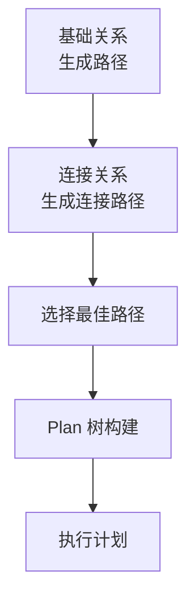
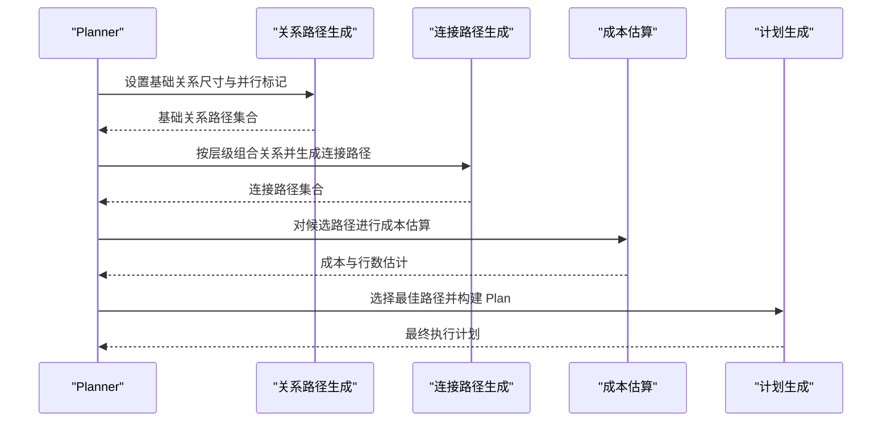
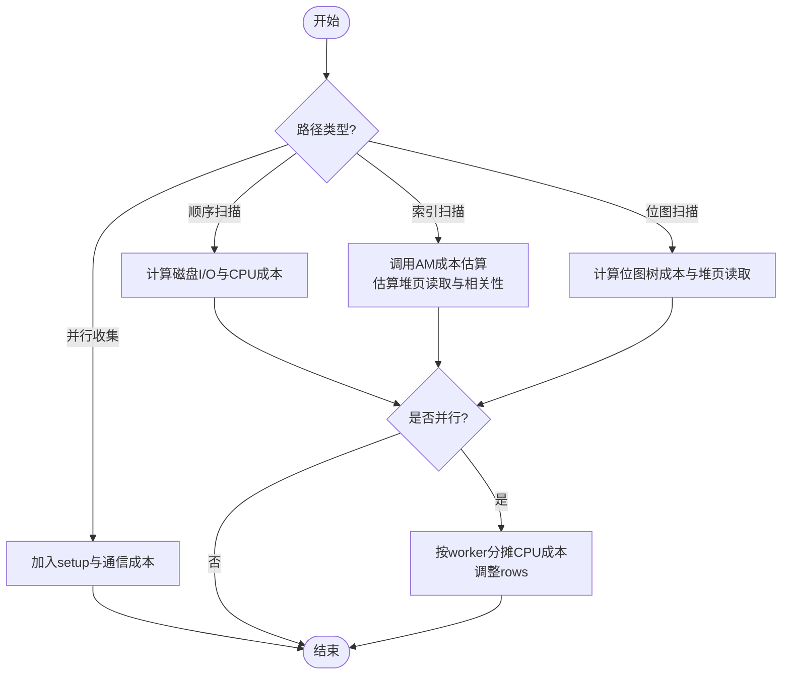
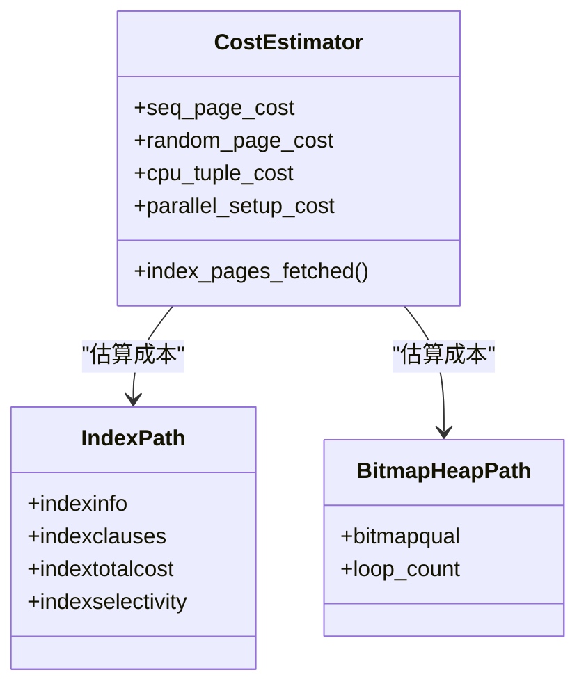
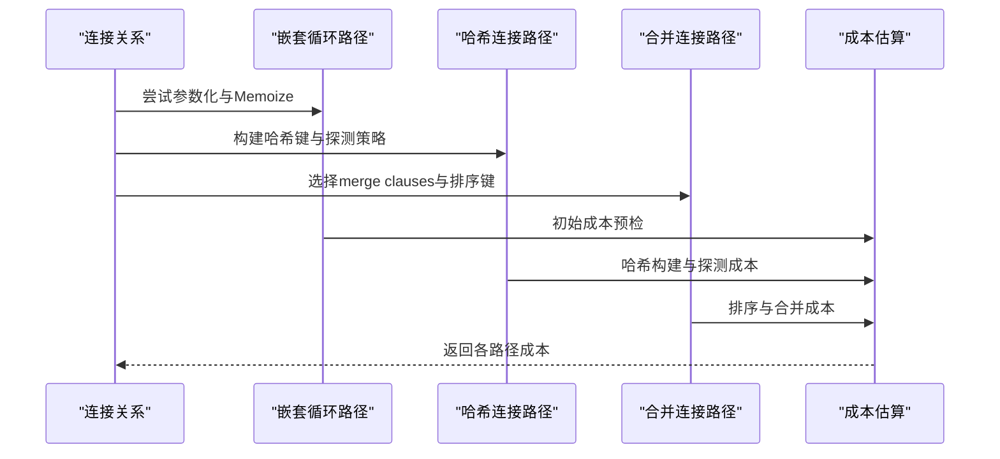
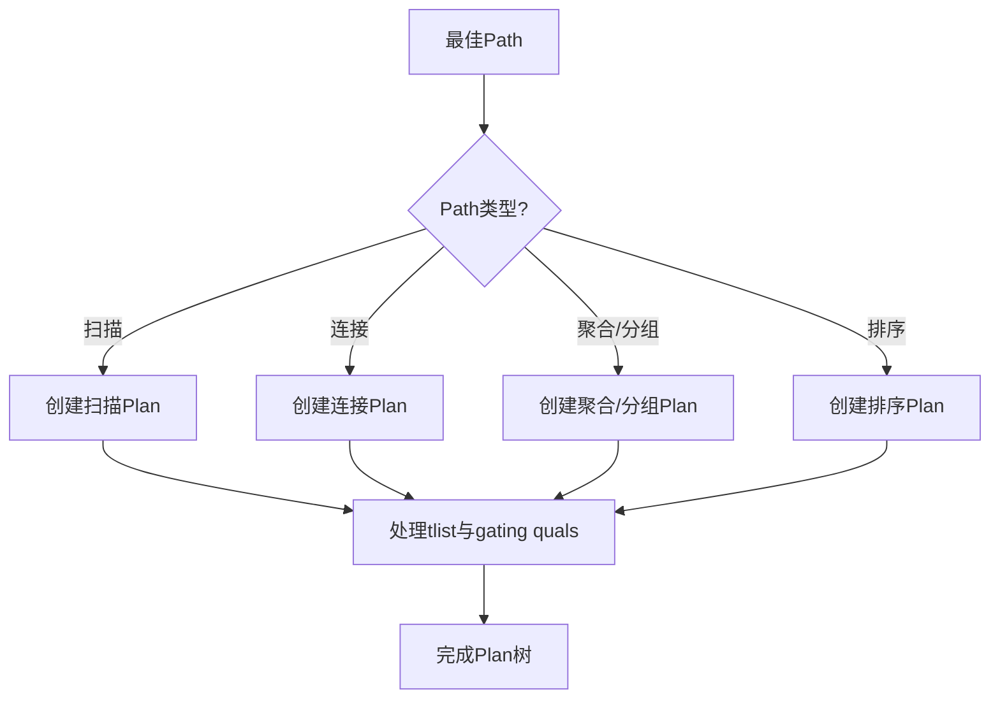
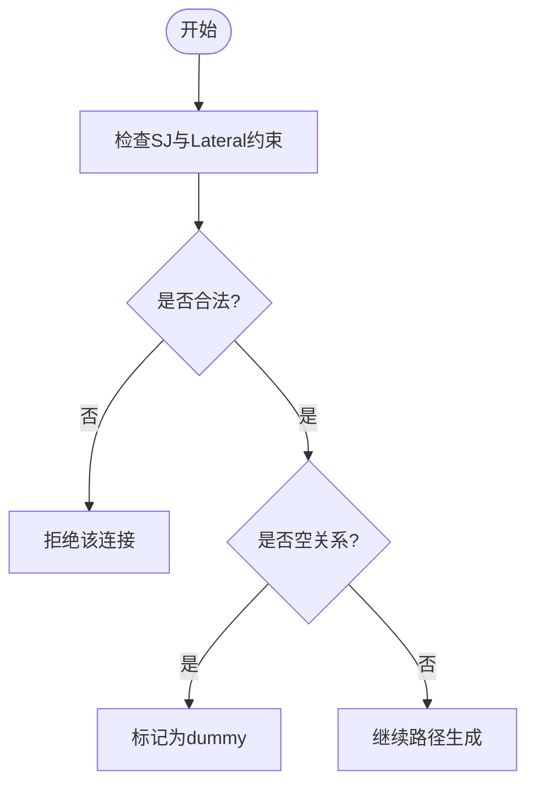
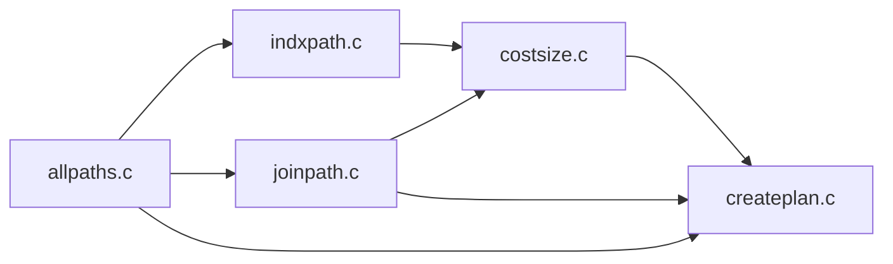

# 计划选择

<cite>
**本文引用的文件**
- [allpaths.c](file://src/backend/optimizer/path/allpaths.c)
- [costsize.c](file://src/backend/optimizer/path/costsize.c)
- [indxpath.c](file://src/backend/optimizer/path/indxpath.c)
- [joinpath.c](file://src/backend/optimizer/path/joinpath.c)
- [joinrels.c](file://src/backend/optimizer/path/joinrels.c)
- [createplan.c](file://src/backend/optimizer/plan/createplan.c)
</cite>

## 目录
1. [简介](#简介)
2. [项目结构](#项目结构)
3. [核心组件](#核心组件)
4. [架构总览](#架构总览)
5. [详细组件分析](#详细组件分析)
6. [依赖关系分析](#依赖关系分析)
7. [性能考量](#性能考量)
8. [故障排查指南](#故障排查指南)
9. [结论](#结论)
10. [附录](#附录)

## 简介
本文件系统性阐述优化器如何从大量候选路径中选择最优执行计划，涵盖成本估算、约束满足检查、并行度评估与计划树构建等关键环节。重点说明不同节点类型（如顺序扫描、索引扫描、位图扫描、哈希连接、合并连接、嵌套循环连接）的计划生成过程，以及计划验证与一致性检查机制。文末提供复杂查询的计划选择案例与调优建议。

## 项目结构
优化器分为“路径探索”和“计划生成”两大阶段：
- 路径探索阶段：在 relation 级别生成多种访问路径（SeqScan、IndexScan、BitmapHeapScan、TidScan、SampleScan 等），并在 join 级别生成 JoinPath（NestLoop/MergeJoin/HashJoin）。
- 计划生成阶段：将选定的 Path 转换为可执行的 Plan 树（SeqScan/IndexScan/BitmapHeapScan/HashJoin/MergeJoin/NestLoop 等）。

**图表来源**
- [allpaths.c:123-212](file://src/backend/optimizer/path/allpaths.c#L123-L212)
- [joinrels.c:55-258](file://src/backend/optimizer/path/joinrels.c#L55-L258)
- [createplan.c:297-496](file://src/backend/optimizer/plan/createplan.c#L297-L496)

**章节来源**
- [allpaths.c:123-212](file://src/backend/optimizer/path/allpaths.c#L123-L212)
- [joinrels.c:55-258](file://src/backend/optimizer/path/joinrels.c#L55-L258)
- [createplan.c:297-496](file://src/backend/optimizer/plan/createplan.c#L297-L496)

## 核心组件
- 成本与大小估算：统一为各路径计算 startup_cost、total_cost、rows，并考虑并行化分摊与缓存效应。
- 基础关系路径生成：顺序扫描、采样扫描、索引扫描、位图扫描、TID 扫描等。
- 连接路径生成：嵌套循环、哈希连接、合并连接，支持参数化路径与 Memoize。
- 计划生成：将 Path 转为 Plan，处理 tlist、伪常量 gating、排序与投影注入等。

**章节来源**
- [costsize.c:118-148](file://src/backend/optimizer/path/costsize.c#L118-L148)
- [allpaths.c:657-700](file://src/backend/optimizer/path/allpaths.c#L657-L700)
- [indxpath.c:234-415](file://src/backend/optimizer/path/indxpath.c#L234-L415)
- [joinpath.c:122-343](file://src/backend/optimizer/path/joinpath.c#L122-L343)
- [createplan.c:297-496](file://src/backend/optimizer/plan/createplan.c#L297-L496)

## 架构总览
优化流程的关键步骤如下：
1. 基础关系尺寸估计与并行性标记
2. 基础关系路径生成（顺序/索引/位图/TID/采样）
3. 连接关系组合与路径生成（嵌套/哈希/合并）
4. 路径比较与选择（成本、约束、并行度）
5. 计划树构建（Plan 节点创建与参数传递）

**图表来源**
- [allpaths.c:267-331](file://src/backend/optimizer/path/allpaths.c#L267-L331)
- [joinrels.c:55-258](file://src/backend/optimizer/path/joinrels.c#L55-L258)
- [costsize.c:220-286](file://src/backend/optimizer/path/costsize.c#L220-L286)
- [createplan.c:297-496](file://src/backend/optimizer/plan/createplan.c#L297-L496)

## 详细组件分析

### 成本估算与并行度评估
- 成本模型：基于顺序页成本、随机页成本、CPU 每元组成本、索引元组成本、算子成本、并行通信成本等。
- 并行分摊：当路径启用并行时，CPU 运行成本按 worker 数分摊，rows 相应调整；并行收集节点增加 setup 与通信成本。
- 缓存效应：索引扫描使用 Mackert-Lohman 近似估算实际读取的页面数，结合 effective_cache_size 分配缓冲份额。

**图表来源**
- [costsize.c:220-286](file://src/backend/optimizer/path/costsize.c#L220-L286)
- [costsize.c:482-754](file://src/backend/optimizer/path/costsize.c#L482-L754)
- [costsize.c:945-1039](file://src/backend/optimizer/path/costsize.c#L945-L1039)
- [costsize.c:369-462](file://src/backend/optimizer/path/costsize.c#L369-L462)

**章节来源**
- [costsize.c:118-148](file://src/backend/optimizer/path/costsize.c#L118-L148)
- [costsize.c:220-286](file://src/backend/optimizer/path/costsize.c#L220-L286)
- [costsize.c:482-754](file://src/backend/optimizer/path/costsize.c#L482-L754)
- [costsize.c:945-1039](file://src/backend/optimizer/path/costsize.c#L945-L1039)
- [costsize.c:369-462](file://src/backend/optimizer/path/costsize.c#L369-L462)

### 基础关系路径生成（SeqScan、IndexScan、BitmapHeapScan、TidScan、SampleScan）
- 顺序扫描：适用于全表或大比例扫描，成本包含页读取与每元组 CPU 开销。
- 索引扫描：根据索引 AM 的成本估算函数，结合选择性、相关性、索引-only 特性估算堆页读取与 CPU 成本。
- 位图扫描：组合多个索引路径（AND/OR），估算位图操作与堆页读取成本。
- TID 扫描：按 TID 直接定位行，适合少量随机访问。
- 采样扫描：依据采样方法估算访问页数与返回元组数。

**图表来源**
- [costsize.c:482-754](file://src/backend/optimizer/path/costsize.c#L482-L754)
- [costsize.c:945-1039](file://src/backend/optimizer/path/costsize.c#L945-L1039)
- [indxpath.c:234-415](file://src/backend/optimizer/path/indxpath.c#L234-L415)

**章节来源**
- [allpaths.c:657-700](file://src/backend/optimizer/path/allpaths.c#L657-L700)
- [indxpath.c:234-415](file://src/backend/optimizer/path/indxpath.c#L234-L415)
- [costsize.c:220-286](file://src/backend/optimizer/path/costsize.c#L220-L286)
- [costsize.c:945-1039](file://src/backend/optimizer/path/costsize.c#L945-L1039)

### 连接路径生成（NestLoop、HashJoin、MergeJoin）
- 嵌套循环：适合小内表或存在参数化路径的场景，支持 Memoize 缓存重复内表扫描。
- 哈希连接：对外表构建哈希表，内表探测匹配，适合不等值或无合适排序的连接。
- 合并连接：要求两侧有序，适合大范围有序数据连接，支持部分路径与 Gather Merge。

**图表来源**
- [joinpath.c:122-343](file://src/backend/optimizer/path/joinpath.c#L122-L343)
- [joinpath.c:643-748](file://src/backend/optimizer/path/joinpath.c#L643-L748)
- [joinpath.c:492-636](file://src/backend/optimizer/path/joinpath.c#L492-L636)

**章节来源**
- [joinpath.c:122-343](file://src/backend/optimizer/path/joinpath.c#L122-L343)
- [joinpath.c:643-748](file://src/backend/optimizer/path/joinpath.c#L643-L748)
- [joinpath.c:492-636](file://src/backend/optimizer/path/joinpath.c#L492-L636)

### 计划树构建（Plan 节点创建与参数传递）
- 扫描节点：根据 Path 类型创建 SeqScan/IndexScan/BitmapHeapScan/TidScan/SampleScan 等 Plan。
- 连接节点：根据 JoinPath 类型创建 NestLoop/MergeJoin/HashJoin。
- 投影与排序：必要时注入 Sort/ProjectSet/Memoize 等节点以满足上层需求。
- 伪常量门控：将伪常量条件提升为一次性评估的 Result 节点。

**图表来源**
- [createplan.c:297-496](file://src/backend/optimizer/plan/createplan.c#L297-L496)
- [createplan.c:502-715](file://src/backend/optimizer/plan/createplan.c#L502-L715)
- [createplan.c:977-1028](file://src/backend/optimizer/plan/createplan.c#L977-L1028)

**章节来源**
- [createplan.c:297-496](file://src/backend/optimizer/plan/createplan.c#L297-L496)
- [createplan.c:502-715](file://src/backend/optimizer/plan/createplan.c#L502-L715)
- [createplan.c:977-1028](file://src/backend/optimizer/plan/createplan.c#L977-L1028)

### 约束满足与合法性检查
- 特殊连接（SJ）合法性：检查左右侧集合、语义限制、LATERAL 引用方向与 PHV 安全性。
- 连接顺序限制：通过 SpecialJoinInfo 与 Lateral 依赖确保连接顺序合法。
- 空关系传播：若任一侧为空或限制恒假，则连接结果标记为 dummy。

**图表来源**
- [joinrels.c:348-655](file://src/backend/optimizer/path/joinrels.c#L348-L655)
- [joinrels.c:760-800](file://src/backend/optimizer/path/joinrels.c#L760-L800)

**章节来源**
- [joinrels.c:348-655](file://src/backend/optimizer/path/joinrels.c#L348-L655)
- [joinrels.c:760-800](file://src/backend/optimizer/path/joinrels.c#L760-L800)

## 依赖关系分析
- allpaths.c 负责基础关系的尺寸估计与路径生成，并驱动 join 搜索。
- indxpath.c 负责索引路径生成与位图路径组合。
- joinpath.c 负责连接路径生成与成本预检。
- costsize.c 提供统一的成本估算与并行度调整。
- createplan.c 将 Path 转换为 Plan，处理 tlist、gating、排序与投影。

**图表来源**
- [allpaths.c:123-212](file://src/backend/optimizer/path/allpaths.c#L123-L212)
- [indxpath.c:234-415](file://src/backend/optimizer/path/indxpath.c#L234-L415)
- [joinpath.c:122-343](file://src/backend/optimizer/path/joinpath.c#L122-L343)
- [costsize.c:220-286](file://src/backend/optimizer/path/costsize.c#L220-L286)
- [createplan.c:297-496](file://src/backend/optimizer/plan/createplan.c#L297-L496)

**章节来源**
- [allpaths.c:123-212](file://src/backend/optimizer/path/allpaths.c#L123-L212)
- [indxpath.c:234-415](file://src/backend/optimizer/path/indxpath.c#L234-L415)
- [joinpath.c:122-343](file://src/backend/optimizer/path/joinpath.c#L122-L343)
- [costsize.c:220-286](file://src/backend/optimizer/path/costsize.c#L220-L286)
- [createplan.c:297-496](file://src/backend/optimizer/plan/createplan.c#L297-L496)

## 性能考量
- 成本参数调优：合理设置 seq_page_cost、random_page_cost、effective_cache_size 以反映硬件与缓存特性。
- 并行度控制：根据 max_parallel_workers_per_gather 与最小并行阈值避免过度并行带来的 overhead。
- 索引选择：利用统计信息与相关性提高索引扫描选择性，减少堆页随机访问。
- 连接策略：对小表优先嵌套循环，对大表有序数据优先合并连接，对无排序数据优先哈希连接。
- 计划稳定性：通过固定统计信息、索引维护与查询重写降低计划抖动。

[本节为通用指导，不直接分析具体文件]

## 故障排查指南
- 计划异常：检查 enable_* 开关是否误关闭了必要路径类型（如 enable_seqscan、enable_indexscan、enable_hashjoin、enable_mergejoin）。
- 并行问题：确认 consider_parallel 标志与 parallel_safe 属性，避免在不安全表达式下启用并行。
- 连接非法：审查 SpecialJoinInfo 与 Lateral 依赖，确保连接顺序与语义一致。
- 成本失真：核对统计信息准确性与 effective_cache_size 配置，避免错误缓存假设导致计划劣化。

**章节来源**
- [costsize.c:118-148](file://src/backend/optimizer/path/costsize.c#L118-L148)
- [allpaths.c:527-650](file://src/backend/optimizer/path/allpaths.c#L527-L650)
- [joinrels.c:348-655](file://src/backend/optimizer/path/joinrels.c#L348-L655)

## 结论
优化器通过系统化的路径生成、成本估算与约束检查，在多候选路径中选出最优执行计划。合理的成本参数、索引设计与连接策略能显著提升查询性能。理解计划选择机制有助于针对性调优与问题定位。

[本节为总结性内容，不直接分析具体文件]

## 附录
- 复杂查询案例：多表 JOIN + 聚合 + 排序场景下，优先保证连接顺序合法，选择合适的连接算法，必要时引入 Materialize/Memoize 减少重复计算。
- 优化技巧：
  - 为高频过滤列建立合适索引，关注选择性。
  - 对大范围有序连接使用 MergeJoin，避免额外排序。
  - 对小表嵌套循环配合参数化路径，利用 Memoize 缓存。
  - 调整并行度与缓存参数以匹配硬件特性。

[本节为补充内容，不直接分析具体文件]