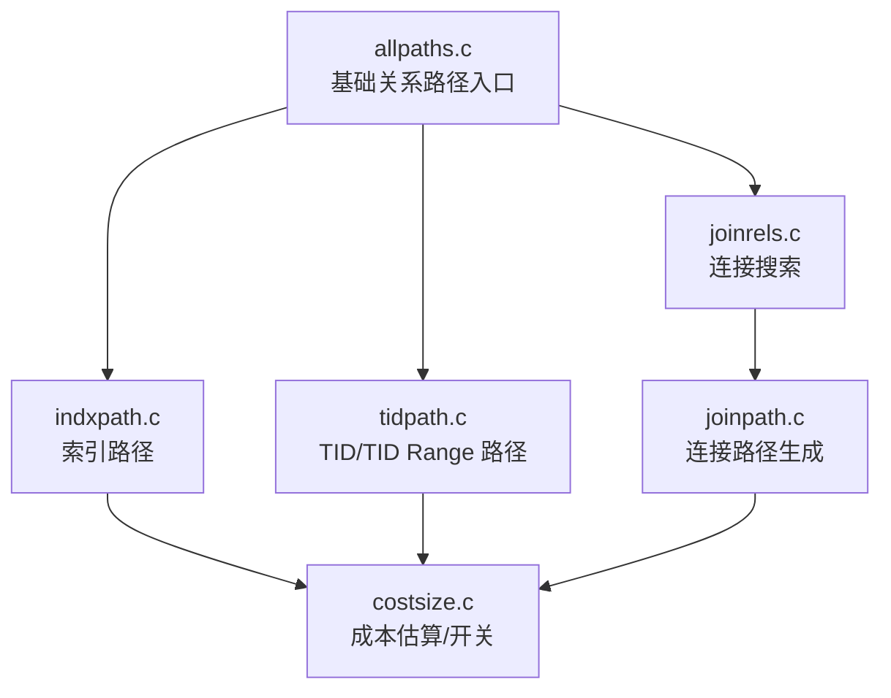
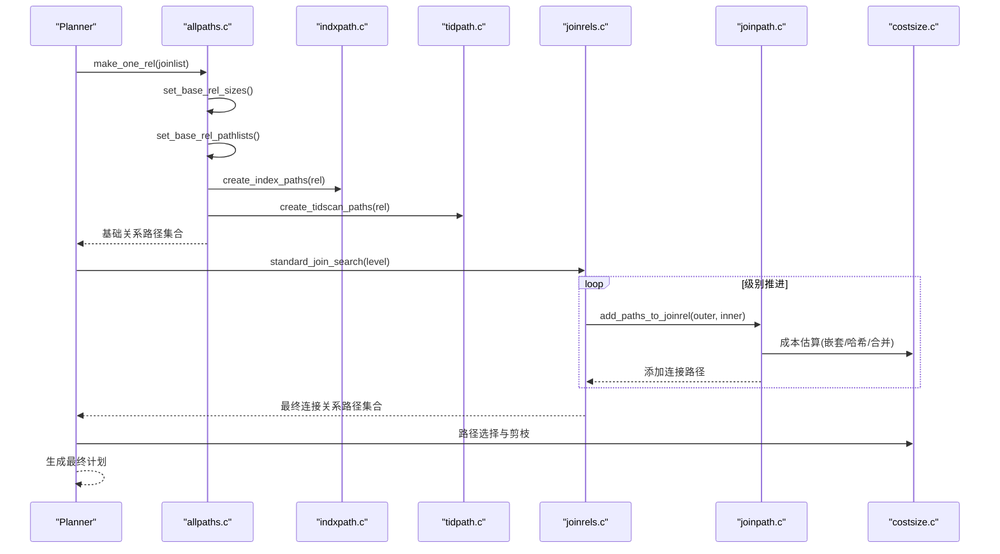
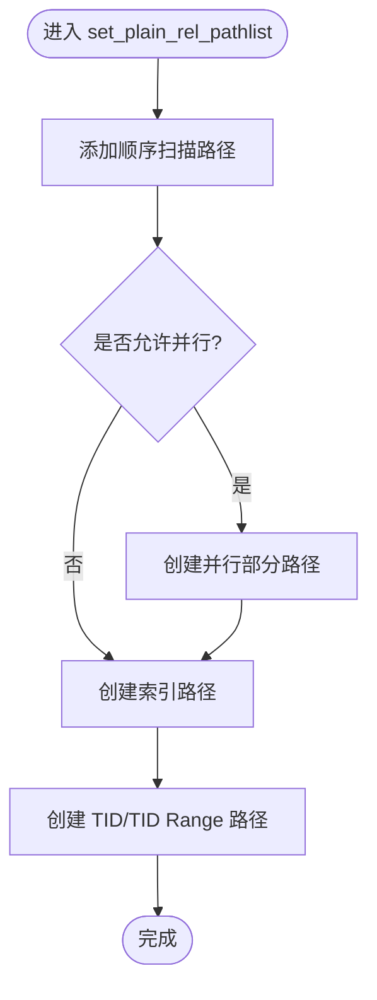
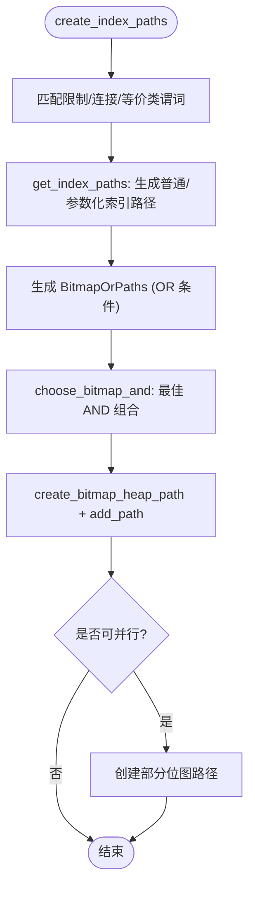
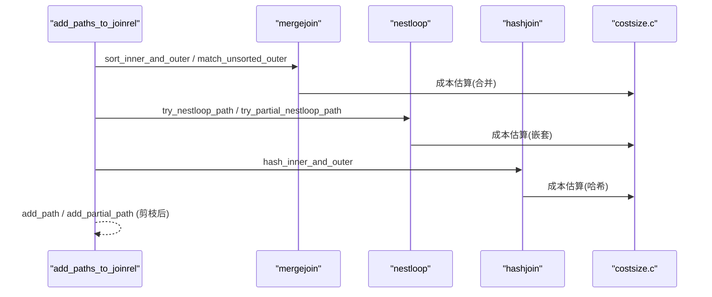
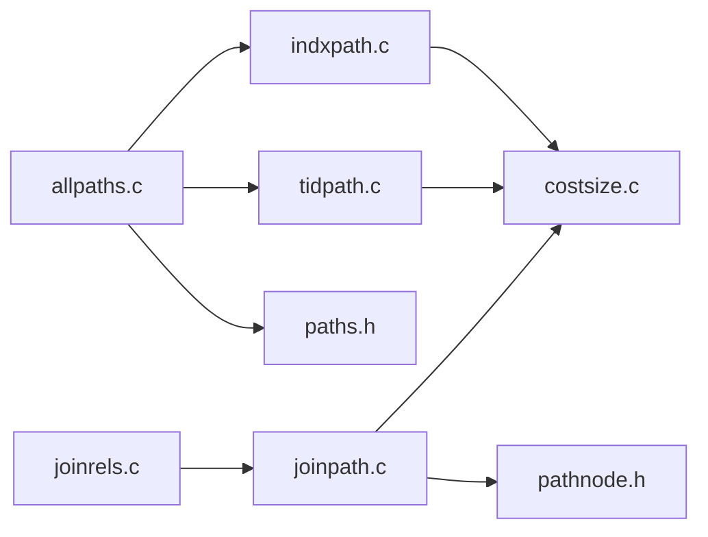

# 路径生成

<cite>
**本文引用的文件**
- [allpaths.c](file://src/backend/optimizer/path/allpaths.c)
- [indxpath.c](file://src/backend/optimizer/path/indxpath.c)
- [tidpath.c](file://src/backend/optimizer/path/tidpath.c)
- [joinpath.c](file://src/backend/optimizer/path/joinpath.c)
- [joinrels.c](file://src/backend/optimizer/path/joinrels.c)
- [costsize.c](file://src/backend/optimizer/path/costsize.c)
- [pathnode.h](file://src/include/optimizer/pathnode.h)
- [paths.h](file://src/include/optimizer/paths.h)
</cite>

## 目录
1. [简介](#简介)
2. [项目结构](#项目结构)
3. [核心组件](#核心组件)
4. [架构总览](#架构总览)
5. [详细组件分析](#详细组件分析)
6. [依赖关系分析](#依赖关系分析)
7. [性能考量](#性能考量)
8. [故障排查指南](#故障排查指南)
9. [结论](#结论)
10. [附录：复杂查询路径生成案例](#附录复杂查询路径生成案例)

## 简介
本文件系统性阐述查询优化器为每个关系生成多种访问路径的机制，包括顺序扫描、索引扫描、位图扫描、TID扫描等；并深入说明连接路径的候选构建策略（嵌套循环、哈希、合并连接），以及路径选择算法（基于成本的排序、剪枝、并行路径考虑）。同时给出外连接与内连接的处理差异、调试输出分析与调优建议，并提供复杂查询的路径生成案例研究。

## 项目结构
PostgreSQL 的查询优化器位于 src/backend/optimizer 下，路径生成相关代码集中在 path 子目录：
- allpaths.c：基础关系的尺寸估计与路径列表构建入口，负责顺序扫描、采样扫描、并行路径、索引/TID 扫描的触发。
- indxpath.c：索引路径生成，包含普通索引扫描、参数化索引扫描、位图索引扫描与 OR 组合。
- tidpath.c：TID/TID Range 扫描路径生成，支持直接按行定位或范围扫描。
- joinpath.c：连接路径生成，覆盖嵌套循环、哈希、合并连接及并行变体。
- joinrels.c：连接搜索策略（动态规划级别推进、bushy plan 探索）。
- costsize.c：成本估算与开关常量（如 enable_seqscan/enable_indexscan/enable_hashjoin 等）。
- 头文件 pathnode.h、paths.h：路径构造与外部接口声明。

图表来源
- [allpaths.c:123-212](file://src/backend/optimizer/path/allpaths.c#L123-L212)
- [indxpath.c:197-415](file://src/backend/optimizer/path/indxpath.c#L197-L415)
- [tidpath.c:452-529](file://src/backend/optimizer/path/tidpath.c#L452-L529)
- [joinrels.c:42-200](file://src/backend/optimizer/path/joinrels.c#L42-L200)
- [joinpath.c:99-343](file://src/backend/optimizer/path/joinpath.c#L99-L343)
- [costsize.c:118-147](file://src/backend/optimizer/path/costsize.c#L118-L147)

章节来源
- [allpaths.c:123-212](file://src/backend/optimizer/path/allpaths.c#L123-L212)
- [paths.h:49-104](file://src/include/optimizer/paths.h#L49-L104)

## 核心组件
- 基础关系路径生成：顺序扫描、采样扫描、并行部分路径、索引扫描、TID/TID Range 扫描。
- 连接路径生成：嵌套循环、哈希、合并连接及其并行/部分路径变体。
- 路径选择与剪枝：基于 startup_cost/total_cost 的比较、add_path_precheck/add_partial_path_precheck 快速剪枝、路径去重与支配性比较。
- 成本模型：页成本、CPU 成本、并行成本、有效缓存大小等。
- 连接搜索：按级别推进的动态规划，结合有连接谓词的关系对与 bushy plan 探索。

章节来源
- [allpaths.c:652-700](file://src/backend/optimizer/path/allpaths.c#L652-L700)
- [indxpath.c:234-415](file://src/backend/optimizer/path/indxpath.c#L234-L415)
- [tidpath.c:452-529](file://src/backend/optimizer/path/tidpath.c#L452-L529)
- [joinpath.c:99-343](file://src/backend/optimizer/path/joinpath.c#L99-L343)
- [costsize.c:118-147](file://src/backend/optimizer/path/costsize.c#L118-L147)
- [joinrels.c:42-200](file://src/backend/optimizer/path/joinrels.c#L42-L200)

## 架构总览
整体流程：
1) 计算所有基础关系的尺寸与并行标志，生成基础关系路径列表。
2) 通过标准连接搜索（按级别推进）逐步构建连接关系，并为每对内外关系生成连接路径。
3) 对所有路径进行成本估算与剪枝，最终选出最优执行计划。

图表来源
- [allpaths.c:123-212](file://src/backend/optimizer/path/allpaths.c#L123-L212)
- [indxpath.c:234-415](file://src/backend/optimizer/path/indxpath.c#L234-L415)
- [tidpath.c:452-529](file://src/backend/optimizer/path/tidpath.c#L452-L529)
- [joinrels.c:42-200](file://src/backend/optimizer/path/joinrels.c#L42-L200)
- [joinpath.c:99-343](file://src/backend/optimizer/path/joinpath.c#L99-L343)
- [costsize.c:118-147](file://src/backend/optimizer/path/costsize.c#L118-L147)

## 详细组件分析

### 基础关系路径生成
- 顺序扫描：为每个基础关系创建 SeqScanPath，并在满足并行条件时创建部分并行路径。
- 索引扫描：遍历可用索引，匹配限制/连接/等价类谓词，生成普通索引扫描、参数化索引扫描与位图索引扫描；OR 条件会尝试 BitmapOrPath。
- TID/TID Range 扫描：识别 CTID 等值、ANY 数组、CurrentOf 表达式以及范围条件，生成 TidPath/TidRangePath。
- 采样扫描：针对 TABLESAMPLE 生成 SampleScanPath，必要时包裹 Materialize 以避免重复扫描风险。

图表来源
- [allpaths.c:652-700](file://src/backend/optimizer/path/allpaths.c#L652-L700)
- [indxpath.c:234-415](file://src/backend/optimizer/path/indxpath.c#L234-L415)
- [tidpath.c:452-529](file://src/backend/optimizer/path/tidpath.c#L452-L529)

章节来源
- [allpaths.c:652-700](file://src/backend/optimizer/path/allpaths.c#L652-L700)
- [indxpath.c:234-415](file://src/backend/optimizer/path/indxpath.c#L234-L415)
- [tidpath.c:452-529](file://src/backend/optimizer/path/tidpath.c#L452-L529)

### 索引路径生成策略
- 匹配限制/连接/等价类谓词到索引列，分别收集 rclauseset、jclauseset、eclauseset。
- 生成非参数化索引路径（可直接用于任意上下文）与参数化索引路径（仅能在嵌套循环内部作为内表使用）。
- 位图路径：将多个索引路径组合为 BitmapAndPath/BitmapOrPath，再创建 BitmapHeapPath；若可并行则创建部分位图路径。
- 对 ScalarArrayOpExpr 等特殊谓词，优先原生支持路径，否则回退到执行期处理的位图路径。

图表来源
- [indxpath.c:234-415](file://src/backend/optimizer/path/indxpath.c#L234-L415)

章节来源
- [indxpath.c:234-415](file://src/backend/optimizer/path/indxpath.c#L234-L415)

### TID/TID Range 路径生成
- 识别 CTID = 常量、CTID = ANY(array)、CurrentOf 游标等精确匹配条件，生成 TidPath。
- 识别 CTID 范围条件（>, >=, <, <=）且存储引擎支持时，生成 TidRangePath。
- 对于等价类推导出的 ctid 相等连接，也会尝试生成参数化 TID 路径。

章节来源
- [tidpath.c:452-529](file://src/backend/optimizer/path/tidpath.c#L452-L529)

### 连接路径生成策略
- 合并连接：当存在可合并的有序路径或可排序路径时，尝试生成 MergeJoinPath；全外连接强制考虑合并连接。
- 哈希连接：当启用哈希连接或需要实现全外连接时，尝试 HashJoinPath；支持并行哈希。
- 嵌套循环：默认尝试 NestLoopPath；支持参数化内表路径、Memoize 缓存、星型模式特殊处理。
- 并行连接：对嵌套循环、合并连接提供并行版本；对哈希连接提供并行哈希路径。
- 路径参数化：根据 SpecialJoinInfo 与 LATERAL 引用，确定哪些路径需要外部关系参数化，避免危险 PHV 与不合理的参数传递。

图表来源
- [joinpath.c:99-343](file://src/backend/optimizer/path/joinpath.c#L99-L343)
- [costsize.c:118-147](file://src/backend/optimizer/path/costsize.c#L118-L147)

章节来源
- [joinpath.c:99-343](file://src/backend/optimizer/path/joinpath.c#L99-L343)

### 路径选择与剪枝
- 成本度量：每个路径维护 startup_cost 与 total_cost；在 LIMIT 场景下可按比例插值估算实际成本。
- 快速预检查：add_path_precheck/add_partial_path_precheck 用低成本下界判断是否明显劣于已有路径，避免昂贵构造。
- 支配性比较：compare_path_costs 与 compare_fractional_path_costs 用于同 pathkeys 下的优劣比较与去重。
- 并行路径：partial_pathlist 中的路径由 Gather/GatherMerge 节点消费，需满足并行安全与资源限制。

章节来源
- [pathnode.h:24-35](file://src/include/optimizer/pathnode.h#L24-L35)
- [costsize.c:118-147](file://src/backend/optimizer/path/costsize.c#L118-L147)

### 外连接与内连接的不同处理
- 内连接/半连接/反连接：可证明内表唯一性时可减少代价；半/反连接通常无需显式唯一性证明。
- 全外连接：强制考虑合并连接（因为其他方法无法实现），并影响哈希/合并连接的启用逻辑。
- 参数化路径：外连接对参数化的约束更严格，避免破坏语义；SpecialJoinInfo 决定参数源集与限制。

章节来源
- [joinpath.c:122-227](file://src/backend/optimizer/path/joinpath.c#L122-L227)

## 依赖关系分析
- allpaths.c 依赖 indxpath.c、tidpath.c 以生成基础路径；依赖 costsize.c 进行成本估算与开关控制。
- joinrels.c 驱动连接搜索，调用 joinpath.c 生成连接路径；两者共同受 costsize.c 的成本与开关影响。
- 头文件 paths.h 暴露路径生成接口；pathnode.h 提供路径构造与比较工具。

图表来源
- [paths.h:49-104](file://src/include/optimizer/paths.h#L49-L104)
- [pathnode.h:24-35](file://src/include/optimizer/pathnode.h#L24-L35)

章节来源
- [paths.h:49-104](file://src/include/optimizer/paths.h#L49-L104)
- [pathnode.h:24-35](file://src/include/optimizer/pathnode.h#L24-L35)

## 性能考量
- 成本参数：seq_page_cost、random_page_cost、cpu_tuple_cost、parallel_setup_cost 等直接影响路径选择；effective_cache_size 影响索引 vs 顺序扫描倾向。
- 开关控制：enable_seqscan/enable_indexscan/enable_bitmapscan/enable_hashjoin/enable_mergejoin/enable_nestloop 等可临时禁用某类路径以测试替代方案。
- 并行度：compute_parallel_worker 依据表大小与 max_parallel_workers_per_gather 决定并行度；部分路径需满足并行安全。
- 剪枝效率：利用 add_path_precheck 与路径去重避免指数级路径爆炸；对 OR 条件采用位图组合而非穷举。

[本节提供通用指导，不直接分析具体文件]

## 故障排查指南
- 调试输出：开启 OPTIMIZER_DEBUG 可在 set_rel_pathlist 后打印关系路径信息，便于观察生成的路径集合与成本。
- 常见现象：
  - 未使用索引：检查谓词是否匹配索引列、是否存在 partial index 谓词不满足、或位图路径被剪枝。
  - 哈希连接未出现：确认 enable_hashjoin 与哈希操作符可用性；检查内存与工作区成本。
  - 合并连接缺失：确认输入已有序或可排序；全外连接应强制考虑合并连接。
  - 并行路径未生效：检查 consider_parallel 标志、函数/表达式是否并行安全、worker 数量限制。
- 调优建议：
  - 调整成本参数以贴近真实硬件；合理设置 effective_cache_size。
  - 为高频查询建立合适索引，确保统计信息准确（ANALYZE）。
  - 对复杂 OR 条件，考虑物化视图或改写查询以提升位图路径效果。
  - 对星型模式，适当放宽嵌套循环参数化限制，利用 Memoize 提升重复扫描收益。

章节来源
- [allpaths.c:497-503](file://src/backend/optimizer/path/allpaths.c#L497-L503)
- [costsize.c:118-147](file://src/backend/optimizer/path/costsize.c#L118-L147)

## 结论
PostgreSQL 的路径生成体系以“广泛候选 + 严格剪枝”为核心思想：为基础关系生成多类访问路径，为连接关系生成多种连接策略，并通过成本模型与并行能力评估筛选出最优路径。理解索引匹配、位图组合、连接策略与成本参数的交互，有助于诊断与调优复杂查询的执行计划。

[本节总结性内容，不直接分析具体文件]

## 附录：复杂查询路径生成案例
以下案例展示典型复杂查询中路径生成的关键步骤与关注点（概念性说明，不绑定具体源码片段）：
- 多表 JOIN + WHERE + ORDER BY：
  - 基础关系：顺序扫描与索引扫描并存；若 ORDER BY 与索引序一致，可能产生有序索引路径以减少排序成本。
  - 连接阶段：小表驱动大表时倾向嵌套循环；大表间等值连接倾向哈希或合并连接；若存在多列等值与排序，合并连接可能更优。
  - 位图路径：WHERE 含多个 OR 条件时，位图 OR/AND 组合能高效过滤。
- 子查询与 EXISTS：
  - 子查询可能被下推至基表谓词，减少中间结果；EXISTS 常转化为半连接，利用唯一性或哈希去重。
- 分区表与 Append：
  - 分区裁剪后，Append/MergeAppend 路径合并各分区扫描；并行 Append 可充分利用多核。
- 采样与 LIMIT：
  - TABLESAMPLE 生成 SampleScanPath；LIMIT 较小情况下，startup_cost 较低的索引/位图路径更受青睐。

[本节为概念性案例，不直接分析具体文件]