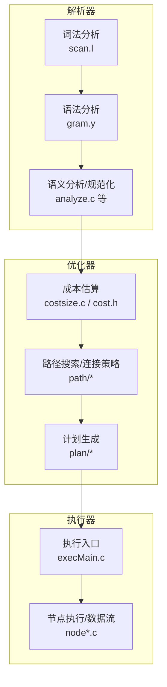
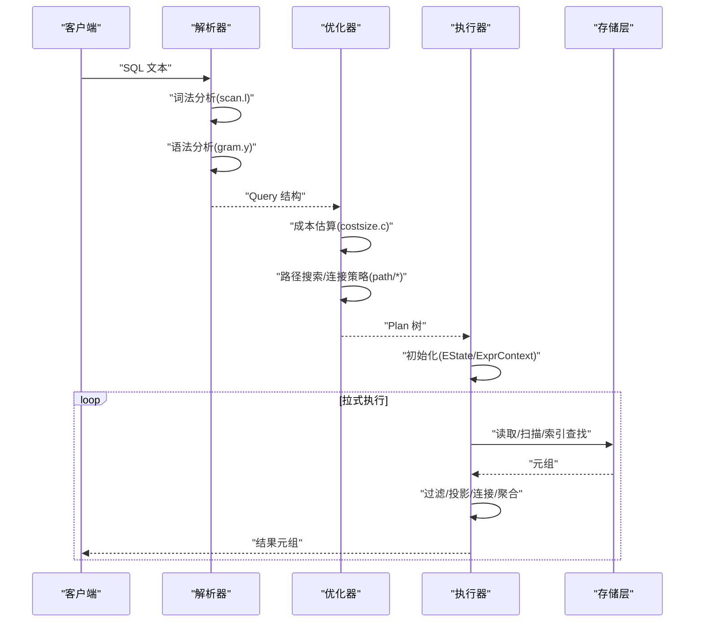
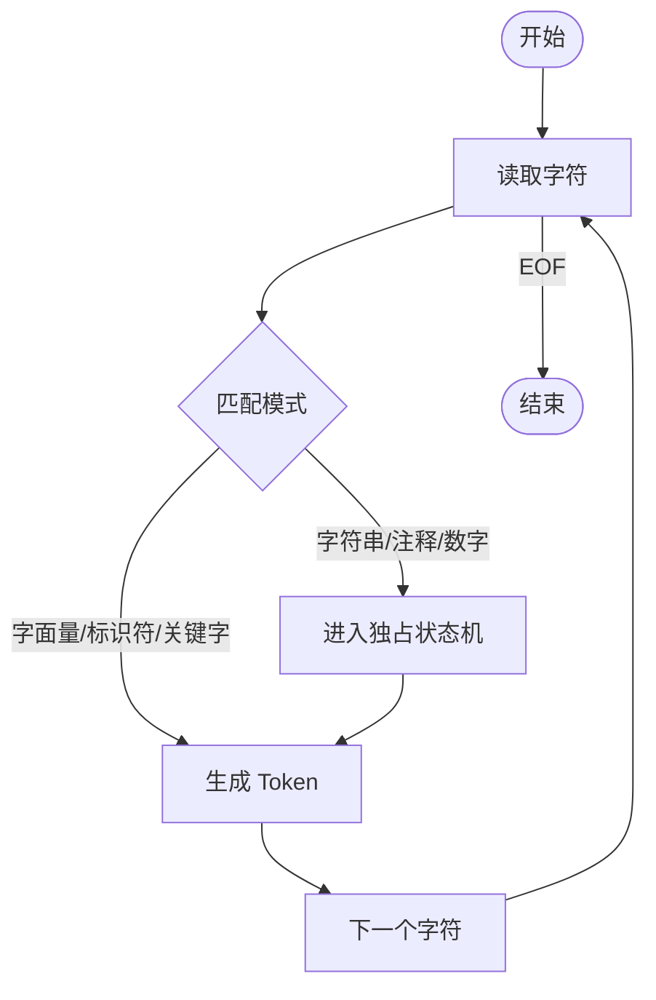
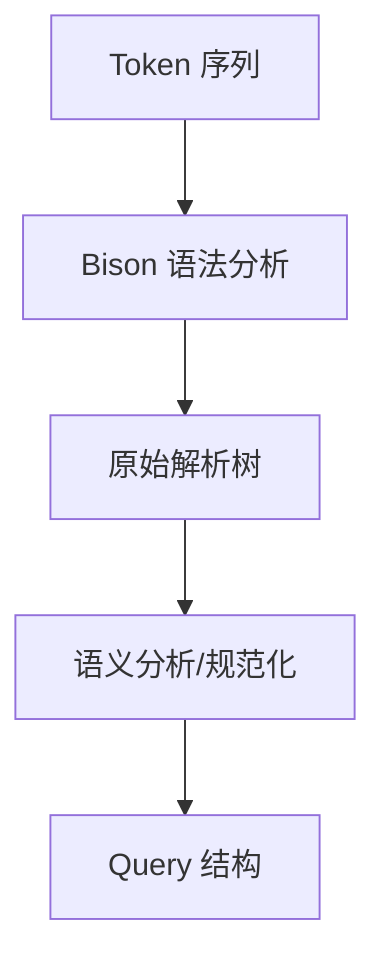
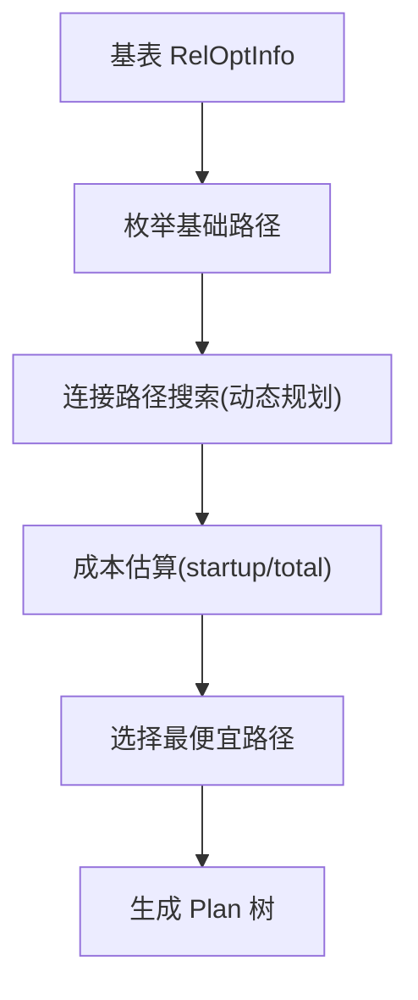
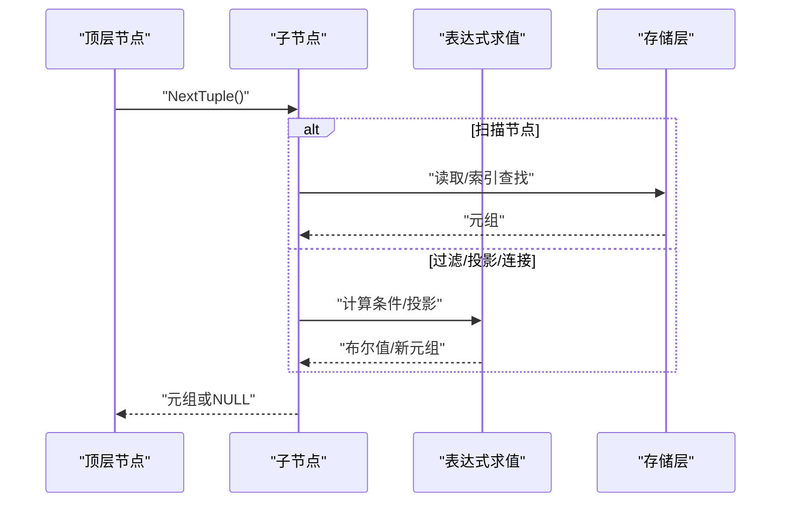
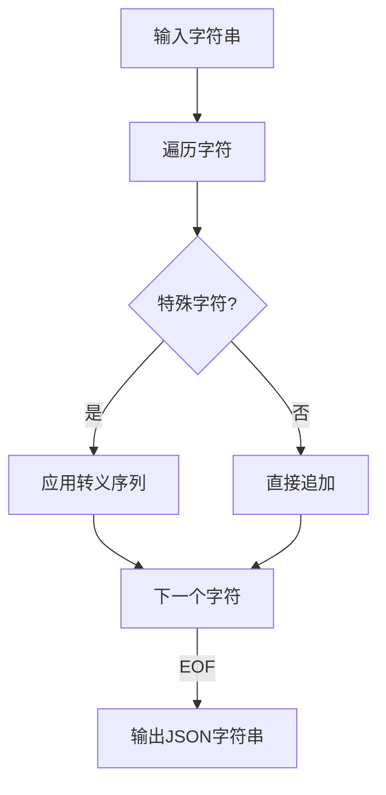
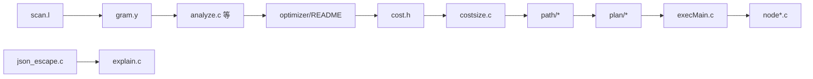

# 查询处理

<cite>
**本文引用的文件**
- [src/backend/parser/README](file://src/backend/parser/README)
- [src/backend/parser/scan.l](file://src/backend/parser/scan.l)
- [src/backend/parser/gram.y](file://src/backend/parser/gram.y)
- [src/backend/optimizer/README](file://src/backend/optimizer/README)
- [src/include/optimizer/cost.h](file://src/include/optimizer/cost.h)
- [src/backend/optimizer/path/costsize.c](file://src/backend/optimizer/path/costsize.c)
- [src/backend/executor/README](file://src/backend/executor/README)
- [src/backend/executor/execMain.c](file://src/backend/executor/execMain.c)
- [src/backend/utils/adt/json_escape.c](file://src/backend/utils/adt/json_escape.c)
- [src/include/utils/json.h](file://src/include/utils/json.h)
- [src/backend/commands/explain.c](file://src/backend/commands/explain.c)
</cite>

## 更新摘要
**所做更改**
- 移除了对已删除的JSON解析基础设施（jsonapi.c模块）的所有引用
- 更新了EXPLAIN FORMAT JSON输出部分，说明escape_json函数的独立实现
- 修正了JSON类型相关描述，反映系统已移除JSON/JSONB类型的事实
- 更新了依赖关系分析，反映新的模块化结构

## 目录
1. [简介](#简介)
2. [项目结构](#项目结构)
3. [核心组件](#核心组件)
4. [架构总览](#架构总览)
5. [详细组件分析](#详细组件分析)
6. [依赖关系分析](#依赖关系分析)
7. [性能考量](#性能考量)
8. [故障排查指南](#故障排查指南)
9. [结论](#结论)
10. [附录](#附录)

## 简介
本文件面向"查询处理系统"的完整实现，覆盖 SQL 解析器（词法分析、语法分析、语义分析）、查询优化器（成本估算、计划生成与优化规则）以及执行引擎（节点执行、数据流处理与结果返回）。文档以代码级视角梳理关键流程，提供流程图与架构图，并给出常见查询模式的优化建议与最佳实践。

**更新** 系统已移除JSON/JSONB类型支持，但保留了基本的JSON字符串转义功能用于EXPLAIN FORMAT JSON输出和备份清单生成。

## 项目结构
PostgreSQL 后端将查询处理划分为三大子系统：
- 解析器（parser）：负责将 SQL 文本切分为词法单元，构建语法树，并进行语义分析与规范化，最终产出 Query 结构供优化器使用。
- 优化器（optimizer）：基于统计信息与成本模型，在路径空间中进行动态规划搜索，选择最优执行路径，生成 Plan 树。
- 执行器（executor）：以拉式管道方式驱动 Plan 节点树，逐元组产生结果，支持参数化、重扫描、表达式求值等机制。

**图表来源**
- [src/backend/parser/README:1-33](file://src/backend/parser/README#L1-L33)
- [src/backend/optimizer/README:1-15](file://src/backend/optimizer/README#L1-L15)
- [src/backend/executor/README:1-12](file://src/backend/executor/README#L1-L12)

**章节来源**
- [src/backend/parser/README:1-33](file://src/backend/parser/README#L1-L33)
- [src/backend/optimizer/README:1-15](file://src/backend/optimizer/README#L1-L15)
- [src/backend/executor/README:1-12](file://src/backend/executor/README#L1-L12)

## 核心组件
- 词法分析器：将 SQL 字符串分解为 token，处理字符串字面量、转义、Unicode、十六进制等复杂场景，保证无回溯匹配以提升性能。
- 语法分析器：基于 Bison 规则将 token 序列转换为原始解析树（RawStmt/RawSelect），并维护位置信息以便错误定位。
- 语义分析：对解析树进行类型检查、函数/操作符解析、聚合/窗口函数处理、CTE 展开、目标列与条件子句构造等，输出可优化的 Query。
- 优化器：构建 RelOptInfo 与 Path 树，枚举顺序扫描、索引扫描、位图扫描、嵌套循环/合并/哈希连接等多种路径；通过等价类与路径键（PathKeys）推导排序与连接可行性；使用成本模型评估并选择最优路径，生成 Plan。
- 执行器：启动时创建 EState 与 ExprContext，按需求从顶层节点向下拉取元组；表达式编译为扁平步骤数组，支持解释执行与原生编译；支持重扫描、参数传递、并行收集等。

**更新** 系统已移除JSON/JSONB类型支持，但保留了独立的JSON字符串转义功能（escape_json）用于EXPLAIN FORMAT JSON输出和备份清单生成。

**章节来源**
- [src/backend/parser/README:1-33](file://src/backend/parser/README#L1-L33)
- [src/backend/optimizer/README:16-182](file://src/backend/optimizer/README#L16-L182)
- [src/backend/executor/README:47-114](file://src/backend/executor/README#L47-L114)

## 架构总览
下图展示从 SQL 到执行结果的端到端流程，涵盖解析、优化与执行的关键阶段。

**图表来源**
- [src/backend/parser/scan.l:1-200](file://src/backend/parser/scan.l#L1-L200)
- [src/backend/parser/gram.y:1-200](file://src/backend/parser/gram.y#L1-L200)
- [src/backend/optimizer/path/costsize.c:1-200](file://src/backend/optimizer/path/costsize.c#L1-L200)
- [src/backend/executor/execMain.c:91-130](file://src/backend/executor/execMain.c#L91-L130)

## 详细组件分析

### 解析器：词法分析
- 设计要点：
  - 无回溯匹配，提升解析速度。
  - 使用独占状态机处理引号字符串、扩展注释、十六进制、Unicode 转义等。
  - 位置追踪用于精确错误报告。
- 关键流程：
  - 输入缓冲 -> 模式匹配 -> 生成 token -> 传递给语法分析器。
- 复杂度：线性时间 O(n)，n 为输入长度。

**图表来源**
- [src/backend/parser/scan.l:1-200](file://src/backend/parser/scan.l#L1-L200)

**章节来源**
- [src/backend/parser/scan.l:1-200](file://src/backend/parser/scan.l#L1-L200)

### 解析器：语法分析与语义分析
- 语法分析：
  - 基于 Bison 规则将 token 序列规约为原始解析树，维护位置信息。
  - 避免在解析阶段访问数据库或依赖可变状态，确保多语句解析的正确性。
- 语义分析：
  - 将 RawStmt/RawSelect 转换为 Query，完成类型推断、函数/操作符解析、聚合与窗口函数处理、CTE 展开、目标列与条件子句构造等。
  - 输出供优化器使用的 Query 结构。

**图表来源**
- [src/backend/parser/gram.y:1-200](file://src/backend/parser/gram.y#L1-L200)
- [src/backend/parser/README:10-28](file://src/backend/parser/README#L10-L28)

**章节来源**
- [src/backend/parser/gram.y:1-200](file://src/backend/parser/gram.y#L1-L200)
- [src/backend/parser/README:10-28](file://src/backend/parser/README#L10-L28)

### 优化器：成本估算与计划生成
- 成本模型：
  - 基本成本参数包括顺序页成本、随机页成本、CPU 元组成本、算子成本、并行相关成本等。
  - 每个路径维护 startup_cost 与 total_cost，支持 LIMIT 等部分结果的成本插值。
- 路径搜索：
  - 为每个基表建立 RelOptInfo，枚举顺序扫描、索引扫描、位图扫描等基础路径。
  - 通过等价类（EquivalenceClass）与路径键（PathKey）推导连接与排序可行性。
  - 使用动态规划自底向上构建连接关系，考虑左/右/灌木形连接，选择最便宜路径。
- 计划生成：
  - 将最优 Path 树转换为 Plan 树，准备执行器所需的数据结构与表达式。

**图表来源**
- [src/backend/optimizer/README:16-182](file://src/backend/optimizer/README#L16-L182)
- [src/backend/optimizer/path/costsize.c:1-200](file://src/backend/optimizer/path/costsize.c#L1-L200)
- [src/include/optimizer/cost.h:21-66](file://src/include/optimizer/cost.h#L21-L66)

**章节来源**
- [src/backend/optimizer/README:16-182](file://src/backend/optimizer/README#L16-L182)
- [src/backend/optimizer/path/costsize.c:1-200](file://src/backend/optimizer/path/costsize.c#L1-L200)
- [src/include/optimizer/cost.h:21-66](file://src/include/optimizer/cost.h#L21-L66)

### 执行器：节点执行与数据流处理
- 执行模型：
  - 拉式管道：每个节点被调用时产生下一个元组或 NULL。
  - 状态树：Plan 树只读，执行期构建对应的状态树（PlanState），保存运行时状态。
  - 表达式求值：表达式编译为扁平步骤数组（ExprEvalStep），支持解释执行与原生编译。
- 控制流：
  - ExecutorStart：创建 EState、参数列表、每查询内存上下文。
  - ExecutorRun：递归调用 ExecProcNode，按需拉取元组。
  - ExecutorFinish/End：清理资源、触发后处理。
- 特性：
  - 支持重扫描（Rescan）与参数化路径（Parameterized Paths）。
  - 支持并行收集（Gather/GatherMerge）与增量排序等。

**图表来源**
- [src/backend/executor/README:47-114](file://src/backend/executor/README#L47-L114)
- [src/backend/executor/execMain.c:91-130](file://src/backend/executor/execMain.c#L91-L130)

**章节来源**
- [src/backend/executor/README:47-114](file://src/backend/executor/README#L47-L114)
- [src/backend/executor/execMain.c:91-130](file://src/backend/executor/execMain.c#L91-L130)

### EXPLAIN FORMAT JSON 输出
- JSON字符串转义：
  - 使用独立的escape_json()函数处理JSON字符串转义，该函数不依赖于已移除的JSON类型支持。
  - 支持标准JSON转义字符：退格(\b)、换页(\f)、换行(\n)、回车(\r)、制表符(\t)、双引号(\")、反斜杠(\\)。
  - 对控制字符使用\uXXXX格式进行转义。
- 应用场景：
  - EXPLAIN (FORMAT JSON) 命令输出
  - 备份清单（backup manifest）生成
  - 其他需要JSON格式输出的系统功能

**图表来源**
- [src/backend/utils/adt/json_escape.c:27-66](file://src/backend/utils/adt/json_escape.c#L27-L66)
- [src/backend/commands/explain.c:3694-3801](file://src/backend/commands/explain.c#L3694-L3801)

**章节来源**
- [src/backend/utils/adt/json_escape.c:1-66](file://src/backend/utils/adt/json_escape.c#L1-L66)
- [src/backend/commands/explain.c:3694-3801](file://src/backend/commands/explain.c#L3694-L3801)

## 依赖关系分析
- 解析器依赖：
  - scan.l 提供词法单元，gram.y 定义语法规则，analyze.c 等模块完成语义分析。
- 优化器依赖：
  - cost.h 声明成本估算接口，costsize.c 实现成本与大小估计，path/* 实现路径搜索与连接策略。
- 执行器依赖：
  - execMain.c 提供外部接口（ExecutorStart/Run/Finish/End），各 node*.c 实现具体节点逻辑。
- JSON支持依赖：
  - escape_json()函数独立实现，不依赖已移除的JSON类型支持。
  - 仅用于EXPLAIN FORMAT JSON输出和备份清单生成。

**图表来源**
- [src/backend/parser/README:10-28](file://src/backend/parser/README#L10-L28)
- [src/backend/optimizer/README:1-15](file://src/backend/optimizer/README#L1-L15)
- [src/include/optimizer/cost.h:21-66](file://src/include/optimizer/cost.h#L21-L66)
- [src/backend/executor/execMain.c:91-130](file://src/backend/executor/execMain.c#L91-L130)
- [src/backend/utils/adt/json_escape.c:1-66](file://src/backend/utils/adt/json_escape.c#L1-L66)

**章节来源**
- [src/backend/parser/README:10-28](file://src/backend/parser/README#L10-L28)
- [src/backend/optimizer/README:1-15](file://src/backend/optimizer/README#L1-L15)
- [src/include/optimizer/cost.h:21-66](file://src/include/optimizer/cost.h#L21-L66)
- [src/backend/executor/execMain.c:91-130](file://src/backend/executor/execMain.c#L91-L130)

## 性能考量
- 成本参数调优：
  - seq_page_cost、random_page_cost、cpu_tuple_cost、cpu_operator_cost、parallel_setup_cost 等直接影响路径选择。
  - effective_cache_size 影响缓存命中假设，进而影响索引与顺序扫描的成本权衡。
- 启用/禁用策略：
  - enable_seqscan、enable_indexscan、enable_hashjoin、enable_mergejoin、enable_sort 等开关可用于引导优化器探索不同计划。
- 限制与裁剪：
  - LIMIT/OFFSET 可通过 startup_cost 与 total_cost 插值评估部分结果成本。
  - 约束排除（constraint_exclusion）可在分区表上提前裁剪无关分支。
- 并行与内存：
  - parallel_workers_per_gather、work_mem 等影响并行度与工作集大小，需结合硬件与负载调优。

**章节来源**
- [src/include/optimizer/cost.h:21-66](file://src/include/optimizer/cost.h#L21-L66)
- [src/backend/optimizer/path/costsize.c:1-200](file://src/backend/optimizer/path/costsize.c#L1-L200)

## 故障排查指南
- 解析错误：
  - 利用 gram.y 的位置追踪能力定位词法/语法错误位置。
  - 检查 scan.l 的独占状态机是否正确处理字符串与注释边界。
- 优化异常：
  - 若出现非预期计划，检查成本参数与统计信息是否准确；必要时调整 enable_* 开关观察计划变化。
  - 关注等价类与路径键推导是否合理，尤其是 ORDER BY 与连接条件的排序一致性。
- 执行问题：
  - 确认 ExecutorStart/Run/Finish/End 调用顺序正确，避免资源泄漏。
  - 检查表达式求值步骤（ExprEvalStep）是否正确初始化与跳转；必要时启用调试输出。
  - 对于 UPDATE/DELETE 的并发冲突，理解 EvalPlanQual 的重试机制与快照一致性要求。
- JSON输出问题：
  - 检查escape_json()函数是否正确处理特殊字符转义。
  - 验证EXPLAIN FORMAT JSON输出是否符合JSON规范。

**章节来源**
- [src/backend/parser/gram.y:65-108](file://src/backend/parser/gram.y#L65-L108)
- [src/backend/executor/README:245-283](file://src/backend/executor/README#L245-L283)
- [src/backend/executor/execMain.c:91-130](file://src/backend/executor/execMain.c#L91-L130)

## 结论
本系统通过清晰的三阶段流水线（解析-优化-执行）实现了高效可靠的查询处理。解析器确保 SQL 的准确解析与语义规范化；优化器基于成本模型与动态规划搜索生成最优计划；执行器以拉式管道驱动节点树，支持丰富的执行特性与内存管理。通过合理调优成本参数与启用策略，可显著提升复杂查询的性能与稳定性。

**更新** 系统已移除JSON/JSONB类型支持，但保留了必要的JSON字符串转义功能，确保EXPLAIN FORMAT JSON输出和备份清单生成的正常工作。

## 附录
- 常见查询模式优化建议：
  - 单表高选择性过滤：优先使用索引扫描或位图扫描；确保 WHERE 条件与索引前缀匹配。
  - 多表连接：尽量提供连接谓词，使优化器能选择合并/哈希连接；必要时添加合适索引以减少嵌套循环代价。
  - 排序与去重：若存在有序索引，可减少显式排序；DISTINCT 可通过哈希或排序实现，依据数据分布选择。
  - 聚合与窗口函数：确保 GROUP BY/ORDER BY 与可用排序一致，减少额外排序开销。
  - 子查询与 CTE：简单子查询可被提升为主查询的一部分，扩大优化空间；复杂聚合/分组子查询保持独立以避免过度膨胀。
- 性能分析工具使用：
  - EXPLAIN/EXPLAIN ANALYZE：查看计划树与实际执行统计，识别瓶颈节点。
  - EXPLAIN (FORMAT JSON)：获取结构化JSON格式的执行计划，便于程序化处理。
  - 成本参数监控：对比实际 I/O/CPU 与估算成本，校准 effective_cache_size 与页面成本。
  - 统计信息更新：定期 ANALYZE 以改善基数估计，提高计划质量。

[本节为通用指导，不直接分析具体文件]