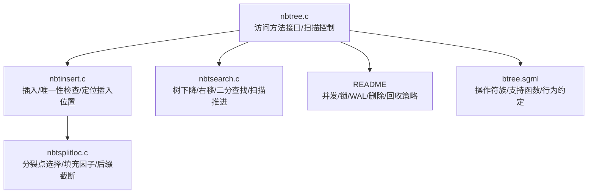
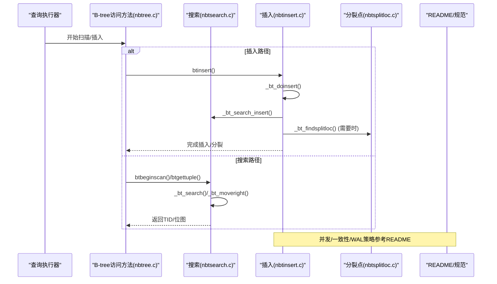
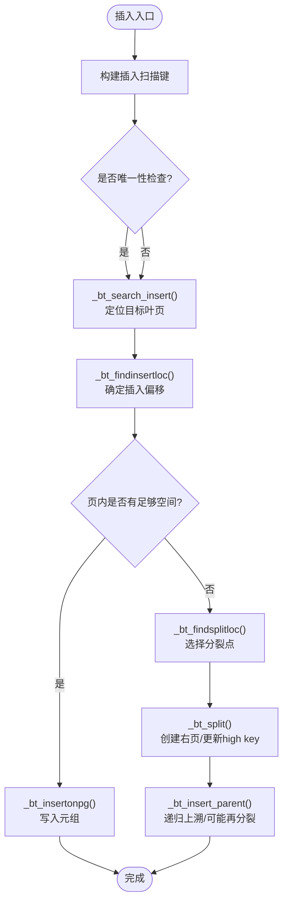
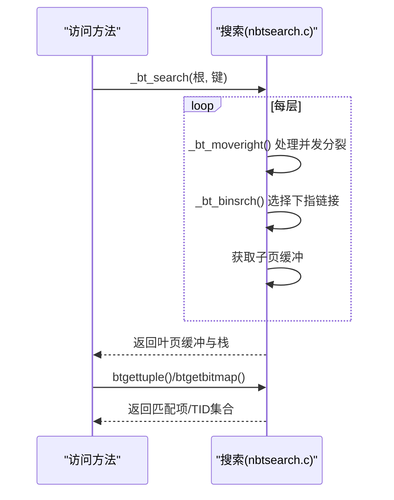
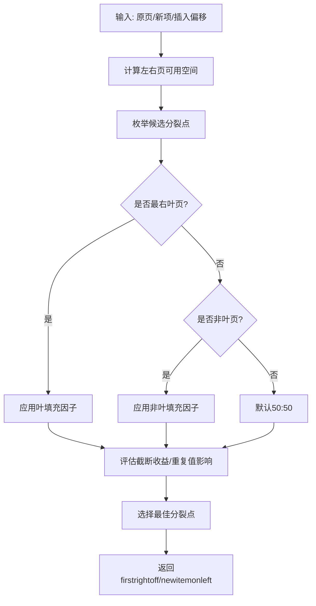
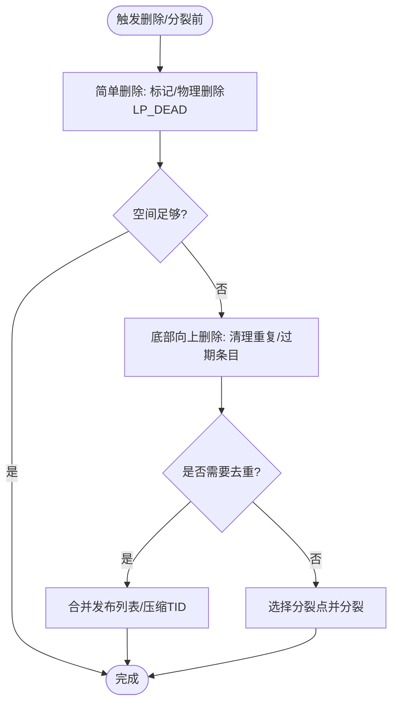
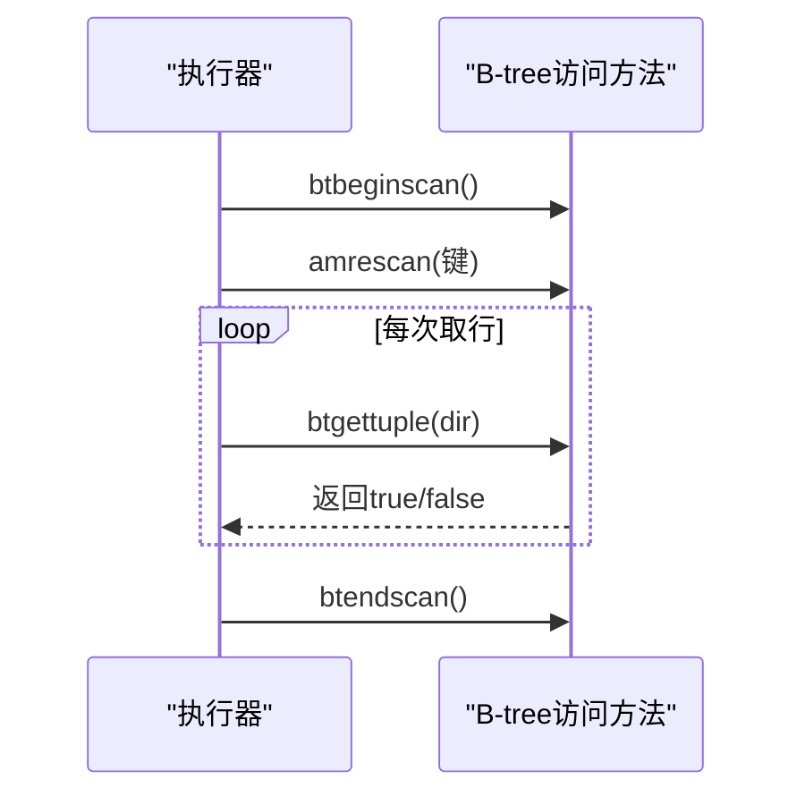
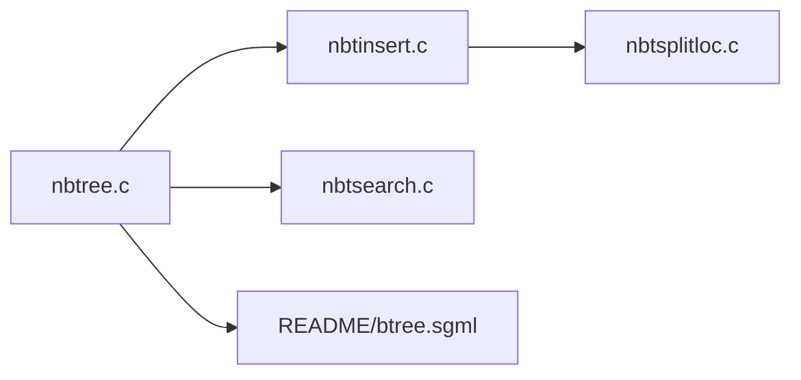

# B-tree索引

<cite>
**本文引用的文件**
- [nbtree.c](file://src/backend/access/nbtree/nbtree.c)
- [nbtinsert.c](file://src/backend/access/nbtree/nbtinsert.c)
- [nbtsearch.c](file://src/backend/access/nbtree/nbtsearch.c)
- [nbtsplitloc.c](file://src/backend/access/nbtree/nbtsplitloc.c)
- [README](file://src/backend/access/nbtree/README)
- [btree.sgml](file://doc/src/sgml/btree.sgml)
</cite>

## 目录
1. [简介](#简介)
2. [项目结构](#项目结构)
3. [核心组件](#核心组件)
4. [架构总览](#架构总览)
5. [详细组件分析](#详细组件分析)
6. [依赖关系分析](#依赖关系分析)
7. [性能考量](#性能考量)
8. [故障排查指南](#故障排查指南)
9. [结论](#结论)
10. [附录](#附录)

## 简介
本文件面向Mini PostgreSQL中的B-tree索引子系统，系统性阐述其数据结构、节点组织、键值排序与平衡机制；深入说明插入、搜索、删除算法的实现要点（页分裂、合并、去重等）；总结性能特性、索引维护策略与查询优化方式；并通过代码级流程图与时序图展示内部工作原理及与查询执行器的集成。同时解释B-tree在关系型数据库中的关键作用以及本实现的工程特点。

## 项目结构
B-tree索引实现位于后端访问层 nbtree 子目录，围绕“元数据页+内部页+叶页”的层级结构组织，提供插入、搜索、扫描、分裂点选择、WAL记录、验证与工具函数等模块。文档与规范由 doc/src/sgml/btree.sgml 描述，nbtree/README 给出更深入的内部设计说明。

图表来源
- [nbtree.c:94-144](file://src/backend/access/nbtree/nbtree.c#L94-L144)
- [nbtinsert.c:98-273](file://src/backend/access/nbtree/nbtinsert.c#L98-L273)
- [nbtsearch.c:101-204](file://src/backend/access/nbtree/nbtsearch.c#L101-L204)
- [nbtsplitloc.c:129-429](file://src/backend/access/nbtree/nbtsplitloc.c#L129-L429)
- [README:14-165](file://src/backend/access/nbtree/README#L14-L165)
- [btree.sgml:11-203](file://doc/src/sgml/btree.sgml#L11-L203)

章节来源
- [nbtree.c:94-144](file://src/backend/access/nbtree/nbtree.c#L94-L144)
- [README:14-165](file://src/backend/access/nbtree/README#L14-L165)
- [btree.sgml:11-203](file://doc/src/sgml/btree.sgml#L11-L203)

## 核心组件
- 访问方法与扫描控制：注册B-tree访问方法回调（构建、插入、批量删除、清理、开始/继续/结束扫描、并行扫描等），管理扫描状态与内存。
- 插入流程：构造索引元组、唯一性检查、定位插入位置、必要时触发分裂与父级更新。
- 搜索与扫描：从根页下降、处理并发分裂导致的“右移”、页内二分查找、按条件推进扫描并返回TID或位图。
- 分裂点选择：基于可用空间、填充因子、重复值分布与后缀截断收益，计算最优分裂点，保证左右页均衡与高扇出。
- 并发与一致性：遵循Lehman & Yao算法，使用右指针与high key检测并发分裂；WAL保障崩溃恢复；VACUUM与底部向上删除协同维护健康度。
- 操作符族与支持函数：要求定义比较、范围、相等图像等操作，确保排序一致性与去重安全。

章节来源
- [nbtree.c:94-144](file://src/backend/access/nbtree/nbtree.c#L94-L144)
- [nbtinsert.c:98-273](file://src/backend/access/nbtree/nbtinsert.c#L98-L273)
- [nbtsearch.c:101-204](file://src/backend/access/nbtree/nbtsearch.c#L101-L204)
- [nbtsplitloc.c:129-429](file://src/backend/access/nbtree/nbtsplitloc.c#L129-L429)
- [README:14-165](file://src/backend/access/nbtree/README#L14-L165)
- [btree.sgml:205-587](file://doc/src/sgml/btree.sgml#L205-L587)

## 架构总览
B-tree索引以元数据页为入口，维护真根与“快速根”指针；内部页存储枢轴元组与下指链接；叶页存储指向堆行的TID或发布列表。插入时可能自底向上分裂并更新父级；搜索时通过high key与右指针处理并发分裂；删除采用简单删除与底部向上删除结合，配合VACUUM回收页面。

图表来源
- [nbtree.c:185-204](file://src/backend/access/nbtree/nbtree.c#L185-L204)
- [nbtinsert.c:98-273](file://src/backend/access/nbtree/nbtinsert.c#L98-L273)
- [nbtsearch.c:101-204](file://src/backend/access/nbtree/nbtsearch.c#L101-L204)
- [nbtsplitloc.c:129-429](file://src/backend/access/nbtree/nbtsplitloc.c#L129-L429)
- [README:14-165](file://src/backend/access/nbtree/README#L14-L165)

## 详细组件分析

### 插入算法与页分裂
- 入口与唯一性检查：btinsert()组装索引元组后调用_bt_doinsert()进行唯一性校验与冲突等待，必要时跳过或报错。
- 定位插入位置：_bt_search_insert()优先尝试“最右叶页缓存”的快速路径；否则从根下降并锁定目标叶页。
- 插入与分裂：_bt_findinsertloc()确定插入偏移；若空间不足则调用_split()与父级插入；分裂点由_nbtsplitloc.c的选择逻辑决定，考虑填充因子、重复值与后缀截断。
- WAL与恢复：分裂涉及多步原子记录，缺失下指链接会在后续插入中补全。

图表来源
- [nbtinsert.c:98-273](file://src/backend/access/nbtree/nbtinsert.c#L98-L273)
- [nbtinsert.c:313-379](file://src/backend/access/nbtree/nbtinsert.c#L313-L379)
- [nbtsplitloc.c:129-429](file://src/backend/access/nbtree/nbtsplitloc.c#L129-L429)
- [README:592-659](file://src/backend/access/nbtree/README#L592-L659)

章节来源
- [nbtinsert.c:98-273](file://src/backend/access/nbtree/nbtinsert.c#L98-L273)
- [nbtinsert.c:313-379](file://src/backend/access/nbtree/nbtinsert.c#L313-L379)
- [nbtsplitloc.c:129-429](file://src/backend/access/nbtree/nbtsplitloc.c#L129-L429)
- [README:592-659](file://src/backend/access/nbtree/README#L592-L659)

### 搜索与扫描
- 下降与右移：_bt_search()从根页逐级下降，遇到并发分裂时使用_bt_moveright()沿右指针移动，直到找到包含目标范围的页。
- 页内二分：_bt_binsrch()在内部页与叶页分别返回合适的偏移，用于选择子页或起始项。
- 扫描推进：btgettuple()/btgetbitmap()负责按方向推进、处理数组键、收集TID或位图，并在MVCC快照下释放pin以降低阻塞。

图表来源
- [nbtsearch.c:101-204](file://src/backend/access/nbtree/nbtsearch.c#L101-L204)
- [nbtsearch.c:241-321](file://src/backend/access/nbtree/nbtsearch.c#L241-L321)
- [nbtsearch.c:343-423](file://src/backend/access/nbtree/nbtsearch.c#L343-L423)
- [nbtree.c:209-278](file://src/backend/access/nbtree/nbtree.c#L209-L278)

章节来源
- [nbtsearch.c:101-204](file://src/backend/access/nbtree/nbtsearch.c#L101-L204)
- [nbtsearch.c:241-321](file://src/backend/access/nbtree/nbtsearch.c#L241-L321)
- [nbtsearch.c:343-423](file://src/backend/access/nbtree/nbtsearch.c#L343-L423)
- [nbtree.c:209-278](file://src/backend/access/nbtree/nbtree.c#L209-L278)

### 分裂点选择与平衡机制
- 目标：使分裂后左右页可用空间均衡，兼顾填充因子、重复值分布与后缀截断收益。
- 策略：默认策略优先考虑空间均衡与可截断属性；当存在大量重复值时切换到“多重复值”或“单值”策略，避免不必要的heap TID追加。
- 特殊优化：最右叶页与非最右叶页的填充因子应用不同；“新项之后分裂”优化针对局部单调递增插入模式。

图表来源
- [nbtsplitloc.c:129-429](file://src/backend/access/nbtree/nbtsplitloc.c#L129-L429)
- [nbtsplitloc.c:449-560](file://src/backend/access/nbtree/nbtsplitloc.c#L449-L560)
- [nbtsplitloc.c:566-606](file://src/backend/access/nbtree/nbtsplitloc.c#L566-L606)
- [nbtsplitloc.c:635-745](file://src/backend/access/nbtree/nbtsplitloc.c#L635-L745)

章节来源
- [nbtsplitloc.c:129-429](file://src/backend/access/nbtree/nbtsplitloc.c#L129-L429)
- [nbtsplitloc.c:449-560](file://src/backend/access/nbtree/nbtsplitloc.c#L449-L560)
- [nbtsplitloc.c:566-606](file://src/backend/access/nbtree/nbtsplitloc.c#L566-L606)
- [nbtsplitloc.c:635-745](file://src/backend/access/nbtree/nbtsplitloc.c#L635-L745)

### 删除与维护（底部向上删除与去重）
- 简单删除：标记LP_DEAD并在插入前尝试物理删除，减少页分裂压力。
- 底部向上删除：在预期版本膨胀导致分裂时主动清理同页重复/过期条目，避免不必要分裂。
- 去重：将重复键的多个TID聚合成发布列表，降低存储与查询开销；构建/重建索引时直接生成发布列表。
- VACUUM与FSM：页面删除分阶段进行，延迟回收至空闲空间映射表，保证并发扫描正确性。

图表来源
- [README:475-527](file://src/backend/access/nbtree/README#L475-L527)
- [README:528-591](file://src/backend/access/nbtree/README#L528-L591)
- [btree.sgml:631-733](file://doc/src/sgml/btree.sgml#L631-L733)
- [btree.sgml:735-800](file://doc/src/sgml/btree.sgml#L735-L800)

章节来源
- [README:475-527](file://src/backend/access/nbtree/README#L475-L527)
- [README:528-591](file://src/backend/access/nbtree/README#L528-L591)
- [btree.sgml:631-733](file://doc/src/sgml/btree.sgml#L631-L733)
- [btree.sgml:735-800](file://doc/src/sgml/btree.sgml#L735-L800)

### 与查询执行器的集成
- 扫描生命周期：ambeginscan/amrescan/amgettuple/amendscan管理扫描上下文、键预处理、数组键推进与结果返回。
- 位图扫描：btgetbitmap()批量收集TID供上层BitmapAnd/BitmapOr组合。
- 并行扫描：共享BTParallelScanDescData协调多进程推进扫描页，避免重复工作。

图表来源
- [nbtree.c:94-144](file://src/backend/access/nbtree/nbtree.c#L94-L144)
- [nbtree.c:209-278](file://src/backend/access/nbtree/nbtree.c#L209-L278)
- [nbtree.c:281-336](file://src/backend/access/nbtree/nbtree.c#L281-L336)
- [nbtree.c:339-478](file://src/backend/access/nbtree/nbtree.c#L339-L478)

章节来源
- [nbtree.c:94-144](file://src/backend/access/nbtree/nbtree.c#L94-L144)
- [nbtree.c:209-278](file://src/backend/access/nbtree/nbtree.c#L209-L278)
- [nbtree.c:281-336](file://src/backend/access/nbtree/nbtree.c#L281-L336)
- [nbtree.c:339-478](file://src/backend/access/nbtree/nbtree.c#L339-L478)

## 依赖关系分析
- 模块耦合：nbtree.c作为访问方法门面，依赖nbtinsert.c、nbtsearch.c、nbtsplitloc.c；这些模块共同遵守README描述的并发与一致性约定。
- 外部依赖：存储层缓冲/锁、WAL、事务系统、统计与进度、索引FMS等。
- 循环依赖：无直接循环；通过统一头文件与接口解耦。

图表来源
- [nbtree.c:94-144](file://src/backend/access/nbtree/nbtree.c#L94-L144)
- [nbtinsert.c:98-273](file://src/backend/access/nbtree/nbtinsert.c#L98-L273)
- [nbtsearch.c:101-204](file://src/backend/access/nbtree/nbtsearch.c#L101-L204)
- [nbtsplitloc.c:129-429](file://src/backend/access/nbtree/nbtsplitloc.c#L129-L429)

章节来源
- [nbtree.c:94-144](file://src/backend/access/nbtree/nbtree.c#L94-L144)
- [nbtinsert.c:98-273](file://src/backend/access/nbtree/nbtinsert.c#L98-L273)
- [nbtsearch.c:101-204](file://src/backend/access/nbtree/nbtsearch.c#L101-L204)
- [nbtsplitloc.c:129-429](file://src/backend/access/nbtree/nbtsplitloc.c#L129-L429)

## 性能考量
- 快速路径插入：缓存最右叶页，避免重复下降树。
- 高效分裂点选择：利用填充因子与重复值分布，最大化扇出与空间利用率。
- 扫描优化：MVCC快照下尽早释放pin；数组键与发布列表减少重复访问。
- 维护成本：底部向上删除与去重降低分裂频率与存储膨胀；VACUUM与FSM协同回收页面。
- 并发控制：基于right-link与high key的检测，读路径无需强锁；写路径保守加锁保证一致性。

[本节为通用指导，不直接分析具体文件]

## 故障排查指南
- 唯一性冲突：插入时检测到重复键会抛出约束错误；注意NULL语义与部分检查路径。
- 并发分裂导致的右移：搜索过程中若发现high key小于扫描键，需沿右指针移动；若仍失败，检查不完整分裂标志并完成分裂。
- 页面不可用/已删除：向后扫描时需处理左兄弟被分裂或删除的情况，按算法回退并重试。
- WAL恢复：缺失下指链接会在下次插入时补全；若频繁出现，检查异常中断与磁盘空间。

章节来源
- [nbtinsert.c:404-769](file://src/backend/access/nbtree/nbtinsert.c#L404-L769)
- [nbtsearch.c:241-321](file://src/backend/access/nbtree/nbtsearch.c#L241-L321)
- [README:659-744](file://src/backend/access/nbtree/README#L659-L744)

## 结论
Mini PostgreSQL的B-tree索引实现了标准的多路平衡树结构，具备高并发、可扩展与高性能的特点。通过严格的排序约定、高效的分裂点选择、底部向上删除与去重机制，以及与查询执行器的紧密集成，能够在复杂读写负载下保持稳定的吞吐与低延迟。该实现遵循PostgreSQL的设计哲学，强调一致性、可恢复性与可维护性，适合在关系型数据库中承担广泛的索引职责。

[本节为总结性内容，不直接分析具体文件]

## 附录
- 操作符族与支持函数：必须提供order/in_range/equalimage/options等支持函数，确保排序一致性与去重安全。
- 元数据页与根指针：元数据页保存真根与快速根，优化短路径访问。
- 并发模型：基于Lehman & Yao的右指针与high key机制，读路径无锁或弱锁，写路径保守加锁。
- 维护策略：简单删除、底部向上删除、去重与VACUUM协作，维持索引健康。

章节来源
- [btree.sgml:205-587](file://doc/src/sgml/btree.sgml#L205-L587)
- [README:745-769](file://src/backend/access/nbtree/README#L745-L769)
- [README:396-449](file://src/backend/access/nbtree/README#L396-L449)