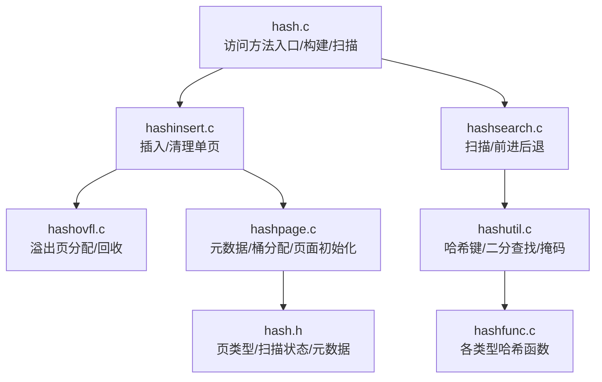
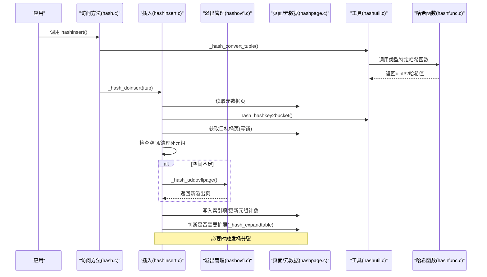
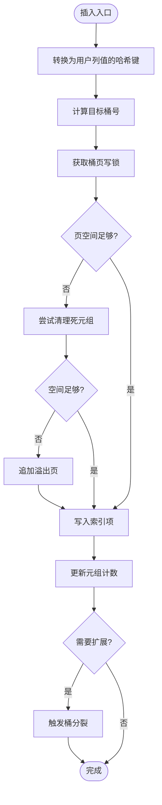
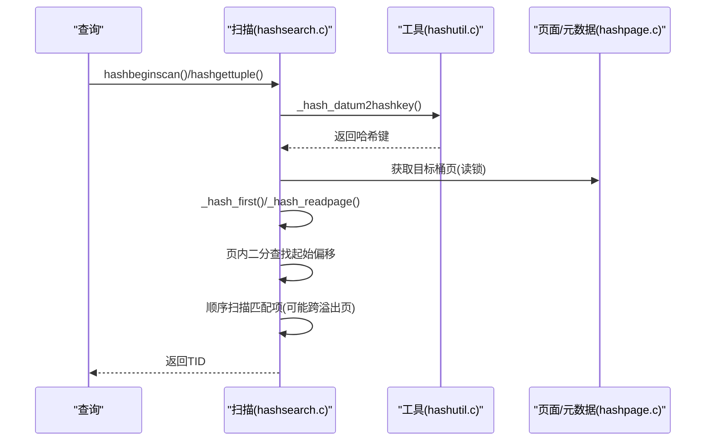
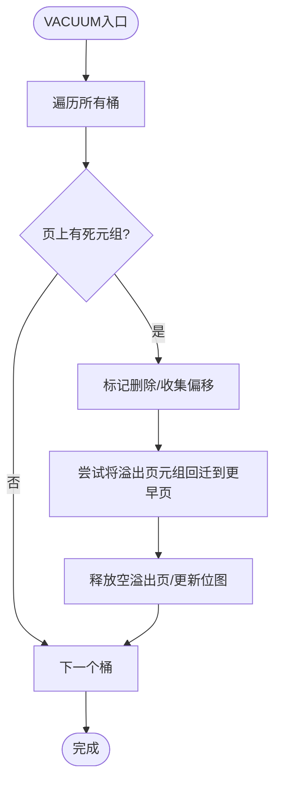
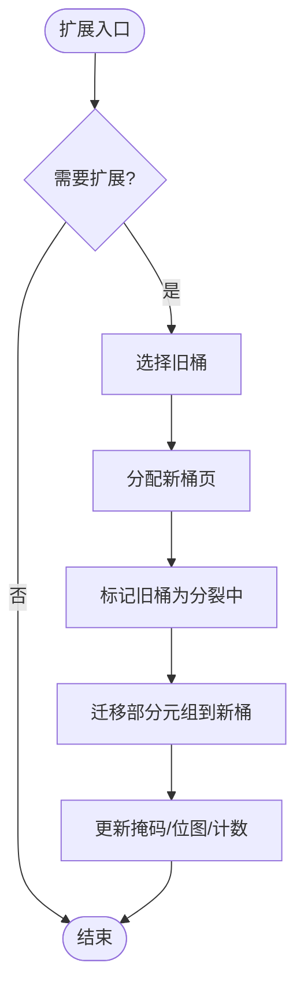
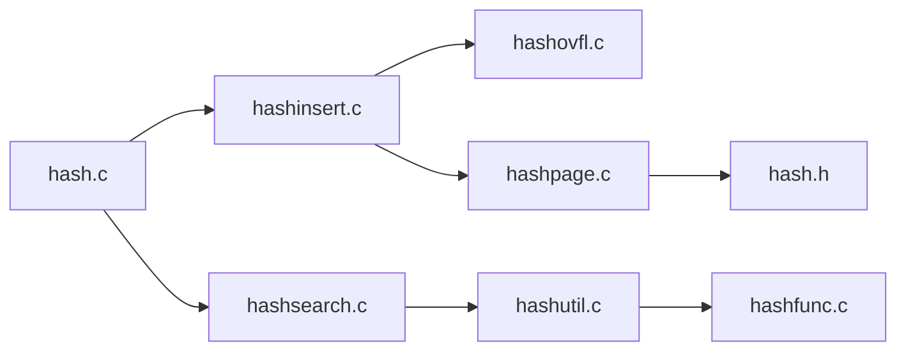

# 哈希索引

<cite>
**本文引用的文件**
- [hash.c](file://src/backend/access/hash/hash.c)
- [hashinsert.c](file://src/backend/access/hash/hashinsert.c)
- [hashsearch.c](file://src/backend/access/hash/hashsearch.c)
- [hashovfl.c](file://src/backend/access/hash/hashovfl.c)
- [hashpage.c](file://src/backend/access/hash/hashpage.c)
- [hashutil.c](file://src/backend/access/hash/hashutil.c)
- [hashfunc.c](file://src/backend/access/hash/hashfunc.c)
- [hash.h](file://src/include/access/hash.h)
- [hash.sgml](file://doc/src/sgml/hash.sgml)
</cite>

## 目录
1. [简介](#简介)
2. [项目结构](#项目结构)
3. [核心组件](#核心组件)
4. [架构总览](#架构总览)
5. [详细组件分析](#详细组件分析)
6. [依赖关系分析](#依赖关系分析)
7. [性能考量](#性能考量)
8. [故障排查指南](#故障排查指南)
9. [结论](#结论)
10. [附录](#附录)

## 简介
本文件面向Mini PostgreSQL中的哈希索引子系统，系统性阐述其数据结构、桶组织、冲突解决与动态扩展机制；深入说明插入、查找、删除的实现路径（含哈希函数选择、溢出处理、桶分裂）；总结性能特性、适用场景与限制条件；并结合查询优化器集成给出使用建议。文档以源码为依据，提供代码级流程图与时序图，帮助读者从实现层面理解哈希索引在Mini PostgreSQL中的定位与最佳实践。

## 项目结构
哈希索引的核心实现在后端访问方法层：
- 访问方法接口与构建/扫描入口：hash.c
- 插入与批量插入：hashinsert.c
- 扫描与定位：hashsearch.c
- 溢出页管理与回收：hashovfl.c
- 页面初始化、元数据与桶分配：hashpage.c
- 工具函数（哈希键计算、二分查找、掩码等）：hashutil.c
- 数据类型专用哈希函数：hashfunc.c
- 公共头文件（页类型、扫描状态、元数据定义）：hash.h
- 官方文档说明（性能、实现要点）：hash.sgml

图表来源
- [hash.c:55-105](file://src/backend/access/hash/hash.c#L55-L105)
- [hashinsert.c:35-254](file://src/backend/access/hash/hashinsert.c#L35-L254)
- [hashsearch.c:291-439](file://src/backend/access/hash/hashsearch.c#L291-L439)
- [hashovfl.c:110-439](file://src/backend/access/hash/hashovfl.c#L110-L439)
- [hashpage.c:325-491](file://src/backend/access/hash/hashpage.c#L325-L491)
- [hashutil.c:76-136](file://src/backend/access/hash/hashutil.c#L76-L136)
- [hashfunc.c:46-370](file://src/backend/access/hash/hashfunc.c#L46-L370)
- [hash.h:31-100](file://src/include/access/hash.h#L31-L100)

章节来源
- [hash.c:55-105](file://src/backend/access/hash/hash.c#L55-L105)
- [hash.h:31-100](file://src/include/access/hash.h#L31-L100)

## 核心组件
- 元数据页（Meta Page）：维护最大桶号、高低掩码、溢出位图指针、填充因子、哈希函数OID等。
- 桶页（Bucket Page）：每个桶的主页，按哈希键有序存放索引项；支持双向链表链接溢出页。
- 溢出页（Overflow Page）：当桶主页空间不足时追加的链式页，用于容纳同桶冲突项。
- 位图页（Bitmap Page）：记录可复用溢出页的位图，支持快速分配与回收。
- 扫描状态：保存当前页、前后页、命中项缓存、是否处于分裂中桶的扫描等。

关键数据结构与常量
- 页类型标志：LH_BUCKET_PAGE、LH_OVERFLOW_PAGE、LH_META_PAGE、LH_BITMAP_PAGE
- 桶到块号映射：BUCKET_TO_BLKNO(metap, B)
- 掩码与桶号计算：highmask/lowmask决定桶号映射，支持增量扩展

章节来源
- [hashpage.c:325-491](file://src/backend/access/hash/hashpage.c#L325-L491)
- [hash.h:31-100](file://src/include/access/hash.h#L31-L100)

## 架构总览
哈希索引采用“桶+溢出链”的持久化哈希表设计，支持在线增量扩展（split）。插入时根据哈希键定位桶并写入，若空间不足则追加溢出页；当元数据记录的索引元组数超过阈值触发扩展，选择一个旧桶分裂为新旧两个桶，迁移部分元组，更新掩码与位图。

图表来源
- [hash.c:243-269](file://src/backend/access/hash/hash.c#L243-L269)
- [hashinsert.c:35-254](file://src/backend/access/hash/hashinsert.c#L35-L254)
- [hashovfl.c:110-439](file://src/backend/access/hash/hashovfl.c#L110-L439)
- [hashpage.c:612-800](file://src/backend/access/hash/hashpage.c#L612-L800)
- [hashutil.c:76-136](file://src/backend/access/hash/hashutil.c#L76-L136)
- [hashfunc.c:46-370](file://src/backend/access/hash/hashfunc.c#L46-L370)

## 详细组件分析

### 数据结构与桶组织
- 元数据页包含：
  - 最大桶号、高低掩码（控制桶号映射）
  - 溢出位图数组指针与大小
  - 填充因子（ffactor），用于触发扩展
  - 哈希函数OID
- 桶页与溢出页通过prev/next块号形成双向链表，便于向前/向后扫描。
- 位图页记录哪些溢出页可用，支持快速分配与回收。

复杂度与特性
- 桶号映射时间复杂度O(1)，基于位运算与掩码。
- 桶内项按哈希键有序，便于二分查找与范围扫描（尽管哈希索引主要用于等值查询）。

章节来源
- [hashpage.c:496-589](file://src/backend/access/hash/hashpage.c#L496-L589)
- [hash.h:31-100](file://src/include/access/hash.h#L31-L100)

### 插入流程与溢出处理
- 转换用户值为哈希键（_hash_convert_tuple -> _hash_datum2hashkey）。
- 计算目标桶号（_hash_hashkey2bucket）。
- 获取桶页写锁，若空间不足：
  - 尝试清理死元组释放空间
  - 若无溢出页或溢出页仍不足，则追加溢出页（_hash_addovflpage）
- 写入索引项，更新元数据元组计数。
- 若超过阈值，触发扩展（_hash_expandtable）。

图表来源
- [hashinsert.c:35-254](file://src/backend/access/hash/hashinsert.c#L35-L254)
- [hashovfl.c:110-439](file://src/backend/access/hash/hashovfl.c#L110-L439)
- [hashpage.c:612-800](file://src/backend/access/hash/hashpage.c#L612-L800)

章节来源
- [hashinsert.c:35-254](file://src/backend/access/hash/hashinsert.c#L35-L254)
- [hashovfl.c:110-439](file://src/backend/access/hash/hashovfl.c#L110-L439)

### 查找与扫描
- 仅支持等值查询（策略HTEqualStrategyNumber），不支持全索引扫描。
- 扫描开始：
  - 计算哈希键，定位桶页
  - 若桶正在被填充（分裂过程中），需同时持有分裂前桶的pin，保证一致性
  - 支持正向/反向扫描，利用页内有序性与溢出链遍历
- 每页内使用二分查找定位起始位置，然后顺序扫描匹配项。

图表来源
- [hashsearch.c:291-439](file://src/backend/access/hash/hashsearch.c#L291-L439)
- [hashsearch.c:451-601](file://src/backend/access/hash/hashsearch.c#L451-L601)
- [hashutil.c:76-136](file://src/backend/access/hash/hashutil.c#L76-L136)

章节来源
- [hashsearch.c:291-439](file://src/backend/access/hash/hashsearch.c#L291-L439)
- [hashsearch.c:451-601](file://src/backend/access/hash/hashsearch.c#L451-L601)

### 删除与VACUUM
- 删除标记为LP_DEAD，由扫描或VACUUM后续清理。
- VACUUM对桶进行清理，支持“挤压”操作将溢出页上的元组回迁到更早的桶页，从而释放溢出页。
- 清理过程中维护锁链以避免并发扫描看到重复或缺失项。

图表来源
- [hash.c:454-633](file://src/backend/access/hash/hash.c#L454-L633)
- [hashovfl.c:488-730](file://src/backend/access/hash/hashovfl.c#L488-L730)

章节来源
- [hash.c:454-633](file://src/backend/access/hash/hash.c#L454-L633)
- [hashovfl.c:488-730](file://src/backend/access/hash/hashovfl.c#L488-L730)

### 动态扩展（桶分裂）
- 触发条件：元组计数 > ffactor * (maxbucket + 1)。
- 分裂过程：
  - 选择旧桶（old_bucket = maxbucket & lowmask），创建新桶（new_bucket = old_bucket | (lowmask + 1)）
  - 分配新桶页，标记旧桶为“正在分裂”，迁移部分元组到新桶
  - 更新元数据掩码与溢出位图
  - 扫描期间需处理“正在填充”的新桶与“正在分裂”的旧桶，确保一致性

图表来源
- [hashpage.c:612-800](file://src/backend/access/hash/hashpage.c#L612-L800)
- [hashinsert.c:248-254](file://src/backend/access/hash/hashinsert.c#L248-L254)

章节来源
- [hashpage.c:612-800](file://src/backend/access/hash/hashpage.c#L612-L800)
- [hashinsert.c:248-254](file://src/backend/access/hash/hashinsert.c#L248-L254)

### 哈希函数与键计算
- 通过opclass注册的类型特定哈希函数计算32位哈希值。
- 支持整数、浮点、文本、名称、枚举等多种类型，保证相等性一致的哈希值。
- 扫描时使用相同哈希函数生成键，定位桶。

章节来源
- [hashfunc.c:46-370](file://src/backend/access/hash/hashfunc.c#L46-L370)
- [hashutil.c:76-136](file://src/backend/access/hash/hashutil.c#L76-L136)

## 依赖关系分析
- 访问方法接口（IndexAmRoutine）在hash.c中注册，绑定构建、插入、扫描、清理等回调。
- 插入与扫描依赖工具函数进行哈希键计算与页内二分查找。
- 溢出页管理依赖位图页与元数据页维护空闲页集合。
- 扩展逻辑依赖元数据掩码与桶号映射，确保增量扩展的正确性。

图表来源
- [hash.c:55-105](file://src/backend/access/hash/hash.c#L55-L105)
- [hashinsert.c:35-254](file://src/backend/access/hash/hashinsert.c#L35-L254)
- [hashsearch.c:291-439](file://src/backend/access/hash/hashsearch.c#L291-L439)
- [hashovfl.c:110-439](file://src/backend/access/hash/hashovfl.c#L110-L439)
- [hashpage.c:325-491](file://src/backend/access/hash/hashpage.c#L325-L491)
- [hashutil.c:76-136](file://src/backend/access/hash/hashutil.c#L76-L136)
- [hashfunc.c:46-370](file://src/backend/access/hash/hashfunc.c#L46-L370)
- [hash.h:31-100](file://src/include/access/hash.h#L31-L100)

章节来源
- [hash.c:55-105](file://src/backend/access/hash/hash.c#L55-L105)

## 性能考量
- 适合等值查询（=）且数据量较大的场景，直接定位桶页减少树下降开销。
- 哈希分布不均会导致某些桶过长，增加溢出链长度，降低性能。
- 扩展发生在前台，大量插入时可能影响插入延迟；不适合行数快速增长的表。
- 扫描必须带等值条件，不支持全索引扫描。
- 溢出页回收与VACUUM有助于缓解膨胀，但需要定期维护。

章节来源
- [hash.sgml:43-109](file://doc/src/sgml/hash.sgml#L43-L109)

## 故障排查指南
- 零页/损坏页检测：读取页后校验特殊区与类型标志，异常时报错并提示REINDEX。
- 版本不匹配：元数据页magic/version校验失败，提示重建索引。
- 溢出位图越界：位图页索引超出范围时报错，需检查索引完整性。
- 扩展失败：达到最大桶号或BlockNumber溢出时停止扩展，需评估表规模与索引设计。

章节来源
- [hashutil.c:205-273](file://src/backend/access/hash/hashutil.c#L205-L273)
- [hashovfl.c:550-562](file://src/backend/access/hash/hashovfl.c#L550-L562)
- [hashpage.c:669-670](file://src/backend/access/hash/hashpage.c#L669-L670)

## 结论
Mini PostgreSQL的哈希索引采用成熟的桶+溢出链设计与增量分裂扩展，提供高效的等值查询能力。其实现覆盖插入、扫描、删除、VACUUM与扩展全流程，并通过位图页管理溢出资源。对于高基数、等值查询为主的负载，哈希索引具有显著优势；但对增长过快或分布不均的数据需谨慎使用，并配合定期VACUUM与维护。

## 附录

### 与查询优化器的集成
- 访问方法注册amcostestimate等成本估算回调，供优化器评估使用哈希索引的成本。
- 扫描要求至少一个等值条件，否则报错；优化器据此决定是否选择哈希索引。

章节来源
- [hash.c:55-105](file://src/backend/access/hash/hash.c#L55-L105)
- [hashsearch.c:306-330](file://src/backend/access/hash/hashsearch.c#L306-L330)

### 使用建议
- 优先用于等值查询（=）且数据量较大、哈希分布均匀的列。
- 避免在频繁大批量插入的场景使用，以免频繁扩展影响性能。
- 定期执行VACUUM以回收溢出页，保持索引紧凑。
- 监控哈希分布与桶长度，必要时调整填充因子或考虑其他索引类型。

[无章节来源，因为本节为通用指导]