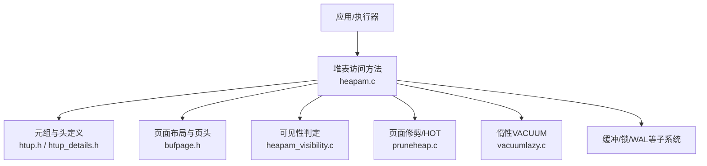
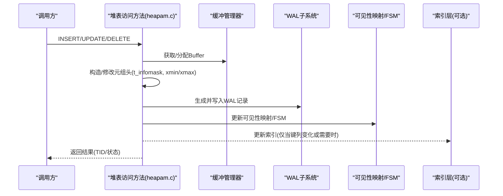
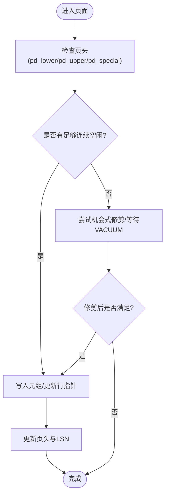
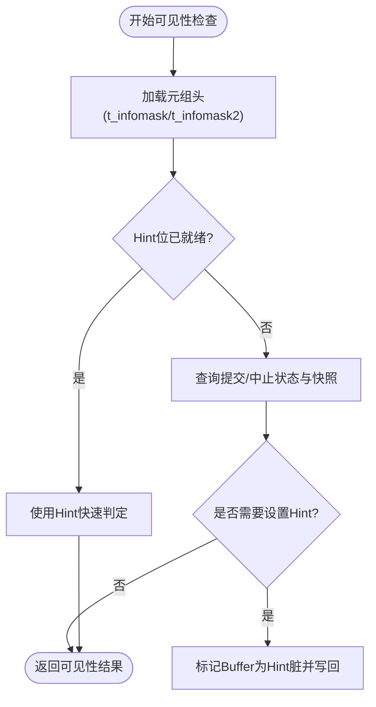
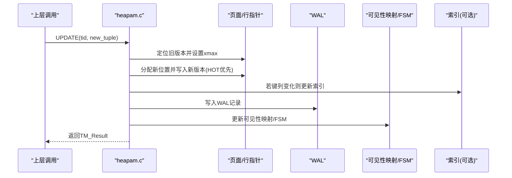
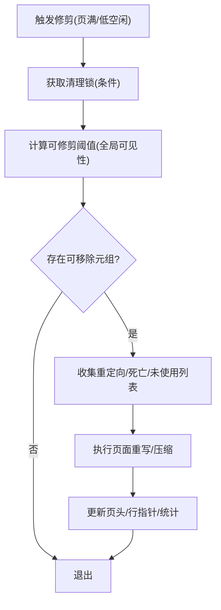
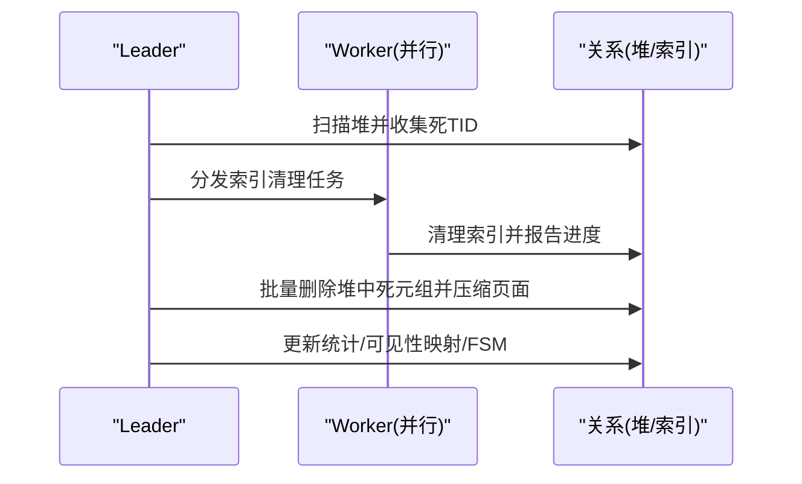
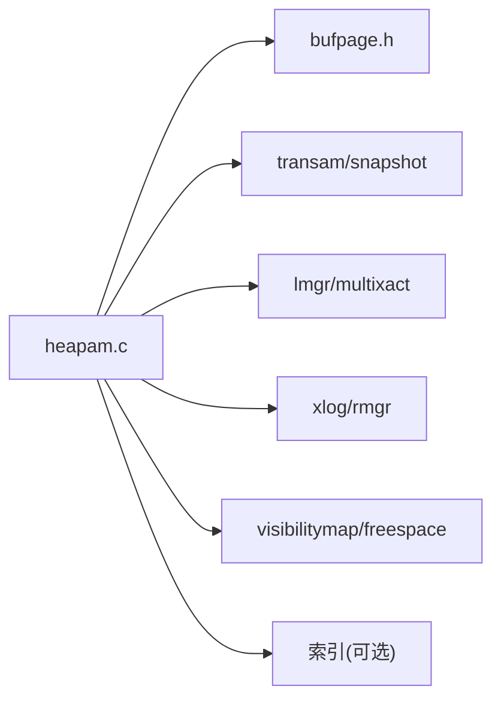

# 存储引擎

<cite>
**本文引用的文件**
- [heapam.h](file://src/include/access/heapam.h)
- [heapam.c](file://src/backend/access/heap/heapam.c)
- [htup.h](file://src/include/access/htup.h)
- [htup_details.h](file://src/include/access/htup_details.h)
- [bufpage.h](file://src/include/storage/bufpage.h)
- [vacuumlazy.c](file://src/backend/access/heap/vacuumlazy.c)
- [pruneheap.c](file://src/backend/access/heap/pruneheap.c)
- [heapam_visibility.c](file://src/backend/access/heap/heapam_visibility.c)
</cite>

## 目录
1. [简介](#简介)
2. [项目结构](#项目结构)
3. [核心组件](#核心组件)
4. [架构总览](#架构总览)
5. [详细组件分析](#详细组件分析)
6. [依赖关系分析](#依赖关系分析)
7. [性能考量](#性能考量)
8. [故障排查指南](#故障排查指南)
9. [结论](#结论)
10. [附录](#附录)

## 简介
本文件面向Mini PostgreSQL的堆表（Heap）存储引擎，系统性阐述其数据结构、元组格式、页面布局与管理机制；深入解释插入、更新、删除的实现与MVCC可见性判断；说明垃圾回收与VACUUM过程；总结性能特性、存储优化选项与调优参数；并通过代码级流程图与时序图展示与索引、缓冲管理、WAL等组件的协作模式。目标是帮助读者在不深入源码细节的情况下，也能理解堆表在系统中的核心地位与设计取舍。

## 项目结构
堆表实现主要分布在以下模块：
- 访问方法接口与入口：access/heap/heapam.c 与 include/access/heapam.h
- 元组与头信息定义：include/access/htup.h、include/access/htup_details.h
- 页面布局与通用页头：include/storage/bufpage.h
- 可见性与MVCC判定：access/heap/heapam_visibility.c
- 页面修剪与HOT链管理：access/heap/pruneheap.c
- 惰性VACUUM与并行清理：access/heap/vacuumlazy.c



**图示来源**
- [heapam.c:1-200](file://src/backend/access/heap/heapam.c#L1-L200)
- [bufpage.h:100-200](file://src/include/storage/bufpage.h#L100-L200)
- [htup_details.h:120-220](file://src/include/access/htup_details.h#L120-L220)

**章节来源**
- [heapam.c:1-200](file://src/backend/access/heap/heapam.c#L1-L200)
- [bufpage.h:100-200](file://src/include/storage/bufpage.h#L100-L200)
- [htup_details.h:120-220](file://src/include/access/htup_details.h#L120-L220)

## 核心组件
- 元组与元组头
  - HeapTupleData：内存中的元组句柄，指向磁盘或内存中的元组数据。
  - HeapTupleHeaderData：磁盘/内存中元组的固定头部，包含事务可见性字段（xmin/xmax/cmin/cmax/xvac）、CTID、标志位（t_infomask/t_infomask2）及NULL位图与用户数据起始偏移。
- 页面布局
  - PageHeaderData：通用页头，包含LSN、校验和、标志位、空闲空间指针（pd_lower/pd_upper/pd_special）、版本/大小、可修剪XID提示（pd_prune_xid）以及行指针数组（ItemId）。
- 访问方法与扫描
  - heap_insert/update/delete/fetch、批量插入、扫描描述符（HeapScanDescData）、并行扫描支持。
- 可见性与MVCC
  - 基于xmin/xmax/cmin/cmax与快照的可见性判定，支持Hint位加速后续检查。
- 页面修剪与HOT
  - 在线机会式修剪（heap_page_prune_opt），维护HOT链以减少索引更新。
- VACUUM
  - 惰性VACUUM（vacuumlazy.c）负责收集死元组TID、清理索引、压缩页面、释放空间并更新统计。

**章节来源**
- [htup.h:30-70](file://src/include/access/htup.h#L30-L70)
- [htup_details.h:120-220](file://src/include/access/htup_details.h#L120-L220)
- [bufpage.h:100-200](file://src/include/storage/bufpage.h#L100-L200)
- [heapam.h:117-213](file://src/include/access/heapam.h#L117-L213)

## 架构总览
堆表作为PostgreSQL默认表存储引擎，向上暴露统一的TableAM接口，向下与缓冲管理器、锁管理器、WAL、可见性映射、自由空间映射等交互。关键流程包括：
- 插入：准备元组头、选择页面、写入数据、更新行指针与页头、记录WAL、更新可见性映射与FSM。
- 更新：标记旧版本xmax、写入新版本、建立HOT链（若可能）、更新索引（必要时）、记录WAL。
- 删除：标记xmax为当前事务、可选地加入MultiXact以支持并发锁定、记录WAL。
- 读取：根据快照与元组头标志位进行可见性判断，必要时跟随CTID链查找最新版本。
- 修剪/VACUUM：在线机会式修剪与后台惰性VACUUM协同，回收死元组空间、压缩页面、更新统计。



**图示来源**
- [heapam.c:1-200](file://src/backend/access/heap/heapam.c#L1-L200)
- [bufpage.h:100-200](file://src/include/storage/bufpage.h#L100-L200)
- [heapam.h:150-177](file://src/include/access/heapam.h#L150-L177)

## 详细组件分析

### 元组与元组头设计
- 固定头部包含事务可见性三元组（xmin/xmax/cmin/cmax/xvac）与CTID，通过t_infomask/t_infomask2携带多种标志位（如是否含NULL、是否HOT更新、是否仅元组等）。
- t_ctid用于链接同一行的多个版本，形成“版本链”；HIT更新时尽量在同一页内追加新版本，减少索引维护成本。
- 空值位图按需存储，用户数据按对齐要求放置。

```mermaid
classDiagram
class HeapTupleData {
+uint32 t_len
+ItemPointerData t_self
+Oid t_tableOid
+HeapTupleHeader t_data
}
class HeapTupleHeaderData {
+HeapTupleFields t_choice
+ItemPointerData t_ctid
+uint16 t_infomask2
+uint16 t_infomask
+uint8 t_hoff
+bits8 t_bits[]
}
class HeapTupleFields {
+TransactionId t_xmin
+TransactionId t_xmax
+union{CommandId t_cid; TransactionId t_xvac}
}
HeapTupleData --> HeapTupleHeaderData : "t_data"
HeapTupleHeaderData --> HeapTupleFields : "t_choice"
```

**图示来源**
- [htup.h:30-70](file://src/include/access/htup.h#L30-L70)
- [htup_details.h:120-220](file://src/include/access/htup_details.h#L120-L220)

**章节来源**
- [htup.h:30-70](file://src/include/access/htup.h#L30-L70)
- [htup_details.h:120-220](file://src/include/access/htup_details.h#L120-L220)

### 页面布局与管理
- 页头PageHeaderData提供LSN、校验和、标志位、空闲区间(pd_lower/pd_upper)、特殊区(pd_special)与可修剪XID提示(pd_prune_xid)。
- 行指针(ItemId)从页首向后增长，元组从页尾向前增长，二者之间为可用空间。
- 页满或碎片较多时触发机会式修剪或VACUUM。



**图示来源**
- [bufpage.h:100-200](file://src/include/storage/bufpage.h#L100-L200)
- [pruneheap.c:94-200](file://src/backend/access/heap/pruneheap.c#L94-L200)

**章节来源**
- [bufpage.h:100-200](file://src/include/storage/bufpage.h#L100-L200)
- [pruneheap.c:94-200](file://src/backend/access/heap/pruneheap.c#L94-L200)

### MVCC可见性判断与Hint位
- 可见性函数依据快照与元组头标志位判断元组对当前查询是否可见。
- 首次判定后可设置Hint位（如HEAP_XMIN_COMMITTED/INVALID等），加速后续访问。
- 非MVCC快照需先检查事务是否在运行，避免竞态条件。



**图示来源**
- [heapam_visibility.c:1-200](file://src/backend/access/heap/heapam_visibility.c#L1-L200)
- [heapam.h:215-229](file://src/include/access/heapam.h#L215-L229)

**章节来源**
- [heapam_visibility.c:1-200](file://src/backend/access/heap/heapam_visibility.c#L1-L200)
- [heapam.h:215-229](file://src/include/access/heapam.h#L215-L229)

### 插入、更新、删除流程
- 插入
  - 准备元组头（填充xmin/cmin等），选择合适页面（考虑fill factor与空闲空间），写入数据，更新行指针与页头，记录WAL，更新可见性映射与FSM。
- 更新
  - 将旧版本xmax设为当前事务ID，必要时加入MultiXact；在新位置写入新版本，建立HOT链（若同页且无键列变更）；更新索引（键列变化时）；记录WAL。
- 删除
  - 标记xmax为当前事务，可选加入MultiXact以支持并发锁定；记录WAL；在线或后台阶段进行物理回收。



**图示来源**
- [heapam.c:1-200](file://src/backend/access/heap/heapam.c#L1-L200)
- [heapam.h:150-177](file://src/include/access/heapam.h#L150-L177)

**章节来源**
- [heapam.c:1-200](file://src/backend/access/heap/heapam.c#L1-L200)
- [heapam.h:150-177](file://src/include/access/heapam.h#L150-L177)

### 页面修剪与HOT链管理
- 在线机会式修剪（heap_page_prune_opt）在页满或空闲不足时尝试获取清理锁，评估可移除XID阈值，收集重定向/死亡/未使用的条目并执行实际修剪。
- HOT链：更新时尽量在同一页追加新版本，减少索引维护开销；若无法容纳则退化为普通更新。



**图示来源**
- [pruneheap.c:94-200](file://src/backend/access/heap/pruneheap.c#L94-L200)

**章节来源**
- [pruneheap.c:94-200](file://src/backend/access/heap/pruneheap.c#L94-L200)

### 惰性VACUUM与并行清理
- 惰性VACUUM分阶段扫描堆与索引，收集死元组TID，分批清理索引与堆，压缩页面，必要时截断关系尾部，更新统计。
- 支持并行工作进程共享DSM段，协调死元组收集与索引清理，提升大表清理效率。



**图示来源**
- [vacuumlazy.c:1-200](file://src/backend/access/heap/vacuumlazy.c#L1-L200)

**章节来源**
- [vacuumlazy.c:1-200](file://src/backend/access/heap/vacuumlazy.c#L1-L200)

## 依赖关系分析
- 堆表访问方法依赖：
  - 缓冲管理与页操作（bufpage.h）
  - 事务与可见性（transam、procarray、snapshot）
  - 锁与并发控制（lmgr、multixact）
  - WAL持久化（xloginsert、rmgrlist）
  - 可见性映射与FSM（visibilitymap、freespace）
  - 索引子系统（nbtree/hash等，仅在键列变化或需要时）



**图示来源**
- [heapam.c:1-200](file://src/backend/access/heap/heapam.c#L1-L200)
- [bufpage.h:100-200](file://src/include/storage/bufpage.h#L100-L200)

**章节来源**
- [heapam.c:1-200](file://src/backend/access/heap/heapam.c#L1-L200)
- [bufpage.h:100-200](file://src/include/storage/bufpage.h#L100-L200)

## 性能考量
- 插入路径优化
  - 批量插入（heap_multi_insert）减少重复开销。
  - 使用BulkInsertState复用Buffer与策略，降低锁竞争。
  - 优先HOT更新以减少索引维护。
- 读取路径优化
  - Hint位缓存提交/中止状态，减少WAL/子事务查询。
  - 并行扫描与预取策略降低I/O延迟。
- 写入与碎片管理
  - fill factor与页面空闲阈值影响插入与修剪时机。
  - 机会式修剪与惰性VACUUM协同，平衡在线与后台负载。
- 并行VACUUM
  - 通过DSM共享死元组与进度，提升大表清理吞吐。
- 调优参数（概念性）
  - maintenance_work_mem：控制VACUUM期间内存占用上限。
  - autovacuum_work_mem：自动VACUUM内存限制。
  - old_snapshot_threshold：控制旧快照保留窗口，影响修剪激进程度。
  - 其他与页面大小、WAL刷盘策略相关的系统级参数。

[本节为通用指导，不直接分析具体文件]

## 故障排查指南
- 可见性问题
  - 检查元组头标志位与Hint位是否正确设置；确认快照与事务状态一致性。
  - 关注非MVCC快照下的竞态处理顺序（先查是否在运行，再查提交/中止）。
- 页面碎片与性能退化
  - 观察pd_flags与pd_prune_xid，判断是否频繁触发修剪；必要时调整fill factor或触发VACUUM。
- 并发冲突与锁定
  - 检查MultiXact状态与锁模式，确认是否存在长时间持有锁导致阻塞。
- VACUUM卡住或内存溢出
  - 监控maintenance_work_mem与autovacuum_work_mem；检查并行VACUUM的DSM使用情况。

**章节来源**
- [heapam_visibility.c:1-200](file://src/backend/access/heap/heapam_visibility.c#L1-L200)
- [bufpage.h:100-200](file://src/include/storage/bufpage.h#L100-L200)
- [vacuumlazy.c:1-200](file://src/backend/access/heap/vacuumlazy.c#L1-L200)

## 结论
Mini PostgreSQL的堆表存储引擎以紧凑的元组头与灵活的页面布局为基础，结合MVCC可见性、Hint位优化、HOT链与在线修剪，实现了高并发下的高效读写。惰性VACUUM与并行清理保障了长期运行的稳定性与空间回收效率。通过合理的调优参数与监控手段，可在不同负载场景下取得良好的性能与资源利用平衡。

## 附录
- 与外部组件协作要点
  - 与索引：仅在键列变化或需要时更新索引，尽量减少不必要的索引维护。
  - 与WAL：所有关键修改均记录WAL，确保崩溃恢复一致性。
  - 与缓冲管理：通过Buffer pin/lock与LSN机制保证并发安全与持久化顺序。
  - 与可见性映射/FSM：加速全可见判断与空闲空间分配。

[本节为概念性内容，不直接分析具体文件]