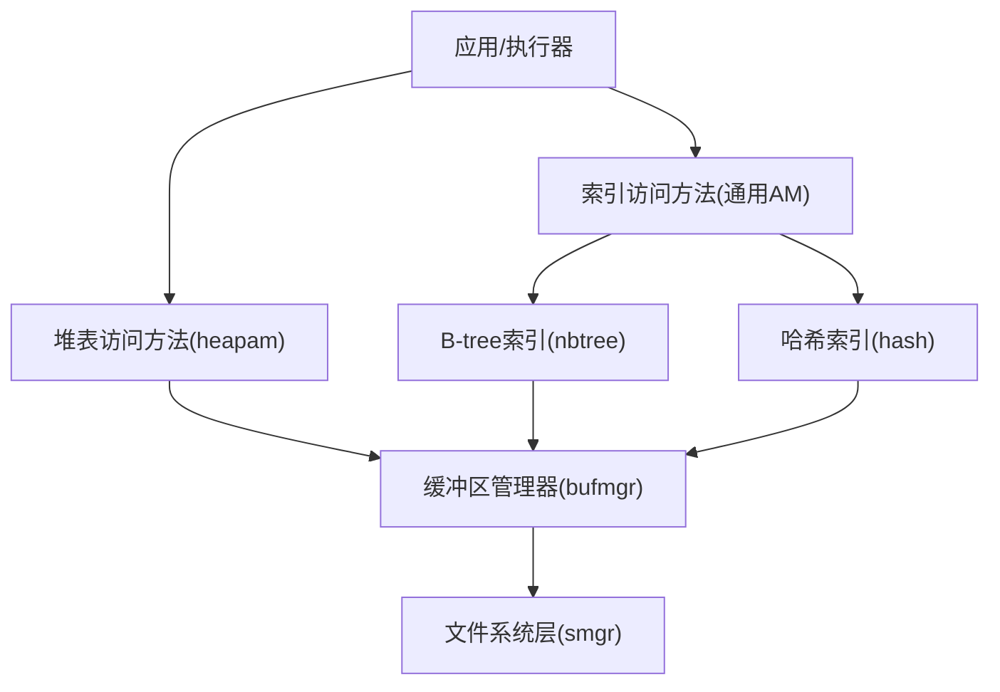
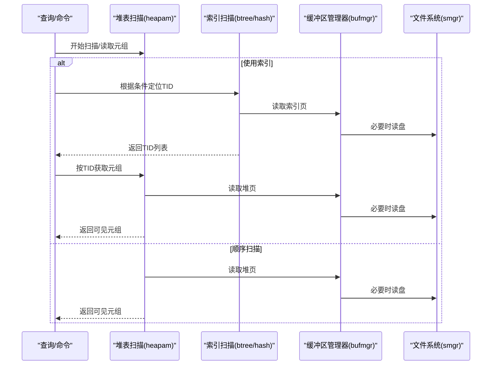
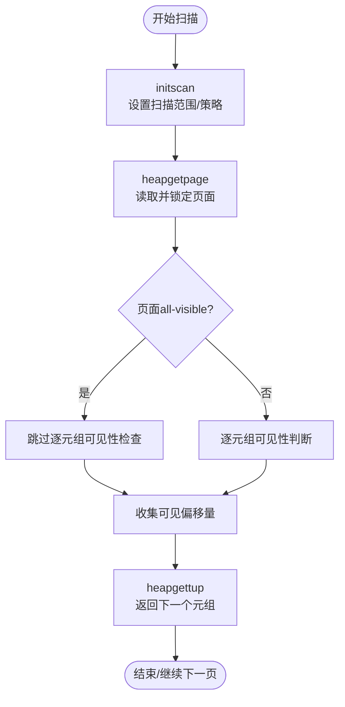
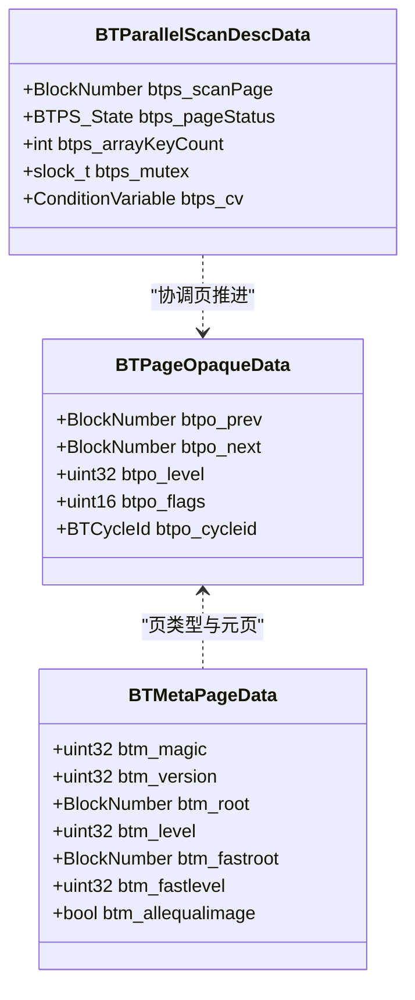
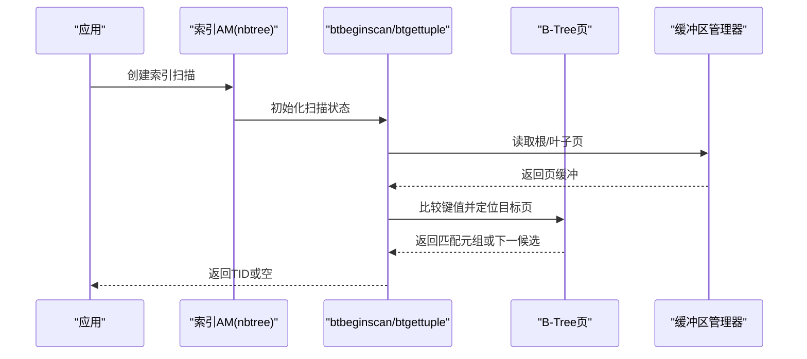
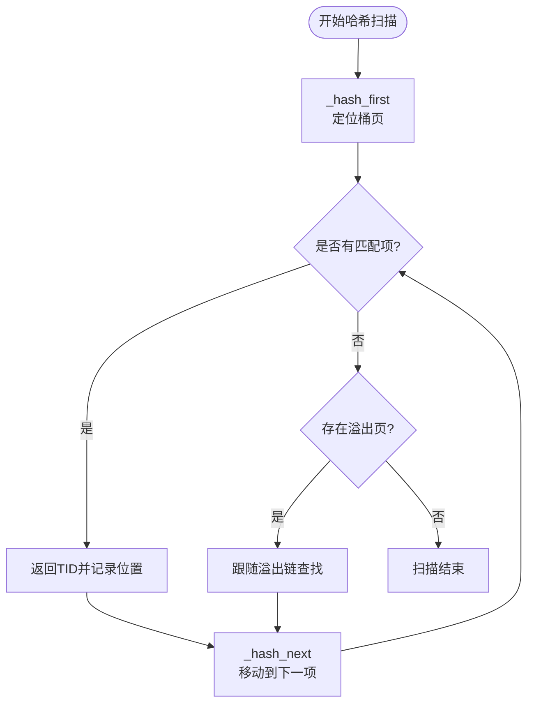
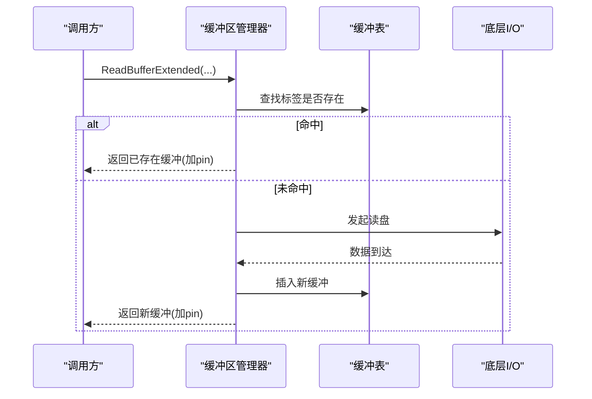
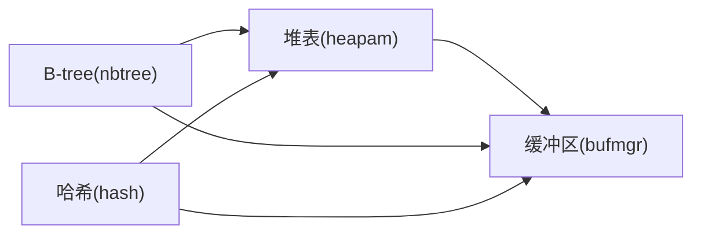

# 核心组件

<cite>
**本文引用的文件**
- [heapam.c](file://src/backend/access/heap/heapam.c)
- [heapam.h](file://src/include/access/heapam.h)
- [nbtree.c](file://src/backend/access/nbtree/nbtree.c)
- [nbtree.h](file://src/include/access/nbtree.h)
- [hash.c](file://src/backend/access/hash/hash.c)
- [hash.h](file://src/include/access/hash.h)
- [bufmgr.c](file://src/backend/storage/buffer/bufmgr.c)
- [bufmgr.h](file://src/include/storage/bufmgr.h)
</cite>

## 目录
1. [简介](#简介)
2. [项目结构](#项目结构)
3. [核心组件](#核心组件)
4. [架构总览](#架构总览)
5. [详细组件分析](#详细组件分析)
6. [依赖关系分析](#依赖关系分析)
7. [性能考量](#性能考量)
8. [故障排查指南](#故障排查指南)
9. [结论](#结论)
10. [附录](#附录)

## 简介
本文件面向Mini PostgreSQL的核心存储与索引子系统，聚焦以下组件的实现原理、接口定义、数据结构与算法流程：
- 堆表存储引擎（Heap Access Method）
- B-tree索引（B-Tree Index）
- 哈希索引（Hash Index）
- 缓冲区管理（Buffer Manager）

文档将解释各组件的职责边界、协作模式、关键数据流与并发控制要点，并提供性能调优建议与常见问题定位方法。

## 项目结构
Mini PostgreSQL的存储与索引相关代码主要分布在如下路径：
- 堆表访问方法：src/backend/access/heap/
- B-tree索引实现：src/backend/access/nbtree/
- 哈希索引实现：src/backend/access/hash/
- 缓冲区管理：src/backend/storage/buffer/
- 公共头文件：src/include/access/*, src/include/storage/*

图表来源
- [heapam.c:1-80](file://src/backend/access/heap/heapam.c#L1-L80)
- [nbtree.c:90-145](file://src/backend/access/nbtree/nbtree.c#L90-L145)
- [hash.c:51-105](file://src/backend/access/hash/hash.c#L51-L105)
- [bufmgr.c:15-30](file://src/backend/storage/buffer/bufmgr.c#L15-L30)

章节来源
- [heapam.c:1-80](file://src/backend/access/heap/heapam.c#L1-L80)
- [bufmgr.c:15-30](file://src/backend/storage/buffer/bufmgr.c#L15-L30)

## 核心组件
- 堆表存储引擎：提供元组插入、删除、更新、扫描、可见性判断、HOT优化等能力，是PostgreSQL所有表的默认存储方式。
- B-tree索引：支持范围查询、排序、唯一约束、包含列等，采用Lehman & Yao并发算法，维护页级双向链表与分裂机制。
- 哈希索引：基于开放地址链式桶结构，适合等值查询，支持动态扩容与分裂清理。
- 缓冲区管理：共享缓冲池、LRU替换、预取、脏页写回、检查点与后台写入器协作。

章节来源
- [heapam.h:44-80](file://src/include/access/heapam.h#L44-L80)
- [nbtree.h:31-118](file://src/include/access/nbtree.h#L31-L118)
- [hash.h:31-100](file://src/include/access/hash.h#L31-L100)
- [bufmgr.h:24-88](file://src/include/storage/bufmgr.h#L24-L88)

## 架构总览
下图展示了从上层调用到存储层的典型数据流：查询或DML进入后，可能走堆表顺序扫描或索引扫描；索引扫描最终仍会回到堆表获取完整元组；所有页面访问均通过缓冲区管理器进行缓存与一致性控制。

图表来源
- [heapam.c:239-351](file://src/backend/access/heap/heapam.c#L239-L351)
- [nbtree.c:209-278](file://src/backend/access/nbtree/nbtree.c#L209-L278)
- [hash.c:275-321](file://src/backend/access/hash/hash.c#L275-L321)
- [bufmgr.c:742-759](file://src/backend/storage/buffer/bufmgr.c#L742-L759)

## 详细组件分析

### 堆表存储引擎（Heap Access Method）
- 职责
  - 元组生命周期：插入、删除、更新、冻结、可见性判定
  - 扫描：顺序扫描、并行扫描、同步扫描、批量读取策略
  - HOT优化：减少索引更新开销
- 关键数据结构
  - HeapScanDescData：扫描描述符，包含块计数、起始块、当前缓冲、可见元组数组等
  - IndexFetchHeapData：通过索引获取堆元组的上下文
- 关键流程
  - initscan：初始化扫描参数，决定是否启用批量读取与同步扫描
  - heapgetpage：读取并锁定页面，计算可见元组集合
  - heapgettup：按方向遍历页面项指针，过滤不可见元组，返回下一个有效元组
- 并发与可见性
  - 使用快照与MVCC判断元组可见性
  - 支持并行扫描与同步扫描协调
- 性能特性
  - 大表扫描时自动启用批量读取策略与同步扫描
  - 页面级all-visible标志可跳过逐元组可见性检查

图表来源
- [heapam.c:239-351](file://src/backend/access/heap/heapam.c#L239-L351)
- [heapam.c:382-492](file://src/backend/access/heap/heapam.c#L382-L492)
- [heapam.c:517-800](file://src/backend/access/heap/heapam.c#L517-L800)

章节来源
- [heapam.h:44-80](file://src/include/access/heapam.h#L44-L80)
- [heapam.c:239-351](file://src/backend/access/heap/heapam.c#L239-L351)
- [heapam.c:382-492](file://src/backend/access/heap/heapam.c#L382-L492)
- [heapam.c:517-800](file://src/backend/access/heap/heapam.c#L517-L800)

### B-tree索引（B-Tree Index）
- 职责
  - 构建、插入、扫描、批量删除、VACUUM清理
  - 支持范围查询、排序、唯一约束、包含列、并行扫描
- 关键数据结构
  - BTPageOpaqueData：页尾信息，含左右兄弟指针、层级、标志位、真空周期ID
  - BTMetaPageData：元页，保存根节点位置、层级、版本信息等
- 关键流程
  - bthandler：注册访问方法回调（构建、插入、扫描、删除等）
  - btinsert：生成索引元组并插入树中
  - btbeginscan/btgettuple：初始化扫描状态，按方向推进页内游标
  - 并行扫描：通过BTParallelScanDescData协调多进程推进页
- 并发与一致性
  - 基于Lehman & Yao算法的细粒度锁与分裂保护
  - 页分裂与删除标记保证并发安全
- 性能特性
  - 非丢失扫描（non-lossy），无需二次谓词检查
  - 支持数组键扫描与标记/恢复位置

图表来源
- [nbtree.h:31-118](file://src/include/access/nbtree.h#L31-L118)
- [nbtree.c:41-77](file://src/backend/access/nbtree/nbtree.c#L41-L77)

图表来源
- [nbtree.c:90-145](file://src/backend/access/nbtree/nbtree.c#L90-L145)
- [nbtree.c:209-278](file://src/backend/access/nbtree/nbtree.c#L209-L278)
- [nbtree.c:341-443](file://src/backend/access/nbtree/nbtree.c#L341-L443)

章节来源
- [nbtree.c:90-145](file://src/backend/access/nbtree/nbtree.c#L90-L145)
- [nbtree.c:209-278](file://src/backend/access/nbtree/nbtree.c#L209-L278)
- [nbtree.c:341-443](file://src/backend/access/nbtree/nbtree.c#L341-L443)
- [nbtree.h:31-118](file://src/include/access/nbtree.h#L31-L118)

### 哈希索引（Hash Index）
- 职责
  - 构建、插入、扫描、批量删除、VACUUM清理
  - 支持等值查询，动态桶分裂与溢出链
- 关键数据结构
  - HashPageOpaqueData：页特殊区，标识页类型（桶页、溢出页、元页等）与状态标志
  - HashScanPosData/HashScanOpaqueData：扫描位置与状态，记录当前页、前后页、命中项数组
- 关键流程
  - hashhandler：注册访问方法回调
  - hashbuild/hashbuildempty：初始化元页与桶，可选排序后批量插入
  - hashinsert：计算哈希键并插入对应桶
  - hashgettuple/hashgetbitmap：定位桶并遍历溢出链，返回匹配TID
- 并发与一致性
  - 桶分裂期间通过标志位协调扫描与写入
  - VACUUM清理分裂遗留项与死元组
- 性能特性
  - 等值查询高效，但为lossy扫描需二次谓词检查
  - 构建阶段可按桶大小决定是否先排序以减少随机I/O

图表来源
- [hash.c:51-105](file://src/backend/access/hash/hash.c#L51-L105)
- [hash.c:110-188](file://src/backend/access/hash/hash.c#L110-L188)
- [hash.c:243-269](file://src/backend/access/hash/hash.c#L243-L269)
- [hash.c:275-321](file://src/backend/access/hash/hash.c#L275-L321)

章节来源
- [hash.c:51-105](file://src/backend/access/hash/hash.c#L51-L105)
- [hash.c:110-188](file://src/backend/access/hash/hash.c#L110-L188)
- [hash.c:243-269](file://src/backend/access/hash/hash.c#L243-L269)
- [hash.c:275-321](file://src/backend/access/hash/hash.c#L275-L321)
- [hash.h:31-100](file://src/include/access/hash.h#L31-L100)

### 缓冲区管理（Buffer Manager）
- 职责
  - 共享缓冲池分配、LRU替换、预取、脏页写回、检查点
  - 提供ReadBuffer/PrefetchBuffer/ReleaseBuffer等接口
- 关键数据结构
  - BufferAccessStrategyType：批量读取/写入策略
  - PrefetchBufferResult：预取结果（最近命中或发起异步I/O）
  - PrivateRefCountEntry：后端私有引用计数优化
- 关键流程
  - ReadBufferExtended：统一入口，统计命中/未命中，调用内部逻辑分配或读取缓冲
  - PrefetchSharedBuffer：尝试异步预取，避免后续阻塞
  - 私有引用计数：减少共享内存原子操作次数，提升热点缓冲访问效率
- 性能特性
  - 支持IO并发度配置与后台写入器协同
  - 针对大表扫描优化（批量读取策略、同步扫描）

图表来源
- [bufmgr.c:742-759](file://src/backend/storage/buffer/bufmgr.c#L742-L759)
- [bufmgr.c:505-566](file://src/backend/storage/buffer/bufmgr.c#L505-L566)
- [bufmgr.c:592-600](file://src/backend/storage/buffer/bufmgr.c#L592-L600)

章节来源
- [bufmgr.c:15-30](file://src/backend/storage/buffer/bufmgr.c#L15-L30)
- [bufmgr.c:505-566](file://src/backend/storage/buffer/bufmgr.c#L505-L566)
- [bufmgr.c:592-600](file://src/backend/storage/buffer/bufmgr.c#L592-L600)
- [bufmgr.c:742-759](file://src/backend/storage/buffer/bufmgr.c#L742-L759)
- [bufmgr.h:24-88](file://src/include/storage/bufmgr.h#L24-L88)

## 依赖关系分析
- 堆表与索引
  - 索引扫描返回TID，再由堆表按TID获取元组，形成“索引→堆”的协作模式
- 索引与缓冲区
  - B-tree与哈希索引均通过缓冲区管理器访问页，确保一致性与缓存命中
- 堆表与缓冲区
  - 堆表扫描直接读取堆页，利用批量读取策略与同步扫描优化吞吐
- 并发控制
  - B-tree使用细粒度锁与分裂标志；哈希索引使用桶分裂标志；堆表使用MVCC与行级锁

图表来源
- [heapam.c:239-351](file://src/backend/access/heap/heapam.c#L239-L351)
- [nbtree.c:209-278](file://src/backend/access/nbtree/nbtree.c#L209-L278)
- [hash.c:275-321](file://src/backend/access/hash/hash.c#L275-L321)
- [bufmgr.c:742-759](file://src/backend/storage/buffer/bufmgr.c#L742-L759)

章节来源
- [heapam.c:239-351](file://src/backend/access/heap/heapam.c#L239-L351)
- [nbtree.c:209-278](file://src/backend/access/nbtree/nbtree.c#L209-L278)
- [hash.c:275-321](file://src/backend/access/hash/hash.c#L275-L321)
- [bufmgr.c:742-759](file://src/backend/storage/buffer/bufmgr.c#L742-L759)

## 性能考量
- 堆表
  - 大表顺序扫描：启用批量读取策略与同步扫描，减少锁竞争与提高吞吐
  - 页面all-visible：跳过逐元组可见性检查，降低CPU开销
- B-tree
  - 非丢失扫描：无需二次谓词检查，适合范围与排序
  - 填充因子：叶页默认90%，非叶页固定70%，影响空间利用率与分裂频率
- 哈希
  - 等值查询高效，但为lossy扫描需二次谓词检查
  - 构建阶段可按桶规模选择排序插入，减少随机I/O
- 缓冲区
  - 预取：PrefetchBuffer可减少后续读阻塞
  - IO并发：effective_io_concurrency与maintenance_io_concurrency影响并发读
  - 后台写入器：bgwriter_lru_maxpages与multiplier控制脏页写回节奏

[本节为通用指导，不直接分析具体文件]

## 故障排查指南
- 堆表
  - 扫描卡顿：检查是否启用批量读取与同步扫描；确认快照与可见性判断路径
  - 热点缓冲争用：观察私有引用计数与LRU行为，调整NBuffers与工作集大小
- B-tree
  - 高分裂率：评估填充因子与键分布；关注页分裂标志与真空周期ID
  - 并行扫描异常：检查BTParallelScanDescData状态机与条件变量信号
- 哈希
  - 桶分裂冲突：关注LH_BUCKET_BEING_SPLIT与LH_NEEDS_SPLIT_CLEANUP标志
  - 构建性能：根据bucket数量与maintenance_work_mem决定是否排序插入
- 缓冲区
  - 频繁磁盘读：检查命中统计与预取策略；调整IO并发与后台写入器参数
  - 脏页堆积：监控checkpoint_flush_after与backend_flush_after

章节来源
- [heapam.c:239-351](file://src/backend/access/heap/heapam.c#L239-L351)
- [nbtree.c:41-77](file://src/backend/access/nbtree/nbtree.c#L41-L77)
- [hash.c:454-633](file://src/backend/access/hash/hash.c#L454-L633)
- [bufmgr.c:505-566](file://src/backend/storage/buffer/bufmgr.c#L505-L566)

## 结论
Mini PostgreSQL的核心存储与索引组件围绕堆表、B-tree、哈希与缓冲区管理构成稳定高效的体系。堆表提供基础元组管理与可见性；B-tree与哈希分别覆盖范围/排序与等值查询场景；缓冲区管理保障数据局部性与并发安全。合理配置填充因子、IO并发与扫描策略，可显著提升数据库性能与稳定性。

[本节为总结，不直接分析具体文件]

## 附录
- 接口参考
  - 堆表：heap_beginscan/heap_getnext/heap_insert/heap_delete/heap_update
  - B-tree：bthandler/btinsert/btbeginscan/btgettuple
  - 哈希：hashhandler/hashinsert/hashbeginscan/hashgettuple
  - 缓冲区：ReadBufferExtended/PrefetchBuffer/ReleaseBuffer
- 使用建议
  - 优先使用B-tree进行范围与排序查询；哈希用于等值查询
  - 大表扫描启用批量读取与同步扫描；合理设置填充因子与IO并发
  - 监控缓冲区命中率与脏页写回，调整工作集与后台写入器参数

[本节为补充说明，不直接分析具体文件]