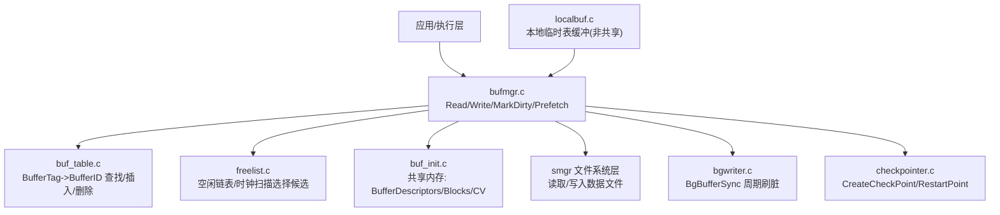
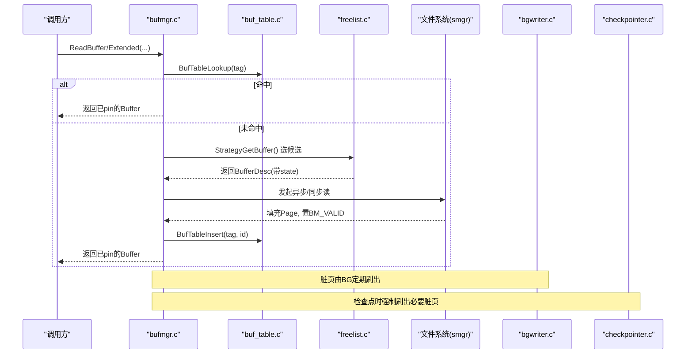
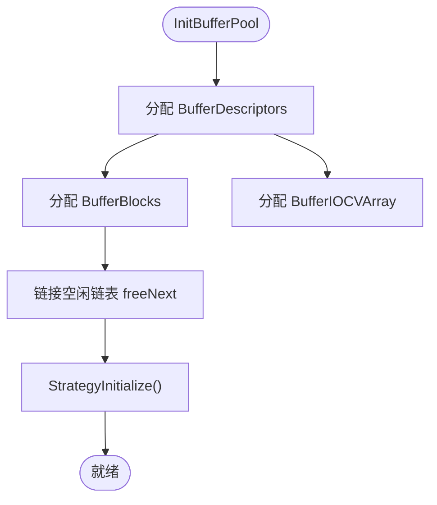
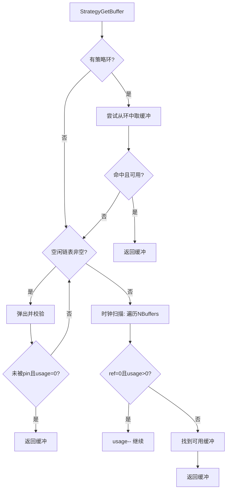
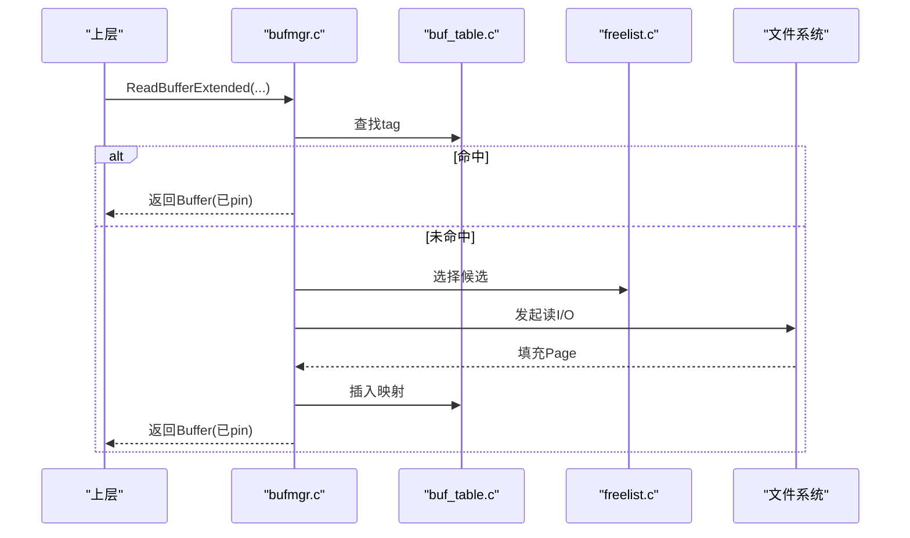
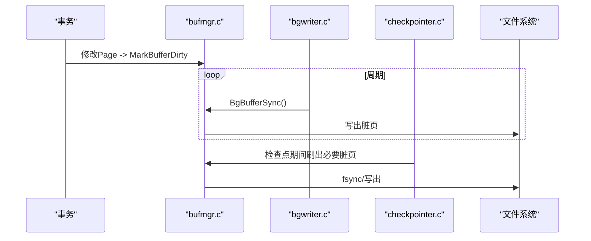
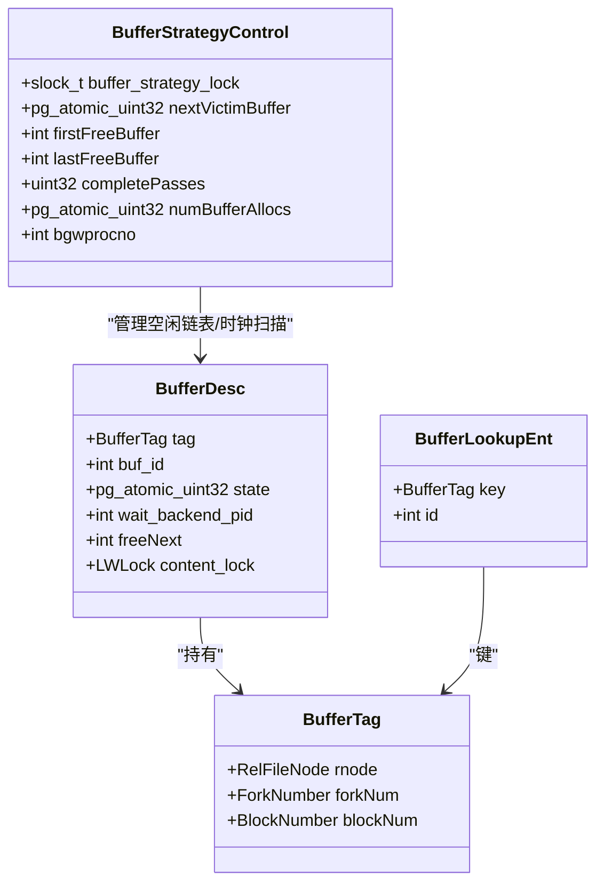
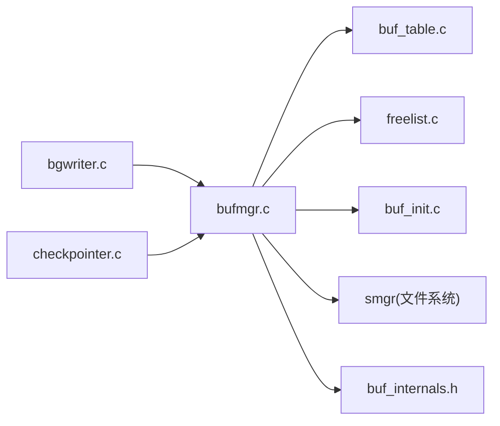

# 缓冲区管理

<cite>
**本文引用的文件**
- [bufmgr.c](file://src/backend/storage/buffer/bufmgr.c)
- [buf_init.c](file://src/backend/storage/buffer/buf_init.c)
- [freelist.c](file://src/backend/storage/buffer/freelist.c)
- [buf_table.c](file://src/backend/storage/buffer/buf_table.c)
- [localbuf.c](file://src/backend/storage/buffer/localbuf.c)
- [checkpointer.c](file://src/backend/postmaster/checkpointer.c)
- [bgwriter.c](file://src/backend/postmaster/bgwriter.c)
- [buf_internals.h](file://src/include/storage/buf_internals.h)
</cite>

## 目录
1. [简介](#简介)
2. [项目结构](#项目结构)
3. [核心组件](#核心组件)
4. [架构总览](#架构总览)
5. [详细组件分析](#详细组件分析)
6. [依赖关系分析](#依赖关系分析)
7. [性能考虑](#性能考虑)
8. [故障排查指南](#故障排查指南)
9. [结论](#结论)
10. [附录](#附录)

## 简介
本文件面向 Mini PostgreSQL 的缓冲区管理系统，系统性阐述缓冲区池设计、页面缓存策略、LRU/时钟扫描替换算法、共享内存管理与脏页持久化机制。重点覆盖缓冲区的分配与释放、读写流程、检查点与后台写入器协作、以及与文件系统层的交互方式，并提供配置参数与调优建议，帮助读者理解其对数据库性能的关键影响。

## 项目结构
Mini PostgreSQL 的缓冲区子系统位于 storage/buffer 目录，由以下关键模块组成：
- bufmgr.c：缓冲区管理器对外接口（读、写、标记脏、预取等）
- buf_init.c：共享缓冲区池初始化与共享内存布局
- freelist.c：空闲链表与“时钟扫描”替换策略
- buf_table.c：BufferTag 到 Buffer ID 的哈希映射表
- localbuf.c：本地临时表缓冲区（非共享、无需 WAL/检查点）
- postmaster/checkpointer.c：检查点进程，协调脏页落盘与一致性
- postmaster/bgwriter.c：后台写入器，持续将脏页刷入磁盘
- include/storage/buf_internals.h：缓冲区状态位、BufferDesc 等内部定义

图表来源
- [bufmgr.c:16-30](file://src/backend/storage/buffer/bufmgr.c#L16-L30)
- [buf_init.c:66-146](file://src/backend/storage/buffer/buf_init.c#L66-L146)
- [freelist.c:189-358](file://src/backend/storage/buffer/freelist.c#L189-L358)
- [buf_table.c:51-163](file://src/backend/storage/buffer/buf_table.c#L51-L163)
- [bgwriter.c:93-353](file://src/backend/postmaster/bgwriter.c#L93-L353)
- [checkpointer.c:182-532](file://src/backend/postmaster/checkpointer.c#L182-L532)

章节来源
- [bufmgr.c:16-30](file://src/backend/storage/buffer/bufmgr.c#L16-L30)
- [buf_init.c:66-146](file://src/backend/storage/buffer/buf_init.c#L66-L146)
- [freelist.c:189-358](file://src/backend/storage/buffer/freelist.c#L189-L358)
- [buf_table.c:51-163](file://src/backend/storage/buffer/buf_table.c#L51-L163)
- [localbuf.c:108-279](file://src/backend/storage/buffer/localbuf.c#L108-L279)
- [bgwriter.c:93-353](file://src/backend/postmaster/bgwriter.c#L93-L353)
- [checkpointer.c:182-532](file://src/backend/postmaster/checkpointer.c#L182-L532)

## 核心组件
- 缓冲区描述符与状态：BufferDesc 包含 tag、buf_id、state（原子位域：引用计数、使用计数、标志位）、content_lock 等；state 位域用于无锁 CAS 操作提升并发性能。
- 共享内存布局：BufferDescriptors、BufferBlocks、BufferIOCVArray、CkptBufferIds 在启动时分配并链接为空闲链表。
- 查找表：基于 BufferTag 的哈希表，分区 LWLock 降低争用。
- 替换策略：空闲链表 + 时钟扫描（ClockSweep），结合 usage_count 近似 LRU。
- 本地缓冲：临时表专用，独立哈希表与懒分配存储，不进入共享池。
- 后台进程：后台写入器周期性刷脏；检查点进程负责一致性落盘与重启点。

章节来源
- [buf_internals.h:29-78](file://src/include/storage/buf_internals.h#L29-L78)
- [buf_internals.h:121-193](file://src/include/storage/buf_internals.h#L121-L193)
- [buf_init.c:66-146](file://src/backend/storage/buffer/buf_init.c#L66-L146)
- [buf_table.c:51-163](file://src/backend/storage/buffer/buf_table.c#L51-L163)
- [freelist.c:189-358](file://src/backend/storage/buffer/freelist.c#L189-L358)
- [localbuf.c:108-279](file://src/backend/storage/buffer/localbuf.c#L108-L279)

## 架构总览
下图展示从请求到落盘的完整路径：后端通过 bufmgr 获取/创建缓冲，命中则直接访问；未命中则发起 I/O，必要时触发后台写入或检查点以回收空间并持久化脏页。

图表来源
- [bufmgr.c:742-759](file://src/backend/storage/buffer/bufmgr.c#L742-L759)
- [buf_table.c:84-106](file://src/backend/storage/buffer/buf_table.c#L84-L106)
- [freelist.c:189-358](file://src/backend/storage/buffer/freelist.c#L189-L358)
- [bgwriter.c:231-353](file://src/backend/postmaster/bgwriter.c#L231-L353)
- [checkpointer.c:338-532](file://src/backend/postmaster/checkpointer.c#L338-L532)

## 详细组件分析

### 缓冲区池初始化与共享内存
- 初始化入口 InitBufferPool 分配并链接所有 BufferDesc 与数据块，初始化条件变量与策略控制结构。
- BufferShmemSize 计算共享内存需求，确保后续进程可正确映射。

图表来源
- [buf_init.c:66-146](file://src/backend/storage/buffer/buf_init.c#L66-L146)
- [buf_init.c:148-181](file://src/backend/storage/buffer/buf_init.c#L148-L181)

章节来源
- [buf_init.c:66-146](file://src/backend/storage/buffer/buf_init.c#L66-L146)
- [buf_init.c:148-181](file://src/backend/storage/buffer/buf_init.c#L148-L181)

### 查找表：BufferTag 到 BufferID
- 分区哈希表减少锁竞争，BufMappingPartitionLock 按 hashcode 选择分区锁。
- 提供 Lookup/Insert/Delete 三件套，供 bufmgr 在 I/O 前后维护映射。

章节来源
- [buf_table.c:51-163](file://src/backend/storage/buffer/buf_table.c#L51-L163)
- [buf_internals.h:121-133](file://src/include/storage/buf_internals.h#L121-L133)

### 替换策略：空闲链表与时钟扫描（近似 LRU）
- StrategyGetBuffer 优先从空闲链表弹出；若为空，则沿 nextVictimBuffer 指针进行时钟扫描，递减 usage_count，直到找到可用缓冲。
- 支持 BufferAccessStrategy 环（批量读/写优化）。
- 统计 completePasses、numBufferAllocs 供后台进程反馈控制。

图表来源
- [freelist.c:189-358](file://src/backend/storage/buffer/freelist.c#L189-L358)
- [freelist.c:537-602](file://src/backend/storage/buffer/freelist.c#L537-L602)

章节来源
- [freelist.c:189-358](file://src/backend/storage/buffer/freelist.c#L189-L358)
- [freelist.c:537-602](file://src/backend/storage/buffer/freelist.c#L537-L602)

### 读流程：ReadBuffer/Extended 与预取
- ReadBufferExtended 统一入口，委托 ReadBuffer_common 完成查找/分配/I/O。
- PrefetchBuffer 在不阻塞的情况下提前发起 I/O，提高命中率。
- ReadRecentBuffer 利用最近观察到的缓冲避免重复查找。

图表来源
- [bufmgr.c:742-759](file://src/backend/storage/buffer/bufmgr.c#L742-L759)
- [bufmgr.c:505-600](file://src/backend/storage/buffer/bufmgr.c#L505-L600)
- [buf_table.c:84-106](file://src/backend/storage/buffer/buf_table.c#L84-L106)
- [freelist.c:189-358](file://src/backend/storage/buffer/freelist.c#L189-L358)

章节来源
- [bufmgr.c:742-759](file://src/backend/storage/buffer/bufmgr.c#L742-L759)
- [bufmgr.c:505-600](file://src/backend/storage/buffer/bufmgr.c#L505-L600)

### 写流程与脏页处理
- MarkBufferDirty 标记缓冲为脏，延迟至后台写入或检查点再落盘。
- 后台写入器 BgBufferSync 周期性扫描并写出脏页，配合 CheckpointWriteDelay 控制速率。
- 检查点 CreateCheckPoint/RestartPoint 强制写出必要脏页，保证恢复点一致。

图表来源
- [bgwriter.c:231-353](file://src/backend/postmaster/bgwriter.c#L231-L353)
- [checkpointer.c:338-532](file://src/backend/postmaster/checkpointer.c#L338-L532)
- [bufmgr.c:16-30](file://src/backend/storage/buffer/bufmgr.c#L16-L30)

章节来源
- [bgwriter.c:231-353](file://src/backend/postmaster/bgwriter.c#L231-L353)
- [checkpointer.c:338-532](file://src/backend/postmaster/checkpointer.c#L338-L532)
- [bufmgr.c:16-30](file://src/backend/storage/buffer/bufmgr.c#L16-L30)

### 本地缓冲区（临时表）
- 独立哈希表 LocalBufHash，懒分配存储，避免共享开销。
- 复用时钟扫描思想选择候选，支持本地脏页写出（但不进入共享检查点）。

章节来源
- [localbuf.c:108-279](file://src/backend/storage/buffer/localbuf.c#L108-L279)
- [localbuf.c:415-481](file://src/backend/storage/buffer/localbuf.c#L415-L481)

### 类图：核心数据结构

图表来源
- [buf_internals.h:91-193](file://src/include/storage/buf_internals.h#L91-L193)
- [buf_table.c:27-34](file://src/backend/storage/buffer/buf_table.c#L27-L34)
- [freelist.c:26-64](file://src/backend/storage/buffer/freelist.c#L26-L64)

## 依赖关系分析
- bufmgr.c 依赖 buf_table.c（映射）、freelist.c（替换）、buf_init.c（共享内存）、smgr（文件系统）。
- bgwriter.c 与 checkpointer.c 通过共享状态与信号机制协同，驱动脏页写出与一致性。
- 头文件 buf_internals.h 集中定义状态位与 BufferDesc，被多模块共用。

图表来源
- [bufmgr.c:31-59](file://src/backend/storage/buffer/bufmgr.c#L31-L59)
- [bgwriter.c:35-59](file://src/backend/postmaster/bgwriter.c#L35-L59)
- [checkpointer.c:37-61](file://src/backend/postmaster/checkpointer.c#L37-L61)

章节来源
- [bufmgr.c:31-59](file://src/backend/storage/buffer/bufmgr.c#L31-L59)
- [bgwriter.c:35-59](file://src/backend/postmaster/bgwriter.c#L35-L59)
- [checkpointer.c:37-61](file://src/backend/postmaster/checkpointer.c#L37-L61)

## 性能考虑
- 时钟扫描近似 LRU：通过 usage_count 与 nextVictimBuffer 实现低开销的淘汰策略，避免全局 LRU 的高成本。
- 分区哈希表：BufferTag 映射表按分区加锁，降低热点冲突。
- 原子位域 state：将 refcount、usagecount、flags 合并为单一原子变量，减少锁粒度与上下文切换。
- 后台写入器休眠：空闲时延长睡眠，减少唤醒开销。
- 预取：PrefetchBuffer 提前发起 I/O，降低读延迟。
- 批式策略：BufferAccessStrategy 环用于批量读/写，减少频繁分配/释放。

[本节为通用性能讨论，不直接分析具体代码行]

## 故障排查指南
- “无可用的未pin缓冲”错误：通常因高并发 pin 导致替换失败，需检查业务是否长时间持有缓冲或存在泄漏。
- 检查点过频：日志提示 checkpoint 过于频繁，可调整 max_wal_size 或 checkpoint_timeout。
- 后台写入器未唤醒：确认 StrategyNotifyBgWriter 是否被调用，以及 latch 机制是否正常。
- 本地缓冲泄漏：检查临时表使用后是否正确释放 pin。

章节来源
- [freelist.c:344-355](file://src/backend/storage/buffer/freelist.c#L344-L355)
- [checkpointer.c:418-433](file://src/backend/postmaster/checkpointer.c#L418-L433)
- [bgwriter.c:320-347](file://src/backend/postmaster/bgwriter.c#L320-L347)
- [localbuf.c:547-596](file://src/backend/storage/buffer/localbuf.c#L547-L596)

## 结论
Mini PostgreSQL 的缓冲区管理采用经典的共享池+时钟扫描近似 LRU 方案，结合分区哈希表、原子位域与后台写入/检查点机制，在保证一致性的同时最大化吞吐与低延迟。合理配置后台写入与检查点参数、利用预取与批式策略，可显著提升热点访问与批量处理的性能。

## 附录

### 配置参数与调优要点
- 后台写入器
  - bgwriter_delay：控制循环间隔，过小增加唤醒开销，过大可能延迟刷脏。
  - bgwriter_flush_after：控制 fsync 频率，平衡持久化与性能。
- 检查点
  - checkpoint_timeout：定时检查点间隔。
  - checkpoint_completion_target：目标完成比例，影响刷写节奏。
  - max_wal_size：超过阈值触发检查点，影响检查点频率。
- 缓冲区池
  - shared_buffers（对应 NBuffers）：增大可提升缓存命中率，但受系统内存限制。
  - effective_io_concurrency / maintenance_io_concurrency：控制并发预取与批处理 I/O。
- 访问策略
  - BufferAccessStrategy：对全表扫描/批量写入场景启用环策略，减少分配开销。

[本节为通用配置指导，不直接分析具体代码行]