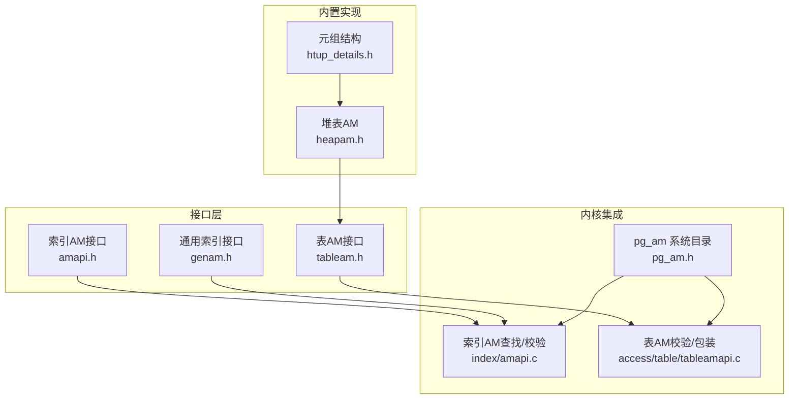
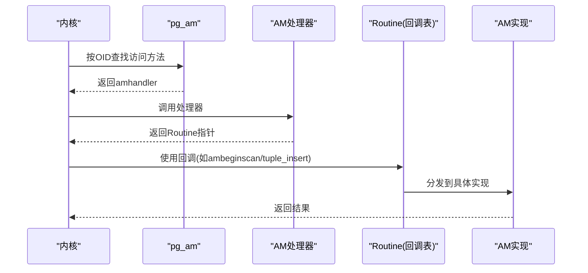
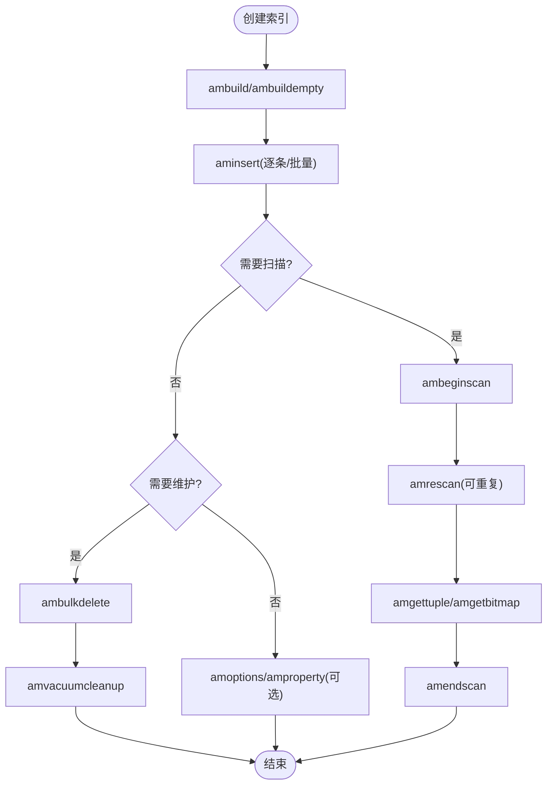
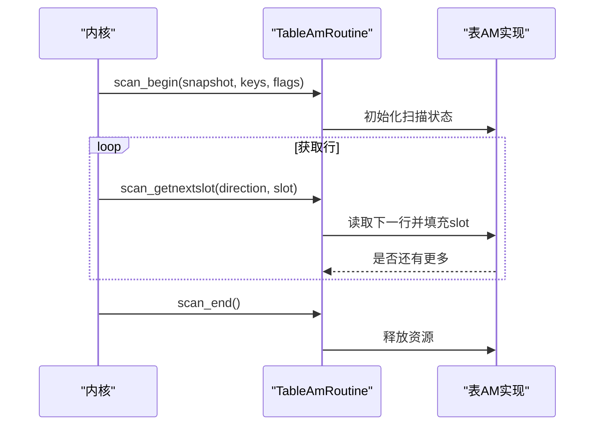
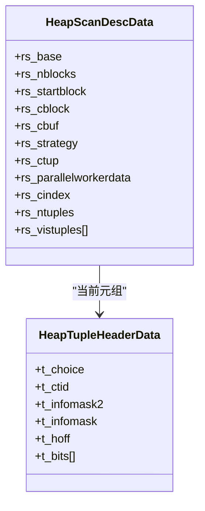
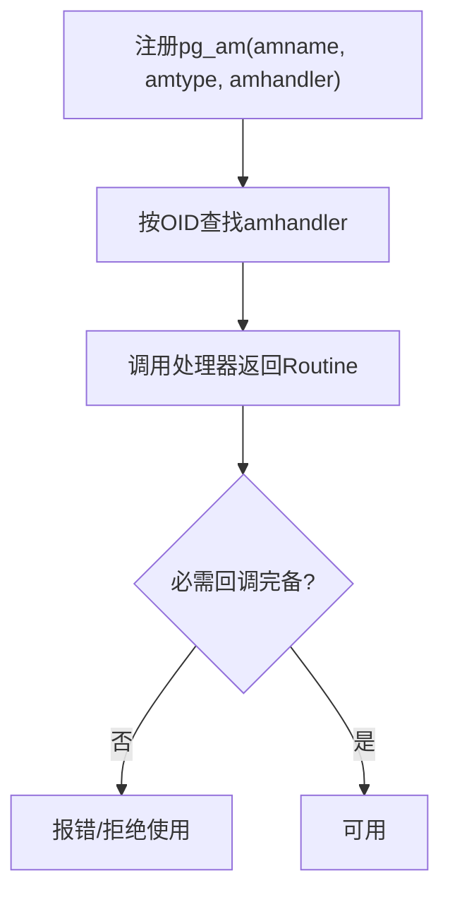
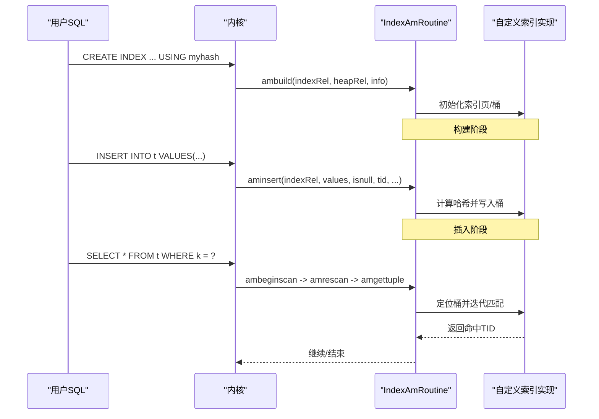
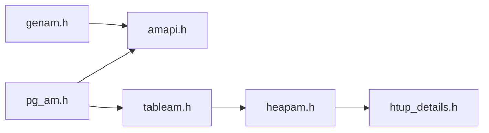

# 访问方法接口

<cite>
**本文引用的文件**
- [amapi.h](file://src/include/access/amapi.h)
- [tableam.h](file://src/include/access/tableam.h)
- [genam.h](file://src/include/access/genam.h)
- [pg_am.h](file://src/include/catalog/pg_am.h)
- [amapi.c](file://src/backend/access/index/amapi.c)
- [tableamapi.c](file://src/backend/access/table/tableamapi.c)
- [heapam.h](file://src/include/access/heapam.h)
- [htup_details.h](file://src/include/access/htup_details.h)
</cite>

## 目录
1. [简介](#简介)
2. [项目结构](#项目结构)
3. [核心组件](#核心组件)
4. [架构总览](#架构总览)
5. [详细组件分析](#详细组件分析)
6. [依赖关系分析](#依赖关系分析)
7. [性能考虑](#性能考虑)
8. [故障排查指南](#故障排查指南)
9. [结论](#结论)
10. [附录](#附录)

## 简介
本文件面向希望扩展 Mini PostgreSQL 存储与索引能力的开发者，系统化阐述“访问方法（Access Method, AM）”抽象接口的设计与实现。内容覆盖：
- 索引访问方法与表访问方法的 API 规范、回调函数与数据结构
- 自定义索引方法与表访问方法的开发步骤（必需/可选接口）
- 访问方法的验证机制、注册流程与生命周期管理
- 与 Postgres 内核的集成方式及扩展性设计哲学
- 通过具体代码路径示例展示如何实现一个简单索引方法

## 项目结构
Mini PostgreSQL 将访问方法分为两类：
- 索引访问方法（Index AM）：定义如何构建、插入、扫描、清理索引
- 表访问方法（Table AM）：定义如何对表进行扫描、插入、更新、删除、锁、VACUUM/ANALYZE 等

关键头文件与实现位置：
- 索引 AM 接口：src/include/access/amapi.h；通用索引接口：src/include/access/genam.h；索引 AM 查找与校验：src/backend/access/index/amapi.c
- 表 AM 接口：src/include/access/tableam.h；表 AM 校验与包装：src/backend/access/table/tableamapi.c
- 系统目录 pg_am：src/include/catalog/pg_am.h（声明访问方法类型与处理器）
- 堆表 AM 参考实现：src/include/access/heapam.h；元组结构：src/include/access/htup_details.h

**图示来源**
- [amapi.h:102-287](file://src/include/access/amapi.h#L102-L287)
- [tableam.h:265-800](file://src/include/access/tableam.h#L265-L800)
- [genam.h:130-195](file://src/include/access/genam.h#L130-L195)
- [pg_am.h:29-63](file://src/include/catalog/pg_am.h#L29-L63)
- [amapi.c:55-103](file://src/backend/access/index/amapi.c#L55-L103)
- [tableamapi.c:46-83](file://src/backend/access/table/tableamapi.c#L46-L83)
- [heapam.h:117-191](file://src/include/access/heapam.h#L117-L191)
- [htup_details.h:152-180](file://src/include/access/htup_details.h#L152-L180)

**章节来源**
- [amapi.h:102-287](file://src/include/access/amapi.h#L102-L287)
- [tableam.h:265-800](file://src/include/access/tableam.h#L265-L800)
- [genam.h:130-195](file://src/include/access/genam.h#L130-L195)
- [pg_am.h:29-63](file://src/include/catalog/pg_am.h#L29-L63)
- [amapi.c:55-103](file://src/backend/access/index/amapi.c#L55-L103)
- [tableamapi.c:46-83](file://src/backend/access/table/tableamapi.c#L46-L83)
- [heapam.h:117-191](file://src/include/access/heapam.h#L117-L191)
- [htup_details.h:152-180](file://src/include/access/htup_details.h#L152-L180)

## 核心组件
- 索引访问方法（Index AM）
  - 通过 IndexAmRoutine 描述能力与回调（构建、插入、扫描、成本估算、选项解析、属性查询、并行扫描支持等）
  - 通过 amproperty 暴露 AM/索引/列级属性
  - 通过 amvalidate/amadjustmembers 完成操作族/支持函数的校验与调整
- 表访问方法（Table AM）
  - 通过 TableAmRoutine 描述表级行为（扫描、索引回表、元组读写、锁、DDL、VACUUM/ANALYZE、TOAST、估计大小、位图扫描等）
  - 提供 TM_Result/TM_FailureData 等统一结果模型
- 通用索引接口（genam）
  - 对外暴露 index_insert/index_beginscan/index_getnext_* 等统一入口，屏蔽不同索引实现差异
- 系统目录 pg_am
  - 记录访问方法名称、类型（索引/表）、处理器函数 OID，用于运行时查找并实例化对应 Routine

**章节来源**
- [amapi.h:102-287](file://src/include/access/amapi.h#L102-L287)
- [tableam.h:265-800](file://src/include/access/tableam.h#L265-L800)
- [genam.h:130-195](file://src/include/access/genam.h#L130-L195)
- [pg_am.h:29-63](file://src/include/catalog/pg_am.h#L29-L63)

## 架构总览
访问方法框架采用“接口+回调+系统目录注册”的模式：
- 内核在启动或对象创建时，根据 pg_am 中的 amhandler 调用处理器函数，返回对应的 Routine（IndexAmRoutine 或 TableAmRoutine）
- 内核通过 Routine 中的回调执行具体逻辑
- 所有回调由 AM 实现，保证可扩展性与隔离性

**图示来源**
- [pg_am.h:29-63](file://src/include/catalog/pg_am.h#L29-L63)
- [amapi.c:55-103](file://src/backend/access/index/amapi.c#L55-L103)
- [amapi.h:102-287](file://src/include/access/amapi.h#L102-L287)
- [tableam.h:265-800](file://src/include/access/tableam.h#L265-L800)

## 详细组件分析

### 索引访问方法（Index AM）API 与生命周期
- 能力与回调
  - 构建：ambuild/ambuildempty
  - 插入：aminsert（含唯一性检查策略）
  - 维护：ambulkdelete/amvacuumcleanup
  - 扫描：ambeginscan/amrescan/amgettuple/amgetbitmap/amendscan/ammarkpos/amrestrpos
  - 成本与属性：amcostestimate/amproperty
  - 选项与校验：amoptions/amvalidate/amadjustmembers
  - 并行：amestimateparallelscan/aminitparallelscan/amparallelrescan
- 生命周期
  - 创建索引：ambuild → 批量插入数据
  - 运行期：aminsert 单条插入；扫描时 ambeginscan → amrescan → amgettuple/amgetbitmap → amendscan
  - 维护：ambulkdelete → amvacuumcleanup
  - 选项/属性：amoptions/amproperty 按需调用
  - 校验：amvalidate/amadjustmembers 在操作族/算子族变更时调用

**图示来源**
- [amapi.h:102-287](file://src/include/access/amapi.h#L102-L287)
- [genam.h:144-195](file://src/include/access/genam.h#L144-L195)

**章节来源**
- [amapi.h:102-287](file://src/include/access/amapi.h#L102-L287)
- [genam.h:144-195](file://src/include/access/genam.h#L144-L195)

### 表访问方法（Table AM）API 与生命周期
- 扫描
  - scan_begin/scan_rescan/scan_getnextslot/scan_end
  - 可选范围扫描：scan_set_tidrange/scan_getnextslot_tidrange
  - 并行：parallelscan_estimate/initialize/reinitialize
- 索引回表
  - index_fetch_begin/reset/end/fetch_tuple
- 元组操作
  - tuple_insert/multi_insert/tuple_update/tuple_delete/tuple_lock
  - 失败信息：TM_FailureData
  - 可见性：tuple_satisfies_snapshot/tuple_tid_valid/tuple_get_latest_tid
- DDL与维护
  - relation_set_new_filenode/relation_nontransactional_truncate/relation_copy_data/relation_copy_for_cluster
  - relation_vacuum/scan_analyze_next_block/scan_analyze_next_tuple
  - 估计：relation_estimate_size
  - TOAST：relation_needs_toast_table/relation_toast_am/relation_fetch_toast_slice
  - 位图扫描：scan_bitmap_next_block/scan_bitmap_next_tuple（可选）

**图示来源**
- [tableam.h:303-328](file://src/include/access/tableam.h#L303-L328)
- [tableam.h:485-540](file://src/include/access/tableam.h#L485-L540)

**章节来源**
- [tableam.h:303-328](file://src/include/access/tableam.h#L303-L328)
- [tableam.h:485-540](file://src/include/access/tableam.h#L485-L540)

### 元组与可见性基础
- 元组头部 HeapTupleHeaderData 包含事务可见性字段（xmin/xmax/cmin/cmax/xvac）、t_ctid、标志位等
- 访问方法需遵循 MVCC 语义，结合快照判断可见性
- 堆表 AM 提供大量可见性与锁相关工具函数

**图示来源**
- [htup_details.h:152-180](file://src/include/access/htup_details.h#L152-L180)
- [heapam.h:47-79](file://src/include/access/heapam.h#L47-L79)

**章节来源**
- [htup_details.h:152-180](file://src/include/access/htup_details.h#L152-L180)
- [heapam.h:47-79](file://src/include/access/heapam.h#L47-L79)

### 访问方法注册与验证
- 注册
  - 在 pg_am 中登记访问方法名、类型（索引/表）与处理器函数 OID
  - 处理器函数负责返回全局静态的 Routine 实例
- 验证
  - 索引 AM：amvalidate/amadjustmembers 校验操作族/支持函数配置
  - 表 AM：tableamapi 断言必需回调已设置，确保一致性

**图示来源**
- [pg_am.h:29-63](file://src/include/catalog/pg_am.h#L29-L63)
- [amapi.c:55-103](file://src/backend/access/index/amapi.c#L55-L103)
- [tableamapi.c:46-83](file://src/backend/access/table/tableamapi.c#L46-L83)

**章节来源**
- [pg_am.h:29-63](file://src/include/catalog/pg_am.h#L29-L63)
- [amapi.c:55-103](file://src/backend/access/index/amapi.c#L55-L103)
- [tableamapi.c:46-83](file://src/backend/access/table/tableamapi.c#L46-L83)

### 开发自定义索引方法：最小可行实现
目标：实现一个基于哈希的简单索引方法，支持基本构建、插入、扫描。

- 必需回调
  - ambuild：构建空索引结构
  - aminsert：插入键值与TID
  - ambeginscan/amrescan/amgettuple/amendscan：扫描遍历
  - amcostestimate：为优化器提供成本估算
  - amvalidate：校验操作族/支持函数
- 可选回调
  - amgetbitmap：返回TID位图
  - amproperty：暴露AM/列属性
  - amoptions：解析索引选项
  - 并行扫描回调：若支持并行

**图示来源**
- [amapi.h:102-287](file://src/include/access/amapi.h#L102-L287)
- [genam.h:144-195](file://src/include/access/genam.h#L144-L195)

**章节来源**
- [amapi.h:102-287](file://src/include/access/amapi.h#L102-L287)
- [genam.h:144-195](file://src/include/access/genam.h#L144-L195)

### 与内核的集成要点
- 通过 pg_am 登记访问方法，处理器返回全局静态 Routine
- 内核在需要时通过 Routine 回调执行具体逻辑
- 表 AM 必须实现扫描、索引回表、元组修改、锁、维护等关键路径
- 索引 AM 需配合优化器的成本估算与属性查询，以参与计划选择

**章节来源**
- [pg_am.h:29-63](file://src/include/catalog/pg_am.h#L29-L63)
- [tableam.h:265-800](file://src/include/access/tableam.h#L265-L800)
- [amapi.h:102-287](file://src/include/access/amapi.h#L102-L287)

## 依赖关系分析
- 索引 AM 依赖
  - genam 提供的通用索引接口
  - amapi 定义的 IndexAmRoutine 与回调
  - 系统目录 pg_am 的处理器查找
- 表 AM 依赖
  - tableam 定义的 TableAmRoutine 与回调
  - 元组结构与可见性工具（htup/heapam）
  - 系统目录 pg_am 的处理器查找

**图示来源**
- [genam.h:130-195](file://src/include/access/genam.h#L130-L195)
- [amapi.h:102-287](file://src/include/access/amapi.h#L102-L287)
- [pg_am.h:29-63](file://src/include/catalog/pg_am.h#L29-L63)
- [tableam.h:265-800](file://src/include/access/tableam.h#L265-L800)
- [heapam.h:117-191](file://src/include/access/heapam.h#L117-L191)
- [htup_details.h:152-180](file://src/include/access/htup_details.h#L152-L180)

**章节来源**
- [genam.h:130-195](file://src/include/access/genam.h#L130-L195)
- [amapi.h:102-287](file://src/include/access/amapi.h#L102-L287)
- [pg_am.h:29-63](file://src/include/catalog/pg_am.h#L29-L63)
- [tableam.h:265-800](file://src/include/access/tableam.h#L265-L800)
- [heapam.h:117-191](file://src/include/access/heapam.h#L117-L191)
- [htup_details.h:152-180](file://src/include/access/htup_details.h#L152-L180)

## 性能考虑
- 索引 AM
  - 合理实现 amcostestimate，避免误导优化器
  - 支持 amgetbitmap 可减少回表次数
  - 合理使用 amsearcharray/amsearchnulls 等特性提升特定查询性能
- 表 AM
  - 利用 scan_set_tidrange 与位图扫描减少随机I/O
  - 正确实现 index_fetch_tuple 的 call_again/all_dead 语义，避免重复回表
  - 在 VACUUM/ANALYZE 中高效回收空间与统计信息
- 并发与并行
  - 索引 AM 的并行扫描回调需正确共享状态
  - 表 AM 的并行扫描初始化/重初始化需保证线程安全

[本节为通用指导，不直接分析具体文件]

## 故障排查指南
- 访问方法未找到或类型错误
  - 检查 pg_am 中 amtype 是否为 INDEX/TABLE，amhandler 是否有效
  - 参考：[amapi.c:55-103](file://src/backend/access/index/amapi.c#L55-L103)
- 必需回调缺失
  - 表 AM 会在 tableamapi 中断言必需回调，若缺失会报错
  - 参考：[tableamapi.c:46-83](file://src/backend/access/table/tableamapi.c#L46-L83)
- 元组可见性问题
  - 确认正确使用快照与可见性判断，注意 t_infomask 标志位
  - 参考：[htup_details.h:152-180](file://src/include/access/htup_details.h#L152-L180)
- 扫描状态泄漏
  - 确保 scan_begin/scan_end 成对调用，并行扫描需正确初始化/重初始化
  - 参考：[tableam.h:303-328](file://src/include/access/tableam.h#L303-L328)

**章节来源**
- [amapi.c:55-103](file://src/backend/access/index/amapi.c#L55-L103)
- [tableamapi.c:46-83](file://src/backend/access/table/tableamapi.c#L46-L83)
- [htup_details.h:152-180](file://src/include/access/htup_details.h#L152-L180)
- [tableam.h:303-328](file://src/include/access/tableam.h#L303-L328)

## 结论
Mini PostgreSQL 的访问方法框架通过清晰的接口与回调机制，将索引与表的存储细节从内核中解耦，提供了强大的扩展能力。开发者只需实现相应的 Routine 回调并在 pg_am 中注册，即可无缝集成新的索引或表存储引擎。遵循 MVCC 语义、完善成本估算与属性查询、正确处理并发与并行，是实现高性能访问方法的关键。

[本节为总结，不直接分析具体文件]

## 附录
- 快速对照：索引 AM 与表 AM 的核心回调
  - 索引 AM：ambuild/ambuildempty、aminsert、ambeginscan/amrescan/amgettuple/amgetbitmap/amendscan、amcostestimate、amproperty、amoptions、amvalidate/amadjustmembers、并行扫描回调
  - 表 AM：scan_begin/scan_rescan/scan_getnextslot/scan_end、index_fetch_*、tuple_insert/multi_insert/tuple_update/tuple_delete/tuple_lock、relation_*、scan_analyze_*、relation_estimate_size、TOAST 相关回调
- 参考路径
  - 索引 AM 接口：[amapi.h:102-287](file://src/include/access/amapi.h#L102-L287)
  - 表 AM 接口：[tableam.h:265-800](file://src/include/access/tableam.h#L265-L800)
  - 通用索引接口：[genam.h:130-195](file://src/include/access/genam.h#L130-L195)
  - 系统目录：[pg_am.h:29-63](file://src/include/catalog/pg_am.h#L29-L63)
  - 堆表 AM：[heapam.h:117-191](file://src/include/access/heapam.h#L117-L191)
  - 元组结构：[htup_details.h:152-180](file://src/include/access/htup_details.h#L152-L180)

[本节为补充说明，不直接分析具体文件]