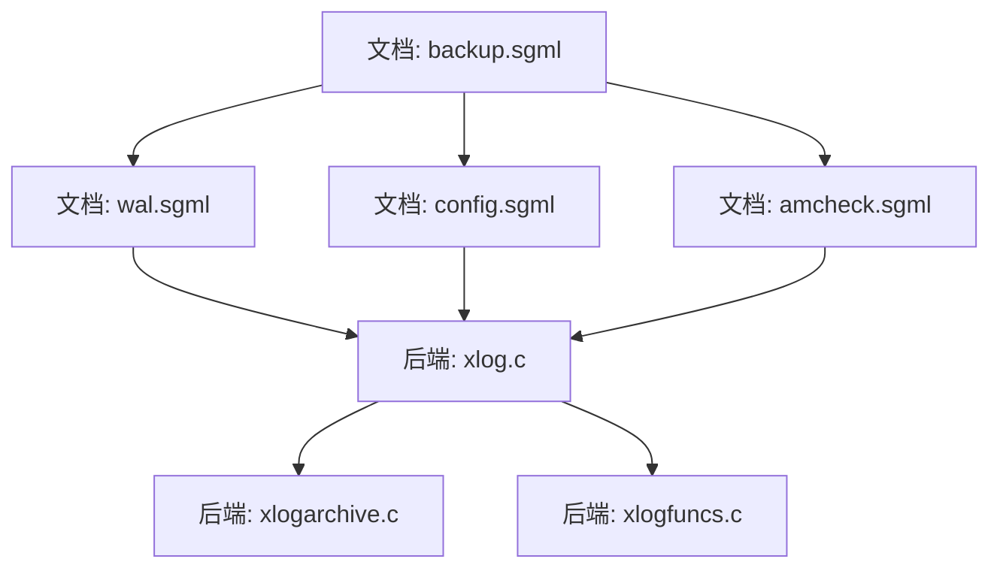
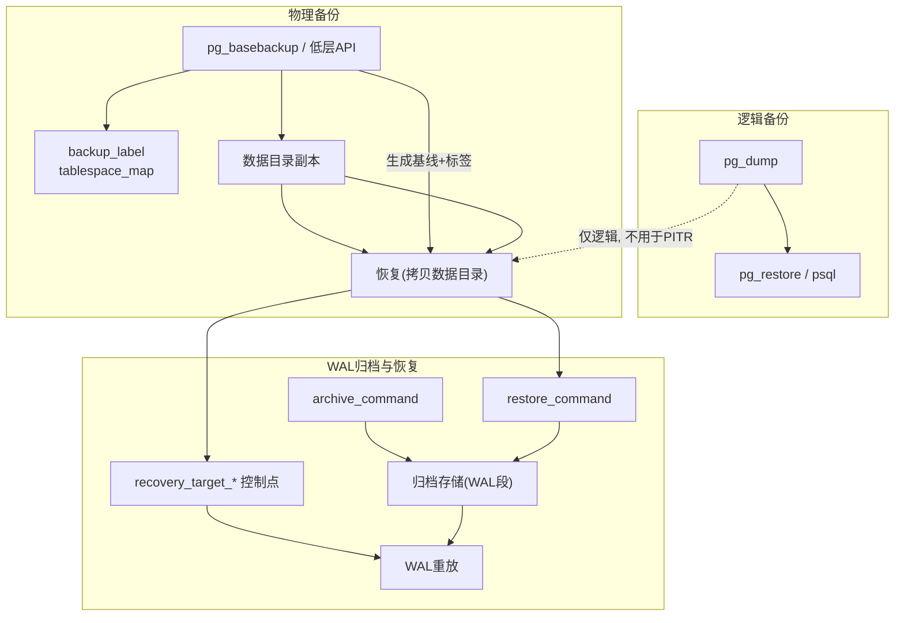
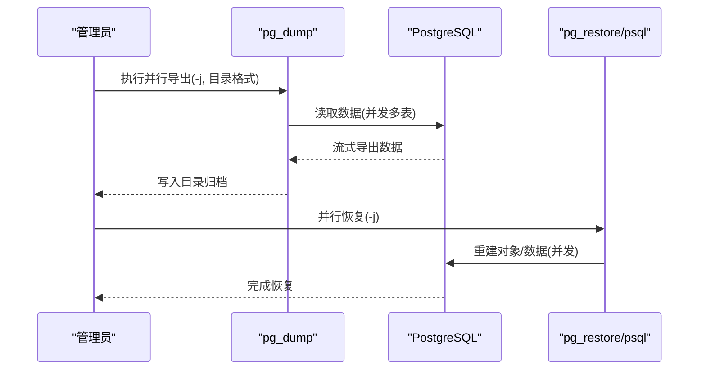
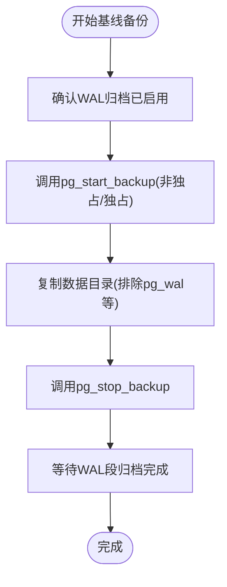
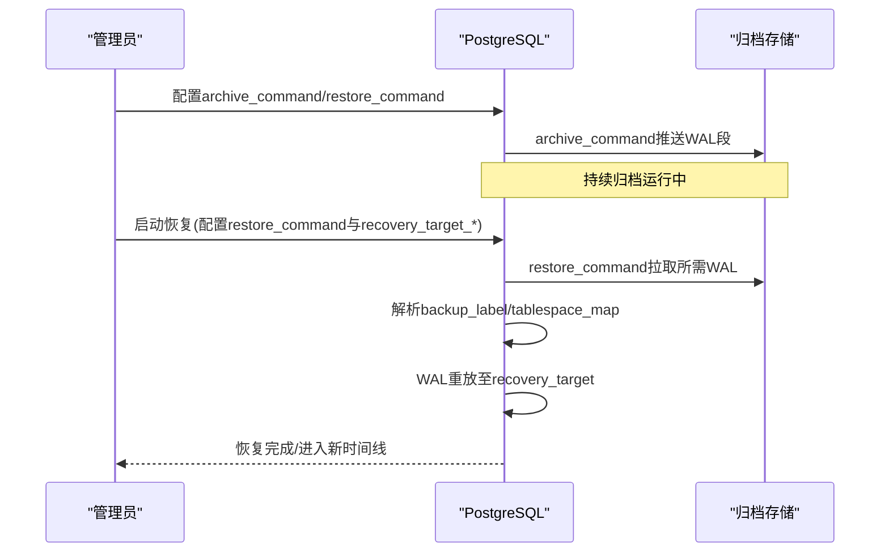
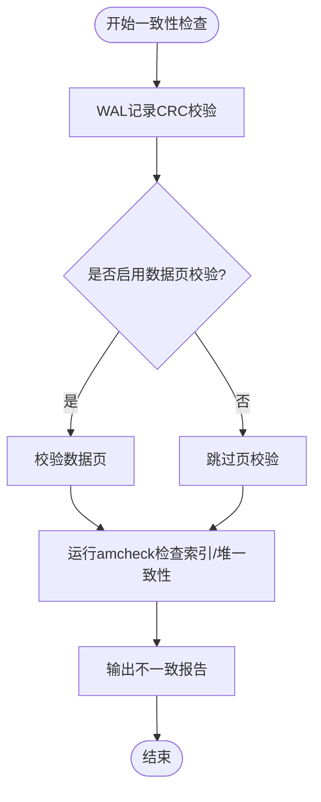
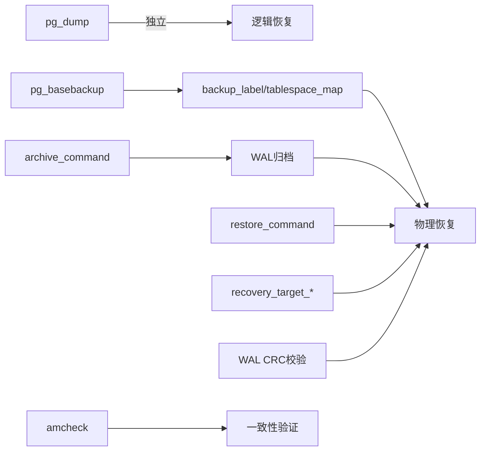

# 备份恢复

<cite>
**本文引用的文件**
- [backup.sgml](file://doc/src/sgml/backup.sgml)
- [wal.sgml](file://doc/src/sgml/wal.sgml)
- [config.sgml](file://doc/src/sgml/config.sgml)
- [amcheck.sgml](file://doc/src/sgml/amcheck.sgml)
- [xlog.c](file://src/backend/access/transam/xlog.c)
- [xlogarchive.c](file://src/backend/access/transam/xlogarchive.c)
- [xlogfuncs.c](file://src/backend/access/transam/xlogfuncs.c)
</cite>

## 目录
1. [简介](#简介)
2. [项目结构](#项目结构)
3. [核心组件](#核心组件)
4. [架构总览](#架构总览)
5. [详细组件分析](#详细组件分析)
6. [依赖关系分析](#依赖关系分析)
7. [性能考虑](#性能考虑)
8. [故障排查指南](#故障排查指南)
9. [结论](#结论)
10. [附录](#附录)

## 简介
本文件面向PostgreSQL的备份与恢复策略，系统阐述逻辑备份与物理备份的区别、适用场景；文档化pg_dump/pg_restore的使用要点（含并行备份与恢复）；详细说明基于WAL的连续归档与时间点恢复（PITR）配置；提供灾难恢复演练流程与故障恢复操作指南；并给出数据一致性验证与备份完整性检查方法。内容严格依据仓库中的官方文档与后端实现源码整理而成。

## 项目结构
围绕备份恢复的关键资料主要分布在以下位置：
- 文档层：doc/src/sgml/backup.sgml、doc/src/sgml/wal.sgml、doc/src/sgml/config.sgml、doc/src/sgml/amcheck.sgml
- 后端实现层：src/backend/access/transam/xlog.c、xlogarchive.c、xlogfuncs.c

图表来源
- [backup.sgml:1-1200](file://doc/src/sgml/backup.sgml#L1-L1200)
- [wal.sgml:1-200](file://doc/src/sgml/wal.sgml#L1-L200)
- [config.sgml:3251-3268](file://doc/src/sgml/config.sgml#L3251-L3268)
- [amcheck.sgml:372-397](file://doc/src/sgml/amcheck.sgml#L372-L397)
- [xlog.c:5606-5640](file://src/backend/access/transam/xlog.c#L5606-L5640)
- [xlog.c:6624-7054](file://src/backend/access/transam/xlog.c#L6624-L7054)
- [xlog.c:10646-11849](file://src/backend/access/transam/xlog.c#L10646-L11849)
- [xlogarchive.c:65-226](file://src/backend/access/transam/xlogarchive.c#L65-L226)
- [xlogfuncs.c:661-714](file://src/backend/access/transam/xlogfuncs.c#L661-L714)

章节来源
- [backup.sgml:1-1200](file://doc/src/sgml/backup.sgml#L1-L1200)
- [wal.sgml:1-200](file://doc/src/sgml/wal.sgml#L1-L200)
- [config.sgml:3251-3268](file://doc/src/sgml/config.sgml#L3251-L3268)
- [amcheck.sgml:372-397](file://doc/src/sgml/amcheck.sgml#L372-L397)
- [xlog.c:5606-5640](file://src/backend/access/transam/xlog.c#L5606-L5640)
- [xlog.c:6624-7054](file://src/backend/access/transam/xlog.c#L6624-L7054)
- [xlog.c:10646-11849](file://src/backend/access/transam/xlog.c#L10646-L11849)
- [xlogarchive.c:65-226](file://src/backend/access/transam/xlogarchive.c#L65-L226)
- [xlogfuncs.c:661-714](file://src/backend/access/transam/xlogfuncs.c#L661-L714)

## 核心组件
- 逻辑备份与恢复：pg_dump/pg_restore（文本、自定义、目录格式），支持并行导出/导入，适合跨版本迁移、跨架构迁移、单库/对象级恢复。
- 物理备份与恢复：文件系统级备份 + WAL归档，结合基线备份与WAL重放，可实现PITR与热备。
- WAL连续归档：通过archive_command将完成的WAL段归档到安全存储，配合restore_command在恢复时拉取WAL。
- PITR与时间线：recovery_target_*系列参数控制恢复目标；时间线机制避免历史分支冲突。
- 一致性校验：amcheck扩展用于索引/堆表一致性检查；WAL记录自带CRC校验；可结合数据页校验等机制。

章节来源
- [backup.sgml:27-355](file://doc/src/sgml/backup.sgml#L27-L355)
- [backup.sgml:473-773](file://doc/src/sgml/backup.sgml#L473-L773)
- [backup.sgml:775-1200](file://doc/src/sgml/backup.sgml#L775-L1200)
- [wal.sgml:1-200](file://doc/src/sgml/wal.sgml#L1-L200)
- [config.sgml:3251-3268](file://doc/src/sgml/config.sgml#L3251-L3268)
- [amcheck.sgml:372-397](file://doc/src/sgml/amcheck.sgml#L372-L397)

## 架构总览
下图展示了逻辑备份、物理备份与WAL归档/PITR的整体交互关系。

图表来源
- [backup.sgml:27-355](file://doc/src/sgml/backup.sgml#L27-L355)
- [backup.sgml:473-773](file://doc/src/sgml/backup.sgml#L473-L773)
- [backup.sgml:775-1200](file://doc/src/sgml/backup.sgml#L775-L1200)
- [config.sgml:3251-3268](file://doc/src/sgml/config.sgml#L3251-L3268)
- [xlog.c:5606-5640](file://src/backend/access/transam/xlog.c#L5606-L5640)

## 详细组件分析

### 逻辑备份与恢复（pg_dump/pg_restore）
- 特点
  - 输出为SQL或可定制归档格式，具备内部一致性快照。
  - 支持跨版本、跨架构迁移；可针对单库/对象恢复。
  - 不支持作为连续归档方案的一部分（非文件系统级备份）。
- 并行策略
  - 使用目录格式进行并行导出（-j），并使用pg_restore并行恢复（-j）。
- 恢复方式
  - 文本转储用psql；自定义/目录格式用pg_restore。
  - 恢复前需确保用户/角色存在，必要时从template0创建数据库。

图表来源
- [backup.sgml:27-355](file://doc/src/sgml/backup.sgml#L27-L355)

章节来源
- [backup.sgml:27-355](file://doc/src/sgml/backup.sgml#L27-L355)

### 物理备份与基线备份
- 文件系统级备份要求
  - 关闭服务或使用一致快照；或采用在线基线备份（配合WAL归档）。
  - 必须包含完整的数据目录及表空间符号链接映射。
- 在线基线备份
  - 使用pg_basebackup或低层API（pg_start_backup/pg_stop_backup）。
  - 生成backup_label与tablespace_map，二者对恢复完整性至关重要。
  - 需要保留基线期间产生的所有WAL段直至归档完成。

图表来源
- [backup.sgml:775-1200](file://doc/src/sgml/backup.sgml#L775-L1200)
- [xlog.c:10646-11849](file://src/backend/access/transam/xlog.c#L10646-L11849)

章节来源
- [backup.sgml:775-1200](file://doc/src/sgml/backup.sgml#L775-L1200)
- [xlog.c:6624-7054](file://src/backend/access/transam/xlog.c#L6624-L7054)
- [xlog.c:10646-11849](file://src/backend/access/transam/xlog.c#L10646-L11849)

### 基于WAL的连续归档与PITR
- 连续归档
  - 设置wal_level、archive_mode、archive_command，将完成的WAL段复制到归档存储。
  - archive_command需保证幂等且失败重试；注意磁盘空间与监控告警。
- 恢复与PITR
  - 恢复时配置restore_command以获取归档WAL；通过recovery_target_*指定停止点（时间、LSN、名称、XID等）。
  - 时间线（Timeline）机制确保多次PITR后历史分支互不覆盖。
- 恢复过程关键行为
  - 恢复过程中会读取backup_label/tablespace_map，并在完成后清理临时标记文件。
  - 若WAL损坏，恢复会在错误处停止，可通过调整recovery_target跳过损坏点继续。

图表来源
- [backup.sgml:473-773](file://doc/src/sgml/backup.sgml#L473-L773)
- [backup.sgml:1306-1447](file://doc/src/sgml/backup.sgml#L1306-L1447)
- [config.sgml:3251-3268](file://doc/src/sgml/config.sgml#L3251-L3268)
- [xlog.c:5606-5640](file://src/backend/access/transam/xlog.c#L5606-L5640)
- [xlogarchive.c:65-226](file://src/backend/access/transam/xlogarchive.c#L65-L226)

章节来源
- [backup.sgml:473-773](file://doc/src/sgml/backup.sgml#L473-L773)
- [backup.sgml:1306-1447](file://doc/src/sgml/backup.sgml#L1306-L1447)
- [config.sgml:3251-3268](file://doc/src/sgml/config.sgml#L3251-L3268)
- [xlog.c:5606-5640](file://src/backend/access/transam/xlog.c#L5606-L5640)
- [xlogarchive.c:65-226](file://src/backend/access/transam/xlogarchive.c#L65-L226)

### 数据一致性验证与备份完整性检查
- WAL记录保护
  - 每条WAL记录带CRC-32C校验，在崩溃恢复、归档恢复、复制时进行校验。
- 数据页校验
  - 可在初始化时开启数据页校验，增强介质错误检测能力。
- amcheck扩展
  - 用于检测索引与堆表之间的一致性不一致问题，适用于常规维护任务。
- 备份产物校验
  - 基线备份生成的backup_label与tablespace_map是恢复必需元数据，缺失或损坏将导致恢复失败。
  - 可使用pg_verifybackup（如可用）对备份清单与校验和进行验证（参考协议文档中的MANIFEST_CHECKSUMS说明）。

图表来源
- [wal.sgml:1-200](file://doc/src/sgml/wal.sgml#L1-L200)
- [amcheck.sgml:372-397](file://doc/src/sgml/amcheck.sgml#L372-L397)
- [backup.sgml:1016-1023](file://doc/src/sgml/backup.sgml#L1016-L1023)

章节来源
- [wal.sgml:1-200](file://doc/src/sgml/wal.sgml#L1-L200)
- [amcheck.sgml:372-397](file://doc/src/sgml/amcheck.sgml#L372-L397)
- [backup.sgml:1016-1023](file://doc/src/sgml/backup.sgml#L1016-L1023)

## 依赖关系分析
- 逻辑备份依赖客户端工具（pg_dump/pg_restore/psql），不依赖WAL归档。
- 物理备份依赖数据目录一致性与WAL归档连续性；恢复依赖restore_command与recovery_target_*。
- PITR依赖时间线历史与完整的WAL序列；恢复过程中会读取并处理backup_label与tablespace_map。
- 一致性校验依赖WAL CRC、可选的数据页校验以及amcheck扩展。

图表来源
- [backup.sgml:27-355](file://doc/src/sgml/backup.sgml#L27-L355)
- [backup.sgml:473-773](file://doc/src/sgml/backup.sgml#L473-L773)
- [backup.sgml:775-1200](file://doc/src/sgml/backup.sgml#L775-L1200)
- [config.sgml:3251-3268](file://doc/src/sgml/config.sgml#L3251-L3268)
- [wal.sgml:1-200](file://doc/src/sgml/wal.sgml#L1-L200)
- [amcheck.sgml:372-397](file://doc/src/sgml/amcheck.sgml#L372-L397)

章节来源
- [backup.sgml:27-355](file://doc/src/sgml/backup.sgml#L27-L355)
- [backup.sgml:473-773](file://doc/src/sgml/backup.sgml#L473-L773)
- [backup.sgml:775-1200](file://doc/src/sgml/backup.sgml#L775-L1200)
- [config.sgml:3251-3268](file://doc/src/sgml/config.sgml#L3251-L3268)
- [wal.sgml:1-200](file://doc/src/sgml/wal.sgml#L1-L200)
- [amcheck.sgml:372-397](file://doc/src/sgml/amcheck.sgml#L372-L397)

## 性能考虑
- 逻辑备份
  - 大库建议使用目录格式并行导出/导入（-j），减少整体耗时。
- 物理备份
  - 在线基线备份期间full_page_writes会被强制开启，可能带来I/O开销；合理设置checkpoint_completion_target以降低影响。
  - 归档命令应能跟上平均WAL生成速率；严重滞后会导致pg_wal膨胀甚至PANIC。
- PITR
  - 恢复时间取决于WAL量；基线间隔越久，恢复重放时间越长。
  - 时间线分支较多时，管理复杂度上升，需合理规划归档保留策略。

章节来源
- [backup.sgml:27-355](file://doc/src/sgml/backup.sgml#L27-L355)
- [backup.sgml:775-1200](file://doc/src/sgml/backup.sgml#L775-L1200)
- [backup.sgml:473-773](file://doc/src/sgml/backup.sgml#L473-L773)

## 故障排查指南
- 归档失败
  - archive_command返回非零状态会触发重试；需检查权限、路径、存储空间与脚本逻辑。
  - pg_wal目录持续增长时需立即介入，否则可能导致PANIC。
- 恢复失败
  - 若WAL损坏，恢复会在错误处停止；可调整recovery_target到损坏点之前重试。
  - 缺少backup_label或tablespace_map将导致恢复无法正确进行。
- 一致性异常
  - 使用amcheck检测索引与堆表不一致；结合数据页校验定位介质错误。
- 监控建议
  - 监控pg_stat_archiver视图，跟踪last_archived_wal与最近归档延迟。
  - 监控statement_timeout与archive_timeout，防止长时间阻塞或过度切换WAL段。

章节来源
- [backup.sgml:473-773](file://doc/src/sgml/backup.sgml#L473-L773)
- [backup.sgml:1306-1447](file://doc/src/sgml/backup.sgml#L1306-L1447)
- [xlogarchive.c:65-226](file://src/backend/access/transam/xlogarchive.c#L65-L226)
- [amcheck.sgml:372-397](file://doc/src/sgml/amcheck.sgml#L372-L397)

## 结论
- 逻辑备份适合跨版本/架构迁移与对象级恢复；物理备份+WAL归档适合高可靠与PITR需求。
- 并行导出/导入可显著提升大库备份效率；归档与恢复需完善监控与容错。
- PITR通过时间线与recovery_target_*实现精确恢复；恢复过程依赖backup_label与tablespace_map的正确性。
- 数据一致性验证应结合WAL CRC、数据页校验与amcheck，形成闭环保障。

## 附录
- 常用配置项
  - WAL归档：wal_level、archive_mode、archive_command、archive_timeout
  - 恢复目标：recovery_target、recovery_target_lsn、recovery_target_time、recovery_target_xid、recovery_target_name
- 关键文件
  - backup_label、tablespace_map：基线备份元数据，恢复必需
  - pg_wal：WAL段存放目录，归档期间需确保可写与空间充足

章节来源
- [config.sgml:3251-3268](file://doc/src/sgml/config.sgml#L3251-L3268)
- [backup.sgml:1016-1023](file://doc/src/sgml/backup.sgml#L1016-L1023)
- [backup.sgml:473-773](file://doc/src/sgml/backup.sgml#L473-L773)