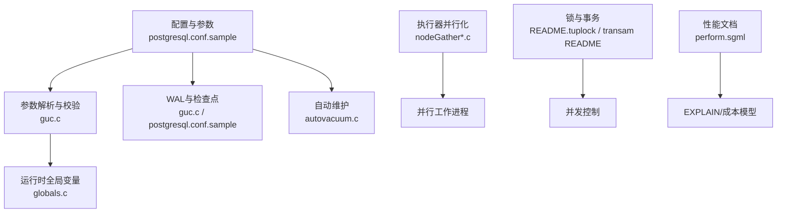
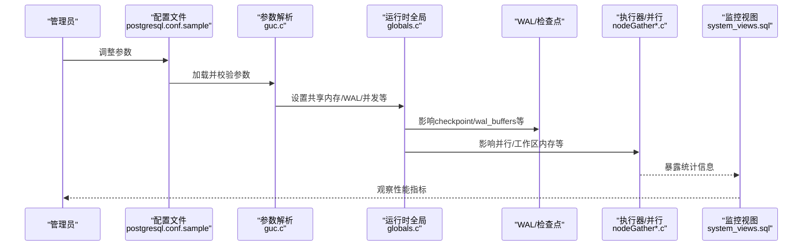
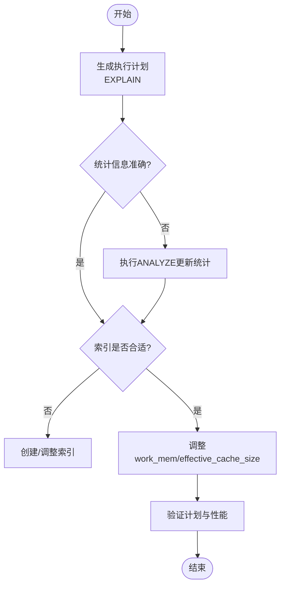
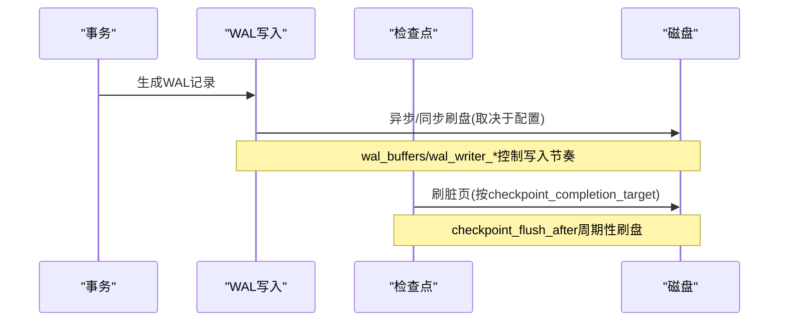
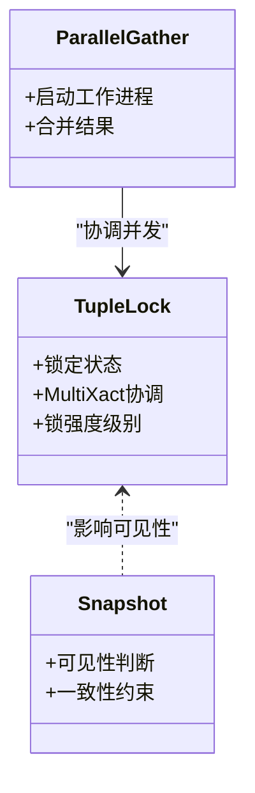
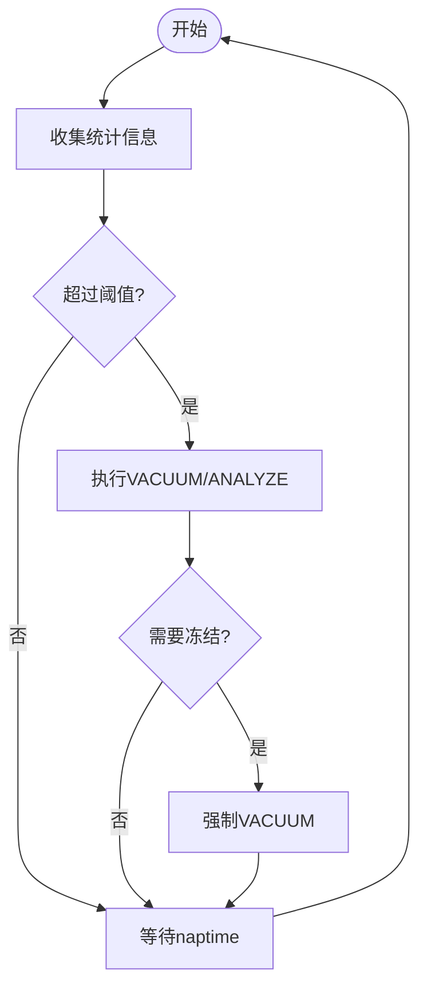
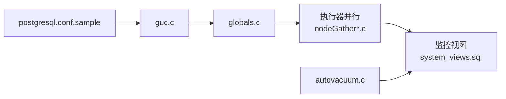

# 性能调优

<cite>
**本文引用的文件**
- [postgresql.conf.sample](file://src/backend/utils/misc/postgresql.conf.sample)
- [guc.c](file://src/backend/utils/misc/guc.c)
- [globals.c](file://src/backend/utils/init/globals.c)
- [perform.sgml](file://doc/src/sgml/perform.sgml)
- [pgbuffercache.sgml](file://doc/src/sgml/pgbuffercache.sgml)
- [system_views.sql](file://src/backend/catalog/system_views.sql)
- [autovacuum.c](file://src/backend/postmaster/autovacuum.c)
- [nodeGather.c](file://src/backend/executor/nodeGather.c)
- [nodeGatherMerge.c](file://src/backend/executor/nodeGatherMerge.c)
- [README.tuplock](file://src/backend/access/heap/README.tuplock)
- [README (transam)](file://src/backend/access/transam/README)
</cite>

## 目录
1. [简介](#简介)
2. [项目结构](#项目结构)
3. [核心组件](#核心组件)
4. [架构总览](#架构总览)
5. [详细组件分析](#详细组件分析)
6. [依赖关系分析](#依赖关系分析)
7. [性能注意事项](#性能注意事项)
8. [故障排查指南](#故障排查指南)
9. [结论](#结论)
10. [附录](#附录)

## 简介
本指南面向PostgreSQL实例的性能调优，覆盖内存参数、查询优化、I/O与WAL调优、并发控制、监控指标与基准测试方法，并结合仓库中的配置与实现细节给出可操作的实践建议。重点包括：
- 内存相关参数：shared_buffers、work_mem、effective_cache_size、maintenance_work_mem等
- 查询优化：索引策略、统计信息收集（ANALYZE/VACUUM）、查询重写与执行计划分析
- I/O与WAL：checkpoint、wal_buffers、wal_writer_*、fsync/synchronous_commit等
- 并发控制：锁粒度、事务快照一致性、并行执行
- 监控与基准：pg_stat_*视图、pg_buffercache、EXPLAIN/ANALYZE、压测方法

## 项目结构
本仓库为PostgreSQL源码树，关键路径与职责概览：
- src/backend/utils/misc/postgresql.conf.sample：默认配置项参考，包含内存、WAL、检查点、自动清理等
- src/backend/utils/misc/guc.c：GUC参数定义与校验，含内存、WAL、检查点、并发等参数
- doc/src/sgml/perform.sgml：官方性能文档，讲解EXPLAIN、成本模型、统计信息等
- src/backend/postmaster/autovacuum.c：自动VACUUM/ANALYZE调度与阈值计算
- src/backend/executor/nodeGather*.c：并行执行节点，涉及并行工作进程管理
- src/backend/access/heap/README.tuplock：元组级锁机制说明
- src/backend/access/transam/README：事务开始/结束与快照的一致性约束
- src/backend/catalog/system_views.sql：系统视图定义，如pg_stat_activity

图表来源
- [postgresql.conf.sample:78-194](file://src/backend/utils/misc/postgresql.conf.sample#L78-L194)
- [guc.c:1921-2035](file://src/backend/utils/misc/guc.c#L1921-L2035)
- [globals.c:123-146](file://src/backend/utils/init/globals.c#L123-L146)
- [autovacuum.c:2766-2804](file://src/backend/postmaster/autovacuum.c#L2766-L2804)
- [nodeGather.c:141-229](file://src/backend/executor/nodeGather.c#L141-L229)
- [nodeGatherMerge.c:225-273](file://src/backend/executor/nodeGatherMerge.c#L225-L273)
- [perform.sgml:17-199](file://doc/src/sgml/perform.sgml#L17-L199)

章节来源
- [postgresql.conf.sample:78-194](file://src/backend/utils/misc/postgresql.conf.sample#L78-L194)
- [guc.c:1921-2035](file://src/backend/utils/misc/guc.c#L1921-L2035)
- [globals.c:123-146](file://src/backend/utils/init/globals.c#L123-L146)

## 核心组件
- 内存子系统
  - shared_buffers：共享缓冲区数量，影响数据页缓存命中率
  - work_mem：每个查询工作区内存，影响排序、哈希表构建是否落盘
  - maintenance_work_mem：维护操作（VACUUM、CREATE INDEX）的内存上限
  - effective_cache_size：规划器对内核缓存+共享缓冲区的总体估计，影响扫描选择
  - temp_buffers、huge_pages、dynamic_shared_memory_type等辅助参数
- WAL与检查点
  - wal_buffers、wal_writer_delay、wal_writer_flush_after、wal_skip_threshold
  - checkpoint_timeout、checkpoint_completion_target、checkpoint_flush_after
  - fsync、synchronous_commit、wal_sync_method、full_page_writes
- 自动维护
  - autovacuum_vacuum_threshold/scale_factor、autovacuum_analyze_threshold/scale_factor
  - autovacuum_freeze_max_age、multixact_freeze_max_age
- 并行执行
  - max_parallel_workers、max_parallel_workers_per_gather、parallel_leader_participation
- 锁与事务
  - 元组级锁、MultiXact、快照一致性约束

章节来源
- [postgresql.conf.sample:78-194](file://src/backend/utils/misc/postgresql.conf.sample#L78-L194)
- [guc.c:1921-2035](file://src/backend/utils/misc/guc.c#L1921-L2035)
- [guc.c:2330-2431](file://src/backend/utils/misc/guc.c#L2330-L2431)
- [guc.c:3177-3185](file://src/backend/utils/misc/guc.c#L3177-L3185)
- [autovacuum.c:2766-2804](file://src/backend/postmaster/autovacuum.c#L2766-L2804)
- [nodeGather.c:141-229](file://src/backend/executor/nodeGather.c#L141-L229)
- [README.tuplock:1-69](file://src/backend/access/heap/README.tuplock#L1-L69)
- [README (transam):224-244](file://src/backend/access/transam/README#L224-L244)

## 架构总览
下图展示从配置到运行时的关键路径：配置参数经GUC解析后影响共享内存、WAL写入、检查点频率、自动维护策略与并行执行能力；执行器在计划阶段依据统计信息与成本模型选择最优计划；监控视图提供运行时观测能力。

图表来源
- [postgresql.conf.sample:78-194](file://src/backend/utils/misc/postgresql.conf.sample#L78-L194)
- [guc.c:1921-2035](file://src/backend/utils/misc/guc.c#L1921-L2035)
- [globals.c:123-146](file://src/backend/utils/init/globals.c#L123-L146)
- [system_views.sql:450-488](file://src/backend/catalog/system_views.sql#L450-L488)

## 详细组件分析

### 内存参数与缓存策略
- shared_buffers
  - 作用：共享缓冲区大小，直接影响热点数据页的命中与磁盘访问
  - 配置位置与范围：由GUC定义，单位为块数，最小值与最大值受限制
  - 建议：根据工作负载与物理内存比例设置，避免过大导致OS缓存竞争
- work_mem
  - 作用：单会话内排序/哈希等操作的工作内存，超过则落盘
  - 配置位置与单位：KB为单位，支持EXPLAIN输出显示
  - 建议：结合并发连接数估算峰值内存占用，避免过多临时文件
- effective_cache_size
  - 作用：规划器假设的数据缓存总量（内核缓存+共享缓冲），影响顺序扫描与索引扫描的选择
  - 建议：设置为操作系统可用缓存的合理估计，帮助规划器做出更优决策
- maintenance_work_mem
  - 作用：维护操作（VACUUM、索引创建）的内存上限
  - 建议：提升批量维护速度，但需考虑对整体内存压力的影响
- 其他
  - huge_pages、temp_buffers、dynamic_shared_memory_type等用于进一步优化内存分配与共享内存机制

章节来源
- [guc.c:1921-2035](file://src/backend/utils/misc/guc.c#L1921-L2035)
- [guc.c:2847-2880](file://src/backend/utils/misc/guc.c#L2847-L2880)
- [postgresql.conf.sample:78-110](file://src/backend/utils/misc/postgresql.conf.sample#L78-L110)

### 查询优化与统计信息
- EXPLAIN与成本模型
  - 使用EXPLAIN查看计划节点、启动成本与总成本，理解顺序扫描、索引扫描、位图扫描等
  - 成本基于seq_page_cost、cpu_tuple_cost等参数，反映磁盘与CPU开销
- 统计信息收集
  - ANALYZE更新列分布、直方图等统计信息，提高选择性与成本估计准确性
  - VACUUM回收死元组，减少表膨胀，提升扫描效率
- 索引策略
  - 选择合适的索引类型（btree、hash、gin、gist等），匹配查询谓词
  - 关注索引选择性、相关性、覆盖索引以减少回表
- 查询重写
  - 利用规则与视图简化复杂查询，注意重写后的计划变化
  - 通过EXPLAIN验证重写效果

图表来源
- [perform.sgml:17-199](file://doc/src/sgml/perform.sgml#L17-L199)
- [autovacuum.c:2766-2804](file://src/backend/postmaster/autovacuum.c#L2766-L2804)
- [guc.c:2847-2880](file://src/backend/utils/misc/guc.c#L2847-L2880)

章节来源
- [perform.sgml:17-199](file://doc/src/sgml/perform.sgml#L17-L199)
- [autovacuum.c:2766-2804](file://src/backend/postmaster/autovacuum.c#L2766-L2804)

### I/O与WAL调优
- WAL参数
  - wal_buffers：WAL写缓冲大小，影响提交延迟与吞吐
  - wal_writer_delay、wal_writer_flush_after：控制WAL写入周期与触发刷盘量
  - wal_skip_threshold：新文件初始化时跳过WAL的最小大小
- 检查点
  - checkpoint_timeout：最大检查点间隔
  - checkpoint_completion_target：检查点期间脏页刷盘目标占比
  - checkpoint_flush_after：周期性刷盘阈值
- 同步策略
  - fsync、synchronous_commit、wal_sync_method：平衡数据安全与性能
  - full_page_writes：防止部分页写入导致的恢复问题

图表来源
- [guc.c:2330-2431](file://src/backend/utils/misc/guc.c#L2330-L2431)
- [guc.c:3177-3185](file://src/backend/utils/misc/guc.c#L3177-L3185)
- [postgresql.conf.sample:152-194](file://src/backend/utils/misc/postgresql.conf.sample#L152-L194)

章节来源
- [guc.c:2330-2431](file://src/backend/utils/misc/guc.c#L2330-L2431)
- [postgresql.conf.sample:152-194](file://src/backend/utils/misc/postgresql.conf.sample#L152-L194)

### 并发控制与并行执行
- 元组级锁与MultiXact
  - 元组头标记锁定状态，多事务并发锁用MultiXact协调
  - 锁强度分级（UPDATE、NO KEY UPDATE、SHARE、KEY SHARE）
- 事务快照一致性
  - 保证快照中已提交事务的可见性一致，避免不一致读取
- 并行执行
  - Gather/GatherMerge节点负责并行工作进程管理与结果合并
  - 通过max_parallel_workers等参数控制并行度

图表来源
- [README.tuplock:1-69](file://src/backend/access/heap/README.tuplock#L1-L69)
- [README (transam):224-244](file://src/backend/access/transam/README#L224-L244)
- [nodeGather.c:141-229](file://src/backend/executor/nodeGather.c#L141-L229)
- [nodeGatherMerge.c:225-273](file://src/backend/executor/nodeGatherMerge.c#L225-L273)

章节来源
- [README.tuplock:1-69](file://src/backend/access/heap/README.tuplock#L1-L69)
- [README (transam):224-244](file://src/backend/access/transam/README#L224-L244)
- [nodeGather.c:141-229](file://src/backend/executor/nodeGather.c#L141-L229)
- [nodeGatherMerge.c:225-273](file://src/backend/executor/nodeGatherMerge.c#L225-L273)

### 自动维护（VACUUM/ANALYZE）
- 阈值计算
  - 基于表大小与更新/插入计数，动态决定是否需要VACUUM或ANALYZE
  - 支持针对INSERT的独立阈值与缩放因子
- 冻结与多事务ID
  - autovacuum_freeze_max_age、multixact_freeze_max_age防止XID/MultiXact回绕
- 成本控制
  - vacuum_cost_delay/vacuum_cost_limit控制维护操作对在线业务的影响

图表来源
- [autovacuum.c:2766-2804](file://src/backend/postmaster/autovacuum.c#L2766-L2804)
- [guc.c:2710-2755](file://src/backend/utils/misc/guc.c#L2710-L2755)
- [guc.c:3147-3175](file://src/backend/utils/misc/guc.c#L3147-L3175)

章节来源
- [autovacuum.c:2766-2804](file://src/backend/postmaster/autovacuum.c#L2766-L2804)
- [guc.c:2710-2755](file://src/backend/utils/misc/guc.c#L2710-L2755)
- [guc.c:3147-3175](file://src/backend/utils/misc/guc.c#L3147-L3175)

## 依赖关系分析
- 配置参数依赖
  - postgresql.conf.sample提供默认值与注释，guc.c定义参数类型、范围与校验逻辑
  - globals.c维护运行时全局变量，如NBuffers、MaxConnections等
- 执行路径依赖
  - 执行器并行节点依赖并行工作进程资源，受max_parallel_workers等限制
  - 自动维护依赖统计信息，受track_counts与autovacuum参数影响
- 监控依赖
  - pg_stat_activity等视图依赖后端统计收集，用于诊断长事务、锁等待等

图表来源
- [postgresql.conf.sample:78-194](file://src/backend/utils/misc/postgresql.conf.sample#L78-L194)
- [guc.c:1921-2035](file://src/backend/utils/misc/guc.c#L1921-L2035)
- [globals.c:123-146](file://src/backend/utils/init/globals.c#L123-L146)
- [nodeGather.c:141-229](file://src/backend/executor/nodeGather.c#L141-L229)
- [system_views.sql:450-488](file://src/backend/catalog/system_views.sql#L450-L488)

章节来源
- [postgresql.conf.sample:78-194](file://src/backend/utils/misc/postgresql.conf.sample#L78-L194)
- [guc.c:1921-2035](file://src/backend/utils/misc/guc.c#L1921-L2035)
- [globals.c:123-146](file://src/backend/utils/init/globals.c#L123-L146)
- [nodeGather.c:141-229](file://src/backend/executor/nodeGather.c#L141-L229)
- [system_views.sql:450-488](file://src/backend/catalog/system_views.sql#L450-L488)

## 性能注意事项
- 内存调优
  - 合理设置shared_buffers与effective_cache_size，避免过度占用导致OS缓存抖动
  - 谨慎提升work_mem，评估并发连接数下的峰值内存占用
  - maintenance_work_mem用于加速批量维护，但需监控整体内存压力
- 查询优化
  - 定期ANALYZE确保统计信息准确，必要时针对热点表增加统计扩展
  - 设计合适的索引，关注选择性、覆盖性与维护成本
  - 使用EXPLAIN/ANALYZE定位瓶颈，逐步优化SQL与计划
- I/O与WAL
  - 根据业务容忍度调整synchronous_commit与fsync，平衡安全与性能
  - 调整checkpoint_completion_target与checkpoint_timeout，平滑IO尖峰
  - 监控WAL写入与检查点频率，避免频繁检查点导致性能抖动
- 并发与并行
  - 合理设置max_parallel_workers与max_parallel_workers_per_gather，避免资源争用
  - 关注锁冲突与长事务，使用pg_stat_activity与锁视图诊断
- 自动维护
  - 调整autovacuum阈值与缩放因子，适应不同表的增长模式
  - 监控freeze阈值，防止XID回绕导致的全表扫描

[本节为通用指导，不直接分析具体文件]

## 故障排查指南
- 使用EXPLAIN/ANALYZE分析慢查询，识别全表扫描、高成本节点
- 通过pg_stat_activity观察活跃会话、等待事件与长事务
- 使用pg_buffercache模块检查共享缓冲区命中率与热点页
- 监控WAL活动与检查点日志，定位写入瓶颈
- 检查自动维护是否及时执行，必要时手动触发VACUUM/ANALYZE

章节来源
- [perform.sgml:17-199](file://doc/src/sgml/perform.sgml#L17-L199)
- [pgbuffercache.sgml:1-51](file://doc/src/sgml/pgbuffercache.sgml#L1-L51)
- [system_views.sql:450-488](file://src/backend/catalog/system_views.sql#L450-L488)

## 结论
性能调优是一个持续迭代的过程，需结合工作负载特征与监控数据进行参数优化与SQL改进。建议以EXPLAIN与统计信息为基础，逐步调整内存、WAL、检查点与并行参数，并通过自动化维护保障表健康。在生产环境中，应建立完善的监控与告警机制，及时发现并处理性能退化。

[本节为总结性内容，不直接分析具体文件]

## 附录
- 常用监控视图
  - pg_stat_activity：会话状态、等待事件、查询文本
  - pg_buffercache：共享缓冲区使用情况
  - pg_stat_wal：WAL写入与同步统计
- 基准测试方法
  - 使用tpcc、sysbench等工具模拟OLTP/OLAP负载
  - 结合EXPLAIN/ANALYZE与系统监控，评估参数变更效果
  - 分阶段调整参数，记录基线对比，避免一次性大改

[本节为补充信息，不直接分析具体文件]