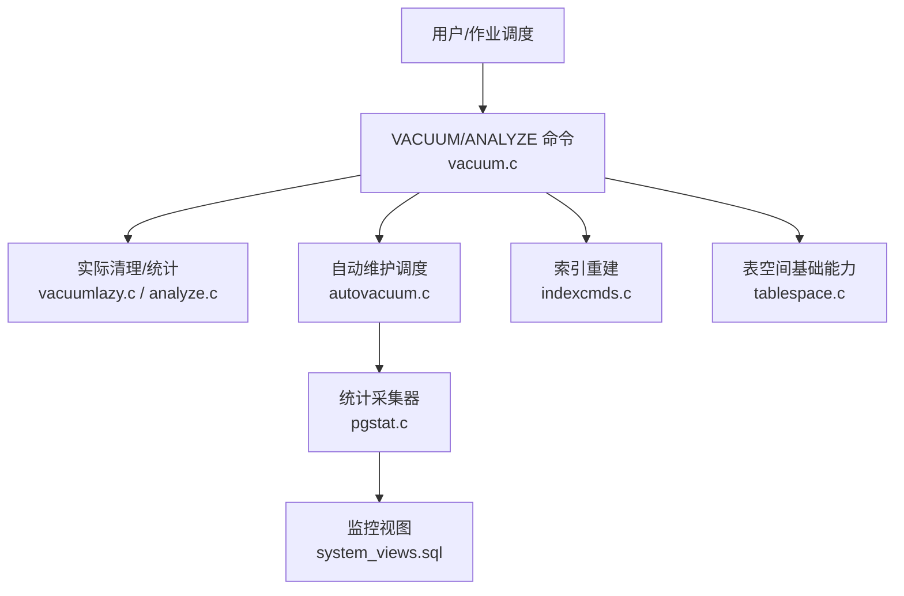
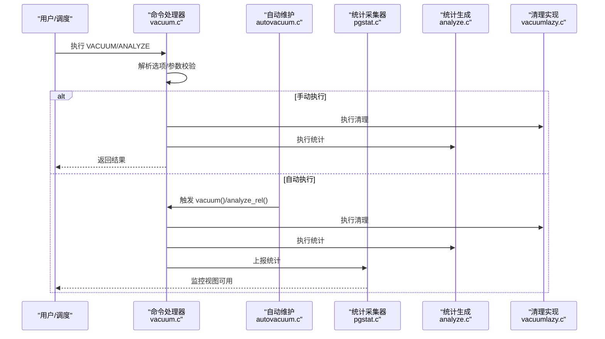
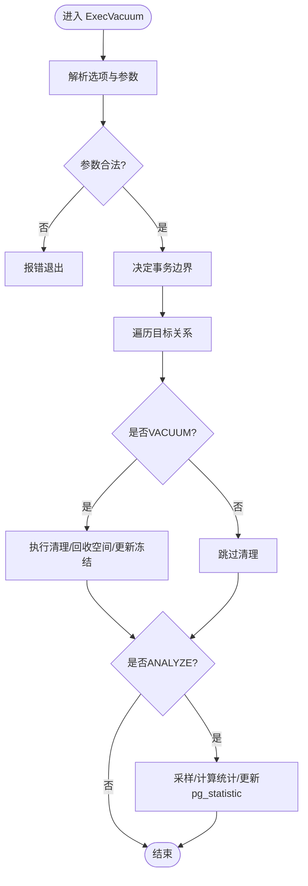
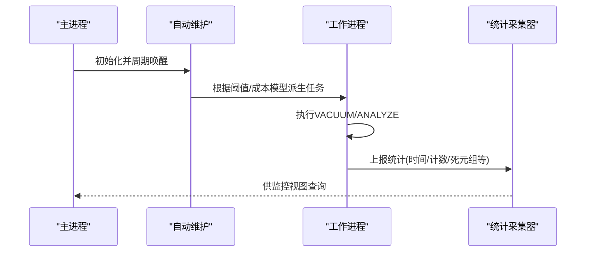
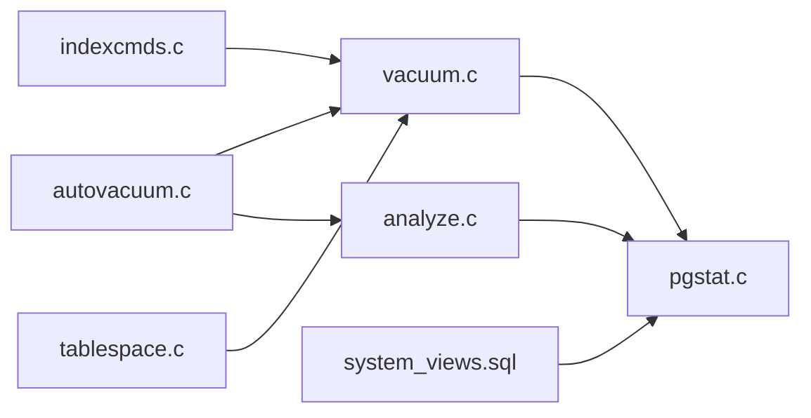

# 日常维护

<cite>
**本文引用的文件**
- [vacuum.c](file://src/backend/commands/vacuum.c)
- [analyze.c](file://src/backend/commands/analyze.c)
- [autovacuum.c](file://src/backend/postmaster/autovacuum.c)
- [pgstat.c](file://src/backend/postmaster/pgstat.c)
- [indexcmds.c](file://src/backend/commands/indexcmds.c)
- [tablespace.c](file://src/backend/commands/tablespace.c)
- [system_views.sql](file://src/backend/catalog/system_views.sql)
- [maintenance.sgml](file://doc/src/sgml/maintenance.sgml)
- [monitoring.sgml](file://doc/src/sgml/monitoring.sgml)
- [postgresql.conf.sample](file://src/backend/utils/misc/postgresql.conf.sample)
</cite>

## 目录
1. [简介](#简介)
2. [项目结构](#项目结构)
3. [核心组件](#核心组件)
4. [架构总览](#架构总览)
5. [详细组件分析](#详细组件分析)
6. [依赖关系分析](#依赖关系分析)
7. [性能考量](#性能考量)
8. [故障排查指南](#故障排查指南)
9. [结论](#结论)
10. [附录](#附录)

## 简介
本指南面向数据库管理员与运维工程师，聚焦于PostgreSQL的日常维护：VACUUM与ANALYZE的执行策略与自动化、索引重建、统计信息更新、表空间管理、健康检查与性能诊断、容量规划与资源监控，以及常见维护任务的脚本化与自动化方案。内容基于代码库中的实现与文档，确保可操作性与准确性。

## 项目结构
围绕日常维护的关键代码与文档分布如下：
- 命令层：VACUUM/ANALYZE入口与调度（vacuum.c）、统计收集（analyze.c）
- 后台进程：自动清理与自动分析（autovacuum.c）、统计聚合（pgstat.c）
- 索引与表空间：索引重建（indexcmds.c）、表空间基础能力（tablespace.c）
- 监控视图：系统统计视图定义（system_views.sql）
- 文档：维护任务说明（maintenance.sgml）、监控章节（monitoring.sgml）、配置示例（postgresql.conf.sample）

图表来源
- [vacuum.c:99-269](file://src/backend/commands/vacuum.c#L99-L269)
- [analyze.c:123-212](file://src/backend/commands/analyze.c#L123-L212)
- [autovacuum.c:2975-3002](file://src/backend/postmaster/autovacuum.c#L2975-L3002)
- [pgstat.c:5089-5141](file://src/backend/postmaster/pgstat.c#L5089-L5141)
- [indexcmds.c:87-98](file://src/backend/commands/indexcmds.c#L87-L98)
- [tablespace.c:69-156](file://src/backend/commands/tablespace.c#L69-L156)
- [system_views.sql:450-524](file://src/backend/catalog/system_views.sql#L450-L524)

章节来源
- [maintenance.sgml:14-45](file://doc/src/sgml/maintenance.sgml#L14-L45)
- [monitoring.sgml:16-34](file://doc/src/sgml/monitoring.sgml#L16-L34)

## 核心组件
- VACUUM/ANALYZE 命令执行入口：解析选项、参数校验、事务控制、并行度控制、调用具体清理/统计逻辑。
- 自动维护（Autovacuum）：守护进程与工作进程，依据阈值与成本模型触发VACUUM/ANALYZE，并上报统计。
- 统计收集器：汇总各后端进程的统计信息，供监控视图查询。
- 索引重建：支持REINDEX等索引维护操作，保证索引一致性与性能。
- 表空间管理：最小化的表空间能力，默认使用数据库默认表空间，提供目录创建与工具函数。
- 监控视图：通过系统视图暴露活动会话、数据库级指标、冲突与I/O时间等。

章节来源
- [vacuum.c:99-269](file://src/backend/commands/vacuum.c#L99-L269)
- [autovacuum.c:112-139](file://src/backend/postmaster/autovacuum.c#L112-L139)
- [pgstat.c:5089-5141](file://src/backend/postmaster/pgstat.c#L5089-L5141)
- [indexcmds.c:87-98](file://src/backend/commands/indexcmds.c#L87-L98)
- [tablespace.c:239-291](file://src/backend/commands/tablespace.c#L239-L291)
- [system_views.sql:450-524](file://src/backend/catalog/system_views.sql#L450-L524)

## 架构总览
下图展示了从命令到后台进程再到统计收集的完整链路，体现VACUUM/ANALYZE在手动与自动两种路径下的执行流程。

图表来源
- [vacuum.c:99-269](file://src/backend/commands/vacuum.c#L99-L269)
- [analyze.c:123-212](file://src/backend/commands/analyze.c#L123-L212)
- [autovacuum.c:2975-3002](file://src/backend/postmaster/autovacuum.c#L2975-L3002)
- [pgstat.c:5089-5141](file://src/backend/postmaster/pgstat.c#L5089-L5141)

## 详细组件分析

### VACUUM 与 ANALYZE 执行策略
- 命令入口负责解析选项（如FULL/FREEZE/VERBOSE/ANALYZE/INDEX_CLEANUP/PROCESS_TOAST/TRUNCATE/PARALLEL），进行参数合法性检查与组合标志设置。
- 事务边界：VACUUM不能在用户事务块内运行；ANALYZE在无VACUUM时可随外层事务或独立事务执行。
- 并行与成本：支持并行工作进程数限制；启用成本模型以控制I/O对在线业务的影响。
- 统计与可见性映射：ANALYZE会采样行、计算列与索引统计、更新pg_statistic与pg_class相关计数；VACUUM更新可见性映射与冻结XID/MultiXID。

图表来源
- [vacuum.c:99-269](file://src/backend/commands/vacuum.c#L99-L269)
- [analyze.c:221-738](file://src/backend/commands/analyze.c#L221-L738)

章节来源
- [vacuum.c:99-269](file://src/backend/commands/vacuum.c#L99-L269)
- [analyze.c:123-212](file://src/backend/commands/analyze.c#L123-L212)

### 自动维护（Autovacuum）与统计上报
- 自动维护守护进程根据阈值（更新/删除/插入数量、表大小比例）与成本延迟决定是否启动工作进程执行VACUUM/ANALYZE。
- 统计上报：每次VACUUM/ANALYZE完成后向统计采集器发送消息，记录最后执行时间与计数，便于监控。

图表来源
- [autovacuum.c:112-139](file://src/backend/postmaster/autovacuum.c#L112-L139)
- [pgstat.c:5089-5141](file://src/backend/postmaster/pgstat.c#L5089-L5141)

章节来源
- [autovacuum.c:2975-3002](file://src/backend/postmaster/autovacuum.c#L2975-L3002)
- [postgresql.conf.sample:527-553](file://src/backend/utils/misc/postgresql.conf.sample#L527-L553)

### 索引重建与维护
- 索引重建支持REINDEX INDEX/TABLE/DATABASE等粒度，内部通过ReindexIndex/ReindexTable等函数完成一致性重建。
- 建议：在大规模DDL变更、索引膨胀或统计严重失真时考虑重建；注意锁等待与在线可用性。

章节来源
- [indexcmds.c:87-98](file://src/backend/commands/indexcmds.c#L87-L98)

### 表空间管理与容量规划
- 当前实现为最小化表空间能力：默认对象存放于数据库默认表空间；临时文件固定使用默认表空间；提供目录创建与工具函数。
- 容量规划要点：关注表文件大小增长、死元组堆积、索引膨胀、临时文件占用；结合监控视图评估趋势。

章节来源
- [tablespace.c:69-156](file://src/backend/commands/tablespace.c#L69-L156)
- [tablespace.c:239-291](file://src/backend/commands/tablespace.c#L239-L291)

### 健康检查与性能诊断
- 使用系统视图观察活动会话、数据库级指标、冲突与I/O时间等，定位慢查询、阻塞与资源瓶颈。
- 关键视图包括：pg_stat_activity、pg_stat_database、pg_stat_database_conflicts等。

章节来源
- [system_views.sql:450-524](file://src/backend/catalog/system_views.sql#L450-L524)
- [monitoring.sgml:16-34](file://doc/src/sgml/monitoring.sgml#L16-L34)

## 依赖关系分析
- 命令层（vacuum.c/analyze.c）依赖统计采集器（pgstat.c）上报状态，受自动维护（autovacuum.c）调度影响。
- 索引重建（indexcmds.c）与表空间（tablespace.c）作为支撑模块，被命令层或存储层间接调用。
- 监控视图（system_views.sql）读取统计采集器数据，形成可观测性闭环。

图表来源
- [vacuum.c:99-269](file://src/backend/commands/vacuum.c#L99-L269)
- [analyze.c:123-212](file://src/backend/commands/analyze.c#L123-L212)
- [autovacuum.c:2975-3002](file://src/backend/postmaster/autovacuum.c#L2975-L3002)
- [pgstat.c:5089-5141](file://src/backend/postmaster/pgstat.c#L5089-L5141)
- [indexcmds.c:87-98](file://src/backend/commands/indexcmds.c#L87-L98)
- [tablespace.c:69-156](file://src/backend/commands/tablespace.c#L69-L156)
- [system_views.sql:450-524](file://src/backend/catalog/system_views.sql#L450-L524)

## 性能考量
- 成本模型：合理设置vacuum_cost_delay与autovacuum_vacuum_cost_delay，避免VACUUM/ANALYZE对在线查询造成抖动。
- 并行度：谨慎设置parallel workers for vacuum，避免与业务并发争抢CPU/IO。
- 统计频率：根据表写入模式调整autovacuum_analyze_threshold/scale_factor，确保优化器拥有准确统计。
- 锁与事务：VACUUM FULL需要独占锁，尽量避免在生产高峰执行；常规VACUUM可与业务并发。

章节来源
- [maintenance.sgml:140-145](file://doc/src/sgml/maintenance.sgml#L140-L145)
- [postgresql.conf.sample:527-553](file://src/backend/utils/misc/postgresql.conf.sample#L527-L553)

## 故障排查指南
- 无法获取锁：当skip_locked开启或锁不可用时，日志会提示跳过某表的VACUUM/ANALYZE；需检查长事务或长时间持有锁的会话。
- 统计未更新：确认track_counts已启用且统计采集器正常运行；查看pg_stat_*视图与最近一次自动维护时间。
- 表空间问题：若目录不存在或权限不足，表空间创建/访问会失败；检查文件系统与PGDATA权限。
- 性能回退：检查索引是否失效或统计过时；必要时重建索引并重新ANALYZE。

章节来源
- [vacuum.c:567-662](file://src/backend/commands/vacuum.c#L567-L662)
- [pgstat.c:5089-5141](file://src/backend/postmaster/pgstat.c#L5089-L5141)
- [tablespace.c:69-156](file://src/backend/commands/tablespace.c#L69-L156)

## 结论
通过合理的VACUUM/ANALYZE策略、自动维护调优、索引与表空间管理、以及完善的监控与健康检查，可以保障数据库长期稳定与高性能运行。建议将常规维护任务脚本化与自动化，并结合监控告警持续优化。

## 附录

### 常用维护任务与自动化建议
- 定期VACUUM/ANALYZE：
  - 使用cron或任务计划器按业务低峰期执行，优先依赖autovacuum，必要时补充手工任务。
  - 参考配置项：autovacuum_vacuum_threshold、autovacuum_analyze_threshold、autovacuum_vacuum_scale_factor、autovacuum_analyze_scale_factor。
- 索引重建：
  - 在DDL变更或索引膨胀后执行REINDEX；注意锁与在线可用性。
- 统计信息更新：
  - 大批量数据加载后执行ANALYZE；或通过autovacuum_analyze_*参数自动触发。
- 表空间管理：
  - 监控表空间目录大小与增长趋势；确保默认表空间有足够磁盘空间。
- 健康检查与监控：
  - 定期查询pg_stat_activity、pg_stat_database、pg_stat_database_conflicts等视图，识别慢查询、阻塞与冲突。
  - 结合系统工具（ps/top/iostat/vmstat）与EXPLAIN深入分析。

章节来源
- [maintenance.sgml:14-45](file://doc/src/sgml/maintenance.sgml#L14-L45)
- [monitoring.sgml:16-34](file://doc/src/sgml/monitoring.sgml#L16-L34)
- [postgresql.conf.sample:527-553](file://src/backend/utils/misc/postgresql.conf.sample#L527-L553)